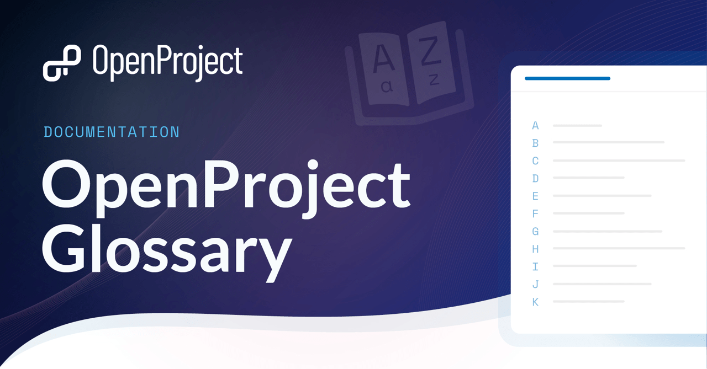
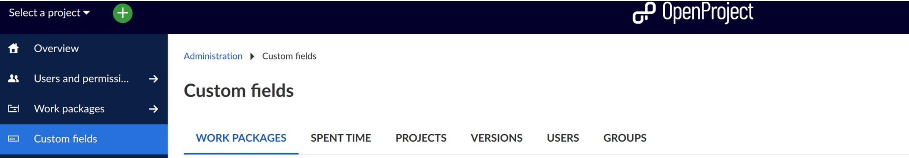
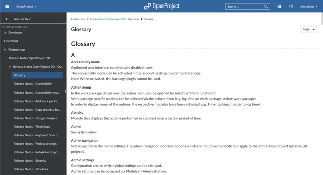
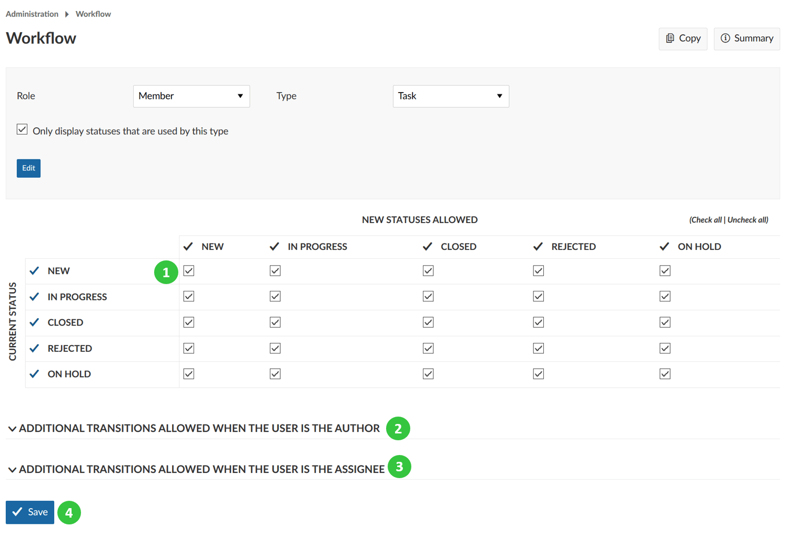
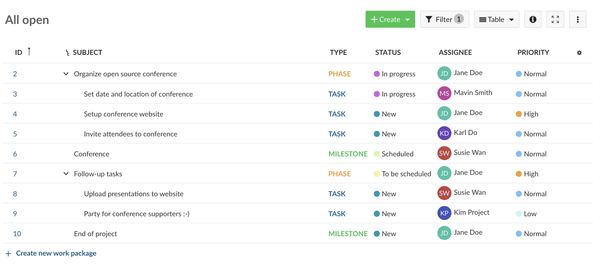

---
sidebar_navigation:
  title: Glossary
  priority: 945
description: Glossary of OpenProject project management software related terms, with definitions and additional links.
keywords: glossary, help, documentation, terms, keywords, vocabulary, definition, dictionary, lexicon, index, list, wordbook
---

# OpenProject Glossary

Project management is a complex process. At the same time, when it comes to software, there are many technical words involved. When these two things come together, it creates an interesting tool that introduces a completely new way of doing things. This new way of doing things has its own set of terms and concepts. In this glossary, you will find the most commonly used terms in OpenProject Software. Each term is defined briefly and supplemented with links to get more information if needed.

[A](#a)
[B](#b)
[C](#c)
[D](#d)
[E](#e)
[F](#f)
[G](#g)
[H](#h)
[I](#i)
[M](#m)
[N](#n)
[O](#o)
[P](#p)
[Q](#q)
[R](#r)
[S](#s)
[T](#t)
[U](#u)
[V](#v)
[W](#w)

## A

### Admin

In OpenProject, the person who has administrative rights in an instance is called **system admin**. All information concerning the configuration of an OpenProject instance are documented in the [System admin guide](../system-admin-guide/#system-admin-guide). Please note that an 'admin' can also describe the role of a person inside a project. This person would be called **project admin** and usually has specific rights on a project level. A project admin does not necessarily have system admin rights.

### Agile project management

Agile project management is an iterative and flexible approach to managing projects. It focuses on collaboration, adaptability, and self-organizing teams. OpenProject supports agile project management as well as [classic project management](#classic-project-management), and works best for [hybrid project management](#hybrid-project-management).

### Attribute help texts

OpenProject offers Attribute help texts that provide additional information for attributes in work packages and projects, incl. custom fields. After setting them up in the Administration they are displayed when users click on the question mark symbol next to this specified attribute for projects and work packages. [Read more about Attribute help texts in OpenProject](../system-admin-guide/attribute-help-texts/).

### Authentication

In OpenProject, authentication is an important element to guarantee a data protected usage. To adapt these authentication settings, you need to have [admin](#admin) rights. Navigate to your username and select -> Administration -> Authentication. At OpenProject, we use [OAuth 2.0](#oauth) as this is the definitive industry standard for online authorization.

**More information on authentication in OpenProject**

- [See answers to frequently asked questions (FAQ) for authentication](../system-admin-guide/authentication/authentication-faq/)
- [See our blog post on multi-factor authentication to improve data security](https://www.openproject.org/blog/multi-factor-authentication-for-data-security/)
- [Read more about Two-factor authentication (2FA) in OpenProject](../system-admin-guide/authentication/two-factor-authentication/)
- [Read more about LDAP Authentication in OpenProject](../system-admin-guide/authentication/ldap-connections/)

## B

### Backlogs

Backlogs is a [module](#module) in OpenProject that brings features that support the Scrum methodology in OpenProject, such as a product backlog and sprint backlogs, a task board, estimation of story points, a burndown chart and a Scrum wiki. In order to use backlogs in OpenProject, the backlogs module has to be activated in the [project settings](#project-settings) by a project admin. [Read how to work with backlogs in OpenProject](../user-guide/backlogs-scrum).

### Baseline comparison

Baseline is a feature in OpenProject that allows users to quickly track changes on [filtered](#filters) work packages table views. Project managers can use baseline to get a quick overview of what has changed over time, making it easier to report on project progress and status. [Read more about OpenProject's Baseline comparison](../user-guide/work-packages/baseline-comparison/).

### BIM

BIM stands for Building Information Modeling. In OpenProject, we offer a special OpenProject version for users working in the construction industry. On top of the general project management features, OpenProject BIM enables construction teams to better plan, communicate and collaborate in their building projects. [Read the OpenProject BIM guide to get more information](../bim-guide/).

### Board

A board in OpenProject is a view that allows you to see your work packages as cards divided into columns. A board is a typical element in [agile project management](#agile-project-management), supporting methodologies such as Scrum or Kanban. As a [Community user](#community-edition) of OpenProject, you can use a [basic board](../user-guide/agile-boards/#basic-board-community-edition). [Advanced action boards](../user-guide/agile-boards/#action-boards-enterprise-add-on) are part of the [Enterprise add-on](#enterprise-add-on). Use advanced action boards to quickly change attributes of your work package. [Read more about boards for agile project management](../user-guide/agile-boards/)

**More information on boards in OpenProject**

- [Examples of agile boards in OpenProject](../user-guide/agile-boards/#agile-boards-examples)
- [Blog post on 5 agile boards to boost efficiency in multi-team projects](https://www.openproject.org/blog/agile-boards/)

## C

### CAPTCHA

A CAPTCHA (Completely Automated Public Turing test to tell Computers and Humans Apart) is a security mechanism used on websites to determine whether the user is a human or a bot. OpenProject offers [reCAPTCHA](../system-admin-guide/authentication/recaptcha/) and [Cloudflare Turnstile](../system-admin-guide/authentication/recaptcha/#cloudflare-turnstile-configuration) that system administrators can configure for their instance.

### Classic project management

Classic project management is a structured and sequential approach to project management. It often follows a hierarchical structure with a project manager overseeing team coordination, and is associated with methodologies like Waterfall. OpenProject supports classic project management as well as [agile project management](#agile-project-management), and works best for [hybrid project management](#hybrid-project-management).

### Cloud

OpenProject can be installed either [on-premises](#on-premises) (available for both OpenProject Community and Enterprise) or in the cloud (Enterprise only). If you choose the cloud hosting, your instance will be hosted and maintained by OpenProject – as software as a service (SaaS).

**More information on cloud hosting for OpenProject**

- [Read a blog article on OpenProject's cloud project management software](https://www.openproject.org/blog/cloud-project-management-software/)
- [See OpenProject's prices and plans](https://www.openproject.org/pricing)
- [Read a blog article on why to choose an open source cloud software](https://www.openproject.org/blog/open-source-cloud-software/)
- [See the FAQ for OpenProject Enterprise cloud](../enterprise-guide/enterprise-cloud-guide/enterprise-cloud-faq/)

### Community edition

Community edition is defined as the main and free-of-charge edition of OpenProject software. It is installed [on-premises](#on-premises) and therefore self-managed. Benefit from a wide range of features and data sovereignty in a free and open source project management software. The Community edition is actively maintained and is continuously being further developed. [Read more about OpenProject Community edition](https://www.openproject.org/community-edition/).

### Connection validation

The connection validation in OpenProject is available for the storage integrations with [Nextcloud](#nextcloud-integration) and [OneDrive/SharePoint](#onedrivesharepoint-integration). It is a manually triggered test to check the connection between OpenProject and the respective storage. [Read more about health status checks for OpenProject's external file storages](../system-admin-guide/files/external-file-storages/health-status/).

### Custom action

A custom action in OpenProject is defined as customizable buttons which trigger a certain action upon work packages. Custom actions are included in the [Enterprise](#enterprise-add-on) edition of OpenProject and part of automated *workflows*. Custom actions support you to easily update several work package attributes at once – with a single click.

**More information on custom actions in OpenProject**

- [Watch a short video how custom actions work](../system-admin-guide/manage-work-packages/custom-actions/#automated-workflows-with-custom-actions-enterprise-add-on)
- [Read this guide on how to create custom actions](../system-admin-guide/manage-work-packages/custom-actions/#create-custom-actions)
- [Read this blog article on how to create an intelligent workflow with custom action - explained with an example](https://www.openproject.org/blog/customize-workflows/)

### Custom field

In OpenProject, a custom field is defined as an additional field which can be added to existing fields. Custom fields can be created for the following resources: [work packages](#work-package), [spent time](#time-and-costs), [versions](#versions), [users](#user), and [groups](#group).

**More information on custom fields in OpenProject**

- [Read how to enable custom fields in projects to use them in work packages](../user-guide/projects/project-settings/custom-fields/)
- [Read how to create custom fields as a system admin in OpenProject](../system-admin-guide/custom-fields/)

### Custom query

A custom query in OpenProject consists of saved [filters](#filters), sort criteria, and [groupings](#group) in the [work package table](#work-package-table). Custom queries can be either set to public (visible by any user who is allowed to see the project and the work package table) or to private (visible only to the person creating the query). For example, filter all work packages assigned to yourself and save this view as "assigned to me", to quickly navigate to those work packages.

## D

### Dark mode

The dark mode for OpenProject is a personal setting to display the application in a dark theme. Other available modes are the regular light mode and the (light) [high contrast mode](#high-contrast-mode). [Read in our documentation how to enable dark mode](../user-guide/my-account/#select-the-dark-mode).

### Dashboard

A dashboard is defined as an overview page in a software. In OpenProject, you have several options to create dashboards:

1. You have the [My Page](#my-page), which shows your personal customized [widgets](#widget) on one page, for example a calendar or work package reports.

2. You have the [project overview](#project-overview) dashboard, which gives you an overview of your project. Please note that only project admins can add and remove widgets to the project overview.

In addition to those overview dashboard options, you can create a [custom query](#custom-query) to save a filtered work package view, which might serve you as kind of a dashboard as well.

### Date alerts

Date alerts in OpenProject are an [Enterprise add-on](#enterprise-add-on) and defined as a feature to generate automatic and customized [notifications](#notifications) regarding a work package's due date or start date. You can find the date alerts feature in your notification center, symbolized by a little bell on the right upper side of your instance. [Read more about the date alerts feature in our user guide](../user-guide/notifications/notification-settings/#date-alerts-enterprise-add-on) or in [this article on deadline management with OpenProject](https://www.openproject.org/blog/deadline-management-date-alert/).

## E

### Enterprise add-on

In OpenProject, some features are defined as an Enterprise add-on. This means, they are not part of the [Community edition](#community-edition) and therefore not free of charge. Enterprise add-ons are available as [cloud](#cloud) or [on-premises](#on-premises) versions. You can choose from the following plans to get access to all Enterprise add-ons: Basic, Professional, Premium and Corporate. [Read more about OpenProject plans and pricing](https://www.openproject.org/pricing/).

### Enumerations

Enumerations in OpenProject is defined as a menu item in the admin settings that allows the configuration of Activities (for [time tracking](#time-and-costs)), [project status](#project-status) and work package priorities. [Read more about enumerations in OpenProject](../system-admin-guide/enumerations/).

### Excel synchronization

Excel synchronization is an integration in OpenProject which allows you to easily import your issues from Excel to OpenProject or upload your work packages into an Excel spreadsheet. [See our video tutorials on how to work with the Excel synchronization integration](../system-admin-guide/integrations/excel-synchronization/).

## F

### File storage

File storages can be configured in the System Administration and then be selected in the [project settings](#project-settings). OpenProject offers a [Nextcloud integration](#nextcloud-integration) to support file storage. [More information on file storage with the Nextcloud integration](../user-guide/file-management/nextcloud-integration/).

### Filters

Filters are essential for task and project management in OpenProject. You have several filtering options applicable to a [work package table](#work-package-table). Filter options can be saved via [custom queries](#custom-query). A filtered work packages table view (e.g. only open work packages) can be saved and therefore work as a [dashboard](#dashboard).

### Forum

A forum in OpenProject is defined as a module used to display forums and forum messages. The module has to be activated in the [project settings](#project-settings) by a project admin and a forum has to be created in the forums tab in the project settings to be displayed in the side navigation. [Read more about forums in OpenProject](../user-guide/forums/).

## G

### Gantt charts

The Gantt charts [module](#module) in OpenProject displays the work packages in a timeline. You can collaboratively create and manage your project plan. Have your project timelines available for all team [members](#member), and share up-to-date information with stakeholders. You can add start and finish dates and adapt it with drag and drop in the Gantt chart. Also, you can add dependencies, predecessor or follower within the Gantt chart. [Read more about how to activate and work with Gantt charts in OpenProject](../user-guide/gantt-chart/).

### Global modules

In OpenProject, global modules are defined as a menu to access all [modules](#module) for *all* your projects. With global modules you can easily see all your project-overarching information at one place, e.g. for work packages, boards, calendars or meetings. To access the Global modules side menu, simply navigate to your [home page](#home-page) by clicking on the logo in the header, or use the grid icon in the top right corner. [Read more about global modules in OpenProject](../user-guide/home/global-modules/).

### Group

A Group in OpenProject is defined as a list of users which can be added as a member to projects with a selected [role](#role). Groups can also be assigned to work packages. New groups can be defined in Administration -> Users and permissions -> Groups.

## H

### High contrast mode

OpenProject offers a high contrast mode to make it easier for visually impaired people to use the software. This mode can be selected in the personal [account settings](../user-guide/my-account/#my-account) and will only affect the individual user's experience.

### Home page

In the OpenProject application, the home page is defined as a start page for your instance, where you get an overview about important information. From the home page you can access all global [modules](#module) of OpenProject. To get to the OpenProject application home page, click on the logo in the header of the application. [Read more about the OpenProject application home page](../user-guide/home/#application-home-page)

### Hybrid project management

Hybrid project management is an approach that combines elements of both classic and agile project management methodologies. It allows flexibility and adaptability while still incorporating structured planning and control. OpenProject works best for hybrid project management and also supports [classic project management](#classic-project-management) as well as [agile project management](#agile-project-management).

## I

### Integration

In OpenProject, you can choose from several integrations, such as the [Excel synchronization](#excel-synchronization) or the [Nextcloud integration](#nextcloud-integration). In contrast to a plugin, an integration refers to cross features between two software products (e.g., OpenProject and Nextcloud), where both pieces of software have code that is responsible for interacting with the other software, through e.g., an API. Whereas a [plugin](#plugin) is installed on top of / as part of the OpenProject installation. You'll need to actively install it. [See all available plugins and integrations for OpenProject](../system-admin-guide/integrations/).

## M

### Meetings

In OpenProject Software, Meetings is defined as a [module](#module) that allows the organization of meetings. The module has to be activated in the [project settings](#project-settings) by a project admin in order to be displayed in the side navigation. You can choose between classic meetings and dynamic meetings. Please note that only dynamic meetings will remain available in the long term. [See our user guide for more information on Meeting management in OpenProject](../user-guide/meetings/).

### Member

In OpenProject Software, a member is defined as a single person in a project. Project members are added in the Members [module](#module) in the project menu.

### Module

A module in OpenProject is defined as an independent unit of functionality that can be used to extend and improve the existing core functions. A project admin can activate and de-activate modules in the project settings. Some examples for modules in OpenProject are: Forums, Time and costs, Wiki or the Work packages module. [See our user guide for more information on all modules in OpenProject](../user-guide/#overview-of-modules-in-openproject).

### My Page

The My Page in OpenProject is defined as your personal [dashboard](#dashboard) with important overarching project information, such as work package reports, news, spent time, or a calendar. It can be configured to your specific needs. [Read more about the My Page in OpenProject](../getting-started/my-page/).

## N

### News

In OpenProject, News is defined as a [module](#module) that allows the publication and use of news entries. On the news page, you can see the latest news in a project in reverse chronological order. News communicate general topics to all team members. They can be displayed on the [project overview](#project-overview). [Read more about how to work with the News module in OpenProject](../user-guide/news/).

### Nextcloud integration

OpenProject offers a Nextcloud integration which allows you to manage files in a secure and easy way, e.g. to link files or folders in Nextcloud or upload files to Nextcloud on work packages. You find the Nextcloud integration in the Files tab of your work package, if you have activated the Nextcloud integration for your instance. Get access to the OpenProject-Nextcloud integration by downloading and activating it in the built-in [Nextcloud app store](https://apps.nextcloud.com) within your Nextcloud instance. [Read more about the Nextcloud integration of OpenProject](../user-guide/file-management/nextcloud-integration/).

### Notifications

In OpenProject, you get in-app notifications about important changes that are relevant to you – for example new comments that mention you, updates to status, [type](#work-package-types) or dates or new assignments. This feature is enabled by default and can be used as an addition or an alternative to email notifications. To view the notifications, click the bell icon at the top right of the header. The bell icon will be displayed with a red badge if there are new notifications for you. [Read more about notifications in OpenProject](../user-guide/notifications/).

## O

### OAuth

OAuth is an open authorization standard. It allows you to access certain information or resources on behalf of a user without accessing their username and password on each individual service. OpenProject acts as an OAuth provider, allowing you to optionally grant permissions to access your data to authorized third-party applications or services. [Read more about OAuth applications in OpenProject](../system-admin-guide/authentication/oauth-applications/).

### OneDrive/SharePoint integration

OpenProject offers a OneDrive/SharePoint [integration](#integration) as an [Enterprise add-on](#enterprise-add-on). It must be setup by an administrator before members can use it. With this integration, users can link files and folders that are stored in OneDrive/SharePoint with work packages in OpenProject. They can also view, open and download files and folders linked to a work package. [Read more about OpenProject's OneDrive/SharePoint integration](../user-guide/file-management/one-drive-integration/).

### On-premises

OpenProject on-premises is a self-hosted version of OpenProject. As opposed to the Cloud version, you install, run and maintain the hardware locally and manage the software application there. The on-premises [Community Edition](#community-edition) is free of charge.

**More information on OpenProject on-premises**

- [See our pricing side about your options for OpenProject](https://www.openproject.org/pricing/)
- [Read a blog article comparing on-premises and cloud](https://www.openproject.org/blog/why-self-hosting-software/)
- [Read how to activate the Enterprise on-premises edition](../enterprise-guide/enterprise-on-premises-guide/activate-enterprise-on-premises/)
- [Read how to start a trial for Enterprise on-premises](../enterprise-guide/enterprise-on-premises-guide/enterprise-on-premises-trial/)

## P

### Phase

A phase in OpenProject is defined as a [work package type](#work-package-types), which usually includes several work packages of types like task or feature. For example, typical phases for a construction repair project would be the following: Project definition, detailed Design & Tender, Construction and Post project.

### Plugin

In OpenProject, you can choose from several plugins or [integrations](#integration), or add your own plugins to the Community. In contrast to an integration, a plugin is installed on top of / as part of the OpenProject installation. As an open source software, OpenProject is open to Community-created plugins. Please note that we do not guarantee error-free and seamless use of those plugins.

Your activated plugins are listed together with your [modules](#module) in your instance under --> Administration --> Plugins.

**More information on plugins in OpenProject**

- [See all available plugins and integrations for OpenProject](../system-admin-guide/integrations/)
- [Read how to create an OpenProject plugin](../development/create-openproject-plugin/)

### Primer design system

OpenProject started adopting [Github's Primer Design System](https://primer.style/) in 2023. New features will be developed using Primer and existing features will will be gradually revised. Relevant reusable components from Primer as well as common patterns and compositions of these components will be documented in our [Lookbook](https://qa.openproject-edge.com/lookbook/pages/how_to_use). [Read more about OpenProject's decision to use Primer](https://www.openproject.org/blog/primer-design-system/).

### Project

In OpenProject, a [project](../user-guide/projects/) is defined as an individual or collaborative enterprise that is carefully planned to achieve a particular aim. Projects are the central organizational unit in OpenProject. Your projects can be available publicly or internally. OpenProject does not limit the number of projects, neither in the [Community edition](#community-edition) nor in the Enterprise cloud or in Enterprise [on-premises](#on-premises) edition. If you have more than one project in your instance, projects build a structure in OpenProject. You can have parent projects and sub-projects. For example, a project can represent

- an organizational unit of a company,
- an overarching team working on one topic or
- separate products or customers.

### Project attribute

A project attribute in OpenProject is a [custom field](#custom-field) that applies to an entire project. It is displayed in the right-hand column on the project overview page and can be divided into sections for a better structure. Project attributes can be activated and deactivated either on the respective [project overview](#project-overview) page or, for managing multiple projects at once, in the global administration.

### Project folder

Project folders help collaborating in the most efficient way. They can be used with OpenProject's [Nextcloud integration](#nextcloud-integration) or with OpenProject's [OneDrive/SharePoint integration](#onedrivesharepoint-integration). [Read more about project folders in OpenProject](../user-guide/projects/project-settings/files/#project-folders).

### Project identifier

The project identifier is defined as the unique name used to identify and reference projects in the application as well as in the address bar of your browser. Project identifiers can be changed in the [project settings](#project-settings).

### Project lists

In OpenProject, project lists are very useful for project portfolio managers to get an overview of all their [projects](#project) on the instance. Access your project lists on OpenProject by either navigating to the "select a project" menu and clicking on the "Project list" button, or via the [Global modules](#global-modules). [Read more about project lists OpenProject](../user-guide/projects/project-lists/).

### Project navigation

The project navigation is the side navigation within a project. Entries in the project navigation can be added and removed by activating and deactivating [modules](#module) in the [project settings](#project-settings).

### Project overview

In OpenProject, the project overview is defined as a single [dashboard](#dashboard) page where all important information of a selected project can be displayed. The idea is to provide a central repository of information for the whole project team. Project information is added to the dashboard as [widgets](#widget). Open the project overview by navigating to "Overview" in the project menu on the left. [Read more about the project overview in OpenProject](../user-guide/project-overview/#project-overview).

### Project settings

Project settings means project-specific setting configuration. The project settings contain general settings (e.g. the name and [project identifier](#project-identifier)), configuration of [modules](#module), [work package categories](#work-package-categories) and [types](#work-package-types), [custom fields](#custom-field), [version](#versions) settings, [time tracking activities](#time-and-costs), required disk storage, [file storages](#file-storage) and [Backlogs](#backlogs) settings (if plugin is installed). [Read more about project settings in OpenProject](../user-guide/projects/#project-settings).

### Project status

The project status in OpenProject is defined as an information for yourself and the team if the project is on track – to then being able to quickly act in case it is off track. [Read more about the project status in OpenProject](../user-guide/projects/project-status/).

### Project template

A project template in OpenProject is defined as a dummy project to copy and adjust as often as you want. Project templates can be used for several projects that are similar in structure and [members](#member). Creating project templates can save time when creating new projects. [Read more about project templates in OpenProject in our user guide](../user-guide/projects/project-templates/), and see [this blog article to learn how to work with project templates](https://www.openproject.org/blog/project-templates/).

### Public project

In OpenProject, projects can be private or public. Public means that the project is visible to any user, regardless of project [membership](#member). The visibility of a project can be changed in the project settings. [Read how to set a project to public in OpenProject](../user-guide/projects/#set-a-project-to-public).

## Q

### Quick context menu

The quick context menu in OpenProject opens when you open a [work package table](#work-package-table) and then right-click on a single work package. It allows you to perform quick actions like *open details view*, *copy link to clipboard* or *create new child*. Please note that the quick context menu differs depending on whether you are in the [Gantt charts](#gantt-charts) module or not.

## R

## Repository

A repository is defined as a document or source code management system that allows users to manage files and folders via different version control systems (such as Subversion or Git). [Read more about Repository for source code control](../user-guide/repository/).

### Roadmap

In OpenProject, a roadmap is defined as an overview page displaying the [versions](#versions) sorted alphabetically and the [work packages](#work-package) assigned to them. The roadmap is displayed in the [project navigation](#project-navigation) when the work package module is activated and a version has been created ([project settings](#project-settings)).

### Role

In OpenProject, a role is defined as a set of permissions defined by a unique name. Project [members](#member) are assigned to a project by specifying a user’s, [group’s](#group) or placeholder user’s name and the role(s) they should assume in the project.

### RICE score

In product management, the RICE score indicates the level of prioritization of a single element, e.g. a feature. With the RICE scoring model, you evaluate and compare requirements with each other to decide which products or features to prioritize on the roadmap – in an as objective manner as possible. The formula for the RICE score is the following: **R**each x **I**mpact x **C**onfidence / **E**ffort

## S

### Share work packages

OpenProject offers the possibility to share work packages with external groups or users that are not [members](#member) of the project. This feature is an [Enterprise add-on](#enterprise-add-on). Every user with whom a work package is shared must either already be a user of the instance or be newly created. The latter requires special rights. [Read more about OpenProject's feature to share work packages with project non-members](../user-guide/work-packages/share-work-packages/).

### Story points

Story points is a term known in Scrum. They are defined as numbers assigned to a [work package](#work-package) used to estimate (relatively) the size of the work. In OpenProject, you can add story points to work packages. [Read how to work with story points in OpenProject](../user-guide/backlogs-scrum/work-with-backlogs/#working-with-story-points).

## T

### Team planner

The team planner in OpenProject is defined as a [module](#module) ([Enterprise add-on](#enterprise-add-on)) that helps you get a complete overview of what each [member](#member) of your team is working on – in different timeframes. You can use it to track the current progress of [work packages](#work-package) your team is working on, schedule new tasks, reschedule them or even reassign them to different members. [Read more about the OpenProject team planner](../user-guide/team-planner/).

### Time and costs

Time and costs in OpenProject is defined as a [module](#module) which allows users to log time on [work packages](#work-package), track costs and create time and cost reports. Once the time and costs module is activated by a project admin, time and unit cost can be logged via the action menu of a work package. Logged time and costs can be searched for, aggregated and reported using the Cost reports menu item. [Read more about the time and costs module in OpenProject](../user-guide/time-and-costs/).

### Time tracking button

The time tracking button in OpenProject is a feature to track time spent on work packages in real time. [Read more about logging time via the time tracking button in OpenProject](../user-guide/time-and-costs/time-tracking/#log-time-via-the-time-tracking-button).

## U

### User

In OpenProject, a user is defined as a person who uses OpenProject, described by an identifier. New users can be created in the admin settings. Users can become project [members](#member) by either assigning them a role and adding them via the [project settings](#project-settings). Or by adding them to a project by the system admin at: Administration --> Users and permissions --> Users. Then clicking on the username and navigating to the tab "Projects".

### User guide

The OpenProject [user guide](../user-guide/) is an in-depth guide of all features in OpenProject. It offers users detailed information about how to use OpenProject's features, [modules](#module), [integrations](#integration) and more. For more technical information on how to configure your OpenProject instance, see our [system admin guide](../system-admin-guide/).

## V

### Versions

Versions in OpenProject are defined as an attribute for [work packages](#work-package) or in the [Backlogs](#backlogs) module. Versions will be displayed in the [Roadmap](#roadmap). In the [Enterprise edition](#enterprise-add-on), you can also create a version [board](#board) to get an overview of the progress of your versions. [Read more about how to manage versions in OpenProject](../user-guide/projects/project-settings/versions/).

## W

### Widget

A widget in OpenProject is defined as a small and customizable element that provides relevant information at a glance. Use widgets on your [My Page](#my-page) dashboard or on the [project overview](#project-overview). [See all available project overview widgets](../user-guide/project-overview/#available-project-overview-widgets) and read [how to add a widget to the project overview](../user-guide/project-overview/#widgets).

### Wiki

In OpenProject, a wiki is defined as a [module](#module) that allows to use wiki pages. In order to use the wiki module, it has to be activated in the [project settings](#project-settings) by a project admin. [Read more about wikis in OpenProject](../user-guide/wiki/).

### Work, Remaining Work and % Complete

In OpenProject, '**Work**' refers to a work package attribute indicating the estimated hours and days needed to complete a task.  
'**Remaining work**' is a work package attribute that shows how much work is left to finish the work package. It is automatically calculated if you work with [status-based progress reporting](../user-guide/time-and-costs/progress-tracking/#status-based-progress-reporting). And '**% Complete**' is an automatically calculated work package attribute that shows in percentage how much work is already completed. All three attributes are important for [progress reporting with OpenProject](https://www.openproject.org/blog/changes-progress-work-estimates/).

To make it easier for project managers to work with work package hierarchies, OpenProject also displays a value (in blue) for the total amount of work in the Work field for parent work packages – next to the value for the dedicated work package. This **total work value** is the sum of the work value of the parent work package and all the work values of its children. The same principle applies to the work package attribute Remaining Work. [Read in our user guide about how to configure a work package](../user-guide/work-packages/work-package-table-configuration/)

### Workflow

A workflow in OpenProject is defined as the allowed transitions between status for a [role](#role) and a type, i.e. which status changes can a certain role implement depending on the [work package type](#work-package-types). Workflows can be defined in the admin settings. For example, you might only want developers to be able to set the status "developed". [Read more about work package workflows in OpenProject](../system-admin-guide/manage-work-packages/work-package-workflows/#manage-work-package-workflows).

### Work package

In OpenProject, a [work package](../user-guide/work-packages/#overview) is defined as an item in a project. It is a subset of a project that can be assigned to users for execution, such as Tasks, Bugs, User Stories, Milestones, and more. Work packages have a [type](#work-package-types), an [ID](#work-package-id) and a subject and may have additional attributes, such as assignee, responsible, [story points](#story-points) or [version](#versions). Work packages are displayed in a project timeline (unless they are [filtered](#filters) out in the timeline configuration) - either as a milestone or as a [phase](#phase). In order to use the work packages, the work package module has to be activated in the [project settings](#project-settings) by a project admin.

**More information on work packages in OpenProject**

- [Read our user guide on work packages](../user-guide/work-packages/)
- [Read a blog article on how to work with work packages](https://www.openproject.org/blog/how-to-work-with-work-packages/)

### Work package categories

Work package categories are a functionality used to automatically assign a [member](#member) to a work package by specifying a category. [Read more about work package categories in OpenProject](../user-guide/projects/project-settings/work-package-categories/#manage-work-package-categories).

### Work package ID

Work package ID is defined as a unique ascending number assigned to a newly created work package. Work package IDs cannot be changed and are numbered across all projects of an OpenProject instance (therefore, the numbering within a project may not be sequential).

### Work package table

The work package table in OpenProject is defined as the overview of all work packages in a project, together with their attributes in the columns. A synonym for work package table is the term "work package list". [Read how to configure a work package table](../user-guide/work-packages/work-package-table-configuration/).

### Work package types

Work package types are the different items a work package can represent. Each work package is associated to exactly one type. Examples for most used work package types are a Task, a Milestone, a [Phase](#phase) or a Bug. The work package types can be customized in the system administration. [Read more about work package types in OpenProject](../user-guide/projects/project-settings/work-package-types/#work-package-types).

### Work package view

A list of work packages is considered a view. The containing work packages in any view can be displayed a number of different ways. Examples for most used work package views are the [table view](#work-package-table), the full screen view or the split screen view. You can also display work packages  in a card view and use them in a [board](#board) to use agile methods. [Read more about work package views in OpenProject](../user-guide/work-packages/work-package-views/#work-packages-views).

### WYSIWYG editor

WYSIWYG stands for 'What you see is what you get'. A WYSIWYG editor is a content editing interface that allows users to create and edit content so that it visually resembles the final result. In OpenProject, you can use WYSIWYG editors in [wikis](#wiki), [forums](#forum) and [work package](#work-package) descriptions and comments.