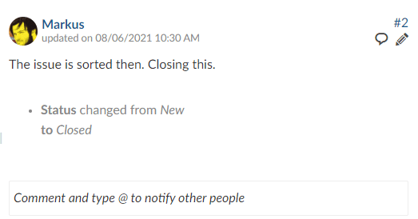
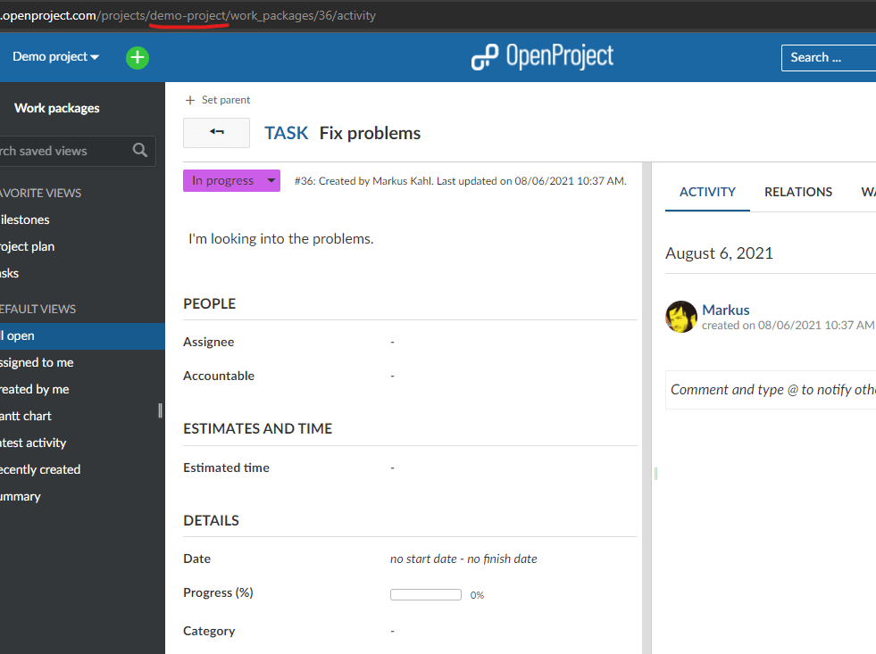

---
sidebar_navigation:
  title: Configuring inbound emails
  priority: 7
description: Configuring inbound emails in OpenProject.
keywords: incoming, e-mail, inbound, mail
---

# Configuring inbound emails

OpenProject is able to receive incoming emails and create and update work packages and reply in forums depending on the content of the email.
If you're using the Enterprise cloud you can skip the Setup section, as the settings are already configured.

## Setup

Receiving emails is done via a rake task that fetches emails from an email server, parses them and performs actions depending on the content of the email. This rake task can be executed manually or automatically, e.g. with the help of a Cron job.

The rake task `redmine:email:receive_imap` fetches emails via IMAP and parses them.

**Packaged installation**

IMAP:

```shell
openproject run bundle exec rake redmine:email:receive_imap host='imap.gmail.com' username='test_user' password='password' port=993 ssl=true ssl_verification=true allow_override=type,project project=test_project
```

Gmail:

```shell
openproject run bundle exec rake redmine:email:receive_gmail credentials='/path/to/credentials.json' user_id='test_user' query='is:unread label:openproject' allow_override=type,project
```

**Docker installation**

The docker installation has a ["cron-like" daemon](https://github.com/opf/openproject/blob/dev/docker/prod/cron) that will imitate the above cron job. You need to specify the following ENV variables (e.g., to your env list file)

- `IMAP_SSL` set to true or false depending on whether the ActionMailer IMAP connection requires implicit TLS/SSL (defaults to true)
- `IMAP_SSL_VERIFICATION` set to true or false depending on whether the SSL certificate should be verified (defaults to true)
- `IMAP_PORT` `IMAP_HOST` set to the IMAP host and port of your connection
- `IMAP_USERNAME` and `IMAP_PASSWORD`

Optional ENV variables:

- `IMAP_CHECK_INTERVAL=600` Interval in seconds to check for new mails (defaults to 10minutes)
- `IMAP_ALLOW_OVERRIDE` Attributes writable (true for all), comma-separated list as specified in `allow_override` configuration.

Available arguments for this rake task that specify the email behavior are

|key |Docker ENV variable | description|
|----|------------|------------|
| `host` | `IMAP_HOST` | address of the email server |
| `username` | `IMAP_USERNAME` | the name of the user that is used to connect to the email server |
| `password` | `IMAP_PASSWORD` | the password of the user |
| `port` | `IMAP_PORT` | the port that is used to connect to the email server |
| `ssl` | `IMAP_SSL` and ``IMAP_SSL_VERIFICATION` | specifies if SSL should be used when connecting to the email server |
| `folder` | `IMAP_FOLDER` | the folder to fetch emails from (default: INBOX) |
| `move_on_success` | `IMAP_MOVE_ON_SUCCESS` | the folder emails that were successfully parsed are moved to (instead of deleted, example: INBOX.success) |
| `move_on_failure` | `IMAP_MOVE_ON_FAILURE` | the folder emails that were ignored are moved to (example: INBOX.failed) |

Available arguments that change how the work packages are handled:

| key | Docker ENV variable | description |
|---|---|---|
| `project` | `IMAP_ATTR_PROJECT` | identifier of the target project |
| `category` | `IMAP_ATTR_CATEGORY` | name of the target category |
| `priority` | `IMAP_ATTR_PRIORITY` | name of the target priority |
| `status` | `IMAP_ATTR_STATUS` | name of the target status |
| `version` | `IMAP_ATTR_VERSION` | name of the target version |
| `type` | `IMAP_ATTR_TYPE` | name of the target type |
| `assigned_to` | `IMAP_ATTR_ASSIGNED_TO` | name of the assigned user |
| `unknown_user` | `IMAP_UNKNOWN_USER` | ignore: email is ignored (default), accept: accept as anonymous user, create: create a user account |
| `allow_override` | `IMAP_ALLOW_OVERRIDE` | specifies which attributes may be overwritten though specified by previous options. Comma separated list |

**Gmail API**

In order to use the more secure Gmail API method, some extra initial setup in google cloud is required.

1. Go to https://console.cloud.google.com/
2. Create new project
3. Navigate to Enable APIs and Services
4. Enable the Gmail API
5. Navigate to the "Credentials" page for the project
6. Click "Create Credentials" > "Service Account"
7. Give the service account editor permissions and click "Done"
8. Click on the new service account, go to the "Keys" tab, and add a new key.
9. Save the JSON key file
    ***Note: Do not give anyone access to this JSON file as it contains the private key to your service account!***
10. Go to https://admin.google.com
11. Select Security > Access and Data Control > API Controls
12. Go to "Domain-Wide Delegation"
13. Add new API Client
14. Open JSON key file and copy "client_id" number
15. Enter `https://www.googleapis.com/auth/gmail.modify` into the scopes
    ***Note: Modify permissions are necessary here to mark emails as read***
    ***This is so the service account can access all accounts in your Domain***

Available arguments for the Gmail API rake task that specify the email behavior are

|key | description|
|----|------------|
| `credentials` | Gmail service account credentials file (JSON) |
| `username` | Gmail email address |
| `query` | Gmail search query (https://support.google.com/mail/answer/7190?hl=en) |
| `read_on_failure` | Mark emails as read even on failure (default: true) |
| `max_emails` | Max emails to process (default: 1000) |

## Format of the emails

Please note: It's important to use the plain text editor of your email client (instead of the HTML editor) to avoid misinterpretations (e.g. for the project name).

### Work packages

Let's start with two examples right away to get you started.
You can learn more about the details below.

**Work package update**

When you receive a work package notification you can simply reply to that email
and it will be added as a comment to the work package. You can also update attributes.

For instance with the following reply.

```text
status: closed

The issue is sorted then. Closing this.
```

This will add the comment and close the work package.



**Work package creation**

You can also create new work packages via email. Make sure to send your email to the same address you would
use when replying to a work package notification.

When creating a work package, the project it will be created in will either be pre-defined via configuration (see below) or you will have to define it at the start of the email. You can also define its other attributes
there.

For example if you write an email with the subject "Fixing problems" and the following body:

```text
project: demo-project
type: Task
status: In Progress

I'm looking into the problems.
```

It will create a new work package in the Demo Project of type task which is in progress.
`demo-project` is the project's identifier which you can see either in the project settings
or simply by looking at the address bar in your browser when you are in the project.



#### Sending user address

The address the mail is sent from must match an existing account in order to map the user action.
If a matching account is found, the mail handler impersonates the user to create the ticket.

If no matching account is found, the mail is rejected. To override this behavior and allow unknown mail address
to create work packages, set the option `no_permission_check=1` and specify with `unknown_user=accept`

**Note**: This feature only provides a mapping of mail to user account, it does not authenticate the user based on the mail. Since you can easily spoof mail addresses, you should not rely on the authenticity of work packages created that way. At the moment in the OpenProject Enterprise cloud work package generation by emails can only be triggered by registered email addresses.

**Users with mail suffixes**

If you're used to using mail accounts with suffix support such as Google Mail, where you can specify `account+suffix@googlemail.com`, you will receive mails to that account but respond with your regular account `account@googlemail.com` . To mitigate this, OpenProject by default will expand searching for mail addresses `account@domain` to accounts `account+suffix@domain`  through regex searching the mail column. If you do not wish that behavior or want to customize the prefix, alter the setting `mail_suffix_separators` by running `bundle exec rails runner "Setting.mail_suffix_separators = ''"`

#### Attributes

The Attributes you can use in your email are the same whether you create or update a work package.

Only the `project` attribute is a bit special:

You must either add `project` to the set of allowed overridden attributes with `allow_override=project,..` in order to use it in a mail,
OR set it as fixed variable with `project=identifier`.

The subject of the work package that shall be created is derived from the subject of the email. The body of the email gets parsed and all lines that contain recognized keys are removed. What is left will become the description.

Other available keys for the email are:

| Key             | Description                                           | Example                          |
|-----------------|-------------------------------------------------------|----------------------------------|
| Project         | sets the project. Use the project identifier          | Project:test\_project            |
| Accountable     | sets the accountable, via user email or login         | Accountable:user@example.org     |
| Assignee        | sets the assignee. Use the email or login of the user | Assignee:test.nutzer@example.org |
| Type            | sets the type                                         | type:Milestone                   |
| Version         | sets the version                                      | version:v4.1.0                   |
| Start date      | sets the start date                                   | start date:2015-02-28            |
| Due date        | sets the finish date                                  |                                  |
| Estimated hours | sets the estimated hours. Use a number                | Estimated hours:10.5             |
| Remaining hours | sets the remaining hours. Use a number                | Remaining hours:2.5              |
| Status          | sets the status                                       | Status:closed                    |
| priority        | sets the priority                                     | priority:High                    |

If you want to set a custom field just use the name as it is displayed in your browser, e.g. `Custom field:new value`

**Notice: The keys are not case-sensitive but the values you want to set are.**

#### Attachments

If you create or update a work package via email the attachments of the email will be attached to the relevant work package.

#### Watchers

If you create a work package via email and sent it to another email (to or bcc) OpenProject will search for a user with this email and add it as watcher.

### Truncate Emails

In the administrator's setting you can specify lines after which an email will not be parsed anymore. That is useful if you want to reply to an email automatically sent to you from OpenProject. E.g. you could set it to `--Truncate here--` and insert this line into your email below the updates you want to perform.

## Error handling

In case of receiving errors, the application will try to send an email to the user with some error details. This mail will only be sent if:

- The incoming mail has been read by the application. If the setup above fails to read the email at all, this will obviously not be able to respond anything

- The user is active on the system (Note that this happens on `unknown_user=create` as well)

- The configuration setting `report_incoming_email_errors` is true (which it is by default)

By returning an email with error details, you can theoretically be leaking information through the error messages. As from addresses can be spoofed, please be aware of this issue and try to reduce the impact by setting up the integration appropriately.

If you'd like to disable the reporting of errors to the sender, please set `report_incoming_email_errors=false`:

- In a packaged installation, run `openproject config:set OPENPROJECT_REPORT__INCOMING__EMAIL__ERRORS=false` and restart the openproject service.
- In a docker system, add the ENV `OPENPROJECT_REPORT__INCOMING__EMAIL__ERRORS=false`
