---
sidebar_navigation:
  title: Packages
  priority: 400
---

# Install OpenProject with DEB/RPM packages

The packaged installation of OpenProject is the recommended way to install and maintain OpenProject using DEB or RPM packages.

The package will:

- guide you through all the required steps

- install all the required libraries and dependencies

- install a local PostgreSQL database or allow you to connect to an existing PostgreSQL database

- allow you to install and configure an outer Apache web server (recommended)

- setup SSL/TLS encryption for the Apache server (optional)

- configure repositories (Git/SVN) (optional)

- configure email settings

The package is available for the following Linux distributions:

| Distribution (64 bits only)                 |
|---------------------------------------------|
| [Ubuntu 22.04 Jammy](#ubuntu-2204)          |
| [Ubuntu 20.04 Focal](#ubuntu-2004)          |
| [Debian 12 Bookworm](#debian-12)            |
| [Debian 11 Bullseye](#debian-11)            |
| [CentOS/RHEL 9.x](#centos-9--rhel-9)        |
| [CentOS/RHEL 8.x](#centos-8--rhel-8)        |
| [Suse Linux Enterprise Server 15](#sles-15) |

Please ensure that you are running on a 64bit system before proceeding with the installation. You can check by running the `uname -i` command on the target server and verifying that it outputs `x86_64`:

```shell
$ uname -m
x86_64
```

> **Important note:** Please note that the packaged installation works best when running on a dedicated server or virtual machine, as we cannot ensure that the components installed and configured by the OpenProject installer will work on systems that have been already customized. If you must install OpenProject on a server where other software is running, or with an already configured Apache or NginX server, then you should have a look at the Docker-based installation instead.

## Ubuntu Installation

### Ubuntu 22.04

Update the `apt` package index and install packages to allow `apt` to use a repository over HTTPS:

```shell
sudo apt-get update
sudo apt-get install apt-transport-https ca-certificates wget
```

Import the PGP key used to sign our packages:

```shell
sudo wget -O /etc/apt/trusted.gpg.d/openproject.asc https://dl.packager.io/srv/opf/openproject/key
```

Add the OpenProject package source:

```shell
sudo wget -O /etc/apt/sources.list.d/openproject.list \
  https://dl.packager.io/srv/opf/openproject/stable/14/installer/ubuntu/22.04.repo
```

Download the OpenProject package:

```shell
sudo apt-get update
sudo apt-get install openproject
```

Then finish the installation by reading the [*Initial configuration*](#initial-configuration) section.

<video src="https://openproject-docs.s3.eu-central-1.amazonaws.com/videos/openproject-installation-ubuntu.mp4" type="video/mp4" controls="" style="width:100%"></video>

### Ubuntu 20.04

Update the `apt` package index and install packages to allow `apt` to use a repository over HTTPS:

```shell
sudo apt-get update
sudo apt-get install apt-transport-https ca-certificates wget
```

Import the PGP key used to sign our packages:

```shell
wget -qO- https://dl.packager.io/srv/opf/openproject/key | sudo apt-key add -
```

Add the OpenProject package source:

```shell
sudo wget -O /etc/apt/sources.list.d/openproject.list \
  https://dl.packager.io/srv/opf/openproject/stable/14/installer/ubuntu/20.04.repo
```

Download the OpenProject package:

```shell
sudo apt-get update
sudo apt-get install openproject
```

Then finish the installation by reading the [*Initial configuration*](#initial-configuration) section.

## Debian Installation

### Debian 12

As root update the `apt` package index and install packages to allow `apt` to use a repository over HTTPS:

```shell
su -
apt update
apt install apt-transport-https ca-certificates wget gpg
```

Import the PGP key used to sign our packages:

```shell
wget -qO- https://dl.packager.io/srv/opf/openproject/key | gpg --dearmor > /etc/apt/trusted.gpg.d/packager-io.gpg
```

Add the OpenProject package source:

```shell
wget -O /etc/apt/sources.list.d/openproject.list \
  https://dl.packager.io/srv/opf/openproject/stable/14/installer/debian/12.repo
```

Download the OpenProject package:

```shell
apt update
apt install openproject
```

Then finish the installation by reading the [*Initial configuration*](#initial-configuration) section.

### Debian 11

As root update the `apt` package index and install packages to allow `apt` to use a repository over HTTPS:

```shell
su -
apt update
apt install apt-transport-https ca-certificates wget gpg
```

Import the PGP key used to sign our packages:

```shell
wget -qO- https://dl.packager.io/srv/opf/openproject/key | gpg --dearmor > /etc/apt/trusted.gpg.d/packager-io.gpg
```

Add the OpenProject package source:

```shell
wget -O /etc/apt/sources.list.d/openproject.list \
  https://dl.packager.io/srv/opf/openproject/stable/14/installer/debian/11.repo
```

Download the OpenProject package:

```shell
apt update
apt install openproject
```

Then finish the installation by reading the [*Initial configuration*](#initial-configuration) section.

## CentOS Installation

### CentOS 9 / RHEL 9

Add the OpenProject package source:

```shell
sudo wget -O /etc/yum.repos.d/openproject.repo \
  https://dl.packager.io/srv/opf/openproject/stable/14/installer/el/9.repo
```

If it is not already enabled, make sure to enable [Extra Packages for Enterprise Linux](https://fedoraproject.org/wiki/EPEL) (EPEL).

```shell
sudo subscription-manager repos --enable codeready-builder-for-rhel-9-$(arch)-rpms
sudo dnf install https://dl.fedoraproject.org/pub/epel/epel-release-latest-9.noarch.rpm

# if using CentOS 9:
# sudo dnf config-manager --set-enabled crb
# sudo dnf install https://dl.fedoraproject.org/pub/epel/epel{,-next}-release-latest-9.noarch.rpm
```

Download the OpenProject package:

```shell
sudo yum install openproject
```

Then finish the installation by reading the [*Initial configuration*](#initial-configuration) section.

> **Note:** On this distribution full-text extraction for attachments [*is not supported*](#full-text-extraction-not-supported) by default.
>

### CentOS 8 / RHEL 8

Add the OpenProject package source:

```shell
sudo wget -O /etc/yum.repos.d/openproject.repo \
  https://dl.packager.io/srv/opf/openproject/stable/14/installer/el/8.repo
```

If it is not already enabled, make sure to enable [Extra Packages for Enterprise Linux](https://fedoraproject.org/wiki/EPEL) (EPEL).

```shell
sudo dnf install https://dl.fedoraproject.org/pub/epel/epel-release-latest-8.noarch.rpm -y
```

Download the OpenProject package:

```shell
sudo yum install openproject
```

Then finish the installation by reading the [*Initial configuration*](#initial-configuration) section.

> **Note:** On this distribution full-text extraction for attachments [*is not supported*](#full-text-extraction-not-supported) by default.
>

**Workaround for outdated PostgreSQL library package**

Depending on your version and installation variant, you might receive errors like `symbol lookup error: /opt/openproject/vendor/bundle/ruby/3.1.0/gems/pg-1.4.3/lib/pg_ext.so: undefined symbol: PQconninfo`.

This happens when your local postgresql-libs package is outdated. You'll have to install a newer version manually like so:

1. Add the package source for PostgreSQL (the exact URL might differ, double check https://www.postgresql.org/download/linux/redhat/)

`yum install -y https://download.postgresql.org/pub/repos/yum/reporpms/EL-7-x86_64/pgdg-redhat-repo-latest.noarch.rpm`

2. Install postgresql13-libs

`yum install postgresql13-libs`

## SUSE Linux Enterprise Server (SLES) Installation

**Note:** On SLES, full-text extraction for attachments [*is not supported*](#full-text-extraction-not-supported) by default.

### SLES 15

Add the OpenProject package source:

```shell
wget -O /etc/zypp/repos.d/openproject.repo \
  https://dl.packager.io/srv/opf/openproject/stable/14/installer/sles/15.repo
```

If you already had an old package source that is being updated you must refresh
your source next. It can't hurt to do this in any case, though.

```shell
sudo zypper refresh openproject
```

Next, download the OpenProject package:

```shell
sudo zypper install openproject
```

Then finish the installation by reading the [*Initial configuration*](#initial-configuration) section.

## Full-text extraction not supported

For some distributions we do not provide the required dependencies for full-text extraction of attachments. If you need this feature, please install the required dependencies (`catdoc unrtf poppler-utils tesseract-ocr`) manually. For more information, [please see the plaintext gem](https://github.com/planio-gmbh/plaintext). Once installed, check `Administration > Information` to see if OpenProject is able to pick up these dependencies.

## Initial Configuration

After you have successfully installed the OpenProject package, you can now perform the initial configuration of OpenProject, using the wizard that ships with the OpenProject package.

## Prerequisites

- If you wish to connect to an existing database server instead of setting up a local database server, please make sure to have your database hostname, port, username and password ready. The database username used to connect to the existing database must have the CREATE DATABASE privilege.

- If you want to enable HTTPS, then you will need to provide the path (on the server) to your certificate file, private key file, and CA bundle file.

## Step 0: Start the wizard

To start the configuration wizard, please run the following command  with `sudo`, or as root:

```shell
sudo openproject reconfigure #interactive - manual choices are stored in /etc/openproject/installer.dat
sudo openproject configure #non-interactive - using values stored in /etc/openproject/installer.dat
```

> **Notes:**
>
> * Every time you will run the OpenProject wizard, by using `sudo openproject reconfigure` your choices will be persisted in a configuration file at `/etc/openproject/installer.dat` and subsequent executions of `sudo openproject configure` will re-use these values, only showing you the wizard steps for options you have not yet been asked for.
>
> * In the interactive way you can skip dialogs you do not want to change simply by confirming them with `ENTER`.
>

## Step 1: Select your OpenProject edition

OpenProject comes in two editions:

* the default edition, which is targeted at general project management.

* the BIM edition, which is specifically target at the construction industry.

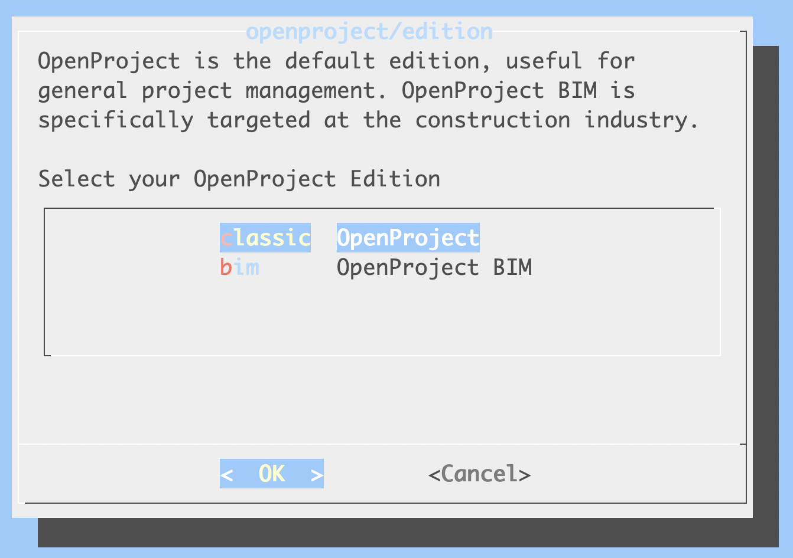

You can find more about the BIM edition on [this page](https://www.openproject.org/bim-project-management/).

> This wizard step is only available on the following distributions:
>
> * RHEL/CentOS 8
> * Ubuntu 22.04
> * Ubuntu 20.04
> * Debian 11
>
> On older distributions, this wizard step won't be displayed, and the installation will default to the default edition.

## Step 2: PostgreSQL database configuration

OpenProject requires a PostgreSQL database to store your data. This wizard step allows you to choose an option for the PostgreSQL database connection:

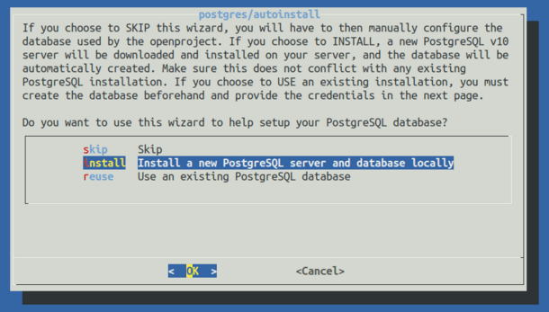

The dialog allows you to choose from three options:

### Install a new PostgreSQL server and database locally (default)

Choose this option if you want OpenProject to set up and configure a local database server manually. This is the best choice if you are unfamiliar with administering databases, or do not have a separate PostgreSQL database server installed that you want to connect to.

> **Note:** If you would like to use the database that was automatically installed by OpenProject at time of installation just choose `install` again

### Use an existing PostgreSQL database

Choose this option if you have a PostgreSQL database server installed either on the same host as the OpenProject package is being installed on, or on another server you can connect to from this machine.

The wizard will show you multiple additional steps in this case to enter the hostname, username & password as well as the database name for the PostgreSQL database.

### Skip (not recommended)

The wizard will not try to connect to any database. You will have to specify a database manually through the `DATABASE_URL` environment variable. If you choose skip and did not set a `DATABASE_URL`, the configuration process will fail.

You can set this `DATABASE_URL` parameter yourself to a PostgreSQL database URL.

```shell
sudo openproject config:set DATABASE_URL="postgresql://[user[:password]@][host][:port][/dbname][?param1=value1&...]
```

## Step 3: Apache2 web server and SSL termination

OpenProject comes with an internal ruby application server, but this server only listens on a local interface, usually on port 6000. To receive connections from the outside world, it needs a web server that will act as a proxy to forward incoming connections to the OpenProject application server.

This wizard step allows you to auto-install an Apache2 web server to function as that reverse proxy.

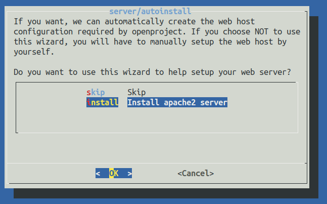

The available options are:

### **Install Apache2 web server** (default)

We recommend that you let OpenProject install and configure the outer web server, in which case we will install an Apache2 web server with a VirtualHost listening to the domain name you specify, optionally providing SSL/TLS termination.

> **Note:** In case you re-run `sudo openproject reconfigure` later it is mandatory to select `install` at the webserver again

In case you have selected to install Apache2, multiple dialogs will request the parameters for setting it up:

#### Domain name

Enter the fully qualified domain (FQDN) where your OpenProject installation will be reached at. This will become the `ServerName` of your apache VirtualHost and is also used to generate full links from OpenProject, such as in emails.

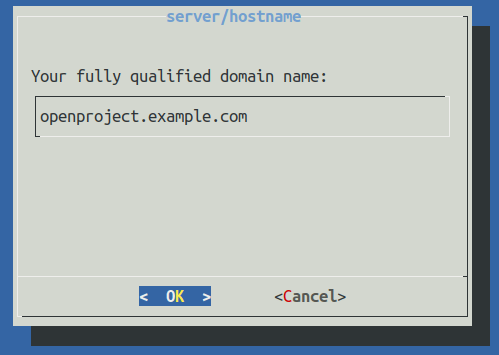

#### Server path prefix

If you wish to install OpenProject under a server path prefix, such as `yourdomain.example.com/openproject`, please specify that prefix here with a leading slash. For example: `/openproject`. If OpenProject should respond to `http(s)://yourdomain.example.com` as specified in the previous dialog, simply leave this dialog empty and confirm by pressing `ENTER`.

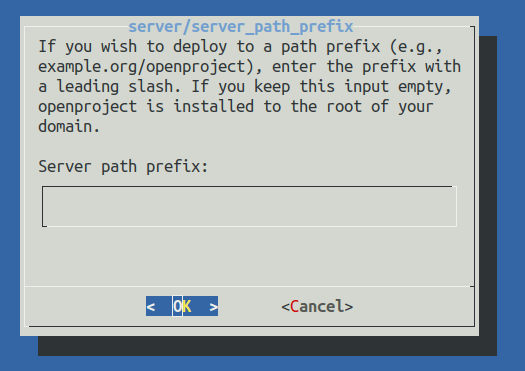

#### SSL/TLS configuration

> **Note:** With OpenProject version 12.2 **HTTPS configuration** was set to be **default** for every installation. **Now best practice is to proceed by selecting `yes` for using HTTPS (SSL/TLS)** and generating the needed certificates, otherwise you will have to manually deactivate HTTPS on the command line.

OpenProject can configure Apache to support HTTPS (SSL/TLS). If you have SSL certificates and want to use SSL/TLS (recommended), select **Yes**.

In that case, you will be shown three additional dialogs to enter the certificate details:

1. The absolute SSL certificate path
2. The absolute SSL private key path
3. The path to the Certificate Authority bundle for the certificate (optional, leave empty unless needed)

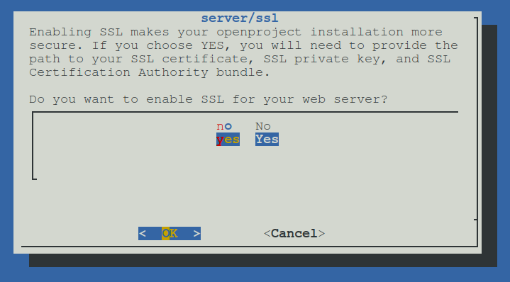

Enabling this mode will result in OpenProject only responding to HTTPS requests, and upgrade any non-secured requests to HTTPS. It will also output HTTP Strict Transport Security (HSTS) headers to the client.

#### External SSL/TLS termination

> **Note**: If you terminate SSL externally before the request hits the OpenProject server, you need to follow the following instructions to avoid errors in routing. If you want to use SSL on the server running OpenProject, skip this section.

If you have a separate server that is terminating SSL and only forwarding/proxying to the OpenProject server, you must select "No" in this dialog. However, there are some parameters you need to put into your outer configuration.

- If you're proxying to the openproject server, you need to forward the HOST header to the internal server. This ensures that the host name of the outer request gets forwarded to the internal server. Otherwise you might see redirects in your browser to the internal host that OpenProject is running on.
  - In Apache2, set the `ProxyPreserveHost On` directive
  - In NginX, use the following value: `proxy_set_header X-Forwarded-Host $host:$server_port;`
- If you're terminating SSL on the outer server, you need to set the `X-Forwarded-Proto https` header to let OpenProject know that the request is HTTPS, even though its been terminated earlier in the request on the outer server.
  - In Apache2, use `RequestHeader set "X-Forwarded-Proto" https`
  - In Nginx, use `proxy_set_header X-Forwarded-Proto https;`

- Finally, to let OpenProject know that it should create links with 'https' when no request is available (for example, when sending emails), you need to set the following setting: `openproject config:set SERVER_PROTOCOL_FORCE_HTTPS="true"` followed by an `openproject configure`. This ensures that OpenProject responds correctly with secure cookies even though it was not configured for https in the server configuration.

Here an example for external SSL/TLS termination with apache (httpd):

> **Note:** There is [another example](../docker/#1-virtual-host-root) for external SSL/TLS termination for **docker-compose** installations

```shell
<VirtualHost *:443>
   ServerName openproject.example.com
   
   # Logging
   LogLevel Warn
   ErrorLog /var/log/httpd/openproject.example.com-error.log
   CustomLog /var/log/httpd/openproject.example.com-access.log combined
   
   # Reverse Proxy
   ProxyPreserveHost On
   ProxyRequests Off
   ProxyPass / http://[OPENPROJECT-HOST-IP]/
   ProxyPassReverse / http://[OPENPROJECT-HOST-IP]/
   #ProxyPass / https://[OPENPROJECT-HOST-IP]/               # if openproject's internal apache2 server/ssl is YES 
   #ProxyPassReverse / https://[OPENPROJECT-HOST-IP]/        # if openproject's internal apache2 server/ssl is YES
   
   # Request Header
   RequestHeader set "X-Forwarded-Proto" https
   
   # SSL Certificate that was created by LetsEncrypt
   Include /etc/letsencrypt/options-ssl-apache.conf
   SSLEngine On
   #SSLProxyEngine On                                        # if openproject's internal apache2 server/ssl is YES
   SSLCertificateFile /etc/letsencrypt/live/openproject.example.com/cert.pem
   SSLCertificateKeyFile /etc/letsencrypt/live/openproject.example.com/privkey.pem
   SSLCertificateChainFile /etc/letsencrypt/live/openproject.example.com/chain.pem                       # optional
</VirtualHost>
```

### Skip Apache2 web server install (not recommended)

> **Note:** Skipping step 3 Apache2 web server install will ask later in step 7 for information about the hostname and HTTPS

The installer will not set up an external web server for accessing. You will need to either install and set up a web server such as Apache2 or Nginx to function as the web server forwarding to our internal server listening at `localhost:6000` by proxying.

Only choose this option if you have a local Apache2 installed that the OpenProject package may not control, or need to use a different web server such as Nginx. Please note that not all functionality (especially regarding Repositories) are supported on Nginx.

When installing with an existing Apache2, you can take a look at the source of our [installation  templates](https://github.com/pkgr/addon-apache2/tree/master/conf) for guidance on how to set up the integration.

[Here's an exemplary configuration](./openproject-apache-example.conf) that might work for you.

[For a minimal nginx config, please see this gist](https://gist.github.com/seLain/375d16ccd4542e3727e97a7478187d3a) as as starting point.

> **Please note:** If you reconfigure the OpenProject application and switch to `skip`, you might run into errors with the Apache configuration file, as that will not be automatically remove. Please double-check you removed references to the `openproject.conf` if you do reconfigure.

## Step 4: SVN/Git integration server

If you have selected to auto-install an Apache2 web server, you will be asked whether you want to install Git and Subversion repository support. In case you do not need it or when in doubt, choose **Skip** for both options.

For more information, [see our help on repositories](../../../user-guide/repository/)

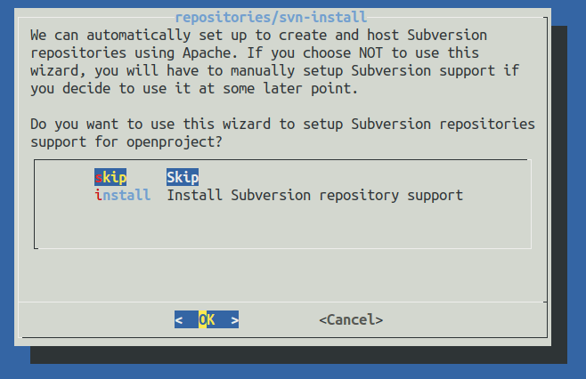

## Step 5: Administrator email

The wizard will ask you for an administrative email address so that it can create the administrator account with that email for the initial login. Enter your email address to have it tied to the admin account.

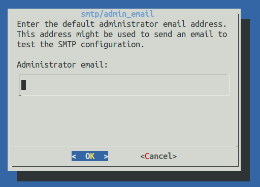

## Step 6: Memcached server

OpenProject heavily relies on caching, which is why the wizard suggests you to install a local memcached server the OpenProject instances can connect to. You should always set this to `install` unless you have a reason to configure another caching mechanism - for example when configuring multiple shared instances of OpenProject.

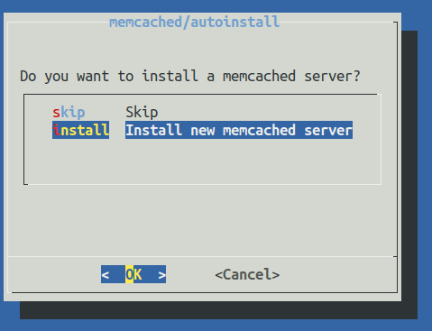

## Step 7: Host name and Protocol (if step 3 was skipped)

> **Note:** This step is only shown if you decided to skip step 3, the Apache2 installation. OpenProject still needs to know what external host name you're running on, as well as if you're using HTTPS or not.

First, enter the fully qualified domain where your OpenProject installation will be reached at. This will be used to generate full links from OpenProject, such as in emails.

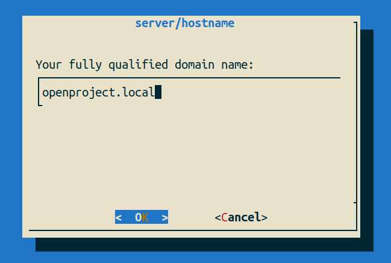

Next, tell OpenProject whether you have SSL termination enabled somewhere in your stack. Please note that you need to set up protocol forwarding by the means mentioned in the [Skip Apache2 Installation](#skip-apache2-web-server-install-not-recommended) at step 3 above.

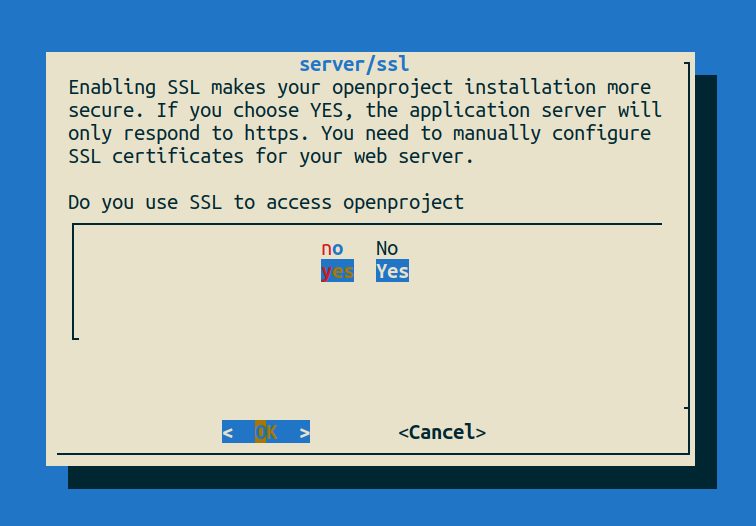

## Step 8: Default language

> **Note:** This step is only shown on the very first installation of OpenProject, as it affects only the initial seeding of the basic and demo data. Changing this value after installation will have no effect.

OpenProject can be used with a wide variety of languages. The initial data of the instance (basic data such as status names, types, etc.) as well as data for demonstrational purposes will be created in the language you select in this screen. Move through the list using the arrow keys and select the default language.

Also, this setting will control what is the default language for new users if their browser language is not available in the system.

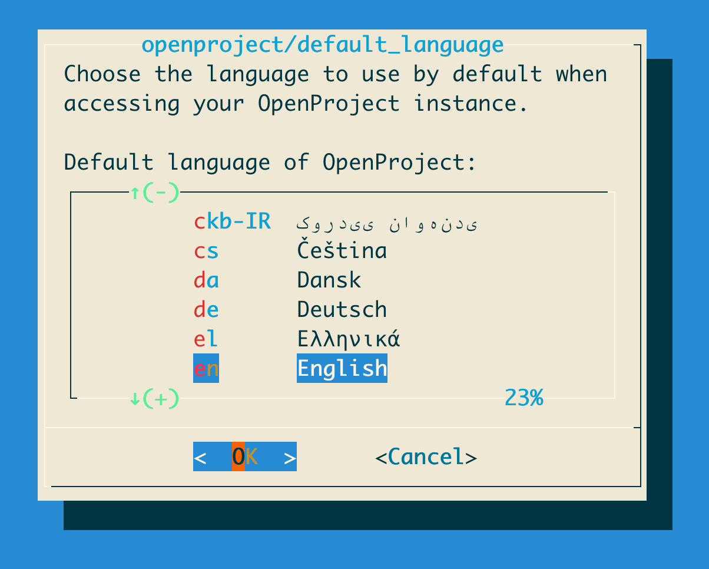

## Result

With this last step confirmed, the OpenProject wizard will complete, and apply all the configuration options that you have just selected. This might take a few minutes depending on your machine and internet connection, as OpenProject might need to install additional packages (such as the web server, database) depending on your selections.

In case this process crashes or exits with an obvious error, please keep the output and send your configuration from `/etc/openproject/installer.dat` (removing any passwords from it) to us at support@openproject.com , or [reach out to the community forums](https://community.openproject.org/projects/openproject/forums).

When this process completes, it will have started the internal application and web servers, the background jobs to process work-intensive jobs, and set up the connection to the database.

You should be able to reach the OpenProject instance by visiting your installation at `http://<openproject.example.com>/<server prefix>`.

You can then log in using the default user/password combination:

* username = `admin`
* password = `admin`

You will be asked to change this password immediately after the first login.

## Post-installation configuration

Here are some pointers to related documentation that you will need to get started:

- [Set up outgoing email notifications (SMTP, sendmail)](../../configuration/outbound-emails/)
- [Integrate an external authentication provider (LDAP/AD, SAML, OpenID)](../../../system-admin-guide/authentication/)
