---
sidebar_navigation:
  title: Jira migration
  priority: 90
description: Step-by-step guide for migrating from Jira Data Center to OpenProject using the Jira Migrator. Supported data types, limitations, and best practices for a successful migration.
keywords: Jira, Jira Migrator, Jira migration, Jira Data Center, Import tool, Migration, Migration guide 
---

# Migrating from Jira to OpenProject

Last edited on: September 30, 2026.

The OpenProject team is actively developing the Jira Migrator, an import tool for Jira Data Center. This feature is under active development. We add new features with each release. Information on this page may change as new migration options become available.

Take a look at this video introducing the Jira Migrator.

## Purpose of the Jira Migrator

With the [end of life for Jira Data Center](https://www.openproject.org/blog/jira-alternative-end-of-data-center/), many organizations are evaluating [OpenProject as a secure, open-source, and self-hosted alternative for project management and collaboration](https://www.openproject.org/alternative-atlassian-jira-data-center/).

> [!WARNING]
> This feature is under active development. Please only use it in test setups. We inform you about our progress and our recommendations when you can use it in production setups.

For concise answers to common questions, see the [Jira migration FAQ](./faq/).

## Data covered by the Jira Migrator

The Jira Migrator is currently in beta and supports the following data: 

- Projects
- Project identifiers
- Project versions
- Issues
- Issue identifiers
- Issue descriptions, history, comments, and attachments
- A subset of custom fields (see [Custom fields migration](./custom-fields/))
- Involved users and groups

See [the field mapping reference](./field-mapping/) for details.

## Data not yet covered by the Migrator 

### Coming soon

- Relations between issues
- Sprint assignments

### Coming later

- Project-level workflows
- Permissions
- Schemas

See [the field mapping reference](./field-mapping/) for details.

## Supported Jira versions

- We currently only support Jira Data Center versions 10.x and 11.x.
- Cloud instances are **not** supported at this time.

## Import preparation

### Prepare a backup

Imports change your OpenProject configuration. After the import you will have the opportunity to review the changes.
While in review, you have the option to revert or approve the import. After approving the import, reverting will no longer be possible.
Therefore, please make sure that you have [a backup of your OpenProject instance](../../system-admin-guide/backup) before proceeding.

### Set up the API connection

Navigate to _Administration → Import_. To create a new import configuration, click the **+ Jira configuration** button.

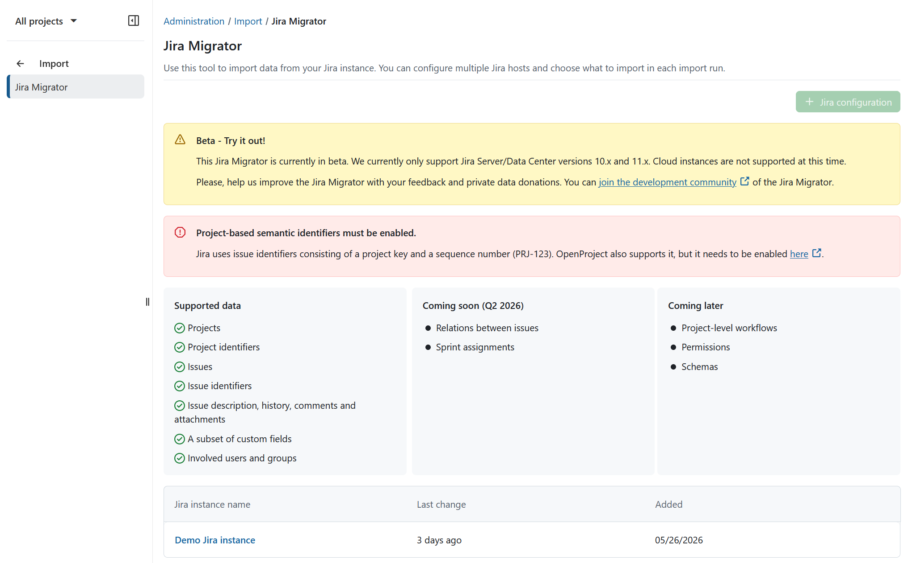
> [!IMPORTANT]
>
> To activate the configuration, you need to activate project-based semantic identifiers on the OpenProject side first. If not yet active, you will see a warning banner. Once activated, the button will become selectable. 

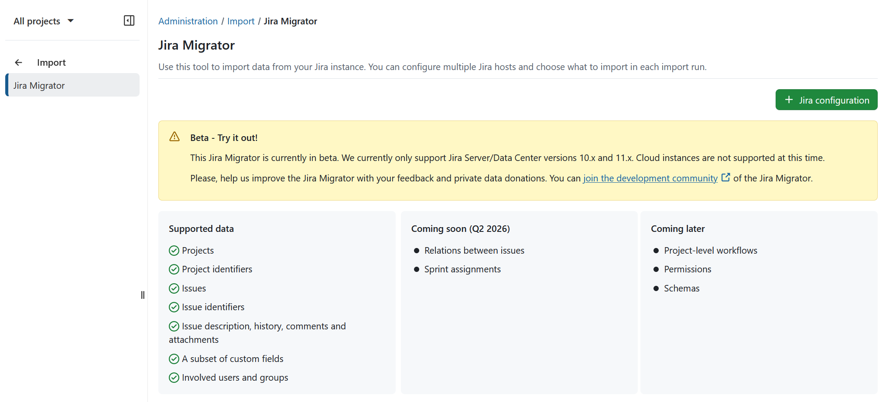

Provide the following details:

- A name for the import configuration
- Your Jira URL
- A Personal Access Token. The migration tool requires a token with admin permissions. Otherwise, you will get a 403 error during the import process.

### Test configuration

Click **Test configuration** to verify the connection.

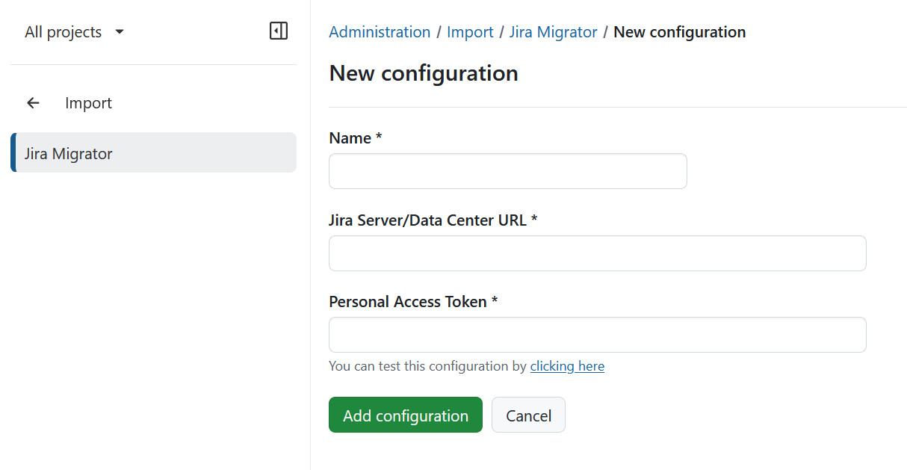
If the connection is successful, a confirmation banner will appear.

> [!IMPORTANT]
> If your Jira instance is hosted on a private or internal network (e.g., a corporate intranet), the connection test may fail because OpenProject blocks outbound requests to non-public IP addresses by default. This is a security measure to prevent SSRF attacks. To allow connections to internal IP addresses, configure the `OPENPROJECT_SSRF__PROTECTION__IP__ALLOWLIST` environment variable. See [SSRF protection](../configuration/ssrf-protection/) for details.

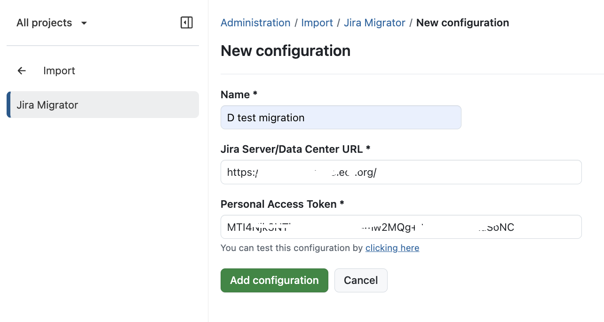

Click **Add configuration** to proceed to the import runs overview. Initially, no import runs will be listed.

## Import run

You can import different sets of data with each import run. It is possible to undo an import run while it is in review mode, but not after approving.

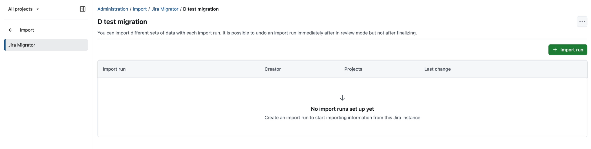

Click **Import run** to start a new import.

### Check available data

In the _Get base data_ section, click **Check available data** to retrieve metadata from your Jira instance.

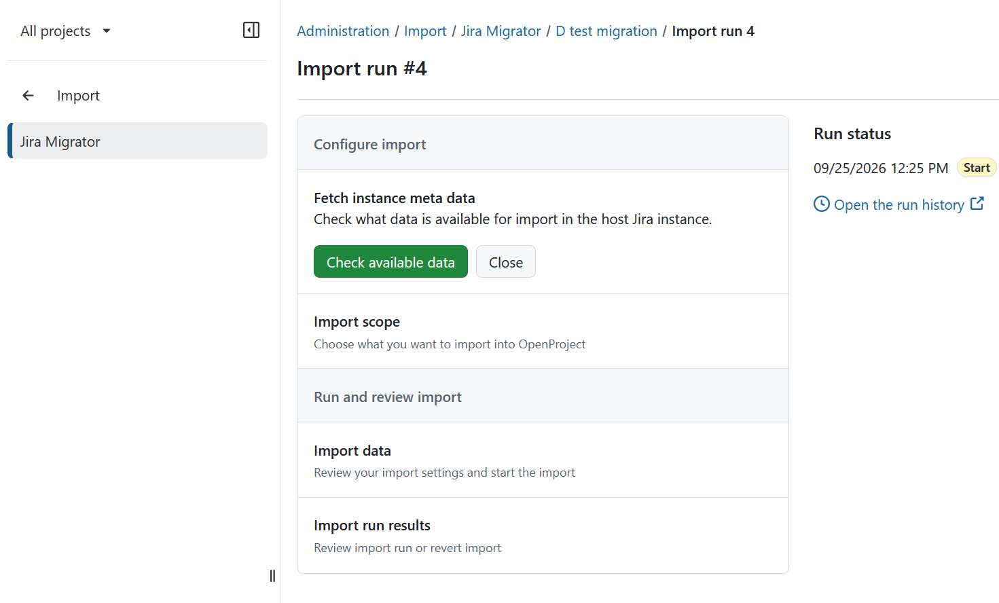

Once fetched, you will see which data can and cannot be imported. Click **Continue**.

### Configure import

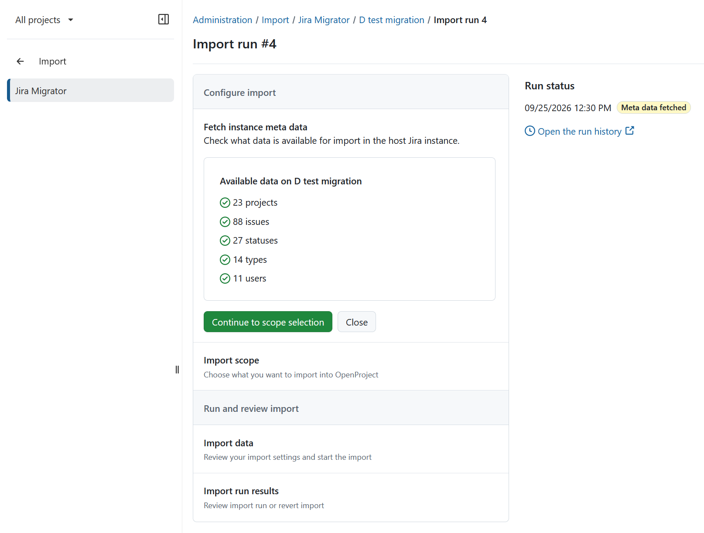

### Select scope

Next, select the projects you want to import. Click the **Continue to scope selection** button.

In the modal dialog that appears, choose one or more projects and confirm by clicking **Continue**.

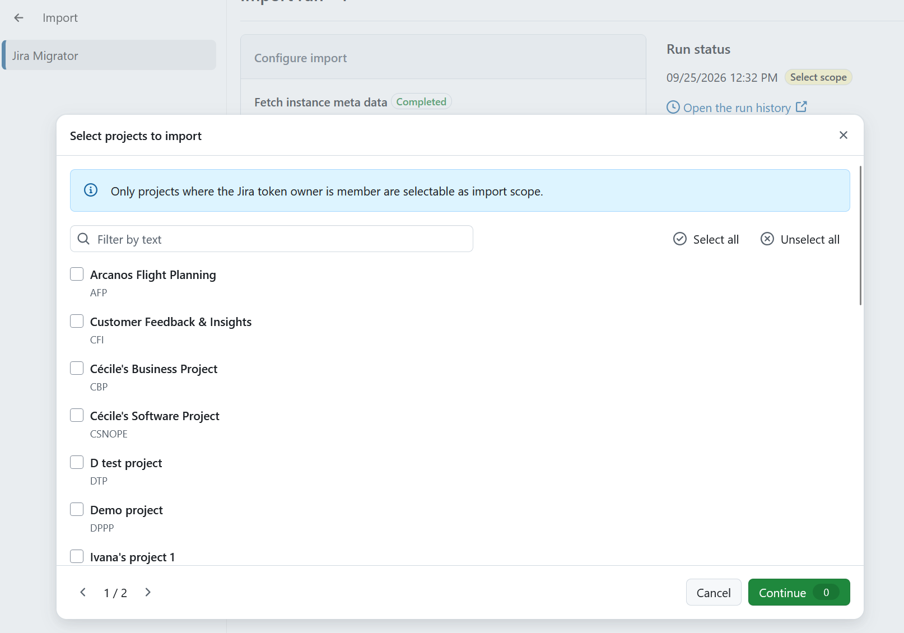

Click **Continue** to carry on with the import process or add more projects to the scope. 

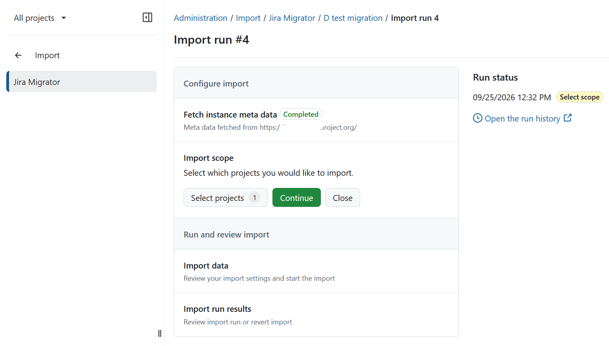

Data to be imported will be listed. 

### Start import

Click **Start import** to begin the import process.

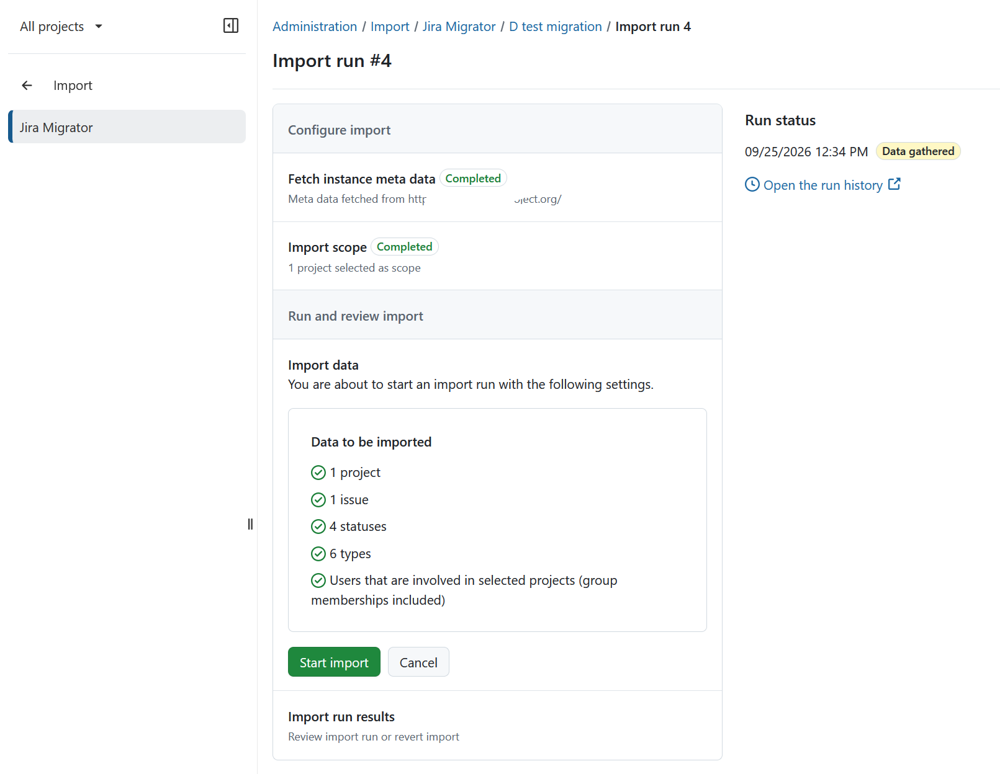

A warning dialog will appear. Confirm that you understand the limitations (e.g., incomplete feature coverage, recommendation to avoid production use, and the need for backups). Select _I understand_ and click **Start import**.

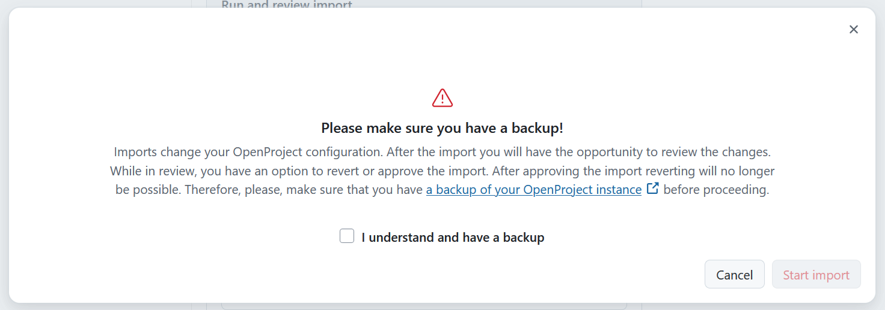

During import, Jira wiki markup is automatically converted to OpenProject’s Markdown format. The import progress will be visible.

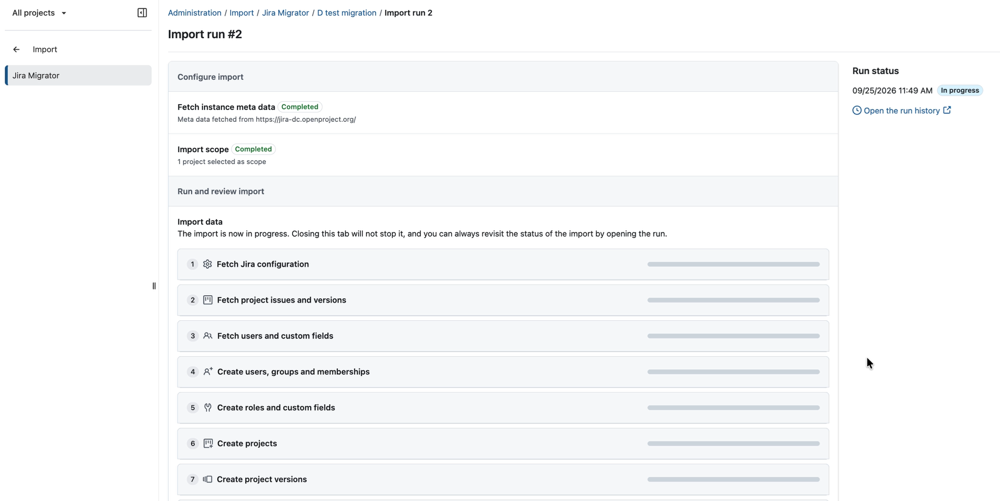

> [!TIP]
> If a user already exists in OpenProject from a previous import, they will not be duplicated.

### Review import

After the import completes, the data is available in _review mode_. You can:

- Inspect imported projects and work packages
- Validate data integrity
- Decide whether to approve or revert the import

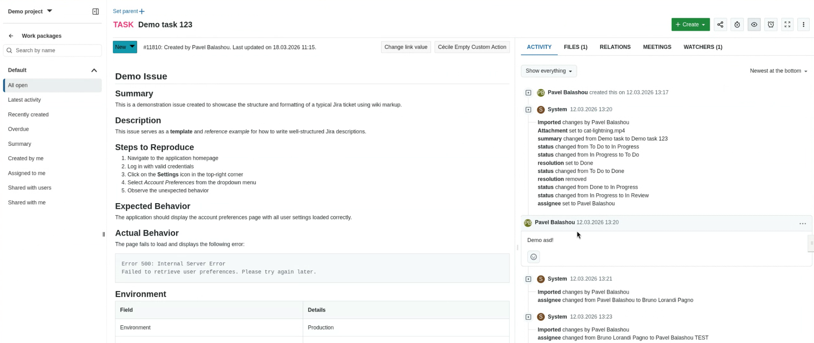

### Approve or revert the import

To proceed, choose one of the following actions: **Approve** or **Revert** the import. To leave the import in review mode, click **Close**. You can return to the import at a later point.

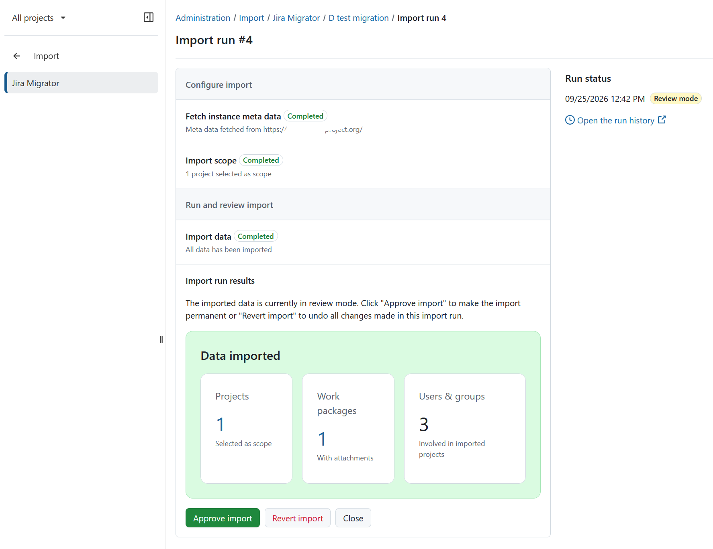

#### Approve import

- Activates newly created users
- Makes imported data permanent
- Disables the option to revert the import

A confirmation warning will be shown before proceeding.

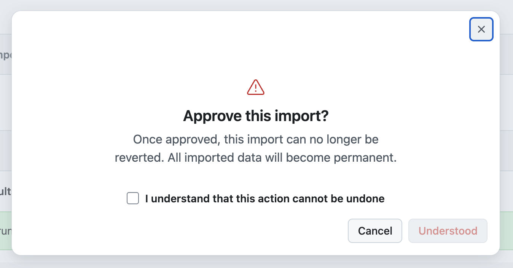

#### Revert import

- Removes all data created during the current import run
- Does not affect data from previous import runs

A confirmation warning will also be shown.

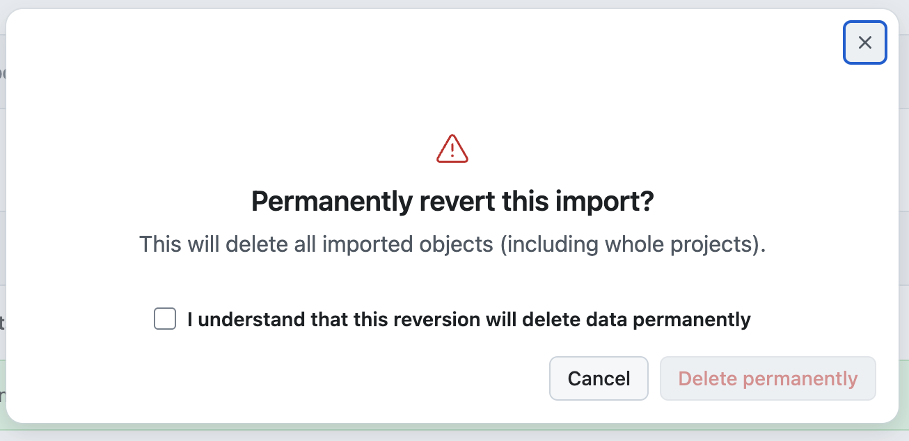

> [!NOTE]
> During review mode, any newly created users remain locked until the import is approved.

### Close an import in review mode

You do not need to approve or revert an import immediately after reviewing it.

Click **Close** to leave the import in **review mode** and return to it later. Closing the view does not approve, revert, or otherwise change the imported data.

The import remains listed with the **In review** status. You can reopen it from the import runs overview at any time and continue the review.

> [!NOTE]
> Newly created users remain locked for as long as the import is in review mode. They are activated only when the import is approved.

## Imports overview

Navigate to *Administration → Import → Jira Migrator* to see an overview of all Jira import configurations.

Each configuration represents a connection to a Jira instance. From this overview, you can:

- Add a new Jira configuration
- View existing configurations
- Open the import runs for a configuration
- Edit an existing configuration

To access the available actions for a configuration, click the **More (...)** icon at the end of the corresponding row. You can then select:

- **Open runs** to view all import runs for this configuration
- **Edit configuration** to change the Jira connection settings

You can also click the **configuration name** to open its import runs directly.

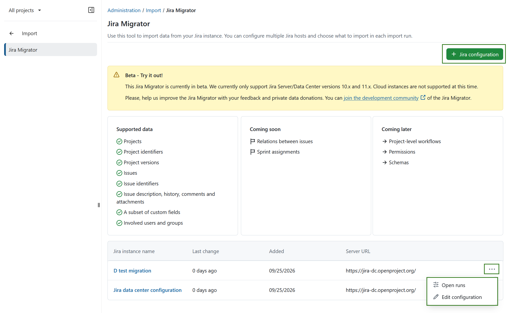

### Import runs overview

Opening a configuration displays all import runs associated with it.

The table provides an overview of the runs and their current status, such as:

- **In review**: the import has completed and is waiting to be approved or reverted
- **Completed**: the import has been approved and its changes are permanent
- **Reverted**: the changes made by the import run have been reverted

Use the **…** (three dots) icon at the end of a row to access the available actions for that import run.

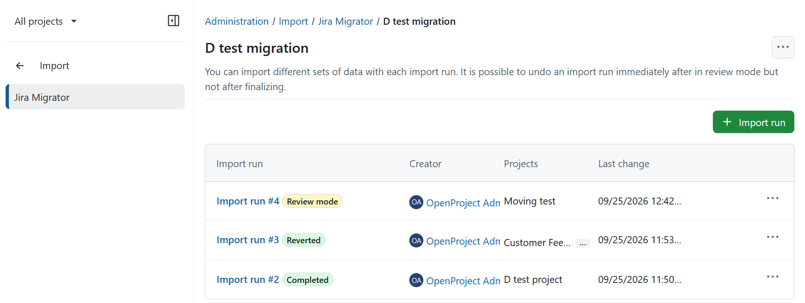

### Edit an import

Select **Edit import** from the actions menu of an import run to open its details.

The import details show the selected scope, imported data, completed steps, and the current state of the import.

If the import is still **In review**, you can continue reviewing the imported data and then **approve** or **revert** the import.

For more information about these actions, see [Approve or revert the import](#approve-or-revert-the-import).

### View run history

You can open the history of an import run by clicking **Open run history** on the right side of the import details page.

The run history provides a chronological overview of changes to the import run. The table contains the following information:

- **From → To**: the status transition
- **Created on**: when the transition occurred
- **Metadata**: additional information associated with the transition

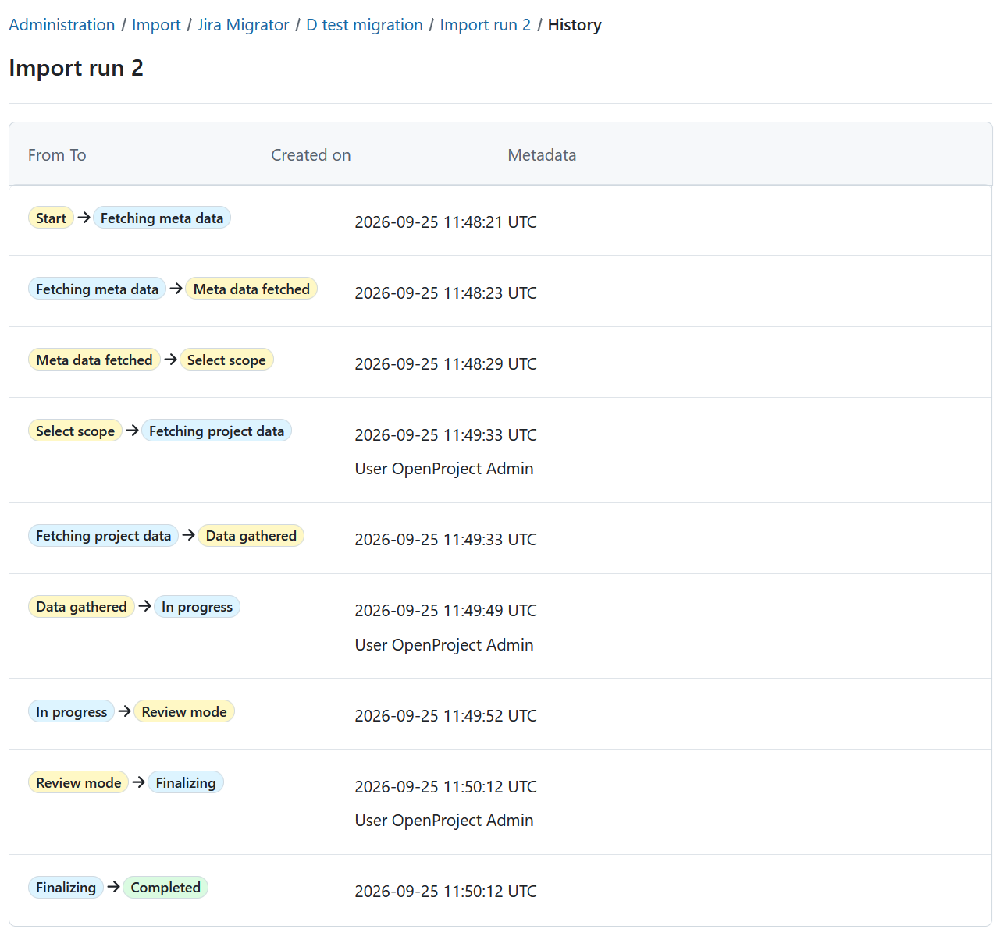

## Best practices for Jira migrations

### 1. Preparation

- Review the [Jira Pre-Migration checklist](./pre-migration-checklist/).

### 2. Testing

- Set up a test instance of OpenProject.
- Migrate a small subset of data using the Jira Migrator.
- Verify field mappings, attachments, and relationships.

### 3. Execution

- Perform the full migration after successful testing.
- Validate data integrity after import.
- Recreate workflows, permissions, and boards in OpenProject as required.

### 4. Post-migration

- Review the [Jira Post-Migration checklist](./post-migration-checklist/).
- Provide training to users.
- Archive or decommission the legacy system if applicable.

## Current status and next steps of the Jira Migrator

You can follow the progress of OpenProject's [Jira migration stream](https://community.openproject.org/projects/jira-migration) and provide feedback.
