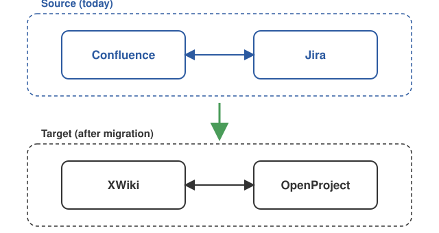
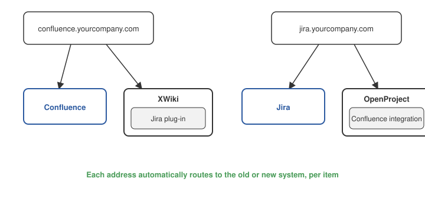
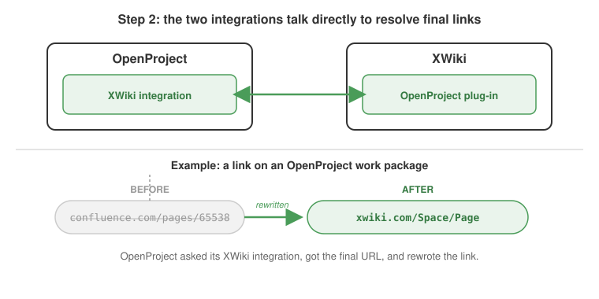

# Migrating Jira and Confluence together

Many organizations run Jira and Confluence tightly linked — issues reference pages, pages embed live issue status. When migrating away from Atlassian, these links need to keep working, not just the data on either side.

## Principle
- **Links between the two keep working at all times**, except briefly during the moment an individual item is being migrated.
- Migrations of Jira and Confluence content can run on completely different timelines. You don't need to migrate both at once, or in lockstep, for links to stay intact.
- **OpenProject** is responsible for everything related to Jira and its migration.
- **XWiki** is responsible for everything related to Confluence and its migration.

## Goal

Today, Confluence and Jira are tightly integrated — issues link to pages and vice versa. After migration, XWiki and OpenProject provide that same level of integration. Links between the two keep working throughout the transition, not just once both migrations are complete.

## Your options for Confluence

| Your situation                                              | What happens                                                 |
| ----------------------------------------------------------- | ------------------------------------------------------------ |
| **You keep Confluence** (only migrating Jira)               | An OpenProject–Confluence integration lets your Jira → Confluence links keep working unchanged. *(In development.)* |
| **You migrate Confluence to XWiki**                         | Links stay intact automatically via redirects, whether Jira and Confluence migrate together or on separate schedules. See below. |
| **You migrate Confluence to another tool** (e.g. BlueSpice) | Not currently supported.                                     |

## How links stay intact during migration (Confluence → XWiki case)

Migration happens in two steps, and you control when the second one runs:

**Step 1 — Migrate content, keep old links working.**
A redirect component is added at both the Jira and the Confluence address. Every request to either address is automatically routed to the right place: to the original system if the content hasn't moved yet, or to the new system if it has. For example, `jira.yourcompany.com/projects/FOO/issues/FOO-1` keeps working after migration — it now resolves to the corresponding OpenProject work package. Nothing about existing links needs to change, and this works regardless of whether Jira and Confluence migrate together or on entirely separate schedules.

At the same time, each side's native integration is swapped for its equivalent on the new system: Confluence's built-in Jira integration is replaced by XWiki's Jira plug-in, and Jira's built-in Confluence integration is replaced by OpenProject's Confluence integration. This keeps cross-references (like an issue embedded in a page) rendering correctly throughout the transition, not just plain links.

**Step 2 — Update links to their final destination (optional, on demand).**
Once you're ready, an admin can trigger a cleanup step that rewrites old links to point directly at their final destination — e.g. straight to the OpenProject work package or XWiki page, instead of via the redirect. OpenProject and XWiki each expose an API the other can call to resolve an old link to its current URL, so this step can run incrementally and independently on either side — you don't need both systems ready at once, and you can do it project by project or space by space. This is optional: everything already works without it.

## Current limitations

- **Confluence pages that embed live search results from Jira** (via JQL) have limited support today. Mapping these to an equivalent OpenProject filter is planned but not yet finalized.
- The **OpenProject Confluence integration** is still in development.
