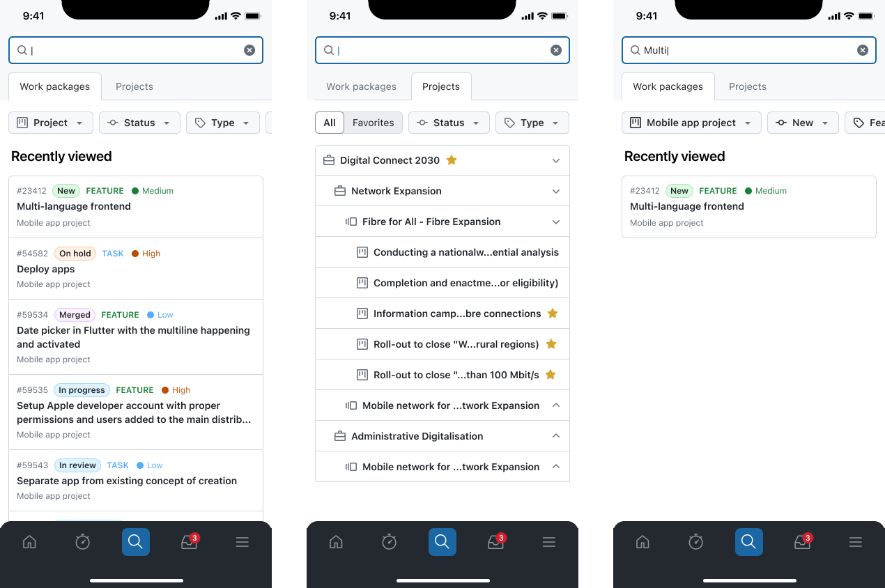

---
sidebar_navigation:
  title: Global search
  priority: 750
description: A centralized view to search all entities in the mobile app.
keywords: Mobile app global search, search, mobile search, global search, OpenProject mobile app
---

# Global search

**Global search** lets you search across multiple types of content in your OpenProject instance from one place. Use it to quickly find what you need without manually browsing through projects, spaces or lists.

At the moment, global search supports:

- **Work packages**
- **Spaces / Projects**

Work is ongoing to also make **meetings** available through global search.

### What you can do

With global search you can:

- Search by keyword or ID across supported content types.
- Filter down the list using quick filters related to each content type.
- See results grouped by type (for example, work packages vs. projects).
- Open a result directly to continue your work.