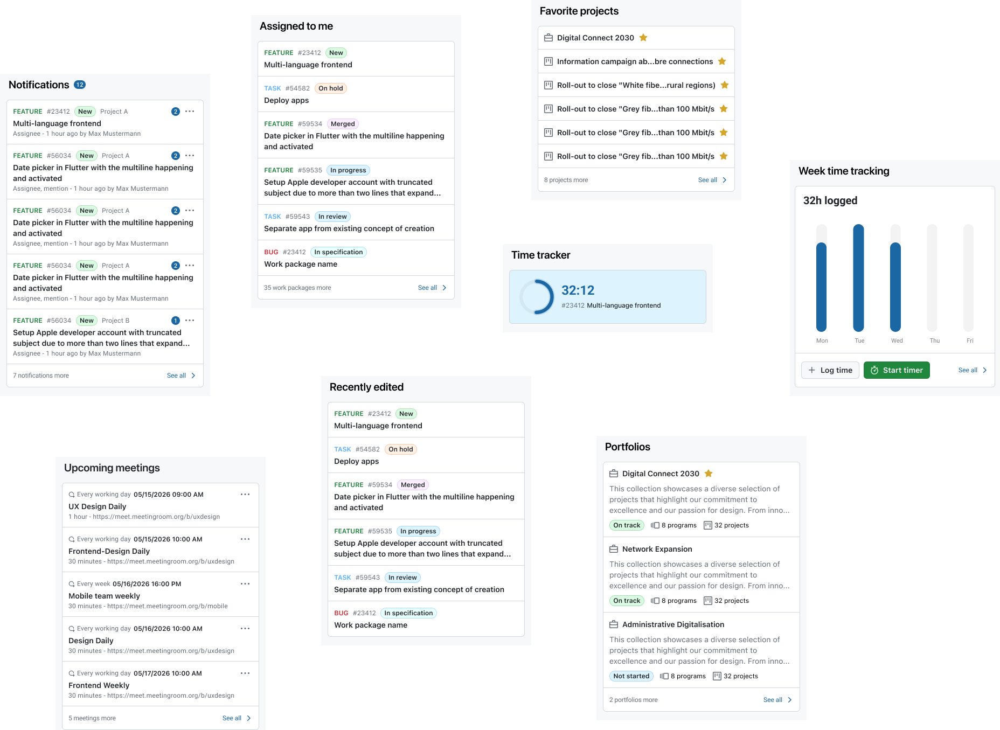
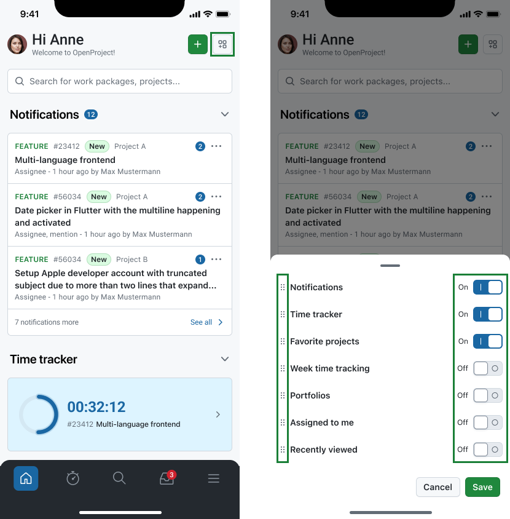

---
sidebar_navigation:
  title: Home Dashboard
  priority: 790
description: Create a personalized overview of your projects, work packages, and activities.
keywords: Mobile app features home dashboard
---

# Home dashboard

The **Home dashboard** is the starting point of the OpenProject mobile app. It gives you quick access to your most important items and helps you continue where you left off without navigating through multiple projects first.

Use the Home dashboard to get an overview of what needs attention, jump back into recent work, and access key areas of the app faster.

## What you can do on the Home dashboard

Depending on your configuration and permissions, the Home dashboard can help you:

- **Resume recent work:** Quickly jump back to items you recently opened (for example, work packages or projects).
- **See what needs attention:** Review assigned items, updates, or other high-signal content surfaced on the dashboard.
- **Navigate to key areas:** Use dashboard shortcuts to open commonly used parts of the app without browsing through the full project list.

## What appears on the Home dashboard

The Home dashboard is built from **sections/widgets** that summarize or link to content. The full list of widgets available in the app are:

- Notifications
- Assigned to me
- Recently viewed
- Upcoming meetings
- Time tracker
- Week time tracking
- Favorite spaces
- Portfolios

> [!NOTE]
> The exact set of sections can vary depending on your OpenProject instance configuration, permissions, memberships, and what you have configured to be visible in the app settings.

## Customize your Home dashboard

While the mobile dashboard is designed for simplicity, you can customize the **order and visibility of widgets** using the **Edit widgets button** on the right side of the top navigation bar. Tapping the icon lets you show or hide widgets and reorder them.

## Home screen widgets on your phone

Most of the widgets you see on the **Home dashboard** are also available as **OS-level widgets** that you can place on your phone’s home screen, outside of the OpenProject app.

This lets you:

- See key OpenProject information at a glance without opening the app.
- Jump directly into relevant areas or items faster from your device's home screen.

The exact set of available OS widgets (and what they show) can vary depending on your platform (iOS or Android) and the app version.
