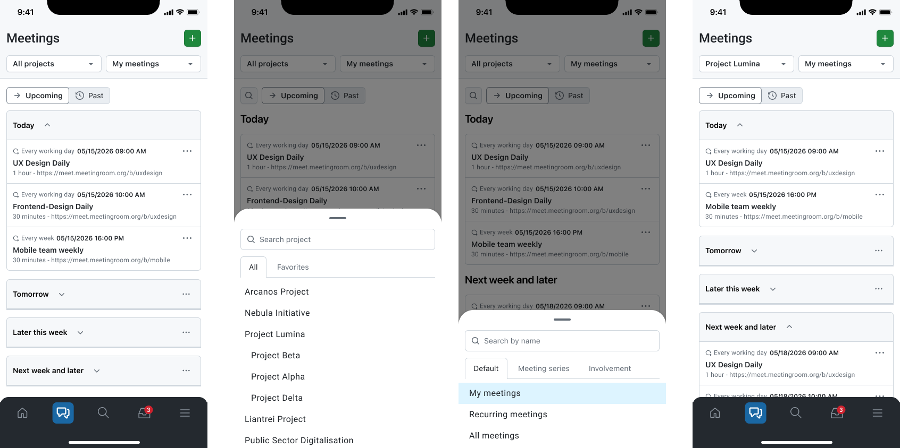
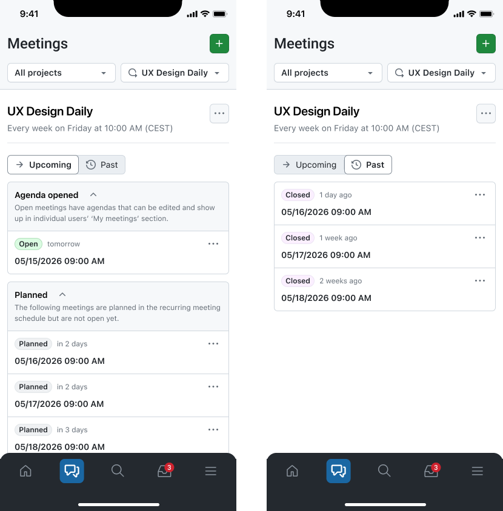
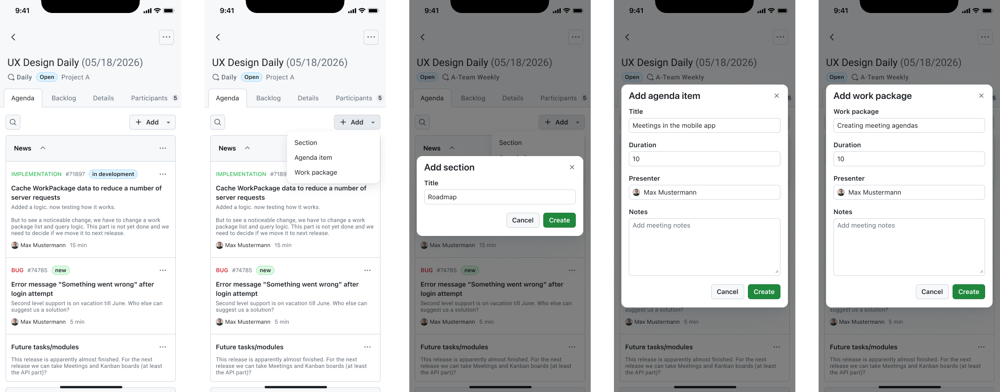
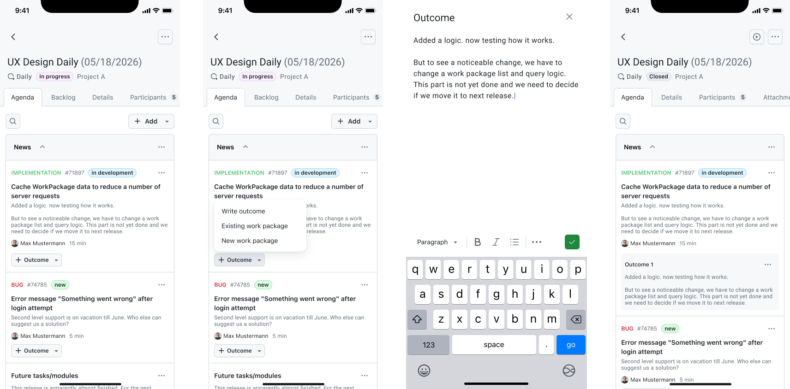
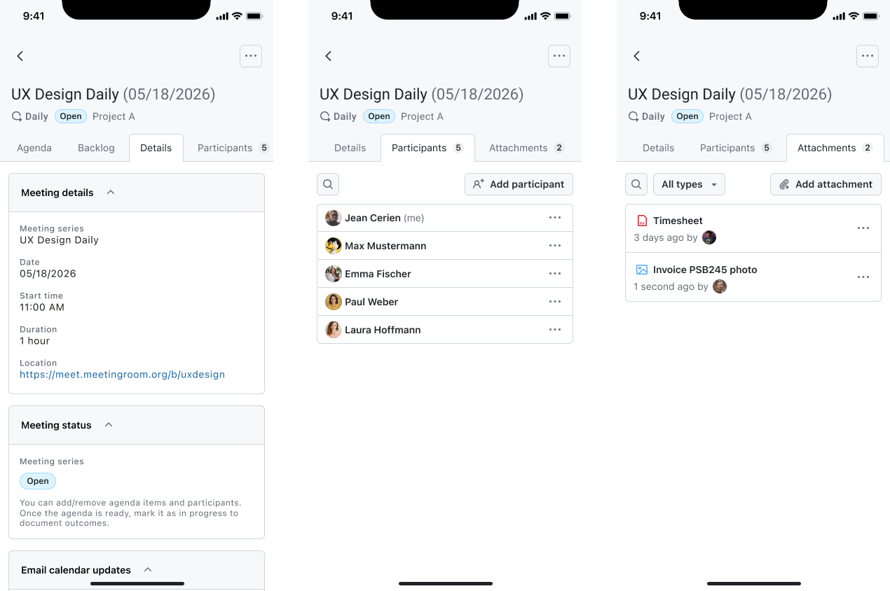
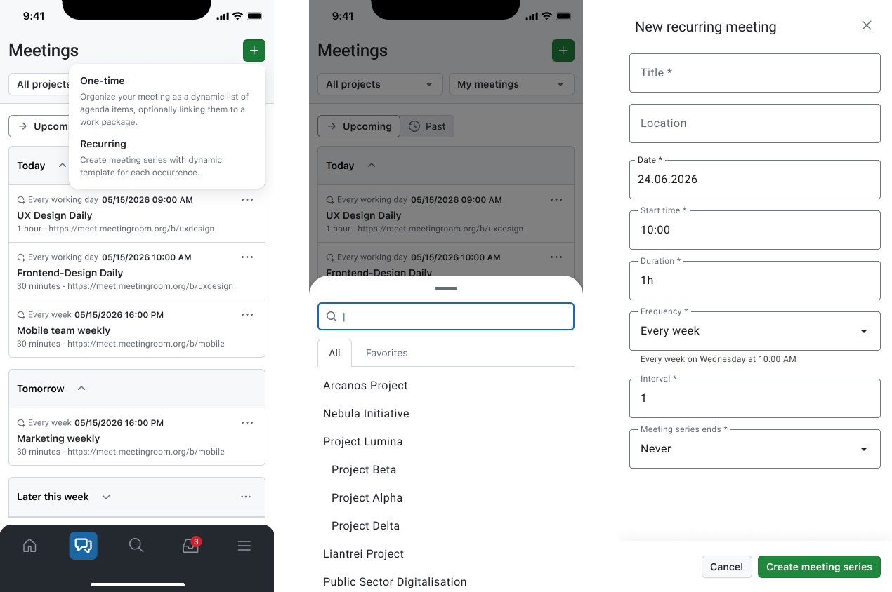

---
sidebar_navigation:
  title: Meetings
  priority: 740
description: Plan, run, and review meetings in OpenProject from the mobile app.
keywords: Mobile app meetings, meetings module, meetings, meetings app, OpenProject mobile app
---

# Meetings

The **Meetings** module lets you plan, run, and review meetings in OpenProject from the mobile app. It supports both **individual meetings** and **recurring meeting series**, and provides everything you need to manage agendas, outcomes, participants, and related work.

## What you can do

With the Meetings module, you can:

- View **all meetings**, including:
    - **individual meetings**, and
    - **meeting series** (recurring meetings).
- Browse meetings within a series, including **upcoming** and **past** meetings.
- **Search and filter** meetings (for example, by project or by switching queries).
- Open meeting details and work with:
    - **Agenda**
    - **Backlog**
    - **Details**
    - **Participants**
    - **Attachments**
- Update the **meeting status** (for example, when the meeting starts or ends).
- Manage agendas:
    - add, edit, move, and delete **agenda sections**,
    - add, edit, move, and delete **agenda items**,
    - link **work packages** to agenda items.
- Add and edit **outcomes** while a meeting is in progress.
- **Create** meetings:
    - create a new **individual meeting**, or
    - create a new **meeting series**.
- **Delete or cancel** meetings with the correct permissions.
- View **linked meetings inside work packages** as a dedicated tab in the work package view.

## Common workflows

### Find a meeting

1. Open **Meetings**.
2. Use the **project filter** (e.g., *All projects*) to narrow down the scope.
3. Use the **query selector** (e.g., *My meetings*) to switch what you are viewing.
4. Use **search** to find a meeting by title.

### Review upcoming or past meetings in a series

1. Open **Meetings**.
2. Open a **meeting series**.
3. Switch between **upcoming** and **past** meetings to locate the instance you need.
4. Tap a meeting to open its details.

### Prepare the agenda

1. Open a meeting and go to **Agenda**.
2. Add **agenda sections** to structure the meeting.
3. Add **agenda items** under the right section.
4. If the discussion relates to work items:
    - link existing **work packages** to agenda items, or
    - create a new work package (if supported and permitted).

### Run the meeting

1. Open the meeting.
2. Update the **meeting status** to indicate it is in progress (if used in your workflow).
3. While discussing agenda items, add or update **outcomes** to document decisions and next steps.

### Change meeting details or participants, or attach files

1. Open the meeting and use the available tabs:
    1. **Details:** View and change the meeting's general details, its status and change the email calendar updates for all participants.
    2. **Participants:** View and add participants to the meeting.
    3. **Attachments:** Attach relevant files or photos to the meeting.
2. Add or modify the desired data.

### Create a new meeting or meeting series

You can create new meetings directly from the **Meetings** module.

1. Open **Meetings**.
2. Tap the **+** button (top right).
3. Choose what you want to create:
    - **One-time meeting** (individual meeting), or
    - **Recurring meeting** (meeting series).
4. Fill in the required details, such as:
    - meeting title,
    - project,
    - date and time (or start date and recurrence pattern for a series),
    - participants.
5. Tap **Create**.

After creation, the meeting opens in its detail view, where you can start preparing the **agenda**, add **attachments**, and, once the meeting starts, capture **outcomes**.

## Linked meetings in work packages

Additionally, the meetings related to a work package can also be accessed from the **work package detail view** via a dedicated **Meetings** tab. Use this when you start from a work item and want to:

- check meeting context around that work package,
- review outcomes or discussion history tied to the item.