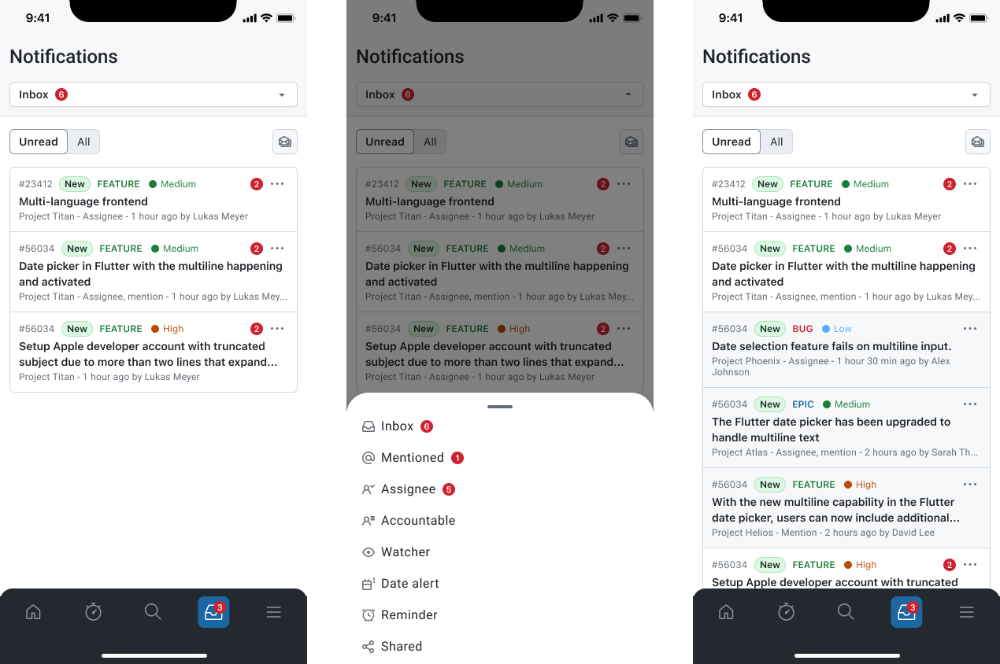
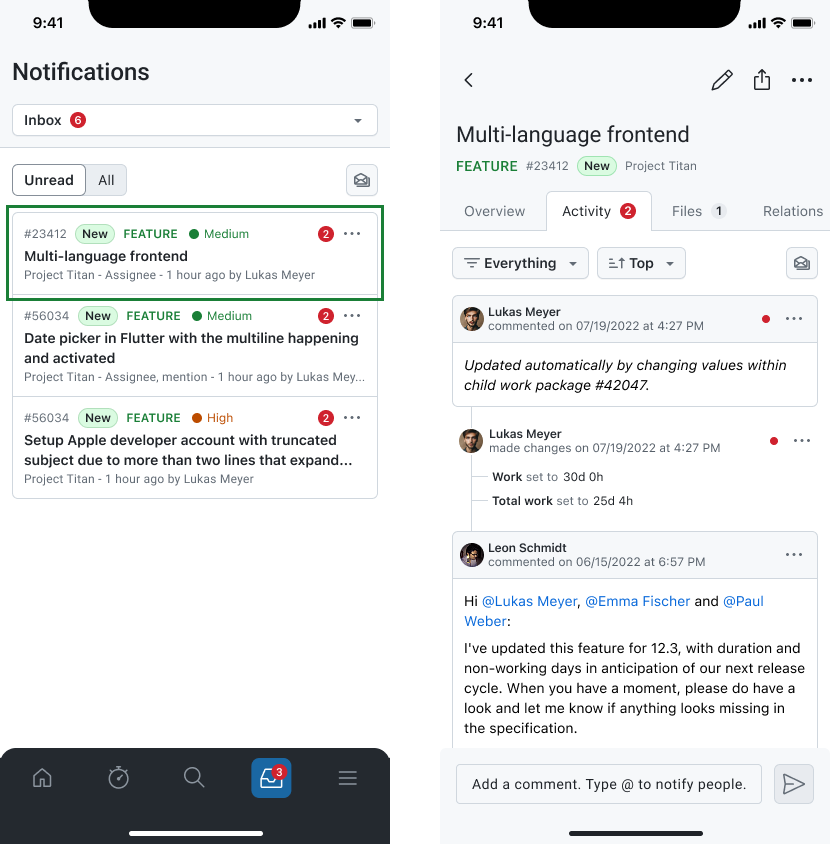
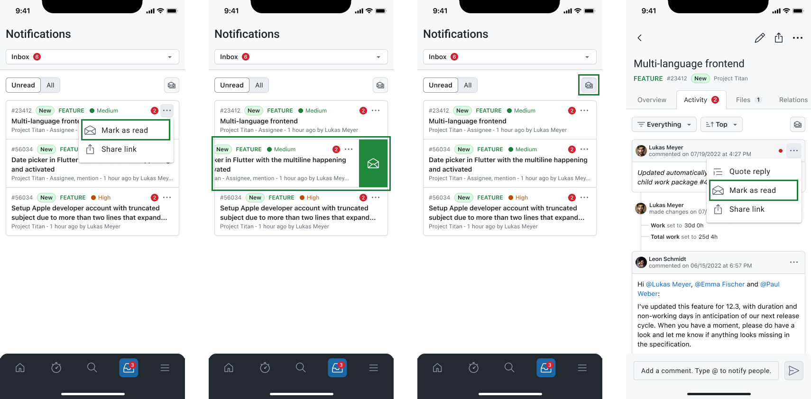

---
sidebar_navigation:
  title: Notification Center
  priority: 760
description: A centralized view of all updates, mentions, and activities that require the user’s attention in the OpenProject mobile app.
keywords: Mobile app Notification Center, mobile notification, mobile notifications, notification, mobile mention
---

# Notifications

The **Notifications** module (notification center) helps you stay up to date with changes that matter to you, for example when you are **mentioned**, **assigned**, added as a **watcher**, or when a **date alert** is triggered.

From here you can review unread items, open the relevant work package, and manage what you have already seen.

## Browse notifications

Each notification in the list shows key information at a glance including, the work package type and ID, the subject/title, project name, and why you received it, such as *Assignee* or *Mention*. Tap a notification to open it.

### Switch notification queries

Use the selector in the **top header** to switch between different notification queries, such as:

- **Inbox**
- **Mentioned**
- **Assignee**
- **Accountable**
- **Watcher**
- **Date alert**
- **Reminder**
- **Shared**

### Unread vs. all

Below the header, use the toggle to switch between:

- **Unread:** the default for catching up
- **All:** to review everything, including notifications marked as read

## Common workflows

### Open a notification in context

When you open a notification, it takes you to the related **work package**, focused on the **Activity** tab so you can immediately see the update or conversation that triggered the notification.

From there you can:

- read the latest changes and comments,
- reply or add a comment,
- continue working on the work package,
- and mark the notification as read when the work is completed.

### Mark notifications as read

To keep your inbox tidy, mark notifications as read after reviewing them. You can mark notifications as read by:

- Using the more menu (three dots) in the notification list to mark all notifications from a single work package as read.
- Swipe the entire card to the right or left to mark all notifications from a single work package as read.
- Mark all notifications as read in the notification centre using the mark all as read action on the top right corner of the notification list. This action is also available on the header of the work package details view when it has notifications.
- Additionally, you can mark single activities as read without marking the rest inside the work packages activities by using the more menu (three dots) for each activity.

### Additional notification settings

#### Manage notification settings (what you receive)

If you want to change *which events* generate notifications, and which don’t, you can do so at any time from the app:

1. Open **Account and settings**.
2. Go to **Notification settings**.
3. Enable or disable the notification types you want to receive.
 
> [!NOTE]
> This is the central place to control your personal notification preferences. Changing these settings will affect the notifications received both on the mobile app and the core desktop app of OpenProject.

#### Control when activities are marked as read automatically

You can also configure *when* items are marked as read automatically while working in a work package’s **Activity** tab. In **Account and settings → Work package settings**, choose one of the following behaviors:

- **Automatically mark all as read:** Automatically marks all notifications/activities as read as soon as you open the Activity tab.
- **Mark as read when commenting:** Marks all items as read only after you add a comment in the Activity tab.
- **Mark as read on reply:** Marks a specific activity as read when you **quote reply** to that specific activity entry.

These options help you decide whether simply viewing activity should clear notifications, or whether they should only be cleared when you actively respond.