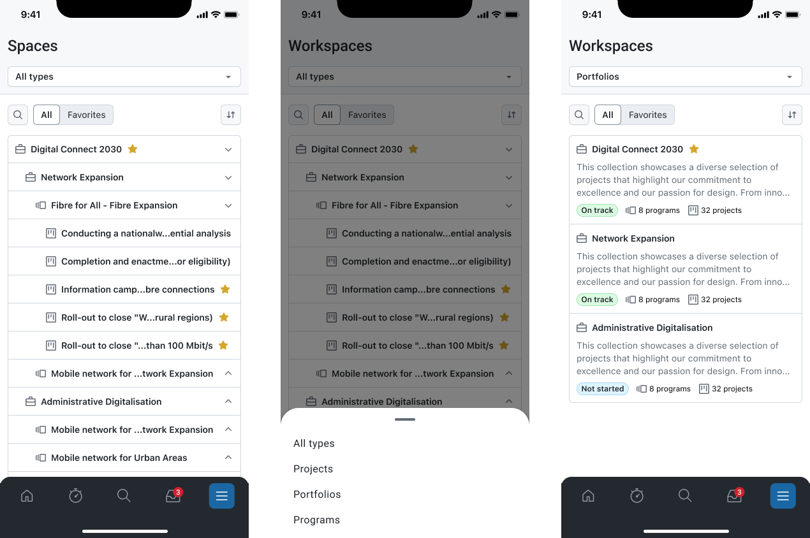
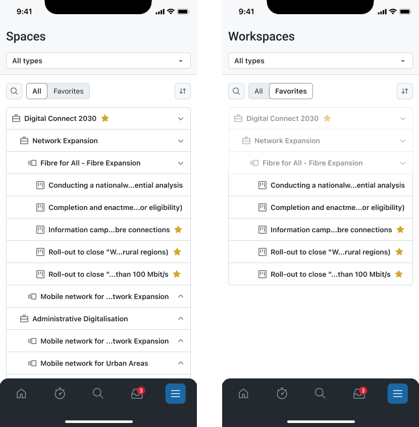
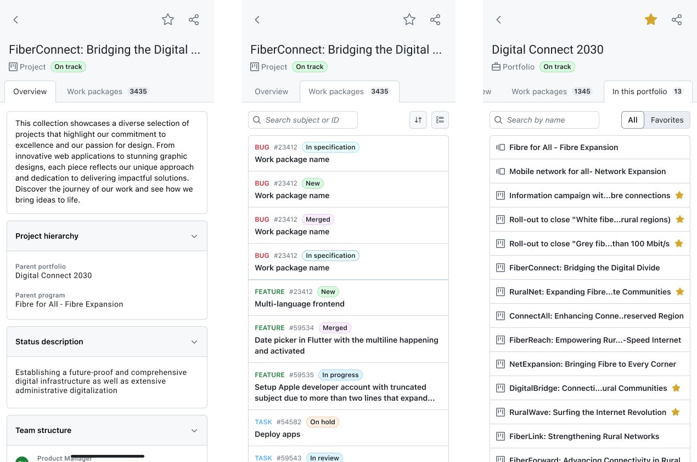

---
sidebar_navigation:
  title: Spaces
  priority: 730
description: An organized view of all portfolios, programs, and projects you have access to.
keywords: Mobile app features projects, mobile project, mobile portfolio, mobile program, program, programme, project, portfolio, mobile app
---

# Spaces

The **Spaces** module helps you browse and open the portfolios, programs, and projects you have access to in OpenProject. It provides a structured overview (including hierarchies, when configured) and lets you quickly jump into a specific space to continue working, for example by opening the space overview or its work packages.

## What you can do

With the Spaces module, you can:

- **Browse spaces** you have access to.
- **Filter** the list by type.
- **Search** for a specific space by name.
- Mark spaces as **favorites** and quickly access them via the Favorites view.
- **Open a space** to view its details and navigate to its work packages or sub-spaces.

## Common workflows

### Browse all spaces and filter by type

1. Open **Spaces**.
2. Use the **type selector** in the header (e.g., *All types*) to narrow the list.
3. Use **search** to find a specific space/project by name.
4. Scroll the list and tap an entry to open it.

### Switch between All and Favorites

1. Open **Spaces**.
2. Use the toggle below the header to switch between:
    - **All** (everything you can access), and
    - **Favorites** (spaces you’ve starred).

This is useful if you mainly work in a small set of spaces and want faster access.

### Open a space and review details or navigate to work

When you open a space/project, you can typically:

- Review the **Overview,** which summarizes project attributes and the description.
- Navigate to **Work packages** within that space/project to see and work on items.

