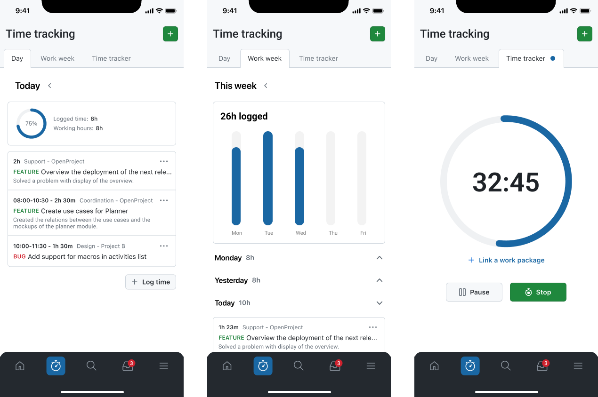
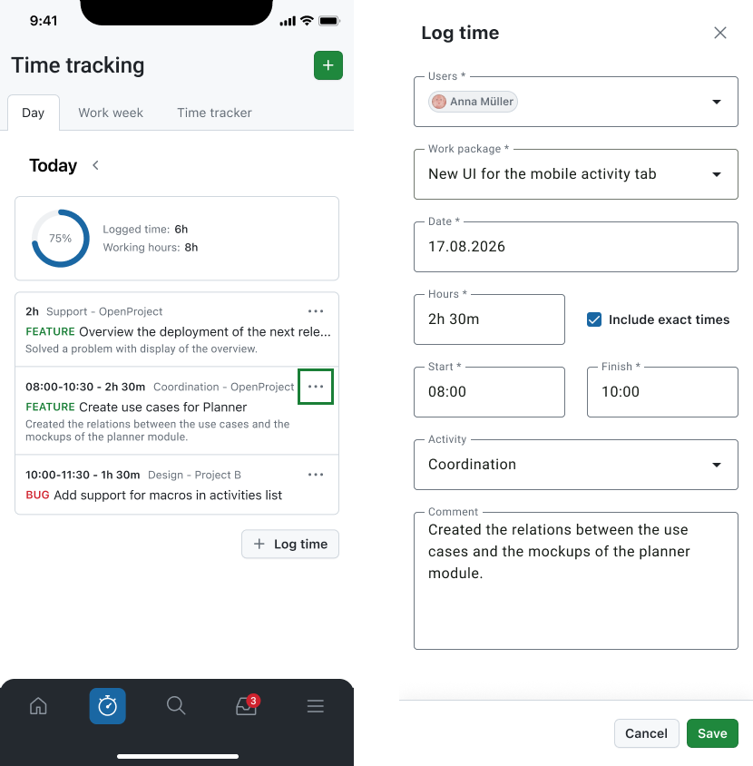
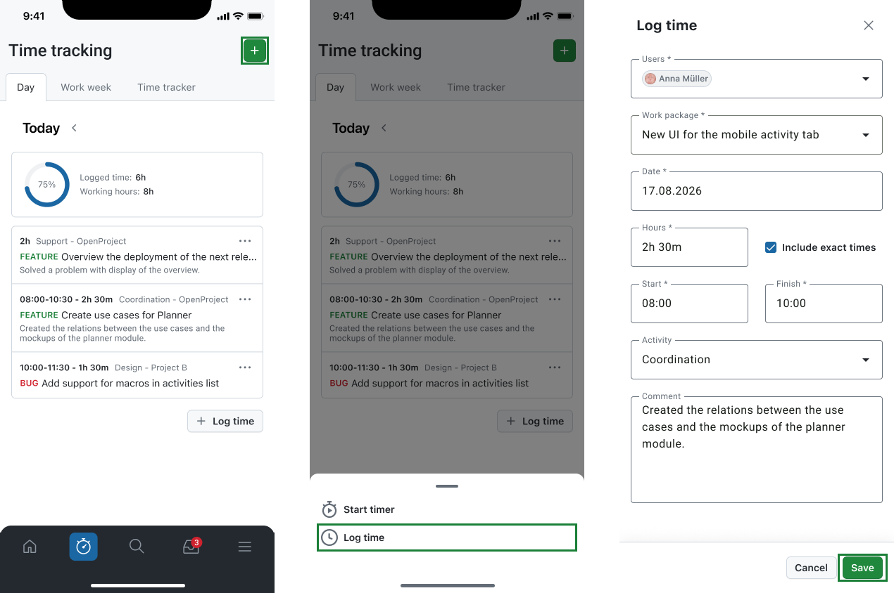
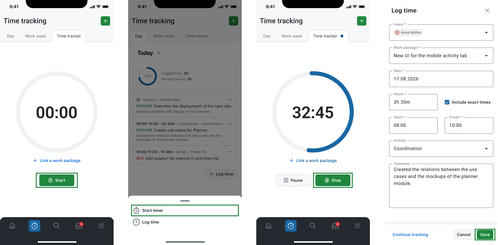

---
sidebar_navigation:
  title: Time tracking
  priority: 770
description: Enables you to easily record, review, and manage the time you spend on your work.
keywords: Mobile app features time tracking, time tracking, mobile time tracking, mobile time, log time, time logging, time-logging, time management, time, time entry, time log, timer focus, focus timer
---

# Time tracking

The **Time tracking** module lets you track and log spent time in OpenProject from the mobile app. It is designed for quick time entry on the go, whether you want to log time for **yourself** or, with the proper permissions, log time for **other users**, including **multiple users at once**.

## Views

The Time tracking module is organized into three tabs:

- **Day:** See your logged time grouped by day and review the entries for the selected date.
- **Work week:** Get a weekly overview of your logged hours, including totals and a day-by-day breakdown.
- **Time tracker:** Track time actively with a running timer and link it to a work package when needed.

## Common workflows

### Review your logged time

Use the **Day** or **Work week** tab to:

- see **your personal** time entries,
- review logged hours and daily/weekly totals,
- open entries for additional details and editing.

> [!TIP]
> The app shows **only your personal time entries**, even if you logged time for other users. Time entries for other users are not displayed in the app (regardless of who created them).

### Log time

You can create a new time entry from the Time tracking module.

1. Tap **+** (top right).
2. Tap **Log time**.
3. By default, you will be selected as **User** to log time**.** With the correct permissions you can select **another user** or **multiple users.**
4. Select a **Work package**.
5. Set the **Date**.
6. Enter **Hours**, including **exact times** if the instance allows it.
7. Fill in all the **mandatory fields** depending on the instance configuration.
8. Fill in other **optional fields** if desired.
9. Tap **Save** to create the time entry.

## Track time with a running timer

Use the **Time tracker** tab when you want to measure time as you work:

- Start the timer using the **Start** button or the **+** button on the top bar.
- Optionally **link a work package** while the timer is running.
- You can always **Pause** the tracker if needed.
- **Stop** the timer when you are done.
- Review and edit the log time information.
- Tap **Save** to create the time entry or tap **Continue tracking** to keep the tracker running from where you left it.

