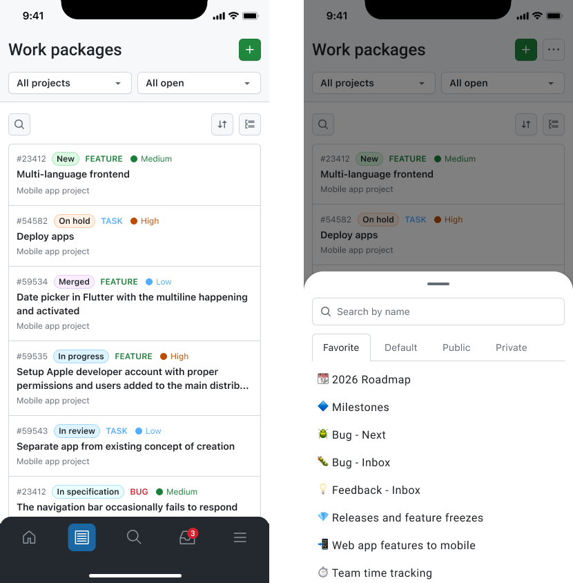
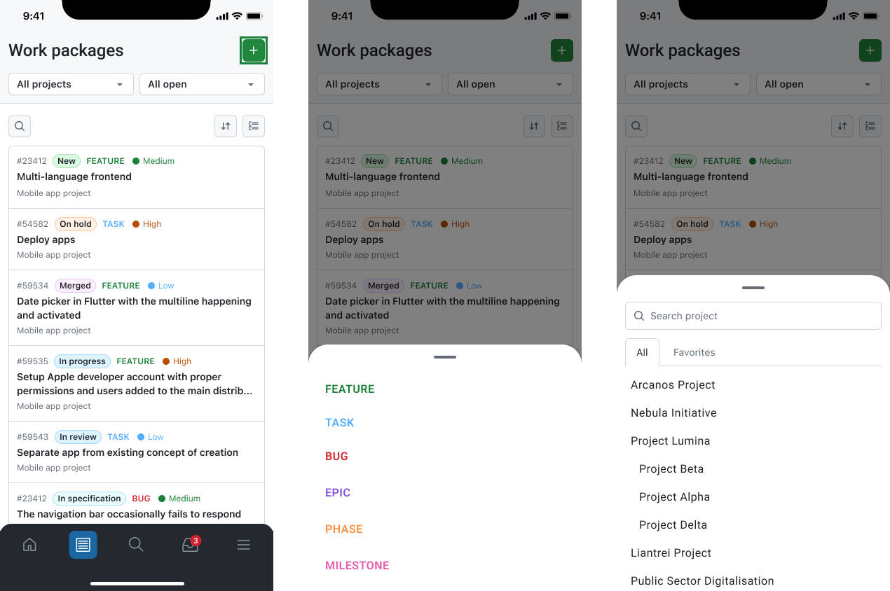
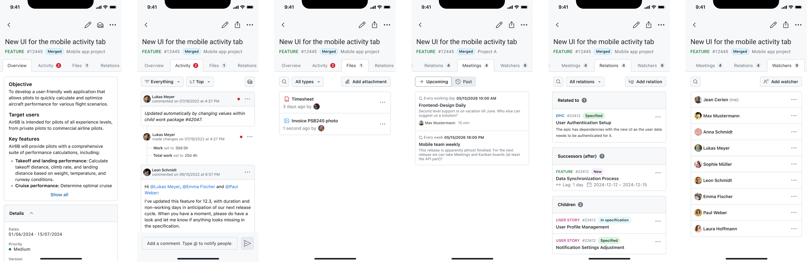
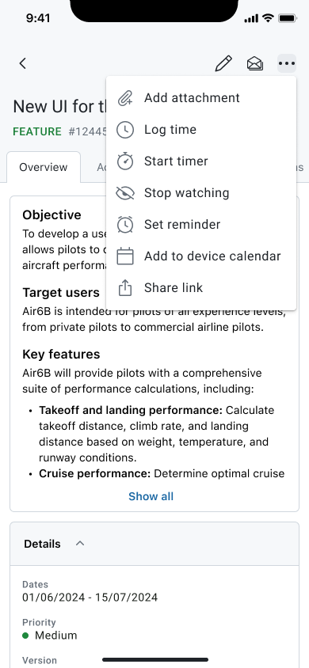

---
sidebar_navigation:
  title: Work packages
  priority: 780
description: Browse, search, create, update, and collaborate on work packages directly from your mobile device.
keywords: Mobile app features work packages, work package, work packages, create work package, edit work package, share work package, mobile app
---

# Work packages

**Work packages** are the central items you work with in OpenProject, for example tasks, features, bugs, milestones, or any other work item type configured in your instance. In the mobile app, the Work packages module lets you browse, search, update, and work packages while you are on the go.

## What you can do

From the Work packages module, you can typically:

- **Browse work packages** across projects and queries.
- **Search** for a specific work package by name.
- **Open work package details**, including overview and activity.
- **Edit** supported attributes and details.
- **Collaborate** by following updates, reviewing activity, and managing relations and watchers.
- Use **More actions** to share and access time-related actions.

## Common workflows

### Work packages lists

Use the Work packages list to quickly find and open the item you want to work on.

- Use the **project selector** (e.g., *All projects*) to change the scope of what you are browsing.
- Use the **query selector** (e.g., *All open*) to change the query you are seeing.
- Use **search, sorting**, and **grouping** to find the relevant work package.
- Select a work package in the list to open its **details**.
- Long tap a work package to **preview** it.

### Create a new work package

You can create a new work package directly from the **Work packages** list.

- Open **Work packages** from the main navigation.
- Tap the **+ button** (top right), which is also available from the Home dashboard.
- Select the work package **type**.
- Select the **project** where you want to create the work package.
- Fill in all the work package **mandatory details**. Any additional fields available for this work package type are available when tapping on **See all attributes** in the bottom bar.
- Tap **Create** to create the work package.

After creation, the work package opens in its detail view, where you can continue editing, add comments, attachments, relations, watchers, and more.

### Work package overview and details

A work package detail view is organized into sections/tabs, such as:

- **Overview:** The main summary view, typically including the work package description and key filled information. The fields are also editable from the overview tab.
- **Activity:** The activity feed for the work package (updates, comments, and changes).
- **Files:** Attachments and files related to the work package, with the option to add attachments.
- **Relations:** Related work packages (e.g., related to, predecessor/successor, children). You can navigate to related items and add relations.
- Meetings: Meetings linked to this work package as meeting agenda or outcome. You can open the respective meeting agendas.
- **Watchers:** People who are watching the work package. You can review watchers and add watchers.

You can always **edit a work package** details from each field available on the overview screen, but for more advanced editing, tap on the Edit action (pencil icon) on the top navigation bar.

### More actions

From all tabs you can access the **More actions** menu (three dots) with additional options. Depending on your current view, these may include:

- **Share link:** To share the work package through the OS sharing functionality.
- **Log time:** Log time to this work package.
- **Start timer:** Start a timer in the application to log time to this work package.
- **Start or stop watching:** Start or stop receiving notifications for this work package.
- **Set reminder:** Set a reminder for the future to receive a notification at the desired time.
- **Add to device calendar:** Add the work package to your native device calendar (available only if the work package has dates filled in).

