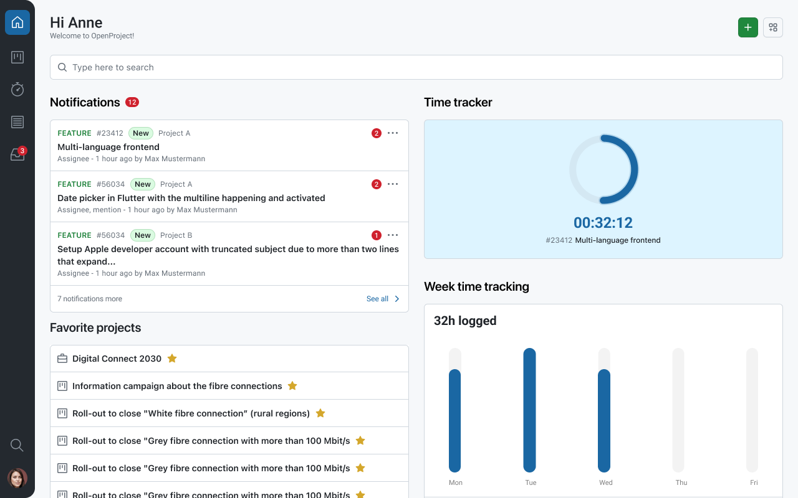
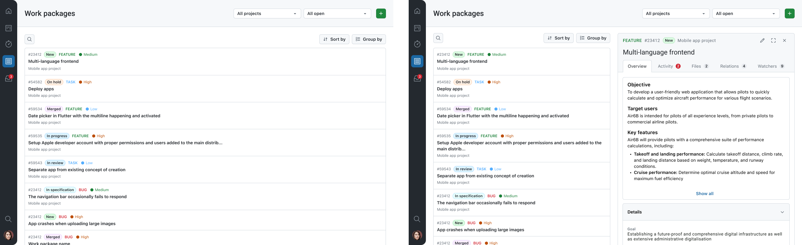

---
sidebar_navigation:
  title: Tablet support
  priority: 790
description: Tablet support for the OpenProject mobile app.
keywords: Mobile app tablet, tablet support, multi-device app, split-screen, tablet navigation, OpenProject mobile app
---

# Tablet support

The OpenProject mobile app is designed for smartphones, but it is also optimized for **tablet devices**. On larger screens, the app uses an adaptive interface that takes advantage of the extra space to make navigation and review workflows more efficient.

## Split-screen navigation

On tablets, the app uses a **split-screen layout**. This allows you to keep a list and a detail view visible at the same time, which reduces back-and-forth navigation.

With split-screen navigation, you can:

- Keep a **list of spaces/projects or work packages** visible on one side of the screen.
- Open the **details** of a selected space/project or work package on the other side.
- Move through items in the list while keeping the context visible.
- Quickly switch between work packages when reviewing or updating items in sequence.

This tablet layout provides a navigation experience that is closer to the desktop version, while remaining fully optimized for touch interaction.

## Notes

- The exact layout can vary depending on your device, screen size, and orientation.
- Some UI details may differ slightly between iOS and Android, but the split-screen concept remains the same.