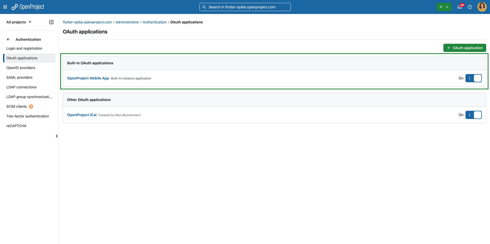
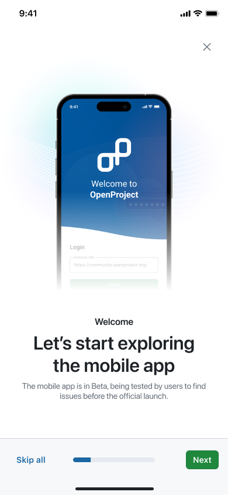
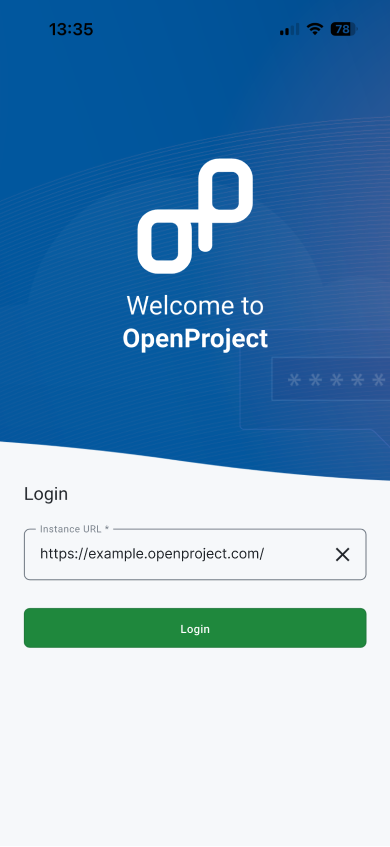
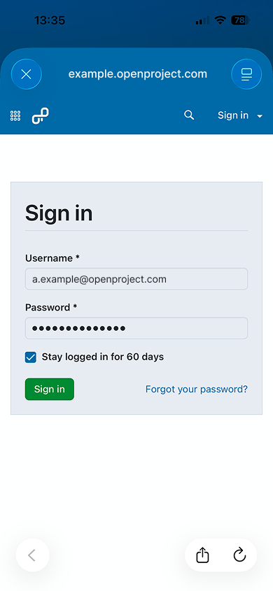
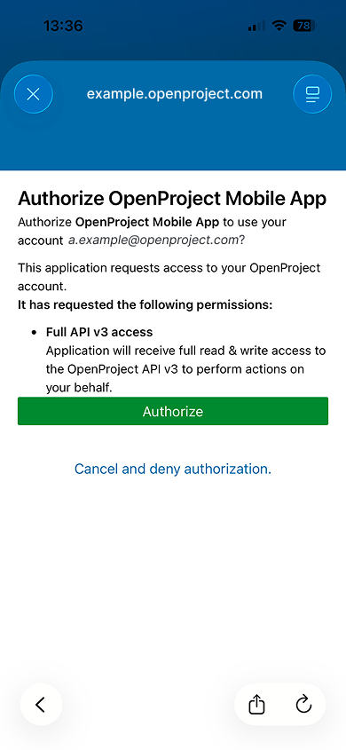

---
sidebar_navigation:
  title: Install and log in
  priority: 790
description: Follow these steps and requirements to start using the OpenProject Mobile app.
keywords: mobile app first steps, getting started, log in, log-in, login, mobile log in, openproject mobile app, download, access, install, mobile installation
---

# Install and log in

Follow these steps to install and start using the **OpenProject Mobile app**.

## 1) Check the requirements

Before downloading the app, ensure your setup meets these prerequisites:

- **An active OpenProject account:** Either an **OpenProject Cloud** workspace or an **OpenProject on-premises** installation with API access enabled.
- **HTTPS with a signed certificate (required):** Your instance must use **https** (not http) with a **signed certificate** to log in.
- **Minimum OpenProject version:** **17.0.0**
- **Minimum system requirements**
    - **iOS:** 15 or later
    - **Android:** 12 or later
- **Built-in OAuth applications enabled:** Make sure built-in OAuth applications are enabled in your administration settings:`{BASE_URL}/admin/oauth/applications`. This is required for successful login from the mobile app.

> [!NOTE]
> If you have an earlier OpenProject version, an administrator may need to enable the **Built in OAuth applications** flag under `{BASE_URL}/admin/settings/experimental`.

## 2) Download the app

The OpenProject Mobile app is available for both major platforms:

- **iOS:** [**App Store link**](https://apps.apple.com/us/app/openproject/id6474431879).
- **Android:** [**Google Play link**](https://play.google.com/store/apps/details?id=org.openproject.app&hl=en).

You can also search for **“OpenProject”** in your device’s app store.

## 3) Open the app

After installation:

1. Open the app on your device.
2. Review the short onboarding introduction.
3. Proceed to the login screen to connect to your OpenProject instance.

## 4) Choose your instance

Enter the complete **base URL** of your OpenProject instance, for example: `https://yourcompany.openproject.com`

## 5) Log in with your credentials

1. After your instance is confirmed, log in using your **OpenProject username and password** in the browser modal that opens.

2. When prompted, allow access so the app can connect securely to your workspace via the **OpenProject API v3**.

## 6) Start exploring

Once you’re logged in, you can start using key mobile workflows, including:

- View and edit **work packages**
- **Comment** and reply to discussions
- Organise your work in your own **home dashboard**
- Check all your work **projects** and spaces
- Create and track **meetings** quickly
- **Log time** and run focus **timers**