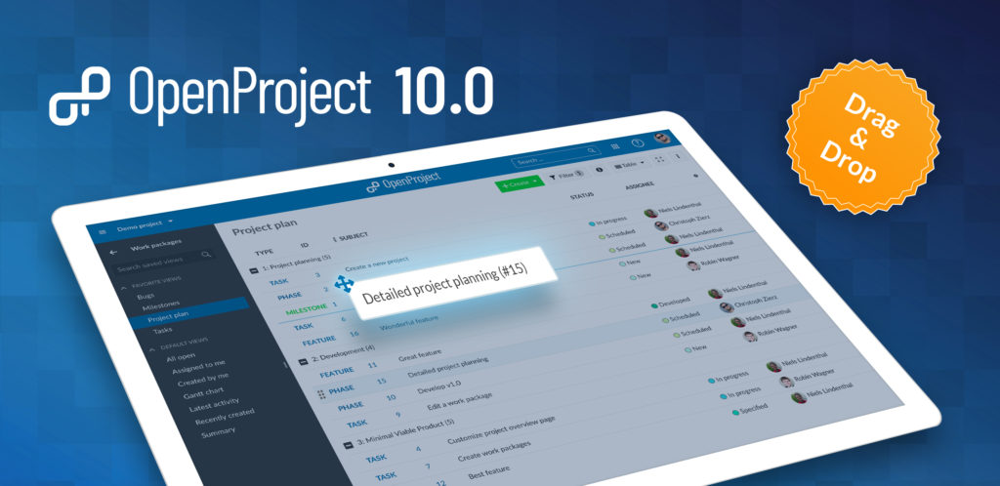
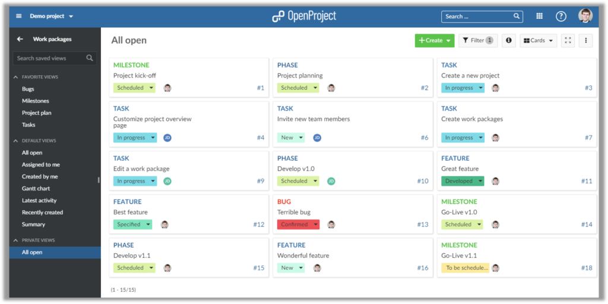
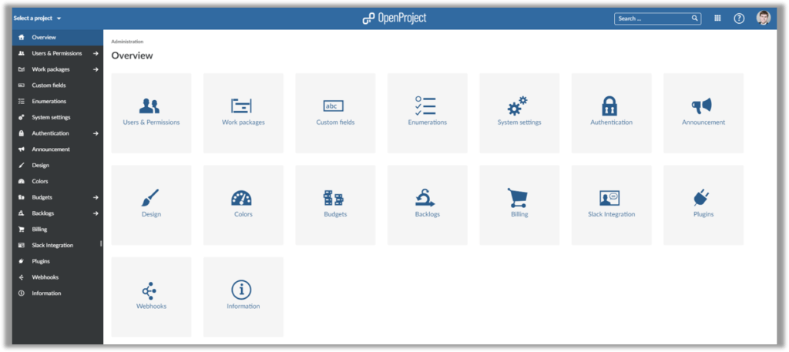
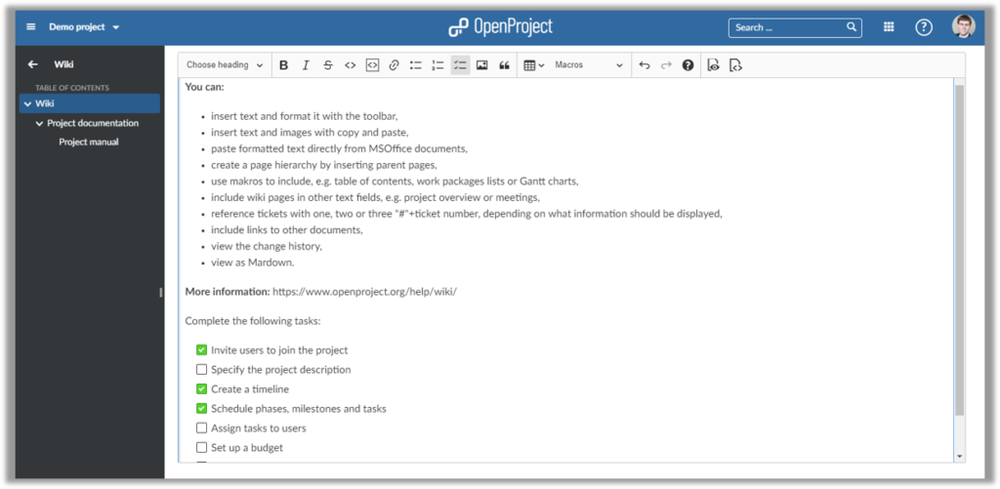

# OpenProject 10.0

OpenProject 10 introduces drag and drop ordering of work packages in the work package table and Gantt view. The project overview dashboard has been completely rewritten to provide a modern and flexible overview of the project. In addition, work package description and custom fields now have task lists you can create and manage within the CKEditor5 WYSIWYG editor. A new card view on the work package page provides quick overview of the tasks. Users of the Cloud and Enterprise Edition benefit from graphs which can be included in the project overview page.

Read below to get a detailed overview of what is new in OpenProject 10.

## Drag & drop (manual sorting) in work package table

OpenProject 10 adds drag and drop to the work package list. You can easily change the work package order by simply dragging a work package to a desired place.

This also allows you to change a work package's hierarchy (e.g. by dragging a work package from the first hierarchy level below an existing work package).

When you group the work package list based on an attribute (e.g. the assignee, project or status), you can easily change an attribute by dropping a work package to a different group. Want to change the assignee? Simply drag and drop a work package to a different assignee group.

## Card view for work packages

The work package view is extended in OpenProject 10. In addition to the list view and the Gantt chart view, it is possible to display work packages in a card format.

This provides an easy visual overview of the tasks in a project. Simply activate the details view to see more information about a work package.

## Updated Project Overview

OpenProject 10 introduces an updated project overview page. You can now easily add, edit and remove widgets - directly from the project overview page.

Freely configure how many columns are displayed on the project overview page.

The overview pages of users upgrading from earlier versions to OpenProject 10 will be updated automatically.

## Graphs on project overview page (Cloud / Enterprise Edition)

As a user of the Cloud or Enterprise Edition, you can add graphs to the overview page. This enables you to visualize important project information - directly form the project overview page.

Therefore, you can quickly communicate e.g. who is assigned to which work packages, how many tasks are still open and more. To give you maximum flexibility, you can choose from seven different types of graphs, such as bar charts, pie charts and line graphs.

As a result, you quickly see your project's status and can act accordingly.

## Updated administration menu and structure

The administration area is completely remodeled in OpenProject 10. Due to the changes, the administration menu is much more clearly structured.

Additionally, the administration overview page now highlights the different admin entries for quick access.

## Checkbox lists

You can easily add checkboxes in order to create to do lists to wiki pages, work package descriptions and many other pages which support the wiki syntax.

Afterwards, you can easily check off items which have been completed to keep track of your work.

## Sticky toolbar for WYSIWYG editor

The toolbar for wiki pages is now fixed at the top and no longer scrolls along with the page. Thus, you can easily edit even long texts on a wiki page without having to scroll up and down.

## Performance improvements

OpenProject 10 significantly improves the performance, especially for the work package page. Due to description caching work packages are loaded swiftly.

#### Bug fixes and changes

- Added: [Wiki] Allow to create child pages via links without a target [[#24167](https://community.openproject.com/wp/24167)]
- Added: Sticky text editor toolbar that is visible above long text fields [[#29738](https://community.openproject.com/wp/29738)]
- Added: Checkbox lists for work package [[#29804](https://community.openproject.com/wp/29804)]
- Added: Custom Fields are now shown in Projects API [[#30387](https://community.openproject.com/wp/30387)]
- Changed: Render text field links in the backend independently of the user [[#30501](https://community.openproject.com/wp/30501)]
- Changed: Widget: add graphs with single dataset [[#30522](https://community.openproject.com/wp/30522)]
- Changed: When drag and drop work packages indicate drop zone in work package list as flat line instead of entire row [[#30723](https://community.openproject.com/wp/30723)]
- Changed: View selector to switch between Gantt view, tiles view and list view [[#30746](https://community.openproject.com/wp/30746)]
- Changed: Add menu items "Sort by..." and "Group by..." to the more menu of a work packages view so the features are more visible [[#30751](https://community.openproject.com/wp/30751)]
- Changed: Don't highlight the first row in the split view [[#30765](https://community.openproject.com/wp/30765)]
- Fixed: Reminder mailer fails if assignee is not a user [[#25689](https://community.openproject.com/wp/25689)]
- Fixed: Unable to subscribe to member_updated or member_removed notifications [[#29632](https://community.openproject.com/wp/29632)]
- Fixed: SQL Injection Project orders [[#30132](https://community.openproject.com/wp/30132)]
- Fixed: Remove "new" badge of boards in Version 10.0 [[#30213](https://community.openproject.com/wp/30213)]
- Fixed: Insufficient space between user avatar and user name [[#30357](https://community.openproject.com/wp/30357)]
- Fixed: [DnD] Changing a WP changes the sort order [[#30389](https://community.openproject.com/wp/30389)]
- Fixed: Check spelling of e-mail vs. email [[#30411](https://community.openproject.com/wp/30411)]
- Fixed: Sorting relation sub elements influences the order of the rest of the table [[#30421](https://community.openproject.com/wp/30421)]
- Fixed: Boolean CF with unset values are shown empty in export [[#30442](https://community.openproject.com/wp/30442)]
- Fixed: Missing colors for work package status [[#30483](https://community.openproject.com/wp/30483)]
- Fixed: Table is not scrollable with enabled Gantt chart [[#30490](https://community.openproject.com/wp/30490)]
- Fixed: Fixed page size not forced in already-saved queries [[#30561](https://community.openproject.com/wp/30561)]
- Fixed: Subject fields in sync while creating 2 new board cards [[#30586](https://community.openproject.com/wp/30586)]
- Fixed: No warning when switching from project description to other page [[#30587](https://community.openproject.com/wp/30587)]
- Fixed: Sorting of card view is not the same as in the list [[#30675](https://community.openproject.com/wp/30675)]
- Fixed: Project resource not updated when changing a custom field [[#30683](https://community.openproject.com/wp/30683)]
- Fixed: Typo in German Enterprise Edition license Email (date) [[#30732](https://community.openproject.com/wp/30732)]
- Fixed: Users and permissions tile in the administration should link to the users table instead of the user settings [[#30742](https://community.openproject.com/wp/30742)]
- Fixed: After pressing enter in the work package widget title the cursor is still blinking [[#30757](https://community.openproject.com/wp/30757)]
- Fixed: Dropdown in WP list not centered (when next to subject) [[#30760](https://community.openproject.com/wp/30760)]
- Fixed: Context menu in Gantt not working [[#30761](https://community.openproject.com/wp/30761)]
- Fixed: Cannot drag & drop WP (child) work package created from context menu [[#30762](https://community.openproject.com/wp/30762)]
- Fixed: Drag & Drop: Order of other work package changed [[#30763](https://community.openproject.com/wp/30763)]
- Fixed: Missing border between tiles and split sceen and not aligned on the top [[#30764](https://community.openproject.com/wp/30764)]
- Fixed: Kosmetisch: Notification E-Mails manchmal schwarz / manchmal weiß [[#30769](https://community.openproject.com/wp/30769)]
- Fixed: New child work package that is created in the relations tab is not shown in the list view [[#30777](https://community.openproject.com/wp/30777)]
- Fixed: Typos in German language settings [[#30785](https://community.openproject.com/wp/30785)]
- Fixed: When changing WP type in Gantt shadow WPs are shown [[#30787](https://community.openproject.com/wp/30787)]
- Fixed: Enterprise Edition option shown in Cloud Administration (Page not found) [[#30788](https://community.openproject.com/wp/30788)]
- Fixed: Wrong side entry selected in administration when selecting "Work packages" [[#30789](https://community.openproject.com/wp/30789)]
- Fixed: Default descriptions get still applied even after deleting them. [[#30795](https://community.openproject.com/wp/30795)]
- Fixed: UX: Inconsistency when confirm-click on tick-button is needed (Adding an existing child vs. adding a relation). [[#30796](https://community.openproject.com/wp/30796)]
- Fixed: Switching from Gantt view back to table view will still display Gantt in the button [[#30797](https://community.openproject.com/wp/30797)]
- Fixed: Internal error when setting assignee [[#30799](https://community.openproject.com/wp/30799)]
- Fixed: View toggler not changing when activating Gantt in settings [[#30800](https://community.openproject.com/wp/30800)]
- Fixed: White space in Gantt when zooming out [[#30801](https://community.openproject.com/wp/30801)]
- Fixed: Zoom in Gantt loses WPs (zooms in on left side instead of center) [[#30802](https://community.openproject.com/wp/30802)]
- Fixed: Table and Gantt are off when many WPs are displayed [[#30805](https://community.openproject.com/wp/30805)]
- Fixed: Relations not translated in XLS export [[#30806](https://community.openproject.com/wp/30806)]
- Fixed: Watcher / relations numbers cut off in German (non-English languages) [[#30807](https://community.openproject.com/wp/30807)]
- Fixed: Cannot close set parent dialog with Escape right away / weird German text [[#30808](https://community.openproject.com/wp/30808)]
- Fixed: Empty parentheses briefly shown when creating new custom action [[#30809](https://community.openproject.com/wp/30809)]
- Fixed: Missing translation in administration (Status, Types, ...) [[#30811](https://community.openproject.com/wp/30811)]
- Fixed: Missing translations for OAuth authentication [[#30812](https://community.openproject.com/wp/30812)]
- Fixed: Wrong focus / scroll on admin entries [[#30814](https://community.openproject.com/wp/30814)]
- Fixed: Gantt: Can't move WP on time axis if follower has no finish date [[#30816](https://community.openproject.com/wp/30816)]
- Fixed: Type is wrongly changed in Action board on status change [[#30817](https://community.openproject.com/wp/30817)]
- Fixed: MS Edge: Dropzone for Drag & Drop not shown [[#30826](https://community.openproject.com/wp/30826)]
- Fixed: Icon wrongly shown briefly in administration submenus [[#30827](https://community.openproject.com/wp/30827)]
- Fixed: Links in administration open in same tab [[#30828](https://community.openproject.com/wp/30828)]
- Fixed: Sorting arrow not shown next to columns (automatic sorting) [[#30831](https://community.openproject.com/wp/30831)]
- Fixed: Gantt view for filtered out parent work packages not updated correctly [[#30837](https://community.openproject.com/wp/30837)]
- Fixed: Inaccessible linked work package shown as active link [[#30839](https://community.openproject.com/wp/30839)]
- Fixed: Creating empty cards in different columns leads to weird behavior [[#30842](https://community.openproject.com/wp/30842)]
- Fixed: Focus not set when adding existing card to board [[#30843](https://community.openproject.com/wp/30843)]
- Fixed: Adding existing card and creating new card form can be open at same time [[#30844](https://community.openproject.com/wp/30844)]
- Fixed: Search field cannot be minimzed / closed again after being opened [[#30846](https://community.openproject.com/wp/30846)]
- Fixed: Work package from board not shown in fullscreen [[#30848](https://community.openproject.com/wp/30848)]
- Fixed: Drag & Drop handle not shown in group mode when split screen was activated [[#30852](https://community.openproject.com/wp/30852)]
- Fixed: Author field is cut off even though there is plenty of space [[#30853](https://community.openproject.com/wp/30853)]
- Fixed: Dropdown menus not aligned [[#30856](https://community.openproject.com/wp/30856)]
- Fixed: Unnecessary scrollbars in work package view [[#30857](https://community.openproject.com/wp/30857)]
- Fixed: When clicking on "Webhooks" in admin menu, focus jumps to "Overview" [[#30859](https://community.openproject.com/wp/30859)]
- Fixed: Work package stays selected when clicking on WPs with split screen open [[#30862](https://community.openproject.com/wp/30862)]
- Fixed: Color of status button always shown in orange [[#30863](https://community.openproject.com/wp/30863)]
- Fixed: Project menu auto-closes in change project screen [[#30867](https://community.openproject.com/wp/30867)]
- Fixed: Versions not copied and copying slow [[#30872](https://community.openproject.com/wp/30872)]
- Fixed: Relations cannot be created [[#30877](https://community.openproject.com/wp/30877)]
- Fixed: Performance error on MyPage [[#30878](https://community.openproject.com/wp/30878)]
- Fixed: Bars in Roadmap graph are massive [[#30890](https://community.openproject.com/wp/30890)]
- Fixed: Words with umlauts are not found in PDF's [[#30891](https://community.openproject.com/wp/30891)]
- Fixed: Lists in Copy Workflow could be bigger [[#30892](https://community.openproject.com/wp/30892)]
- Fixed: WP description confusing/wrong? [[#30897](https://community.openproject.com/wp/30897)]
- Fixed: Page not found when using sign in from public project [[#30898](https://community.openproject.com/wp/30898)]
- Fixed: Spacing in members widget on overview page slightly crammed [[#30900](https://community.openproject.com/wp/30900)]
- Fixed: Project description not shown for some projects [[#30901](https://community.openproject.com/wp/30901)]
- Fixed: Custom field not shown for work package [[#30903](https://community.openproject.com/wp/30903)]
- Fixed: Unclear tab description in work package graph [[#30905](https://community.openproject.com/wp/30905)]
- Fixed: Chart in Roadmap details view minimizes [[#30907](https://community.openproject.com/wp/30907)]
- Fixed: Header not aligned to widget boxes in Project Overview Page [[#30911](https://community.openproject.com/wp/30911)]
- Fixed: Work package attribute called "Story Punkte js" instead of "Story Punkte" [[#30919](https://community.openproject.com/wp/30919)]
- Fixed: Second click on "All open" view doesn't reset the view toggle button [[#30921](https://community.openproject.com/wp/30921)]
- Fixed: Users in Members widget not correctly aligned [[#30925](https://community.openproject.com/wp/30925)]
- Fixed: Wiki TOC Error [[#30926](https://community.openproject.com/wp/30926)]
- Fixed: Wiki menu tree is still cached to old project when identifier renamed [[#30927](https://community.openproject.com/wp/30927)]
- Fixed: WorkPackage linked in comment text cannot be opened [[#30928](https://community.openproject.com/wp/30928)]
- Fixed: Error when creating new boards [[#30930](https://community.openproject.com/wp/30930)]
- Fixed: Unable to login [[#30932](https://community.openproject.com/wp/30932)]
- Fixed: Optimize text box formatting of header texts [[#30940](https://community.openproject.com/wp/30940)]
- Fixed: Harmonize drag and drop handle icons [[#30941](https://community.openproject.com/wp/30941)]
- Fixed: Project description and project details share the same icon [[#30942](https://community.openproject.com/wp/30942)]
- Fixed: Some widget titles can be edited which should be static [[#30945](https://community.openproject.com/wp/30945)]
- Fixed: grid is invisible during resizing and drag and drop of widgets [[#30946](https://community.openproject.com/wp/30946)]
- Fixed: Too long comment box when adding a picture to the text editor [[#30947](https://community.openproject.com/wp/30947)]
- Fixed: Overview page: click on link opens edit mode, instead of following the link [[#30948](https://community.openproject.com/wp/30948)]
- Fixed: Custom Action. Exception on OP Edge. "undefined method `iso8601' for "%CURRENT_DATE%":String" [[#30949](https://community.openproject.com/wp/30949)]
- Fixed: Wrong formatting of scroll bars on overview page in Windows [[#30951](https://community.openproject.com/wp/30951)]
- Fixed: Boards. EE ypsale. Translation missing. [[#30954](https://community.openproject.com/wp/30954)]
- Fixed: Drag and drop in embedded tables does not work (or should be deactivated for now) [[#30967](https://community.openproject.com/wp/30967)]
- Fixed: Picture slider in for BCF issues even if there is only one picture [[#30969](https://community.openproject.com/wp/30969)]
- Fixed: Members: Error message overlapping form but not X-icon to remove it [[#30971](https://community.openproject.com/wp/30971)]
- Fixed: Widget "Work packages overview" cuts off tooltip [[#30972](https://community.openproject.com/wp/30972)]
- Fixed: Missing save indication after renaming a widget [[#30975](https://community.openproject.com/wp/30975)]
- Fixed: Sorting board columns only applied after reload [[#30981](https://community.openproject.com/wp/30981)]
- Fixed: Overview grid widgets are not translated [[#30988](https://community.openproject.com/wp/30988)]
- Fixed: Crowdin JS translations not complete [[#30989](https://community.openproject.com/wp/30989)]
- Fixed: In- and Outdent create version conflicts with inline edition [[#30994](https://community.openproject.com/wp/30994)]
- Fixed: Inconsistent behavior to show add-widget buttons only after project creation [[#31011](https://community.openproject.com/wp/31011)]
- Fixed: Type colors lost in print of Gantt chart [[#31021](https://community.openproject.com/wp/31021)]
- Fixed: Graph titles get get lost after page reload [[#31026](https://community.openproject.com/wp/31026)]
- Fixed: Misaligned drag and drop handle in Members widget [[#31027](https://community.openproject.com/wp/31027)]
- Fixed: Single Sign on feature is available in Community Edition [[#31045](https://community.openproject.com/wp/31045)]
- Fixed: Cannot edit comment that was just created [[#31057](https://community.openproject.com/wp/31057)]

## Support

You will find useful information in the OpenProject [FAQ]() or you can post your questions in the [Forum](https://community.openproject.org/projects/openproject/boards).

### Upgrading your installation to OpenProject 10.0.

If you're using the OpenProject Cloud Edition, you are already running on the latest version of OpenProject 10.0. For your local installations, there are some minor changes you need to do in order to perform the upgrade.

[Please visit our upgrade guides for more information]().

## Credits

Special thanks go to all OpenProject contributors without whom this release would not have been possible:

- All the developers, designers, project managers who have contributed to OpenProject.
- Every dedicated user who has [reported bugs]() and supported the community by asking and answering questions in the [forum](https://community.openproject.org/projects/openproject/boards).
- All the engaged users who provided translations on [CrowdIn](https://crowdin.com/projects/opf).

## What's next?

We are continuously developing new features and improvements for OpenProject.
The next release will contain a dashboard and reporting view for OpenProject and also allow to communicate the project status using a traffic light.
Take a look at the [release timeline](https://community.openproject.com/projects/openproject/work_packages?query_id=918) to see the upcoming features and releases.

To stay up to date with the recent development, feel free to follow OpenProject on [Twitter](https://twitter.com/openproject) and like OpenProject on [Facebook](https://www.facebook.com/openprojectfoundation).
