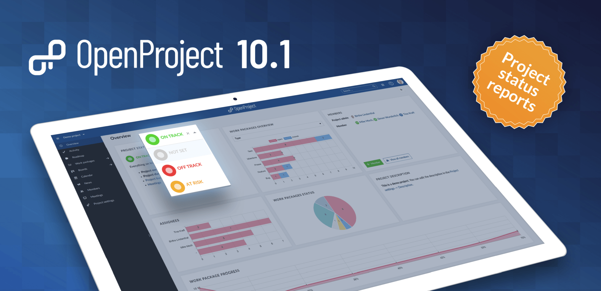
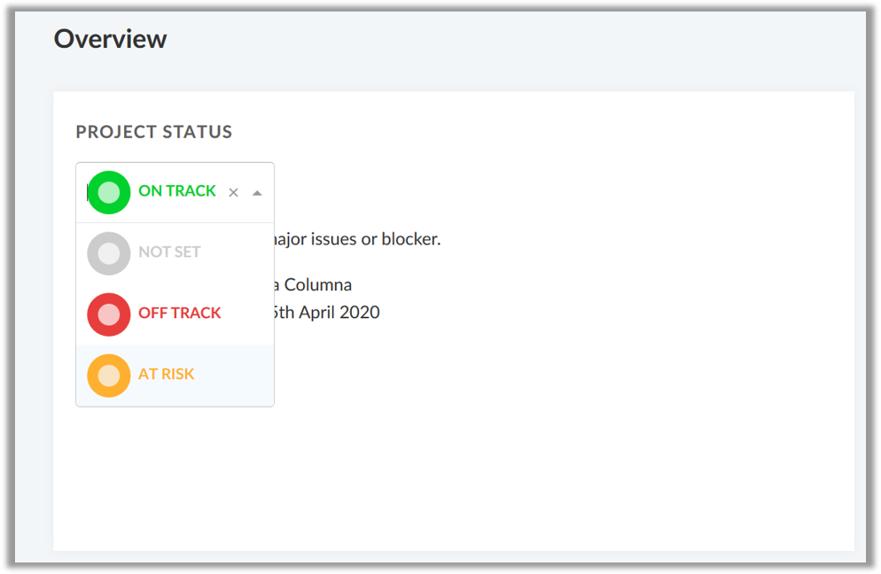
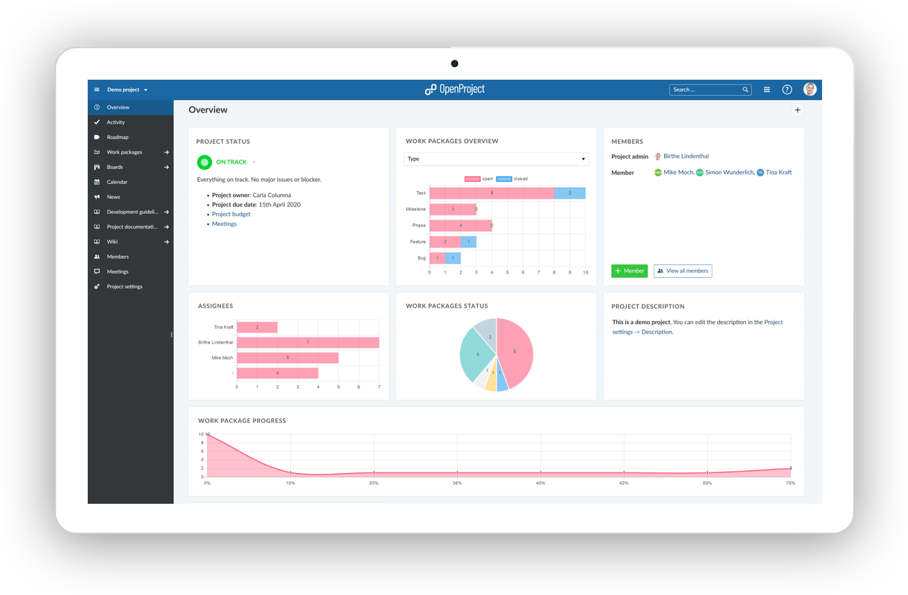

# OpenProject 10.1.0

One of the big improvements of the new release of OpenProject 10.1 is the project overview dashboard page with a new project status widget for online project status reporting.

Furthermore, we have included a lot of bug fixes and code maintenance to improve the overall condition of OpenProject.

Read below to get a detailed overview of what is new in OpenProject 10.1.

## Project status reporting

A new **project status widget** can be added to the project overview page for easy and transparent project status reporting. It displays the project status in a traffic light.

Communicate the project status to your team and stakeholders in one place by displaying a status widget on the project overview page.

Show at one sight whether your project is on track, at risk or off track and add important project information, such as project owner, due dates, links to important resources and more.

The project status widget contains a placeholder NOT SET when initially activated.

This way, the project overview page can be extended to a detailed reporting dashboard for your projects.

[Find out more about the new project status reporting in OpenProject]().

## CRUD operations for projects in API v3

The API v3 now also enables CRUD on Projects.

## Code maintenance

### Consolidate work package edit field implementation

OpenProject contains a new consolidated look and feel for work package edit fields. The different edit fields now have a harmonized technical base and now look alike.

### Upgrade to Rails 6.0.0

OpenProject has been updated to Rails 6.0.0.

#### Bug fixes and changes

- Fixed: Status dropdown is misplaced when the widget is at the bottom of the page [[#31426](https://community.openproject.com/wp/31426#_ga=2.168560865.1501258633.1571644139-552243109.1568622391)]
- Fixed: Project overview: Display fields should be "read only" when user lacks permissions [[#31453\]](https://community.openproject.com/wp/31426#_ga=2.168560865.1501258633.1571644139-552243109.1568622391)
- Fixed: Type selection drop down looks ugly [[#31457\]](https://community.openproject.com/wp/31426#_ga=2.168560865.1501258633.1571644139-552243109.1568622391)
- Fixed: Scheduling new bar in Gantt chart not working properly [[#31426\]](https://community.openproject.com/wp/31426#_ga=2.168560865.1501258633.1571644139-552243109.1568622391)
- Fixed: Edit abilities between angular and rails differ for project text cf and project status [[#31483\]](https://community.openproject.com/wp/31426#_ga=2.168560865.1501258633.1571644139-552243109.1568622391)
- Fixed: Can add status column multiple times to board [[#31506\]](https://community.openproject.com/wp/31426#_ga=2.168560865.1501258633.1571644139-552243109.1568622391)
- Fixed: Size of widgets sometimes not changeable [[#31489\]](https://community.openproject.com/wp/31489#_ga=2.168560865.1501258633.1571644139-552243109.1568622391)
- Fixed: Rendering error resulting in too much space between the widgets [[#31490\]](https://community.openproject.com/wp/31489#_ga=2.168560865.1501258633.1571644139-552243109.1568622391)
- Fixed: Incorrect order of the status in the diagram [[#31383\]](https://community.openproject.com/wp/31489#_ga=2.168560865.1501258633.1571644139-552243109.1568622391)
- Fixed: Wrong formatting of preview cards [[#31391\]](https://community.openproject.com/wp/31489#_ga=2.168560865.1501258633.1571644139-552243109.1568622391)
- Fixed: Modal for adding widget too high for smaller viewports [[#31396\]](https://community.openproject.com/wp/31489#_ga=2.168560865.1501258633.1571644139-552243109.1568622391)
- Fixed: Since 10.0, in repository commits, links to work packages look bad [[#31284\]](https://community.openproject.com/wp/31489#_ga=2.168560865.1501258633.1571644139-552243109.1568622391)
- Fixed: When deleting and re-uploading document in documents plugin it is not added [[#31452\]](https://community.openproject.com/wp/31452#_ga=2.168560865.1501258633.1571644139-552243109.1568622391)
- Fixed: Switching from dashboard/my page to wp page (and other angular pages) leads to gray background [[#31459\]](https://community.openproject.com/wp/31489#_ga=2.168560865.1501258633.1571644139-552243109.1568622391)
- Fixed: On community.openproject.com comment area is still shown after sending comment [[#31477\]](https://community.openproject.com/wp/31489#_ga=2.168560865.1501258633.1571644139-552243109.1568622391)
- Fixed: Project status description not displayed when adding macro (from project settings) [[#31454\]](https://community.openproject.com/wp/31489#_ga=2.168560865.1501258633.1571644139-552243109.1568622391)
- Fixed: Widget sometimes not movable [[#31486\]](https://community.openproject.com/wp/31489#_ga=2.168560865.1501258633.1571644139-552243109.1568622391)
- Fixed: Cannot edit work package comments if content is too wide. [[#31207\]](https://community.openproject.com/wp/31489#_ga=2.168560865.1501258633.1571644139-552243109.1568622391)
- Fixed: Mail notification for meeting review showing the wrong timezone [[#31127\]](https://community.openproject.com/wp/31489#_ga=2.168560865.1501258633.1571644139-552243109.1568622391)
- Fixed: Sorting of bars in work package graphs are inconsistent to the sorting of groups in the work packages table [[#30977\]](https://community.openproject.com/wp/31489#_ga=2.168560865.1501258633.1571644139-552243109.1568622391)
- Fixed: Formatting error in checkboxes in text editor [[#31248\]](https://community.openproject.com/wp/31489#_ga=2.168560865.1501258633.1571644139-552243109.1568622391)
- Fixed: [openproject-documents] Cannot delete attachments [[#31126\]](https://community.openproject.com/wp/31489#_ga=2.168560865.1501258633.1571644139-552243109.1568622391)
- Fixed: Budget should display correct decimal separator. [[#31053\]](https://community.openproject.com/wp/31489#_ga=2.168560865.1501258633.1571644139-552243109.1568622391)
- Fixed: Empty page shown on project overview page [[#31226\]](https://community.openproject.com/wp/31489#_ga=2.168560865.1501258633.1571644139-552243109.1568622391)
- Fixed: Text tables in widgets (e.g. project description, project status) cannot be scrolled [[#31480\]](https://community.openproject.com/wp/31489#_ga=2.168560865.1501258633.1571644139-552243109.1568622391)
- Fixed: Internal error when accessing admin work packages section [[#31305\]](https://community.openproject.com/wp/31489#_ga=2.168560865.1501258633.1571644139-552243109.1568622391)
- Fixed: Widget flickers sometimes [[#31488\]](https://community.openproject.com/wp/31489#_ga=2.168560865.1501258633.1571644139-552243109.1568622391)
- Fixed: Work Package subject jumps again when editing [[#31448\]](https://community.openproject.com/wp/31489#_ga=2.168560865.1501258633.1571644139-552243109.1568622391)
- Fixed: Incoming mail with unknown user=accept results in untranslated contract errors [[#31500\]](https://community.openproject.com/wp/31489#_ga=2.168560865.1501258633.1571644139-552243109.1568622391)
- Fixed: Editing versions terribly slow because `/api/v3/versions/available projects` is potentially loading a large number of projects [[#31312\]](https://community.openproject.com/wp/31489#_ga=2.168560865.1501258633.1571644139-552243109.1568622391)
- Fixed: Error when loading work packages graph for categories [[#31377\]](https://community.openproject.com/wp/31489#_ga=2.168560865.1501258633.1571644139-552243109.1568622391)
- Fixed: API documentation wrongfully describes the project status [[#31362\]](https://community.openproject.com/wp/31489#_ga=2.168560865.1501258633.1571644139-552243109.1568622391)
- Fixed: Direct error message dirctly when trying to copy a project. [[#31313\]](https://community.openproject.com/wp/31489#_ga=2.168560865.1501258633.1571644139-552243109.1568622391)
- Fixed: Grid: Cannot escape edition with escape [[#31394\]](https://community.openproject.com/wp/31489#_ga=2.168560865.1501258633.1571644139-552243109.1568622391)
- Fixed: Work package graph view for projects without work packges look broken [[#31449\]](https://community.openproject.com/wp/31489#_ga=2.168560865.1501258633.1571644139-552243109.1568622391)

## Support

You will find useful information in the OpenProject [FAQ]() or you can post your questions in the [Forum](https://community.openproject.org/projects/openproject/boards).

### Upgrading your installation to OpenProject 10.1.

If you’re using the OpenProject Cloud Edition, you will be automatically updated to the latest version of OpenProject 10.1 in the next days. For your local installations, there are some minor changes you need to do in order to perform the upgrade.

[Please visit our upgrade guides for more information]().

## Credits

Special thanks go to all OpenProject contributors without whom this release would not have been possible:

- All the developers, designers, project managers who have contributed to OpenProject.
- Every dedicated user who has [reported bugs]() and supported the community by asking and answering questions in the [forum](https://community.openproject.org/projects/openproject/boards).
- All the engaged users who provided translations on [CrowdIn](https://crowdin.com/projects/opf).

## What’s next?

We are continuously developing new features and improvements for OpenProject.
The next release will contain a multi-project portfolio view which provides a quick overview of your most important projects.
Take a look at the [release timeline](https://community.openproject.com/projects/openproject/work_packages?query_id=918) to see the upcoming features and releases.

To stay up to date with the recent development, feel free to follow OpenProject on [Twitter](https://twitter.com/openproject) and like OpenProject on [Facebook](https://www.facebook.com/openprojectfoundation).
