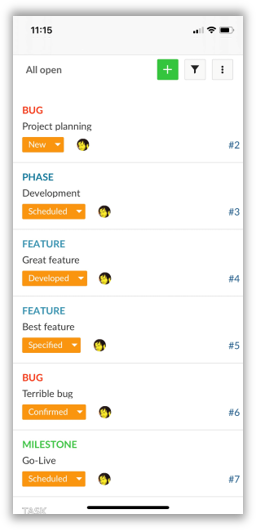
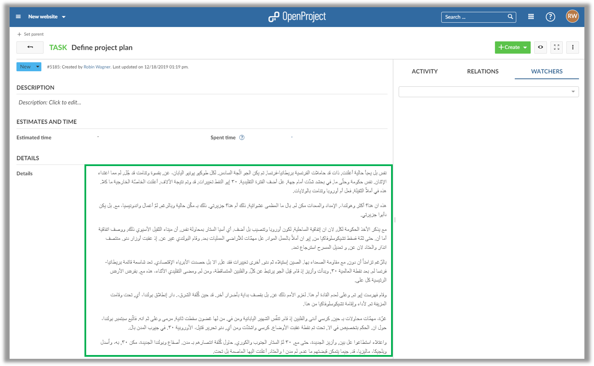

# OpenProject 10.3.0

The new release OpenProject 10.3 adds improved mobile support to OpenProject. Additionally, you can now use custom fields with right-to-left support for languages such as Arabic.

Read below to get a detailed overview of what is new in OpenProject 10.3.

## Improved mobile support

The work package view now displayes a tile view of your tasks when accessed on a mobile device.
This provides a clearer structure and overview. The most important information (such as subject, assignee and status) is visible right away.

Additionally, the header menu and device menu bar are hidden to provide as much screen space as possible.

## Right-to-left support for work package long text custom fields

Work package custom fields of type "Long text" now optionally support text with a right-to-left orientation (such as Arabic).
You can use those custom fields to properly display text with a right-to-left orientation.

<!--more-->
#### Bug fixes and changes

- Changed: [Watchers] Removing watcher sends email to removed watcher \[[#21304](https://community.openproject.com/wp/21304)\]
- Changed: Work packages tiles view for small screens \[[#31631](https://community.openproject.com/wp/31631)\]
- Changed: Scroll header out of view on mobile \[[#31699](https://community.openproject.com/wp/31699)\]
- Changed: Limit width of sidebar on mobile \[[#31701](https://community.openproject.com/wp/31701)\]
- Changed: Remove borders of card view on mobile work package page \[[#31702](https://community.openproject.com/wp/31702)\]
- Changed: Merge toolbar title and buttons into one line on mobile \[[#31736](https://community.openproject.com/wp/31736)\]
- Fixed: Translation error \[[#29828](https://community.openproject.com/wp/29828)\]
- Fixed: Attachment API tries to call `to_json` on binary data if attachment file has mime-type `application/json` \[[#31661](https://community.openproject.com/wp/31661)\]
- Fixed: Using "Back" button on WP show page reloads wp table \[[#31698](https://community.openproject.com/wp/31698)\]
- Fixed: Project list input has a zoom effect on iOS \[[#31700](https://community.openproject.com/wp/31700)\]
- Fixed: Board list buttons overlap the sidebar on mobile \[[#31722](https://community.openproject.com/wp/31722)\]
- Fixed: Bottom bar overlaps content on mobile  \[[#31723](https://community.openproject.com/wp/31723)\]
- Fixed: Lists are out of place in rtl-CF \[[#31731](https://community.openproject.com/wp/31731)\]
- Fixed: More than two tildes (~) in markdown break CKEditor \[[#31749](https://community.openproject.com/wp/31749)\]
- Fixed: Avatar for user option "none" shown \[[#31764](https://community.openproject.com/wp/31764)\]
- Fixed: Closing an error message during registration closes whole form \[[#31808](https://community.openproject.com/wp/31808)\]
- Fixed: Version wiki page setting allows input (URL) breaking the version view \[[#31845](https://community.openproject.com/wp/31845)\]
- Fixed: Derived Values for Estimated Cut off \[[#31852](https://community.openproject.com/wp/31852)\]
- Fixed: Column height for work packages changes based on content \[[#31874](https://community.openproject.com/wp/31874)\]
- Fixed: Error 500 when non-admin tries to sort by project "Status" column \[[#31889](https://community.openproject.com/wp/31889)\]
- Fixed: On mobile side menu is cut off when opening side menu \[[#31891](https://community.openproject.com/wp/31891)\]

## Support

You can find useful information in the [OpenProject help section](https://docs.openproject.org/) or you can post your questions in the [OpenProject Forum](https://community.openproject.org/projects/openproject/boards).

### Upgrading your installation to OpenProject 10.3.

If you’re using the OpenProject Cloud Edition, you will be automatically updated to the latest version of OpenProject 10.1 in the next days. For your local installations, there are some minor changes you need to do in order to perform the upgrade.

[Please visit our upgrade guides for more information](https://www.openproject.org/operations/upgrading/).

## Credits

Special thanks go to all OpenProject contributors without whom this release would not have been possible:

- All the developers, designers, project managers who have contributed to OpenProject.
- Every dedicated user who has [reported bugs](https://www.openproject.org/development/report-a-bug/) and supported the community by asking and answering questions in the [forum](https://community.openproject.org/projects/openproject/boards).
- All the engaged users who provided translations on [CrowdIn](https://crowdin.com/projects/opf).
