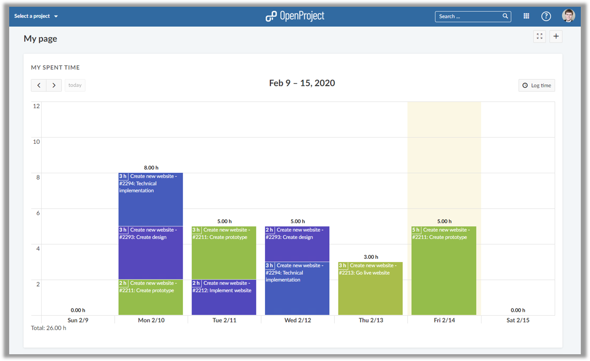
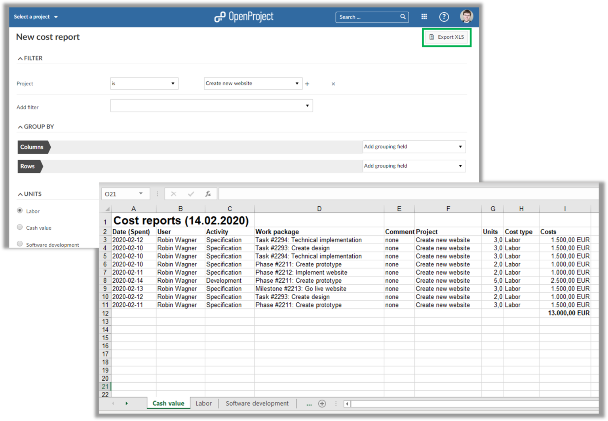
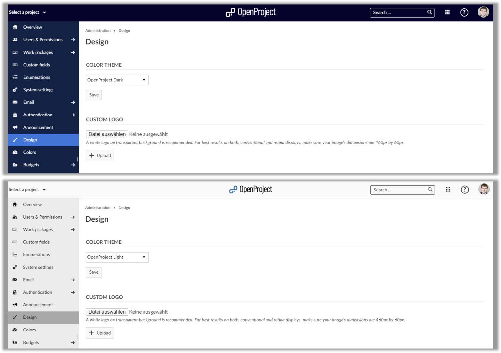
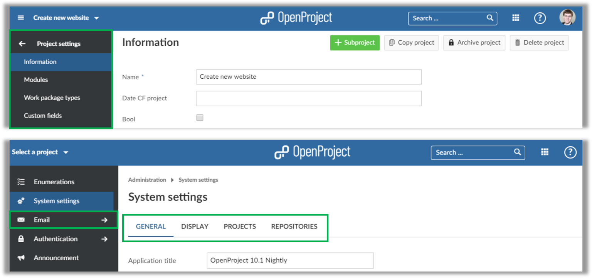
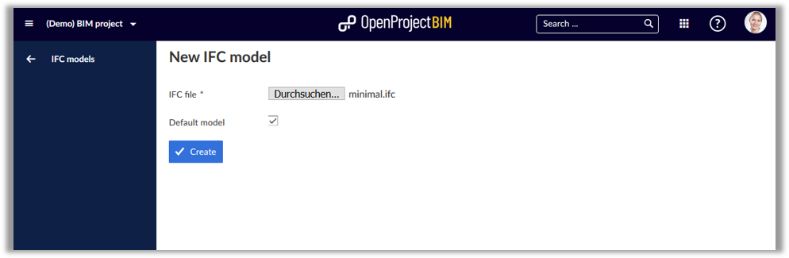
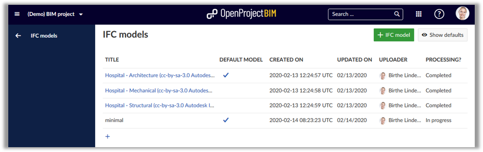
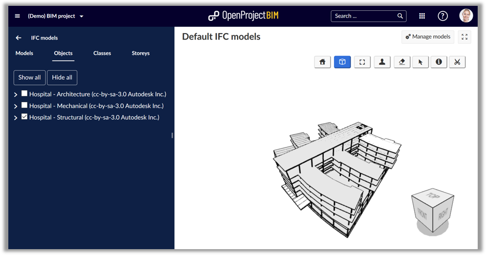
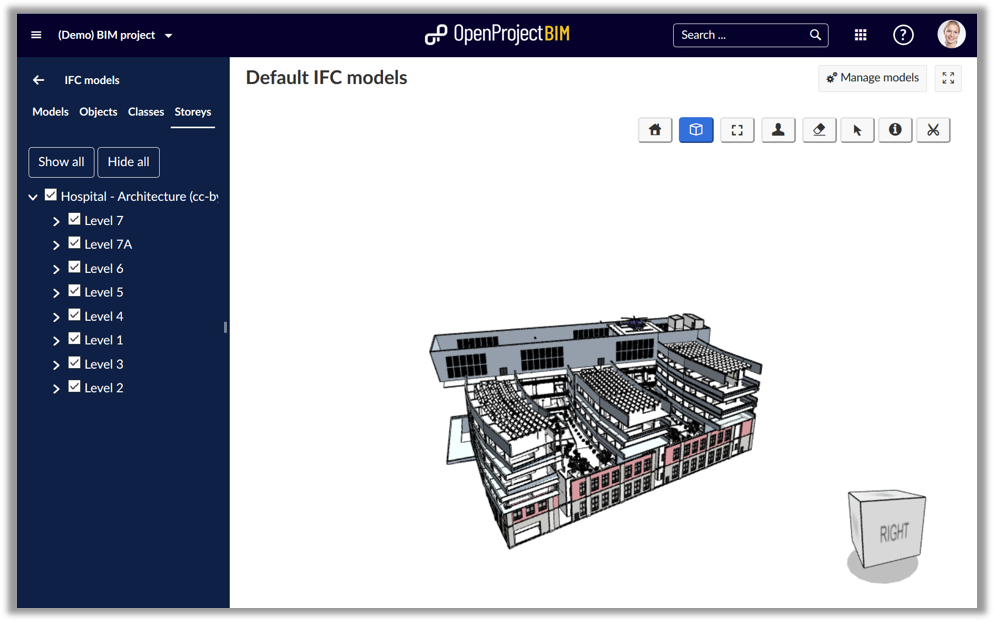
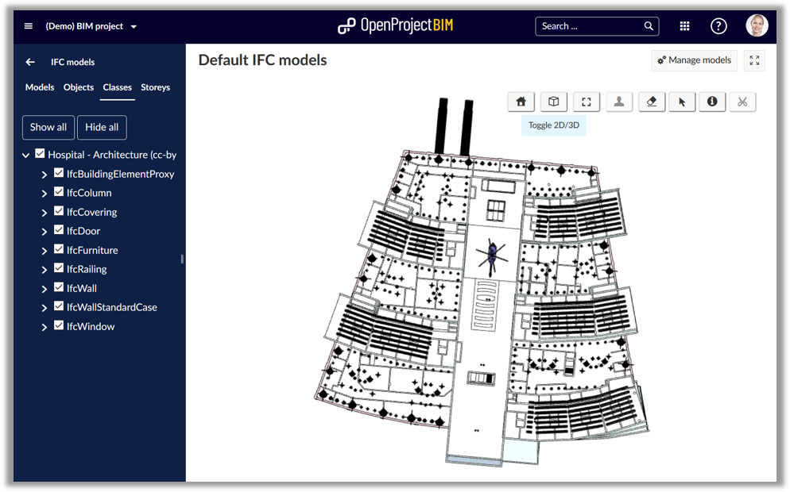

# Release notes OpenProject 10.4.0

| Release notes                                                | Description                                                  |
| ------------------------------------------------------------ | :----------------------------------------------------------- |
| [OpenProject 10.4.0](#openproject-1040)                      | What is new for OpenProject 10.4.0?                          |
| [OpenProject 10.4 BIM Edition for construction project management](#openproject-104-bim-edition-for-construction-project-management) | What is new for the construction project management for the building industry in OpenProject 10.4.0? |

## OpenProject 10.4.0

We released OpenProject 10.4. The new release of the open source project management software contains a new time tracking widget for the My page which facilitates visualizing and logging time spent on your tasks. Additionally, cost reports can now be exported to Excel.

Cloud and Enterprise Edition users can now choose between the default OpenProject theme, a light theme and a dark theme. This provides a good starting point for further design customization.

Read below to get a detailed overview of what is new in OpenProject 10.4.

### Spent time widget on My page

Tracking your own time is a lot easier with OpenProject 10.4. The release replaces the existing Spent time widget on your personal My page with a modern time tracking overview. You can now easily see your logged time in a comprehensive weekly calendar view.

The tasks you worked on are color-coded. Therefore, you see right away which tasks you spent the most time on in the current week. Viewing or changing your logged hours is also a lot easier - simply drag and drop the time block to the correct day to make a change.

### Export cost reports to Excel

Having the ability to export cost reports was one of the most requested features. With OpenProject 10.4 you can just that. From your cost report set the appropriate filters and export it as an Excel document.

The Excel spreadsheet lists the tracked time, cost, as well as the different cost types. This makes it very easy to perform further computations or to forward the data to someone else, e.g. your accounting department.

### Light and dark theme for OpenProject (Premium feature)

Cloud and Enterprise Edition users can now easily customize the look and feel of their OpenProject environment by using a custom logo and adjusting the color theme. With OpenProject 10.4 this gets a lot easier - thanks to default themes. Simply choose between the OpenProject theme, the light theme and the dark theme.

These themes are optimized and fulfill accessibility requirements. You can further customize them by starting with one of the default themes and adjusting individual colors based on your needs.

### Updated menus for project and system administration

The menus in the project and system administration are updated with OpenProject 10.4. Wherever possible the tab navigation has been replaced with sub menus.

The other tabs menus have been updated to a modern layout. Additionally, the email settings have moved out into their own menu item in the system administration.

## OpenProject 10.4 BIM Edition for construction project management

What is new for the digital construction project management for the building industry in OpenProject?

OpenProject contains a new IFC file model viewer to integrate 3D models in the IFC format in OpenProject. You can now upload IFC files and display the building models directly in your browser in OpenProject - withIFC model upload and viewer

Import of 3D building models directly in your OpenProject application. The supported format is IFC files.

### Manage multiple IFC models in OpenProject

In OpenProject you can now manage multiple building models in IFC format in parallel. **Browse through multiple models at the same time** and selectively activate models such as architecture and heating, ventilation and air conditioning (HVAC). Set "default" models to be displayed.

### IFC viewer integrated in OpenProject

OpenProject 10.4 supports to open 3D **models** **and** **visualize** **building** **models** directly in your browser. With this new integrated functionality for construction project management you can now easily **share** **multiple IFC** **files** with your team directly in OpenProject - integrated with all OpenProject functionalities for the project management along the entire building project life-cycle, i.e. BCF management, issue tracking, project planning, documentation.

View full 3D objects in OpenProject in IFC format. Select and display the model in total, for objects, classes and storeys for the building.

### **Switch between 3D and 2D view** for your building model in OpenProject.

You can change between a 3D view or 2D view of the building model in OpenProject.

### Slice objects to get exact view

You can slice 3D objects in all dimensions to get a view on the exact thing you need.

## Further improvements and bug fixes

- Changed: API v3 time entries create and update form as well as schema \[[#28727](https://community.openproject.com/wp/28727)\]
- Changed: Remove tab "Forum" from project settings \[[#31905](https://community.openproject.com/wp/31905)\]
- Changed: Replace project settings tab by sub menu entries \[[#31906](https://community.openproject.com/wp/31906)\]
- Changed: Adapt old tab layouts to newer search tabs \[[#31914](https://community.openproject.com/wp/31914)\]
- Changed: Simplify instance color theme changes (EE) \[[#31974](https://community.openproject.com/wp/31974)\]
- Changed: Zen mode for ifc viewer \[[#32053](https://community.openproject.com/wp/32053)\]
- Changed: Re-name menu item in project settings from Enabled modules to Modules and Backlogs settings to Backlogs \[[#32056](https://community.openproject.com/wp/32056)\]
- Changed: Formatted text for description in pdf export \[[#32065](https://community.openproject.com/wp/32065)\]
- Changed: Interactive time logging widget on my page \[[#32097](https://community.openproject.com/wp/32097)\]
- Changed: Change header of spent time widget in My page to "My spent time" and make it not-editable \[[#32127](https://community.openproject.com/wp/32127)\]
- Changed: Add button "Log time" on widget "My spent time" \[[#32128](https://community.openproject.com/wp/32128)\]
- Changed: Make header of spent time widget in Project overview page not-editable \[[#32130](https://community.openproject.com/wp/32130)\]
- Changed: Sort versions by date on wp list and version list and version autocompleter \[[#32156](https://community.openproject.com/wp/32156)\]
- Changed: Change OpenProject Dark theme to the same color theme as for BIM \[[#32191](https://community.openproject.com/wp/32191)\]
- Changed: Change wording of relation queries \[[#32209](https://community.openproject.com/wp/32209)\]
- Changed: Allow setting version on bulk copy \[[#32267](https://community.openproject.com/wp/32267)\]
- Fixed: Calendar does not respect "weeks start on" \[[#31271](https://community.openproject.com/wp/31271)\]
- Fixed: Overlapping menus on WP page \[[#31524](https://community.openproject.com/wp/31524)\]
- Fixed: Wrong characters encoding when using Work package export with html signs \[[#31676](https://community.openproject.com/wp/31676)\]
- Fixed: Limited entries in Spent Time list on My Page \[[#31685](https://community.openproject.com/wp/31685)\]
- Fixed: Project overview page not usable on mobile \[[#31744](https://community.openproject.com/wp/31744)\]
- Fixed: Language selection on mobile cut off \[[#31846](https://community.openproject.com/wp/31846)\]
- Fixed: Webhook is crashing internally with NameError: undefined local variable or method `params' \[[#31848](https://community.openproject.com/wp/31848)\]
- Fixed: Forum menu entry not highlighted \[[#31849](https://community.openproject.com/wp/31849)\]
- Fixed: Removing a date is from a WP is not consistently possible \[[#31859](https://community.openproject.com/wp/31859)\]
- Fixed: Ampersand (&) and quote marks (") is not exported correctly in work package description in pdf-export with description \[[#31860](https://community.openproject.com/wp/31860)\]
- Fixed: Keyboard opens unnecessarily on mobile \[[#31871](https://community.openproject.com/wp/31871)\]
- Fixed: Wrong thousands separator in budget values when language is set to German  \[[#31911](https://community.openproject.com/wp/31911)\]
- Fixed: Child WP version cannot be edited although parent is no backlogs type \[[#31922](https://community.openproject.com/wp/31922)\]
- Fixed: Total Estimate time won't be re-calculated after hierarchy of sub-nodes changed \[[#31925](https://community.openproject.com/wp/31925)\]
- Fixed: Special characters (e.g. '#' and '&') trip up search autocompleter \[[#31964](https://community.openproject.com/wp/31964)\]
- Fixed: Migration from 7.4 to 10.3 fails \[[#31997](https://community.openproject.com/wp/31997)\]
- Fixed: Grey security badge showing "UNKNOWN" status after upgrade to OpenProject 10.3.1 \[[#32023](https://community.openproject.com/wp/32023)\]
- Fixed: Unable to login (fresh install) \[[#32028](https://community.openproject.com/wp/32028)\]
- Fixed: Error message is insufficient when IFC file size is too large \[[#32032](https://community.openproject.com/wp/32032)\]
- Fixed: Wording "Default value" is misleading \[[#32033](https://community.openproject.com/wp/32033)\]
- Fixed: Menu item "IFC Models" links to the default, although there is no default model  \[[#32034](https://community.openproject.com/wp/32034)\]
- Fixed: Wrong breadcrumbs in Administration \[[#32039](https://community.openproject.com/wp/32039)\]
- Fixed: Duplicate work package priorities in Administration -> Enumerations \[[#32041](https://community.openproject.com/wp/32041)\]
- Fixed: In German separator for costs is wrong \[[#32042](https://community.openproject.com/wp/32042)\]
- Fixed: Roadmap index page highlights wrong menu item \[[#32103](https://community.openproject.com/wp/32103)\]
- Fixed: Server error after actions in the work package list \[[#32112](https://community.openproject.com/wp/32112)\]
- Fixed: Parent changes by drag and drop are not saved correctly \[[#32114](https://community.openproject.com/wp/32114)\]
- Fixed: Select all / unselect all for modules, work package types, etc. not visible \[[#32116](https://community.openproject.com/wp/32116)\]
- Fixed: Query indicates unsaved changes without changes to query \[[#32118](https://community.openproject.com/wp/32118)\]
- Fixed: Error when editing Gantt chart in quick succession (+ weird scheduling) \[[#32133](https://community.openproject.com/wp/32133)\]
- Fixed: Blank Gantt chart when zooming out \[[#32134](https://community.openproject.com/wp/32134)\]
- Fixed: In cost reports in Firefox cancel icons overlap filters \[[#32135](https://community.openproject.com/wp/32135)\]
- Fixed: Tab "Email notifications" loads for long time and header not shown \[[#32136](https://community.openproject.com/wp/32136)\]
- Fixed: Tabs in Firefox flicker \[[#32137](https://community.openproject.com/wp/32137)\]
- Fixed: OpenProject logo in light theme is hard to see \[[#32141](https://community.openproject.com/wp/32141)\]
- Fixed: Error 403 when trying to export work package list with descriptions \[[#32142](https://community.openproject.com/wp/32142)\]
- Fixed: Wrong icon in time entries modal \[[#32143](https://community.openproject.com/wp/32143)\]
- Fixed: The date field has wrong width in time entries modal \[[#32145](https://community.openproject.com/wp/32145)\]
- Fixed: The hours field has wrong width in time entries modal \[[#32146](https://community.openproject.com/wp/32146)\]
- Fixed: Wrong header in time entries form "Edit time entry" -> "Time entry" \[[#32147](https://community.openproject.com/wp/32147)\]
- Fixed: Redundant close button in the time entry modal \[[#32148](https://community.openproject.com/wp/32148)\]
- Fixed: Inconsistent/redundant naming in time entry creation modal \[[#32150](https://community.openproject.com/wp/32150)\]
- Fixed: "Get startet for free" broken \[[#32161](https://community.openproject.com/wp/32161)\]
- Fixed: WP list does not update after updating a WP of that query \[[#32168](https://community.openproject.com/wp/32168)\]
- Fixed: Recaptcha should not target admin accounts \[[#32177](https://community.openproject.com/wp/32177)\]
- Fixed: Deleting work package will not refresh the list \[[#32179](https://community.openproject.com/wp/32179)\]
- Fixed: Edit a wiki page send an email with a wrong number for diff \[[#32180](https://community.openproject.com/wp/32180)\]
- Fixed: Version show page has the project settings menu item selected \[[#32183](https://community.openproject.com/wp/32183)\]
- Fixed: Backlogs settings available in project settings although backlogs module is not active \[[#32184](https://community.openproject.com/wp/32184)\]
- Fixed: Billing widget looks different on the starting screen \[[#32186](https://community.openproject.com/wp/32186)\]
- Fixed: Error message when trying to name group \[[#32189](https://community.openproject.com/wp/32189)\]
- Fixed: Work package relation labels inconsistent between form configuration and relations tab \[[#32190](https://community.openproject.com/wp/32190)\]
- Fixed: Page not found when exporting cost report without filters \[[#32200](https://community.openproject.com/wp/32200)\]
- Fixed: XLS export does not include work packages \[[#32201](https://community.openproject.com/wp/32201)\]
- Fixed: Update links on application start page and in help menu \[[#32202](https://community.openproject.com/wp/32202)\]
- Fixed: Missing indication if field is mandatory for time tracking \[[#32204](https://community.openproject.com/wp/32204)\]
- Fixed: Work package Save button should be blue (not alternative color in the theme settings) as all other save buttons in the application \[[#32205](https://community.openproject.com/wp/32205)\]
- Fixed: Moving time entries between dates leads to confusing behaviour \[[#32206](https://community.openproject.com/wp/32206)\]
- Fixed: Wrong query displayed after going to full screen view  \[[#32216](https://community.openproject.com/wp/32216)\]
- Fixed: Unnecessary dots displayed in subject column \[[#32218](https://community.openproject.com/wp/32218)\]
- Fixed: Project sorting not working anymore \[[#32220](https://community.openproject.com/wp/32220)\]
- Fixed: Documents widget does not update if document content changes... \[[#32221](https://community.openproject.com/wp/32221)\]
- Fixed: Header menu item vanishes when moving the mouse a bit to the left \[[#32227](https://community.openproject.com/wp/32227)\]
- Fixed: + Forum button (create forum) should be green as all other + create buttons \[[#32228](https://community.openproject.com/wp/32228)\]
- Fixed: News widget does not update if title has been edited \[[#32235](https://community.openproject.com/wp/32235)\]
- Fixed: Error on WP count on roadmap \[[#32236](https://community.openproject.com/wp/32236)\]
- Fixed: Console error when switching from card to gantt view \[[#32254](https://community.openproject.com/wp/32254)\]
- Fixed: Remove hover effect of action column in children table \[[#32255](https://community.openproject.com/wp/32255)\]
- Fixed: Alignmend WP filters incorrect \[[#32256](https://community.openproject.com/wp/32256)\]
- Fixed: Group counts only factor in the current page \[[#32259](https://community.openproject.com/wp/32259)\]
- Fixed: Missing warning message when deleting time entry (on My page) \[[#32268](https://community.openproject.com/wp/32268)\]
- Fixed: Unclear which assigned role an admin has in a project \[[#32274](https://community.openproject.com/wp/32274)\]

## Installation and Updates

To use OpenProject 10.4 right away, create an instance on [OpenProject.org.](https://start.openproject.com/)

Prefer to run OpenProject 10.4 in your own infrastructure?
Here you can find the [Installation guidelines](https://docs.openproject.org/installation-and-operations) for OpenProject.

Want to upgrade from a Community version to try out the light or dark theme? [Get a 14 days free trial token.](https://www.openproject.org/enterprise-edition/)

## How to try the OpenProject BIM Edition?

Try out OpenProject BIM 10.4. right away, create a free trial instance for the [OpenProject BIM Edition.](https://start.openproject.com/go/bim)

 

## What is on the Roadmap?

We are continuously developing new features for OpenProject. The next release will include improved scheduling in the Gantt chart.
Take a look at the [release timeline](https://community.openproject.com/projects/openproject/work_packages?query_id=918) to see the upcoming features and releases.

For the upcoming BIM specific release we are focusing on more building industry specific features and integrations, i.e.

- Revit integration to OpenProject.
- Further advanced BCF management.

## Migrating to OpenProject 10.4

Follow the [upgrade guide for the packaged installation or Docker installation](https://docs.openproject.org/installation-and-operations/operation/upgrading/) to update your OpenProject installation to OpenProject 10.4.

We update hosted OpenProject environments (Cloud Edition) automatically.

## Support

You will find useful information in the OpenProject [FAQ]() or you can post your questions in the [Forum](https://community.openproject.org/projects/openproject/boards).

## Credits

Special thanks go to all OpenProject contributors without whom this release would not have been possible:

- All the developers, designers, project managers who have contributed to OpenProject.
- DBI AG for sponsoring the IFC module.
- Lindsay Kay with the integration of his open source 3D model viewer, [xeokit](https://xeokit.io/).
- [Georg Dangl](https://blog.dangl.me/categories/BIM) who contributes regarding BCF management.
- Every dedicated user who has [reported bugs](https://docs.openproject.org/development/report-a-bug/) and supported the community by asking and answering questions in the [forum](https://community.openproject.org/projects/openproject/boards).
- All the engaged users who provided translations on [CrowdIn](https://crowdin.com/projects/opf).
