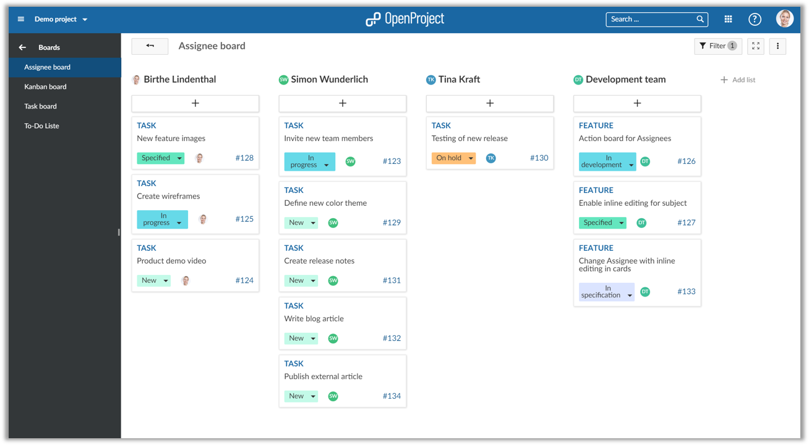
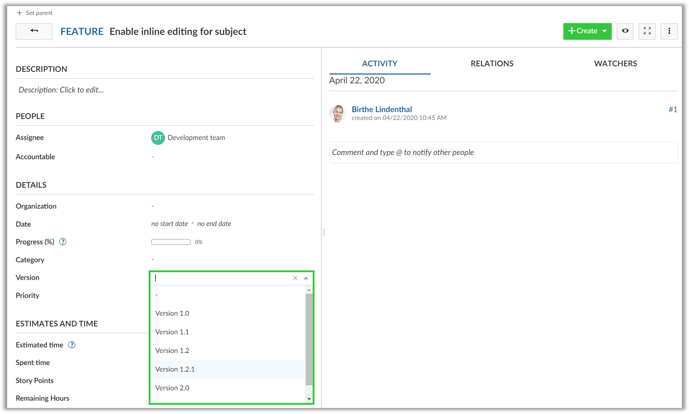
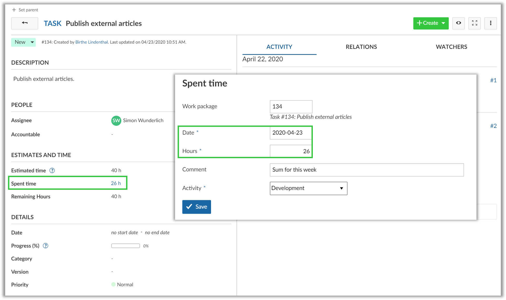
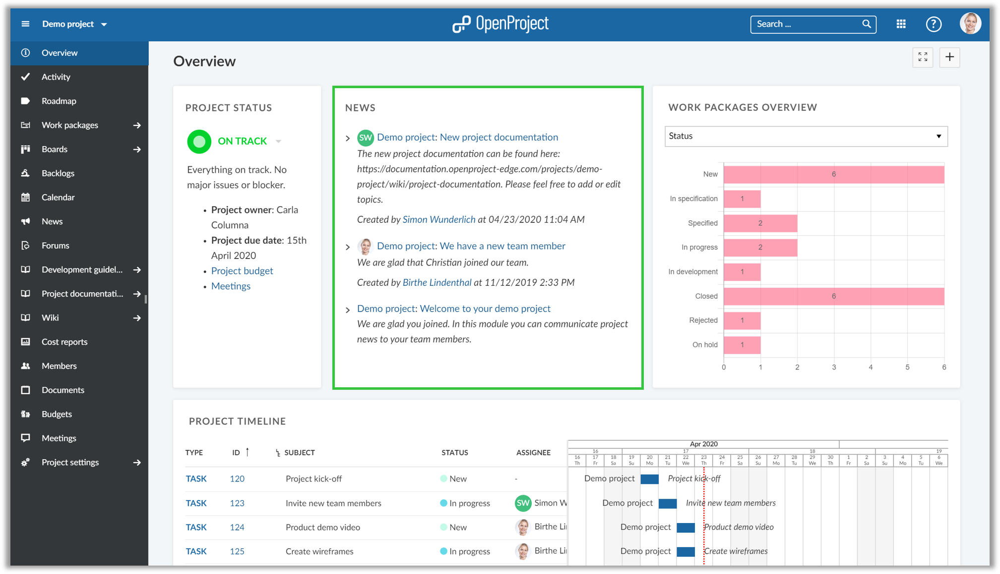
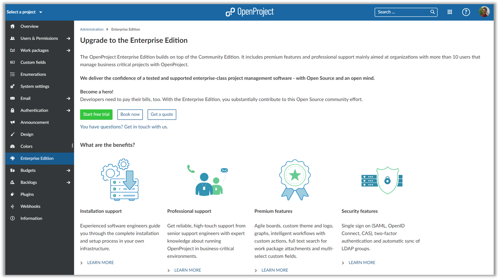
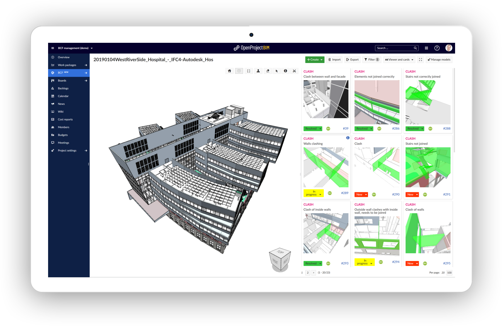
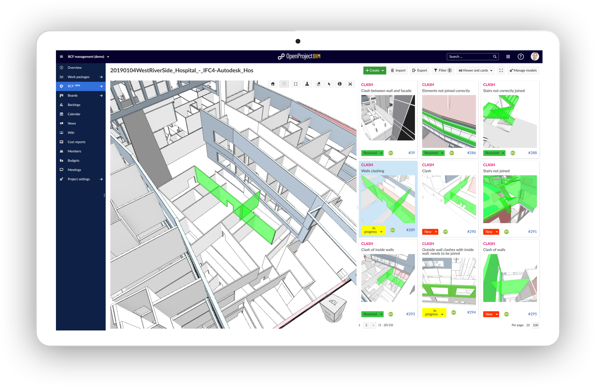
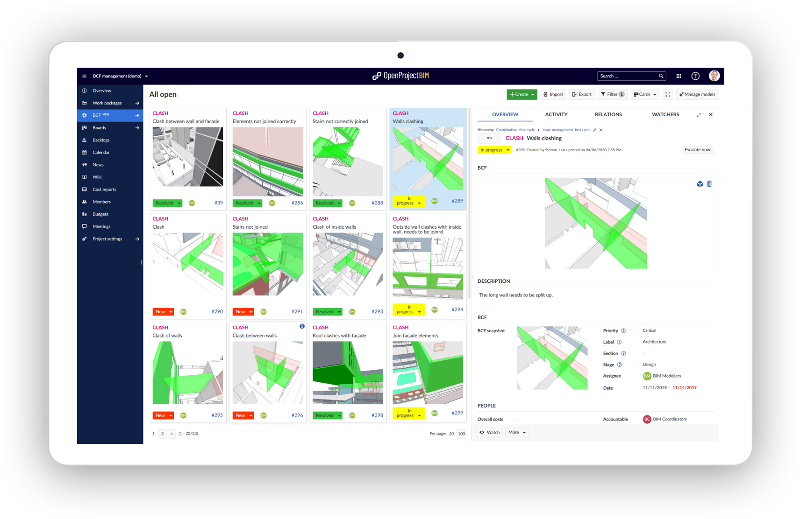

---
# Release notes OpenProject 10.5.0

| Release notes                                                | Description                                                  |
| ------------------------------------------------------------ | :----------------------------------------------------------- |
| [OpenProject 10.5.0](#openproject-1050)                      | What is new for OpenProject 10.5.0?                          |
| [OpenProject 10.5 BIM Edition for construction project management](#openproject-105-bim-edition-for-construction-project-management) | What is new for the construction project management for the building industry in OpenProject 10.5.0? |

# OpenProject 10.5.0

We released [OpenProject 10.5.0](https://community.openproject.com/versions/1386).
The new release of the open source project management software contains new action boards for assignees, much more intuitive sorting of versions by name, the removed 24-hours booking restriction for time tracking, the summary of news on the project overview page, and much more usability improvements and bug fixes.

We recommend updating to the newest version.

<!--more-->

### Action board for assignees

The new action boards for assignees allow to create agile boards with lists for individual users or groups. The assignee will automatically be updated when moving cards across lists. This allows very transparent prioritization of tasks and distribution of workload between individuals and teams.

### Sort versions by name

We have now changed the sorting of versions in the drop-down menu by name not by dates. This makes it much easier to select a version from the list, especially when there are multiple active versions in one project.

### No more 24-hour restriction for time tracking

The restriction to only allow the booking of 24 hours per day has now been removed. You can now summarize your time bookings and track more than 24 hours.

### Show news summary on project overview widget

The summary of news will now be displayed in the news widget on the project overview page. This way, the summary of the most recent news will be communicated at one sight.

## Upgrade to the OpenProject Enterprise Edition

With OpenProject 10.5 it is now much easier to upgrade an existing Community installation to the Enterprise Edition. Within your system Administration under -> Enterprise Edition you now have the possibility to start a 14 days free trial for the Enterprise Edition. Also, you can upgrade directly to get professional support, premium features, and additional security features. The Enterprise token will be generated and updated in your Community installation.

 

## OpenProject 10.5 BIM Edition for construction project management

OpenProject BIM 10.5 will improvement BIM project management for the construction industry, especially with the support of the BIM Collaboration Format (BCF). With the BCF Management module, the OpenProject BIM Edition now offers a fast and intuitive form of central collaboration and coordination in your BIM projects. Release 10.4 has already added an IFC Viewer for the integration of 3D building models. Now, BCF issues can be created directly in the 3D model and managed centrally.

### Collaboration and coordination in one central BIM project management software

OpenProject supports BIM project management with central planning, collaboration and coordination for BIM projects. The software thus connects all project participants in a web-based system. As a web-based coordination tool, all BIM issues can be created, managed and distributed centrally in OpenProject.

### BCF Management for the construction industry

The core scenario enabled by the new release of the BIM Edition is BIM Issue Management with BCF. This enables issues in a construction project (e.g. clashes, requests, questions) to be crated and communicated directly on a 3D model or between several submodels.
Both, model-associated issues (BCFs) directly on the BIM model as well as non-model-associated tasks can be created and tracked.

### Central BCF issue management and BCF communication in OpenProject

The BCF Issue management and communication is thus done centrally in OpenProject. Issues can be created directly on the 3D building model, jointly prioritized and analyzed, and assigned to the responsible BIM modelers.

OpenProject offers an ideal way to comment on and track BCFs. Powerful filter and search functions support fast and intuitive use and transparent tracking.

 

### Support of open formats IFC and BCF

BCF Management in OpenProject is compatible with hundreds of applications that support the exchange formats IFC (Industry Foundation Classes) and BCF (BIM Collaboration Format).

### Robust BCF import and export

BIM Issues can be created wherever the user identifies them, i.e. in his favorite BIM tool. These issues can then be easily imported into OpenProject - the central BCF management system - for centralized tracking and consolidation.
An export function can then be used to distribute the BCFs back to the local applications.

### All changes and bug fixes

- Changed: Hide "Empty" work package updates  \[[#21471](https://community.openproject.com/wp/21471)\]
- Changed: Create a "Action board" with "Action attribute" -> "Assignee" \[[#30157](https://community.openproject.com/wp/30157)\]
- Changed: Project Overwiew | news-widget: Show summary of news on widget \[[#32321](https://community.openproject.com/wp/32321)\]
- Changed: Change version, type, priority validations to case-insensitive \[[#32513](https://community.openproject.com/wp/32513)\]
- Changed: Sort versions by name not by dates \[[#32749](https://community.openproject.com/wp/32749)\]
- Changed: Remove 24 hour restriction for time tracking \[[#32811](https://community.openproject.com/wp/32811)\]
- Changed: What's new teaser OpenProject 10.5 \[[#33105](https://community.openproject.com/wp/33105)\]
- Changed: Change the Billing image on the start page to the new icon set \[[#33114](https://community.openproject.com/wp/33114)\]
- Fixed: Noop on WorkPackage creates empty journal \[[#21816](https://community.openproject.com/wp/21816)\]
- Fixed: Markdown link behind reverse proxy \[[#29010](https://community.openproject.com/wp/29010)\]
- Fixed: User List limitation in CostReport \[[#29524](https://community.openproject.com/wp/29524)\]
- Fixed: Work Package preview trigger area is too small \[[#31366](https://community.openproject.com/wp/31366)\]
- Fixed: OP 9/10 Coping projects results in forums not being copied even when checked. \[[#31472](https://community.openproject.com/wp/31472)\]
- Fixed: Relation "grid_widgets" does not exist \[[#31567](https://community.openproject.com/wp/31567)\]
- Fixed: Missing warning message when reopening agenda \[[#31598](https://community.openproject.com/wp/31598)\]
- Fixed: Can not add existing work package to board \[[#31613](https://community.openproject.com/wp/31613)\]
- Fixed: Checkboxes are not displayed properly in viewing mode \[[#31628](https://community.openproject.com/wp/31628)\]
- Fixed: Inconsistent translation of "News" in German \[[#31674](https://community.openproject.com/wp/31674)\]
- Fixed: Wiki tables not responsive + CSS weird + no markdown \[[#31920](https://community.openproject.com/wp/31920)\]
- Fixed: Strings not localized (password settings) \[[#31976](https://community.openproject.com/wp/31976)\]
- Fixed: Multiple Work Package Widgets on MyPage - Groups can't be reduced independently \[[#32030](https://community.openproject.com/wp/32030)\]
- Fixed: [Repository] Error 500 when trying to log time with unmapped changeset user \[[#32038](https://community.openproject.com/wp/32038)\]
- Fixed: Clean-up Administration -> System settings and remove wiki history compression \[[#32045](https://community.openproject.com/wp/32045)\]
- Fixed: Work package ID cut off on right side \[[#32069](https://community.openproject.com/wp/32069)\]
- Fixed: Project sorting not working anymore \[[#32220](https://community.openproject.com/wp/32220)\]
- Fixed: Incoming Mail does not find case-insensitive attributes such as status \[[#32251](https://community.openproject.com/wp/32251)\]
- Fixed: BIM theme is applied in standard edition \[[#32374](https://community.openproject.com/wp/32374)\]
- Fixed: Since migrate to 10.4 version unable to create SVN respository \[[#32389](https://community.openproject.com/wp/32389)\]
- Fixed: Drag placeholder in boards should look like on the project overview page \[[#32396](https://community.openproject.com/wp/32396)\]
- Fixed: Toolbar is cut off when sidebar is very large \[[#32430](https://community.openproject.com/wp/32430)\]
- Fixed: Wrong field type of Default Value in custom fields \[[#32445](https://community.openproject.com/wp/32445)\]
- Fixed: Order of work packages in copied project different from source project \[[#32447](https://community.openproject.com/wp/32447)\]
- Fixed: "All open" query still shows the card view \[[#32464](https://community.openproject.com/wp/32464)\]
- Fixed: missing www-authenticate in http 401 header for api/v3/time_entries/form \[[#32486](https://community.openproject.com/wp/32486)\]
- Fixed: Missing create button in work packages module on iOS \[[#32496](https://community.openproject.com/wp/32496)\]
- Fixed: Search filter transmitted although removed by user \[[#32500](https://community.openproject.com/wp/32500)\]
- Fixed: Split screen content not reachable on medium screen sizes \[[#32525](https://community.openproject.com/wp/32525)\]
- Fixed: Widget: My Spent Time: Time entry Search Function broken \[[#32578](https://community.openproject.com/wp/32578)\]
- Fixed: Cancel button does not remove the create form \[[#32647](https://community.openproject.com/wp/32647)\]
- Fixed: Usability bug: breadcrumbs do not follow usability best practices \[[#32650](https://community.openproject.com/wp/32650)\]
- Fixed: Emails are being sent for all created work packages when copying a project (even when email settings deactivated) \[[#32663](https://community.openproject.com/wp/32663)\]
- Fixed: Work package details view cut off on smaller screen \[[#32665](https://community.openproject.com/wp/32665)\]
- Fixed: Watcher autcompleter broken \[[#32666](https://community.openproject.com/wp/32666)\]
- Fixed: Adding child work packages not possible \[[#32670](https://community.openproject.com/wp/32670)\]
- Fixed: Dockerfile does not work on Windows \[[#32674](https://community.openproject.com/wp/32674)\]
- Fixed: Assigning a buget to a work package fails \[[#32732](https://community.openproject.com/wp/32732)\]
- Fixed: JS-Error on login page \[[#32738](https://community.openproject.com/wp/32738)\]
- Fixed: Project settings "(check/uncheck all)" misalligned \[[#32740](https://community.openproject.com/wp/32740)\]
- Fixed: "translation missing: en.button_history" error in meeting history view. \[[#32742](https://community.openproject.com/wp/32742)\]
- Fixed: Username attribute should not maintain whitespace \[[#32748](https://community.openproject.com/wp/32748)\]
- Fixed: Unnecessary scrollbar in split screen. \[[#32751](https://community.openproject.com/wp/32751)\]
- Fixed: Cost report: Error 404 when displaying cash value \[[#32752](https://community.openproject.com/wp/32752)\]
- Fixed: In forum "Quote" and "Reply" button do not automatically scroll to quote / reply (unclear that button has been pressed) \[[#32754](https://community.openproject.com/wp/32754)\]
- Fixed: Label "Message content" in forums not correctly aligned \[[#32755](https://community.openproject.com/wp/32755)\]
- Fixed: Disable possibility to change the user name when login via Google \[[#32779](https://community.openproject.com/wp/32779)\]
- Fixed: Several styling bugs in tables \[[#32781](https://community.openproject.com/wp/32781)\]
- Fixed: Update the project description onboarding texts and activate the project description in the demo projects \[[#32782](https://community.openproject.com/wp/32782)\]
- Fixed: Changing filter does not reset to first page \[[#32785](https://community.openproject.com/wp/32785)\]
- Fixed: Can not switch between work packages in split view \[[#32786](https://community.openproject.com/wp/32786)\]
- Fixed: Missing demo data: Teaser image and GETTING STARTED box for Demo project and Scrum project \[[#32799](https://community.openproject.com/wp/32799)\]
- Fixed: work packages with empty values are not sorted descending \[[#32808](https://community.openproject.com/wp/32808)\]
- Fixed: Resizers don't work on mobile devices \[[#32810](https://community.openproject.com/wp/32810)\]
- Fixed: Main menu state is not stored on page reload \[[#32814](https://community.openproject.com/wp/32814)\]
- Fixed: Planned cost increases by an order of magnitude (10x) when saving budget \[[#32822](https://community.openproject.com/wp/32822)\]
- Fixed: Cannot filter for Work package TYPE in Boards \[[#32824](https://community.openproject.com/wp/32824)\]
- Fixed: After adding or removing a column the change is not indicated in the query \[[#32835](https://community.openproject.com/wp/32835)\]
- Fixed: Query indicates unsaved changes without changes to query \[[#32843](https://community.openproject.com/wp/32843)\]
- Fixed: Avatars are incorrectly cached \[[#32870](https://community.openproject.com/wp/32870)\]
- Fixed: Hourly cron synchronization not executed in docker context \[[#32884](https://community.openproject.com/wp/32884)\]
- Fixed: Assignee list empty when creating a task in "modules" work package list \[[#32887](https://community.openproject.com/wp/32887)\]
- Fixed: [Docker] Attach files error "An internal error has occured. The attachment could not be saved due to lacking file system permissions" \[[#32890](https://community.openproject.com/wp/32890)\]
- Fixed: Inconsistent breadcrumb in Administration -> Enterprise Edition \[[#32905](https://community.openproject.com/wp/32905)\]
- Fixed: Styling and consistency issues in the confirm deletion modal for the EE token \[[#32908](https://community.openproject.com/wp/32908)\]
- Fixed: Misaligned menu opener in Backlogs plugin \[[#32923](https://community.openproject.com/wp/32923)\]
- Fixed: Wrong space in members widget after a group \[[#32927](https://community.openproject.com/wp/32927)\]
- Fixed: Filter for Type does not work in the WIKI makro \[[#32983](https://community.openproject.com/wp/32983)\]
- Fixed: Cannot assign tasks to groups in assignee board \[[#33072](https://community.openproject.com/wp/33072)\]
- Fixed: Enterprise-Upgrade-Video re-starts multiple times on Boards page \[[#33078](https://community.openproject.com/wp/33078)\]
- Fixed: Error 503 when trying to activate EE trial \[[#33080](https://community.openproject.com/wp/33080)\]
- Fixed: Error 500 when trying to remove EE trial license (on PullPreview) \[[#33081](https://community.openproject.com/wp/33081)\]
- Fixed: Wrong link to data privacy information \[[#33083](https://community.openproject.com/wp/33083)\]
- Fixed: Confirm icon too close to text in EE trial modal \[[#33084](https://community.openproject.com/wp/33084)\]
- Fixed: Internal error when trying to request EE trial license with Chinese language settings \[[#33085](https://community.openproject.com/wp/33085)\]
- Fixed: Cannot resend email to activate EE trial license \[[#33086](https://community.openproject.com/wp/33086)\]
- Fixed: Enterprise Edition email confirmation page reloads automatically \[[#33087](https://community.openproject.com/wp/33087)\]
- Fixed: Button "Continue" when adding column to board should be named "Add" \[[#33090](https://community.openproject.com/wp/33090)\]
- Fixed: Internal error when trying to save manually sorted work package view \[[#33092](https://community.openproject.com/wp/33092)\]
- Fixed: Error when trying to export work packages \[[#33093](https://community.openproject.com/wp/33093)\]
- Fixed: Typo in change retraction message \[[#33094](https://community.openproject.com/wp/33094)\]
- Fixed: Export seems to be stuck in infinite loop when export with all columns \[[#33110](https://community.openproject.com/wp/33110)\]
- Fixed: Export ignores columns, order and groups when exporting grouped WP view \[[#33111](https://community.openproject.com/wp/33111)\]
- Fixed: String without translation in roles & permissions \[[#33113](https://community.openproject.com/wp/33113)\]
- Fixed: Cannot find users anymore with "+" sign in user name / email to add to project \[[#33115](https://community.openproject.com/wp/33115)\]

#### Contributions
A big thanks to community members for reporting bugs and helping us identifying and providing fixes.

Special thanks for reporting and finding bugs go to

Vikas Kedia, Fernando Meurer, Aurelien Barre, Adnan Abou-Rikab, Scott Sanders, York-Simon Johannsen, Joachim Schardt, Peter Pof, Tobias R, Frank Schmid, Harald Holzmann, Petr Zeman, Paul GARROUSTE, Marc Vollmer, Filter Punk, Mathias Gerlach, Gio @ Enuan, Per Bröms, Jason Culligan, Frank Long, Radovan Semancik, Frendy A. N.