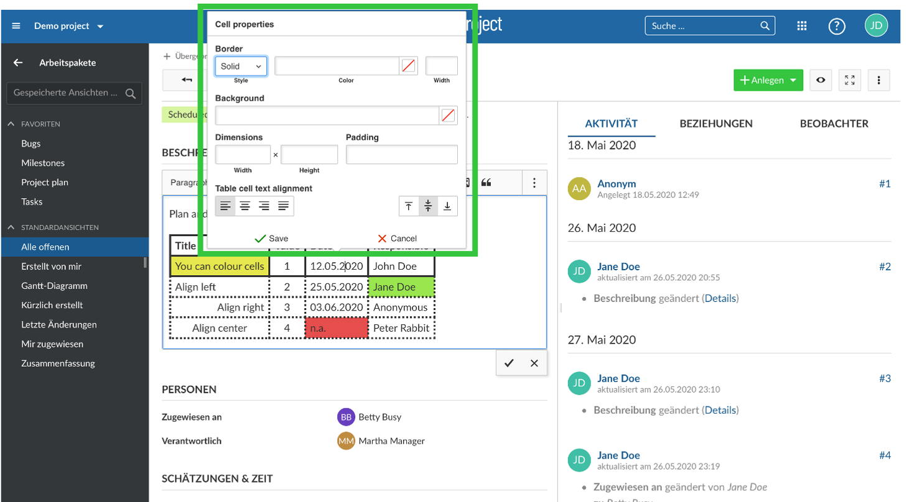
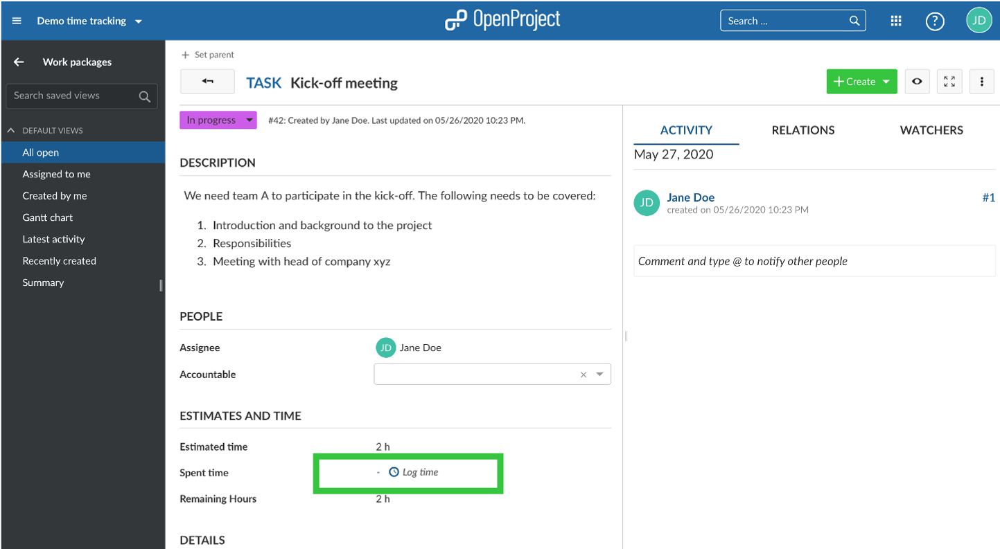
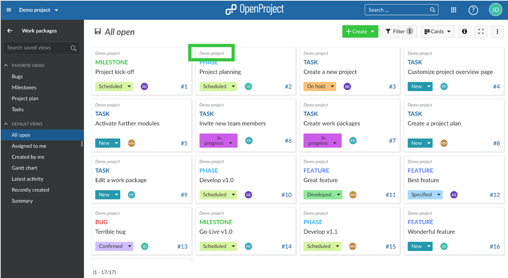
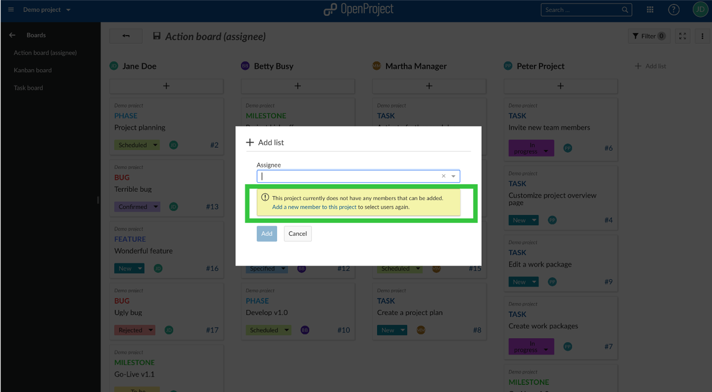

# Release notes OpenProject 10.6.0

| Release notes                                                | Description                                                  |
| ------------------------------------------------------------ | :----------------------------------------------------------- |
| [OpenProject 10.6.0](#openproject-1060)                      | What is new for OpenProject 10.6.0?                          |
| [OpenProject 10.6.0 BIM Edition for construction project management](#openproject-1060-bim-edition) | What is new for the construction project management for the building industry in OpenProject 10.5.0? |

# OpenProject 10.6.0

The new release of the open source project management software brings improved table formatting, quicker time logging, the Slovenian translation, better overview over activities and  much more usability improvements and bug fixes.

### Better styling of tables with improved table formatting options

With the new release of OpenProject you can now customize your tables in the text editor even more. When integrating a table in a work  package description, a meeting, the wiki or news, format it the way you  want to. The new additional options are:

- limiting of the table’s and cell’s width,
- choose a color for the grid and the cell’s background (HEX/XSL or standard color palette),
- padding in cells,
- alignment within the cell, and
- defining a CSS rule to break long words in cells.

### Quicker time logging on work packages

From now on, time logging is even  quicker. You won’t have to leave your current work environment to log  time. For example, directly in the work package you will find an icon to log time. When you click on it, you can log your time in a pop-up window.

Also, you can log time to a work package directly from your work  package list view if you include the SPENT TIME as a column to the list. Clicking on the Log time will also open a pop-up window to book your  spent time.

### Support of Slovenian language

We are very happy that OpenProject is now 100% translated into Slovenian.  Zabavaj se!

### Attribution of cards to a project

OpenProject 10.6 will upgrade the card view of work packages. To make clear what card belongs to what project, the project name will be shown on the card.

### Improved assignee board if there are no members in a project

If you are creating an agile boards by assignees, you will get  notified if there are no members in your project. You will also get  notified if you are trying to add another assignee list to your board  even though there is no more member left.

### Various usability improvements and bug fixes

Furthermore, the **styling of the news widget** on the project overview page as well as the start page has been improved. Going forward, the **Activity module is only showing one activity per minute** per user per work package and type of change. That means the changes per minute are aggregated.

#### All bug fixes and changes

- Epic: Aggregate activity entries \[[#23744](https://community.openproject.com/wp/23744)\]
- Fixed: Date picker allows selection a year for only the next 10 years. Needs to increase. \[[#29413](https://community.openproject.com/wp/29413)\]
- Fixed: Weird date format at meetings page \[[#32986](https://community.openproject.com/wp/32986)\]
- Fixed: [Work packages] Custom fields for long text \[[#33143](https://community.openproject.com/wp/33143)\]
- Fixed: .xls exports of cost reports use incorrect decimal precision \[[#33149](https://community.openproject.com/wp/33149)\]
- Fixed: Button to log time is shown even if I do not have the permissions \[[#33152](https://community.openproject.com/wp/33152)\]
- Fixed: Main menu element is not correctly highlighted when creating a new category \[[#33154](https://community.openproject.com/wp/33154)\]
- Fixed: Main menu resizer icon not draggable \[[#33187](https://community.openproject.com/wp/33187)\]
- Fixed: Work Package - Comment can only be edited once per description call \[[#33200](https://community.openproject.com/wp/33200)\]
- Fixed: Assignee board breaks in sub url \[[#33202](https://community.openproject.com/wp/33202)\]
- Fixed: Logged time widget does not update correctly \[[#33217](https://community.openproject.com/wp/33217)\]
- Fixed: OAuth settings and docs both do not provide information for endpoints \[[#33241](https://community.openproject.com/wp/33241)\]
- Fixed: Time Tracking Issue After update OpenProject 10.5.2 (PostgreSQL) \[[#33310](https://community.openproject.com/wp/33310)\]
- Fixed: Timeout / error 500 when setting current unit cost rate \[[#33319](https://community.openproject.com/wp/33319)\]
- Fixed: Form misplaced after error \[[#33324](https://community.openproject.com/wp/33324)\]
- Fixed: Create child in work package list does not create parent-child relationship \[[#33329](https://community.openproject.com/wp/33329)\]
- Fixed: Oauth endpoints need to allow target hosts in CSP header "form-action" \[[#33336](https://community.openproject.com/wp/33336)\]
- Fixed: Time logging not possible with custom field of type "version" \[[#33378](https://community.openproject.com/wp/33378)\]
- Fixed: Mailing configuration appears not to be reloaded in workers \[[#33413](https://community.openproject.com/wp/33413)\]
- Fixed: layout bug when setting new parent \[[#33449](https://community.openproject.com/wp/33449)\]
- Fixed: Clicking on info icon on card view doesn't do anything \[[#33451](https://community.openproject.com/wp/33451)\]
- Fixed: Fetching recent work packages when logging time fails with internal error \[[#33472](https://community.openproject.com/wp/33472)\]
- Changed: Show Project name in Card View \[[#31556](https://community.openproject.com/wp/31556)\]
- Changed: Use angular modal for time logging throughout the application \[[#32126](https://community.openproject.com/wp/32126)\]
- Changed: Add icon "Log time" close to spent time attribute in work packages details view \[[#32129](https://community.openproject.com/wp/32129)\]
- Changed: Make cancel buttons consistent \[[#32919](https://community.openproject.com/wp/32919)\]
- Changed: Improve styling for the news widget \[[#32926](https://community.openproject.com/wp/32926)\]
- Changed: Add notification message to assignee board when no project members \[[#33073](https://community.openproject.com/wp/33073)\]
- Changed: Extend token structure with attributes company and domain \[[#33129](https://community.openproject.com/wp/33129)\]
- Changed: Move "log time" icon outside of the hover highlighting \[[#33307](https://community.openproject.com/wp/33307)\]
- Changed: Allow defining CA path of LDAP connection \[[#33345](https://community.openproject.com/wp/33345)\]
- Changed: Enable more table features in texteditor \[[#33349](https://community.openproject.com/wp/33349)\]
- Changed: Enable Projects for outgoing Webhooks \[[#33355](https://community.openproject.com/wp/33355)\]
- Changed: New Features teaser for 10.6 \[[#33470](https://community.openproject.com/wp/33470)\]

## OpenProject 10.6.0 BIM Edition

OpenProject BIM 10.6 released with improved BCF Management. We released OpenProject BIM 10.6. The new release contains improvements  for BIM project management for the building industry, especially with  improved features for BCF Management.

### Improved BCF XML Import

The import of BCF XML files will check the version to be 2.1 before  importing. If it’s an older version the import will not start to avoid  errors.

### Maximum size for IFC files increased

The maximum size for IFC files has been increased to 500 MB.

### Improved permissions for BCF Management

We introduced a separate permission for deleting BCF issues.

#### Further improvements and bug fixes

- Changed: Bim error on console when creating a global Work Package.
- Changed: Since 2.1 BCF-XML files should have suffix .bcf instead of .bcfzip.
- Changed: BCF-XML import screens have "Work Package" module active in main menu.
- Changed: Redirect loop for viewpoint URL when no IFC in project.
- Changed: On boarding tour: Non-admins can't complete onboarding as they lack permissions for viewing boards.

#### How can you try the OpenProject BIM Edition?

Please note that the OpenProject BIM Edition is under continuous  development. The current version is only a first state, which will be  continuously enhanced with important build specific functions.

Test OpenProject BIM 10.6 immediately, [create a free test instance](https://start.openproject.com/go/bim) for the OpenProject BIM Edition.

### Credits and contributions

A big thanks to community members for reporting bugs and helping us identifying and providing fixes.

Special thanks for reporting and finding bugs go to
Marc Vollmer, Ricardo Vigatti, Sébastien VITA, Tino Breddin, Lukas Zeil, Rajesh Vishwakarma, Gio @ Enuan, Harald Holzmann.

- DBI AG for sponsoring the BCF Management.
- Lindsay Kay for the integration of the 3D Modell viewer, [xeokit](https://xeokit.io/), as well as for improving the camera control in the IFC viewer.
- [Georg Dangl](https://blog.dangl.me/categories/BIM) for developing the Revit Integration in OpenProject.
- All the developers, designers, project managers who have contributed to OpenProject.
- Every dedicated user who has reported bugs and supported the community by asking and answering questions in the [forum](https://community.openproject.org/projects/openproject/boards).
- All the engaged users who provided translations on [CrowdIn](https://crowdin.com/projects/opf).
