# OpenProject 11.0.0

We released [OpenProject 11.0.0](https://community.openproject.org/versions/1429).

This new release will bring all sorts of features that will improve classical as well as agile project management. We have implemented a top-down scheduling which introduces the option to schedule tasks manually in OpenProject. Also, we have done a lot of improvements to the agile boards, e.g. to create a work breakdown structure for your projects. Furthermore, we have developed project templates as well as better project portfolio management.

As always, the release contains many more improvements and bug fixes and we recommend updating to the newest version promptly.

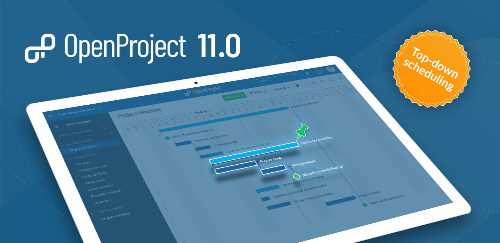

## Top-down project scheduling with new manual planning mode

Top-down scheduling enables the project team to define all tasks involved in a project, starting with a fixed start and finish date, and breaking it down into smaller work packages. The new manual scheduling mode in OpenProject allows to set a start and finish date of the parent without being affected by the start and finish dates of its children. You can now plan a project top-down without knowing all tasks at the start of the project.

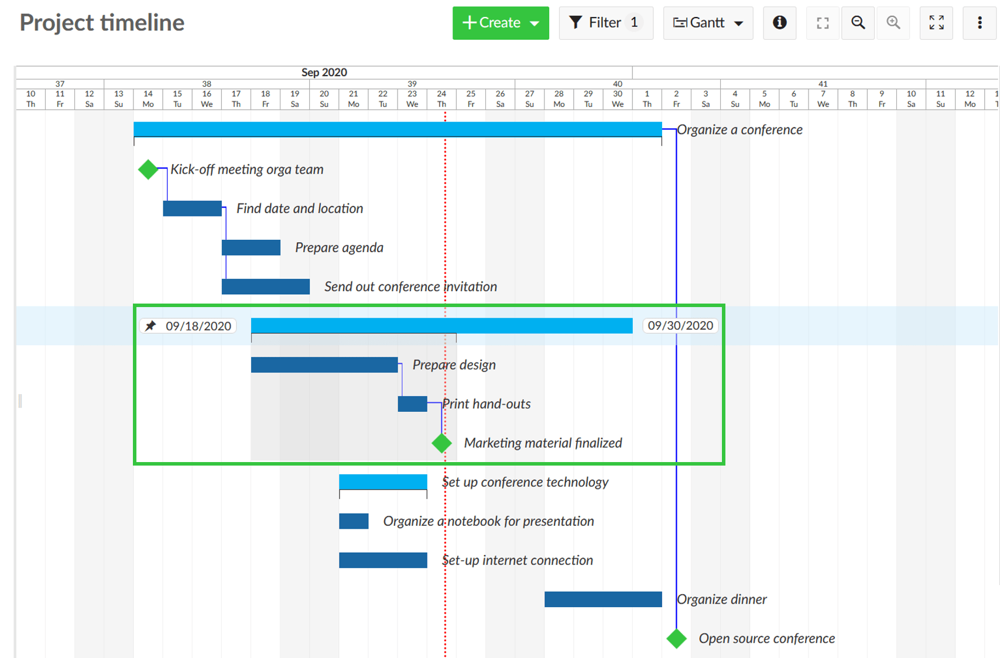

Moving a child element in the manual scheduling mode will not move the dates of the parent element. It will now indicate the scheduling differences with a black or red bracket underneath (e.g. when a child is shorter or longer than the parent phase). Also, we have added a grey background on hover to indicate the parent-child-relationships.

Now, in OpenProject you can rely on both, top-down and bottom-up planning or even a combination of both. The approach you choose depends on your specific planning goal.

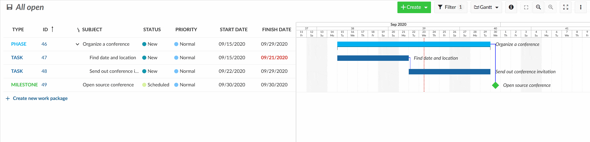

## Flexible agile boards give you more options (Enterprise add-on)

New action board types as well as further improvements to the boards allow you even better agile project management.

### WBS (work-breakdown-structure) boards

Now, you can create a work breakdown structure for your project by adding parent-child-elements as a board. Select the parent work packages from the list and create a board with all corresponding children work packages.

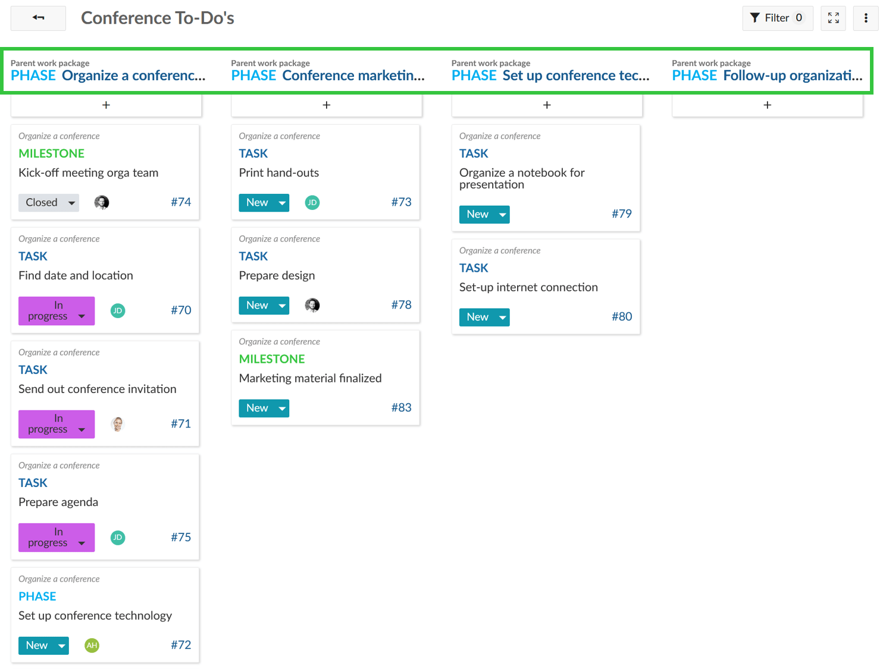

### Agile boards for subprojects

Also, project hierarchies can now be displayed in the boards, e.g. to distribute tasks between subprojects. Subprojects can be selected as lists in a board from the parent project, the corresponding work packages from the respective subproject will appear underneath.

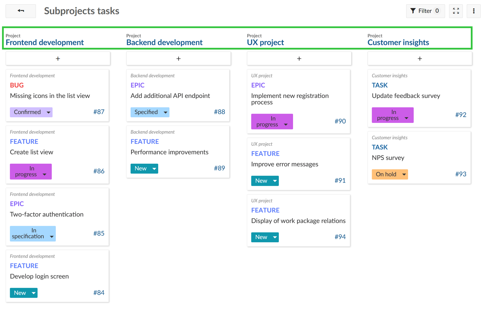

### New boards creation screen to select different board types

Furthermore, we have implemented more improvements to the agile boards, such as a better board creation modal. It is now much easier to choose a new board from the available options.

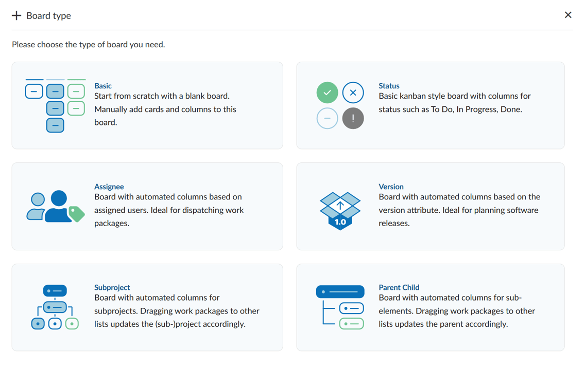

### Cards with details view in boards

To get more information about the cards in a board and to enable quick and easy updates of all work package attributes incl. custom fields, we have enabled a split-screen view also for the boards view. The new split screen view can be enabled via the info icon on the cards.

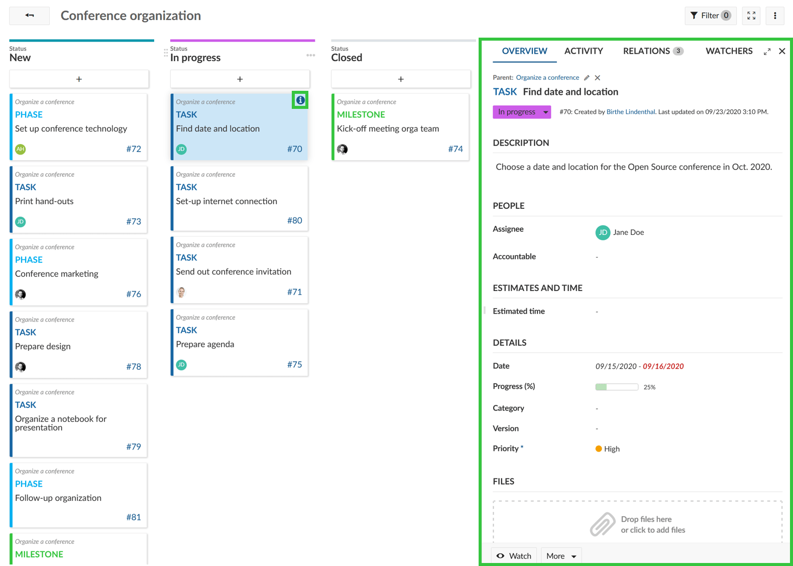

## Project templates for easy project creation

The new project templates allow you to create projects based on predefined templates. When setting up a project you can define whether this project should be used as a project template. You will then have the possibility to select a predefined project template when creating a new project which already includes all configurations, e.g. assignee, project plan, work breakdown structure.

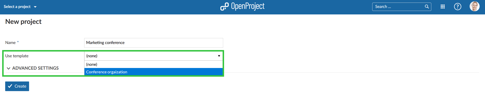

## Improved project portfolio management

The configuration of the “view all projects” page now enables better project portfolio management. You can configure the “view all projects” list to show relevant project information for all projects, e.g. add custom fields for projects and remove columns which are not needed. With the link to the Gantt chart view you can directly open a global work packages view for all projects, configured to your needs, e.g. to show all milestones across all projects.

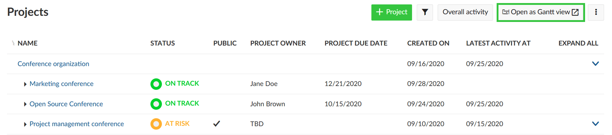

## Harmonization of the time and costs modules

Tracking spent time and costs is now much easier with the improved and harmonized modules for time and cost reporting. The modules *Time tracking* and *Cost reporting* have been combined. Whenever you want to track time and/or costs in a project, the new module *Time and costs* needs to be activated in the project settings. It automatically adds the time tracking and cost reporting functionality to the project.

The *Budgets* module will remain unchanged and additionally enables project budgets to be tracked.

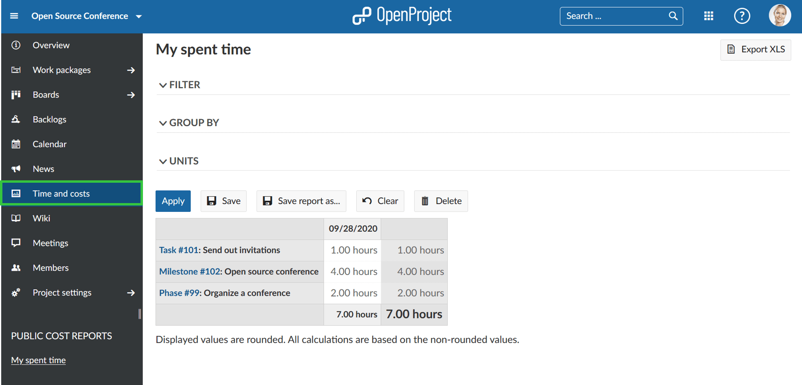

## Improvements of the WYSIWYG editor

We have again added many improvements to the WYSIWYG editor, i.e. for wiki pages or the work packages description. For example, you can now adjust the image size in the editor.

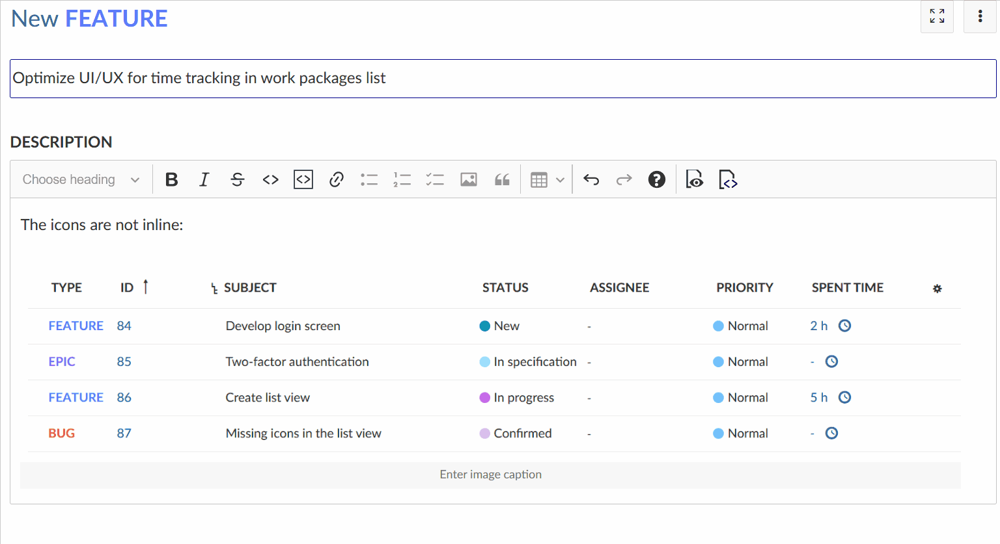

Additionally, it is now possible to add macros to insert project or work packages attributes to the wiki or work package description.

## Attribute help texts for projects (Enterprise add-on)

We have now also expanded the attribute help texts for projects. You can define help text for all project attributes, such as status or accountable or any custom field for projects. A small question mark icon will appear behind the attribute in order to make the entering this information easier and to eliminate errors.

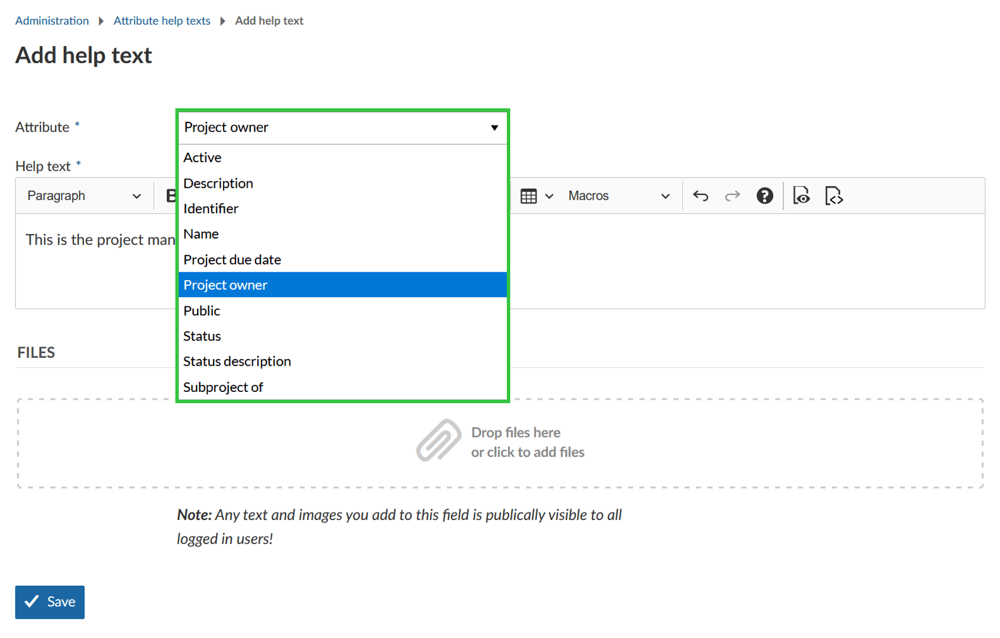

## Copy boards and project dashboards

Boards and project dashboards can now also be copied when copying a project. This enables you to set up a default project and copy it to set up a new project.

## As always,…… there’s much more!

There are lots and lots of new things we packed into 11.0 to tell you about.

### All bug fixes and changes in 11.0

- Fixed: Journal data is not removed upon work package deletion \[[#22048](https://community.openproject.org/wp/22048)\]
- Fixed: warning when data will be discarded \[[#25683](https://community.openproject.org/wp/25683)\]
- Fixed: WYSIWYG editor incorrectly interprets underscores in function names as italics \[[#28889](https://community.openproject.org/wp/28889)\]
- Fixed: The cost reports plugin is hidden unless the time tracking module is active \[[#30350](https://community.openproject.org/wp/30350)\]
- Fixed: Position of work package attribute changes when starting editing \[[#31614](https://community.openproject.org/wp/31614)\]
- Fixed: Work package no longer included in filter "Estimated time: none" when removing value for Estimated time \[[#32111](https://community.openproject.org/wp/32111)\]
- Fixed: Custom action lists archived projects as options \[[#32131](https://community.openproject.org/wp/32131)\]
- Fixed: Wrong display of work package widgets on project overview \[[#32457](https://community.openproject.org/wp/32457)\]
- Fixed: News create - undefined method `journaled_attributes' for nil:NilClass: \[[#33038](https://community.openproject.org/wp/33038)\]
- Fixed: OP 10.4.x: Wrong message "Installation is already using MySQL, skipping postgres addon" \[[#33066](https://community.openproject.org/wp/33066)\]
- Fixed: Cannot create plugins \[[#33213](https://community.openproject.org/wp/33213)\]
- Fixed: Cannot drag & drop work package outside of currently displayed browser window \[[#33247](https://community.openproject.org/wp/33247)\]
- Fixed: No default order for time entry api \[[#33328](https://community.openproject.org/wp/33328)\]
- Fixed: Add-list modal of version board is sometimes empty \[[#33346](https://community.openproject.org/wp/33346)\]
- Fixed: Mails do not respect OS dark mode \[[#33382](https://community.openproject.org/wp/33382)\]
- Fixed: Unit cost for units < 1 are off by order of magnitude \[[#33383](https://community.openproject.org/wp/33383)\]
- Fixed: Overview activity does not update automatically in split screen \[[#33405](https://community.openproject.org/wp/33405)\]
- Fixed: Date fields of closed work packages are highlighted red \[[#33457](https://community.openproject.org/wp/33457)\]
- Fixed: Filter get lost after deleting search string from text filter \[[#33465](https://community.openproject.org/wp/33465)\]
- Fixed: Printing the wrong value in the report \[[#33496](https://community.openproject.org/wp/33496)\]
- Fixed: Selected board in the left sidebar loses color highlighting \[[#33514](https://community.openproject.org/wp/33514)\]
- Fixed: Unsolicited logout on community.openproject.org every day  \[[#33575](https://community.openproject.org/wp/33575)\]
- Fixed: Image removed from work package description when adding image to comment \[[#33578](https://community.openproject.org/wp/33578)\]
- Fixed: No German translation for Cost reports \[[#33584](https://community.openproject.org/wp/33584)\]
- Fixed: Type Form Configuration Not Saved \[[#33592](https://community.openproject.org/wp/33592)\]
- Fixed: ATOM feed link for all activities is not created as intended \[[#33650](https://community.openproject.org/wp/33650)\]
- Fixed: Mark priority as mandatory and remove "empty" option \[[#33678](https://community.openproject.org/wp/33678)\]
- Fixed: Work packages missing/duplicates when displayed on several pages \[[#33679](https://community.openproject.org/wp/33679)\]
- Fixed: Remapping oauth users fails if email or login contains upper case letters \[[#33687](https://community.openproject.org/wp/33687)\]
- Fixed: wiki after navigate on item in sidebar, the sidebar reset to top and lose the view of focus item \[[#33690](https://community.openproject.org/wp/33690)\]
- Fixed: Autologin breaks in conjunction with auth stages (e.g. consent, 2FA, recaptcha) \[[#33696](https://community.openproject.org/wp/33696)\]
- Fixed: Back button does not work when coming from Boards \[[#33747](https://community.openproject.org/wp/33747)\]
- Fixed: Missing padding in "Log time" widget \[[#33749](https://community.openproject.org/wp/33749)\]
- Fixed: Users can set the default work package status to read-only \[[#33750](https://community.openproject.org/wp/33750)\]
- Fixed: "New Board" modal is missing a header text \[[#33753](https://community.openproject.org/wp/33753)\]
- Fixed: WP still shown after deleting it \[[#33756](https://community.openproject.org/wp/33756)\]
- Fixed: Errors on project custom values are not displayed upon saving a project \[[#33766](https://community.openproject.org/wp/33766)\]
- Fixed: Cannot create user through API with auth_source, but no password \[[#33869](https://community.openproject.org/wp/33869)\]
- Fixed: Another error during form configuration  \[[#33892](https://community.openproject.org/wp/33892)\]
- Fixed: Parent's due date can be edited in automatic scheduling mode \[[#33901](https://community.openproject.org/wp/33901)\]
- Fixed: Cost report layout broken \[[#33910](https://community.openproject.org/wp/33910)\]
- Fixed: Work package graph displays unnecessary scrollbar \[[#33911](https://community.openproject.org/wp/33911)\]
- Fixed: Custom action button not removed when condition is no longer met \[[#33912](https://community.openproject.org/wp/33912)\]
- Fixed: Inconsistent upper and lower case in "Remaining Hours" when compared with "Estimated time" \[[#33927](https://community.openproject.org/wp/33927)\]
- Fixed: Documents layout broken \[[#33930](https://community.openproject.org/wp/33930)\]
- Fixed: Problem with watchers  \[[#33936](https://community.openproject.org/wp/33936)\]
- Fixed: Selected dates in date picker not highlighted across months \[[#33957](https://community.openproject.org/wp/33957)\]
- Fixed: ScrollIntoView previous element  \[[#33966](https://community.openproject.org/wp/33966)\]
- Fixed: Users without permissions can see budgets in work package dropdown / internal error \[[#33981](https://community.openproject.org/wp/33981)\]
- Fixed: Work package on edge not shown correctly / cannot be edited \[[#33982](https://community.openproject.org/wp/33982)\]
- Fixed: Budgets module shown for users without permission "View budgets" \[[#33983](https://community.openproject.org/wp/33983)\]
- Fixed: Impossible to deactivate a project through the API \[[#33987](https://community.openproject.org/wp/33987)\]
- Fixed: Hide resizer when the wp detail page is shown in full view  \[[#33988](https://community.openproject.org/wp/33988)\]
- Fixed: Changes in widget titles are not saved sometime \[[#33998](https://community.openproject.org/wp/33998)\]
- Fixed: Cannot copy projects with user CF \[[#34000](https://community.openproject.org/wp/34000)\]
- Fixed: "An internal error has occurred" displayed when file size exceeded on direct upload \[[#34016](https://community.openproject.org/wp/34016)\]
- Fixed: Drag and drop parent/child \[[#34021](https://community.openproject.org/wp/34021)\]
- Fixed: Gantt chart: phases doesn't have background color on hover \[[#34074](https://community.openproject.org/wp/34074)\]
- Fixed: Gantt chart: children not allowed to move out of its parent's date range  \[[#34076](https://community.openproject.org/wp/34076)\]
- Fixed: Filters does not accept user id for principal in API memberships \[[#34108](https://community.openproject.org/wp/34108)\]
- Fixed: Order of work packages in XLS, PDF, CSV export differs from order in OpenProject \[[#34112](https://community.openproject.org/wp/34112)\]
- Fixed: Checkboxes in table not displayed correctly in WYSIWYG editor \[[#34113](https://community.openproject.org/wp/34113)\]
- Fixed: Archived projects not available via the API \[[#34120](https://community.openproject.org/wp/34120)\]
- Fixed: Gantt charts: rows misaligned when scrolling to bottom \[[#34127](https://community.openproject.org/wp/34127)\]
- Fixed: Logged time is always one hour instead of the entered value \[[#34130](https://community.openproject.org/wp/34130)\]
- Fixed: Cost types: Unable to add a new cost type \[[#34144](https://community.openproject.org/wp/34144)\]
- Fixed: Cost Types: rate not saved when a new type is created  \[[#34145](https://community.openproject.org/wp/34145)\]
- Fixed: Time entry modal form can send form multiple times when clicked quickly several times \[[#34163](https://community.openproject.org/wp/34163)\]
- Fixed: I18n: Settings label not found in /settings/plugin/costs \[[#34188](https://community.openproject.org/wp/34188)\]
- Fixed: [all projects overview] Todo-list: checkboxes are preceded by bullets \[[#34190](https://community.openproject.org/wp/34190)\]
- Fixed: Quick filter not applied for externally configured queries \[[#34239](https://community.openproject.org/wp/34239)\]
- Fixed: Gantt Chart: Back-end - Front-end discrepancies when dragging a work package produces an error \[[#34252](https://community.openproject.org/wp/34252)\]
- Fixed: "Undefined" shown when editing cost entry in "Log unit cost" screen \[[#34257](https://community.openproject.org/wp/34257)\]
- Fixed: All-in-one docker image on dev branch no longer works \[[#34272](https://community.openproject.org/wp/34272)\]
- Fixed: Error displayed when deleting work package with logged time \[[#34283](https://community.openproject.org/wp/34283)\]
- Fixed: Wiki side menu cuts of too high / doesn't display bottom wiki pages \[[#34284](https://community.openproject.org/wp/34284)\]
- Fixed: Internal error when uploading attachment(s) to "Documents" module \[[#34285](https://community.openproject.org/wp/34285)\]
- Fixed: Two identical / very similar error message shown in custom field create screen \[[#34289](https://community.openproject.org/wp/34289)\]
- Fixed: Not possible to scroll page while move custom field in form configuration \[[#34290](https://community.openproject.org/wp/34290)\]
- Fixed: Date "null - null" shown when editing date of newly created work packages \[[#34291](https://community.openproject.org/wp/34291)\]
- Fixed: Typo and strange wording on board creation screen \[[#34292](https://community.openproject.org/wp/34292)\]
- Fixed: No translation / wrong translation for "Settings" \[[#34293](https://community.openproject.org/wp/34293)\]
- Fixed: Date picker in cost types settings (administration) opens in weird location \[[#34297](https://community.openproject.org/wp/34297)\]
- Fixed: Missing translations on copy project loading (and error) screen \[[#34298](https://community.openproject.org/wp/34298)\]
- Fixed: Budget positions disappear from budget when editing \[[#34299](https://community.openproject.org/wp/34299)\]
- Fixed: "Fixed date" in Budget not translated \[[#34300](https://community.openproject.org/wp/34300)\]
- Fixed: Work packages table: dropped element disappears when back-end error  \[[#34332](https://community.openproject.org/wp/34332)\]
- Fixed: Link to a particular activity doesn't work \[[#34341](https://community.openproject.org/wp/34341)\]
- Fixed: Broken error message when creating task on backlogs page \[[#34345](https://community.openproject.org/wp/34345)\]
- Fixed: Date picker modal is cut off when switching from manual scheduling mode \[[#34346](https://community.openproject.org/wp/34346)\]
- Fixed: Internal error shown when uploading document to attribute help text (projects) \[[#34352](https://community.openproject.org/wp/34352)\]
- Fixed: Help text for custom fields (projects) not shown in project settings \[[#34353](https://community.openproject.org/wp/34353)\]
- Fixed: Date settings are not applied for date picker or calendar \[[#34356](https://community.openproject.org/wp/34356)\]
- Fixed: Unclear warning message displayed when filtered value for assignee board does not match any member \[[#34358](https://community.openproject.org/wp/34358)\]
- Fixed: Tasks added to subproject action board disappear automatically after adding \[[#34359](https://community.openproject.org/wp/34359)\]
- Fixed: Entry "Time and costs" not highlighted when selecting from side menu \[[#34373](https://community.openproject.org/wp/34373)\]
- Fixed: Project date custom fields takes a lot of space (more than other fields) \[[#34380](https://community.openproject.org/wp/34380)\]
- Fixed: Widget content is lost / widget collapsed (custom text) \[[#34381](https://community.openproject.org/wp/34381)\]
- Fixed: Default value of a custom field not passed \[[#34420](https://community.openproject.org/wp/34420)\]
- Fixed: Focus not set on project name when creating new project \[[#34424](https://community.openproject.org/wp/34424)\]
- Fixed: Low contrast for filter icon \[[#34425](https://community.openproject.org/wp/34425)\]
- Fixed: Broken success message shown when logging into OpenProject \[[#34427](https://community.openproject.org/wp/34427)\]
- Fixed: Project members not added when selecting multiple users from "Members" menu \[[#34428](https://community.openproject.org/wp/34428)\]
- Fixed: Assignee and author field cut off even though there is enough space \[[#34431](https://community.openproject.org/wp/34431)\]
- Fixed: When changing booked time entry, entry is no longer displayed in time and costs report \[[#34432](https://community.openproject.org/wp/34432)\]
- Fixed: Logged time cannot be changed once error message is shown \[[#34433](https://community.openproject.org/wp/34433)\]
- Fixed: Translation missing in Roadmap (time tracking) \[[#34434](https://community.openproject.org/wp/34434)\]
- Fixed: Date picker for version disconnected / border missing \[[#34435](https://community.openproject.org/wp/34435)\]
- Fixed: Burndown chart not displayed (from backlogs or taskboard page) \[[#34437](https://community.openproject.org/wp/34437)\]
- Fixed: Text size on taskboard page too large \[[#34438](https://community.openproject.org/wp/34438)\]
- Fixed: Spacing on meeting page looks crammed \[[#34439](https://community.openproject.org/wp/34439)\]
- Fixed: Month / week toggler on calendar page is separated \[[#34440](https://community.openproject.org/wp/34440)\]
- Fixed: Text color (e.g. for news module on project overview page) is hard to read \[[#34441](https://community.openproject.org/wp/34441)\]
- Fixed: Added widgets on overview page are removed automatically on reload \[[#34442](https://community.openproject.org/wp/34442)\]
- Fixed: Wrong translation for "Update" in German \[[#34445](https://community.openproject.org/wp/34445)\]
- Fixed: Internal error when adding user to group \[[#34446](https://community.openproject.org/wp/34446)\]
- Fixed: Icon for SSO with Google not shown \[[#34458](https://community.openproject.org/wp/34458)\]
- Fixed: Missing background for backlog error messages \[[#34476](https://community.openproject.org/wp/34476)\]
- Fixed: Onboarding tour on edge broken \[[#34507](https://community.openproject.org/wp/34507)\]
- Fixed: Custom fields of type long text are wrongly formatted in project list \[[#34509](https://community.openproject.org/wp/34509)\]
- Fixed: Wrong default settings for Gantt chart query in project \[[#34511](https://community.openproject.org/wp/34511)\]
- Fixed: OpenProject Logo in header missing \[[#34529](https://community.openproject.org/wp/34529)\]
- Fixed: Cost report filtered by custom field list does return an empty list \[[#34530](https://community.openproject.org/wp/34530)\]
- Fixed: With global subproject filter disabled, subproject boards do not work \[[#34535](https://community.openproject.org/wp/34535)\]
- Fixed: Clicking with modifier on global search results no longer works \[[#34544](https://community.openproject.org/wp/34544)\]
- Fixed: Deleted work packages don't disappear in boards view \[[#34584](https://community.openproject.org/wp/34584)\]
- Fixed: Error 500 when bulk-editing work packages \[[#34588](https://community.openproject.org/wp/34588)\]
- Fixed: Year almost hidden in date picker for version \[[#34590](https://community.openproject.org/wp/34590)\]
- Fixed: Onboarding tour broken in multiple places \[[#34597](https://community.openproject.org/wp/34597)\]
- Fixed: Github Integration \[[#34598](https://community.openproject.org/wp/34598)\]
- Fixed: Google OpenID provider image not shown in login form \[[#34601](https://community.openproject.org/wp/34601)\]
- Fixed: Parent work package in manual scheduling mode without date cannot be scheduled from Gantt chart \[[#34710](https://community.openproject.org/wp/34710)\]
- Fixed: Menu too small/completely hidden on Roadmap \[[#34712](https://community.openproject.org/wp/34712)\]
- Fixed: QR code not displayed on 2FA device registration \[[#34793](https://community.openproject.org/wp/34793)\]
- Fixed: Internal error (500) when creating child work package of parent with only start or finish date set \[[#34797](https://community.openproject.org/wp/34797)\]
- Fixed: Text changes "Copy project" from German to English while loading \[[#34817](https://community.openproject.org/wp/34817)\]
- Fixed: 500er Bug when Drag and Drop position in Gantt chart \[[#34836](https://community.openproject.org/wp/34836)\]
- Fixed: Error messages in copy project modal (e.g. boards) not localized \[[#34843](https://community.openproject.org/wp/34843)\]
- Fixed: Work package description containing work package attribute macro not displayed at all \[[#34852](https://community.openproject.org/wp/34852)\]
- Fixed: Invalid or missing translation for format of project custom field in administration \[[#34863](https://community.openproject.org/wp/34863)\]
- Fixed: On mobile the project side menu can get stuck / cut off when scrolling \[[#34868](https://community.openproject.org/wp/34868)\]
- Fixed: Missing localization for "Subproject" and "Parent-Child" board heading \[[#34870](https://community.openproject.org/wp/34870)\]
- Changed: Allow PDFs to be inlined \[[#24343](https://community.openproject.org/wp/24343)\]
- Changed: Image size on Wiki \[[#24760](https://community.openproject.org/wp/24760)\]
- Changed: Project copying: Clarify which work packages are invalid and where not copied \[[#26366](https://community.openproject.org/wp/26366)\]
- Changed: Direct-to-S3 file uploads \[[#27157](https://community.openproject.org/wp/27157)\]
- Changed: Filter by budget in cost reports  \[[#29481](https://community.openproject.org/wp/29481)\]
- Changed: Add option to copy grids (boards, dashboards) \[[#30585](https://community.openproject.org/wp/30585)\]
- Changed: Add details view to boards view \[[#30918](https://community.openproject.org/wp/30918)\]
- Changed: Keep order of manually sorted work packages when copied to new project \[[#31317](https://community.openproject.org/wp/31317)\]
- Changed: Re-enable displaying of grouped sum rows \[[#31617](https://community.openproject.org/wp/31617)\]
- Changed: Rename the module Cost reports to Time and costs \[[#31728](https://community.openproject.org/wp/31728)\]
- Changed: Replace system settings tab by sub menu entries \[[#32051](https://community.openproject.org/wp/32051)\]
- Changed: Flexible width of edit field of widget title \[[#32176](https://community.openproject.org/wp/32176)\]
- Changed: Add scheduling mode to work package in back end (Database, Contracts, API) \[[#32877](https://community.openproject.org/wp/32877)\]
- Changed: Adhere to scheduling mode when scheduling \[[#32878](https://community.openproject.org/wp/32878)\]
- Changed: Display scheduling mode in work package table \[[#32879](https://community.openproject.org/wp/32879)\]
- Changed: Display scheduling mode in work package view (full & split) \[[#32880](https://community.openproject.org/wp/32880)\]
- Changed: Show work package's children duration bar on Gantt charts \[[#32881](https://community.openproject.org/wp/32881)\]
- Changed: New seed data for "Demo project" - work packages \[[#32882](https://community.openproject.org/wp/32882)\]
- Changed: Add descendant's start/end date to work package representer \[[#32883](https://community.openproject.org/wp/32883)\]
- Changed: Add an option to add "Unassigned" column to assignee board \[[#33074](https://community.openproject.org/wp/33074)\]
- Changed: Remove "Schedule manually" attribute from work package form configuration \[[#33473](https://community.openproject.org/wp/33473)\]
- Changed: Update release teaser block \[[#33571](https://community.openproject.org/wp/33571)\]
- Changed: Allow sorting of project custom fields shown in "View all projects" \[[#33580](https://community.openproject.org/wp/33580)\]
- Changed: Allow setting dates of manually scheduled parent \[[#33609](https://community.openproject.org/wp/33609)\]
- Changed: Journalize scheduling mode changes \[[#33649](https://community.openproject.org/wp/33649)\]
- Changed: Make the project member invitation more appealing \[[#33654](https://community.openproject.org/wp/33654)\]
- Changed: Allow adding invited users to groups \[[#33657](https://community.openproject.org/wp/33657)\]
- Changed: Make tables scrollable with sticky header \[[#33674](https://community.openproject.org/wp/33674)\]
- Changed: Move "required disk storage" to the end of the projects table \[[#33675](https://community.openproject.org/wp/33675)\]
- Changed: Reduce complexity of boolean filters \[[#33677](https://community.openproject.org/wp/33677)\]
- Changed: Add "projects" to the global Modules menu \[[#33680](https://community.openproject.org/wp/33680)\]
- Changed: Extend Date picker to show two months next to each other \[[#33683](https://community.openproject.org/wp/33683)\]
- Changed: Extend Date picker to show "Today" link \[[#33684](https://community.openproject.org/wp/33684)\]
- Changed: Ability to filter views: Only show work packages from specified subproject, but not from father project \[[#33763](https://community.openproject.org/wp/33763)\]
- Changed: Custom help text for project attributes \[[#33830](https://community.openproject.org/wp/33830)\]
- Changed: Create subproject boards \[[#33864](https://community.openproject.org/wp/33864)\]
- Changed: Create subtasks boards (Parent-Child board) \[[#33865](https://community.openproject.org/wp/33865)\]
- Changed: Fine tune the design of the new date picker for the automatic scheduling mode \[[#33882](https://community.openproject.org/wp/33882)\]
- Changed: Combine time and cost tracking and reporting module \[[#33918](https://community.openproject.org/wp/33918)\]
- Changed: Prevent losing dates when adding the first child work package to an automatically scheduled work package \[[#33925](https://community.openproject.org/wp/33925)\]
- Changed: Calculate work packages group sums in database so we can re-enable performant group sums \[[#33935](https://community.openproject.org/wp/33935)\]
- Changed: Re-Add ## and ### capability to OpenProject \[[#33962](https://community.openproject.org/wp/33962)\]
- Changed: Allow rescheduling of manually scheduled parent work package (clamps) in gantt view \[[#34014](https://community.openproject.org/wp/34014)\]
- Changed: http redirect_uri from localhost domain \[[#34025](https://community.openproject.org/wp/34025)\]
- Changed: Gantt chart: Make row's background translucent when hovered \[[#34028](https://community.openproject.org/wp/34028)\]
- Changed: change icons for manual scheduling mode \[[#34058](https://community.openproject.org/wp/34058)\]
- Changed: Improve board creation modal \[[#34070](https://community.openproject.org/wp/34070)\]
- Changed: Hide derived (Start/Finish) Date from work package forms \[[#34122](https://community.openproject.org/wp/34122)\]
- Changed: Extend search autocompleter with useful information \[[#34132](https://community.openproject.org/wp/34132)\]
- Changed: [all projects overview] (Add option to) show status-text in expanded view. \[[#34191](https://community.openproject.org/wp/34191)\]
- Changed: Map board subtasks columns when copying projects \[[#34238](https://community.openproject.org/wp/34238)\]
- Changed: Having meetings as a linkable resource \[[#34256](https://community.openproject.org/wp/34256)\]
- Changed: What's new teaser OpenProject BIM 11.0 \[[#34514](https://community.openproject.org/wp/34514)\]
- Changed: New seed data for demo project - boards \[[#34526](https://community.openproject.org/wp/34526)\]
- Changed: Change text in the Action board creation modal \[[#34847](https://community.openproject.org/wp/34847)\]
- Epic: Switch between automatic and manual scheduling mode \[[#25624](https://community.openproject.org/wp/25624)\]
- Epic: Time tracking and cost control 2.0 \[[#32125](https://community.openproject.org/wp/32125)\]
- Epic: Wiki Macro functionality to allow retrieving work package and project attributes \[[#33648](https://community.openproject.org/wp/33648)\]
- Epic: Basic portfolio management for project list \[[#34167](https://community.openproject.org/wp/34167)\]
- Epic: Project Templates \[[#34468](https://community.openproject.org/wp/34468)\]

## Installation and Updates

To use OpenProject 11.0 right away, create an instance and [test Enterprise cloud 14 days for free](https://start.openproject.com/).

Prefer to run OpenProject 11.0 in your own infrastructure?
Here you can find the [Installation guidelines](../../../installation-and-operations) for OpenProject.

Want to upgrade from your self-managed Community version to try out the Enterprise Enterprise add-ons? [Get a 14 days free trial token directly out of your current Community installation.](https://www.openproject.org/blog/enterprise-edition-upgrade-test-free/)
Navigate to the -> *Administration*-> *Enterprise edition* and request your trial token.

## Migrating to OpenProject 11.0

Follow the [upgrade guide for the packaged installation or Docker installation](../../../installation-and-operations/operation/upgrading/) to update your OpenProject installation to OpenProject 11.0. Please note the blue box on top of the page.

We update the hosted OpenProject environments (Enterprise cloud) automatically.

## Credits and contributions

Special thanks go to all OpenProject contributors without whom this release would not have been possible:

- All the developers, designers, project managers who have contributed to OpenProject 11.0.

- The City of Cologne for sponsoring some of the open source features and thus contributing them to the Community.

- Every dedicated user who has created feature request, [reported bugs](../../../development/report-a-bug/) for 11.0 and also supported the community by asking and answering questions in the [forum](https://community.openproject.org/projects/openproject/forums).

- All the engaged users who provided translations on [CrowdIn](https://crowdin.com/projects/opf).

- Special thanks for reporting and finding bugs go to:

  Marc Vollmer, Andy Shilton, Christian Forgács, L B, Gábor Sift, Thyago Sanabio, Daniel Narberhaus, Harpan Budi Santoso, Çağlar Yeşilyurt, Rajiv Ranjan Sinha, Freddy Trotin, Xin Meng, Kris M, Schermi Schermi, Nick Bailey, Adam Vanko, Hartwin Leen, Sergey Anikin, Petros Christopoulos, Oscar Meier, Bert Regelink, Carsten Klein, Dagyo Lee, Jonatan Zint, Gio @ Enuan, Peter Pof, Sergey Shalikin, Benoit Petit-Demouliere

## What’s next?

We are continuously developing new features and improvements for OpenProject. If you’d like to preview what’s coming in the next release, be sure to check out our [development roadmap](https://community.openproject.org/projects/openproject/work_packages?query_id=918).
