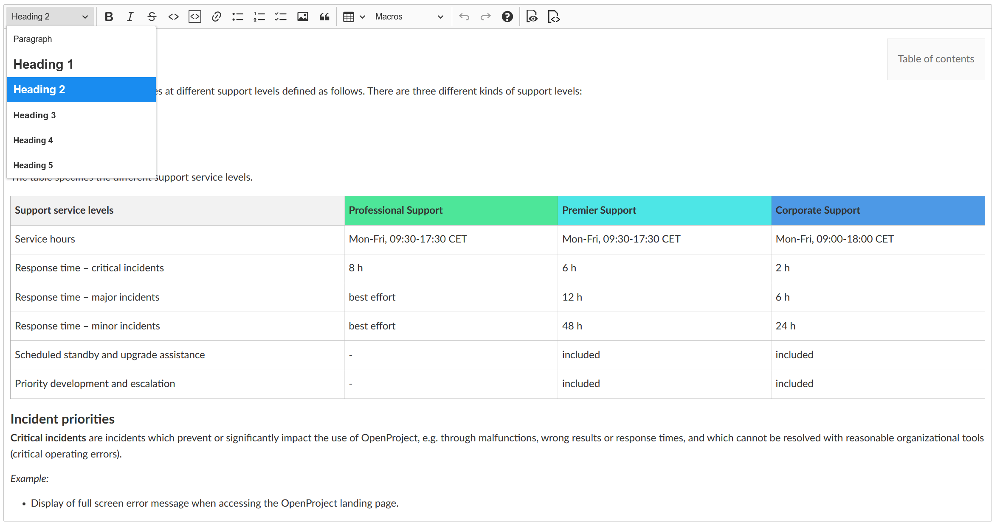
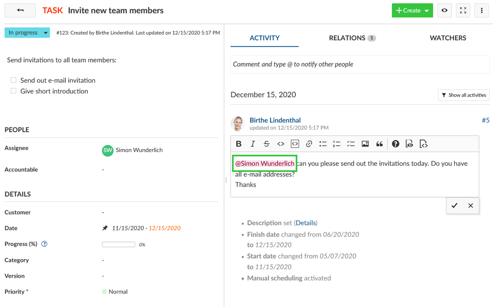
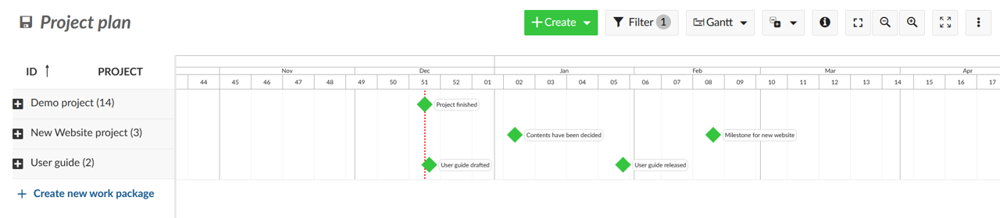
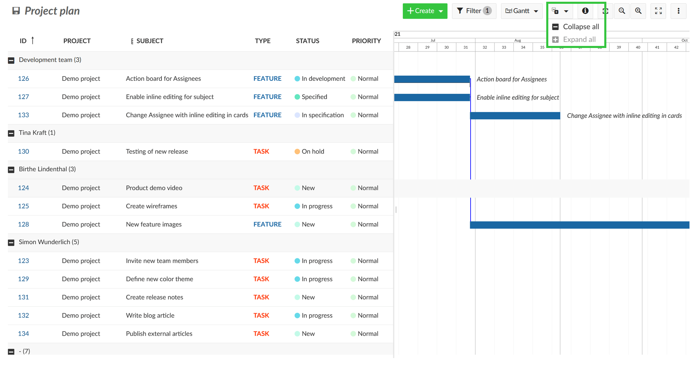
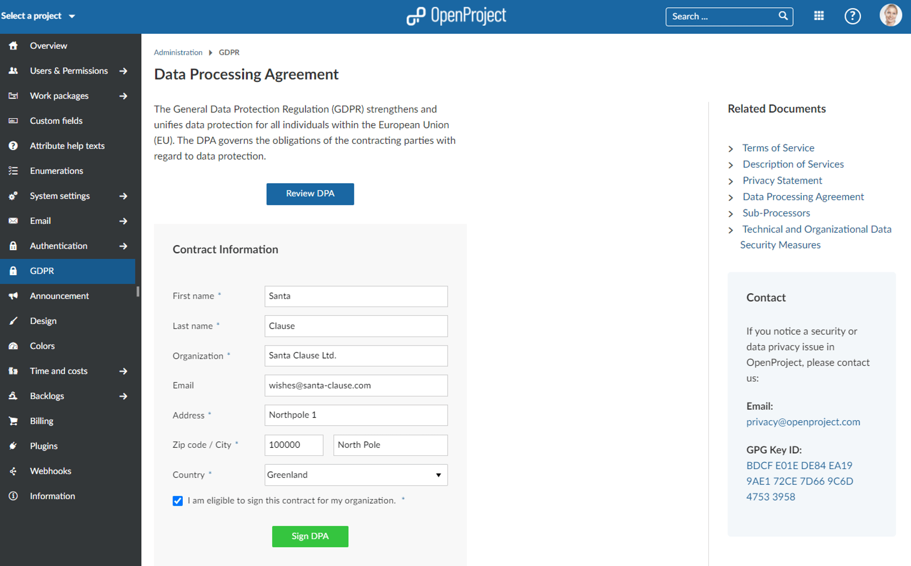

# OpenProject 11.1.0

Release date: 2020-12-17

We released [OpenProject 11.1.0](https://community.openproject.org/versions/1424).
This new release will bring many new features and bug fixes that will improve classical as well as agile project management.

## Improved styling of the WYSIWYG text editor

The styling of texts, headlines, tables, the layout of the table of  contents, and much more have been improved in the WYSIWYG text editor.  This applies not only to wiki pages but also for other text fields, e.g. the description of work packages. To achieve these improvements, we  have, among other things, updated the [CK Editor 5](https://ckeditor.com/ckeditor-5/) to version 23.0.0.

## Direct display of user name for @notifications

While editing a work package comment and @-notify someone, the user  name will now directly be displayed even in the edit mode. This way,  it’s much more convenient to notify the correct team member.

## Display project milestones aggregated for projects in a single row in Gantt chart

With OpenProject 11.1 users are now able to **aggregate milestones for projects in the Gantt chart in one single row**. When grouped by projects, the rows can be collapsed with the collapse  all button and the project milestones are still visible in one row. This way, you easily get a high level overview of all important due dates in a project.

## Collapse all button for groups in the work packages list

In the work package table it is possible to group by any attribute,  e.g. assignee, status, priority or type. Now, once grouped by an  attribute, you will have a **collapse all button on top of the work packages list** to close and open all attributes within a group at once.

## Signing Data Processing Agreement (DPA) documents in Enterprise cloud

For EU customers it is required by the GDPR to sign a data processing agreement (sometimes called data processing addendum) before using our Enterprise cloud edition. Until now, we processed these contracts manually. Users had to print the document, enter their information and send it to us. We then had to sign it too, and send it back to the customer.

Luckily, we now automated this process in order to reduce manual effort on both sides. This way, it is even easier to comply with GDPR. Within -> Administration -> GDPR you can now online review and sign your DPA document with us.

## Various improvements and bug fixes

Furthermore, we have extended the authentication profile with an **OpenID Connect provider.** Also, the printing, e.g. for wiki pages, has been optimized via the browser print function.

## As always,…… there’s much more!

There are a lot more things we packed into 11.1 to tell you about.

### Bug fixes and changes in 11.1

- Changed: @ mention should show user name in the editor \[[#32645](https://community.openproject.org/wp/32645)\]
- Changed: Update CK Editor 5 to version 23.0.0 \[[#34595](https://community.openproject.org/wp/34595)\]
- Changed: Display project's milestones in Gantt chart aggregated in single row \[[#34943](https://community.openproject.org/wp/34943)\]
- Changed: Add custom classes to the CKEditor elements \[[#35104](https://community.openproject.org/wp/35104)\]
- Changed: Change icon and text in menu item in project list \[[#35436](https://community.openproject.org/wp/35436)\]
- Fixed: Wrong default settings for Gantt chart button in project list \[[#34312](https://community.openproject.org/wp/34312)\]
- Fixed: Locked work packages do not copy on project copy \[[#34496](https://community.openproject.org/wp/34496)\]
- Fixed: Boards view doesn't keep the list order (order of the columns) \[[#35004](https://community.openproject.org/wp/35004)\]
- Fixed: caption is copied into the description and multiplied \[[#35123](https://community.openproject.org/wp/35123)\]
- Fixed: Copy budget: Manually set cost are set back to cost deduced from number of units \[[#35484](https://community.openproject.org/wp/35484)\]
- Fixed: "Translation missing" shown in administration > groups \[[#35578](https://community.openproject.org/wp/35578)\]
- Fixed: In WYSIWYG editor preview formatting not correctly applied \[[#35593](https://community.openproject.org/wp/35593)\]
- Fixed: Internal error in project when adding "." in title of wiki page \[[#35594](https://community.openproject.org/wp/35594)\]
- Fixed: Missing lines under headings in WYSIWYG editor \[[#35603](https://community.openproject.org/wp/35603)\]
- Fixed: WYSIWYG table: Tiny column when adding to the left of header column / formatting header not applied in edit \[[#35610](https://community.openproject.org/wp/35610)\]
- Fixed: Links in table of content not functional when macro in same row as toc \[[#35611](https://community.openproject.org/wp/35611)\]
- Fixed: 500er server error when opening query \[[#35620](https://community.openproject.org/wp/35620)\]
- Fixed: 500 on accessing user specific activity page \[[#35621](https://community.openproject.org/wp/35621)\]
- Fixed: "no end date" instead of "no finish date" in work package form \[[#35624](https://community.openproject.org/wp/35624)\]
- Fixed: Code-Snippets are shown nested within each other after update to 11.1 \[[#35628](https://community.openproject.org/wp/35628)\]
- Fixed: Images are left-aligned after update to OpenProject 11.1 \[[#35629](https://community.openproject.org/wp/35629)\]
- Fixed: Internal error when selecting user link on qa-edge \[[#35640](https://community.openproject.org/wp/35640)\]
- Fixed: Line breaks within words in table cells \[[#35644](https://community.openproject.org/wp/35644)\]
- Fixed: Typo in DPA email \[[#35653](https://community.openproject.org/wp/35653)\]
- Fixed: Typo in DPA text in OpenProject \[[#35654](https://community.openproject.org/wp/35654)\]
- Fixed: Cannot set numerated headings without duplicating numeration in table of contents \[[#35656](https://community.openproject.org/wp/35656)\]

## Installation and Updates

To use OpenProject 11.1 right away, create an instance and [test Enterprise cloud 14 days for free](https://start.openproject.com/).

Prefer to run OpenProject 11.1 in your own infrastructure?
Here you can find the [Installation guidelines](../../../installation-and-operations) for OpenProject.

Want to upgrade from your self-managed Community version to try out the Enterprise Enterprise add-ons? [Get a 14 days free trial token directly out of your current Community installation.](https://www.openproject.org/blog/enterprise-edition-upgrade-test-free/)

Navigate to the -> *Administration*-> *Enterprise Edition* and request your trial token.

## Migrating to OpenProject 11.0

Follow the [upgrade guide for the packaged installation or Docker installation](../../../installation-and-operations/operation/upgrading/) to update your OpenProject installation to OpenProject 11.0. Please note the blue box on top of the page.

We update the hosted OpenProject environments (Enterprise cloud) automatically.

## Credits and contributions

Special thanks go to all OpenProject contributors without whom this release would not have been possible:

- All the developers, designers, project managers who have contributed to OpenProject 11.1.

- The City of Cologne for sponsoring some of the open source features and thus contributing them to the Community.

- Every dedicated user who has created feature request, [reported bugs](../../../development/report-a-bug/) for 11.1 and also supported the community by asking and answering questions in the [forum](https://community.openproject.org/projects/openproject/boards).

- All the engaged users who provided translations on [CrowdIn](https://crowdin.com/projects/opf).

- Special thanks for reporting and finding bugs go to:

  Gio @ Enuan, Klaas van Thoor, Paul Kernstock, Rainer Proehl

## What’s next?

We are continuously developing new features and improvements for  OpenProject. If you’d like to preview what’s coming in the next release, be sure to check out our [development roadmap](https://community.openproject.org/projects/openproject/work_packages?query_id=918).
