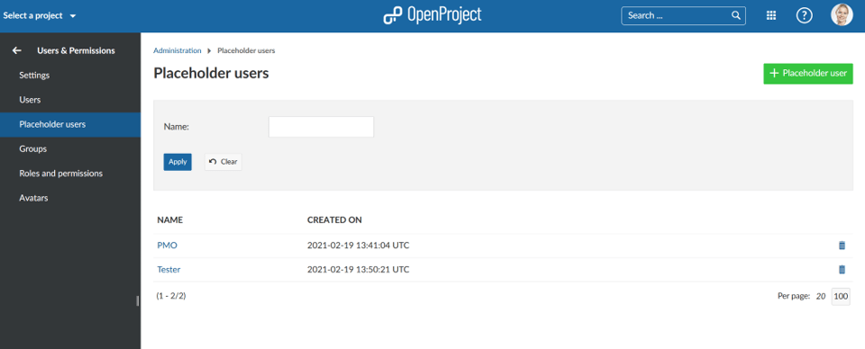
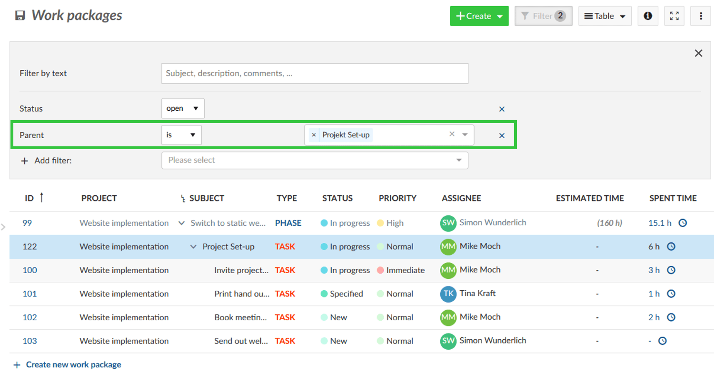
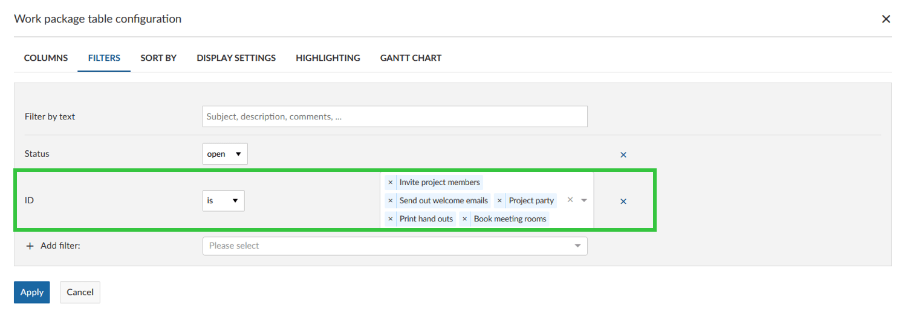
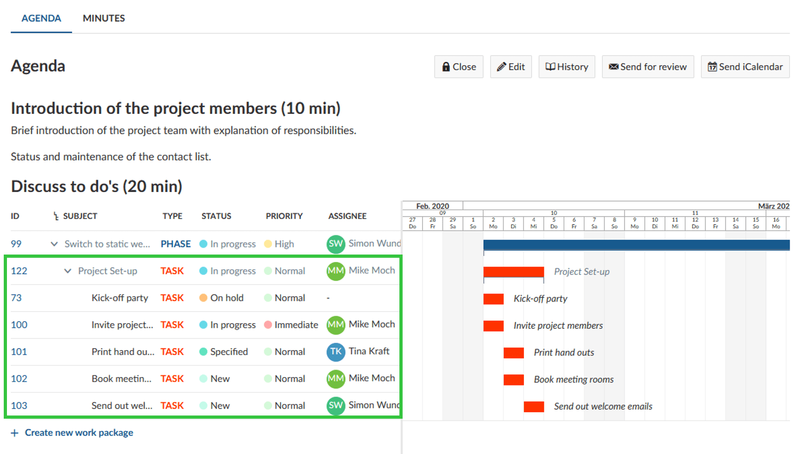
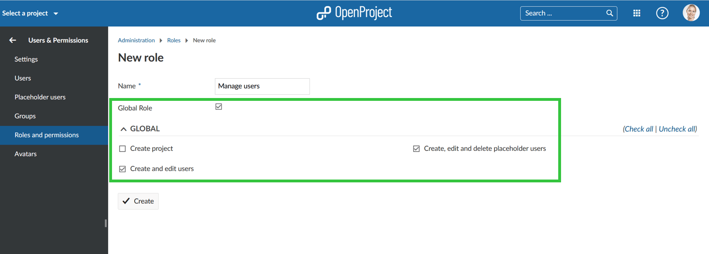

# OpenProject 11.2.0

Release date: 2021-03-09

We released [OpenProject 11.2.0](https://community.openproject.org/versions/1461).
This new release will bring many new features and bug fixes that will improve classical as well as agile project management.

## Placeholder users (Enterprise add-on)

A new concept of placeholder users has been introduced with 11.2. Within the *Administration* -> *Users and permissions* you are now able to create placeholder users without an email address and without taking away any license seats.

These preliminary users can then be added to projects. You can plan  with these resources and already assign tasks to them. This is  especially helpful when setting up a project template. Later, you can  then replace the placeholder users with real users in a project.

In the upcoming release we will continue working on this concept,  i.e. creating a visual distinction between real users and placeholder  users.

## Extended filter options by parent and ID

The work package filters are extended by new work package  attributes. You are now able to also select the parent as a filter option either by entering the name or ID of the parent work package. This way you can easily see all direct related children of a work package.

Furthermore, you can filter the work package table by ID to include (or exclude) only these work packages in the list.

 For example, choose those work packages you want to discuss in a meeting or that needs to be displayed on the project overview by filtering for exactly these IDs.

## Distribution of user administration

The user administration is now distributed to non-admins by a new  global role for more fine-grained user management. This way it is possible for non-admins to manage and invite users without having full admin privileges.

## UI and UX improvements and various bug fixes

Furthermore, with 11.2 we have implemented various UI and UX  improvements for OpenProject. We harmonized the navigation for the time and costs module so that it is consistent with the other navigation.  Also, we adapted the background colors of sum rows and group rows in the work package table so that it is easier to understand. We introduced a group show page (similar to the users show page) in order to link this page in case of mentioning a group and be also available for non-admins.

### All bug fixes and changes

- Changed: Make the cost reporting navigation consistent with the other modules \[[#32928](https://community.openproject.org/wp/32928)\]
- Changed: Add work package filter for child work packages \[[#33163](https://community.openproject.org/wp/33163)\]
- Changed: Swap background colors of sum rows and group rows \[[#34711](https://community.openproject.org/wp/34711)\]
- Changed: Backend: Introduce the concept of "placeholder users" in data layer, API, services, contracts \[[#35505](https://community.openproject.org/wp/35505)\]
- Changed: Backend: Disable all notifications for placeholder users \[[#35506](https://community.openproject.org/wp/35506)\]
- Changed: Backend: Add global permission for creating users (and invite)  \[[#35507](https://community.openproject.org/wp/35507)\]
- Changed: Backend: Add global permission for creating and editing placeholder users \[[#35508](https://community.openproject.org/wp/35508)\]
- Changed: Backend: Add global permission for modifying users \[[#35533](https://community.openproject.org/wp/35533)\]
- Changed: Backend: Don't count placeholder users in user limits of plans/subscriptions \[[#35535](https://community.openproject.org/wp/35535)\]
- Changed: Backend: Show and manage placeholder users in user administration \[[#35536](https://community.openproject.org/wp/35536)\]
- Changed: Frontend: Show placeholder user in user type drop downs \[[#35571](https://community.openproject.org/wp/35571)\]
- Changed:  Backend: Delete placeholder user \[[#35648](https://community.openproject.org/wp/35648)\]
- Changed: Add group show page similar to users \[[#35815](https://community.openproject.org/wp/35815)\]
- Changed: Remove setting "Allow assignment to groups"  \[[#36056](https://community.openproject.org/wp/36056)\]
- Changed: Accommodate placeholder users in project members administration \[[#36136](https://community.openproject.org/wp/36136)\]
- Changed: Add work package filter by id \[[#36358](https://community.openproject.org/wp/36358)\]
- Fixed: OAuth login has CSP issues when user already had authorized the app \[[#34554](https://community.openproject.org/wp/34554)\]
- Fixed: Unclear error message when subproject column for action board cannot be displayed due to missing permissions \[[#34840](https://community.openproject.org/wp/34840)\]
- Fixed: Impossible to enter time with dots \[[#34922](https://community.openproject.org/wp/34922)\]
- Fixed: Cannot sort user columns (in administration) \[[#35012](https://community.openproject.org/wp/35012)\]
- Fixed: create new child returns version error (duplicate usage of type for backlogs sprint and task) \[[#35157](https://community.openproject.org/wp/35157)\]
- Fixed: Taskboard story height to be increased. Assignee and Story name out of box \[[#35735](https://community.openproject.org/wp/35735)\]
- Fixed: PDF export opens in same tab \[[#36051](https://community.openproject.org/wp/36051)\]
- Fixed: LDAP connection retrieves at max 1000 elements regardless of server limit \[[#36206](https://community.openproject.org/wp/36206)\]
- Fixed: Deletion of users and groups is incomplete and results in corrupted data \[[#36238](https://community.openproject.org/wp/36238)\]
- Fixed: Breadcrumbs missing for both users and placeholder users administration pages when not admin \[[#36250](https://community.openproject.org/wp/36250)\]
- Fixed: Section header "Custom fields" was removed in user details in administration \[[#36257](https://community.openproject.org/wp/36257)\]
- Fixed: Error "Project filter has invalid values" shown when filtering by Parent on global WP page \[[#36287](https://community.openproject.org/wp/36287)\]
- Fixed: Error "Project filter has invalid values" shown when filtering by Parent on My page \[[#36288](https://community.openproject.org/wp/36288)\]
- Fixed: Empty authentication section shown for some users in administration (for users who have global role to view / edit / create users) \[[#36294](https://community.openproject.org/wp/36294)\]
- Fixed: Error 500 when accessing "Member" list in project while user name display format is set to email \[[#36297](https://community.openproject.org/wp/36297)\]
- Fixed: Role "Create and edit users" can see GDPR and billing although not allowed to \[[#36298](https://community.openproject.org/wp/36298)\]
- Fixed: Role "Create and edit users" can not change user name \[[#36299](https://community.openproject.org/wp/36299)\]
- Fixed: Internal error when accessing project work package page after deleting placeholder user \[[#36300](https://community.openproject.org/wp/36300)\]
- Fixed: Translation missing for placeholder Enterprise Edition page \[[#36302](https://community.openproject.org/wp/36302)\]
- Fixed: Logged hours not visible in widget on My Page for languages other than English \[[#36304](https://community.openproject.org/wp/36304)\]
- Fixed: Grouping by assignee through settings menu does not work \[[#36318](https://community.openproject.org/wp/36318)\]
- Fixed: Work package alignment incorrect when updating work package values / opening details view \[[#36330](https://community.openproject.org/wp/36330)\]
- Fixed: Wrong error message when trying to log time for a placeholder user \[[#36353](https://community.openproject.org/wp/36353)\]
- Fixed: Cannot create work package if a version custom field is configured \[[#36395](https://community.openproject.org/wp/36395)\]
- Fixed: Buttons and queries not working after filtering for custom field \[[#36440](https://community.openproject.org/wp/36440)\]
- Fixed: Trying to sort placeholder users by name leads to Error 500 \[[#36517](https://community.openproject.org/wp/36517)\]
- Epic: Support for placeholder users that do not have an email address yet \[[#35933](https://community.openproject.org/wp/35933)\]

## Installation and Updates

To use OpenProject 11.2 right away, create a free trial instance for our [OpenProject Enterprise cloud.](https://start.openproject.com/)

Prefer to run OpenProject 11.2 in your own infrastructure?
 Here you can find the [Installation guidelines](../../../installation-and-operations) for OpenProject.

Want to upgrade from a Community version to try out the Enterprise Enterprise add-ons? [Get a 14 days free trial token directly out of your current Community installation.](https://www.openproject.org/enterprise-edition/)

## Migrating to OpenProject 11.2

Follow the [upgrade guide for the packaged installation or Docker installation](../../../installation-and-operations/operation/upgrading/) to update your OpenProject installation to OpenProject 11.2.

We update hosted OpenProject environments (Enterprise cloud) automatically.

## Support

You will find useful information in the OpenProject [Documentation](https://www.openproject.org/docs) or you can post your questions in the [Forum](https://community.openproject.org/projects/openproject/boards).

## Credits

Special thanks go to all OpenProject contributors without whom this release would not have been possible:

- All the developers, designers, project managers who have contributed to OpenProject. Special thanks for reporting and finding bugs go to

  Rémi Schillinger, Sander Kleijwegt, Tibor Budai.

- Special thanks for this release go to Mercedes-AMG for sponsoring features.

- Thank you for the updates of our documentation, cugu, txsing, luzpaz, Amandine-Malo, marcelotm23, ivangriggs, Siltes, loganwedwards.

- Every dedicated user who has [reported bugs](../../../development/report-a-bug/) and supported the community by asking and answering questions in the [forum](https://community.openproject.org/projects/openproject/boards).

- All the dedicated users who provided translations on [CrowdIn](https://crowdin.com/projects/opf).
