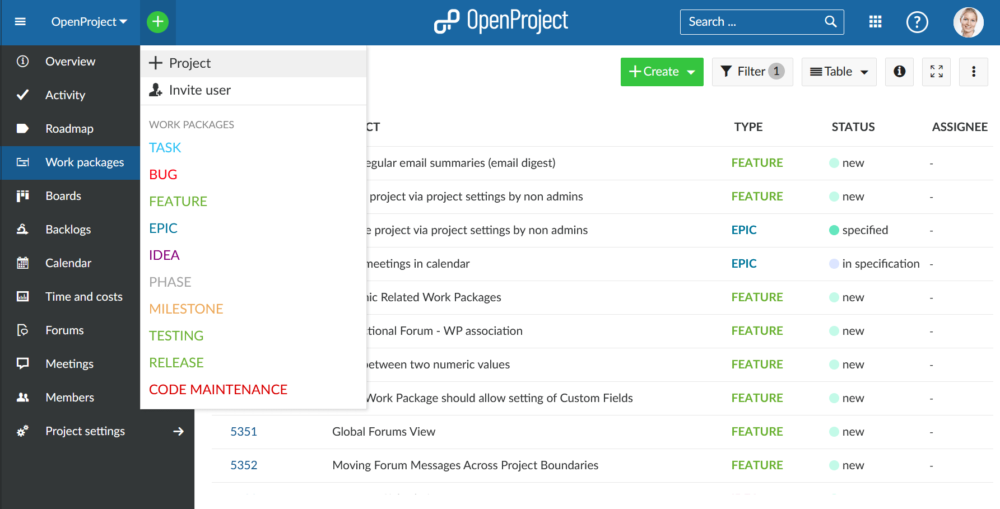
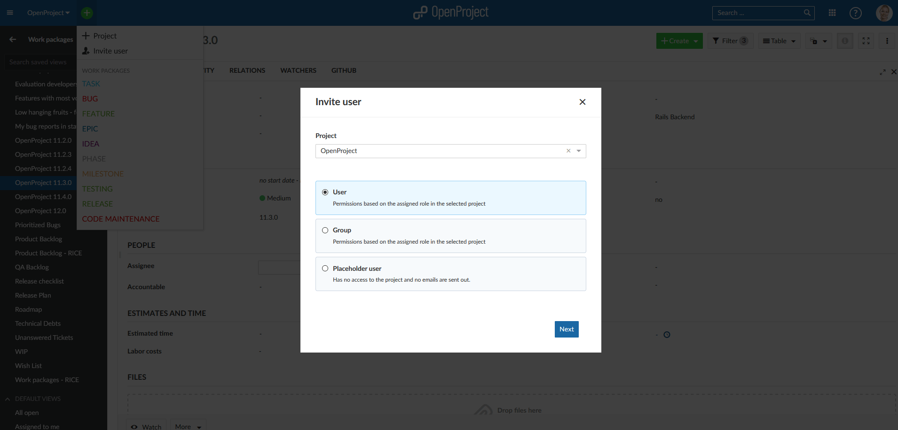
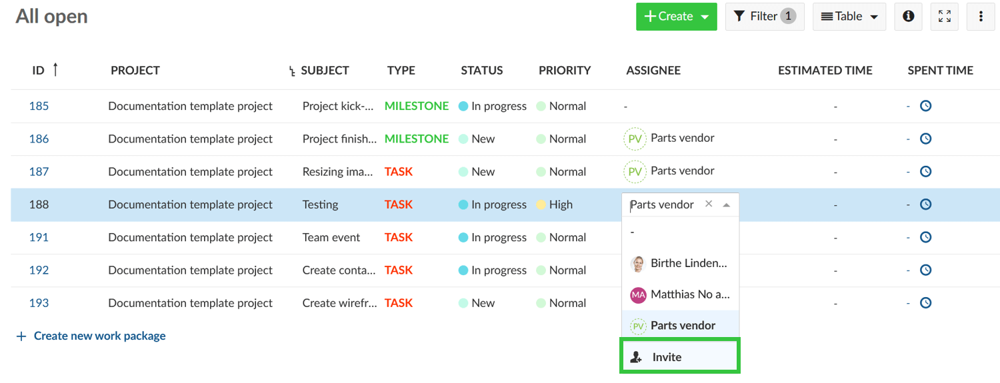
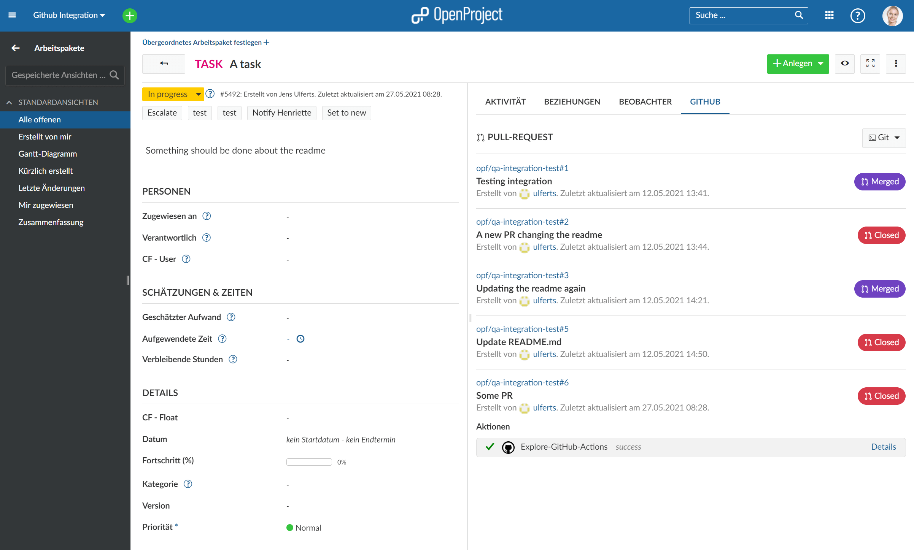
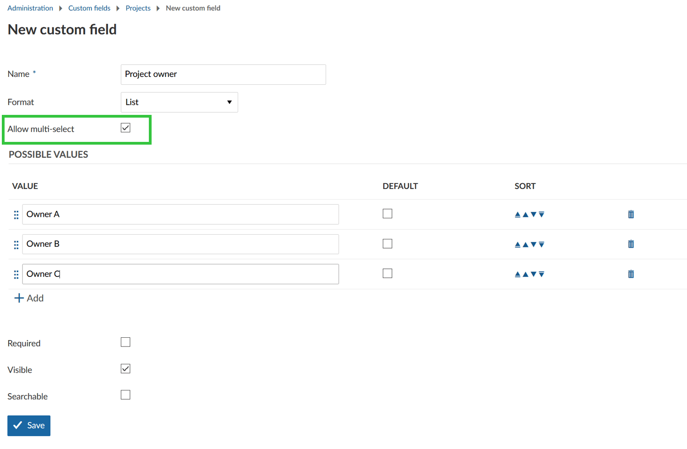

# OpenProject 11.3.0

Release date: 2021-06-03

We released [OpenProject 11.3.0](https://community.openproject.org/versions/1468).
This new release will bring many new features and bug fixes that will improve classical as well as agile project management.

<!--more-->

## New button in header navigation to create projects, users or work packages

In the header navigation we have introduced a **new button to create a project, invite a user (or a group or placeholder user), and create a new work package**. If a project is not selected it needs to be chosen at first during the create process. For the user invitation a new and simplified user creation modal will open.

## Simplified invitation of users, groups or placeholder users

### New user invite modal

A new user invite process has been introduced. A modal window allows **much easier creation of new users, groups or placeholder users**, assigning roles and adding them to a project.
Add a personal invitation message, e.g. an explanation for the invitation or a bit of information regarding the project, which will be sent to the users to help them get started.

The invite process can be started directly from the new "+" create button in the header navigation.

### Invite new users from work packages drop-down

The **new invite modal for users, groups, and placeholder users** can now be opened directly from the user type drop-down menu in a work package, e.g. to assign a user to a work package who is not yet a member of the project. This way, there is no need anymore to leave the work package to assign a user who is not yet a member of the project. The creation of users and adding them to a project is now much more intuitive.

## GitHub integration

With OpenProject 11.3 we released a new **integration between GitHub and OpenProject**. This integration facilitates the collaboration of developers by connecting the two applications. The new GitHub integration in OpenProject is an individual module that, once activated, will be displayed to you as a tab in the work package details view. All activities taking place on GitHub that are related to the work package, are listed on this new GitHub tab. [Find out more about the OpenProject GitHub integration](../../../system-admin-guide/integrations/github-integration/).

## API v3 extensions

### API v3 endpoints for groups

We have made **extensions to our API v3** to create, read, update and delete groups through the API, e.g. to allow adding users to a group via API. The following tasks can be performed via the API:

- Create a group
- Delete a group
- Edit a group
  - Change the name
- Add or remove user to a group
  - Adding a user to a group creates project memberships
  - Removing a user from a group removes project memberships.
- List groups of a user
- List users of a group

### API V3 endpoints for placeholder users

We have added endpoints to our API v3 for fetching placeholder users so that placeholder users can be managed or read by a machine.

### Copy project via API v3

The API v3 already supports the ability to create a new project. It is now enhanced by the ability to copy existing projects.

[Find out more details in our API documentation.](../../../api/)

## Sending notification on adding a user to a project or updating the role

Newly **added users to a project will now receive a notification** that they have been added to a project. The user will receive an email with a the information about the role in the project and a link to it. Also, if a role is changed in a project, the user will receive a notification about the newly added role. Also, the API endpoints for creating and updating memberships are enhanced by this notifications. The notifications can be turned off in the administration (Administration -> Email -> Email notifications).

## Multi-selection for project custom fields of type list

For work packages, fields can already be configured as multiple selections for all projects or for individual projects. The same function is now able for user-defined custom fields of the type Project.

## Create backup from web interface

Users now have the option to **create backups of their OpenProject installation** directly via the web interface. the backup can be triggered via Administration -> Backup. They will receive an email notification with the link to download the backup files with an additional authentication (username/password + 2FA).

## All new features, bug fixes and changes

- Epic: CRUD operations for groups in API v3 \[[#18812](https://community.openproject.org/wp/18812)\]
- Epic: Enhanced integration with GitHub pull requests \[[#36132](https://community.openproject.org/wp/36132)\]
- Epic: Support for placeholder users that do not have an email address yet (part 2) \[[#36308](https://community.openproject.org/wp/36308)\]
- Epic: Multi-selection for project custom fields of type list \[[#36382](https://community.openproject.org/wp/36382)\]
- Changed: User avatars in user select menus \[[#30226](https://community.openproject.org/wp/30226)\]
- Changed: Allow adding users to Group via API v3 \[[#33686](https://community.openproject.org/wp/33686)\]
- Changed: Copy project via API v3 \[[#34444](https://community.openproject.org/wp/34444)\]
- Changed: Frontend: Extend user type drop down menu with "invite" option \[[#35520](https://community.openproject.org/wp/35520)\]
- Changed: Frontend: Create invite/add user modal \[[#35521](https://community.openproject.org/wp/35521)\]
- Changed: Backend: Seed new "Creating and editing placeholder users" permissions \[[#35523](https://community.openproject.org/wp/35523)\]
- Changed: Frontend: Create + button in header \[[#35527](https://community.openproject.org/wp/35527)\]
- Changed: Improve locale setting strategy (dates calculation) \[[#35664](https://community.openproject.org/wp/35664)\]
- Changed: Backend: Add API endpoint for permissions \[[#36009](https://community.openproject.org/wp/36009)\]
- Changed: Backend: Send notification on adding a user to a project \[[#36019](https://community.openproject.org/wp/36019)\]
- Changed: Link a manually created Pull Request to a work package \[[#36153](https://community.openproject.org/wp/36153)\]
- Changed: Implement a new integration system \[[#36185](https://community.openproject.org/wp/36185)\]
- Changed: Add new GitHub plugin tab enabling users to copy git actions \[[#36204](https://community.openproject.org/wp/36204)\]
- Changed: Provide different fallback avatars for users, groups, and placeholder users \[[#36243](https://community.openproject.org/wp/36243)\]
- Changed: API V3 Endpoints for placeholder users \[[#36296](https://community.openproject.org/wp/36296)\]
- Changed: Copy git commands from the new GitHub work package tab \[[#36305](https://community.openproject.org/wp/36305)\]
- Changed: Support required custom fields when inviting users via the modal \[[#36324](https://community.openproject.org/wp/36324)\]
- Changed: Introduce visible scope to placeholder users and apply to API \[[#36348](https://community.openproject.org/wp/36348)\]
- Changed: Create project filter for "public" status \[[#36415](https://community.openproject.org/wp/36415)\]
- Changed: Form/schema endpoint for User resource \[[#36467](https://community.openproject.org/wp/36467)\]
- Changed: Allow multi select custom fields in the backend (Administration, API, project list view and filters, ...) \[[#36511](https://community.openproject.org/wp/36511)\]
- Changed: Replace project forms by Angular/formly (Create and update + widgets) \[[#36512](https://community.openproject.org/wp/36512)\]
- Changed: Allow multi select in angular/formly based project forms (create and update + details widget) \[[#36513](https://community.openproject.org/wp/36513)\]
- Changed: Add quick add menu to onboarding tour \[[#36593](https://community.openproject.org/wp/36593)\]
- Changed: Extend APIv3 schema representers with location to attributes \[[#36791](https://community.openproject.org/wp/36791)\]
- Changed: Extend APIv3 schema representers with optional description \[[#36795](https://community.openproject.org/wp/36795)\]
- Changed: Have project status as full resource \[[#37023](https://community.openproject.org/wp/37023)\]
- Changed: Replace remaining project forms by Angular \[[#37026](https://community.openproject.org/wp/37026)\]
- Changed: Hide "Active" field from project settings \[[#37078](https://community.openproject.org/wp/37078)\]
- Changed: Show bulb before options in project status field \[[#37079](https://community.openproject.org/wp/37079)\]
- Changed: Use autocompleters for select fields in project form \[[#37080](https://community.openproject.org/wp/37080)\]
- Changed: Add copy project form to APIv3 \[[#37091](https://community.openproject.org/wp/37091)\]
- Changed: Attribute help text on dynamic form \[[#37092](https://community.openproject.org/wp/37092)\]
- Changed: Improve design of checkboxes in formly forms \[[#37105](https://community.openproject.org/wp/37105)\]
- Changed: Improve design of Github tab \[[#37108](https://community.openproject.org/wp/37108)\]
- Changed: Allow inviting users from project member administration for non admins  \[[#37126](https://community.openproject.org/wp/37126)\]
- Changed: Handle duplicate project identifiers in the backend \[[#37140](https://community.openproject.org/wp/37140)\]
- Fixed: Unable to enter Boards module when work package module is disabled \[[#34794](https://community.openproject.org/wp/34794)\]
- Fixed: Editing project settings removes link to parent project for certain permission constellations \[[#35510](https://community.openproject.org/wp/35510)\]
- Fixed: Wrong date and time in work package activity \[[#35636](https://community.openproject.org/wp/35636)\]
- Fixed: Create two same projects with same project identifier \[[#35999](https://community.openproject.org/wp/35999)\]
- Fixed: Admins cannot create new projects, if user custom field for projects active and there are many projects \[[#36164](https://community.openproject.org/wp/36164)\]
- Fixed: Gantt chart header might appear in a different locale \[[#36346](https://community.openproject.org/wp/36346)\]
- Fixed: Default work package type can't be changed \[[#36350](https://community.openproject.org/wp/36350)\]
- Fixed: "Get a personal demo" link is broken \[[#36425](https://community.openproject.org/wp/36425)\]
- Fixed: Finish registration modal (user info + consent) too narrow - cannot continue \[[#36461](https://community.openproject.org/wp/36461)\]
- Fixed: Crowdin translations are returning incorrectly empty strings \[[#36470](https://community.openproject.org/wp/36470)\]
- Fixed: Project member table shows email despite "Hide my email address" in users profile \[[#36518](https://community.openproject.org/wp/36518)\]
- Fixed: No paragraphs in work package comments \[[#36723](https://community.openproject.org/wp/36723)\]
- Fixed: IFC import from Bricscad is not visible in viewer \[[#36858](https://community.openproject.org/wp/36858)\]
- Fixed: Wiki: after navigation in left sidebar, the sidebar is always set to top (first item) instead of scrolling to the selected (focus) item (regression in OP 11.2) \[[#36937](https://community.openproject.org/wp/36937)\]
- Fixed: Layout differences between WP comment editing and showing \[[#36989](https://community.openproject.org/wp/36989)\]
- Fixed: Avatar/User/Timestamp group layout broken \[[#37106](https://community.openproject.org/wp/37106)\]
- Fixed: Fallback avatar initials not vertically centered in header \[[#37112](https://community.openproject.org/wp/37112)\]
- Fixed: UX: Role drop down cut off when opened in invite modal \[[#37114](https://community.openproject.org/wp/37114)\]
- Fixed: Invite modal: I18n string missing for "no roles found" \[[#37115](https://community.openproject.org/wp/37115)\]
- Fixed: WP export does not include estimated time value for parent work packages \[[#37124](https://community.openproject.org/wp/37124)\]
- Fixed: Unassigning a template when creating project is ignored \[[#37153](https://community.openproject.org/wp/37153)\]
- Fixed: Plus-sign within create-button not centered \[[#37155](https://community.openproject.org/wp/37155)\]
- Fixed: Float custom fields with value 0 are shown as empty \[[#37157](https://community.openproject.org/wp/37157)\]
- Fixed: Copy settings should be hidden when selecting a template \[[#37158](https://community.openproject.org/wp/37158)\]
- Fixed: Avatar shrunk down when custom avatar used \[[#37159](https://community.openproject.org/wp/37159)\]
- Fixed: Loading of capabilities is broken when there are more than 1000 capabilities \[[#37160](https://community.openproject.org/wp/37160)\]
- Fixed: User welcome screen too big / layout broken \[[#37165](https://community.openproject.org/wp/37165)\]
- Fixed: Wrong / outdated webinar video link in user invite email  \[[#37166](https://community.openproject.org/wp/37166)\]
- Fixed: Link to administration shown for non-admin users (leads to 400) \[[#37168](https://community.openproject.org/wp/37168)\]
- Fixed: Internal error when trying to invite user to project without permission \[[#37169](https://community.openproject.org/wp/37169)\]
- Fixed: User invite modal includes archived projects \[[#37184](https://community.openproject.org/wp/37184)\]
- Fixed: Users only having the "add_subproject" permission cannot create subprojects \[[#37195](https://community.openproject.org/wp/37195)\]
- Fixed: Used strings in error message are inconsistent / not matching \[[#37197](https://community.openproject.org/wp/37197)\]
- Fixed: Layout for "Change password" modal broken \[[#37251](https://community.openproject.org/wp/37251)\]
- Fixed: In work package user dropdowns email address is shown even though format is set to show first name last name \[[#37257](https://community.openproject.org/wp/37257)\]
- Fixed: Layout for board creation modal broken \[[#37258](https://community.openproject.org/wp/37258)\]
- Fixed: Layout for "Add column" modal for action board broken \[[#37259](https://community.openproject.org/wp/37259)\]
- Fixed: Dropdown fields too large / text not centered \[[#37261](https://community.openproject.org/wp/37261)\]
- Fixed: Layout log time / log unit cost wrong \[[#37262](https://community.openproject.org/wp/37262)\]
- Fixed: Cannot close version when backlog / wiki is activated \[[#37263](https://community.openproject.org/wp/37263)\]
- Fixed: Missing translation in "Create backup" warning menu \[[#37264](https://community.openproject.org/wp/37264)\]
- Fixed: Commands for GitHub integration crammed in German language settings \[[#37265](https://community.openproject.org/wp/37265)\]
- Fixed: Option "Overview" on copy project form not localized \[[#37266](https://community.openproject.org/wp/37266)\]
- Fixed: Layout for attribute help text broken \[[#37268](https://community.openproject.org/wp/37268)\]
- Fixed: Arrows not working on some dynamic inputs \[[#37273](https://community.openproject.org/wp/37273)\]
- Fixed: Manually executed LDAP group sync doesn't have permissions to add to group \[[#37275](https://community.openproject.org/wp/37275)\]
- Fixed: Principal Component fails on system users \[[#37278](https://community.openproject.org/wp/37278)\]
- Fixed: Auth header SSO does not set last_login date \[[#37290](https://community.openproject.org/wp/37290)\]
- Fixed: Typo in source string when inviting user and lacking permission \[[#37291](https://community.openproject.org/wp/37291)\]
- Fixed: Kanban board of type "subproject" shows archived projects / error when selected \[[#37295](https://community.openproject.org/wp/37295)\]
- Fixed: Error message suggests that multiple errors are shown when creating a project even though only one error (name) occurs \[[#37299](https://community.openproject.org/wp/37299)\]
- Fixed: Darkened background when opening date picker for work packages \[[#37301](https://community.openproject.org/wp/37301)\]
- Fixed: Shortcut "p" (to open project dropdown list) not working \[[#37305](https://community.openproject.org/wp/37305)\]
- Fixed: "(None)" option missing for parent project drop down select \[[#37398](https://community.openproject.org/wp/37398)\]
- Fixed: Multi-select fields do not adjust height (cannot see values) \[[#37404](https://community.openproject.org/wp/37404)\]
- Fixed: OpenProject backup completes partially with file permission errors \[[#37440](https://community.openproject.org/wp/37440)\]
- Fixed: Github user avatar not rendered correctly \[[#37444](https://community.openproject.org/wp/37444)\]
- Fixed: Password confirmation during backup token reset not working \[[#37445](https://community.openproject.org/wp/37445)\]
- Fixed: Several problem with the header in mobile view \[[#37452](https://community.openproject.org/wp/37452)\]
- Fixed: allowedValues for project user custom fields result in 400 bad request \[[#37453](https://community.openproject.org/wp/37453)\]
- Fixed: Date can't be removed \[[#37459](https://community.openproject.org/wp/37459)\]
- Fixed: Invite user should use project of work package, not current project \[[#37463](https://community.openproject.org/wp/37463)\]
- Fixed: Changing a project's status together with the project's parent loses change to status \[[#37464](https://community.openproject.org/wp/37464)\]
- Fixed: Option "public" for projects shown as required even though not required \[[#37502](https://community.openproject.org/wp/37502)\]
- Fixed: WP delete modal: Alignment, truncation, spacing issue \[[#37503](https://community.openproject.org/wp/37503)\]
- Fixed: Can scroll outside of WP list (white space) when date picker opened and scrolling \[[#37509](https://community.openproject.org/wp/37509)\]
- Fixed: Copy WP does not work (404) \[[#37510](https://community.openproject.org/wp/37510)\]
- Fixed: Quick-add menu not showing on smaller screens \[[#37539](https://community.openproject.org/wp/37539)\]

## Installation and Updates

To use OpenProject 11.3 right away, create a free trial instance for our [OpenProject Enterprise cloud.](https://start.openproject.com/)

Prefer to run OpenProject 11.3 in your own infrastructure?
 Here you can find the [Installation guidelines](../../../installation-and-operations) for OpenProject.

Want to upgrade from a Community version to try out the Enterprise add-ons? [Get a 14 days free trial token directly out of your current Community installation.](https://www.openproject.org/enterprise-edition/)

## Migrating to OpenProject 11.3

Follow the [upgrade guide for the packaged installation or Docker installation](../../../installation-and-operations/operation/upgrading/) to update your OpenProject installation to OpenProject 11.3.

We update hosted OpenProject environments (Enterprise cloud) automatically.

## Support

You will find useful information in the OpenProject [Documentation](https://www.openproject.org/docs/) or you can post your questions in the [Forum](https://community.openproject.org/projects/openproject/boards).

## Credits

A big thanks to community members for reporting bugs and helping us identifying and providing fixes.

Special thanks for contributions go to

- Philipp Tessenow, Max Mutzge, Jan Niklas Grieb, Kris M, Frank Long, Johannes G, Björn Schümann, Alexander Seitz, Sebastian Schoeller, Charles Steiger
- AMG/Daimler for sponsoring feature development
- City of Cologne for sponsoring feature development
- Every dedicated user who has [reported bugs](../../../development/report-a-bug/) and supported the community by asking and answering questions in the [forum](https://community.openproject.org/projects/openproject/boards).
- All the dedicated users who provided translations on [CrowdIn](https://crowdin.com/projects/opf).
