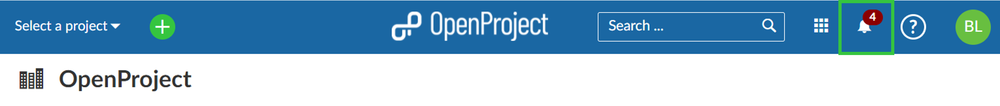
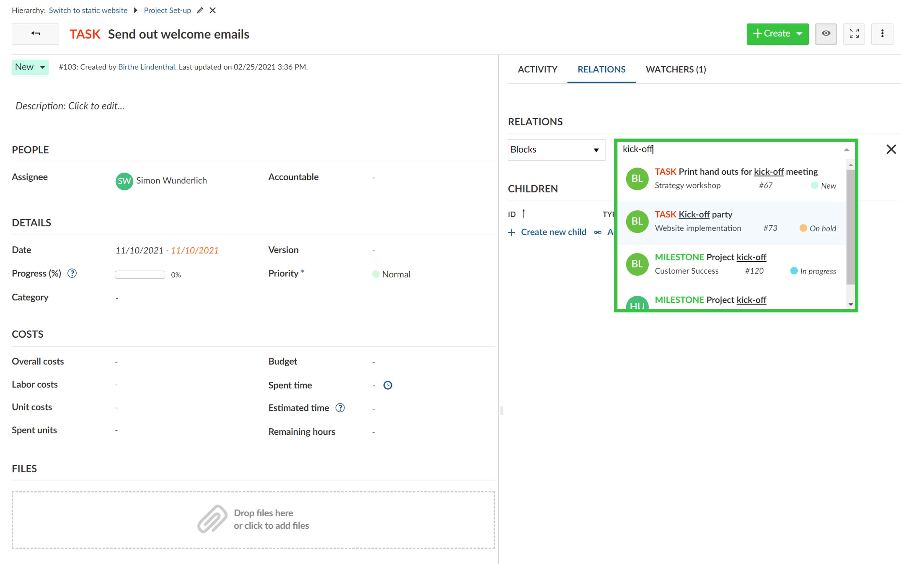
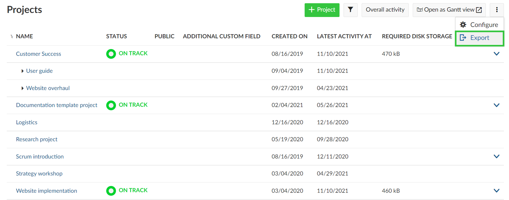
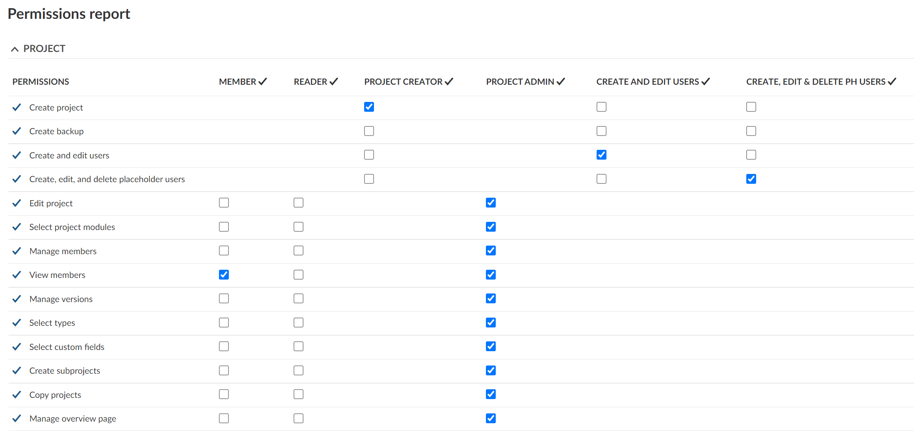

# OpenProject 12.0.0

Release date: 2021-11-15

We released [OpenProject 12.0.0](https://community.openproject.com/versions/1478).
This release will change the way how you work with OpenProject. We have introduced the concept of in-app notifications. A new notification center in OpenProject will display changes in your projects directly in the application. This reduces the flood of emails in your inbox significantly. Additionally, you can add daily email summaries to keep up to date about latest updates and changes.

## Introducing in-app notifications

The new in-app notifications let you never miss a change in your projects again. Now, you receive all important updates directly in the application and don’t get a flood of emails in your inbox anymore. The new bell symbol in the header navigation displays the number of unread notifications.

Go to our user guide to find out how to [configure in-app notifications](../../user-guide/notifications/).

## Notification center

The new notification center shows all notifications about changes within your projects, including intuitive filter options in the menu on the left, e.g. by reason for notification or by projects. Clicking on the notification will open the details of a work package. you can directly edit it in a split view. The blue elliptical indicates the number of unread notifications about changes within one work package.

## Improved notification settings

The improved notification settings now allow to fine-tune for which actions and in which projects you want to receive a notification. With 12.0 you can now even add project-specific settings for changes you want to be notified about and override the default settings.

## Email summaries

In addition to the in-app notifications, also email reminders can be configured to receive important updates in a daily (or more often) email summary. These email reminders can be configured to receive also additional notifications about changes in your projects, e.g. new or updated memberships in a project.

## Improved work packages auto-completer

The work package auto-completer for relations now also shows additional information (project name, status, …). It is now much easier to identify the respective work package.

## Export of the project list

With OpenProject 12.0 it is now possible to export the project list with all project specific information, incl. project custom fields. You can choose between the formats XLS and CSV export.

## Chage of roles and permissions settings

With 12.0 we have added more granular rights for projects, for example the addtional right to configure the project overview page. This way you can even better assign certain permissions to a role in a project.

## Drop official support for PostgreSQL < 13

OpenProject 12.0 will deprecate PostgreSQL versions < 13. This will result in a warning about the necessary migration to inform users trying to upgrade with an older version. The warning will be shown on startup and on the Administration > Info page. It will not result in a hard error for now.

## All bug fixes and changes in 12.0

- Changed: Send daily email summaries (email digest) \[[#1899](https://community.openproject.com/wp/1899)\]
- Changed: Allow author to mute email notification by making him a watcher \[[#27706](https://community.openproject.com/wp/27706)\]
- Changed: Remove custom fields for "Work package priorities" and "Document categories" \[[#29419](https://community.openproject.com/wp/29419)\]
- Changed: Allow downloading IFC models \[[#35272](https://community.openproject.com/wp/35272)\]
- Changed: Show additional information (project name, status, ...) in work package auto completers \[[#35635](https://community.openproject.com/wp/35635)\]
- Changed: Change content of Project member invitation email \[[#36175](https://community.openproject.com/wp/36175)\]
- Changed: Dynamic form: Flat model structure (_links) \[[#37472](https://community.openproject.com/wp/37472)\]
- Changed: Disable author becoming watcher on project copy \[[#37799](https://community.openproject.com/wp/37799)\]
- Changed: Remove option to get notified about changes that I make myself \[[#37824](https://community.openproject.com/wp/37824)\]
- Changed: [IAN center] Make In App Notification Center responsive to mobile sizes \[[#37870](https://community.openproject.com/wp/37870)\]
- Changed: API v3 notifications api bulk confirming notifications \[[#37872](https://community.openproject.com/wp/37872)\]
- Changed: [IAN center] Clarify current magic limit of 250 items while we have no pagination \[[#37874](https://community.openproject.com/wp/37874)\]
- Changed: Automatically open the next notification after reading another notification \[[#38129](https://community.openproject.com/wp/38129)\]
- Changed: Grouping events by work package in notification dashboard \[[#38137](https://community.openproject.com/wp/38137)\]
- Changed: Link from notifications dashboard to personal notification settings \[[#38139](https://community.openproject.com/wp/38139)\]
- Changed: Create in-app notifications for the first event and not after the aggregation time of x minutes, \[[#38333](https://community.openproject.com/wp/38333)\]
- Changed: Work package type is missing in work package auto-completion \[[#38334](https://community.openproject.com/wp/38334)\]
- Changed: Show unread notifications in Activity tab \[[#38339](https://community.openproject.com/wp/38339)\]
- Changed: Work packages split view in notifications dashboard \[[#38340](https://community.openproject.com/wp/38340)\]
- Changed: New update notification reasons to better filter the relevant updates \[[#38341](https://community.openproject.com/wp/38341)\]
- Changed: Sidebar in Notification center with project filter \[[#38520](https://community.openproject.com/wp/38520)\]
- Changed: Re-name ordering settings in activity tab to "Oldest first/Newest first" \[[#38549](https://community.openproject.com/wp/38549)\]
- Changed: Notification main list view \[[#38592](https://community.openproject.com/wp/38592)\]
- Changed: Migration plan for new notifcation settings and call to action for user to use it \[[#38595](https://community.openproject.com/wp/38595)\]
- Changed: new images for renamed ordering settings to "Oldest first/Newest first" \[[#38605](https://community.openproject.com/wp/38605)\]
- Changed: Empty states in notification center \[[#38610](https://community.openproject.com/wp/38610)\]
- Changed: Involvement filters in the sidebar of notification center \[[#38642](https://community.openproject.com/wp/38642)\]
- Changed: Loading indicator when loading "all" notifications \[[#38648](https://community.openproject.com/wp/38648)\]
- Changed: New UI for notification row \[[#38650](https://community.openproject.com/wp/38650)\]
- Changed: Notification settings: account-level defaults \[[#38671](https://community.openproject.com/wp/38671)\]
- Changed: Email design - Daily Reminders \[[#38690](https://community.openproject.com/wp/38690)\]
- Changed: Email design - Mention email \[[#38692](https://community.openproject.com/wp/38692)\]
- Changed: Scroll to oldest unread activity in the activity tab \[[#38693](https://community.openproject.com/wp/38693)\]
- Changed: Email reminder settings (user account) \[[#38700](https://community.openproject.com/wp/38700)\]
- Changed: Highlight selected notification in the center \[[#38794](https://community.openproject.com/wp/38794)\]
- Changed: Separate between the reason "Assignee" and "Accountable" in notification row (mail and UI) \[[#38824](https://community.openproject.com/wp/38824)\]
- Changed: BCF API Comments Service \[[#38833](https://community.openproject.com/wp/38833)\]
- Changed: Show meaningful content on accessing non existing notifications/WorkPackage \[[#38842](https://community.openproject.com/wp/38842)\]
- Changed: Show banner when new notifications arrived while being in the notifications center \[[#38933](https://community.openproject.com/wp/38933)\]
- Changed: Consolidate details from notification row in reminder mail \[[#38948](https://community.openproject.com/wp/38948)\]
- Changed: Avoid sending member update notifications/mails upon copying a project if disabled \[[#39084](https://community.openproject.com/wp/39084)\]
- Changed: Optimise mobile view of Notification Center \[[#39148](https://community.openproject.com/wp/39148)\]
- Changed: Reset email footer \[[#39502](https://community.openproject.com/wp/39502)\]
- Changed: Send out email informing all users of the changes to the notification \[[#39607](https://community.openproject.com/wp/39607)\]
- Epic: In-app notifications \[[#26688](https://community.openproject.com/wp/26688)\]
- Fixed: Use CKEditor5 watchdog feature to prevent crashes from being unnoticabble \[[#32643](https://community.openproject.com/wp/32643)\]
- Fixed: Issue with check on length of Custom Fields \[[#34042](https://community.openproject.com/wp/34042)\]
- Fixed: Buttons on form configuration displayed on left instead of right side \[[#34288](https://community.openproject.com/wp/34288)\]
- Fixed: Spelling mistake in the Guided Tour \[[#34304](https://community.openproject.com/wp/34304)\]
- Fixed: Wording mistakes in Guided Tour \[[#34308](https://community.openproject.com/wp/34308)\]
- Fixed: Grammar mistake in Administration -> Webhooks \[[#34313](https://community.openproject.com/wp/34313)\]
- Fixed: Row break in status selector on cards after spaces \[[#34322](https://community.openproject.com/wp/34322)\]
- Fixed: Entering dates in Gantt chart fails when mouse leaves the row \[[#34453](https://community.openproject.com/wp/34453)\]
- Fixed: Wrong link to notification settings \[[#34591](https://community.openproject.com/wp/34591)\]
- Fixed: Dead links and unsuitable heading in Administration -> Plugins \[[#34825](https://community.openproject.com/wp/34825)\]
- Fixed: Wrong symbol (prohibition sign) when hovering over "Spent time" in the work packages details view \[[#34832](https://community.openproject.com/wp/34832)\]
- Fixed: meeting time is wrong for members in different time zone \[[#34901](https://community.openproject.com/wp/34901)\]
- Fixed: Grouping work package list by bool custom field fails \[[#34904](https://community.openproject.com/wp/34904)\]
- Fixed: Week number is wrong after November \[[#35095](https://community.openproject.com/wp/35095)\]
- Fixed: Highlighting in date picker still incorrect \[[#35107](https://community.openproject.com/wp/35107)\]
- Fixed: Error loading list on board (e.g. Status board) for users who don't have access to filtered projects \[[#35563](https://community.openproject.com/wp/35563)\]
- Fixed: Unnecessary requests (3 - 4 times too many) on loading the board    \[[#36236](https://community.openproject.com/wp/36236)\]
- Fixed: Boards list not ordered \[[#36277](https://community.openproject.com/wp/36277)\]
- Fixed: Can't delete old project: CostObject to Budget migration doesn't update journalable_type \[[#36411](https://community.openproject.com/wp/36411)\]
- Fixed: Users who are not allowed to see cost rates book unit costs at 0.00 \[[#37449](https://community.openproject.com/wp/37449)\]
- Fixed: Header is reintroduced in pdf export of cost report \[[#37451](https://community.openproject.com/wp/37451)\]
- Fixed: auth source SSO does not trigger authentication stages \[[#37553](https://community.openproject.com/wp/37553)\]
- Fixed: Gantt chart not correctly displayed on Chrome  \[[#37567](https://community.openproject.com/wp/37567)\]
- Fixed: custom fields of type "list" for area "spent time" cant be edited \[[#37654](https://community.openproject.com/wp/37654)\]
- Fixed: Layout of search suggestions ugly on medium sized screens \[[#37666](https://community.openproject.com/wp/37666)\]
- Fixed: Layout for reset form configuration form broken \[[#37682](https://community.openproject.com/wp/37682)\]
- Fixed: My spent time widget configuration modal styling broken \[[#37705](https://community.openproject.com/wp/37705)\]
- Fixed: Error 439 then insert " in a search field \[[#37729](https://community.openproject.com/wp/37729)\]
- Fixed: Xeokit viewer crashes when slicing planes tool is active \[[#37765](https://community.openproject.com/wp/37765)\]
- Fixed: Work package in inconsistent state when deleting value already set to work package \[[#37775](https://community.openproject.com/wp/37775)\]
- Fixed: Error with Budget \[[#37859](https://community.openproject.com/wp/37859)\]
- Fixed: [IAN center] Subject always shown as unread when showing all notifications \[[#37871](https://community.openproject.com/wp/37871)\]
- Fixed: Global search input field should not be visible on mobile \[[#37873](https://community.openproject.com/wp/37873)\]
- Fixed: Users created via the administration do not get default notification settings \[[#37882](https://community.openproject.com/wp/37882)\]
- Fixed: Missing cancel button on project create page prevents me from going back \[[#37938](https://community.openproject.com/wp/37938)\]
- Fixed: Pagination style is lost \[[#37939](https://community.openproject.com/wp/37939)\]
- Fixed: Migrations for 11.4.0 run very long \[[#37940](https://community.openproject.com/wp/37940)\]
- Fixed: Mouseover effect on column header in notification setting \[[#38022](https://community.openproject.com/wp/38022)\]
- Fixed: The filter toggle to switch between "All" and "Unread" is shown as button \[[#38027](https://community.openproject.com/wp/38027)\]
- Fixed: Insufficient contrast for "Search" text (grey instead of white) \[[#38055](https://community.openproject.com/wp/38055)\]
- Fixed: Long custom fields not truncated \[[#38059](https://community.openproject.com/wp/38059)\]
- Fixed: Missing translation for in-app notifications \[[#38062](https://community.openproject.com/wp/38062)\]
- Fixed: Auto-completion window in search bar is short \[[#38064](https://community.openproject.com/wp/38064)\]
- Fixed: Wrong alignment work creating / adding child work packages \[[#38065](https://community.openproject.com/wp/38065)\]
- Fixed: User created through omniauth does not receive notification settings \[[#38066](https://community.openproject.com/wp/38066)\]
- Fixed: Project in in-app notification list can be added multiple times (not removed from list) \[[#38072](https://community.openproject.com/wp/38072)\]
- Fixed: On mobile empty button is shown on notification page \[[#38073](https://community.openproject.com/wp/38073)\]
- Fixed: Timestamp in-app notifications reset when reading notification \[[#38076](https://community.openproject.com/wp/38076)\]
- Fixed: Too many activities shown in in-app notification when creating a work package \[[#38077](https://community.openproject.com/wp/38077)\]
- Fixed: No option to avoid sending in-app notifications to users on bulk edit \[[#38078](https://community.openproject.com/wp/38078)\]
- Fixed: Work package with attachment is journaled before destruction \[[#38079](https://community.openproject.com/wp/38079)\]
- Fixed: Poor performance of work package table for work package with larger attachments \[[#38080](https://community.openproject.com/wp/38080)\]
- Fixed: In-app notification icons shown even though all messages are read \[[#38081](https://community.openproject.com/wp/38081)\]
- Fixed: On mobile (iOS) icon to close IAN not shown \[[#38082](https://community.openproject.com/wp/38082)\]
- Fixed: Disallowed actions on work packge view not greyed out \[[#38084](https://community.openproject.com/wp/38084)\]
- Fixed: Attachment webhook does not trigger for direct uploads \[[#38085](https://community.openproject.com/wp/38085)\]
- Fixed: Wrong time shown for in-app notifications for user \[[#38089](https://community.openproject.com/wp/38089)\]
- Fixed: Email digest not sent out to certain users \[[#38091](https://community.openproject.com/wp/38091)\]
- Fixed: Hash / code snippet shown in daily digest email (and update should not be included in digest) \[[#38092](https://community.openproject.com/wp/38092)\]
- Fixed: Slack integration shown for non-admin users with global roles (403 on click) \[[#38095](https://community.openproject.com/wp/38095)\]
- Fixed: Link to getting started video not working \[[#38096](https://community.openproject.com/wp/38096)\]
- Fixed: User who has permission to edit a project but not to select modules, can see modules \[[#38097](https://community.openproject.com/wp/38097)\]
- Fixed: Save button in editCostType form is too big \[[#38099](https://community.openproject.com/wp/38099)\]
- Fixed: Area to select project in in-app notifications too large \[[#38102](https://community.openproject.com/wp/38102)\]
- Fixed: Onboarding tour text hard to read in different places (and layout off in some instances) \[[#38103](https://community.openproject.com/wp/38103)\]
- Fixed: Notification button misaligned in Safari \[[#38104](https://community.openproject.com/wp/38104)\]
- Fixed: InApp notifications send for changes I did myself \[[#38105](https://community.openproject.com/wp/38105)\]
- Fixed: Google logo in "login with Google" button is too big \[[#38106](https://community.openproject.com/wp/38106)\]
- Fixed: Users on community now receiving more notifications by default \[[#38107](https://community.openproject.com/wp/38107)\]
- Fixed: Link to Mail settings in notification settings wrong \[[#38110](https://community.openproject.com/wp/38110)\]
- Fixed: Error 500 shown on in-app page for notifications with deleted work package \[[#38113](https://community.openproject.com/wp/38113)\]
- Fixed: No "Today" option offered for start date when first setting start and finish date \[[#38121](https://community.openproject.com/wp/38121)\]
- Fixed: Wrong languages in daily email summaries \[[#38128](https://community.openproject.com/wp/38128)\]
- Fixed: Misleading info message in notifications \[[#38135](https://community.openproject.com/wp/38135)\]
- Fixed: Opening Author filter provokes barrage of /api/v3/principals requests -> 429 \[[#38140](https://community.openproject.com/wp/38140)\]
- Fixed: Can't fill in required custom fields when creating child work package \[[#38144](https://community.openproject.com/wp/38144)\]
- Fixed: Status of work package unclear in notification overview  \[[#38147](https://community.openproject.com/wp/38147)\]
- Fixed: Style regressions in the top menu bar \[[#38314](https://community.openproject.com/wp/38314)\]
- Fixed: Status updates in in-app notifications shown in two lines \[[#38323](https://community.openproject.com/wp/38323)\]
- Fixed: Results in quick-search overlap \[[#38324](https://community.openproject.com/wp/38324)\]
- Fixed: Wrong spacing between parent selector and work package subject in work package details view \[[#38335](https://community.openproject.com/wp/38335)\]
- Fixed: Onboarding tour does not start when closing the language section modal  \[[#38337](https://community.openproject.com/wp/38337)\]
- Fixed: Order of Wiki-Pages in the configuration pane is by edit timestamp \[[#38361](https://community.openproject.com/wp/38361)\]
- Fixed: Error 500 when creating user with invalid email syntax \[[#38506](https://community.openproject.com/wp/38506)\]
- Fixed: Global search: Long project name overlaps with WP ID. \[[#38517](https://community.openproject.com/wp/38517)\]
- Fixed: Back button is misplaced on mobile \[[#38518](https://community.openproject.com/wp/38518)\]
- Fixed: Global search short cut key "S" not working \[[#38519](https://community.openproject.com/wp/38519)\]
- Fixed: Migration of journable_type "CostObject" -> "Budget" may fail  \[[#38525](https://community.openproject.com/wp/38525)\]
- Fixed: Cannot create new work package (internal error) \[[#38558](https://community.openproject.com/wp/38558)\]
- Fixed: Context menu icon in Subject header of the work package list misplaced  \[[#38562](https://community.openproject.com/wp/38562)\]
- Fixed: Can't close the notification center once I went to full screen \[[#38564](https://community.openproject.com/wp/38564)\]
- Fixed: Table highlighting in notification settings is wrong \[[#38593](https://community.openproject.com/wp/38593)\]
- Fixed: [Wiki] Special Characters in Wiki Page Title breaks Search \[[#38606](https://community.openproject.com/wp/38606)\]
- Fixed:  Create New Budget  -   Budget Textbox default value 0.00 EUR changes to 'undefined' when user tries to enter budget value under 'Planned Labour Costs' \[[#38624](https://community.openproject.com/wp/38624)\]
- Fixed: Missing user in activity for multi select user custom field \[[#38631](https://community.openproject.com/wp/38631)\]
- Fixed: Unnecessary horizontal scrollbar in activity tab when commenting \[[#38633](https://community.openproject.com/wp/38633)\]
- Fixed: Order of list custom fields not kept \[[#38639](https://community.openproject.com/wp/38639)\]
- Fixed: Closed status included twice in work package headings inside of daily summary \[[#38640](https://community.openproject.com/wp/38640)\]
- Fixed: Work package split view opens up at times  when marking an unread notification as read \[[#38651](https://community.openproject.com/wp/38651)\]
- Fixed: Type and subject not aligned when the user is not logged in \[[#38663](https://community.openproject.com/wp/38663)\]
- Fixed: Work package activity panel empty when not signed in \[[#38676](https://community.openproject.com/wp/38676)\]
- Fixed: Deep link anchors create the wrong URL \[[#38702](https://community.openproject.com/wp/38702)\]
- Fixed: Comments number flicker \[[#38704](https://community.openproject.com/wp/38704)\]
- Fixed: Auth source sso searches for login case sensitive \[[#38706](https://community.openproject.com/wp/38706)\]
- Fixed: Highlighting of ng-select breaks when matching multiple words \[[#38713](https://community.openproject.com/wp/38713)\]
- Fixed: Navigation from user activity in notifications to workpackage view fails \[[#38715](https://community.openproject.com/wp/38715)\]
- Fixed: Unable to move task on taskboard if story added late to the sprint \[[#38716](https://community.openproject.com/wp/38716)\]
- Fixed: Undesired horizontal scroll bars in relations tab \[[#38717](https://community.openproject.com/wp/38717)\]
- Fixed: [Global search] Searching for "ALL" results in an error 500  \[[#38719](https://community.openproject.com/wp/38719)\]
- Fixed: Misalignment on Task board Columns  \[[#38729](https://community.openproject.com/wp/38729)\]
- Fixed: activity tab of workpackage is empty after searching "@username scope=all" and opening via hyperlink from the result list \[[#38739](https://community.openproject.com/wp/38739)\]
- Fixed: Not providing full GPL licence \[[#38789](https://community.openproject.com/wp/38789)\]
- Fixed: Watchers dropdown is cut off \[[#38793](https://community.openproject.com/wp/38793)\]
- Fixed: Custom Field - Button to create custom field placed at the left bottom corner of page \[[#38797](https://community.openproject.com/wp/38797)\]
- Fixed: Username overlap(for unusually long usernames)  with  Activity  number in Activity tab of Workpackage \[[#38802](https://community.openproject.com/wp/38802)\]
- Fixed: API error when opening work package \[[#38805](https://community.openproject.com/wp/38805)\]
- Fixed: Unclear error message when deleting work package type \[[#38812](https://community.openproject.com/wp/38812)\]
- Fixed: Wrong number of unread notifications in activity tab \[[#38829](https://community.openproject.com/wp/38829)\]
- Fixed: Wrong number of unread notifications after clicking on "read" \[[#38831](https://community.openproject.com/wp/38831)\]
- Fixed: Unprocessable Entity when saving user preferences on edge \[[#38835](https://community.openproject.com/wp/38835)\]
- Fixed: Infinite loading of children  \[[#38843](https://community.openproject.com/wp/38843)\]
- Fixed: Unexpected Behavior when editing Colors and Assigning to Work Package Types \[[#38887](https://community.openproject.com/wp/38887)\]
- Fixed: Error 429 when accessing user list in administration without admin rights \[[#38904](https://community.openproject.com/wp/38904)\]
- Fixed: Links in consent form open in same tab / word missing in error message \[[#38905](https://community.openproject.com/wp/38905)\]
- Fixed: Cannot remove work package watcher when long watcher entry already exists \[[#38909](https://community.openproject.com/wp/38909)\]
- Fixed: Color contrast on status button is too low \[[#38927](https://community.openproject.com/wp/38927)\]
- Fixed: Wrong number of unread notifications in reminder mail \[[#38950](https://community.openproject.com/wp/38950)\]
- Fixed: Viewpoint files in exported BCF XML artifact must end with .bcfv \[[#38960](https://community.openproject.com/wp/38960)\]
- Fixed: Loading BCF viewpoint of other camera type leaves ortho toggle out of sync \[[#38965](https://community.openproject.com/wp/38965)\]
- Fixed: Notification settings show empty scrollbar and wrong capitalization \[[#38976](https://community.openproject.com/wp/38976)\]
- Fixed: Email reminder for @mentions not sent out \[[#38978](https://community.openproject.com/wp/38978)\]
- Fixed: Notification center: Updating a WP attribute scrolls to top \[[#39021](https://community.openproject.com/wp/39021)\]
- Fixed: Highlighting of selected card is broken in Boards module \[[#39056](https://community.openproject.com/wp/39056)\]
- Fixed: Vertical scroll bar too big in Notification center \[[#39071](https://community.openproject.com/wp/39071)\]
- Fixed: Übersetzungsfehler / Satzfehler beim Versand von Besprechungsprotokollen \[[#39072](https://community.openproject.com/wp/39072)\]
- Fixed: During Installation in Debian 11 BIM version not selectable \[[#39113](https://community.openproject.com/wp/39113)\]
- Fixed: Mobile: Comment save tick icon button not reachable \[[#39123](https://community.openproject.com/wp/39123)\]
- Fixed: Wiki history: Change author always set to page creator \[[#39131](https://community.openproject.com/wp/39131)\]
- Fixed: Read notifications shown as unread \[[#39138](https://community.openproject.com/wp/39138)\]
- Fixed: Fix GET viewpoint endpoint in BCF API \[[#39144](https://community.openproject.com/wp/39144)\]
- Fixed: Wrong number of notifications \[[#39155](https://community.openproject.com/wp/39155)\]
- Fixed: Daily email reminders are not correctly send out \[[#39176](https://community.openproject.com/wp/39176)\]
- Fixed: @mentioned mail is send out twice if the commenter changes an attribute \[[#39177](https://community.openproject.com/wp/39177)\]
- Fixed: Email content not centred when deleting a project \[[#39188](https://community.openproject.com/wp/39188)\]
- Fixed: Wrong Russian translate for customfields and menu item \[[#39437](https://community.openproject.com/wp/39437)\]
- Fixed: Highlighting in project table is broken \[[#39449](https://community.openproject.com/wp/39449)\]
- Fixed: Wrong error message about missing external authentication source when changing a password \[[#39460](https://community.openproject.com/wp/39460)\]
- Fixed: Notifications inside work package do not update on refresh \[[#39466](https://community.openproject.com/wp/39466)\]
- Fixed: Notification list not correctly loaded when permissions have been removed in the mean time \[[#39477](https://community.openproject.com/wp/39477)\]
- Fixed: Sidebar notification count for inbox is wrong \[[#39493](https://community.openproject.com/wp/39493)\]
- Fixed: Selected indication in notification row missing when coming from email \[[#39506](https://community.openproject.com/wp/39506)\]
- Fixed: "Add time" button on email reminders too wide \[[#39541](https://community.openproject.com/wp/39541)\]
- Fixed: Email reminders are not ordered by time \[[#39542](https://community.openproject.com/wp/39542)\]
- Fixed: Work package create and add forms have only one column even though there is enough space \[[#39543](https://community.openproject.com/wp/39543)\]
- Fixed: Selecting a row from the search auto completion with the cursor and enter does not open the work package (triggers a triggers a fulltext search instead) \[[#39562](https://community.openproject.com/wp/39562)\]
- Fixed: Notification center: Link to user not containing the user's ID \[[#39567](https://community.openproject.com/wp/39567)\]
- Fixed: Incoming email does not work on commmunity (answer on email triggerd by @mention) \[[#39665](https://community.openproject.com/wp/39665)\]
- Fixed: Mark as read button is difficult to find in the work packages view outside the notification center \[[#39733](https://community.openproject.com/wp/39733)\]
- Fixed: Error message is misleading and typo \[[#39736](https://community.openproject.com/wp/39736)\]
- Fixed: Unnecessary multiple "There are new notifications" toasts. \[[#39760](https://community.openproject.com/wp/39760)\]
- Fixed: Lonely horizontal scrollbar in notification settings \[[#39767](https://community.openproject.com/wp/39767)\]
- Fixed: Margins and arrangement of the split screen header in notification centre \[[#39771](https://community.openproject.com/wp/39771)\]
- Fixed: Notification Center - Mark as read in mobile open the work package \[[#39773](https://community.openproject.com/wp/39773)\]
- Fixed: Notification Center - Mark as read in mobile is not visible once you open a notification \[[#39774](https://community.openproject.com/wp/39774)\]
- Fixed: Margin in the right side of the notification row \[[#39775](https://community.openproject.com/wp/39775)\]
- Fixed: Invalid users can not be deleted \[[#39780](https://community.openproject.com/wp/39780)\]

## Installation and Updates

To use OpenProject 12.0 right away, create an instance and [test 14 days for free in the Cloud](https://start.openproject.com/).

Prefer to run OpenProject 12.0 in your own infrastructure?
Here you can find the [Installation guidelines](../../installation-and-operations) for OpenProject.

Want to upgrade from your self-managed Community version to try out the Enterprise premium features? [Get a 14 days free trial token directly out of your current Community installation.](https://www.openproject.org/blog/enterprise-edition-upgrade-test-free/)  Navigate to the -> *Administration*-> *Enterprise Edition* and request your trial token.

## Migrating to OpenProject 12.0

Follow the [upgrade guide for the packaged installation or Docker installation](../../installation-and-operations/operation/upgrading/) to update your OpenProject installation to OpenProject 12.0. Please note the blue box on top of the page.

We update the hosted OpenProject environments (Enterprise Cloud) automatically.

## Credits and contributions

A big thanks to community members for reporting bugs and helping us identifying and providing fixes.

- Special thanks for City of Cologne and Autoliv for sponsoring the development of project export and improved auto-completion for work packages.
- Special thanks for reporting and finding bugs go to Tomáš Jukin, C A, Peter Vanhee, Walid Ibrahim, Frank Long, Simon Seiler, Matthew Trescott, Silas Kropf, Kane Z, SO M, Kris M, Christina Vechkanova, Christoph Lechleitner, Daniel Hug, Sven Kunze, Andreas Sturm, broug geo, Jörg Mollowitz, Luca Puchert, David Epping.
- Every other dedicated user who has [reported bugs](https://www.openproject-edge.com/docs/development/report-a-bug/) and supported the community by asking and answering questions in the [forum](https://community.openproject.org/projects/openproject/boards).
- All the dedicated users who provided translations on [CrowdIn](https://crowdin.com/projects/opf).
