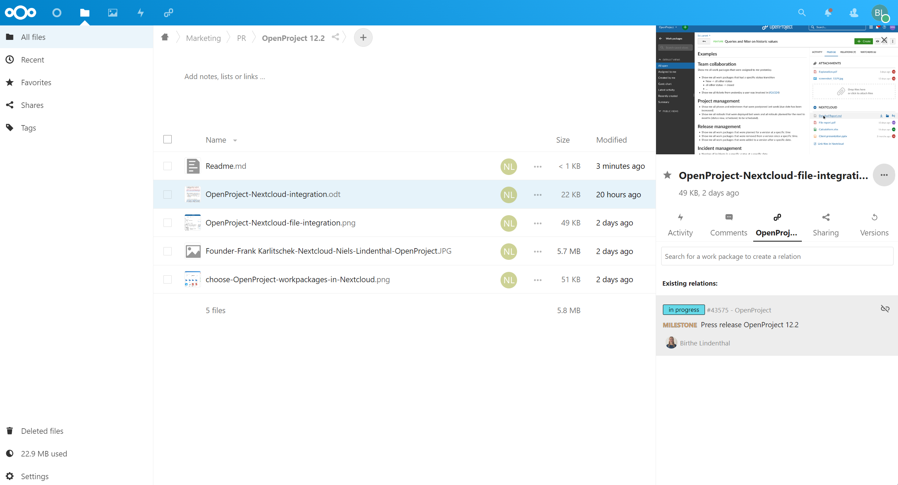
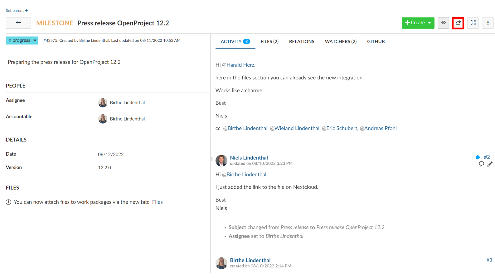

# OpenProject 12.2.0

Release date: 2022-08-15

We released [OpenProject 12.2.0](https://community.openproject.com/versions/1494).
This new release brings the long awaited **Nextcloud integration**. No more endless searching for files! With the new Nextcloud integration in OpenProject 12.2, you can easily find your project-related files directly in the respective work package and always have the correct version at your fingertips. Data sovereignty remain a strong common ground for both organizations and the integration fosters and strengthens collaboration between the two companies and improves the productivity of mutual users.

On top, this release launches **improvements of the date picker** as well as the possibility to **log time for other users**, and mark notifications as read also outside the notification center.

As always, the release contains many more improvements and bug fixes and we recommend updating to the newest version promptly.

## File management with Nextcloud

With OpenProject 12.2, you can now use Nextcloud, the world’s most-deployed on-premises content collaboration platform, together with OpenProject, the leading free and open source project management software, to combine project management and file management. Data sovereignty and open source are important core values to both OpenProject and Nextcloud, and form the foundational common ground for this integration.

After the first step of the development which brought the integration of OpenProject in the Nextcloud dashboard, we have now extended the functionality to link and display Nextcloud files in OpenProject. Consequently, the productivity of users of both platforms increases significantly. No more endless searching for files. In OpenProject, you can now find project-related files directly in the respective work package.

**In OpenProject:** In addition to listing files attached to a work package, the Files tab now also shows you Nextcloud files that are linked to the current work package. Secondary actions on each file allow you to directly **open or download the file, show the containing folder in Nextcloud or remove the link**.

**In Nextcloud:** You will be able to access the OpenProject tab in Nextcloud by accessing the details split screen of any file. In this tab, you will be able to search for the work package to which you would like to add a link. Once a work package is linked to a file, you can always unlink it by clicking on the **unlink** icon.

Further integration efforts are under way which include the linking of files from OpenProject, including complete project folders.

You can find out more [how to use the Nextcloud integration](../../user-guide/nextcloud-integration/) as well as the [how to setup the Nextcloud integration](../../system-admin-guide/integrations/nextcloud/) in our documentation.

## Alerts when scheduling related work packages

With the OpenProject 12.2 release, the team was working on **improving the date picker** to give you more clarity when scheduling work packages. To choose [automatic or manual scheduling mode](../../user-guide/gantt-chart/scheduling/), the selection box moved to the top of the date picker to be more visible. What is new is that you will now receive alerts about what you are doing and what impact it has on other work packages. We added warning banners that provide information when changing dates of a work package that has relations with other work packages. Both critical information that has bigger consequences to a project’s timeline as well as helpful (but not critical) information will be displayed. On top, you have the possibility to show the relations in the Gantt chart directly from the date picker.

If you are changing e.g. a date of a work package that is a predecessor of another one, you will receive the following warning that tells you that it will impact the schedule of other work packages. 

If you are trying to change a date of a parent work package which has been set to automatic scheduling, you will not be able to change the date and receive the following notification.

Find out more about how to set and change dates with the [improved date picker](../../user-guide/work-packages/set-change-dates/) in our documentation.

## Log time for other users

OpenProject 12.2 gives the administrator the possibility to grant permissions to log time for other users. With the required permissions, you can now select the team member you want to log time for, from the drop down.

## Improved navigation bar

When you open the project drop down from the header menu to view all projects, you are now also able to create new projects from there. Simply click on +Project.

The View all projects functionality can be found at the bottom of the drop down by clicking on *Projects list*.

## Mark notifications as read outside the Notifications Center

Also, in OpenProject 12.2 you are now able to mark notifications as read also in the work packages details view, outside of the Notification Center. Whenever you receive notifications, you can mark them as read also directly within the details view of your work package with the *Mark as read* button on the top right.

###  List of all bug fixes and changes

- Changed: Log time for other users \[[#21754](https://community.openproject.com/wp/21754)\]
- Changed: Send out an email reply if an incoming email could not be processed correctly \[[#35823](https://community.openproject.com/wp/35823)\]
- Changed: Make the empty notification inbox nicer \[[#40148](https://community.openproject.com/wp/40148)\]
- Changed: Show the project hierarchy in the project selector  \[[#40286](https://community.openproject.com/wp/40286)\]
- Changed: OAuth settings of Nextcloud in OpenProject \[[#40375](https://community.openproject.com/wp/40375)\]
- Changed: Unify Enterprise Edition pages \[[#40774](https://community.openproject.com/wp/40774)\]
- Changed: Keep cached file data up to date \[[#40892](https://community.openproject.com/wp/40892)\]
- Changed: Apply style changes to new date picker \[[#41814](https://community.openproject.com/wp/41814)\]
- Changed: List file links in Files tab \[[#41905](https://community.openproject.com/wp/41905)\]
- Changed: Navigation bar project selection \[[#41948](https://community.openproject.com/wp/41948)\]
- Changed: Date picker modal (without duration and non-working days) \[[#42047](https://community.openproject.com/wp/42047)\]
- Changed: Add packaged installation support for Ubuntu 22.04 \[[#42069](https://community.openproject.com/wp/42069)\]
- Changed: Show banner information in new date picker \[[#42184](https://community.openproject.com/wp/42184)\]
- Changed: Change date selection logic in new date picker \[[#42185](https://community.openproject.com/wp/42185)\]
- Changed: Link to digital accessiblity statement from ADDITIONAL RESOURCES \[[#42298](https://community.openproject.com/wp/42298)\]
- Changed: New attachments style on the work package creation form \[[#42369](https://community.openproject.com/wp/42369)\]
- Changed: Enable feature flags by default in the development environment \[[#42414](https://community.openproject.com/wp/42414)\]
- Changed: Enable feature flag for storages module on pull preview \[[#42628](https://community.openproject.com/wp/42628)\]
- Changed: Map available icons in the files list to relevant file types (in attachments/Nextcloud links) \[[#42884](https://community.openproject.com/wp/42884)\]
- Changed: Include work package for which relations are shown when following the "show relations" link \[[#42898](https://community.openproject.com/wp/42898)\]
- Changed: Access project dropdown entries via arrow keys \[[#43118](https://community.openproject.com/wp/43118)\]
- Changed: Show alert when storage is not added to any project \[[#43185](https://community.openproject.com/wp/43185)\]
- Changed: Update NEW FEATURES teaser block on application start page \[[#43485](https://community.openproject.com/wp/43485)\]
- Changed: Persist OpenProject notifications to avoid loss of information \[[#43518](https://community.openproject.com/wp/43518)\]
- Fixed: Circular dependency can be created \[[#34928](https://community.openproject.com/wp/34928)\]
- Fixed: Sorting via "projects" doesn't work \[[#37149](https://community.openproject.com/wp/37149)\]
- Fixed: Quick-add menu not showing on smaller screens \[[#37539](https://community.openproject.com/wp/37539)\]
- Fixed: Default status is shown multiple times in new board \[[#40858](https://community.openproject.com/wp/40858)\]
- Fixed: "expected at least one error" - Work package errors in dependent work packages not displayed \[[#40921](https://community.openproject.com/wp/40921)\]
- Fixed: Openproject docker installation uses port 3000 as the outward-facing port but documentation says 8080 \[[#41287](https://community.openproject.com/wp/41287)\]
- Fixed: Deleted users are not properly anonymized in tagged messages \[[#41499](https://community.openproject.com/wp/41499)\]
- Fixed: Cannot inline-create a work package on views that filter by WP ID \[[#41667](https://community.openproject.com/wp/41667)\]
- Fixed: In team planner and calendar, the sidebar should not use the word "views" \[[#41830](https://community.openproject.com/wp/41830)\]
- Fixed: Distances in work package details tabs inconsistent \[[#41845](https://community.openproject.com/wp/41845)\]
- Fixed: Blank Email reminders page when creating account manually \[[#41851](https://community.openproject.com/wp/41851)\]
- Fixed: Cannot add attachment to existing comment \[[#41940](https://community.openproject.com/wp/41940)\]
- Fixed: Closed cards in the team planner behave strangely \[[#42413](https://community.openproject.com/wp/42413)\]
- Fixed: Project appearing twice in Dropdown List if Project Member has two or more roles \[[#42477](https://community.openproject.com/wp/42477)\]
- Fixed: Date picker gets cut when there is no scroll \[[#42748](https://community.openproject.com/wp/42748)\]
- Fixed: Packager builds failing since gem bump \[[#42871](https://community.openproject.com/wp/42871)\]
- Fixed: Custom action button in combination with parallel changes leads to conflicting modification error \[[#42878](https://community.openproject.com/wp/42878)\]
- Fixed: Attachments are assigned to the wrong Work Package \[[#42933](https://community.openproject.com/wp/42933)\]
- Fixed: Navigation Link Not Working \[[#42984](https://community.openproject.com/wp/42984)\]
- Fixed: Unable to create child work package \[[#42988](https://community.openproject.com/wp/42988)\]
- Fixed: Size of dropdowns in work-package list too small especially for project hierarchy \[[#43083](https://community.openproject.com/wp/43083)\]
- Fixed: Internal server error when navigating to the work package module (page size) \[[#43120](https://community.openproject.com/wp/43120)\]
- Fixed: webhook is not working \[[#43129](https://community.openproject.com/wp/43129)\]
- Fixed: Split screen persistent with empty state switching toggle from All to Unread \[[#43146](https://community.openproject.com/wp/43146)\]
- Fixed: Missing plural in user settings -> access tokens \[[#43151](https://community.openproject.com/wp/43151)\]
- Fixed: Fix storage admin breadcrumbs \[[#43153](https://community.openproject.com/wp/43153)\]
- Fixed: Two English language \[[#43192](https://community.openproject.com/wp/43192)\]
- Fixed: Remove OAuth cookie after successful authorization against Nextcloud \[[#43193](https://community.openproject.com/wp/43193)\]
- Fixed: Project export confusingly uses "Work packages export limit" setting \[[#43202](https://community.openproject.com/wp/43202)\]
- Fixed: Mobile: The right margin for the files list is not correct \[[#43207](https://community.openproject.com/wp/43207)\]
- Fixed: Double click to open work packages in the Team Planner \[[#43222](https://community.openproject.com/wp/43222)\]
- Fixed: Able to set a follower starting before its predecessor \[[#43223](https://community.openproject.com/wp/43223)\]
- Fixed: Migration::MigrationUtils::PermissionAdder.add not idempotent \[[#43231](https://community.openproject.com/wp/43231)\]
- Fixed: imap ssl settings are evaluated as booleans when they are strings \[[#43237](https://community.openproject.com/wp/43237)\]
- Fixed: Work Package Releation entry not styling type properly \[[#43239](https://community.openproject.com/wp/43239)\]
- Fixed: Work packages in Gantt chart in light grey hard to see \[[#43240](https://community.openproject.com/wp/43240)\]
- Fixed: Work package types with colour white are not visible in emails \[[#43247](https://community.openproject.com/wp/43247)\]
- Fixed: Can not find users with the user creation/invitation form  \[[#43257](https://community.openproject.com/wp/43257)\]
- Fixed: The list style in the "Nextcloud" section is not correct \[[#43259](https://community.openproject.com/wp/43259)\]
- Fixed: Remove hover effect on files list when there is a connection error to Nextcloud \[[#43260](https://community.openproject.com/wp/43260)\]
- Fixed: The space between the form and the buttons on the 2nd and 3rd step of Nextcloud OAuth settings is not correct \[[#43263](https://community.openproject.com/wp/43263)\]
- Fixed: Can not access the main actions on work package on mobile from the details view \[[#43296](https://community.openproject.com/wp/43296)\]
- Fixed: Mobile: The right margin for activity comments is not correct \[[#43304](https://community.openproject.com/wp/43304)\]
- Fixed: Wrong positioning of workers in notification \[[#43306](https://community.openproject.com/wp/43306)\]
- Fixed: (Mobile) Clicking on notification row does not scroll to activity \[[#43311](https://community.openproject.com/wp/43311)\]
- Fixed: Project name overflows header on mobile  \[[#43314](https://community.openproject.com/wp/43314)\]
- Fixed: Info boxes in the Administration are not shown correctly \[[#43320](https://community.openproject.com/wp/43320)\]
- Fixed: Nextcloud: Validation error in New storage - Host field \[[#43323](https://community.openproject.com/wp/43323)\]
- Fixed: Project field limited to 30 items \[[#43386](https://community.openproject.com/wp/43386)\]
- Fixed: Start date automatically entered by default on new work packages \[[#43429](https://community.openproject.com/wp/43429)\]
- Fixed: There is no empty status in the Project Select when search criteria is not met \[[#43479](https://community.openproject.com/wp/43479)\]
- Fixed: Focus status on the Project Selector has no background \[[#43482](https://community.openproject.com/wp/43482)\]
- Fixed: Invalid link/href returned by API \[[#43486](https://community.openproject.com/wp/43486)\]
- Fixed: Show better error for dependent result for StoragesController Create action \[[#43487](https://community.openproject.com/wp/43487)\]
- Fixed: Date picker not working as expected for UTC time hour minus \[[#43504](https://community.openproject.com/wp/43504)\]
- Fixed: "No SSL" option in packaged installation of 12.2 does not work \[[#43530](https://community.openproject.com/wp/43530)\]
- Fixed: Focus and selection different for project selection component \[[#43544](https://community.openproject.com/wp/43544)\]
- Fixed: First greyed out item is selected in project dropdown \[[#43545](https://community.openproject.com/wp/43545)\]
- Fixed: Time entry widget column translations missing \[[#43558](https://community.openproject.com/wp/43558)\]
- Fixed: Disable LDAP user status synchronization by default \[[#43561](https://community.openproject.com/wp/43561)\]
- Fixed: Datepicker jumps with negative time zone \[[#43562](https://community.openproject.com/wp/43562)\]
- Epic: Files tab that shows linked files in Nextcloud \[[#40203](https://community.openproject.com/wp/40203)\]
- Epic: Settings connection between Nextcloud and OpenProject (OAuth) \[[#42072](https://community.openproject.com/wp/42072)\]

#### Contributions
A big thanks to community members for reporting bugs and helping us identifying and providing fixes.

- Special thanks for City of Cologne and University of Duisburg-Essen for sponsoring the development of the Nextcloud integration.
- Special thanks for reporting and finding bugs go to kak tux, Karl Sebera, Christina Vechkanova, Ulrich Germann, Kiran Kafle, Alexander Seitz, Max Chen, PD Inc Support, Rince wind, Simon Rohart, Sander Kleijwegt, Sreekanth Gopalakris.
- A big thank you to every other dedicated user who has [reported bugs](../../development/report-a-bug) and supported the community by asking and answering questions in the [forum](https://community.openproject.org/projects/openproject/boards).
- A big thank you to all the dedicated users who provided translations on [CrowdIn](https://crowdin.com/projects/opf).
