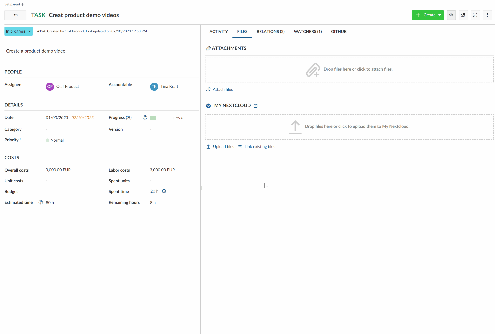
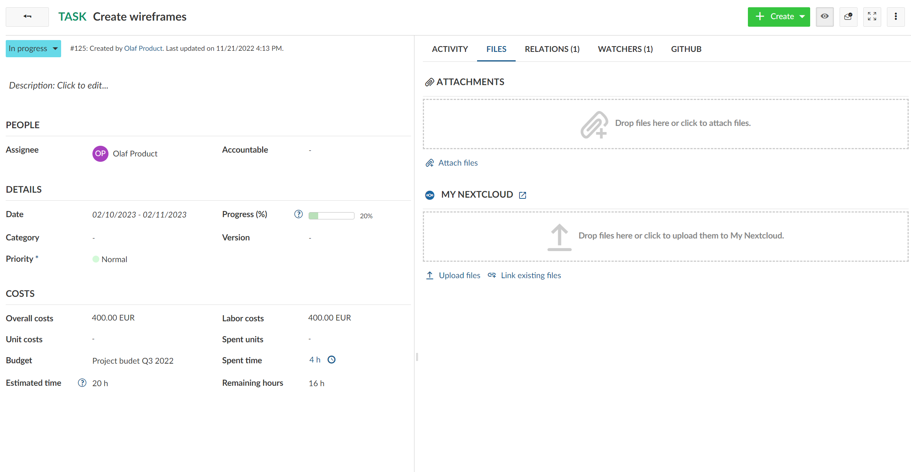
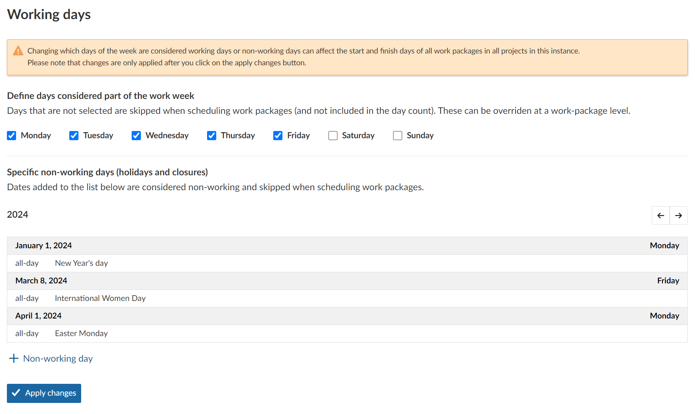
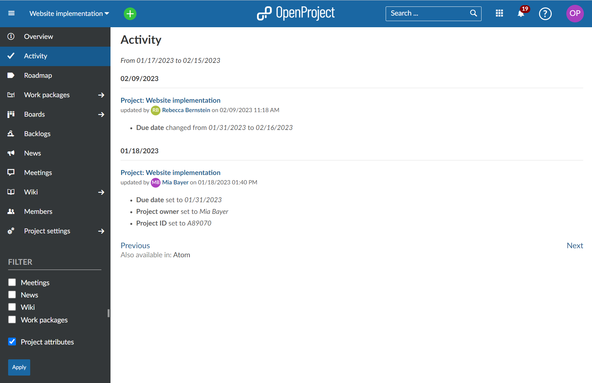
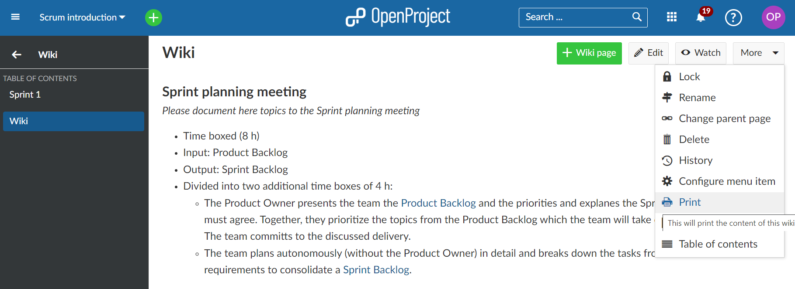

# OpenProject 12.5.0

Release date: 2023-03-20

We released [OpenProject 12.5.0](https://community.openproject.com/versions/1611).
This new release is again packed with many new collaboration features, improvements and bug fixes.
The release will bring the anticipated collaboration features for the **Nextcloud integration to the OpenProject side**. Nextcloud and OpenProject now offer mutual customers a way to manage their projects and share files seamlessly and without disruption.

Moreover, with OpenProject 12.5, the system administrator can **set additional non-working days** on an instance level, such as public holidays. Also, we are happy to **publish another Enterprise add-on**: The Advanced search functionality not only supports full text search but also enables users to search for work package attachments or content. It is now a part of the free-of-charge Community version.

## Upload files to Nextcloud while working in OpenProject

OpenProject 12.5 launches the next step for the OpenProject and Nextcloud integration. It is now possible to upload new files and link them directly from a work package in OpenProject to your Nextcloud file storage. The close connection of work packages with project-related files combines the advantages of both open source systems.

Different use cases are covered for uploading and linking files directly from within a work package.

### Link an existing Nextcloud file or folder to an OpenProject work package

If you want to link an existing project related file or folder from Nextcloud to an OpenProject work package, you can now do it directly within the work package in OpenProject.

To do so, start by clicking on **Link existing file** underneath the My Nextcloud files box.

### New file picker in OpenProject

A new file picker will appear, displaying all the files and folders on your Nextcloud instance that you have permission to see. You choose the respective file or folder from Nextcloud via the file picker.

To link a certain file or folder with this work package, click on the checkbox to the left of each item. Once you have selected the file(s) or folder(s) you wish to link to the work package, click on the **Link files** button. The number on the button will represent the number of files/folders you have selected.

### Upload a new file while working in OpenProject

It is now possible to upload a new file from your device directly to Nextcloud from within an OpenProject work package.

In this case, the file you want to link has not yet been uploaded to Nextcloud. Hence, click on the **Upload files** link. You will then be prompted to select a file (or multiple files) on your computer that you want to upload to Nextcloud.

Alternatively, you can also simply drag a file or folder on your computer to this area (under the name of your Nextcloud file storage) and drop it in the drop zone that appears.

Once you have selected or dropped the files you would like to upload, you will need to select a folder on Nextcloud to which they should be stored.

To save the files you uploaded to the currently folder in Nextcloud, click on the **Choose location** button.

### Upload files during creation of a new work package

If you create a new work package in OpenProject and want to add a file to the work package, you can now upload or link files from Nextcloud directly.

Thereby, it gives you two options on the Files tab: Upload a new file or link an existing file from Nextcloud, as described above.

### More options for linked Nextcloud files in an OpenProject work package

The **Files** tab shows you Nextcloud files that are linked to the current work package. Hovering on any linked file with your mouse will give you options to open or download the file, show the containing folder in Nextcloud or remove the link.

Please note: Removing the link from within a work package in OpenProject will not delete the file or folder in Nextcloud. Uploading a new file with the same name will ask you to either overwrite the existing one in Nextcloud or create an additional copy next to it.

## Setting public holidays as non-working days

In OpenProject you can define working days and non-working days of the week. At an instance level you set which days of the week are considered working days.

With OpenProject 12.5 you can now add additional non-working days to take into account e.g. public holidays or other days in your organization that nobody works on. Consequently, work packages cannot end or start on these dates and these days do not count towards the duration of a work package.

**Please note**: These additional non-working days will be set instance-wide, for all projects. And need to be set for every year, e.g. Christmas day has to be set for 2023, 2024 etc. if applicable. If you add additional non-working days, you will be asked if a re-scheduling of work packages should be done.

## Track project changes

From OpenProject 12.5 the Activity view will now include the tracking of changes of project attributes and project custom fields. You can directly open the project activity view from the Project list by clicking on the extended menu of a project and then choosing project activity.

Also, you can see the project activity in your Activity module within a project and filter for the required information.

## New default filter for overdue work packages

We added a default filter **Overdue** in the work package list so that you can quickly see which of your work packages are overdue and need your attention.

## Printing Wikis

If you want to print your Wiki, with OpenProject 12.5 you can now do so. A print function has been added to the **More** menu at the top right in your Wiki.

## Advanced search for work package attachment or content for the Community

With OpenProject 12.5, we are happy to announce that another Enterprise add-on was released for the free-of-charge Community version. The advanced filters enable not only full text search but also to [filter and search for work packages attachments and content of the attachments](../user-guide/work-packages/work-package-table-configuration#filter-for-attachment-file-name-and-content).

## Further improvements, changes, and bug fixes

- Extend the data model and the API to save and query historic values of work packages as a foundation for baseline comparisons.
- The default work package filter “Latest Activity” also includes rejected, closed and on hold work packages.
- Archive projects can now be done by non-admins.
- The number of GitHub pull requests will be shown on the work package tab.

### List of all bug fixes and changes

- Changed: Archive project via project settings by non admins \[[#3897](https://community.openproject.com/wp/3897)\]
- Changed: Change filter for default view: Latest activity \[[#29086](https://community.openproject.com/wp/29086)\]
- Changed: Work packages: Add finish date filter with additional overdue task check \[[#37145](https://community.openproject.com/wp/37145)\]
- Changed: Add print menu item to context menu of a wiki page \[[#37851](https://community.openproject.com/wp/37851)\]
- Changed: Update the list of operators available when filtering using multi-select attributes \[[#42012](https://community.openproject.com/wp/42012)\]
- Changed: Standardise date pickers outside of the main work package date field \[[#42358](https://community.openproject.com/wp/42358)\]
- Changed: Include nextcloud and attachments empty status drag and drop area \[[#43576](https://community.openproject.com/wp/43576)\]
- Changed: Make attachment lists and file link lists drop zones \[[#43577](https://community.openproject.com/wp/43577)\]
- Changed: Upload or link Nextcloud files from within the work package creation form \[[#43578](https://community.openproject.com/wp/43578)\]
- Changed: File picker \[[#43654](https://community.openproject.com/wp/43654)\]
- Changed: Location picker \[[#43655](https://community.openproject.com/wp/43655)\]
- Changed: Upload files to Nextcloud from within OpenProject \[[#43656](https://community.openproject.com/wp/43656)\]
- Changed: Link existing Nextcloud files from within OpenProject \[[#43657](https://community.openproject.com/wp/43657)\]
- Changed: [wiki] Be able to link work-package views \[[#43913](https://community.openproject.com/wp/43913)\]
- Changed: Helm charts for OpenProject \[[#44360](https://community.openproject.com/wp/44360)\]
- Changed: Show number of pull requests in the tab header \[[#44820](https://community.openproject.com/wp/44820)\]
- Changed: Remove hint that files have moved to the Files tab \[[#44902](https://community.openproject.com/wp/44902)\]
- Changed: Update text for empty Notification center \[[#44910](https://community.openproject.com/wp/44910)\]
- Changed: Keep state of Activity tab when switching forth and back to another tab \[[#45060](https://community.openproject.com/wp/45060)\]
- Changed: Update styling of User Activity \[[#45344](https://community.openproject.com/wp/45344)\]
- Changed: Update styling of detailed work package macro \[[#45455](https://community.openproject.com/wp/45455)\]
- Changed: Provide meaningful help when upload to Nextcloud fails due to file size \[[#45938](https://community.openproject.com/wp/45938)\]
- Changed: Remove Select All and Open Storage interaction elements from file pickers \[[#45963](https://community.openproject.com/wp/45963)\]
- Changed:  Update NEW FEATURES teaser block on application start page \[[#45991](https://community.openproject.com/wp/45991)\]
- Changed: Update labels for project activity filters \[[#46123](https://community.openproject.com/wp/46123)\]
- Changed: Update date picker and associated components to use current theme colours \[[#46171](https://community.openproject.com/wp/46171)\]
- Changed: Hide previous and next month days in single datepicker \[[#46189](https://community.openproject.com/wp/46189)\]
- Changed: Accessibility for the new date pickers \[[#46211](https://community.openproject.com/wp/46211)\]
- Changed: Basic drop-down date picker for date fields that are already input fields \[[#46236](https://community.openproject.com/wp/46236)\]
- Changed: Datepicker: Update colours of mini calendar so non-working days are visible in all modes \[[#46237](https://community.openproject.com/wp/46237)\]
- Changed: Resolve conflict with files with the same name when upload \[[#46254](https://community.openproject.com/wp/46254)\]
- Changed: Release "Advanced filters" from Enterprise to Community \[[#46797](https://community.openproject.com/wp/46797)\]
- Changed: Use native date fields on basic single and range datepickers \[[#46814](https://community.openproject.com/wp/46814)\]
- Fixed: Misleading warning message when closing meeting agenda \[[#34533](https://community.openproject.com/wp/34533)\]
- Fixed: Confirmation message in previous language when changing language in My Account \[[#34594](https://community.openproject.com/wp/34594)\]
- Fixed: External auth providers treated as self registration \[[#42390](https://community.openproject.com/wp/42390)\]
- Fixed: WP Table View is scrolling itself when changing attributes \[[#42989](https://community.openproject.com/wp/42989)\]
- Fixed: Backlog error \[[#43225](https://community.openproject.com/wp/43225)\]
- Fixed: [AppSignal] incompatible character encodings: ASCII-8BIT and UTF-8 \[[#43898](https://community.openproject.com/wp/43898)\]
- Fixed: Notification center sometimes displays the activity log of the wrong work package in split screen \[[#44198](https://community.openproject.com/wp/44198)\]
- Fixed: File picker modal height changes when navigating the file structure \[[#44917](https://community.openproject.com/wp/44917)\]
- Fixed: Different font weight for date alert settings compared to other notification settings \[[#44959](https://community.openproject.com/wp/44959)\]
- Fixed: Concept and navigation changes on the file picker modal \[[#44965](https://community.openproject.com/wp/44965)\]
- Fixed: File picker: Directories with spaces don't load correctly \[[#44973](https://community.openproject.com/wp/44973)\]
- Fixed: Avatar blinking on team planner \[[#44992](https://community.openproject.com/wp/44992)\]
- Fixed: Missing images in Netxtcloud integration user guide \[[#45240](https://community.openproject.com/wp/45240)\]
- Fixed: WP-Grid does not highlight cards when initially loading \[[#45451](https://community.openproject.com/wp/45451)\]
- Fixed: WP-Table highlighting configuration misses all attributes highlighted hint \[[#45453](https://community.openproject.com/wp/45453)\]
- Fixed: WP-Grid does not align assignee avatar and dates over columns \[[#45454](https://community.openproject.com/wp/45454)\]
- Fixed: Confusing message that user was deleted, even though they will be locked and deleted asynchronously \[[#45459](https://community.openproject.com/wp/45459)\]
- Fixed: bundle install on current "dev" HEAD \[[#45489](https://community.openproject.com/wp/45489)\]
- Fixed: Too much spacing between the label and help text button \[[#45561](https://community.openproject.com/wp/45561)\]
- Fixed: Work package view layout breaks with long 'text' custom field values \[[#45566](https://community.openproject.com/wp/45566)\]
- Fixed: When TOTP fails due to clock skew, error is not easily discoverable \[[#45586](https://community.openproject.com/wp/45586)\]
- Fixed: Notifications not sent for new work packages when creating project from template \[[#45701](https://community.openproject.com/wp/45701)\]
- Fixed: Hover effect blue color is missing for NC empty drag and drop area \[[#45708](https://community.openproject.com/wp/45708)\]
- Fixed: Edit Time-Entries from Widget "VERBUCHTE ZEIT (LETZTE 7 TAGE)" doesn't work \[[#45742](https://community.openproject.com/wp/45742)\]
- Fixed: Uncaught (in promise): ReferenceError: toggle_disabled_state is not defined \[[#45766](https://community.openproject.com/wp/45766)\]
- Fixed: OIDC post_logout_redirect_uri does not work \[[#45775](https://community.openproject.com/wp/45775)\]
- Fixed: Project list dropdown actions cut-off \[[#45827](https://community.openproject.com/wp/45827)\]
- Fixed: Unnecessary comma in the text when there are no file storages set up for a project \[[#45858](https://community.openproject.com/wp/45858)\]
- Fixed: Erroneous behavior on Notification center page when there are +99 notifications and we mark all as read \[[#45912](https://community.openproject.com/wp/45912)\]
- Fixed: Remove unnecessary title attributes from list items in file and location picker modals \[[#45947](https://community.openproject.com/wp/45947)\]
- Fixed: Tool tips for list items not perceivable as such  \[[#45956](https://community.openproject.com/wp/45956)\]
- Fixed: Switching to manual scheduling does not make dates in the calendar selectable  \[[#45962](https://community.openproject.com/wp/45962)\]
- Fixed: Use Primary/Main colour for folder file type and storage icons \[[#45964](https://community.openproject.com/wp/45964)\]
- Fixed: Setting definitions validations access nonloaded constants \[[#45965](https://community.openproject.com/wp/45965)\]
- Fixed: When several users are mentioned via @, not all users receive notification \[[#45999](https://community.openproject.com/wp/45999)\]
- Fixed: Missing translation for error message when multiple files are dragged and dropped \[[#46009](https://community.openproject.com/wp/46009)\]
- Fixed: There is no empty status for empty folders \[[#46057](https://community.openproject.com/wp/46057)\]
- Fixed: English language displayed multiple times in available languages \[[#46067](https://community.openproject.com/wp/46067)\]
- Fixed: Adding new type to lot of projects with custom fields times out \[[#46118](https://community.openproject.com/wp/46118)\]
- Fixed: Bottom round corners on the modal are not rounded \[[#46144](https://community.openproject.com/wp/46144)\]
- Fixed: Loading animation not centred on mobile \[[#46148](https://community.openproject.com/wp/46148)\]
- Fixed: Standard date picker small regression issues \[[#46156](https://community.openproject.com/wp/46156)\]
- Fixed: Date picker on Non-working days: not enough spacing between the date field and the calendar + arrows \[[#46159](https://community.openproject.com/wp/46159)\]
- Fixed: White space added to page when datepicker opens to bottom \[[#46164](https://community.openproject.com/wp/46164)\]
- Fixed: "Create new account" modal does no longer have the scrollbar so Create button is not entirely visible \[[#46172](https://community.openproject.com/wp/46172)\]
- Fixed: [AppSignal] "No route matches" error in projects/identifier controller \[[#46176](https://community.openproject.com/wp/46176)\]
- Fixed: Errors on Buy now teaser vs. Manage subscription button \[[#46204](https://community.openproject.com/wp/46204)\]
- Fixed: Fix hover effect on days in the new date picker \[[#46221](https://community.openproject.com/wp/46221)\]
- Fixed: Wrong hover color on month selector arrow in new date picker \[[#46228](https://community.openproject.com/wp/46228)\]
- Fixed: Error on filtering of work packages \[[#46249](https://community.openproject.com/wp/46249)\]
- Fixed: Activities are not Listing \[[#46278](https://community.openproject.com/wp/46278)\]
- Fixed: Wrong text references in the non working days admin page \[[#46305](https://community.openproject.com/wp/46305)\]
- Fixed: Backlogs: Default export card configuration invalid and page does not show up \[[#46308](https://community.openproject.com/wp/46308)\]
- Fixed: Login back URL not working correctly for notification details \[[#46348](https://community.openproject.com/wp/46348)\]
- Fixed: Project filter "Created on" not accessible for all users \[[#46350](https://community.openproject.com/wp/46350)\]
- Fixed: Wiki: Anchor or chain URL incorrect \[[#46351](https://community.openproject.com/wp/46351)\]
- Fixed: date picker: selected dates in mini calendar don't have a hover (primary dark) \[[#46436](https://community.openproject.com/wp/46436)\]
- Fixed: Gateway timeout when copying work package with many descendants \[[#46476](https://community.openproject.com/wp/46476)\]
- Fixed: Project filter in work package form configuration allows no typeahead  \[[#46477](https://community.openproject.com/wp/46477)\]
- Fixed: inconsistent modals on iOS \[[#46495](https://community.openproject.com/wp/46495)\]
- Fixed: Date picker: Left border of the selected date cut off when in first column \[[#46648](https://community.openproject.com/wp/46648)\]
- Fixed: Dropdown menu three dots without long texts \[[#46652](https://community.openproject.com/wp/46652)\]
- Fixed: manual scheduling is not retained when reopening the date picker in a milestone. \[[#46721](https://community.openproject.com/wp/46721)\]
- Fixed: Toggling working days in milestone enables previously disabled related dates \[[#46789](https://community.openproject.com/wp/46789)\]
- Epic: Instance-wide public holidays (non-working days) \[[#41226](https://community.openproject.com/wp/41226)\]
- Epic: Add and remove links to files in Nextcloud in the work packages details view   \[[#41351](https://community.openproject.com/wp/41351)\]
- Epic: Show changes of project attributes in project activity view \[[#43852](https://community.openproject.com/wp/43852)\]
- Epic: Cross-application main menu for dPhoenixSuite/Sovereign Administrative Work Place  \[[#44297](https://community.openproject.com/wp/44297)\]

#### Credits and contributions
A very special thank you goes to the following sponsors for features and improvements of this release:

- **The City of Cologne** for having sponsored the feature of tracking project activities.
- **Autoliv** for having sponsored the API changes, i.e. extending the data model and the API to save and query historic values of work packages as a foundation for the upcoming baseline comparisons.

A very big thank you to M V, Sven Kunze, Rince wind, Christina Vechkanova, Johannes Frenck, Marc Burk, Jörg Nold, Nidhin Manoharan, Jörg Mollowitz, Benjamin Rönnau, Harald Herz for finding and reporting bugs.
