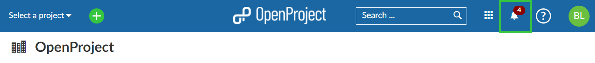
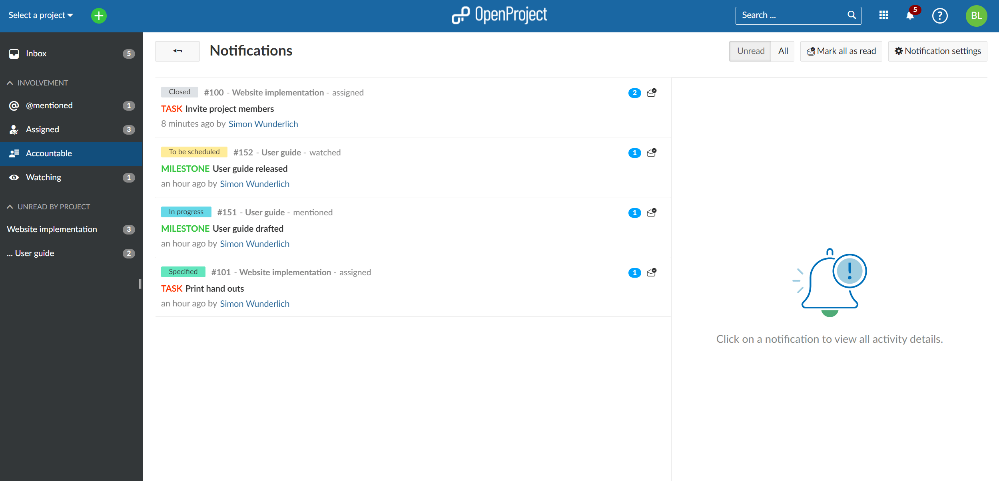
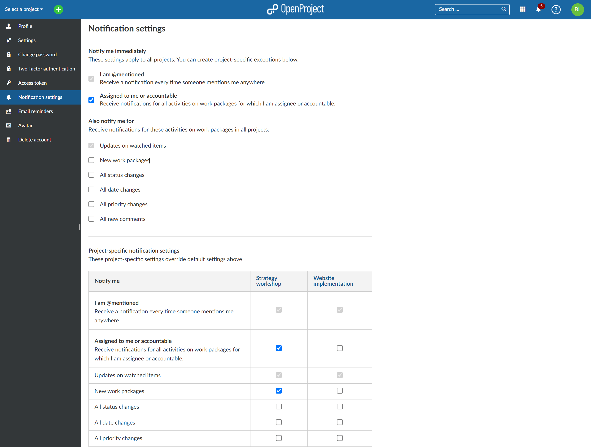
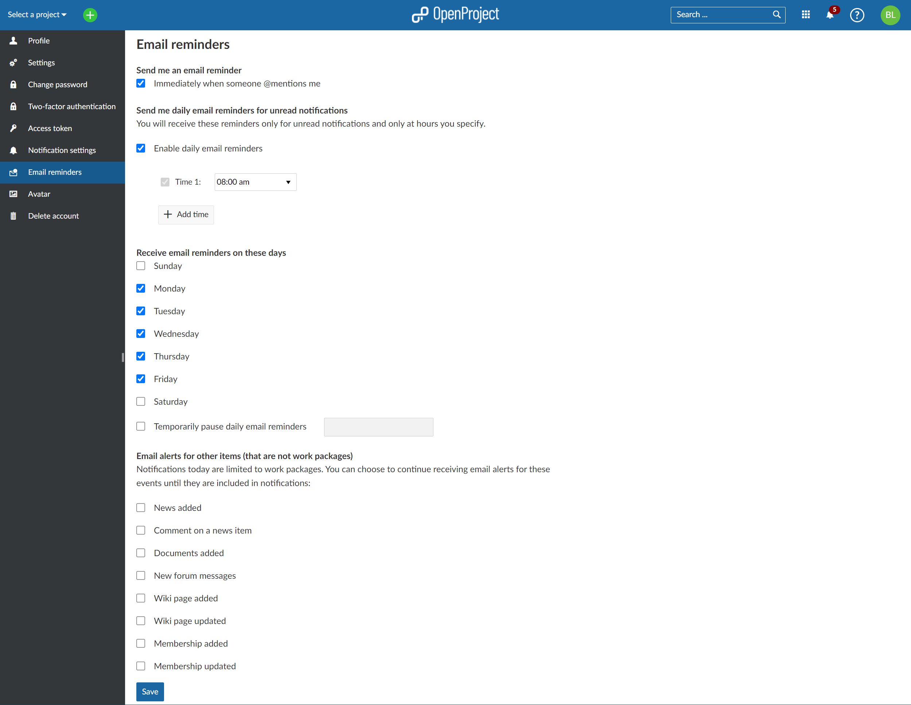
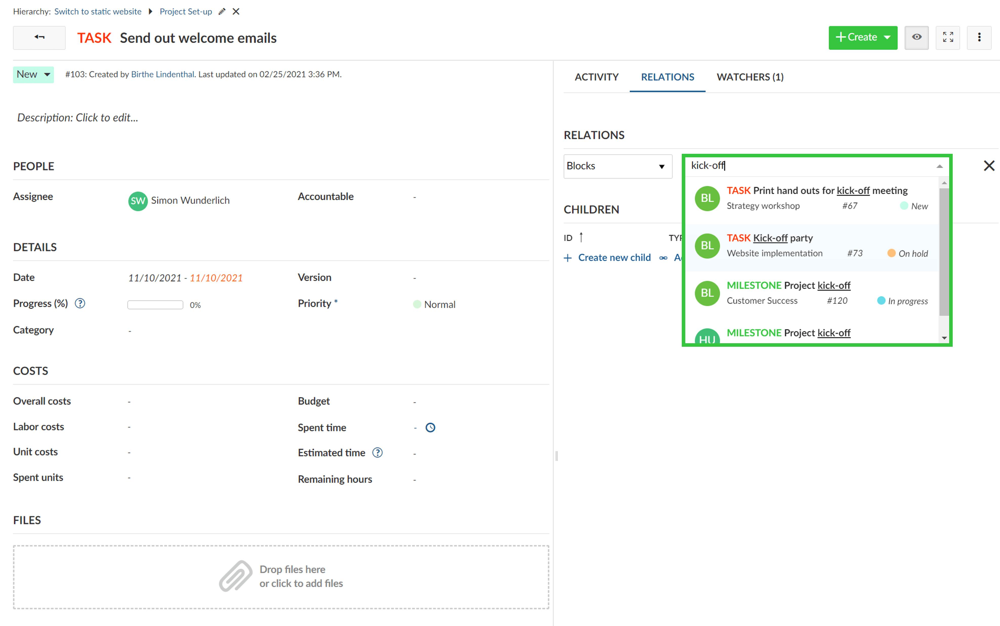
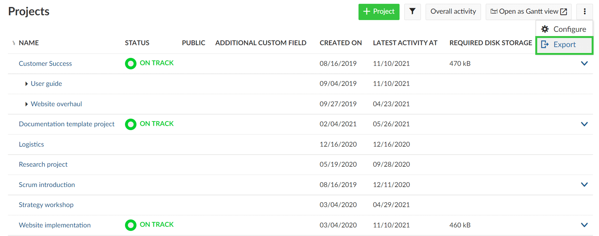
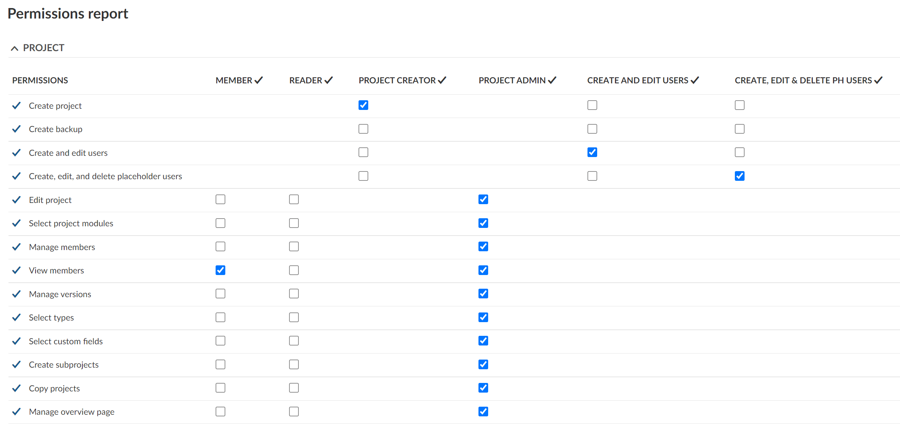

# OpenProject 12.0.0

Release date: 2021-11-15

We released [OpenProject 12.0.0](https://community.openproject.org/versions/1478).
This release will change the way how you work with OpenProject. We have introduced the concept of in-app notifications. A new notification center in OpenProject will display changes in your projects directly in the application. This reduces the flood of emails in your inbox significantly. Additionally, you can add daily email summaries to keep up to date about latest updates and changes.

## Introducing in-app notifications

The new in-app notifications let you never miss a change in your projects again. Now, you receive all important updates directly in the application and don’t get a flood of emails in your inbox anymore. The new bell symbol in the header navigation displays the number of unread notifications.

Go to our user guide to find out how to [configure in-app notifications](../../../user-guide/notifications/).

> **Info:** Please note that starting with version 12.0, OpenProject will no longer send individual emails for each notification. You can view your notifications via the new [Notification center](../../../user-guide/notifications/#access-in-app-notifications). You can however still choose to receive daily [email reminders](../../../user-guide/my-account/#email-reminders) at specific times of the day that you can configure.

## Notification center

The new Notification center shows all notifications about changes within your projects, including intuitive filter options in the menu on the left, e.g. by reason for notification or by projects. Clicking on the notification will open the details of a work package. you can directly edit it in a split view. The blue elliptical indicates the number of unread notifications about changes within one work package.

## Improved notification settings

The improved notification settings now allow to fine-tune for which actions and in which projects you want to receive a notification. With 12.0 you can now even add project-specific settings for changes you want to be notified about and override the default settings.

## Email summaries

In addition to the in-app notifications, also email reminders can be configured to receive important updates in a daily (or more often) email summary. These email reminders can be configured to receive also additional notifications about changes in your projects, e.g. new or updated memberships in a project.

## Improved work packages auto-completer

The work package auto-completer for relations now also shows additional information (project name, status, …). It is now much easier to identify the respective work package.

## Export of the project list

With OpenProject 12.0 it is now possible to export the project list with all project specific information, incl. project custom fields. You can choose between the formats XLS and CSV export.

## Change of roles and permissions settings

With 12.0 we have added more granular rights for projects, for example the additional right to configure the project overview page. This way you can even better assign certain permissions to a role in a project.

## Drop official support for PostgreSQL < 13

OpenProject 12.0 will deprecate PostgreSQL versions < 13. This will result in a warning about the necessary migration to inform users trying to upgrade with an older version. The warning will be shown on startup and on the Administration > Info page. It will not result in a hard error for now.

## All bug fixes and changes in 12.0

- Changed: Send daily email summaries (email digest) \[[#1899](https://community.openproject.org/wp/1899)\]
- Changed: Allow author to mute email notification by making him a watcher \[[#27706](https://community.openproject.org/wp/27706)\]
- Changed: Remove custom fields for "Work package priorities" and "Document categories" \[[#29419](https://community.openproject.org/wp/29419)\]
- Changed: Allow downloading IFC models \[[#35272](https://community.openproject.org/wp/35272)\]
- Changed: Show additional information (project name, status, ...) in work package auto completers \[[#35635](https://community.openproject.org/wp/35635)\]
- Changed: Change content of Project member invitation email \[[#36175](https://community.openproject.org/wp/36175)\]
- Changed: Dynamic form: Flat model structure (_links) \[[#37472](https://community.openproject.org/wp/37472)\]
- Changed: Disable author becoming watcher on project copy \[[#37799](https://community.openproject.org/wp/37799)\]
- Changed: Remove option to get notified about changes that I make myself \[[#37824](https://community.openproject.org/wp/37824)\]
- Changed: [IAN center] Make In App Notification Center responsive to mobile sizes \[[#37870](https://community.openproject.org/wp/37870)\]
- Changed: API v3 notifications api bulk confirming notifications \[[#37872](https://community.openproject.org/wp/37872)\]
- Changed: [IAN center] Clarify current magic limit of 250 items while we have no pagination \[[#37874](https://community.openproject.org/wp/37874)\]
- Changed: Automatically open the next notification after reading another notification \[[#38129](https://community.openproject.org/wp/38129)\]
- Changed: Grouping events by work package in notification dashboard \[[#38137](https://community.openproject.org/wp/38137)\]
- Changed: Link from notifications dashboard to personal notification settings \[[#38139](https://community.openproject.org/wp/38139)\]
- Changed: Create in-app notifications for the first event and not after the aggregation time of x minutes, \[[#38333](https://community.openproject.org/wp/38333)\]
- Changed: Work package type is missing in work package auto-completion \[[#38334](https://community.openproject.org/wp/38334)\]
- Changed: Show unread notifications in Activity tab \[[#38339](https://community.openproject.org/wp/38339)\]
- Changed: Work packages split view in notifications dashboard \[[#38340](https://community.openproject.org/wp/38340)\]
- Changed: New update notification reasons to better filter the relevant updates \[[#38341](https://community.openproject.org/wp/38341)\]
- Changed: Sidebar in Notification center with project filter \[[#38520](https://community.openproject.org/wp/38520)\]
- Changed: Re-name ordering settings in activity tab to "Oldest first/Newest first" \[[#38549](https://community.openproject.org/wp/38549)\]
- Changed: Notification main list view \[[#38592](https://community.openproject.org/wp/38592)\]
- Changed: Migration plan for new notification settings and call to action for user to use it \[[#38595](https://community.openproject.org/wp/38595)\]
- Changed: new images for renamed ordering settings to "Oldest first/Newest first" \[[#38605](https://community.openproject.org/wp/38605)\]
- Changed: Empty states in notification center \[[#38610](https://community.openproject.org/wp/38610)\]
- Changed: Involvement filters in the sidebar of notification center \[[#38642](https://community.openproject.org/wp/38642)\]
- Changed: Loading indicator when loading "all" notifications \[[#38648](https://community.openproject.org/wp/38648)\]
- Changed: New UI for notification row \[[#38650](https://community.openproject.org/wp/38650)\]
- Changed: Notification settings: account-level defaults \[[#38671](https://community.openproject.org/wp/38671)\]
- Changed: Email design - Daily Reminders \[[#38690](https://community.openproject.org/wp/38690)\]
- Changed: Email design - Mention email \[[#38692](https://community.openproject.org/wp/38692)\]
- Changed: Scroll to oldest unread activity in the activity tab \[[#38693](https://community.openproject.org/wp/38693)\]
- Changed: Email reminder settings (user account) \[[#38700](https://community.openproject.org/wp/38700)\]
- Changed: Highlight selected notification in the center \[[#38794](https://community.openproject.org/wp/38794)\]
- Changed: Separate between the reason "Assignee" and "Accountable" in notification row (mail and UI) \[[#38824](https://community.openproject.org/wp/38824)\]
- Changed: BCF API Comments Service \[[#38833](https://community.openproject.org/wp/38833)\]
- Changed: Show meaningful content on accessing non existing notifications/WorkPackage \[[#38842](https://community.openproject.org/wp/38842)\]
- Changed: Show banner when new notifications arrived while being in the notifications center \[[#38933](https://community.openproject.org/wp/38933)\]
- Changed: Consolidate details from notification row in reminder mail \[[#38948](https://community.openproject.org/wp/38948)\]
- Changed: Avoid sending member update notifications/mails upon copying a project if disabled \[[#39084](https://community.openproject.org/wp/39084)\]
- Changed: Optimize mobile view of Notification Center \[[#39148](https://community.openproject.org/wp/39148)\]
- Changed: Reset email footer \[[#39502](https://community.openproject.org/wp/39502)\]
- Changed: Send out email informing all users of the changes to the notification \[[#39607](https://community.openproject.org/wp/39607)\]
- Epic: In-app notifications \[[#26688](https://community.openproject.org/wp/26688)\]
- Fixed: Use CKEditor5 watchdog feature to prevent crashes from being unnoticeable \[[#32643](https://community.openproject.org/wp/32643)\]
- Fixed: Issue with check on length of Custom Fields \[[#34042](https://community.openproject.org/wp/34042)\]
- Fixed: Buttons on form configuration displayed on left instead of right side \[[#34288](https://community.openproject.org/wp/34288)\]
- Fixed: Spelling mistake in the Guided Tour \[[#34304](https://community.openproject.org/wp/34304)\]
- Fixed: Wording mistakes in Guided Tour \[[#34308](https://community.openproject.org/wp/34308)\]
- Fixed: Grammar mistake in Administration -> Webhooks \[[#34313](https://community.openproject.org/wp/34313)\]
- Fixed: Row break in status selector on cards after spaces \[[#34322](https://community.openproject.org/wp/34322)\]
- Fixed: Entering dates in Gantt chart fails when mouse leaves the row \[[#34453](https://community.openproject.org/wp/34453)\]
- Fixed: Wrong link to notification settings \[[#34591](https://community.openproject.org/wp/34591)\]
- Fixed: Dead links and unsuitable heading in Administration -> Plugins \[[#34825](https://community.openproject.org/wp/34825)\]
- Fixed: Wrong symbol (prohibition sign) when hovering over "Spent time" in the work packages details view \[[#34832](https://community.openproject.org/wp/34832)\]
- Fixed: meeting time is wrong for members in different time zone \[[#34901](https://community.openproject.org/wp/34901)\]
- Fixed: Grouping work package table by bool custom field fails \[[#34904](https://community.openproject.org/wp/34904)\]
- Fixed: Week number is wrong after November \[[#35095](https://community.openproject.org/wp/35095)\]
- Fixed: Highlighting in date picker still incorrect \[[#35107](https://community.openproject.org/wp/35107)\]
- Fixed: Error loading list on board (e.g. Status board) for users who don't have access to filtered projects \[[#35563](https://community.openproject.org/wp/35563)\]
- Fixed: Unnecessary requests (3 - 4 times too many) on loading the board    \[[#36236](https://community.openproject.org/wp/36236)\]
- Fixed: Boards list not ordered \[[#36277](https://community.openproject.org/wp/36277)\]
- Fixed: Can't delete old project: CostObject to Budget migration doesn't update journalable_type \[[#36411](https://community.openproject.org/wp/36411)\]
- Fixed: Users who are not allowed to see cost rates book unit costs at 0.00 \[[#37449](https://community.openproject.org/wp/37449)\]
- Fixed: Header is reintroduced in pdf export of cost report \[[#37451](https://community.openproject.org/wp/37451)\]
- Fixed: auth source SSO does not trigger authentication stages \[[#37553](https://community.openproject.org/wp/37553)\]
- Fixed: custom fields of type "list" for area "spent time" cant be edited \[[#37654](https://community.openproject.org/wp/37654)\]
- Fixed: Layout of search suggestions ugly on medium sized screens \[[#37666](https://community.openproject.org/wp/37666)\]
- Fixed: Layout for reset form configuration form broken \[[#37682](https://community.openproject.org/wp/37682)\]
- Fixed: My spent time widget configuration modal styling broken \[[#37705](https://community.openproject.org/wp/37705)\]
- Fixed: Error 439 then insert " in a search field \[[#37729](https://community.openproject.org/wp/37729)\]
- Fixed: Xeokit viewer crashes when slicing planes tool is active \[[#37765](https://community.openproject.org/wp/37765)\]
- Fixed: Work package in inconsistent state when deleting value already set to work package \[[#37775](https://community.openproject.org/wp/37775)\]
- Fixed: Error with Budget \[[#37859](https://community.openproject.org/wp/37859)\]
- Fixed: Missing cancel button on project create page prevents me from going back \[[#37938](https://community.openproject.org/wp/37938)\]
- Fixed: Pagination style is lost \[[#37939](https://community.openproject.org/wp/37939)\]
- Fixed: Migrations for 11.4.0 run very long \[[#37940](https://community.openproject.org/wp/37940)\]
- Fixed: Mouseover effect on column header in notification setting \[[#38022](https://community.openproject.org/wp/38022)\]
- Fixed: Work package with attachment is journaled before destruction \[[#38079](https://community.openproject.org/wp/38079)\]
- Fixed: Poor performance of work package table for work package with larger attachments \[[#38080](https://community.openproject.org/wp/38080)\]
- Fixed: Attachment webhook does not trigger for direct uploads \[[#38085](https://community.openproject.org/wp/38085)\]
- Fixed: Save button in editCostType form is too big \[[#38099](https://community.openproject.org/wp/38099)\]
- Fixed: Google logo in "login with Google" button is too big \[[#38106](https://community.openproject.org/wp/38106)\]
- Fixed: Link to Mail settings in notification settings wrong \[[#38110](https://community.openproject.org/wp/38110)\]
- Fixed: No "Today" option offered for start date when first setting start and finish date \[[#38121](https://community.openproject.org/wp/38121)\]
- Fixed: Wrong languages in daily email summaries \[[#38128](https://community.openproject.org/wp/38128)\]
- Fixed: Opening Author filter provokes barrage of /api/v3/principals requests -> 429 \[[#38140](https://community.openproject.org/wp/38140)\]
- Fixed: Can't fill in required custom fields when creating child work package \[[#38144](https://community.openproject.org/wp/38144)\]
- Fixed: Style regressions in the top menu bar \[[#38314](https://community.openproject.org/wp/38314)\]
- Fixed: Wrong spacing between parent selector and work package subject in work package details view \[[#38335](https://community.openproject.org/wp/38335)\]
- Fixed: Onboarding tour does not start when closing the language section modal  \[[#38337](https://community.openproject.org/wp/38337)\]
- Fixed: Order of Wiki-Pages in the configuration pane is by edit timestamp \[[#38361](https://community.openproject.org/wp/38361)\]
- Fixed: Back button is misplaced on mobile \[[#38518](https://community.openproject.org/wp/38518)\]
- Fixed: Migration of journalable_type "CostObject" -> "Budget" may fail  \[[#38525](https://community.openproject.org/wp/38525)\]
- Fixed: Context menu icon in Subject header of the work package table misplaced  \[[#38562](https://community.openproject.org/wp/38562)\]
- Fixed: [Wiki] Special Characters in Wiki Page Title breaks Search \[[#38606](https://community.openproject.org/wp/38606)\]
- Fixed: Missing user in activity for multi select user custom field \[[#38631](https://community.openproject.org/wp/38631)\]
- Fixed: Order of list custom fields not kept \[[#38639](https://community.openproject.org/wp/38639)\]
- Fixed: Type and subject not aligned when the user is not logged in \[[#38663](https://community.openproject.org/wp/38663)\]
- Fixed: Deep link anchors create the wrong URL \[[#38702](https://community.openproject.org/wp/38702)\]
- Fixed: Comments number flicker \[[#38704](https://community.openproject.org/wp/38704)\]
- Fixed: Auth source sso searches for login case sensitive \[[#38706](https://community.openproject.org/wp/38706)\]
- Fixed: Highlighting of ng-select breaks when matching multiple words \[[#38713](https://community.openproject.org/wp/38713)\]
- Fixed: Unable to move task on taskboard if story added late to the sprint \[[#38716](https://community.openproject.org/wp/38716)\]
- Fixed: activity tab of work package is empty after searching "@username scope=all" and opening via hyperlink from the result list \[[#38739](https://community.openproject.org/wp/38739)\]
- Fixed: Not providing full GPL license \[[#38789](https://community.openproject.org/wp/38789)\]
- Fixed: Watchers dropdown is cut off \[[#38793](https://community.openproject.org/wp/38793)\]
- Fixed: Unclear error message when deleting work package type \[[#38812](https://community.openproject.org/wp/38812)\]
- Fixed: Unprocessable Entity when saving user preferences on edge \[[#38835](https://community.openproject.org/wp/38835)\]
- Fixed: Infinite loading of children  \[[#38843](https://community.openproject.org/wp/38843)\]
- Fixed: Unexpected Behavior when editing Colors and Assigning to Work Package Types \[[#38887](https://community.openproject.org/wp/38887)\]
- Fixed: Links in consent form open in same tab / word missing in error message \[[#38905](https://community.openproject.org/wp/38905)\]
- Fixed: Cannot remove work package watcher when long watcher entry already exists \[[#38909](https://community.openproject.org/wp/38909)\]
- Fixed: Color contrast on status button is too low \[[#38927](https://community.openproject.org/wp/38927)\]
- Fixed: Viewpoint files in exported BCF XML artifact must end with .bcfv \[[#38960](https://community.openproject.org/wp/38960)\]
- Fixed: Loading BCF viewpoint of other camera type leaves ortho toggle out of sync \[[#38965](https://community.openproject.org/wp/38965)\]
- Fixed: Highlighting of selected card is broken in Boards module \[[#39056](https://community.openproject.org/wp/39056)\]
- Fixed: Translation errors/sentence errors when sending meeting minutes \[[#39072](https://community.openproject.org/wp/39072)\]
- Fixed: During Installation in Debian 11 BIM version not selectable \[[#39113](https://community.openproject.org/wp/39113)\]
- Fixed: Fix GET viewpoint endpoint in BCF API \[[#39144](https://community.openproject.org/wp/39144)\]
- Fixed: Email content not centred when deleting a project \[[#39188](https://community.openproject.org/wp/39188)\]
- Fixed: Wrong Russian translate for custom fields and menu item \[[#39437](https://community.openproject.org/wp/39437)\]
- Fixed: Highlighting in project table is broken \[[#39449](https://community.openproject.org/wp/39449)\]
- Fixed: Wrong error message about missing external authentication source when changing a password \[[#39460](https://community.openproject.org/wp/39460)\]
- Fixed: Work package create and add forms have only one column even though there is enough space \[[#39543](https://community.openproject.org/wp/39543)\]
- Fixed: Selecting a row from the search auto completion with the cursor and enter does not open the work package (triggers a triggers a fulltext search instead) \[[#39562](https://community.openproject.org/wp/39562)\]
- Fixed: Invalid users can not be deleted \[[#39780](https://community.openproject.org/wp/39780)\]
- Fixed: Box to change parent is too big in WP view \[[#39797](https://community.openproject.org/wp/39797)\]
- Fixed: Announcement Mail is not localized \[[#39835](https://community.openproject.org/wp/39835)\]

## Installation and Updates

To use OpenProject 12.0 right away, create an instance and [test Enterprise cloud 14 days for free](https://start.openproject.com/).

Prefer to run OpenProject 12.0 in your own infrastructure?
Here you can find the [Installation guidelines](../../../installation-and-operations) for OpenProject.

Want to upgrade from your self-managed Community version to try out the Enterprise add-ons? [Get a 14 days free trial token directly out of your current Community installation.](https://www.openproject.org/blog/enterprise-edition-upgrade-test-free/)  Navigate to the -> *Administration*-> *Enterprise edition* and request your trial token.

## Migrating to OpenProject 12.0

Follow the [upgrade guide for the packaged installation or Docker installation](../../../installation-and-operations/operation/upgrading/) to update your OpenProject installation to OpenProject 12.0. Please note the blue box on top of the page.

We update the hosted OpenProject environments (Enterprise cloud) automatically.

## Credits and contributions

A big thanks to community members for reporting bugs and helping us identifying and providing fixes.

- Special thanks for City of Cologne and Autoliv for sponsoring the development of project export and improved auto-completion for work packages.
- Special thanks for reporting and finding bugs go to Tomáš Jukin, C A, Peter Vanhee, Walid Ibrahim, Frank Long, Simon Seiler, Matthew Trescott, Silas Kropf, Kane Z, SO M, Kris M, Christina Vechkanova, Christoph Lechleitner, Daniel Hug, Sven Kunze, Andreas Sturm, broug geo, Jörg Mollowitz, Luca Puchert, David Epping.
- Every other dedicated user who has [reported bugs](../../../development/report-a-bug/) and supported the community by asking and answering questions in the [forum](https://community.openproject.org/projects/openproject/boards).
- All the dedicated users who provided translations on [CrowdIn](https://crowdin.com/projects/opf).
