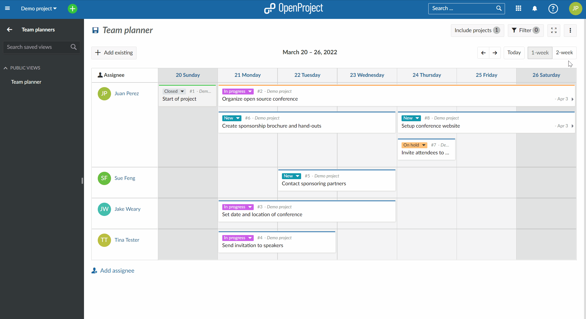
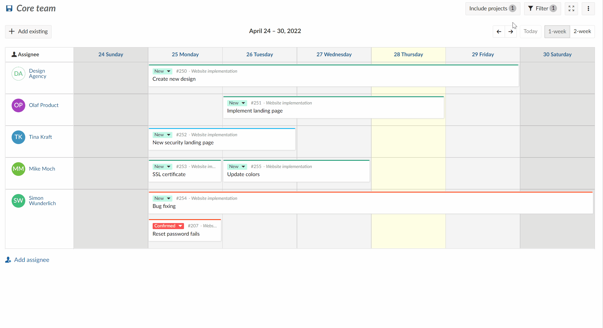
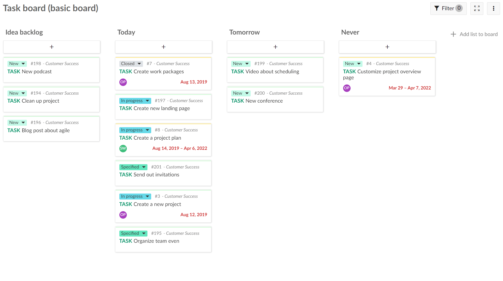
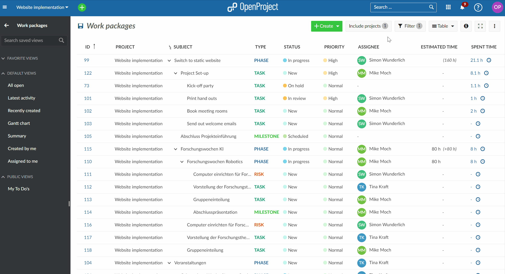
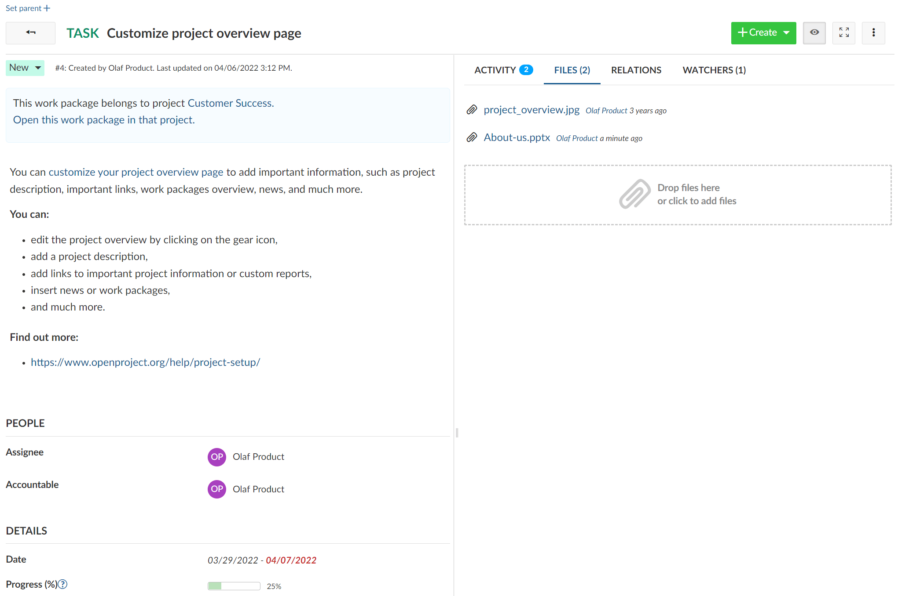

# OpenProject 12.1.0

Release date: 2022-05-03

We released [OpenProject 12.1.0](https://community.openproject.org/versions/1493).
This release will introduce a new module, the team planner. With this Enterprise add-on, you can visually assign work packages in a weekly or bi-weekly planning calendar view to your team, and keep an eye on everybody’s workload.

Also, we are proud to give the basic agile boards to the Community version of OpenProject with 12.1. Now, making it possible to create agile boards also in the free Community version.

As always, the release contains many more improvements and bug fixes and we recommend updating to the newest version promptly.

## Team planner (Enterprise add-on)

A new team planner module (Enterprise add-on) allows you to visually assign tasks to team members to get an overview of who is working on what. You can display in a weekly or bi-weekly view all work packages assigned to your team.

Add assignees to your team planner and visualize the workload. You can search for existing work packages to include with drag and drop, or create new work packages. Changing the row will change the assignee of a work package. Change the start date, end date or duration with drag and drop.

Also, you can include work packages from multiple projects with the new “Include projects” filter option.

## Agile boards for the Community version

We want to give an important feature to the Community version. Now, that we have implemented with the team planner a new Enterprise feature, we also want to give something to the Community. We decided to release the basic agile boards for the Community. Making it possible to also create agile boards with the free of charge Community version of OpenProject.

These flexible basic agile boards allow you to set up any kind of agile board you need. Freely configure the lists (columns) which should be displayed and add and move cards between these lists. The basic boards do not update the work package attributes when moving cards between the lists.

The more advanced action boards, which automatically update work package attributes, will remain part of the Enterprise edition.

## Include projects filter

The “Include Projects” filter option makes it easier to add different projects to your views and create project overarching reports. This easy filter option is valid for work packages, calendars, and the new team planners.

## Files tab for work packages

We added a new “Files” tab in the work package details. This way, you will have all possible information attached to a work package together in one place.

## Further improvements, changes, and bug fixes

- We created global roles for groups to assign these roles to groups and create superuser groups.
- The project status was given more options to choose from. You can now choose also NOT STARTED, FINISHED, DISCONTINUED to set as a project status.
- An index page was added also for the team planner and calendar module.
- API to CRUD links between files (i.e. for Nextcloud) and work packages in OpenProject.

### List of all bug fixes and changes

- Epic: Introduce module specific queries (e.g. for calendar, team planner and BCF module) \[[#30583](https://community.openproject.org/wp/30583)\]
- Epic: Team planner \[[#39784](https://community.openproject.org/wp/39784)\]
- Epic: Include projects filter component for work package module, calendar and team planner \[[#40330](https://community.openproject.org/wp/40330)\]
- Changed: Extend the current project status \[[#34708](https://community.openproject.org/wp/34708)\]
- Changed: Update and verify all help/docs links from application help menu and start page \[[#35029](https://community.openproject.org/wp/35029)\]
- Changed: Save different views in calendar module \[[#36322](https://community.openproject.org/wp/36322)\]
- Changed: Remove custom links to notification settings in email footer \[[#39133](https://community.openproject.org/wp/39133)\]
- Changed: Drag and drop of work packages in calendar module and team planner module \[[#39486](https://community.openproject.org/wp/39486)\]
- Changed: Left-side search pane to add existing work packages to team planner \[[#40031](https://community.openproject.org/wp/40031)\]
- Changed: Seed data for new team planner module \[[#40195](https://community.openproject.org/wp/40195)\]
- Changed: Email settings (SMTP etc.) are hard to find \[[#40215](https://community.openproject.org/wp/40215)\]
- Changed: API to CRUD links between files (i.e. Nextcloud) and work packages in OpenProject \[[#40228](https://community.openproject.org/wp/40228)\]
- Changed: What's new teaser block updated with team planner \[[#40257](https://community.openproject.org/wp/40257)\]
- Changed: Show closed work packages by default in calendar and team planner \[[#40319](https://community.openproject.org/wp/40319)\]
- Changed: Make assignee column narrower (it is is currently too wide) \[[#40532](https://community.openproject.org/wp/40532)\]
- Changed: Switch to change between one week and two weeks view \[[#40533](https://community.openproject.org/wp/40533)\]
- Changed: Multiple file storages per OP instance \[[#40536](https://community.openproject.org/wp/40536)\]
- Changed: Global roles for groups \[[#40546](https://community.openproject.org/wp/40546)\]
- Changed: Add right-click work packages context menu to the calendar/team planner \[[#40755](https://community.openproject.org/wp/40755)\]
- Changed: Add a format to display lastname and firstname without space \[[#40759](https://community.openproject.org/wp/40759)\]
- Changed: Load the first team planner when clicking on the menu item \[[#40767](https://community.openproject.org/wp/40767)\]
- Changed: Updates to the two-week view \[[#40801](https://community.openproject.org/wp/40801)\]
- Changed: Hover, Clicked and Disabled states for cards in the Add Existing pane \[[#40810](https://community.openproject.org/wp/40810)\]
- Changed: Team planner animation \[[#40856](https://community.openproject.org/wp/40856)\]
- Changed: Decrease team planner toolbar when split screen is opened \[[#40863](https://community.openproject.org/wp/40863)\]
- Changed: Make Add Existing panel narrower than is currently implemented (and make sure its shadow is not cut off) \[[#40864](https://community.openproject.org/wp/40864)\]
- Changed: Removing work packages from the team planner \[[#40883](https://community.openproject.org/wp/40883)\]
- Changed: Updated design for cards in Add Existing pane \[[#40886](https://community.openproject.org/wp/40886)\]
- Changed: Add order by name per hierarchy to projects API \[[#40930](https://community.openproject.org/wp/40930)\]
- Changed: Signaling included properties of the projects API \[[#40931](https://community.openproject.org/wp/40931)\]
- Changed: Updated placement and design of the create button in the sidebar \[[#40958](https://community.openproject.org/wp/40958)\]
- Changed: Replace work strips on the team planner calendar with full cards \[[#40962](https://community.openproject.org/wp/40962)\]
- Changed: Change scrolling behavior of team planner \[[#40981](https://community.openproject.org/wp/40981)\]
- Changed: Show "Start trial" button in EE upsale templates \[[#40990](https://community.openproject.org/wp/40990)\]
- Changed: Add team planner to onboarding tour \[[#41050](https://community.openproject.org/wp/41050)\]
- Changed: Empty team planner view needs some more love \[[#41073](https://community.openproject.org/wp/41073)\]
- Changed: The date indicators must update when dragging a card in the planner horizontally \[[#41075](https://community.openproject.org/wp/41075)\]
- Changed: When the split screen is open, allow users to also select on cards in the Add Existing pane to change the contents of the split screen \[[#41080](https://community.openproject.org/wp/41080)\]
- Changed: "Include projects": behavior specific to the Team Planner \[[#41086](https://community.openproject.org/wp/41086)\]
- Changed: New image/gif for add Existing pane in team planner \[[#41100](https://community.openproject.org/wp/41100)\]
- Changed: On closing the split screen, the previously open card should go from selected (blue) to normal state \[[#41113](https://community.openproject.org/wp/41113)\]
- Changed: Include projects - Select all sub-projects \[[#41135](https://community.openproject.org/wp/41135)\]
- Changed: Updated hover behavior for cards (to make the icons legible when they overlap with attributes) \[[#41137](https://community.openproject.org/wp/41137)\]
- Changed: Add index page to Team Planner ("Team planners") to maintain consistency with the Boards module \[[#41138](https://community.openproject.org/wp/41138)\]
- Changed: Display a loading skeleton before actual content is fully loaded \[[#41199](https://community.openproject.org/wp/41199)\]
- Changed: Include projects - Loading skeleton view \[[#41213](https://community.openproject.org/wp/41213)\]
- Changed: Include projects - Mobile dialog \[[#41224](https://community.openproject.org/wp/41224)\]
- Changed: Display a small loading indicator after each modification to avoid the user immediately making a second, conflicting modification \[[#41235](https://community.openproject.org/wp/41235)\]
- Changed: Add index page for calendar module \[[#41278](https://community.openproject.org/wp/41278)\]
- Changed: Files Tab in work package details \[[#41340](https://community.openproject.org/wp/41340)\]
- Changed: Add Basic Board to onboarding tour for Community edition. \[[#41405](https://community.openproject.org/wp/41405)\]
- Changed: Change permission for role MEMBER in default demo data \[[#41477](https://community.openproject.org/wp/41477)\]
- Changed: Publish Basic boards for Community version \[[#41511](https://community.openproject.org/wp/41511)\]
- Changed: Make existing advanced boards not accessible when you don't have an EE token any more \[[#41516](https://community.openproject.org/wp/41516)\]
- Changed: Move WP with associated FileLinks \[[#41523](https://community.openproject.org/wp/41523)\]
- Changed: Ensure deleting a project deletes all file links of all work packages of that project \[[#41525](https://community.openproject.org/wp/41525)\]
- Changed: Regular LDAP users synchronization of all active users \[[#41677](https://community.openproject.org/wp/41677)\]
- Changed: Add feature flag to activate/deactivate file storages module \[[#41690](https://community.openproject.org/wp/41690)\]
- Changed: Heading not correctly aligned in Team planner \[[#41710](https://community.openproject.org/wp/41710)\]
- Changed: Seed (migrate) team planner permissions  \[[#41899](https://community.openproject.org/wp/41899)\]
- Changed: Add packaged installation support for Ubuntu 22.04 \[[#42069](https://community.openproject.org/wp/42069)\]
- Fixed: Missing translation in custom fields administration \[[#38057](https://community.openproject.org/wp/38057)\]
- Fixed: \[Navigation\] Breadcrumbs changes from "Relations" to "Activity" \[[#38531](https://community.openproject.org/wp/38531)\]
- Fixed: Minor spelling change for work package filter \[[#38533](https://community.openproject.org/wp/38533)\]
- Fixed: Mobile: When clicking on WP tabs ("Activity", "Watchers", ...) jump to top of page \[[#39848](https://community.openproject.org/wp/39848)\]
- Fixed: Internal error when trying to set milestone as parent wp \[[#39856](https://community.openproject.org/wp/39856)\]
- Fixed: Multiple indexes found on journal columns when migrating from 11.4.1 to 12.0.1 \[[#40028](https://community.openproject.org/wp/40028)\]
- Fixed: Tab info does not update when closing the split screen \[[#40033](https://community.openproject.org/wp/40033)\]
- Fixed: Various E-Mail clients don't support embedded images \[[#40122](https://community.openproject.org/wp/40122)\]
- Fixed: Save query modal does not submit on enter \[[#40134](https://community.openproject.org/wp/40134)\]
- Fixed: "Add Viewpoint Button" is missing after switching from table view to model & cards \[[#40186](https://community.openproject.org/wp/40186)\]
- Fixed: Check and update the notifications API documentation \[[#40196](https://community.openproject.org/wp/40196)\]
- Fixed: Opening viewpoints from gallery does not work on mobile \[[#40267](https://community.openproject.org/wp/40267)\]
- Fixed: Empty state is visible during team planner query reload \[[#40323](https://community.openproject.org/wp/40323)\]
- Fixed: Tooltip on team planner and calendar doesn't close sometimes \[[#40325](https://community.openproject.org/wp/40325)\]
- Fixed: OpenAPI Specs not OpenAPI 3.0 compatible \[[#40397](https://community.openproject.org/wp/40397)\]
- Fixed: Team planner not correctly redrawn after closing a split view (empty areas) \[[#40531](https://community.openproject.org/wp/40531)\]
- Fixed: Today column is not highlighted in the team planner \[[#40859](https://community.openproject.org/wp/40859)\]
- Fixed: An empty team planner has visual anomalies (extra lines, wrong color) \[[#40860](https://community.openproject.org/wp/40860)\]
- Fixed: Wrong progress value in parent task \[[#40867](https://community.openproject.org/wp/40867)\]
- Fixed: Error 500 when creating a new OpenID provider \[[#40893](https://community.openproject.org/wp/40893)\]
- Fixed: Users can't select public template projects in new project dialog \[[#40918](https://community.openproject.org/wp/40918)\]
- Fixed: Meeting Time in iCalendar is wrong \[[#40941](https://community.openproject.org/wp/40941)\]
- Fixed: Toolbar icons should be rendered in the "old" style and not the new rounded style (which is a work in progress) \[[#40957](https://community.openproject.org/wp/40957)\]
- Fixed: \[Docker\] - Gitlab integration plugin \[[#40959](https://community.openproject.org/wp/40959)\]
- Fixed: Project dropdown no longer autofocused \[[#40978](https://community.openproject.org/wp/40978)\]
- Fixed: Not possible to copy work package to another project \[[#41005](https://community.openproject.org/wp/41005)\]
- Fixed: Changed calendar styles applied to time entries component \[[#41013](https://community.openproject.org/wp/41013)\]
- Fixed: Text in "Add existing" pane needs smaller font-size \[[#41068](https://community.openproject.org/wp/41068)\]
- Fixed: Status description missing from project XLS export \[[#41071](https://community.openproject.org/wp/41071)\]
- Fixed: Toolbar: Placement and spacing of buttons and date need adjusting \[[#41079](https://community.openproject.org/wp/41079)\]
- Fixed: Inconsistencies and an anomaly with borders on team planner calendar \[[#41081](https://community.openproject.org/wp/41081)\]
- Fixed: Configure boards modal has empty tab header \[[#41103](https://community.openproject.org/wp/41103)\]
- Fixed: Drag handle hover area is inconsistent / too sensitive \[[#41108](https://community.openproject.org/wp/41108)\]
- Fixed: Cards in the same assignee row disappear and change display order when changing dates using the drag handle \[[#41111](https://community.openproject.org/wp/41111)\]
- Fixed: Date indicator on the right edge of cards does not always render properly \[[#41118](https://community.openproject.org/wp/41118)\]
- Fixed: For work packages whose start/end dates are set by children, the date indicators are shown when they should not be \[[#41119](https://community.openproject.org/wp/41119)\]
- Fixed: New cards disappear behind cards in the first row  \[[#41209](https://community.openproject.org/wp/41209)\]
- Fixed: Filter error message when using "Add existing" and having included unrelated projects \[[#41218](https://community.openproject.org/wp/41218)\]
- Fixed: Add Existing panel: Anomalies with the way the search bar is rendered \[[#41231](https://community.openproject.org/wp/41231)\]
- Fixed: Shortening a card to less than 1 day (reverse stretch) results in temporary disappearance \[[#41234](https://community.openproject.org/wp/41234)\]
- Fixed: Caching of filter representer link survived patch version level \[[#41237](https://community.openproject.org/wp/41237)\]
- Fixed: Multiple group memberships in project result in insufficient roles applied \[[#41255](https://community.openproject.org/wp/41255)\]
- Fixed: Include projects - Frontend refinements \[[#41263](https://community.openproject.org/wp/41263)\]
- Fixed: Existing cards not being displayed on initial load \[[#41305](https://community.openproject.org/wp/41305)\]
- Fixed: Teamplanner crashes when dropping a wp from the add existing pane \[[#41413](https://community.openproject.org/wp/41413)\]
- Fixed: Cannot select all projects in work package table \[[#41437](https://community.openproject.org/wp/41437)\]
- Fixed: Attribute help text opens when clicking ng-select dropdown \[[#41442](https://community.openproject.org/wp/41442)\]
- Fixed: API responses inconsistent between Bearer tokens and API tokens \[[#41480](https://community.openproject.org/wp/41480)\]
- Fixed: Create new task on my page not possible: Project not shown in pulldown list \[[#41533](https://community.openproject.org/wp/41533)\]
- Fixed: Include projects - Action bar has no round corners \[[#41582](https://community.openproject.org/wp/41582)\]
- Fixed: Fix capitalization in two places (minor) in the Team Planner \[[#41647](https://community.openproject.org/wp/41647)\]
- Fixed: Comments linked to another package are not shown correctly \[[#41649](https://community.openproject.org/wp/41649)\]
- Fixed: APIv3 projects API signalling - Duplicated projects returned \[[#41673](https://community.openproject.org/wp/41673)\]
- Fixed: Include projects number is wrong moving from projects page to gantt view \[[#41680](https://community.openproject.org/wp/41680)\]
- Fixed: Toolbars in Team planner not correctly aligned \[[#41711](https://community.openproject.org/wp/41711)\]
- Fixed: Redundant heading in file section (files + attachments) \[[#41712](https://community.openproject.org/wp/41712)\]
- Fixed: Toolbar missing or cut off in work packages module on iOS \[[#41713](https://community.openproject.org/wp/41713)\]
- Fixed: Clicking on files tab scrolls up on iOS \[[#41714](https://community.openproject.org/wp/41714)\]
- Fixed: Wrong string in Team planner for Assignee \[[#41716](https://community.openproject.org/wp/41716)\]
- Fixed: Redundant and inconsistent translations strings for buttons in sidebar \[[#41717](https://community.openproject.org/wp/41717)\]
- Fixed: Filter autocompleters do not reduce the possible selections when typing \[[#41718](https://community.openproject.org/wp/41718)\]
- Fixed: Inconsistent date markers on some cards in Team planner  \[[#41723](https://community.openproject.org/wp/41723)\]
- Fixed: Optimizations needed to "Add assignee" button \[[#41726](https://community.openproject.org/wp/41726)\]
- Fixed: Wiki updated notification: "Updated by" is shown to always be the "author" \[[#41728](https://community.openproject.org/wp/41728)\]
- Fixed: Cards on Team Planner jump after they are saved when multiple work packages were moved  \[[#41730](https://community.openproject.org/wp/41730)\]
- Fixed: Formattable columns in project list are weirdly cut off \[[#41822](https://community.openproject.org/wp/41822)\]
- Fixed: Project export formattable columns are formatted \[[#41823](https://community.openproject.org/wp/41823)\]
- Fixed: No option to export project description \[[#41824](https://community.openproject.org/wp/41824)\]
- Fixed: Wrong German translation for "Delete" action for work packages \[[#41839](https://community.openproject.org/wp/41839)\]
- Fixed: German translation missing in German notification settings \[[#41842](https://community.openproject.org/wp/41842)\]
- Fixed: Changing host_name option in "System Settings" leads to exception \[[#41844](https://community.openproject.org/wp/41844)\]
- Fixed: No hover on button "Add assignee" in Team planner or "Create new work package" in list view \[[#41853](https://community.openproject.org/wp/41853)\]
- Fixed: Query disappearing from search and not visible \[[#41897](https://community.openproject.org/wp/41897)\]
- Fixed: booking of additional licenses is not possible \[[#41901](https://community.openproject.org/wp/41901)\]
- Fixed: Team planner - add existing - no indication on no matching result \[[#41925](https://community.openproject.org/wp/41925)\]
- Fixed: Autofocus for sign in form OpenProject missing \[[#41929](https://community.openproject.org/wp/41929)\]
- Fixed: Comment numbers are cut off on mobile \[[#41942](https://community.openproject.org/wp/41942)\]
- Fixed: Calendar widget on overview page not useful \[[#42013](https://community.openproject.org/wp/42013)\]
- Fixed: Attachments got lost from description \[[#42041](https://community.openproject.org/wp/42041)\]
- Fixed: Space added before text in check lists  in work package description with every save \[[#42050](https://community.openproject.org/wp/42050)\]
- Fixed: main project dropdown list will show only 250 projects (from 580) \[[#42058](https://community.openproject.org/wp/42058)\]
- Fixed: Row breaks in project selector for "Included projects" \[[#42062](https://community.openproject.org/wp/42062)\]
- Fixed: Different translations strings for "Included projects" and "Projects"    \[[#42063](https://community.openproject.org/wp/42063)\]
- Fixed: Wrong indention for module "Team planers" in sidebar \[[#42065](https://community.openproject.org/wp/42065)\]
- Fixed: Indention for projects on root level in "Included projects" selector \[[#42066](https://community.openproject.org/wp/42066)\]
- Fixed: Tiny shift of checkboxes in the "Include project" selector \[[#42068](https://community.openproject.org/wp/42068)\]
- Fixed: Search results below include projects modal \[[#42090](https://community.openproject.org/wp/42090)\]
- Fixed: Include projects - Toggle button is not rounded \[[#42171](https://community.openproject.org/wp/42171)\]

## Contributions

A big thanks to community members for reporting bugs and helping us identifying and providing fixes.

- Special thanks for Autoliv for sponsoring the development of the new team planner.
- Special thanks for City of Cologne for sponsoring the development of the new global roles for groups.
- Special thanks for reporting and finding bugs go Rainer Proehl, kak tux, Sven Kunze, Çağlar Yeşilyurt, Valentin Ege, Michael Kluge, Christina Vechkanova, Marius Heidenreich, Gerrit Bonn, Benjamin Tey, Daniel Wilke, Avgerinos Fotopoulos, Thilo Sautter, Andreas Sturm.
- Every other dedicated user who has [reported bugs](../../../development/report-a-bug/) and supported the community by asking and answering questions in the [forum](https://community.openproject.org/projects/openproject/boards).
- All the dedicated users who provided translations on [CrowdIn](https://crowdin.com/projects/opf).
