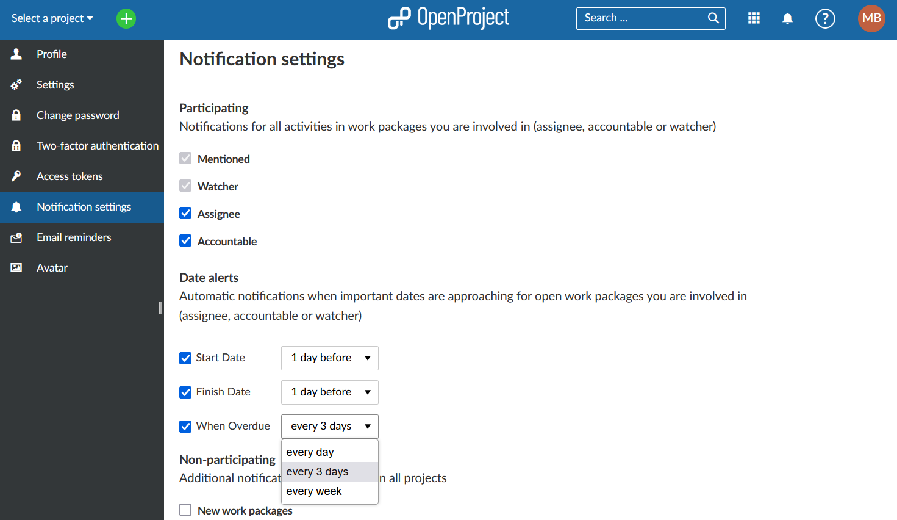
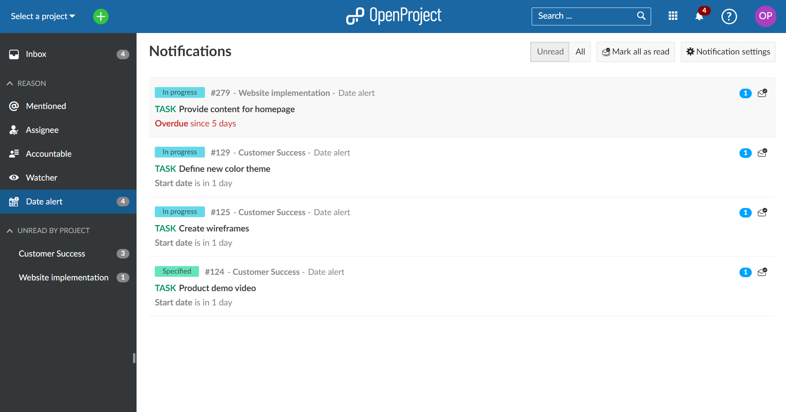
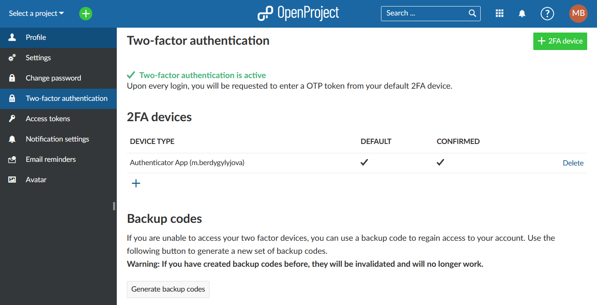
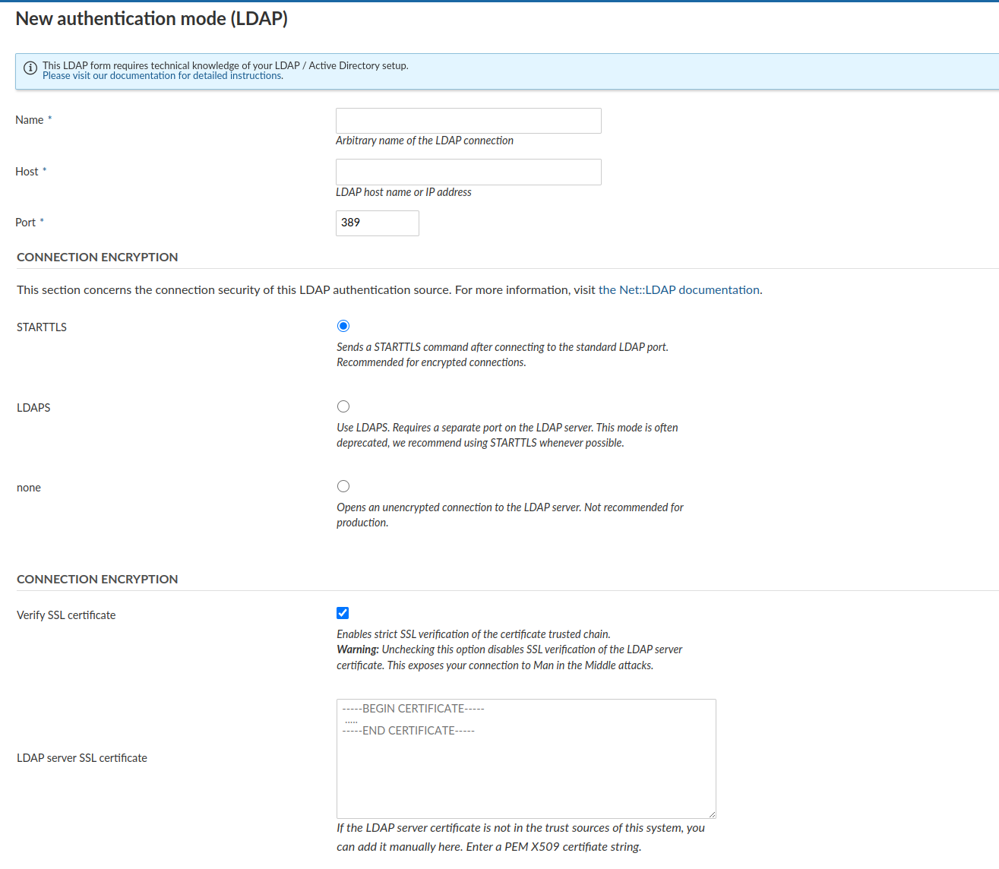
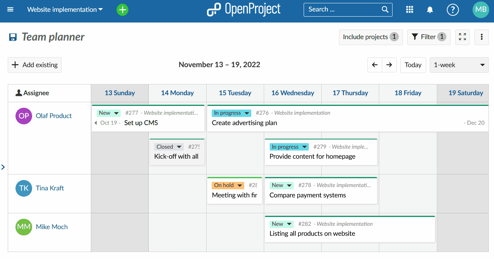
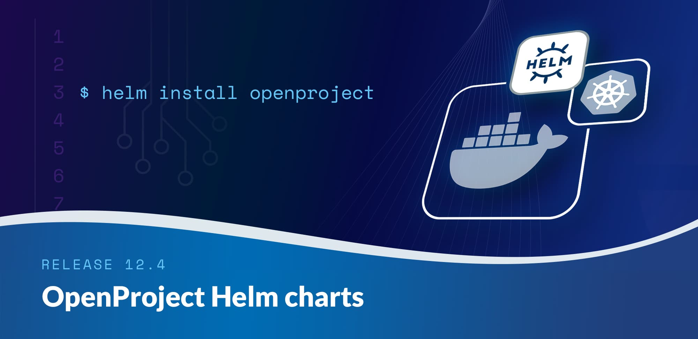
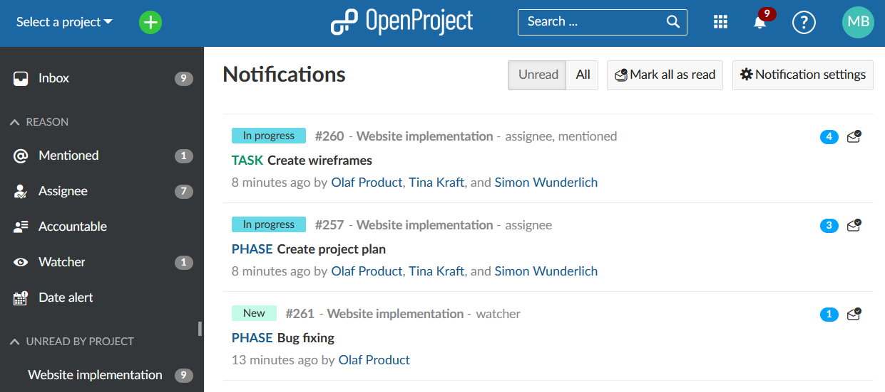
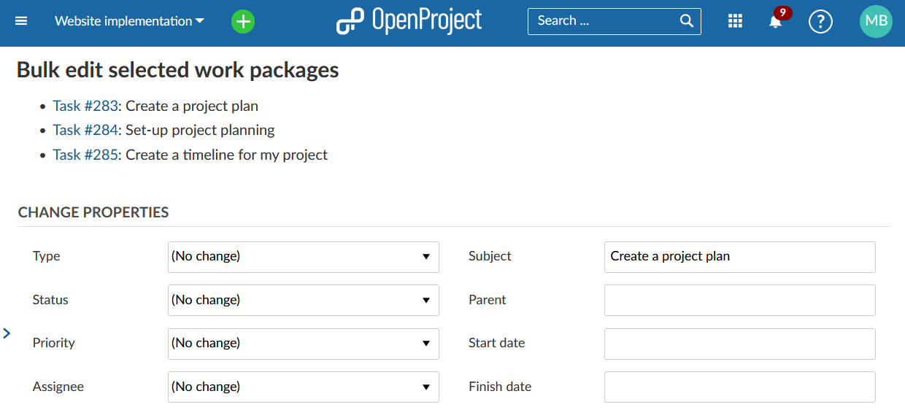

# OpenProject 12.4.0

Release date: 2022-12-05

We released [OpenProject 12.4.0](https://community.openproject.org/versions/1595).

This release launches a long awaited feature of **date alerts for upcoming due dates (start or finish date)** and **reminders for overdue tasks**.

With OpenProject 12.4 the **2-factor authentication feature becomes part of the Community edition** and adds an additional security layer to your application. Do not take long before you activate it.

Official **OpenProject HelmCharts** are available from now on. We also added the possibility of choosing a work week as opposed to 1 or 2 week view with the team planer. In addition, users can now tag themselves via @mentioned and can bulk edit the work-package field "subject".

As usual, the release contains several bug fixes and we recommend updating to the newest version.

## Date alerts for the upcoming dates and overdue tasks

The new OpenProject 12.4 release will bring notification date alerts for upcoming dates and overdue tasks (Enterprise add-on). Within the [Notification settings](../../../user-guide/notifications/notification-settings/) in My Account, automatic notifications for important dates and approaching dates can now be adjusted. This can be done for the open work packages you are involved in either as an assignee, accountable or watcher. A reminder can be set for 1 day, 3 days or a week before a start or a due date approaches.
Same options are now available for the overdue work package reminders.

The date alerts will appear in a dedicated section in the Notification center. Red color will indicate if a work package is overdue and by how many days. The alerts will also mention in how many days a work package's start date or finish date will approach.

>**Please note**: If a date is due in two days and you set a reminder for three days ahead, you will not receive a notification. The notifications are updated automatically once a day.
In case of overdue work packages, if a reminder is set to be sent for example every day and there already is a date alert notification for this work package in place (from the day before), the old one will be marked as read and replaced by the new notification with the updated overdue date.

Date alerts are an Enterprise add-on and only available in the [Enterprise on-premises and Enterprise cloud](https://www.openproject.org/enterprise-edition) version of OpenProject.

## 2-factor Authentication (2FA) for the community edition

With OpenProject 12.4 users who have OpenProject community edition installed can activate 2-factor authentication. We strongly recommend that you make use of this option and increase your account security.

!See [here](../../../user-guide/my-account/#two-factor-authentication) how to setup the 2FA under My account.

## LDAP connection encryption changes

In previous versions of OpenProject, there were three connection security modes that were hard to differentiate, especially with regards to actual verification of SSL certificates.

The LDAP connection encryption settings have been improved and extended with separate options to ensure SSL verification can be enabled. In case of self-signed certificates, a custom PEM X509 certificate or certificate chain can be added per connection.

**Important note:** For previous LDAP connections, this results in the `Verify SSL certificate` option being unchecked after migrating to OpenProject 12.4. This was the default even for STARTTLS connections (only the host name of the certificate was checked by default). The option will be enabled if you manually set the `OPENPROJECT_LDAP__TLS__OPTIONS="{ verify_mode: 1 }"` and that setting has been deprecated.

Please double-check your existing LDAP connections and enable Verification of SSL certificates manually after upgrading to OpenProject 12.4.0. If you have self-signed certificates, make use of the custom certificate option to mitigate MITM attack vectors.

## Work week for the team planner

It is now possible to choose between a full 1-week view, a 2-week view or only the work week (depending on your Working days settings in the system's Administration) in the [team planner](../../../user-guide/team-planner/).

## OpenProject Helm Charts

Starting with OpenProject 12.4 official [OpenProject Helm charts](../../../installation-and-operations/installation/helm-chart) are available.

## List up to three people in a notification card

From now on is possible to list up to 3 people in a notification card when multiple people were involved in the changes.

## Self notifications via @mentioned

Users can now notify not only other users but themselves too via @mention. Notification is sent to all the mentioned users as usual.

## Bulk edit work package "subject" field

It is now possible to bulk edit the subject field for multiple work packages. See how to [bulk edit work packages](../../../user-guide/work-packages/edit-work-package/#bulk-edit-work-packages).

### List of all bug fixes and changes

- Epic: Notification date alerts for upcoming and overdue tasks - EE \[[#7693](https://community.openproject.org/wp/7693)\]
- Epic: Cross-application main menu for dPhoenixSuite/Sovereign Administrative Work Place  \[[#44297](https://community.openproject.org/wp/44297)\]
- Fixed: Wrong right margin in the side menu new team planner button \[[#43253](https://community.openproject.org/wp/43253)\]
- Fixed: Option "Create new" shown for related work package tables when permission to create WP is missing \[[#43834](https://community.openproject.org/wp/43834)\]
- Fixed: Cannot properly assign roles to global admins \[[#43858](https://community.openproject.org/wp/43858)\]
- Fixed: notifications API returns error as an array not string \[[#43908](https://community.openproject.org/wp/43908)\]
- Fixed: [Project-Template] Rename checkbox labels under copy options \[[#43909](https://community.openproject.org/wp/43909)\]
- Fixed: Missing option to select BIM edition \[[#44236](https://community.openproject.org/wp/44236)\]
- Fixed: Wrong icon for history in Wiki history and Meeting history \[[#44745](https://community.openproject.org/wp/44745)\]
- Fixed: Parent of predecessor work package not available to be set as parent of following work package \[[#44827](https://community.openproject.org/wp/44827)\]
- Fixed: Endpoint PATCH /api/v3/my_preferences does not update preferences \[[#44845](https://community.openproject.org/wp/44845)\]
- Fixed: Error when switching to milestone type and current date configured as start date \[[#44900](https://community.openproject.org/wp/44900)\]
- Fixed: Misalignment in Project specific settings table  \[[#44932](https://community.openproject.org/wp/44932)\]
- Fixed: Backup failed with message "undefined method 'body'.." if attachment is unavailable \[[#44939](https://community.openproject.org/wp/44939)\]
- Fixed: Admin sidebar enterprise badge is misaligned \[[#44990](https://community.openproject.org/wp/44990)\]
- Fixed: Text in the Enterprise Edition administration page still includes 2FA as EE Feature \[[#44991](https://community.openproject.org/wp/44991)\]
- Changed: List up to 3 people in a notification card \[[#43294](https://community.openproject.org/wp/43294)\]
- Changed: Cannot self-notify via @mention \[[#43846](https://community.openproject.org/wp/43846)\]
- Changed: Make 2FA available in the community edition \[[#44327](https://community.openproject.org/wp/44327)\]
- Changed: Trap focus within a modal dialogue when tabbing to cycling through interactive elements \[[#44344](https://community.openproject.org/wp/44344)\]
- Changed: Helm charts for OpenProject \[[#44360](https://community.openproject.org/wp/44360)\]
- Changed: Bulk edit of the work-package field "subject" \[[#44386](https://community.openproject.org/wp/44386)\]
- Changed: Team planner: add "Work week" option to visible time scale \[[#44702](https://community.openproject.org/wp/44702)\]

## Contributions

A big thanks to community members for reporting bugs and helping us identifying and providing fixes.

A gigantic thank you goes out to Sven Kunze for developing the self-tagging feature and the bulk edit option for the subject field.

Special thanks for reporting and finding bugs also go to Artur Neumann, Noel Lublovary, Hein Stefans.
