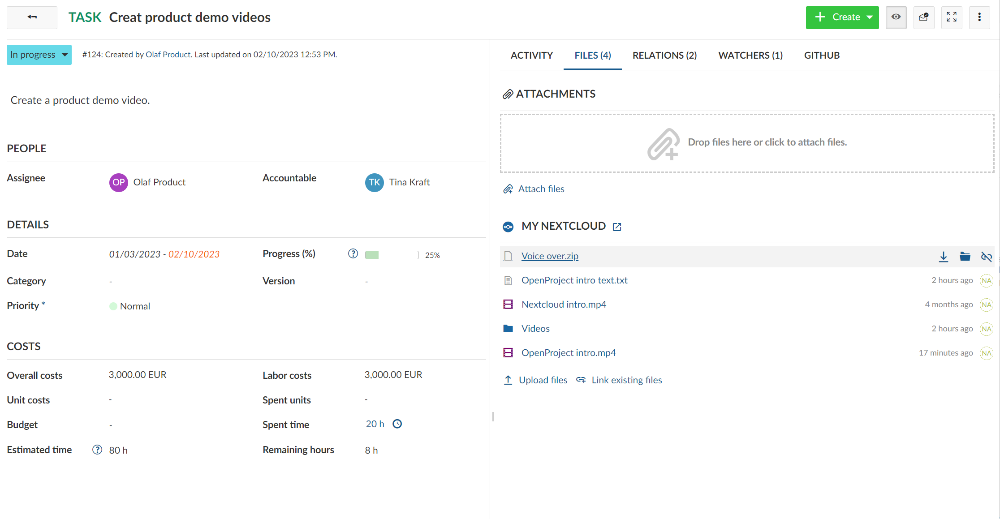
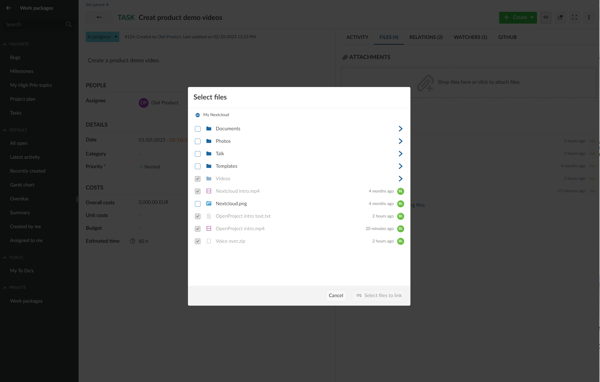
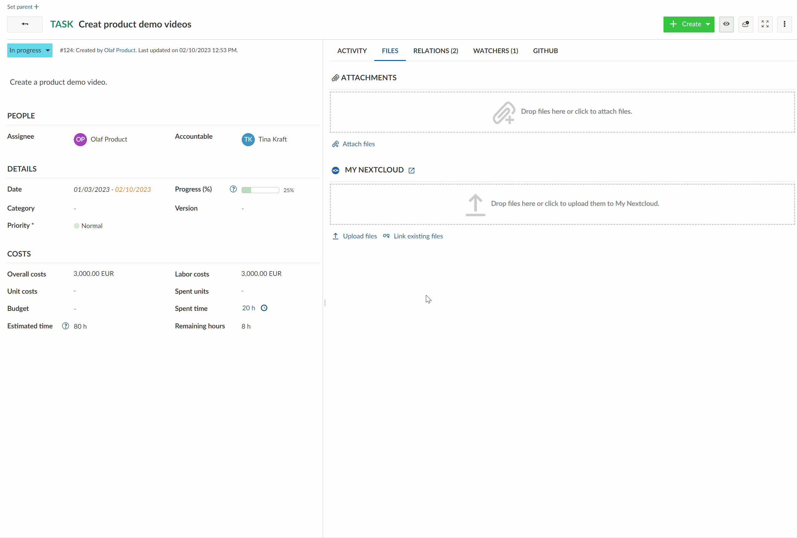
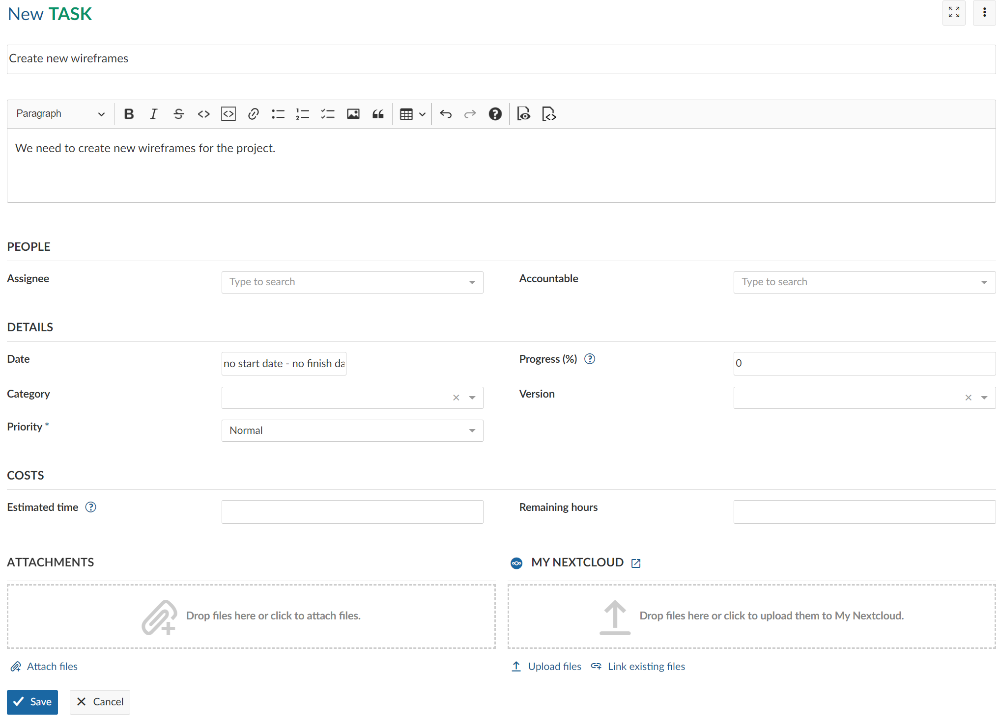
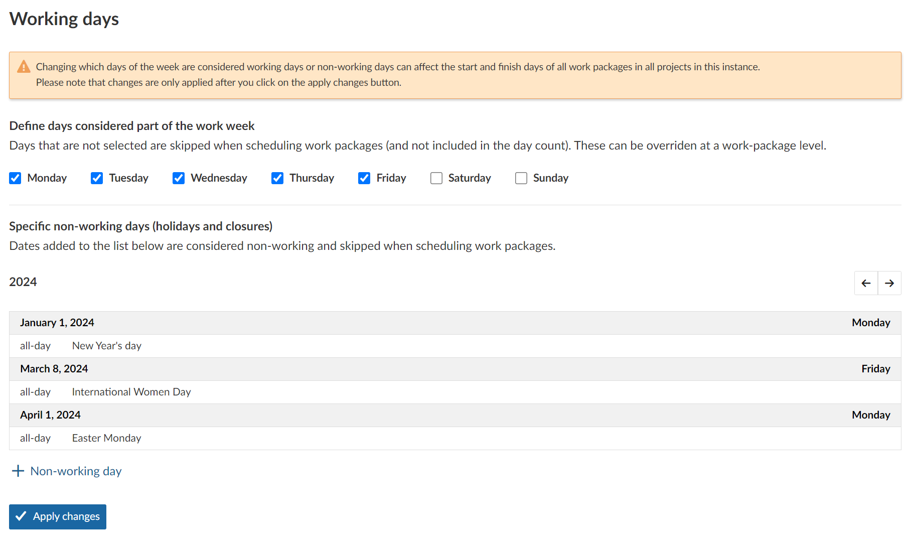
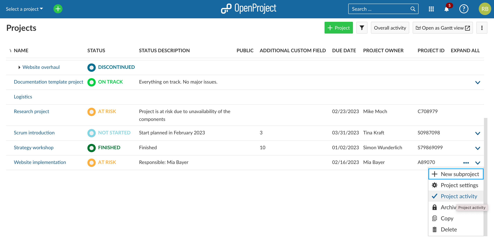
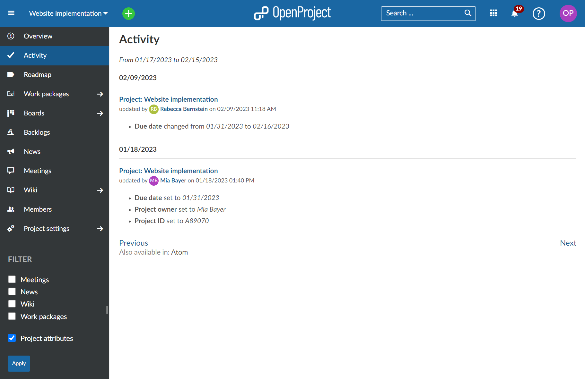
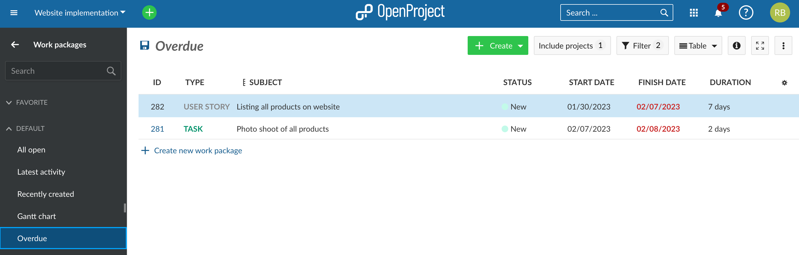
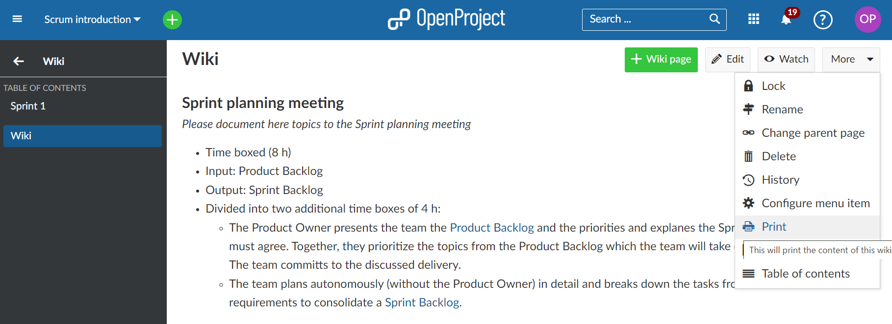
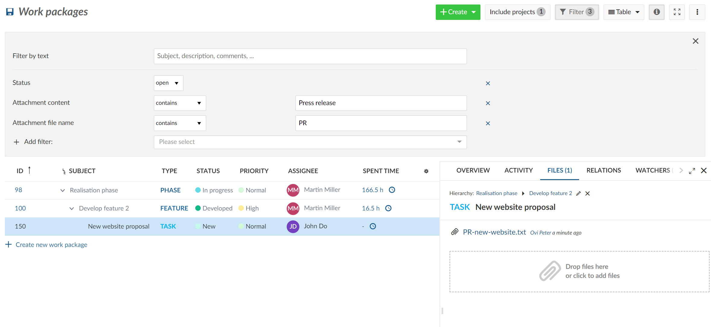

# OpenProject 12.5.0

Release date: 2023-03-20

We have released [OpenProject 12.5.0](https://community.openproject.org/versions/1611).

This new release is again packed with many new collaboration features, improvements and bug fixes.
Version 12.5 brings the anticipated collaboration features for the **Nextcloud integration to the OpenProject side**. Nextcloud and OpenProject now offer users of both services a way to manage their projects and share files seamlessly and without disruption.

OpenProject 12.5 now also lets system administrator **define additional non-working days** on an instance level, such as public holidays. We are also happy to **release another Enterprise add-on** to the free-of-charge Community version: The advanced search functionality not only supports full text search but also enables users to search for work package attachments or content.

## Upload files to Nextcloud while working in OpenProject

OpenProject 12.5 launches the next step for the integration between OpenProject and Nextcloud. It is now possible to upload new files to Nextcloud and link them directly to a work package all from within OpenProject. The close connection of work packages with project-related files combines the advantages of both open source systems.

Different use cases are covered for uploading and linking files directly from within a work package.

### Link an existing Nextcloud file or folder to an OpenProject work package

If you want to link an existing project related file or folder from Nextcloud to an OpenProject work package, you can now do it directly within the work package in OpenProject.

To do so, start by clicking on **Link existing files** underneath the section of your Nextcloud file storage.

### A new file picker in OpenProject

A new file picker will appear, displaying all the files and folders on your Nextcloud instance that you have permission to see.

To link a certain file or folder with this work package, click on the checkbox to the left of each item. Once you have selected the relevant file(s) or folder(s), click on the **Link files** button. The number on the button will represent the number of files/folders you have selected.

### Upload a new file to Nextcloud directly from OpenProject

It is now possible to upload a new file from your device directly to Nextcloud from within an OpenProject work package.

Click on the **Upload files** link. You will be prompted to select a file (or multiple files) on your computer that you want to upload to Nextcloud and link the the current work package, in one action.

Alternatively, you can also simply drag a file or folder on your computer to this area (under the name of your Nextcloud file storage) and drop it in the drop zone that appears.

Once you have selected or dropped the files you would like to upload, simply select a folder on Nextcloud in which they should be stored and click the **Choose location** button.

### Upload files during when creating new work package

The ability to upload new files to Nextcloud directly from OpenProject or link existing files to work packages is not reserved only for existing work packages. You can now do both also when creating a new work package.

### More options for linked Nextcloud files in OpenProject

The **Files** tab shows you Nextcloud files that are linked to the current work package. Hovering on any linked file with your mouse will give you options to open or download the file, show the containing folder in Nextcloud or remove the link.

**Please note:** Removing the link from within a work package in OpenProject will not delete the file or folder in Nextcloud. When uploading a new file with the same name, you will be asked if you want to either overwrite the existing one in Nextcloud or create an additional copy of it.

## Setting public holidays as non-working days

OpenProject already lets administrators set the work week at an instance-level by letting them define the working and non-working days of the week.

With OpenProject 12.5, administrators can now also define additional individual non-working days of the year. This can be useful to program in public holidays or closures. Work packages cannot then start or end on these days and these days do not count towards the duration of a work package. (A user can nevertheless turn the 'Working days only' switch off at a work package level and schedule on non-working days if needed).

**Please note**: These additional non-working days are set at an instance level and affect all work packages in all projects. Adding additional non-working days can therefore affect and reschedule a large number of work packages in the instance (except those for which the 'Working days only' switch is turned off). Individual non-working days and are also tied to a specific year. Recurring holidays like Christmas have to be set separately for each year.

## View project activity

Starting with OpenProject 12.5, the Activities module (if enabled) will now include the changes to project attributes and project custom fields. You can directly open the project activity view from the Project list by clicking on the *More* menu of a particular project and then choosing *Project activity*.

You can also access project activity by clicking on *Activity* on the project sidebar menu and using the filters at the bottom of the sidebar to filter for the attributes you wish to view.

## New default filter for overdue work packages

We have added a new default filter **Overdue**  to the work package module so that you can quickly see which of your work packages are overdue and need attention.

## Printing Wikis

If you want to print your Wiki, with OpenProject 12.5 you can now do so. A print function has been added to the **More** menu at the top right corner of your Wiki.

## Advanced search for work package attachment or content released to the community

With OpenProject 12.5, we are happy to announce that another Enterprise add-on was released to the free-of-charge Community version. The advanced filters enable not only full text search but also to [filter and search for work packages attachments and content of the attachments](../../../user-guide/work-packages/work-package-table-configuration/#filter-for-attachment-file-name-and-content).

## Further improvements, changes, and bug fixes

- Extend the data model and the API to save and query historic values of work packages as a foundation for baseline comparisons.
- The default work package filter “Latest Activity” also includes rejected, closed and on hold work packages.
- Archive projects can now be done by non-admins.
- The number of GitHub pull requests will be shown on the work package tab.

### List of all bug fixes and changes

- Changed: Archive project via project settings by non admins \[[#3897](https://community.openproject.org/wp/3897)\]
- Changed: Change filter for default view: Latest activity \[[#29086](https://community.openproject.org/wp/29086)\]
- Changed: Work packages: Add finish date filter with additional overdue task check \[[#37145](https://community.openproject.org/wp/37145)\]
- Changed: Add print menu item to context menu of a wiki page \[[#37851](https://community.openproject.org/wp/37851)\]
- Changed: Update the list of operators available when filtering using multi-select attributes \[[#42012](https://community.openproject.org/wp/42012)\]
- Changed: Standardize date pickers outside of the main work package date field \[[#42358](https://community.openproject.org/wp/42358)\]
- Changed: Include nextcloud and attachments empty status drag and drop area \[[#43576](https://community.openproject.org/wp/43576)\]
- Changed: Make attachment lists and file link lists drop zones \[[#43577](https://community.openproject.org/wp/43577)\]
- Changed: Upload or link Nextcloud files from within the work package creation form \[[#43578](https://community.openproject.org/wp/43578)\]
- Changed: File picker \[[#43654](https://community.openproject.org/wp/43654)\]
- Changed: Location picker \[[#43655](https://community.openproject.org/wp/43655)\]
- Changed: Upload files to Nextcloud from within OpenProject \[[#43656](https://community.openproject.org/wp/43656)\]
- Changed: Link existing Nextcloud files from within OpenProject \[[#43657](https://community.openproject.org/wp/43657)\]
- Changed: [wiki] Be able to link work-package views \[[#43913](https://community.openproject.org/wp/43913)\]
- Changed: Helm charts for OpenProject \[[#44360](https://community.openproject.org/wp/44360)\]
- Changed: Show number of pull requests in the tab header \[[#44820](https://community.openproject.org/wp/44820)\]
- Changed: Remove hint that files have moved to the Files tab \[[#44902](https://community.openproject.org/wp/44902)\]
- Changed: Update text for empty Notification center \[[#44910](https://community.openproject.org/wp/44910)\]
- Changed: Keep state of Activity tab when switching forth and back to another tab \[[#45060](https://community.openproject.org/wp/45060)\]
- Changed: Update styling of User Activity \[[#45344](https://community.openproject.org/wp/45344)\]
- Changed: Update styling of detailed work package macro \[[#45455](https://community.openproject.org/wp/45455)\]
- Changed: Provide meaningful help when upload to Nextcloud fails due to file size \[[#45938](https://community.openproject.org/wp/45938)\]
- Changed: Remove Select All and Open Storage interaction elements from file pickers \[[#45963](https://community.openproject.org/wp/45963)\]
- Changed:  Update NEW FEATURES teaser block on application start page \[[#45991](https://community.openproject.org/wp/45991)\]
- Changed: Update labels for project activity filters \[[#46123](https://community.openproject.org/wp/46123)\]
- Changed: Update date picker and associated components to use current theme colors \[[#46171](https://community.openproject.org/wp/46171)\]
- Changed: Hide previous and next month days in single datepicker \[[#46189](https://community.openproject.org/wp/46189)\]
- Changed: Accessibility for the new date pickers \[[#46211](https://community.openproject.org/wp/46211)\]
- Changed: Basic drop-down date picker for date fields that are already input fields \[[#46236](https://community.openproject.org/wp/46236)\]
- Changed: Datepicker: Update colors of mini calendar so non-working days are visible in all modes \[[#46237](https://community.openproject.org/wp/46237)\]
- Changed: Resolve conflict with files with the same name when upload \[[#46254](https://community.openproject.org/wp/46254)\]
- Changed: Release "Advanced filters" from Enterprise to Community \[[#46797](https://community.openproject.org/wp/46797)\]
- Changed: Use native date fields on basic single and range datepickers \[[#46814](https://community.openproject.org/wp/46814)\]
- Fixed: Misleading warning message when closing meeting agenda \[[#34533](https://community.openproject.org/wp/34533)\]
- Fixed: Confirmation message in previous language when changing language in My Account \[[#34594](https://community.openproject.org/wp/34594)\]
- Fixed: External auth providers treated as self registration \[[#42390](https://community.openproject.org/wp/42390)\]
- Fixed: WP Table View is scrolling itself when changing attributes \[[#42989](https://community.openproject.org/wp/42989)\]
- Fixed: Backlog error \[[#43225](https://community.openproject.org/wp/43225)\]
- Fixed: [AppSignal] incompatible character encodings: ASCII-8BIT and UTF-8 \[[#43898](https://community.openproject.org/wp/43898)\]
- Fixed: Notification center sometimes displays the activity log of the wrong work package in split screen \[[#44198](https://community.openproject.org/wp/44198)\]
- Fixed: File picker modal height changes when navigating the file structure \[[#44917](https://community.openproject.org/wp/44917)\]
- Fixed: Different font weight for date alert settings compared to other notification settings \[[#44959](https://community.openproject.org/wp/44959)\]
- Fixed: Concept and navigation changes on the file picker modal \[[#44965](https://community.openproject.org/wp/44965)\]
- Fixed: File picker: Directories with spaces don't load correctly \[[#44973](https://community.openproject.org/wp/44973)\]
- Fixed: Avatar blinking on team planner \[[#44992](https://community.openproject.org/wp/44992)\]
- Fixed: Missing images in Nextcloud integration user guide \[[#45240](https://community.openproject.org/wp/45240)\]
- Fixed: WP-Grid does not highlight cards when initially loading \[[#45451](https://community.openproject.org/wp/45451)\]
- Fixed: WP-Table highlighting configuration misses all attributes highlighted hint \[[#45453](https://community.openproject.org/wp/45453)\]
- Fixed: WP-Grid does not align assignee avatar and dates over columns \[[#45454](https://community.openproject.org/wp/45454)\]
- Fixed: Confusing message that user was deleted, even though they will be locked and deleted asynchronously \[[#45459](https://community.openproject.org/wp/45459)\]
- Fixed: bundle install on current "dev" HEAD \[[#45489](https://community.openproject.org/wp/45489)\]
- Fixed: Too much spacing between the label and help text button \[[#45561](https://community.openproject.org/wp/45561)\]
- Fixed: Work package view layout breaks with long 'text' custom field values \[[#45566](https://community.openproject.org/wp/45566)\]
- Fixed: When TOTP fails due to clock skew, error is not easily discoverable \[[#45586](https://community.openproject.org/wp/45586)\]
- Fixed: Notifications not sent for new work packages when creating project from template \[[#45701](https://community.openproject.org/wp/45701)\]
- Fixed: Hover effect blue color is missing for NC empty drag and drop area \[[#45708](https://community.openproject.org/wp/45708)\]
- Fixed: Edit Time-Entries from Widget "TIME BOOKED (LAST 7 DAYS)" doesn't work \[[#45742](https://community.openproject.org/wp/45742)\]
- Fixed: Uncaught (in promise): ReferenceError: toggle_disabled_state is not defined \[[#45766](https://community.openproject.org/wp/45766)\]
- Fixed: OIDC post_logout_redirect_uri does not work \[[#45775](https://community.openproject.org/wp/45775)\]
- Fixed: Project list dropdown actions cut-off \[[#45827](https://community.openproject.org/wp/45827)\]
- Fixed: Unnecessary comma in the text when there are no file storages set up for a project \[[#45858](https://community.openproject.org/wp/45858)\]
- Fixed: Erroneous behavior on Notification center page when there are +99 notifications and we mark all as read \[[#45912](https://community.openproject.org/wp/45912)\]
- Fixed: Remove unnecessary title attributes from list items in file and location picker modals \[[#45947](https://community.openproject.org/wp/45947)\]
- Fixed: Tool tips for list items not perceivable as such  \[[#45956](https://community.openproject.org/wp/45956)\]
- Fixed: Switching to manual scheduling does not make dates in the calendar selectable  \[[#45962](https://community.openproject.org/wp/45962)\]
- Fixed: Use Primary/Main color for folder file type and storage icons \[[#45964](https://community.openproject.org/wp/45964)\]
- Fixed: Setting definitions validations access non-loaded constants \[[#45965](https://community.openproject.org/wp/45965)\]
- Fixed: When several users are mentioned via @, not all users receive notification \[[#45999](https://community.openproject.org/wp/45999)\]
- Fixed: Missing translation for error message when multiple files are dragged and dropped \[[#46009](https://community.openproject.org/wp/46009)\]
- Fixed: There is no empty status for empty folders \[[#46057](https://community.openproject.org/wp/46057)\]
- Fixed: English language displayed multiple times in available languages \[[#46067](https://community.openproject.org/wp/46067)\]
- Fixed: Adding new type to lot of projects with custom fields times out \[[#46118](https://community.openproject.org/wp/46118)\]
- Fixed: Bottom round corners on the modal are not rounded \[[#46144](https://community.openproject.org/wp/46144)\]
- Fixed: Loading animation not centred on mobile \[[#46148](https://community.openproject.org/wp/46148)\]
- Fixed: Standard date picker small regression issues \[[#46156](https://community.openproject.org/wp/46156)\]
- Fixed: Date picker on Non-working days: not enough spacing between the date field and the calendar + arrows \[[#46159](https://community.openproject.org/wp/46159)\]
- Fixed: White space added to page when datepicker opens to bottom \[[#46164](https://community.openproject.org/wp/46164)\]
- Fixed: "Create new account" modal does no longer have the scrollbar so Create button is not entirely visible \[[#46172](https://community.openproject.org/wp/46172)\]
- Fixed: [AppSignal] "No route matches" error in projects/identifier controller \[[#46176](https://community.openproject.org/wp/46176)\]
- Fixed: Errors on Buy now teaser vs. Manage subscription button \[[#46204](https://community.openproject.org/wp/46204)\]
- Fixed: Fix hover effect on days in the new date picker \[[#46221](https://community.openproject.org/wp/46221)\]
- Fixed: Wrong hover color on month selector arrow in new date picker \[[#46228](https://community.openproject.org/wp/46228)\]
- Fixed: Error on filtering of work packages \[[#46249](https://community.openproject.org/wp/46249)\]
- Fixed: Activities are not Listing \[[#46278](https://community.openproject.org/wp/46278)\]
- Fixed: Wrong text references in the non working days admin page \[[#46305](https://community.openproject.org/wp/46305)\]
- Fixed: Backlogs: Default export card configuration invalid and page does not show up \[[#46308](https://community.openproject.org/wp/46308)\]
- Fixed: Login back URL not working correctly for notification details \[[#46348](https://community.openproject.org/wp/46348)\]
- Fixed: Project filter "Created on" not accessible for all users \[[#46350](https://community.openproject.org/wp/46350)\]
- Fixed: Wiki: Anchor or chain URL incorrect \[[#46351](https://community.openproject.org/wp/46351)\]
- Fixed: date picker: selected dates in mini calendar don't have a hover (primary dark) \[[#46436](https://community.openproject.org/wp/46436)\]
- Fixed: Gateway timeout when copying work package with many descendants \[[#46476](https://community.openproject.org/wp/46476)\]
- Fixed: Project filter in work package form configuration allows no typeahead  \[[#46477](https://community.openproject.org/wp/46477)\]
- Fixed: inconsistent modals on iOS \[[#46495](https://community.openproject.org/wp/46495)\]
- Fixed: Date picker: Left border of the selected date cut off when in first column \[[#46648](https://community.openproject.org/wp/46648)\]
- Fixed: Dropdown menu three dots without long texts \[[#46652](https://community.openproject.org/wp/46652)\]
- Fixed: manual scheduling is not retained when reopening the date picker in a milestone. \[[#46721](https://community.openproject.org/wp/46721)\]
- Fixed: Toggling working days in milestone enables previously disabled related dates \[[#46789](https://community.openproject.org/wp/46789)\]
- Epic: Instance-wide public holidays (non-working days) \[[#41226](https://community.openproject.org/wp/41226)\]
- Epic: Add and remove links to files in Nextcloud in the work packages details view   \[[#41351](https://community.openproject.org/wp/41351)\]
- Epic: Show changes of project attributes in project activity view \[[#43852](https://community.openproject.org/wp/43852)\]
- Epic: Cross-application main menu for dPhoenixSuite/Sovereign Administrative Work Place  \[[#44297](https://community.openproject.org/wp/44297)\]

## Credits and contributions

A very special thank you goes to the following sponsors for features and improvements of this release:

- **The City of Cologne** for having sponsored the tracking of project changes, adding additional non-working days, and parts of the Nextcloud integration.
- **Autoliv** for having sponsored the API changes, i.e. extending the data model and the API to save and query historic values of work packages as a foundation for the upcoming baseline comparisons.

A very big thank you to M V, Sven Kunze, Rince wind, Christina Vechkanova, Johannes Frenck, Marc Burk, Jörg Nold, Nidhin Manoharan, Jörg Mollowitz, Benjamin Rönnau, Harald Herz for finding and reporting bugs.

And of course, a very big thank you to the **Nextcloud** team for this amazing collaboration.
