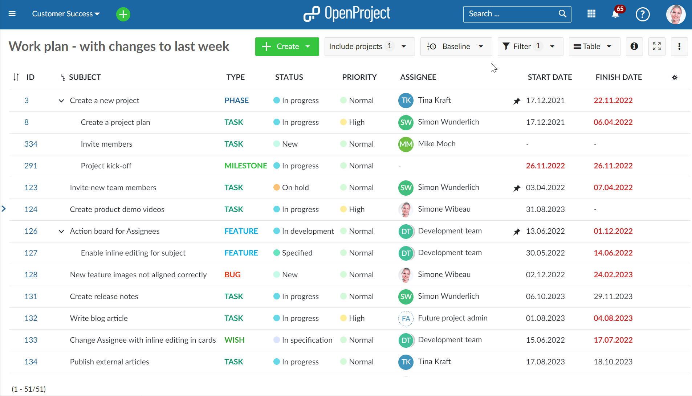
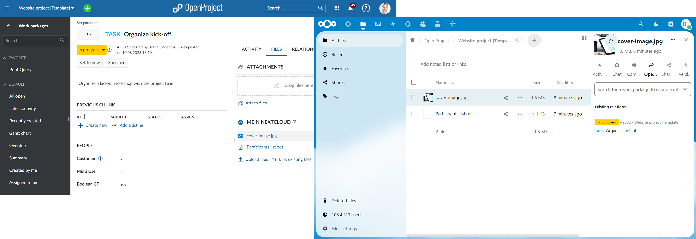
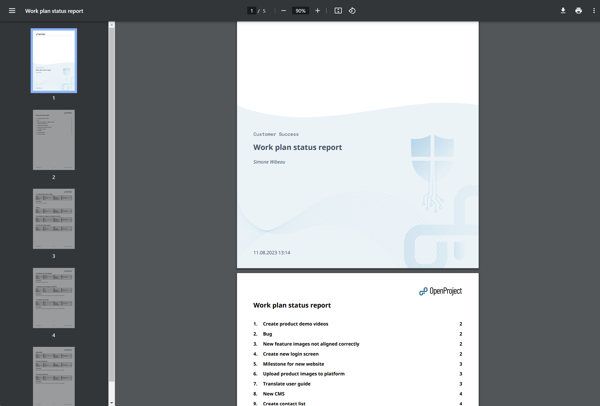
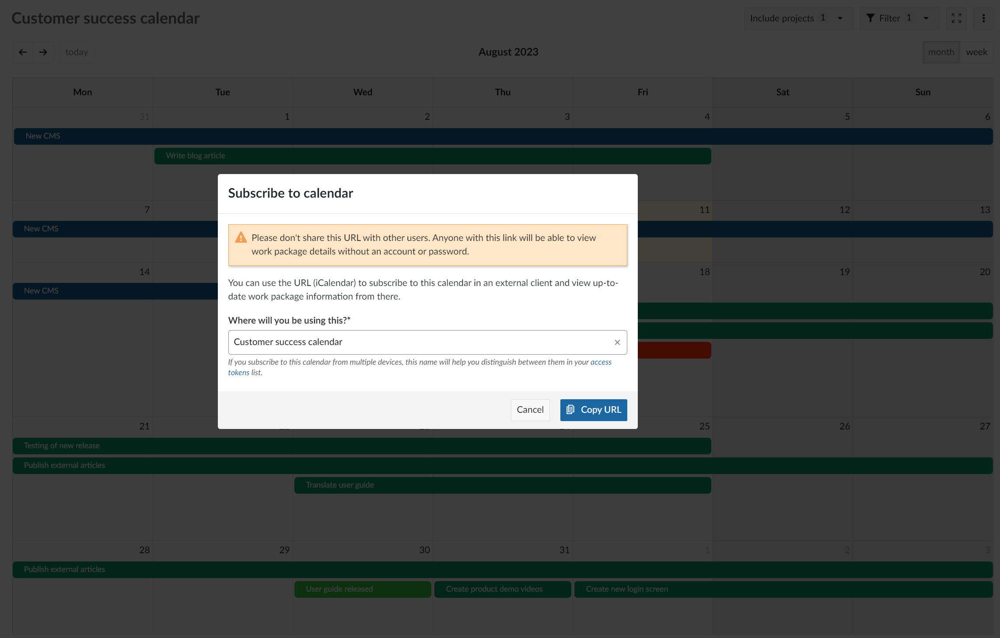
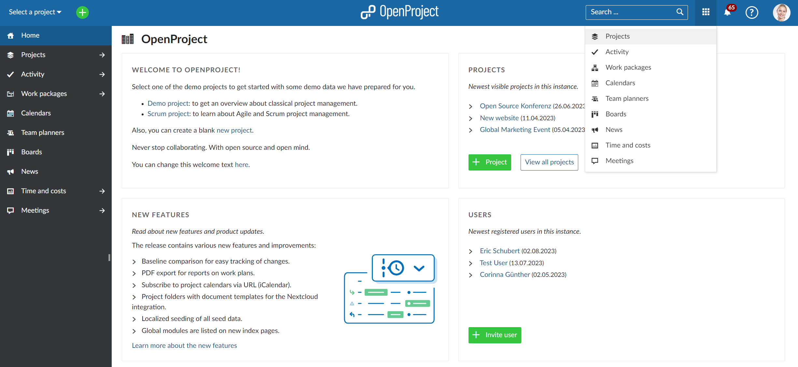
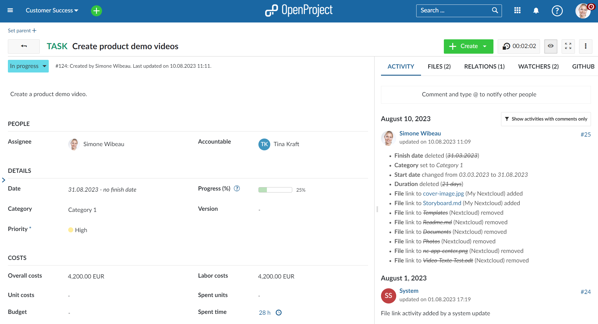
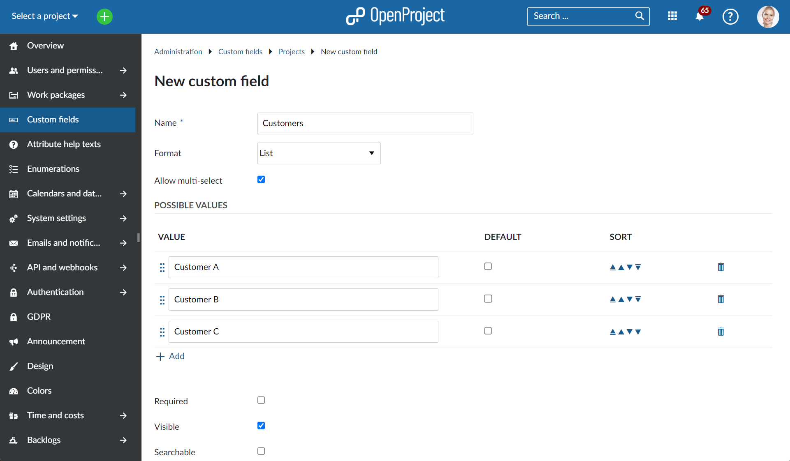

# OpenProject 13.0.0

Release date: 2023-08-21

We have released [OpenProject 13.0.0](https://community.openproject.org/versions/1656).

This version comes with a large number of new features, collaboration enhancements, and bug fixes. Among the highly anticipated project management features is the introduction of Baseline comparison. Nextcloud project folders will come with automatically managed permissions and the ability to set up project templates with a pre-defined folder structure and file templates linked to work packages. Subscribe to your OpenProject calendar, and generate work plans via the new PDF export.

Finally, as part of our commitment to the Community, we are pleased to announce that multi-select custom fields are now accessible in the free-of-charge Community version.

The release contains many more features, improvements, and bug fixes and we recommend updating to the newest version.

## Baseline comparison to track changes for your project (Enterprise add-on)

With the new Baseline comparison, you can get a quick overview of what has changed in your project over a specific time period. When you enable Baseline for a work package table, all changes for that view are displayed compared to a time period, a specific date, or within a specific time frame.  The changes are highlighted and you can see which work packages have been updated, added or removed in that view. This way you can easily report on the project progress and status.

The functionality **Show changes since Yesterday** is part of the free of charge Community version.

**Comparing changes to a certain period, a specific date, or between two specific dates**, is an Enterprise add-on and only available for the Enterprise cloud or on-premises versions.

## Nextcloud project folders with automatically managed permissions

With OpenProject 13.0 the Nextcloud integration has been enhanced with project folders. A new project folder is now set up in Nextcloud for a project, named after the project in OpenProject and automatically granting access to all project members.
Project folders allow setting up project templates with a pre-defined folder structure, including document templates. Links to files in work packages are copied and updated accordingly.

## PDF Export to create up-to-date and accurately formatted work plans

The PDF export has been updated to significantly improve the quality of project reports that can be created in OpenProject. With 13.0 you will be able to create clearly structured and beautifully designed work plans based on your work packages. The report is based on a work package table, which you can customize to fit your project needs, and includes a header table with work package attributes (defined by the work package table filters) and their detailed description. The new reports also contain a cover page and a table of contents with links back to the work packages in OpenProject.

## Subscribe to calendars via URL (iCalendar format)

You can now have all your OpenProject calendars with all important work packages and milestones integrated in your personal calendar. Subscribe to a calendar via URL and include this information in your personal calendar supporting the iCalendar format, such as such as Thunderbird,  Open-Xchange, Apple calendar or Google calendar.

## Global modules are listed on new index pages

With 13.0 we have added a new global menu to access all global modules for your projects. This provides a useful and intuitive overview of project information (e.g. for work packages, boards, team planners, or meetings) on a project-overarching level. You can create new elements for these respective modules directly from these global pages and assign them to a project.

## Time tracking button

We added a button that allows you to easily record the time spent on a work package. Pressing the button on the work package will start the timer. Your avatar in the header navigation will show the active time tracking. Clicking the button again will stop the time tracking and you can log the time spent on the work package.

## Multi-select custom fields for the Community

We are happy to announce that we have released the multi-select custom fields for the Community. Users of the free-of-charge Community version will now also be able to  configure multi-select custom fields for work packages or projects and add  them to the work packages forms.

## Further improvements, changes, and bug fixes

- Allow localized seeding of all seed data
- Show recently viewed work packages in the global search
- Add shortcut to “My activity” link in the account menu
- Enable “Copy link to clipboard” for work packages
- Enlarge the scroll handle for the work package sidebar
- Enable double click on notifications to open details view
- Add Emoji picker to the text editor
- Introduce Primer Design System

### List of all bug fixes and changes

- Epic: Share project calendars using the iCalendar format \[[#15339](https://community.openproject.org/wp/15339)\]
- Epic: Baseline: show changes in the work packages table \[[#26448](https://community.openproject.org/wp/26448)\]
- Epic: Allow localized seeding of all seed data \[[#36933](https://community.openproject.org/wp/36933)\]
- Epic: Project folders for file storages \[[#41400](https://community.openproject.org/wp/41400)\]
- Epic: Template folder and file structure for shared project folders  \[[#41545](https://community.openproject.org/wp/41545)\]
- Epic: PDF export of work plans \[[#46226](https://community.openproject.org/wp/46226)\]
- Epic: Global index pages for meetings, boards, team planner and calendar \[[#47850](https://community.openproject.org/wp/47850)\]
- Epic: Add a global sidebar for global modules: meetings, team planner, boards, work packages, news, costs and calendars \[[#48142](https://community.openproject.org/wp/48142)\]
- Epic: Create meetings, team planner and boards outside of a project from their global index pages \[[#48160](https://community.openproject.org/wp/48160)\]
- Epic: Introduce Primer DS \[[#48863](https://community.openproject.org/wp/48863)\]
- Changed: External Links new Tab \[[#29009](https://community.openproject.org/wp/29009)\]
- Changed: Button to start and stop Time Tracking \[[#29151](https://community.openproject.org/wp/29151)\]
- Changed: Allow saving formattable fields (Work package descriptions, comments, custom fields) with CTRL/CMD + ENTER \[[#33375](https://community.openproject.org/wp/33375)\]
- Changed: [Gantt-Chart] Scroll to Today's Position in non-auto-zoom mode \[[#40167](https://community.openproject.org/wp/40167)\]
- Changed: Activity tab details for links to Nextcloud files \[[#42368](https://community.openproject.org/wp/42368)\]
- Changed: Add packaged installation support for RHEL 9 \[[#44725](https://community.openproject.org/wp/44725)\]
- Changed: Add premium/enterprise feature icon also in the Project settings \[[#44963](https://community.openproject.org/wp/44963)\]
- Changed: Project status activity tracking \[[#44986](https://community.openproject.org/wp/44986)\]
- Changed: Project member navigates to project storage \[[#46242](https://community.openproject.org/wp/46242)\]
- Changed: Project member is directed to project folder \[[#46318](https://community.openproject.org/wp/46318)\]
- Changed: Project admin chooses between manual and automatic project folder \[[#46327](https://community.openproject.org/wp/46327)\]
- Changed: Project admin configures new project storage together with project folder \[[#46328](https://community.openproject.org/wp/46328)\]
- Changed: Automatic repair of missing or wrong permissions for project folders \[[#46329](https://community.openproject.org/wp/46329)\]
- Changed: Project members experience a fully automatically managed project folder \[[#46331](https://community.openproject.org/wp/46331)\]
- Changed: Journalize and display work package date changes caused by relations/children in the Activity tab  \[[#46481](https://community.openproject.org/wp/46481)\]
- Changed: Show changes frontend \[[#46674](https://community.openproject.org/wp/46674)\]
- Changed: Project activity: improve and extend how additional attributes are displayed \[[#46805](https://community.openproject.org/wp/46805)\]
- Changed: Add helper text to project member module \[[#46816](https://community.openproject.org/wp/46816)\]
- Changed: Non-working day settings: Move the arrows closer to the year  \[[#46885](https://community.openproject.org/wp/46885)\]
- Changed: Release "Multi-select custom fields" from Enterprise to Community \[[#47002](https://community.openproject.org/wp/47002)\]
- Changed: Reorganize some admin settings to have the calendar settings together \[[#47341](https://community.openproject.org/wp/47341)\]
- Changed: Access tokens settings improvement \[[#47512](https://community.openproject.org/wp/47512)\]
- Changed: Define mockups for non-Enterprise users for baseline comparison \[[#47725](https://community.openproject.org/wp/47725)\]
- Changed: Change Support link in application and re-name it from Professional support to Enterprise support \[[#47914](https://community.openproject.org/wp/47914)\]
- Changed: New loading indicator for OpenProject application  \[[#48211](https://community.openproject.org/wp/48211)\]
- Changed: Remove length constraints of time entry comment \[[#48244](https://community.openproject.org/wp/48244)\]
- Changed: Danger zone when deactivating a storage on a project \[[#48413](https://community.openproject.org/wp/48413)\]
- Changed: Update and replace icons related to Baseline \[[#48418](https://community.openproject.org/wp/48418)\]
- Changed: Sums table in work plan pdf export \[[#48420](https://community.openproject.org/wp/48420)\]
- Changed: Custom logo for the pdf export of work plans \[[#48421](https://community.openproject.org/wp/48421)\]
- Changed: The subject in the index of the PDF export is not a link (like the section number) \[[#48504](https://community.openproject.org/wp/48504)\]
- Changed: Support Emojis in the editor: inserted by typing identifiers based on Unicode Short Names preceded by a colon (:) \[[#48583](https://community.openproject.org/wp/48583)\]
- Changed: Automatic time tracking for work packages (start/stop buttons) \[[#48641](https://community.openproject.org/wp/48641)\]
- Changed: Manage long query titles in footer of pdf export \[[#48647](https://community.openproject.org/wp/48647)\]
- Changed: Filter attributes table in the pdf export \[[#48649](https://community.openproject.org/wp/48649)\]
- Changed: Show relevant attributes in file name of pdf export \[[#48652](https://community.openproject.org/wp/48652)\]
- Changed: Add export time into footer  \[[#48653](https://community.openproject.org/wp/48653)\]
- Changed: Add copy to clipboard button to work packages  \[[#48729](https://community.openproject.org/wp/48729)\]
- Changed: Add support for multi-value Version custom fields  \[[#48745](https://community.openproject.org/wp/48745)\]
- Changed: User interface for activating feature flags within the administration \[[#48815](https://community.openproject.org/wp/48815)\]
- Changed: Indent third level in index \[[#48816](https://community.openproject.org/wp/48816)\]
- Changed: Cover page for pdf reports \[[#48857](https://community.openproject.org/wp/48857)\]
- Changed: Add PDF Export of work plans to our documentation \[[#48862](https://community.openproject.org/wp/48862)\]
- Changed: Add support for packaged installation on Debian 12 \[[#48986](https://community.openproject.org/wp/48986)\]
- Changed: Add support for packaged installation on Centos / RHEL 9 \[[#48987](https://community.openproject.org/wp/48987)\]
- Changed: Fine-tuning of single work package pdf export \[[#49210](https://community.openproject.org/wp/49210)\]
- Changed: Delete project folders on project's storage deletion. \[[#49228](https://community.openproject.org/wp/49228)\]
- Changed: Delete project folders on project deletion \[[#49229](https://community.openproject.org/wp/49229)\]
- Changed: Delete project folders on storage deletion \[[#49234](https://community.openproject.org/wp/49234)\]
- Changed: iCalendar flow improvements and naming \[[#49247](https://community.openproject.org/wp/49247)\]
- Changed: Update NEW FEATURES teaser on application start page \[[#49301](https://community.openproject.org/wp/49301)\]
- Changed: Project folder health status \[[#49397](https://community.openproject.org/wp/49397)\]
- Fixed: Time and costs xls export should use configured date format in the file name \[[#35554](https://community.openproject.org/wp/35554)\]
- Fixed: [Global search] Searchable custom fields only searchable from within a project scope and not globally \[[#35804](https://community.openproject.org/wp/35804)\]
- Fixed: Confusing error shown when wiki page was edited in the meantime \[[#40427](https://community.openproject.org/wp/40427)\]
- Fixed: 500 error on force user language \[[#41275](https://community.openproject.org/wp/41275)\]
- Fixed: Cannot delete archived protected (on docker) \[[#41527](https://community.openproject.org/wp/41527)\]
- Fixed: Webhooks Documentation should be at the API and not in the Email and notifications \[[#44906](https://community.openproject.org/wp/44906)\]
- Fixed: No info about changes in activity when use checkbox in the custom field \[[#45011](https://community.openproject.org/wp/45011)\]
- Fixed: Time zone not saved to the selected value (time zone is the same but city is different) \[[#45745](https://community.openproject.org/wp/45745)\]
- Fixed: Azure endpoints are not using Microsoft Graph API, preventing email claims being shown in userinfo \[[#45832](https://community.openproject.org/wp/45832)\]
- Fixed: Budget does not get updated if we click fast on Submit after changing the number of units \[[#46301](https://community.openproject.org/wp/46301)\]
- Fixed: GitHub pull requests comments can have wrong link \[[#46316](https://community.openproject.org/wp/46316)\]
- Fixed: Filtering with two timestamps for custom field values wrongfully requires a work package to match at both timestamps \[[#46841](https://community.openproject.org/wp/46841)\]
- Fixed: Visibility check by project applied to current project instead of at timestamp  \[[#46883](https://community.openproject.org/wp/46883)\]
- Fixed: Date picker changes position while we change year \[[#47122](https://community.openproject.org/wp/47122)\]
- Fixed: Storage links must be placed between  "wiki" and "members". \[[#47507](https://community.openproject.org/wp/47507)\]
- Fixed: Files tab doesn't cache user info \[[#47518](https://community.openproject.org/wp/47518)\]
- Fixed: Status colored circles are no longer showing in Relations tab after 12.5 upgrade \[[#47610](https://community.openproject.org/wp/47610)\]
- Fixed: Move work package form fields to the bottom of label in very narrow screens (mobile) \[[#47680](https://community.openproject.org/wp/47680)\]
- Fixed: Configuration request fails for login_required=true \[[#47784](https://community.openproject.org/wp/47784)\]
- Fixed: Budget name does not update in Work Packages view upon Budget name change \[[#48048](https://community.openproject.org/wp/48048)\]
- Fixed: Baseline time zone label not vertically centered \[[#48239](https://community.openproject.org/wp/48239)\]
- Fixed: GitHub integration reference uses author instead of commenter \[[#48246](https://community.openproject.org/wp/48246)\]
- Fixed: Work package in query without timestamps have cached timestamps url parameter \[[#48248](https://community.openproject.org/wp/48248)\]
- Fixed: Archived subprojects appear in the subproject widget \[[#48327](https://community.openproject.org/wp/48327)\]
- Fixed: My Page: My spent time hows incorrect non-working days \[[#48328](https://community.openproject.org/wp/48328)\]
- Fixed: Error 500 on versions when Wiki page is linked \[[#48336](https://community.openproject.org/wp/48336)\]
- Fixed: Opening work packages in github tab from table with active baseline causes an internal error \[[#48362](https://community.openproject.org/wp/48362)\]
- Fixed: PDF export reports faulty interface usage \[[#48393](https://community.openproject.org/wp/48393)\]
- Fixed: Focus state is not present when editing a date or duration in date pickers \[[#48435](https://community.openproject.org/wp/48435)\]
- Fixed: crowdin source file for bim is not sent / retrieved from crowdin \[[#48450](https://community.openproject.org/wp/48450)\]
- Fixed: Error message "Timestamps contain forbidden values: oneDayAgo" for non-enterprise plan \[[#48566](https://community.openproject.org/wp/48566)\]
- Fixed: Work package moved out of project not returned \[[#48592](https://community.openproject.org/wp/48592)\]
- Fixed: Clear filter button is missing on Time and costs page \[[#48633](https://community.openproject.org/wp/48633)\]
- Fixed: Link to project missing in error message when deleting work package type  \[[#48642](https://community.openproject.org/wp/48642)\]
- Fixed: Style picture caption in PDF export \[[#48650](https://community.openproject.org/wp/48650)\]
- Fixed: +Member button missing on Members widget of the copied project \[[#48720](https://community.openproject.org/wp/48720)\]
- Fixed: Unable to edit CF as Value is required \[[#48725](https://community.openproject.org/wp/48725)\]
- Fixed: Baseline date picker in configuration modal almost hidden \[[#48865](https://community.openproject.org/wp/48865)\]
- Fixed: Change to assignee from unset to set is not displayed \[[#48866](https://community.openproject.org/wp/48866)\]
- Fixed: task page - tab selection is not available to assistive technologies \[[#48922](https://community.openproject.org/wp/48922)\]
- Fixed: Missing StorageType leads to server error in storage creation form \[[#48965](https://community.openproject.org/wp/48965)\]
- Fixed: Premium feature icon for Team planners visible on QA Edge \[[#49067](https://community.openproject.org/wp/49067)\]
- Fixed: Unable to clear/remove project on Move WP to another project form \[[#49109](https://community.openproject.org/wp/49109)\]
- Fixed: Missing link in Meetings Location \[[#49144](https://community.openproject.org/wp/49144)\]
- Fixed: Changed dates are misaligned with the other dates \[[#49245](https://community.openproject.org/wp/49245)\]
- Fixed: Enterprise edition screen unstructured \[[#49287](https://community.openproject.org/wp/49287)\]
- Fixed: In Notification center sidebar, "Reason" and "Unread by project" filters cannot be closed upon click on arrow \[[#49289](https://community.openproject.org/wp/49289)\]
- Fixed: Sidebar cannot be scrolled \[[#49313](https://community.openproject.org/wp/49313)\]
- Fixed: Custom fields missing in table view and full screen view \[[#49391](https://community.openproject.org/wp/49391)\]
- Fixed: Missing "s" on Admin Settings > Emails and notification \[[#49408](https://community.openproject.org/wp/49408)\]
- Fixed: Switching from custom view to built in view does not reset the baseline functionality \[[#49410](https://community.openproject.org/wp/49410)\]
- Fixed: (Dutch) Language incorrect. It says "blokeren" instead of "blokkeren". \[[#49412](https://community.openproject.org/wp/49412)\]
- Fixed: PDF export of descriptions - HTML in table with header column \[[#49425](https://community.openproject.org/wp/49425)\]
- Fixed: Existing file links wrongfully associated to next updating user  \[[#49452](https://community.openproject.org/wp/49452)\]
- Fixed: Saving email reminder settings fails when different date alert project overrides exist \[[#49487](https://community.openproject.org/wp/49487)\]
- Fixed: Work Packages Title and Description lost when clicking the expand Button \[[#49565](https://community.openproject.org/wp/49565)\]
- Fixed: Selected values are multiplied on CF multi-select \[[#49569](https://community.openproject.org/wp/49569)\]
- Fixed: (Mobile) "More" icon is no longer visible in vertical orientation \[[#49571](https://community.openproject.org/wp/49571)\]
- Fixed: (Mobile) Baseline mode indicator's left border not visible \[[#49572](https://community.openproject.org/wp/49572)\]
- Fixed: Hide automatically manged project folders if project has been archived. \[[#49579](https://community.openproject.org/wp/49579)\]
- Fixed: Seeding in another language does not translate role names, document categories, and color names \[[#49581](https://community.openproject.org/wp/49581)\]
- Fixed: Seeding in French fails because of database constraint on name length \[[#49583](https://community.openproject.org/wp/49583)\]
- Fixed: Sorting by project in global meetings index page raises a 500 error \[[#49585](https://community.openproject.org/wp/49585)\]
- Fixed: Error on custom action button when baseline is ON \[[#49588](https://community.openproject.org/wp/49588)\]
- Fixed: My activity page: Activities are shifted left, too close to Projects \[[#49595](https://community.openproject.org/wp/49595)\]
- Fixed: Cannot change the graph on Overview page from bar to something else \[[#49596](https://community.openproject.org/wp/49596)\]
- Fixed: Selected type chart is not fully visible - it's cut off \[[#49597](https://community.openproject.org/wp/49597)\]
- Fixed: Translation missing for tooltip on +Storage button \[[#49606](https://community.openproject.org/wp/49606)\]
- Fixed: PDF Export report fails with with an empty table \[[#49607](https://community.openproject.org/wp/49607)\]
- Fixed: Export modal can't handle temporary request failures \[[#49609](https://community.openproject.org/wp/49609)\]
- Fixed: Access to project folders for non members and admins. \[[#49623](https://community.openproject.org/wp/49623)\]
- Fixed: Nextcloud/Administration link is stripped when host has a subpath \[[#49630](https://community.openproject.org/wp/49630)\]
- Fixed: Sums table only shows total sum \[[#49690](https://community.openproject.org/wp/49690)\]
- Fixed: Pictures are not exported \[[#49692](https://community.openproject.org/wp/49692)\]

### Credits and contributions

A very special thank you goes to the following sponsors for features and improvements of this release:

- **Autoliv** for having sponsored the new Baseline comparison.
- The **City of Cologne** for their tremendous support and sponsorship of new features for the Nextcloud integration.
- The **Federal Ministry of the Interior and Community (BMI)** as part of the openDesk (formerly Sovereign Workplace) for sponsoring big parts of this release, e.g. new features for the Nextcloud integration, the new PDF export of work plans, iCalendar subscriptions, and localized seeding of all seed data.

A big thanks to Community members for reporting bugs and helping us identifying and providing fixes:

Tobias Nöbauer, K T, Various Interactive, Thyago Sanabio, Piotr F, Sven Kunze, Gerrit Bonn, Aidas Kasparas, Christina Vechkanova, Rince wind, James Neale, Daniel Wilke, Philipp Schulz, Heather Burns, M S.

And last but not least, a big thank you to the entire OpenProject team.
