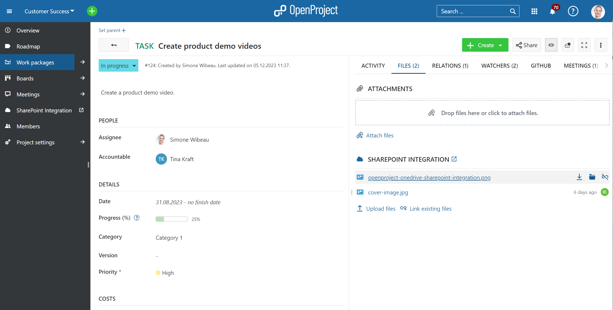
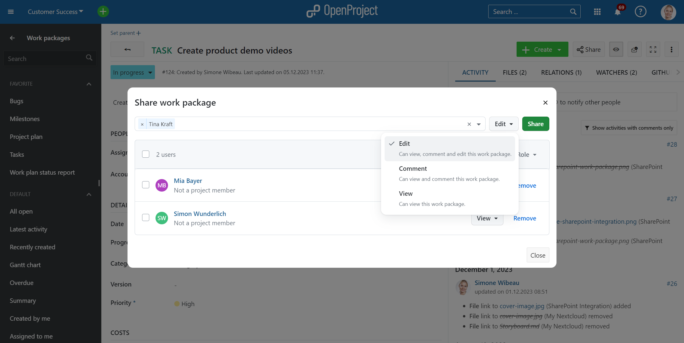
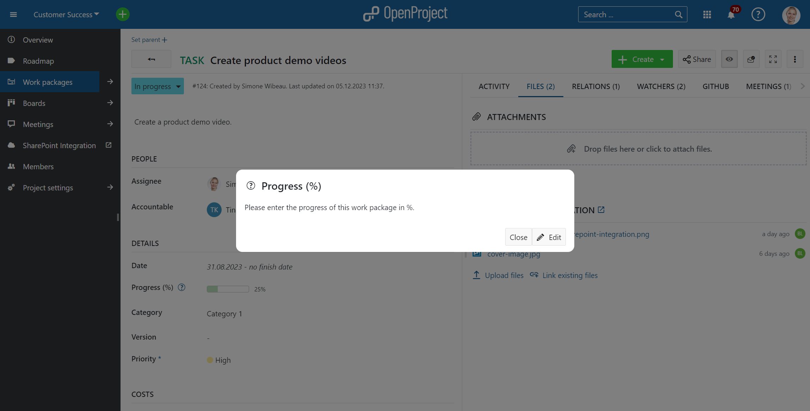
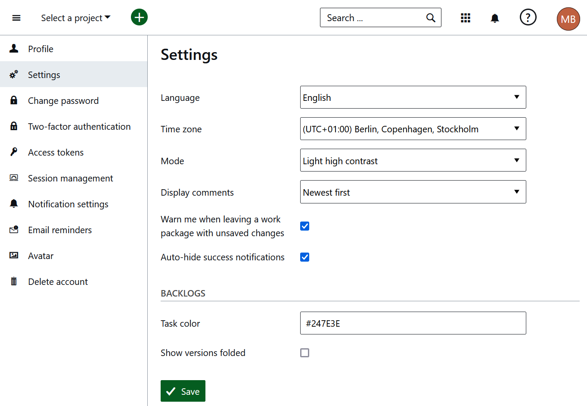

# OpenProject 13.1.0

Release date: 2023-12-13

We released [OpenProject 13.1.0](https://community.openproject.org/versions/1486).

It brings significant enhancements in our **Meetings module** and various minor adjustments, such as the integration of **Primer design system** and the introduction of a **high contrast mode** to enhance OpenProject's accessibility.

For enterprise users, two additional features have been introduced to streamline workflow efficiency within OpenProject: the capability to **share work packages externally** and the debut of a **OneDrive/SharePoint integration**.

As always, this release contains several bug fixes and we recommend updating to the newest version.

## Dynamic meetings and agenda items linked to work packages

You probably already know OpenProject's Meetings module. Formerly, this module restricted users to creating meeting agendas in a single text block. OpenProject 13.1 enables the **creation and management of individual agenda items**.  This includes **creating direct links to specific meetings from a work package** and provides a comprehensive overview of  the discussions and links directly to the meeting associated with the  work package.

This feature, designed with the latest Primer UI components and UX  patterns, is funded by the German Federal Ministry of the Interior and  Home Affairs (BMI) as part of the [openDesk](https://www.openproject.org/blog/sovereign-workplace/) project.

> Please note: The already existing classic meetings will be removed with one of the upcoming releases and only the new dynamic meetings will remain.  Migrations will be provided.

See our user guide to learn more about the [updated meetings module and how to use it](../../user-guide/meetings/dynamic-meetings/).

## OneDrive/SharePoint integration (Enterprise add-on)

OpenProject already offered the file sharing integration with Nextcloud. However, we recognized that  some customers use other document storage solutions, such as Microsoft  SharePoint. This is why, alongside the already existing integration with Nextcloud, OpenProject 13.1 brings the new file sharing integration with OneDrive/SharePoint as an Enterprise add-on. This feature allows you to easily upload, link, and access SharePoint files directly from your work packages.

See our user guide to learn more about this Enterprise add-on and how to [use the SharePoint integration](../../user-guide/file-management/one-drive-integration/).

## Share work packages with external users and groups (Enterprise add-on)

With OpenProject 13.1 it is possible to share work packages with users and/or groups outside of your installation. This  sharing feature is available as an Enterprise add-on. Work packages can now be shared with users or groups that have no  permissions to see a particular project in its entirety, only allowing access to relevant work packages. This way, stakeholders can get easy access to relevant  project information without having to see all of a project’s work  packages.

See the user guide for [instructions on how to use this new feature](../../user-guide/work-packages/share-work-packages/).

## Attribute help texts are released into Community edition

With OpenProject 13.1, we released [Attribute help texts](../../system-admin-guide/attribute-help-texts/) for the Community edition. This allows providing explanatory help text for all project attributes, such as status, accountable or any custom field. The help text will be displayed as a small question mark icon beside the attribute, simplifying the input process and helping to avoid mistakes.

## Accessibility improvements and high contrast mode

We continued to work on improving accessibility of OpenProject according to the WCAG 2.1 AA. You can now select to use a high contrast mode in your [profile settings](../../user-guide/my-account/#select-the-high-contrast-color-mode), which will override the current OpenProject theme and be especially valuable for OpenProject users with visual impairments.

## Continued integration of Primer design system

With OpenProject 13.1 we have continued to integration the [Primer Design system](https://primer.style/). This will especially be noticeable in the new features, such as the new Meetings module.

## Discontinued support for Centos7 and SLES12

Support for packaged installations on Centos7 and SUSE Enterprise Linux 12 have been removed in 13.1.0 Both are nearing or have exceeded their EOL and packaged builds were failing prior to the release already. We will not provide additional support for these systems.

Users still required to run on these systems should consider upgrading to a supported version, or use our docker-based installation methods.

For more information, please see [#51333](https://community.openproject.org/projects/openproject/work_packages/51533/activity) and our [installation guides](../../installation-and-operations/installation/).

## List of all bug fixes and changes

- Epic: Share work packages with external users and groups that are not member of the project team \[[#31150](https://community.openproject.org/wp/31150)\]
- Epic: Link work packages with files and folders in OneDrive/SharePoint \[[#36057](https://community.openproject.org/wp/36057)\]
- Epic: Dynamic meetings and agenda items linked to work packages \[[#37297](https://community.openproject.org/wp/37297)\]
- Epic: File Storages - Administration settings with Primer \[[#49841](https://community.openproject.org/wp/49841)\]
- Changed: Allow attachment upload on read-only work packages \[[#29203](https://community.openproject.org/wp/29203)\]
- Changed: Allow filtering of "empty" date fields (start/finish/custom) \[[#39455](https://community.openproject.org/wp/39455)\]
- Changed: Meeting module: Modes and permission levels \[[#49334](https://community.openproject.org/wp/49334)\]
- Changed: Workflow for sharing work packages \[[#49482](https://community.openproject.org/wp/49482)\]
- Changed: Upload custom picture for cover page of pdf export \[[#49684](https://community.openproject.org/wp/49684)\]
- Changed: Meetings tab on work package page  \[[#49951](https://community.openproject.org/wp/49951)\]
- Changed: PDF export (single work package): Include all attributes and fields according to the work package type form configuration \[[#49977](https://community.openproject.org/wp/49977)\]
- Changed: Make the seed data in the teaser sections "Welcome to OpenProject" more robust for user that do not have the correct permissions \[[#50070](https://community.openproject.org/wp/50070)\]
- Changed: Skip project selection step in onboarding tour \[[#50073](https://community.openproject.org/wp/50073)\]
- Changed: Activate meeting module and one meeting "weekly" to the seed data \[[#50132](https://community.openproject.org/wp/50132)\]
- Changed: Update project deletion danger zone to include project folders as a dependent relation \[[#50233](https://community.openproject.org/wp/50233)\]
- Changed: [API] Add storage filter to project and project storage collection \[[#50234](https://community.openproject.org/wp/50234)\]
- Changed: Ensuring connection and permissions on project folder while redirecting users to Nextcloud/OneDrive from project menu. \[[#50437](https://community.openproject.org/wp/50437)\]
- Changed: Optionally allow locked/closed versions for custom field \[[#50526](https://community.openproject.org/wp/50526)\]
- Changed: Hide the sidebar in all tappable screens (tablet and mobile) \[[#50652](https://community.openproject.org/wp/50652)\]
- Changed: Revise permissions for seeded roles \[[#50827](https://community.openproject.org/wp/50827)\]
- Changed: Equals All (&=) operator for user action filter on project collection \[[#50910](https://community.openproject.org/wp/50910)\]
- Changed: Present the storage health information on the admin page \[[#50921](https://community.openproject.org/wp/50921)\]
- Changed: Show work package's meeting tab count \[[#51012](https://community.openproject.org/wp/51012)\]
- Changed: Mobile, the participant section should move to details section \[[#51015](https://community.openproject.org/wp/51015)\]
- Changed: Show identity_url in users edit form \[[#51027](https://community.openproject.org/wp/51027)\]
- Changed: Update strings for user role/status line in share work package modal \[[#51165](https://community.openproject.org/wp/51165)\]
- Changed: openDesk: Navigation quick wins \[[#51264](https://community.openproject.org/wp/51264)\]
- Changed: Add Enterprise Banner and checks for OneDrive/SharePoint file storage integration \[[#51305](https://community.openproject.org/wp/51305)\]
- Changed: Move the custom Help Texts to Community edition \[[#51306](https://community.openproject.org/wp/51306)\]
- Changed: Redirect uri flow \[[#51372](https://community.openproject.org/wp/51372)\]
- Changed: Display since when a failure state is occurring \[[#51423](https://community.openproject.org/wp/51423)\]
- Fixed: Unable to mention User when name display is lastname, firstname \[[#43856](https://community.openproject.org/wp/43856)\]
- Fixed: Total progress does not change color \[[#44859](https://community.openproject.org/wp/44859)\]
- Fixed: Work-package relationship are lost when copying \[[#45533](https://community.openproject.org/wp/45533)\]
- Fixed: No reCAPTCHA during user registration \[[#47796](https://community.openproject.org/wp/47796)\]
- Fixed: Work package can be only once modified in the calendar on Overview page, error on 2nd time \[[#48333](https://community.openproject.org/wp/48333)\]
- Fixed: Save Team Planner view as 2 weeks view not only 1 week view. \[[#48355](https://community.openproject.org/wp/48355)\]
- Fixed: Roadmap: Cannot deselect subprojects on roadmap page \[[#49135](https://community.openproject.org/wp/49135)\]
- Fixed: Work Package Roles shown as options in "Assignee's role" filter \[[#49987](https://community.openproject.org/wp/49987)\]
- Fixed: Wiki: embedded work package table: filter on (deleted) subprojects prevents editing  \[[#50080](https://community.openproject.org/wp/50080)\]
- Fixed: Breadcrumb and menu structure is inconsistent for user administration \[[#50109](https://community.openproject.org/wp/50109)\]
- Fixed: When disabling the default `admin` user, after an update two `admin` users exists in the database. \[[#50208](https://community.openproject.org/wp/50208)\]
- Fixed: Missing space between avatars and usernames in Administration -> Users \[[#50213](https://community.openproject.org/wp/50213)\]
- Fixed: Custom export cover background overlay color won't return to the default one after deleting \[[#50219](https://community.openproject.org/wp/50219)\]
- Fixed: Custom actions still shown on WP page after switching from Enterprise free trial to Community \[[#50237](https://community.openproject.org/wp/50237)\]
- Fixed: Unexpected default value for limit_self_registration option of omniauth providers \[[#50432](https://community.openproject.org/wp/50432)\]
- Fixed: Attribute help text icon overlaps with the field \[[#50436](https://community.openproject.org/wp/50436)\]
- Fixed: Removing "use_graph_api" in azure form does not unset it \[[#50448](https://community.openproject.org/wp/50448)\]
- Fixed: Global and Admin hamburger menu is missing \[[#50758](https://community.openproject.org/wp/50758)\]
- Fixed: iCalender are not updated automatically \[[#50768](https://community.openproject.org/wp/50768)\]
- Fixed: Default activity assigned in project where it is inactive breaks time tracking button \[[#50784](https://community.openproject.org/wp/50784)\]
- Fixed: Starting Guided Tour (from the Scrum project) does not work for non-admin \[[#50881](https://community.openproject.org/wp/50881)\]
- Fixed: PDF Export not using default export filename sanitation \[[#50912](https://community.openproject.org/wp/50912)\]
- Fixed: [Error 500] occurs when switching to "ALL" result when searching for "meeting" word in Chinese/Korean/Japanese language in all projects \[[#50972](https://community.openproject.org/wp/50972)\]
- Fixed: In the global calendar create form invalid projects are selectable \[[#50995](https://community.openproject.org/wp/50995)\]
- Fixed: In work packages list, selecting first option of "group by" does not work \[[#51135](https://community.openproject.org/wp/51135)\]
- Fixed: No free sorting of enumerations \[[#51183](https://community.openproject.org/wp/51183)\]
- Fixed: Primer checkboxes lack a background in High Contrast Mode \[[#51275](https://community.openproject.org/wp/51275)\]
- Fixed: Edit project storage leads to project folder for one drive storages \[[#51319](https://community.openproject.org/wp/51319)\]
- Fixed: Disk shown on checkmark list's second level \[[#51401](https://community.openproject.org/wp/51401)\]
- Fixed: Date field on work package too narrow \[[#51402](https://community.openproject.org/wp/51402)\]
- Fixed: Nextcloud storage not displayed in Files tab for users with edit rights \[[#51404](https://community.openproject.org/wp/51404)\]
- Fixed: Upon submitting the general info the storage view component is nested \[[#51411](https://community.openproject.org/wp/51411)\]
- Fixed: Lines not aligned with text on the login screen \[[#51412](https://community.openproject.org/wp/51412)\]
- Fixed: Search not working on some meetings (possibly because of agenda items containing macros) \[[#51426](https://community.openproject.org/wp/51426)\]
- Fixed: Overview page suggests some information (e.g. custom fields, status, description) not set when they are hidden \[[#51431](https://community.openproject.org/wp/51431)\]

## Contributions

A very special thank you goes to our sponsors for features and improvements of this release:

- **Deutsche Bahn** – for the OneDrive/SharePoint integration
- **AMG** – for the feature to share work packages
- **German Federal Ministry of the Interior and Home Affairs (BMI)** – for the dynamic meetings module and the accessibility test and improvements

A big thanks to Community members for reporting bugs and helping us identifying and providing fixes:

Jeff Tseung, Richard Richter, Daniel Elkeles, Jörg Mollowitz, Christina Vechkanova, Sven Kunze, Jeff Li, Mario Haustein, Mario Zeppin.

A big thank you to every other dedicated user who has [reported bugs](../../development/report-a-bug), supported the community by asking and answering questions in the [forum](https://community.openproject.org/projects/openproject/boards) and provided translations on [CrowdIn](https://crowdin.com/projects/opf).
