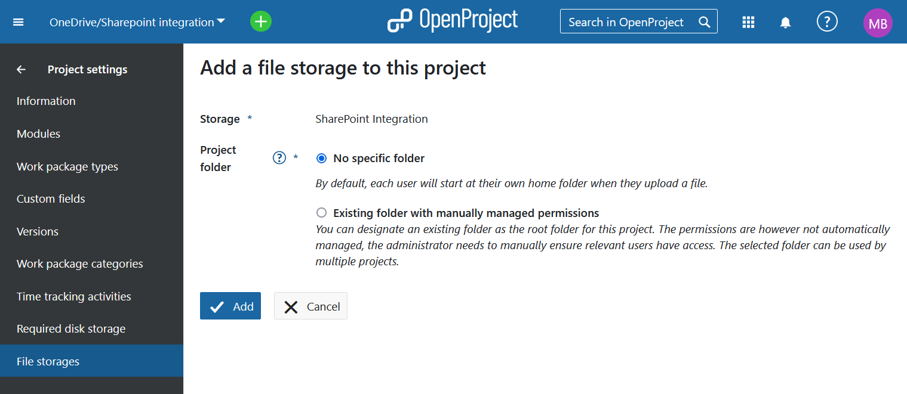
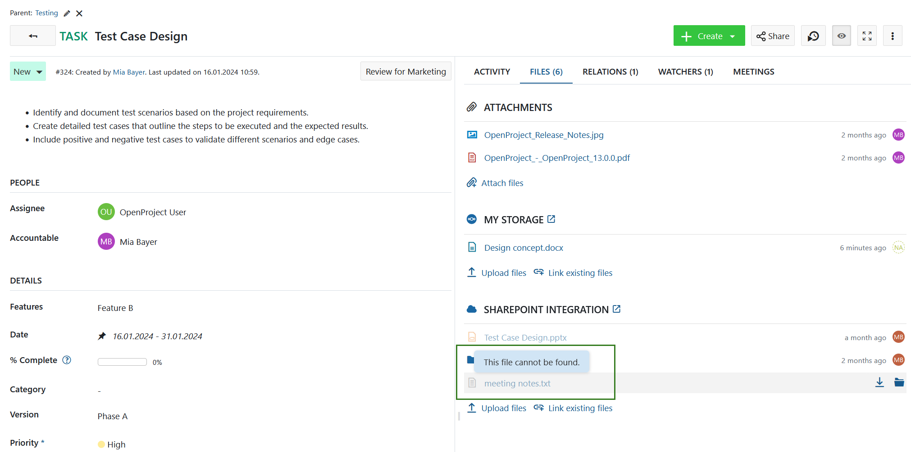
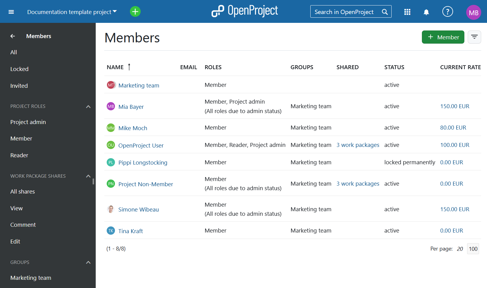
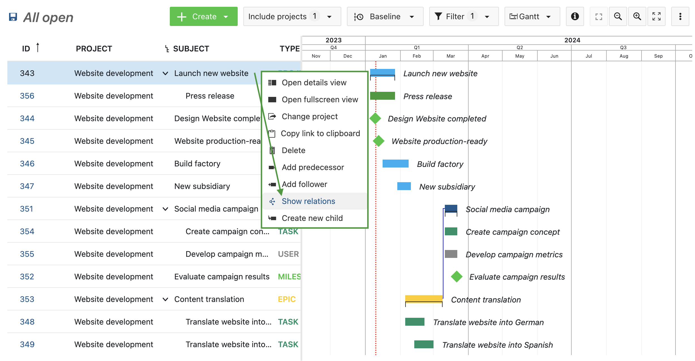

# OpenProject 13.2.0

Release date: 2023-01-17

We released [OpenProject 13.2.0](https://community.openproject.com/versions/1979).

It brings improvements for the **OneDrive/SharePoint integration**, now also allowing **Manual project folders**. In addition to that, both OneDrive/SharePoint and Nextcloud integrations were improved by **showing deleted files in OpenProject work packages**.

We also added the option to **filter the project member list**, allowing project administrators to easily filter through the project member lists based on various roles, groups and shares. Instance administrators can now also allow for users to **change work package status without the rights to edit a work package**. 

Furthermore, it is now **possible to set users with whom a work package has been shared as assignees or responsible**. The **quick content menu** in the Gantt view has now shows work package relations. 

Finally, **several fields were renamed**: 

- **Estimated time** is now called Work (calculation of **Work** has also been updated)
- **Remaining hours** is now called Remaining work (calculation of **Remaining work** has also been updated)
- **Progress (%)** is now called **% Complete**

As always, this release contains several bug fixes and we recommend updating to the newest version.

## Manual project folders for OneDrive/SharePoint storages (Enterprise Add-On)

With OpenProject 13.2, manual project folders have become available for OneDrive/SharePoint storage, further improving access to essential project files. 

When project folders are configured, all project-related files are automatically uploaded and organized within the specified folder. To activate project folders, administrators are required to designate the desired folder as the project folder and manually configure the associated permissions. This feature enhances user convenience and file organization within the OpenProject environment.

See our user guide to learn more about this Enterprise add-on and how to [use the SharePoint integration](../../user-guide/file-management/one-drive-integration/).

## Show file links of files that are not available to the user in the cloud storage

In 13.2 we improved the functionality of file storages. Even if a file has been deleted on a file storage, it will still be displayed under the Files tab in OpenProject work packages, allowing users to better keep track of project files. 

This new feature is available for [both file storage integrations](../../user-guide/file-management). 

## Filter for roles, groups, and shares in the project members list
With OpenProject 13.2, project administrators can filter the list of project member based on user roles, groups, and shared work packages. This enables administrators to promptly identify others with  administrative roles or individuals outside the project team who have  gained access through the newly introduced Sharing feature. 

Read more about filtering the project members list in our [user guide](../../user-guide/members/#project-members-overview). 

## Allow assignee and accountable for shared work packages (Enterprise add-on)

In OpenProject 13.1, we introduced the work package sharing feature with external users. In the 13.2 release, these shared users can now be designated as assignees and accountable for the work packages that have been shared with them. This is useful for teams collaborating with external partners who cannot access sensitive project data but still require access to specific tasks within the project.

Learn more about our [Sharing work packages (Enterprise add-on)](../../user-guide/work-packages/share-work-packages/).

## Status change without rights to edit a work package

In OpenProject 13.2, the ability to modify the status of a work package is now separated from the broader "Edit work package" permission. This separation means that a user can be granted the right to change the status without having the permission to edit the entire work package.

Read more about [roles and permissions for users of OpenProject](../../system-admin-guide/users-permissions/roles-permissions/).

## Quick context menu in Gantt view: Show relations

Quick context menu in the Gantt view now includes "Show relations" option. It displays all existing relations for the selected work package. 

Please note that these option is only available if you have selected a Gantt view (i.e. not a table or cards view). 

Read more about [Gantt charts in OpenProject](../../docs/user-guide/gantt-chart/)

## New field names and calculation of work and remaining work
Several field names were changed in OpenProject 13.2.

- **Estimated time** is now called Work
- **Remaining hours** is now called Remaining work 
- **Progress (%)** is now called **% Complete**

Furthermore, the calculation of **Work** and **Remaining work** has been modified, now featuring a sum value (∑) displayed in the "work" and "remaining work" fields. This sum shows the total value of all child elements within the work package, including the work package itself.

Please note that **% Complete** does not yet automatically adjust when the values of **Work** or **Remaining work** are changed. This functionality is planned for future releases.

## Bug fixes and changes

- Fixed: Project "Members" list names groups that are irrelevant for the project \[[#47613](https://community.openproject.com/wp/47613)\]
- Fixed: Dismiss action of the primer banner is not translated \[[#51360](https://community.openproject.com/wp/51360)\]
- Fixed: In mobile view, the primer banner does not take the full width \[[#51370](https://community.openproject.com/wp/51370)\]
- Fixed: Project.visible scope slower than it should be \[[#51706](https://community.openproject.com/wp/51706)\]
- Fixed: The Access Token expiry date not updated on refresh for FileStorage tokens \[[#51749](https://community.openproject.com/wp/51749)\]
- Changed: Shared with users can become assignee of the work package \[[#49527](https://community.openproject.com/wp/49527)\]
- Changed: Allow status change without Edit WP rights \[[#50849](https://community.openproject.com/wp/50849)\]
- Changed: Change calculation and name of Work and Remaining work \[[#50953](https://community.openproject.com/wp/50953)\]
- Changed: Rename fields to Work, Remaining Work, and % Complete in UI \[[#50955](https://community.openproject.com/wp/50955)\]
- Changed: Gantt: shorten menu and add "Show relations" action \[[#51170](https://community.openproject.com/wp/51170)\]
- Changed: Enable manual project folders for OneDrive/SharePoint storages \[[#51362](https://community.openproject.com/wp/51362)\]
- Changed: Filter project member list \[[#51484](https://community.openproject.com/wp/51484)\]
- Changed: Teaser the share feature in the Community edition \[[#51704](https://community.openproject.com/wp/51704)\]
- Changed: Show file links of files that are not available to the user in the cloud storage \[[#52013](https://community.openproject.com/wp/52013)\]

### Contributions

A very special thank you goes to our sponsors for features and improvements of this release:

- **AMG** - for the advanced filters for project members lists
- **Deutsche Bahn** - for the manual project folders for OneDrive/SharePoint integration 
- **German Federal Ministry of the Interior and Home Affairs (BMI)** - for the improvements to progress reporting

A big thanks to Community members for reporting bugs and helping us identifying and providing fixes, especially to Arun M, Patrick Massé and Richard Richter.

A big thank you to every other dedicated user who has [reported bugs](https://www.openproject.org/docs/development/report-a-bug), supported the community by asking and answering questions in the [forum](https://community.openproject.org/projects/openproject/boards) and provided translations on [CrowdIn](https://crowdin.com/projects/opf).
