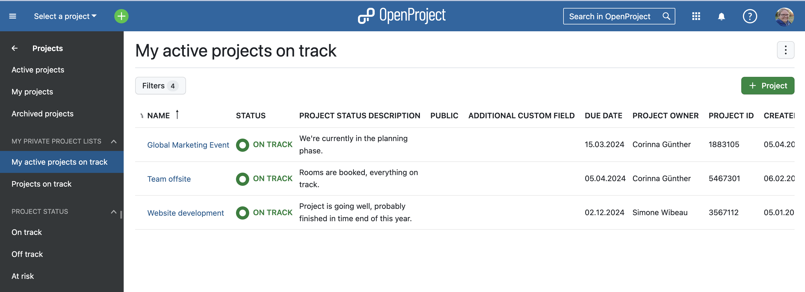
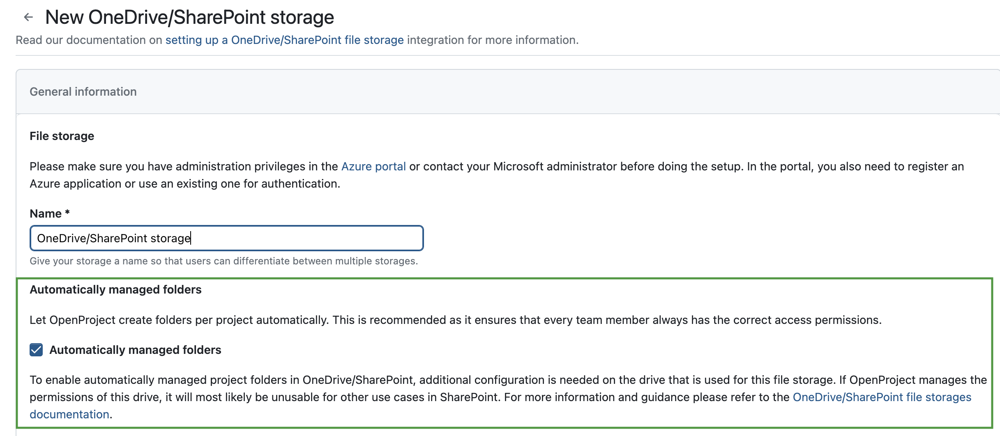

# OpenProject 13.3.0

Release date: 2024-02-14

We released [OpenProject 13.3.0](https://community.openproject.org/versions/1487).
The release contains several bug fixes and we recommend updating to the newest version.

## New features

In addition to other changes, OpenProject version 13.3 includes the following three important features:

### Separate Gantt charts module

One major change is the relocation of the Gantt views to a separate module. Please note that with OpenProject 13.3 all saved work package queries (private or public) with an activated Gantt view moved to the new Gantt charts module.

You can navigate to the new Gantt chart module either via the side menu in a project or via the global menu:

The view button from the work package module is now only present in the BIM version of OpenProject and only for switching from the list to the cards view.

### Filter and save custom project lists

OpenProject has enhanced the project filter list view and now lets you create custom project lists by saving your preferred filter settings. Please note that in future releases, the project lists will be further improved and additional features will be added.

### OneDrive/SharePoint integration: Automatically managed project folders (Enterprise add-on)

With this release, admins of an Enterprise edition can choose between manually or automatically managed project folders. If you select the latter, all project members are automatically granted access to the project folder.

---

[See our blog](https://www.openproject.org/blog/openproject-13-3-release/) to learn more about features we included in OpenProject 13.3. You can find a detailed list of all new features and bugfixes below.

## All features and bug fixes

- Feature: Separate Gantt charts module \[[#32764](https://community.openproject.org/wp/32764)\]
- Feature: Automatically managed project folders with SharePoint \[[#50988](https://community.openproject.org/wp/50988)\]
- Bugfix: PDF doesn't contain cell color \[[#47169](https://community.openproject.org/wp/47169)\]
- Bugfix: Wrong arabic date format and calender error \[[#48834](https://community.openproject.org/wp/48834)\]
- Bugfix: Labels on radio buttons are not clickable on File storages page \[[#49328](https://community.openproject.org/wp/49328)\]
- Bugfix: Slow performance after upgrade to version 13 \[[#50850](https://community.openproject.org/wp/50850)\]
- Bugfix: Delete work package API requires content-type header \[[#51317](https://community.openproject.org/wp/51317)\]
- Bugfix: Meetings: Title of linked work packages are truncated too early \[[#51619](https://community.openproject.org/wp/51619)\]
- Bugfix: Lookbook is broken \[[#51787](https://community.openproject.org/wp/51787)\]
- Bugfix: Anonymous Users (without signing in) cannot load board content \[[#51850](https://community.openproject.org/wp/51850)\]
- Bugfix: Misalignment in the dropdown on searching work packages \[[#51948](https://community.openproject.org/wp/51948)\]
- Bugfix: Remove color in share modal is not correct \[[#52012](https://community.openproject.org/wp/52012)\]
- Bugfix: Timeouts as non privileged users \[[#52022](https://community.openproject.org/wp/52022)\]
- Bugfix: WorkPackage query with baseline filter takes too much time for non-admins \[[#52156](https://community.openproject.org/wp/52156)\]
- Bugfix: Multi-select user custom field broken in table \[[#52289](https://community.openproject.org/wp/52289)\]
- Bugfix: \[AppSignal\] undefined method status for HTTPX::ErrorResponse \[[#52446](https://community.openproject.org/wp/52446)\]
- Bugfix: Global group memberships not correctly inherited to all members \[[#52528](https://community.openproject.org/wp/52528)\]
- Bugfix: Internal server error when opening sprint wiki \[[#52530](https://community.openproject.org/wp/52530)\]
- Bugfix: Users can enter any work package id when setting a work package's parent \[[#52556](https://community.openproject.org/wp/52556)\]
- Bugfix: User activity feed should only show the activities of the user \[[#52561](https://community.openproject.org/wp/52561)\]
- Bugfix: Error "0: Unknown error" when request is cancelled \[[#52562](https://community.openproject.org/wp/52562)\]
- Bugfix: Untranslated work package roles \[[#52598](https://community.openproject.org/wp/52598)\]
- Bugfix: User invitations via members screen no longer working \[[#52606](https://community.openproject.org/wp/52606)\]
- Bugfix: Users involved in work packages sharing are duplicated in project storage members list.  \[[#52673](https://community.openproject.org/wp/52673)\]
- Bugfix: Forbidden access error when accessing public work package anonymously \[[#52752](https://community.openproject.org/wp/52752)\]
- Bugfix: Incorrect CSP for Nextcloud storage configured with non-standard port \[[#52779](https://community.openproject.org/wp/52779)\]
- Feature: Nudge admin to go through OAuth flow \[[#49396](https://community.openproject.org/wp/49396)\]
- Feature: "% Complete" field split to own value and derived value \[[#51188](https://community.openproject.org/wp/51188)\]
- Feature: Adapt onboarding tour to new Gantt module \[[#51354](https://community.openproject.org/wp/51354)\]
- Feature: Add column "Shared with" in the work packages table \[[#51491](https://community.openproject.org/wp/51491)\]
- Feature: Show number of "Shared users" in the share button \[[#51492](https://community.openproject.org/wp/51492)\]
- Feature: Have persisted project lists (only filters) \[[#51666](https://community.openproject.org/wp/51666)\]
- Feature: Add and remove user from automatically managed folders on SharePoint/OneDrive \[[#51711](https://community.openproject.org/wp/51711)\]
- Feature: Add, remove and rename folders in SharePoint/OneDrive \[[#51712](https://community.openproject.org/wp/51712)\]
- Feature: Background cron sync job \[[#51714](https://community.openproject.org/wp/51714)\]
- Feature: Move filters toggle and "+Project"-Button from header into content \[[#51778](https://community.openproject.org/wp/51778)\]
- Feature: User identifier saved in OAuthToken \[[#51783](https://community.openproject.org/wp/51783)\]
- Feature: Create/edit SharePoint/OneDrive storages for automatically managed folders \[[#51841](https://community.openproject.org/wp/51841)\]
- Feature: Add link from work / estimated work sum to detailed query view \[[#52076](https://community.openproject.org/wp/52076)\]
- Feature: Make renamed attributes searchable with old names ("% complete", "work" and "remaining work") \[[#52119](https://community.openproject.org/wp/52119)\]
- Feature: Clean menu structure on project lists page \[[#52149](https://community.openproject.org/wp/52149)\]
- Feature: Remove Derived remaining work from Work package form configuration \[[#52252](https://community.openproject.org/wp/52252)\]
- Feature: Maintain manually managed project folder on project copy for SharePoint/OneDrive \[[#52363](https://community.openproject.org/wp/52363)\]
- Feature: Rename "Managed folder status" heading in Storage form \[[#52456](https://community.openproject.org/wp/52456)\]

## Contributions

A very special thank you goes to our sponsors for features and improvements of this release:

- BMI for sponsoring the features on progress reporting and Gantt charts (which will be continued in the following releases)
- City of Cologne for sponsoring the new features for the project lists
- Deutsche Bahn for sponsoring the OneDrive/SharePoint integration

We also want to thank our Community members, particularly James Neale, TARIQ YASIN, Jeff Li, Christian Jeschke, Sreekanth Gopalakris, Jörg Mollowitz, Sven Kunze, Steffen Kirschke, and Valeria Aguzzi for reporting bugs and helping us identify and provide fixes.

A big thank you to every other dedicated user who has [reported bugs](../../development/report-a-bug), supported the community by asking and answering questions in the [forum](https://community.openproject.org/projects/openproject/boards) and provided translations on [CrowdIn](https://crowdin.com/projects/opf).
