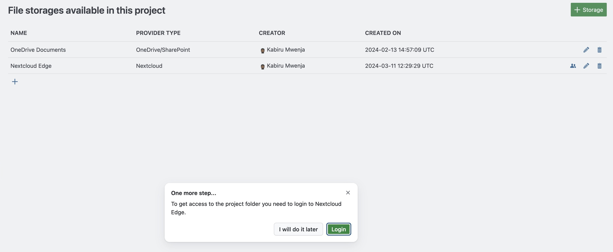
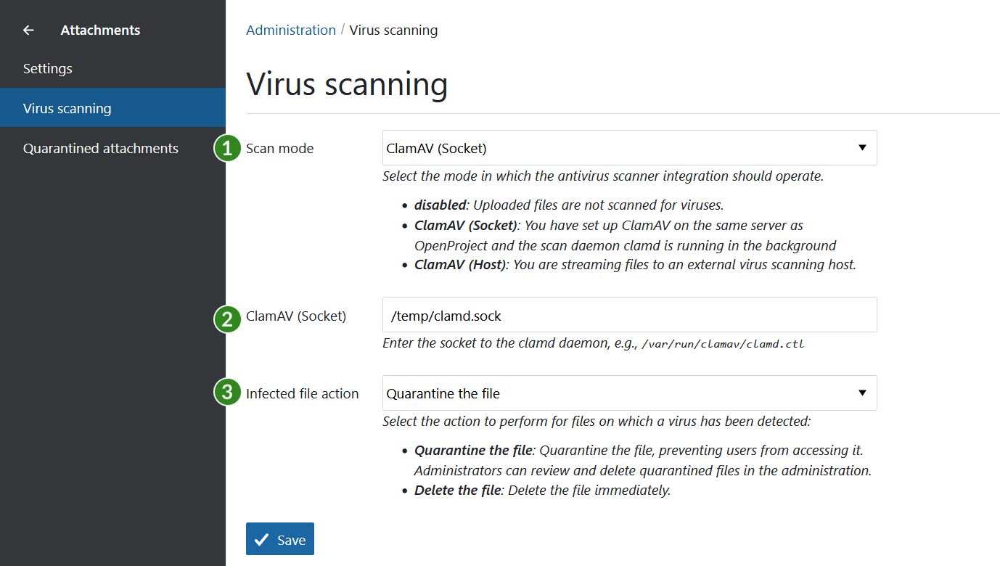

# OpenProject 13.4.0

Release date: 2024-03-20

We released [OpenProject 13.4.0](https://community.openproject.org/versions/1984). The release contains several bug fixes as well as great new features and we recommend updating to the newest version.

Read more about the [new features](#important-updates-and-new-features) and see an [overview as a list of all bug fixes and changes](#bug-fixes-and-changes) at the end of these release notes.

## Important updates and new features

The release contains various new features and improvements:

- [GitLab integration (originally developed by Community contributors)](#gitlab-integration)
- [Advanced features for custom project lists](#advanced-features-for-custom-project-lists)
- [Advanced features for the Meetings module](#advanced-features-for-the-meetings-module)
- [Admins are nudged to go through OAuth flow when activating a storage](#admins-are-nudged-to-go-through-oauth-flow-when-activating-a-storage)
- [Virus scanning functionality with ClamAV](#virus-scanning-functionality-with-clamav-enterprise-add-on)
- [PDF Export: Lists in table cells are supported](#pdf-export-lists-in-table-cells-are-supported)
- [WebAuthn/FIDO/U2F is added as a second factor](#webauthnfidou2f-is-added-as-a-second-factor)
- [More languages added to the default available set](#more-languages-added-to-the-default-available-set)

### GitLab integration

We are delighted about the GitLab integration, which is officially available with 13.4. It goes back to the plugin that Community contributor [Benjamin Tey](https://community.openproject.org/users/69094) created 3 years ago. Many thanks at this point to everyone who worked on the GitLab integration and the plugin – inside and outside of OpenProject's core development team! Such projects are a great example of the power of open source collaboration.💙

With this integration, you can manage GitLab's units of work (merge requests and issues) from within OpenProject by linking them with work packages. Read more about OpenProject's GitLab integration in our user guide.

	

**Already using the user-generated GitLab plugin?** With OpenProject 13.4, the existing plugin will be replaced by the new integration. We recommend removing the plugin and replacing it with the GitLab integration.

{:style="max-width:400px;"}{: .image-screenshot }

### Advanced features for custom project lists

With OpenProject 13.4 we are again releasing further features for custom [project lists](https://www.openproject.org/docs/user-guide/projects/project-lists/). The most important update here is that columns can now be changed in selection and order and then saved in a new configured view – just as you're probably used to do with a work package list.

In addition, you will now be reminded to save changes to your project list in the form of a Save button on the top left toolbar. This helps users to remember to save the view and not lose their work when they leave the page.

### Advanced features for the Meetings module

We also worked intensively on the Meetings module for 13.4: From now on, you can also **attach files (e.g. images) to OpenProject's dynamic meetings**. This will look like this, for example:

{: .image-screenshot }{:style="max-width:400px;"}{: .image-screenshot }

Another long-awaited improvement: When you copy a dynamic meeting, **existing agenda items are now also copied**. This saves a lot of time and work for recurring meetings.

{:style="max-width:400px;"}{: .image-screenshot }

And finally, the .ics file now also contains information about the (dynamic) meeting attendees - in addition to other existing information such as PARTSTAT. This now allows you to **confirm or decline invitations to a meeting directly in your calendar software**. 

Stay tuned: Further advanced features for our Meeting module are planned for upcoming releases – take a look at [this EPIC](https://community.openproject.org/projects/openproject/work_packages/52820/activity?query_id=4929) for detailed information.

### Admins are nudged to go through OAuth flow when activating a storage

If you are a project adminstrator and activate a storage on a project, you now get nudged to pass the OAuth flow, if you don't have an access token for that storage yet:

{:style="max-width:400px;"}{: .image-screenshot }

This way, the background job can setup the project folder. You will then get a feedback that everything is setup and working.

### Virus scanning functionality with ClamAV (Enterprise add-on)

Another important step towards data security: With OpenProject 13.4, users' uploaded files can be scanned for viruses, using the ClamAV antivirus engine. To do so, a new attachment menu item is created with Antivirus settings. Read more about virus scanning using ClamAV in our [system admin guide](https://www.openproject.org/docs/system-admin-guide/attachments/virus-scanning/#virus-scanning).

{:style="max-width:400px;"}{: .image-screenshot }

### PDF Export: Lists in table cells are supported

OpenProject version 13.4 now supports PDF exports with lists in table cells that are displayed correctly.

### WebAuthn/FIDO/U2F is added as a second factor

Two-factor authentication (2FA) is a key factor in data security. With OpenProjet 13.4, OpenProject offers WebAuthn/FIDO/U2F as a second factor.  

### More languages added to the default available set

Thanks to our great Community we can continuously offer more languages for OpenProject. With OpenProject 13.4, users now have over 50 languages at their disposal. Previously there were less than 10, which is a considerable step forward. Please note, however, that only a few languages are officially reviewed and updated by OpenProject. This currently applies to English, German, French and Spanish. For all others, we ask for your patience and [thank all Community contributors](#translation-contributors) from the bottom of our hearts.

## Bug fixes and changes

<!-- Warning: Anything within the below lines will be automatically removed by the release script -->
<!-- BEGIN AUTOMATED SECTION -->

- Feature: GitLab integration \[[#23673](https://community.openproject.org/wp/23673)\]
- Feature: Allow to attach files in the new (dynamic) meetings module \[[#26819](https://community.openproject.org/wp/26819)\]
- Feature: Add meeting attendees to .ics file  \[[#33158](https://community.openproject.org/wp/33158)\]
- Feature: Add WebAuthn/FIDO/U2F as a second factor \[[#48743](https://community.openproject.org/wp/48743)\]
- Feature: Allow columns to be changed (selection, order) and persisted \[[#51670](https://community.openproject.org/wp/51670)\]
- Feature: Project list: Truncate long text fields and disable expand action \[[#52127](https://community.openproject.org/wp/52127)\]
- Feature: Modification message and "save as" button upon modification \[[#52152](https://community.openproject.org/wp/52152)\]
- Feature: Copy agenda items when copying dynamic meetings \[[#52578](https://community.openproject.org/wp/52578)\]
- Feature: Add intermediate waiting state to cover case when redirect to provider takes time \[[#52605](https://community.openproject.org/wp/52605)\]
- Feature: PDF Export: Support lists in table cells \[[#52613](https://community.openproject.org/wp/52613)\]
- Feature: Update release teaser block \[[#52857](https://community.openproject.org/wp/52857)\]
- Feature: Virus scanning functionality with ClamAV \[[#52909](https://community.openproject.org/wp/52909)\]
- Feature: Use primer modal for project list deletion \[[#53022](https://community.openproject.org/wp/53022)\]
- Feature: Optimize column truncation for text that is not previewable \[[#53203](https://community.openproject.org/wp/53203)\]
- Feature: \[POST FREEZE FEATURE\]: Warn admins to remove .git traces of previous external gitlab plugin installation \[[#53297](https://community.openproject.org/wp/53297)\]
- Feature: Add more languages to the default available set \[[#53378](https://community.openproject.org/wp/53378)\]
- Bugfix: Images and links of copied wiki pages not updated to new page \[[#38319](https://community.openproject.org/wp/38319)\]
- Bugfix: Error when displaying embedded work package list filtered by subproject on "View all projects" page \[[#41338](https://community.openproject.org/wp/41338)\]
- Bugfix: Gantt default queries are not translated \[[#52833](https://community.openproject.org/wp/52833)\]
- Bugfix: Inconsistent green buttons / custom color settings are not applied to project create button \[[#52958](https://community.openproject.org/wp/52958)\]
- Bugfix: Tooltip and caption do not match + approval dialog text is ambiguous \[[#53040](https://community.openproject.org/wp/53040)\]
- Bugfix: Wrong filter results for filter "Shared with: me" \[[#53071](https://community.openproject.org/wp/53071)\]
- Bugfix: Multi-value custom fields filtering with "is (AND)" and "is not" is affected by values in other CFs \[[#53198](https://community.openproject.org/wp/53198)\]
- Bugfix: Health status is not showing for OneDrive storages \[[#53202](https://community.openproject.org/wp/53202)\]
- Bugfix: Copying of meetings does not copy attachments \[[#53319](https://community.openproject.org/wp/53319)\]
- Bugfix: Portuguese and Portuguese Brezilian should be distinct from each other \[[#53374](https://community.openproject.org/wp/53374)\]
- Bugfix: Project custom fields and project description no longer allows macros \[[#53391](https://community.openproject.org/wp/53391)\]

<!-- END AUTOMATED SECTION -->
<!-- Warning: Anything above this line will be automatically removed by the release script -->

## Contributions
A big thanks to community members for reporting bugs and helping us identifying and providing fixes. Special thanks for reporting and finding bugs go to Andreas H., Diego Liberman, Andreas G, Mario Zeppin, Arved Kampe, and Richard Richter.

We are always thankful for our great Community. If you are thinking about contributing to OpenProject yourself, we would like to encourage you to do so! 

### Translation contributors

An important part is also the translations, for which we thank the following contributors in particular for this release: 
- [Syvert Fossdal](https://crowdin.com/profile/syvert), who translated a lot of OpenProject strings into Norwegian
- [WilliamfromTW](https://crowdin.com/profile/williamfromtw), who translated to Traditional Chinese
- [Tomas S](https://crowdin.com/profile/tomass), who translated to Lithuanian
- [Marek Bajon](https://crowdin.com/profile/mbajon), who translated to Polish
- [Vlastislav Dockal](https://crowdin.com/profile/vdockal), who translated to Czech

Would you like to help out with translations yourself? Then take a look at our [translation guide](https://www.openproject.org/docs/development/translate-openproject/) and find out exactly how you can contribute. It is very much appreciated!