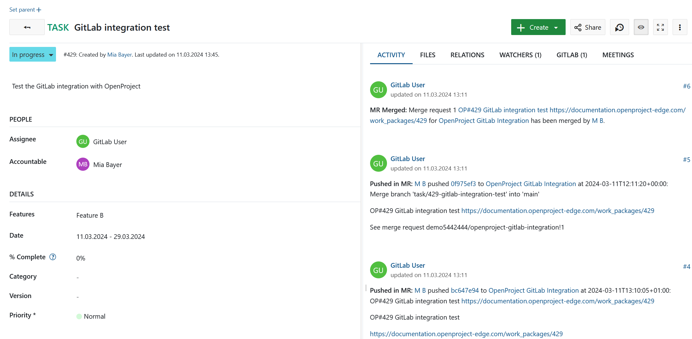
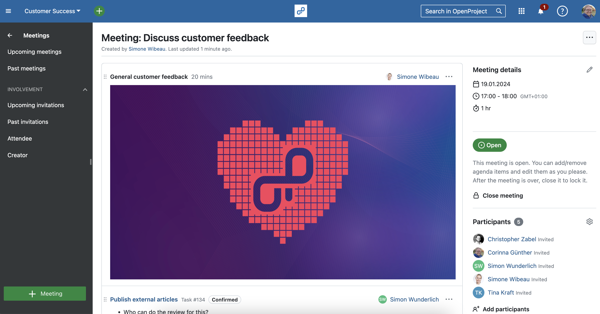
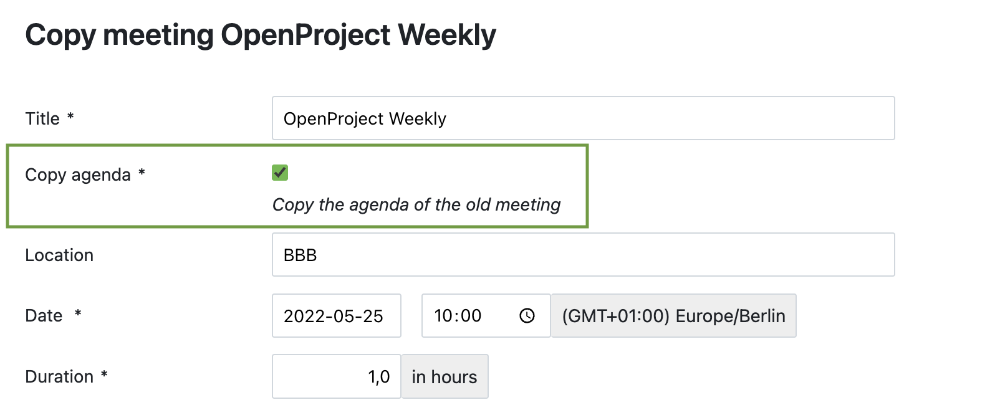
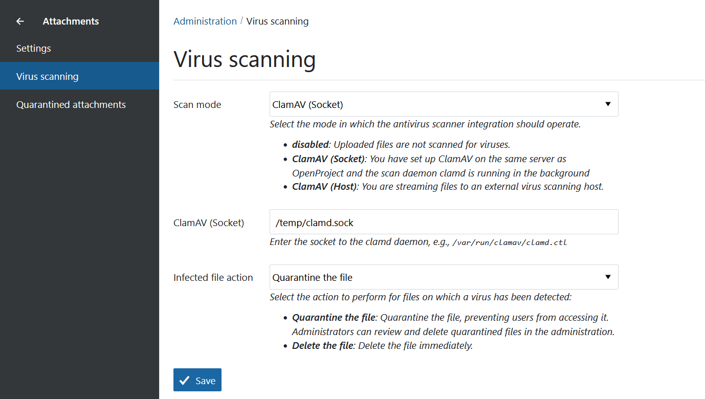
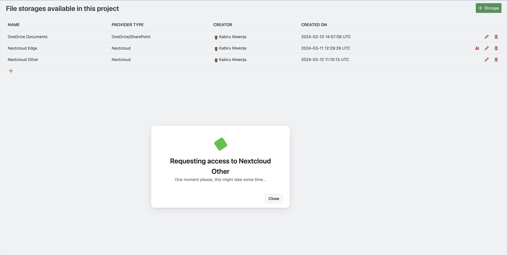
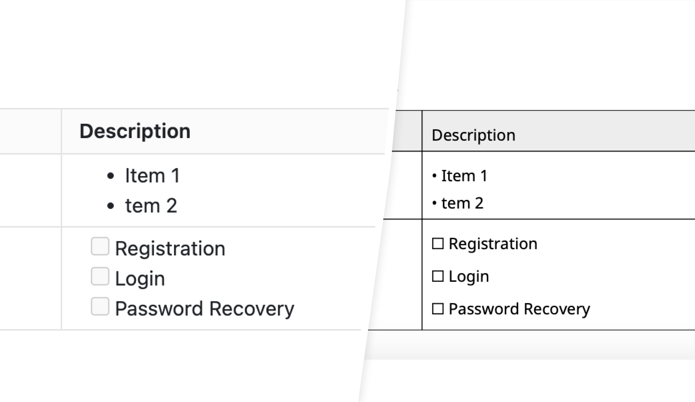

# OpenProject 13.4.0

Release date: 2024-03-20

We released [OpenProject 13.4.0](https://community.openproject.org/versions/1984). The release contains several bug fixes as well as great new features and we recommend updating to the newest version.

Read more about the [new features](#important-updates-and-new-features) and see an [overview as a list of all bug fixes and changes](#bug-fixes-and-changes) at the end of these release notes.

## Important updates and new features

The release contains various new features and improvements:

- [GitLab integration (originally developed by Community contributors)](#gitlab-integration)
- [Advanced features for custom project lists](#advanced-features-for-custom-project-lists)
- [Advanced features for the Meetings module](#advanced-features-for-the-meetings-module)
- [Virus scanning functionality with ClamAV](#virus-scanning-functionality-with-clamav-enterprise-add-on)
- [Intermediate loading modal during the OAuth nudge](#intermediate-loading-modal-during-the-oauth-nudge)
- [PDF Export: Lists in table cells are supported](#pdf-export-lists-in-table-cells-are-supported)
- [WebAuthn/FIDO/U2F is added as a second factor](#webauthnfidou2f-is-added-as-a-second-factor)
- [More languages added to the default available set](#more-languages-added-to-the-default-available-set)

### GitLab integration

We are delighted about the GitLab integration, which is officially available with OpenProject 13.4. It goes back to the plugin that Community contributor [Benjamin Tey](https://community.openproject.org/users/69094) created 3 years ago. Many thanks at this point to everyone who worked on the GitLab integration and the plugin – inside and outside of OpenProject's core development team! Such projects are a great example of the power of open source collaboration.💙

With this integration, you can manage GitLab's units of work (merge requests and issues) from within OpenProject by linking them with work packages. Read more about OpenProject's GitLab integration [in our system admin guide](https://www.openproject.com/docs/system-admin-guide/integrations/gitlab-integration/).

**Already using the user-generated GitLab plugin?** With OpenProject 13.4, the existing plugin will be replaced by the new integration. We recommend removing the plugin module folder and bundler references before upgrading to OpenProject. Your historical dataset will remain unaffected within OpenProject as there were no changes to the data model.

Before upgrading, please do the following:

1. Remove traces of the GitLab integration in your **Gemfile.lock** and **Gemfile.modules**. See [btey/openproject-gitlab-integration#configuration](https://github.com/btey/openproject-gitlab-integration?tab=readme-ov-file#configuration). Failure to do so may result in a `Bundler::GemfileError` matching the following error message: _Your Gemfile lists the gem openproject-gitlab_integration (>= 0) more than once._
2. Remove the module code traces of the GitLab integration by running this command: `rm -rf /path/to/openproject/modules/gitlab_integration`

### Advanced features for custom project lists

With OpenProject 13.4 we are again releasing further features for custom [project lists](../../user-guide/projects/project-lists/). The most important update here is that you can now modify the selection and order of columns, then save them in a  newly configured view, much like how you typically manage a work package list.

In addition, you will now be reminded to save changes to your project list in the form of a **Save link** in the top right corner. This helps users remember to save the view and not lose their work when they leave the page.

### Advanced features for the Meetings module

We also worked intensively on the Meetings module for 13.4: From now on, you can also **attach files (e.g. images) to OpenProject's dynamic meetings**. This will look like this, for example:

Another long-awaited improvement: When you copy a dynamic meeting, **existing agenda items are now also copied**. This saves a lot of time and work for recurring meetings.

And finally, the .ics file now also contains information about the (dynamic) meeting attendees - in addition to other existing information such as PARTSTAT. This now allows you to **confirm or decline invitations to a meeting directly in your calendar software**.

Stay tuned: Further advanced features for our Meetings module are planned for upcoming releases – take a look at [this EPIC](https://community.openproject.org/projects/openproject/work_packages/52820/activity?query_id=4929) for detailed information.

### Virus scanning functionality with ClamAV (Enterprise add-on)

Another important step towards data security: With OpenProject 13.4, users' uploaded files can be scanned for viruses, using the ClamAV antivirus engine. To do so, a new attachment menu item is created with Antivirus settings. Read more about virus scanning using ClamAV in our [system admin guide](../../system-admin-guide/files/attachments/virus-scanning/).

### Intermediate loading modal during the OAuth nudge

Admins are now shown an intermediate loading modal during the OAuth nudge follow when the redirect to the storage provider takes time.

Accessibility functionality: Convey to screenreaders when OAuth login has started, while it's in progress, and when it's completed or failed.

### PDF Export: Lists in table cells are supported

OpenProject version 13.4 now supports PDF exports with lists in table cells that are displayed correctly. Export a work package that contains a table with lists in it into a PDF. Here is an example of how this looks from now on:

### WebAuthn/FIDO/U2F is added as a second factor

Two-factor authentication (2FA) is a key factor in data security. With OpenProject 13.4, OpenProject offers a new method as a second factor. You can now use hardware tokens such as Yubikeys, browser or password manager passkeys that use the WebAuthn/FIDO/U2F standards.

### More languages added to the default available set

Thanks to our great Community we can continuously offer more languages for OpenProject. With OpenProject 13.4, users now have over 50 languages at their disposal. Previously there were less than ten, which is a considerable step forward. Please note, however, that only a few languages are officially reviewed and updated by OpenProject. This currently applies to English, German, French and Spanish. Regarding all other languages, we ask for your patience and [thank all Community contributors](#translation-contributors) from the bottom of our hearts.

## Bug fixes and changes

<!-- Warning: Anything within the below lines will be automatically removed by the release script -->
<!-- BEGIN AUTOMATED SECTION -->

- Feature: GitLab integration \[[#23673](https://community.openproject.org/wp/23673)\]
- Feature: Allow to attach files in the new (dynamic) meetings module \[[#26819](https://community.openproject.org/wp/26819)\]
- Feature: Add meeting attendees to .ics file  \[[#33158](https://community.openproject.org/wp/33158)\]
- Feature: Add WebAuthn/FIDO/U2F as a second factor \[[#48743](https://community.openproject.org/wp/48743)\]
- Feature: Allow columns to be changed (selection, order) and persisted \[[#51670](https://community.openproject.org/wp/51670)\]
- Feature: Project list: Truncate long text fields and disable expand action \[[#52127](https://community.openproject.org/wp/52127)\]
- Feature: Modification message and "save as" button upon modification \[[#52152](https://community.openproject.org/wp/52152)\]
- Feature: Copy agenda items when copying dynamic meetings \[[#52578](https://community.openproject.org/wp/52578)\]
- Feature: Add intermediate waiting state to cover case when redirect to provider takes time \[[#52605](https://community.openproject.org/wp/52605)\]
- Feature: PDF Export: Support lists in table cells \[[#52613](https://community.openproject.org/wp/52613)\]
- Feature: Virus scanning functionality with ClamAV \[[#52909](https://community.openproject.org/wp/52909)\]
- Feature: Use primer modal for project list deletion \[[#53022](https://community.openproject.org/wp/53022)\]
- Feature: Optimize column truncation for text that is not previewable \[[#53203](https://community.openproject.org/wp/53203)\]
- Feature: Add more languages to the default available set \[[#53378](https://community.openproject.org/wp/53378)\]
- Bugfix: Error message on project overview page for users who lack permission to see Work Packages \[[#33573](https://community.openproject.org/wp/33573)\]
- Bugfix: Images and links of copied wiki pages not updated to new page \[[#38319](https://community.openproject.org/wp/38319)\]
- Bugfix: Automatic download of exports do not start. Download link also shows up late. \[[#40163](https://community.openproject.org/wp/40163)\]
- Bugfix: Number of displayed assignees in team planner wrongly restricted by "objects per page" \[[#46490](https://community.openproject.org/wp/46490)\]
- Bugfix: Baseline change columns display grey color dot for priority but not for status \[[#51379](https://community.openproject.org/wp/51379)\]
- Bugfix: Search bar doesn't stretches back if blank, has it's inside text matching the bar color (white)  \[[#51682](https://community.openproject.org/wp/51682)\]
- Bugfix: Add to meeting button on Meetings tab overflows \[[#51747](https://community.openproject.org/wp/51747)\]
- Bugfix: Announcement box and create new account button are not responsive \[[#51949](https://community.openproject.org/wp/51949)\]
- Bugfix: Can't specify project key for incoming email \[[#52524](https://community.openproject.org/wp/52524)\]
- Bugfix: Gantt default queries are not translated \[[#52833](https://community.openproject.org/wp/52833)\]
- Bugfix: Inconsistent green buttons / custom color settings are not applied to project create button \[[#52958](https://community.openproject.org/wp/52958)\]
- Bugfix: Email title uses default instance language instead of user specified language \[[#52976](https://community.openproject.org/wp/52976)\]
- Bugfix: Atom feed of Gantt charts page produces an error \[[#53027](https://community.openproject.org/wp/53027)\]
- Bugfix: Tooltip and caption do not match + approval dialog text is ambiguous \[[#53040](https://community.openproject.org/wp/53040)\]
- Bugfix: Wrong filter results for filter "Shared with: me" \[[#53071](https://community.openproject.org/wp/53071)\]
- Bugfix: Multi-value custom fields filtering with "is (AND)" and "is not" is affected by values in other CFs \[[#53198](https://community.openproject.org/wp/53198)\]
- Bugfix: Incorrect link to document in 'document added' mail \[[#53211](https://community.openproject.org/wp/53211)\]
- Bugfix: In portuguese language, dynamic meeting with more than 5 users not open. \[[#53215](https://community.openproject.org/wp/53215)\]
- Bugfix: Copying of meetings does not copy attachments \[[#53319](https://community.openproject.org/wp/53319)\]
- Bugfix: LDAP user can't be created if optional attributes are not mapped \[[#53327](https://community.openproject.org/wp/53327)\]
- Bugfix: Page editor menu moves under the header \[[#53365](https://community.openproject.org/wp/53365)\]
- Bugfix: Project folder is shown in the main menu based on the wrong permission for automatically managed project folders \[[#53367](https://community.openproject.org/wp/53367)\]
- Bugfix: Portuguese and Portuguese Brazilian should be distinct from each other \[[#53374](https://community.openproject.org/wp/53374)\]
- Bugfix: Blacklisted routes not working \[[#53399](https://community.openproject.org/wp/53399)\]
- Bugfix: Incorrect spelling of GitLab module under project settings \[[#53434](https://community.openproject.org/wp/53434)\]
- Bugfix: Webauthn fails on mobile Safari \[[#53442](https://community.openproject.org/wp/53442)\]
- Bugfix: Rake secret task gone in 13.3.1 (breaking scripts & diverging from docs) \[[#53447](https://community.openproject.org/wp/53447)\]
- Bugfix: WebAuth fails on iOS \[[#53494](https://community.openproject.org/wp/53494)\]
- Bugfix: WebAuthn not selectable on mobile \[[#53495](https://community.openproject.org/wp/53495)\]
- Bugfix: Cannot delete reports in time and costs \[[#52284](https://community.openproject.org/projects/openproject/work_packages/52284/activity)\]

<!-- END AUTOMATED SECTION -->
<!-- Warning: Anything above this line will be automatically removed by the release script -->

## Contributions

A very special thank you goes to our sponsors for features and improvements:

- City of Cologne for sponsoring new features for the project lists
- BMI for sponsoring features on progress reporting and Gantt charts
- Deutsche Bahn for sponsoring the OneDrive/SharePoint integration

Another big thanks goes to our Community members for reporting bugs and helping us identify and provide fixes. Special thanks for reporting and finding bugs go to Andreas H., Diego Liberman, Andreas G, Mario Zeppin, Arved Kampe, and Richard Richter.

We are always thankful for our great [Community](https://www.openproject.org/blog/community-instance/). If you are thinking about contributing to OpenProject yourself, we would like to encourage you to do so!

### Translation contributors

An important part is also the translations, for which we thank the following contributors in particular for this release:

- [Syvert Fossdal](https://crowdin.com/profile/syvert), who translated a lot of OpenProject strings into Norwegian
- [WilliamfromTW](https://crowdin.com/profile/williamfromtw), who translated to Traditional Chinese
- [Tomas S](https://crowdin.com/profile/tomass), who translated to Lithuanian
- [Marek Bajon](https://crowdin.com/profile/mbajon), who translated to Polish
- [Vlastislav Dockal](https://crowdin.com/profile/vdockal), who translated to Czech

Would you like to help out with translations yourself? Then take a look at our [translation guide](../../development/translate-openproject/) and find out exactly how you can contribute. It is very much appreciated!
