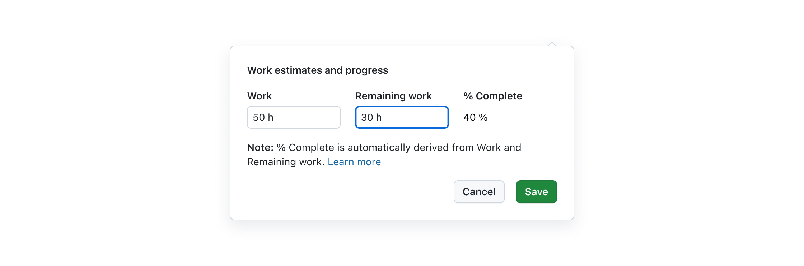
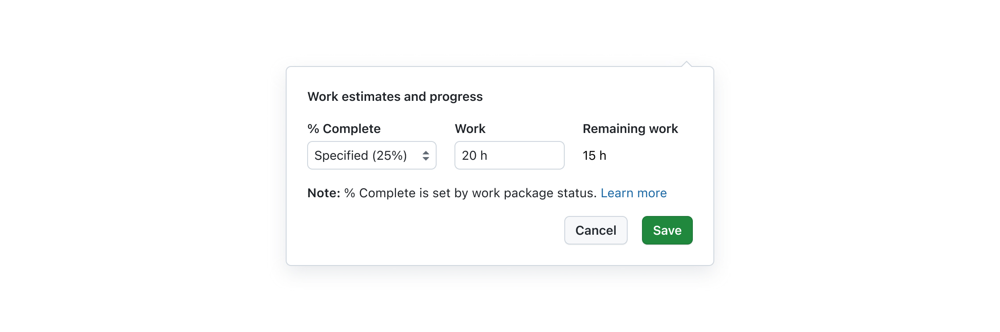
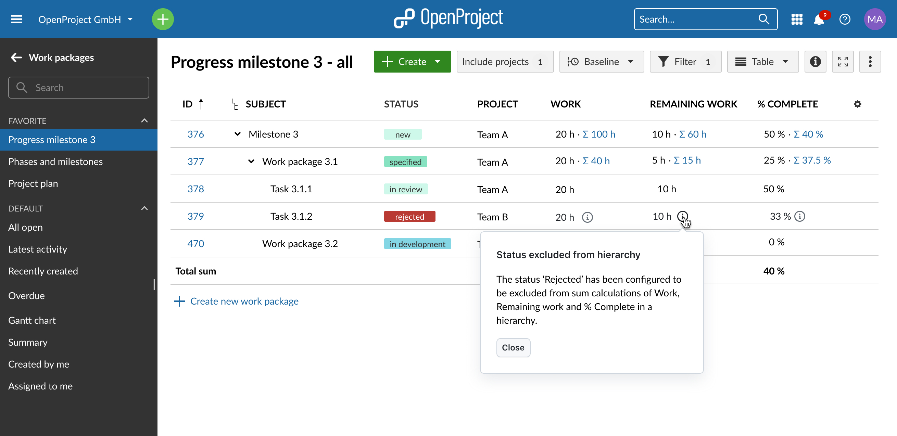
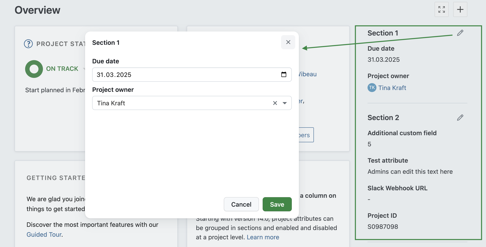
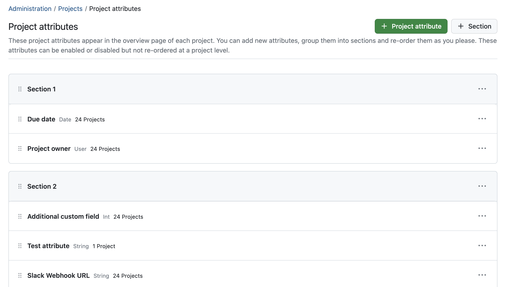

# OpenProject 14.0.0

Release date: 2024-04-24

We released [OpenProject 14.0.0](https://community.openproject.org/versions/1356). The major release contains several bug fixes, and we recommend updating to the newest version. In these Release Notes, we will first list important technical updates, then give an overview of important feature changes. At the end, you will find a complete list of all changes and bug fixes.

## Important updates and breaking changes

### Docker registry renaming

Starting with OpenProject 14.0, docker images will be published to [openproject/openproject](https://hub.docker.com/r/openproject/openproject) on Docker Hub. If your setup is still using the old image name (openproject/community), you will need to update your configuration to use the new image names.

All previous images have been pushed there as well, so you can simply update your configuration to use the new image
name ahead of your update.

### API V3: Renaming of Delay to Lag

In the relations API, the attribute `delay` has been renamed to `lag`. This change is to align the API with the terminology used in project management and the UI. For more information, see [#44054](https://community.openproject.org/work_packages/44054).

### Removed deprecated methods for permission checks

In version 13.1 we have overhauled our system to handle internal permission checks by allowing permissions to not only be
defined on project or global level, but also on resources like work packages. Therefore, we have introduced new methods to check permissions. The old methods have been marked as deprecated and are now removed in 14.0.

Affected methods are:

- `User#allowed_to?`
- `User#allowed_to_globally?`
- `User#allowed_to_in_project?`

If you have developed a plugin or have custom code that uses these methods, you need to update your code to use the new
methods. For more information, see [#51212](https://community.openproject.org/work_packages/51212).

### Reduced number of configurable design variables

We have changed the number and naming of the [configurable design variables](../../system-admin-guide/design/#interface-colors). This simplifies the process of setting the desired color scheme for users. It also allows us to get closer to the **Primer design system** in order to benefit from its other modes such as the dark mode or the colorblind mode in the future.

The following variables have been changed:

| Old name           | New name             | Notes                                                                                                                                                                      |
|--------------------|----------------------|----------------------------------------------------------------------------------------------------------------------------------------------------------------------------|
| primary-color      | primary-button-color | Was merged with the previous "alternative-color". The value of "alternative-color" was kept.                                                                               |
| alternative-color  | primary-button-color | Was merged with the previous "primary-color". The value of "alternative-color" was kept.                                                                                   |
| primary-color-dark | -                    | Will now be calculated automatically based on the "primary-button-color"                                                                                                   |
| link-color         | accent-color         | Is not only used for links, but for all decently highlighted elements (e.g. the selection state in a datepicker). The (old) value of "primary-color" was use for this. |

If you have developed a plugin or have custom code that uses these variables, you need to update your code to use the new
names. The rest of the variables is unchanged. For more information, see [#53309](https://community.openproject.org/work_packages/53309).

### Removal of the model_changeset_scan_commit_for_issue_ids_pre_issue_update hook

The `model_changeset_scan_commit_for_issue_ids_pre_issue_update` hook has been removed completely. This was made necessary as the code around it was not making use of the proper update mechanisms (Service objects) which lead to inconsistencies in the data, i.e. ancestor work packages. For more information, see [#40749](https://community.openproject.org/work_packages/40749).

### Removal of the commit_fix_done_ratio setting

Since the done_ratio is now a read only value, derived from work and remaining work, the `commit_fix_done_ratio` setting has been removed. For more information, see [#40749](https://community.openproject.org/work_packages/40749).

### Removed `available_responsibles` from the API

The `available_responsibles` endpoint has been removed from the API. This endpoint was used to retrieve a list of users that could be set as the **responsible** for a work package. This information has been identical to the results by the  `available_assignees` endpoint. When you are using the `available_responsibles` endpoint in your application, you should switch to using the `available_assignees` endpoint instead.

## Important feature changes

### Progress reporting across work package hierarchies

There are some major changes in terms of progress reporting for work package hierarchies. The calculation of progress (% Complete) in work package hierarchies is now consistent. This leads to the following important changes:

#### % Complete will be an automatically calculated (non-editable) attribute based on Work

In Work-based progress reporting, % Complete will be automatically calculated and can therefore no longer be edited manually. This means that for a work package to have a value for % Complete, both Work and Remaining work are required to be set. To make this link clear and transparent, clicking on any of the three values to modify them will display the following pop-over:

#### In status-based progress reporting, Remaining work will be automatically calculated

In Status-based progress reporting mode, Work is not a required value. However, if Work is set, Remaining work is automatically calculated. To make this link clear and transparent, clicking on any of the three values to modify them will display the following pop-over:

#### Administrators will be able to exclude certain work packages from hierarchy totals of Work, Remaining work and % Complete

Admins are able to exclude specific work packages (e.g., those marked as rejected) from the total sum calculations of their parent. In this case, a small info icon will appear next to excluded values:

In addition to these changes, the section 'Estimates and Time' has been renamed to 'Estimates and Progress' and this is where you will now find % Complete. Also, the seeding of statuses has been fixed to include % Complete values and in the Progress modal, you will now be able to preview changes amongst the fields live.

Please note that regarding progress reporting, **updating to OpenProject 14.0 might result in automated data modification in certain cases**. See our blog to learn about the [details and motives on these significant changes to progress and work estimates](https://www.openproject.org/blog/changes-progress-work-estimates/) and how it might affect you.

### Project attributes management on the project overview page

With OpenProject 14.0, you are now able to view and edit custom fields for projects in a structured way, organized in sections, on the project overview page. These fields are now referred to as **'Project attributes'**. Admins can edit them directly on the project overview page:

Project attributes as well as the sections can be managed in administration/projects/project attributes.

### Streamlined view of custom fields in project lists and project overview

Until now, there have been uncertainties with project-specific custom fields from time to time. This is why the tab 'project' has been removed from the custom fields admin settings pages. Instead, project custom fields are now edited within their own admin settings page. Also, the custom fields widget has been removed.

As described above, *project* custom fields are now called 'Project attributes' and can be shown in a sidebar on the project overview page on a per-project configuration.

### Enhanced Meetings module with new features

OpenProject's [(Dynamic) Meetings](../../user-guide/meetings/dynamic-meetings/) have been updated with the following new features:

* [Meetings attachments](https://www.openproject.com/docs/user-guide/meetings/dynamic-meetings/#meeting-attachments) are now shown in the bottom section of the right-hand sidebar. You can add them directly to the meeting there and drag and drop them from this section to the Notes section of the agenda items.
* When [copying a meeting](https://www.openproject.com/docs/user-guide/meetings/dynamic-meetings/#copy-a-meeting), you can now check a box to choose whether you want to include attachments.
* A [meeting history](https://www.openproject.com/docs/user-guide/meetings/dynamic-meetings/#meeting-history) has been added and can be found in the Meetings menu, showing previous changes.
* The presenter of an agenda item can now be changed from the creator of the agenda item to any person in the project.
* An option to copy a URL of a specific agenda item has been added.

### Automatic alerts for unhealthy file storages, and toggle options

With OpenProject 14.0, admins now get email notifications when a file storage (e.g. Nextcloud) is unhealthy. To avoid sending unwanted messages, we also added the option to deactivate these health status notifications for a storage.

Read more about file storage troubleshooting in our [documentation](https://www.openproject.com/docs/system-admin-guide/file-storages/file-storage-troubleshooting/).

### OneDrive/SharePoint: Copying template projects including automatically managed project folders

If you copy a project where a file storage has automatically managed project folders selected, you will now have the following options:

* Deactivate the copy option "File Storages: Project folders" – this will copy the file storage, but not the specific project folder.
* Deactivate the copy option "File Storages" – this will not copy any file storage.

### Reminder for admins when revoking a project membership to remove shares on work packages

As of 14.0, admins are asked whether they also want to remove access to [shared work packages](https://www.openproject.com/docs/user-guide/work-packages/share-work-packages/) when removing a project member or group from a project.

### 4 and 8-week display modes for the team planner

The [team planner](https://www.openproject.com/docs/user-guide/team-planner/) allows for easy planning of users assigned to work packages. It is now possible to have the team planner span more than two weeks, with newly added options for 4-week and 8-week timeframes.

### Unified page headers with the sleek Primer design

As mentioned in the earlier blog post about the Primer Design System, work is ongoing to unify more and more components of the application to match this design. In 14.0, we have started to add new primer-based page headers.

<!--more-->

## Complete list of changes and bug fixes

Apart from the features mentioned above, there have been a lot of other changes, smaller features and, of course, bug fixes for OpenProject 14.0:

<!-- Warning: Anything within the below lines will be automatically removed by the release script -->
<!-- BEGIN AUTOMATED SECTION -->

- Bugfix: Roadmap graph shows only work packages of current project \[[#30865](https://community.openproject.org/wp/30865)\]
- Bugfix: Parent progress not updated when package marked complete by git commit \[[#35369](https://community.openproject.org/wp/35369)\]
- Bugfix: Can't hide menus in work package list as expected \[[#36439](https://community.openproject.org/wp/36439)\]
- Bugfix: Saving changes to user profile after handling error message leads to user profile instead of edit user page \[[#36521](https://community.openproject.org/wp/36521)\]
- Bugfix: Snackbar/toast informing users of new notifications has the wrong icon \[[#40147](https://community.openproject.org/wp/40147)\]
- Bugfix: Search bar doesn't have focus state and the first element on the list seams always selected \[[#43520](https://community.openproject.org/wp/43520)\]
- Bugfix: Search field is not cleared after selection on Watchers \[[#44469](https://community.openproject.org/wp/44469)\]
- Bugfix: No space between avatar and username in the github tab of a work package \[[#46215](https://community.openproject.org/wp/46215)\]
- Bugfix: Missing space on the left of the advanced filter \[[#46346](https://community.openproject.org/wp/46346)\]
- Bugfix: Meeting Minutes: Toggling preview mode causes losing content \[[#48210](https://community.openproject.org/wp/48210)\]
- Bugfix: +Create button disabled after creating a child work package until reloading the page \[[#49136](https://community.openproject.org/wp/49136)\]
- Bugfix: Missing space between avatars and usernames in Administration -> Users \[[#50213](https://community.openproject.org/wp/50213)\]
- Bugfix: Taskboard column width stopped working \[[#51416](https://community.openproject.org/wp/51416)\]
- Bugfix: share work packages - share user can not be selected as assignee/responsible \[[#51551](https://community.openproject.org/wp/51551)\]
- Bugfix: Double close button on Share modal for mobile \[[#51699](https://community.openproject.org/wp/51699)\]
- Bugfix: Odd spacing in Notification and Email Reminder personal setting pages \[[#51772](https://community.openproject.org/wp/51772)\]
- Bugfix: OpenProject behind prefix some assets still loaded from web root  \[[#52292](https://community.openproject.org/wp/52292)\]
- Bugfix: Position of status selector too high after opening the drop down \[[#52669](https://community.openproject.org/wp/52669)\]
- Bugfix: Add meaningful flash error message when user cancels OAuth flow on OneDrive/SharePoint \[[#52798](https://community.openproject.org/wp/52798)\]
- Bugfix: Waiting modal stuck on network error \[[#53005](https://community.openproject.org/wp/53005)\]
- Bugfix: Imprint Menu Label is not localized \[[#53062](https://community.openproject.org/wp/53062)\]
- Bugfix: Loading of seeded IFC model stuck \[[#53069](https://community.openproject.org/wp/53069)\]
- Bugfix: Logo not reset when logo file is deleted \[[#53121](https://community.openproject.org/wp/53121)\]
- Bugfix: Health status is not showing for OneDrive storages \[[#53202](https://community.openproject.org/wp/53202)\]
- Bugfix: Cannot make a query private that was created by another user \[[#53344](https://community.openproject.org/wp/53344)\]
- Bugfix: \[AppSignal\] Investigate absence of oauth\_client for OneDrive storage. \[[#53345](https://community.openproject.org/wp/53345)\]
- Bugfix: Autocompleters do not find users with accent when using simple letter  \[[#53371](https://community.openproject.org/wp/53371)\]
- Bugfix: OAuth flow causes loss of already selected option while adding a storage to a project \[[#53394](https://community.openproject.org/wp/53394)\]
- Bugfix: Calendar buttons are not translated \[[#53422](https://community.openproject.org/wp/53422)\]
- Bugfix: Project storage main-menu links do not include prefix \[[#53429](https://community.openproject.org/wp/53429)\]
- Bugfix: Empty assignee board for user with reader role \[[#53436](https://community.openproject.org/wp/53436)\]
- Bugfix: Toolbar buttons too close on user page \[[#53477](https://community.openproject.org/wp/53477)\]
- Bugfix: Link on top of the storage should be removed if the read\_files permission is missing when it is a automatically managed project folder. \[[#53484](https://community.openproject.org/wp/53484)\]
- Bugfix: Buttons have the wrong color in freshly seeded BIM instance \[[#53504](https://community.openproject.org/wp/53504)\]
- Bugfix: Meetings: Remove the "Add notes" item from the dropdown menu when notes already exist \[[#53618](https://community.openproject.org/wp/53618)\]
- Bugfix: Macros text should wrap \[[#53644](https://community.openproject.org/wp/53644)\]
- Bugfix: iOS zooms in when commenting \[[#53651](https://community.openproject.org/wp/53651)\]
- Bugfix: Error in french translation \[[#53673](https://community.openproject.org/wp/53673)\]
- Bugfix: Visible=false project attribute values are deleted when a non-admin user edits the attributes \[[#53704](https://community.openproject.org/wp/53704)\]
- Bugfix: Reordering project attributes is popping back on render \[[#53706](https://community.openproject.org/wp/53706)\]
- Bugfix: Fill custom\_field\_section\_id when migrating CreateCustomFieldSections for the first time \[[#53728](https://community.openproject.org/wp/53728)\]
- Bugfix: Action menu position on project attributes admin settings page broken \[[#53735](https://community.openproject.org/wp/53735)\]
- Bugfix: Project attribute edit button doesn't work \[[#53739](https://community.openproject.org/wp/53739)\]
- Bugfix: Missing translation in help menu for Legal Notice menu item \[[#53768](https://community.openproject.org/wp/53768)\]
- Bugfix: Project attribute edit menu jumps out of place \[[#53790](https://community.openproject.org/wp/53790)\]
- Bugfix: Deletion dialog does not provide enough context \[[#53802](https://community.openproject.org/wp/53802)\]
- Bugfix: Meeting agenda item overflow with long work package subject \[[#53812](https://community.openproject.org/wp/53812)\]
- Bugfix: Blank page when clicking a link in meeting agenda item notes \[[#53813](https://community.openproject.org/wp/53813)\]
- Bugfix: workPackageValue macro for milestone cannot use startDate and dueDate \[[#53814](https://community.openproject.org/wp/53814)\]
- Bugfix: Dynamics meetings: Macro button for new work packages leads to a blank page \[[#53935](https://community.openproject.org/wp/53935)\]
- Bugfix: New GitLab integration tab content is displayed in front of all popups \[[#53948](https://community.openproject.org/wp/53948)\]
- Bugfix: Editing the work package to a different work package doesn't show clearly in the Meeting history \[[#53976](https://community.openproject.org/wp/53976)\]
- Bugfix: Impossible to copy a project \[[#53990](https://community.openproject.org/wp/53990)\]
- Bugfix: Sort order of assignees in team planer is incorrect \[[#54008](https://community.openproject.org/wp/54008)\]
- Bugfix: Undefined method status for HTTPX::ErrorResponse \[[#54016](https://community.openproject.org/wp/54016)\]
- Bugfix: Outbound requests don't retry \[[#54046](https://community.openproject.org/wp/54046)\]
- Bugfix: ckEditor controls are off in iOS \[[#54116](https://community.openproject.org/wp/54116)\]
- Bugfix: Total % complete should be shown in work package activity \[[#54129](https://community.openproject.org/wp/54129)\]
- Bugfix: Migration help text notice in modal should not be present in status-based mode \[[#54131](https://community.openproject.org/wp/54131)\]
- Bugfix: Unnecessary journal created changing total % complete from 0 to null during progress migration \[[#54141](https://community.openproject.org/wp/54141)\]
- Bugfix: Total Remaining work of parent ticket does not get updated according to children values \[[#54179](https://community.openproject.org/wp/54179)\]
- Bugfix: Inconsistent UX with commas for time unit when inputting remaining work or work \[[#54193](https://community.openproject.org/wp/54193)\]
- Bugfix: Wording is off for progress calculation input errors \[[#54288](https://community.openproject.org/wp/54288)\]
- Bugfix: Superfluous drop-down arrow on %Complete input modal \[[#54290](https://community.openproject.org/wp/54290)\]
- Bugfix: Non-Parent work package should not show 'Total work' in journal entry \[[#54299](https://community.openproject.org/wp/54299)\]
- Bugfix: Rounding is inconsistent on progress calculation modal \[[#54308](https://community.openproject.org/wp/54308)\]
- Bugfix: Totals with ∑ 0h should be visible \[[#54309](https://community.openproject.org/wp/54309)\]
- Bugfix: Progress calculation modal makes Remaining work higher than Work and throws a validation error \[[#54310](https://community.openproject.org/wp/54310)\]
- Bugfix: Linking agenda items between meetings fails \[[#54316](https://community.openproject.org/wp/54316)\]
- Bugfix: "Old-style" project filter strings / URLs no longer working after update \[[#54350](https://community.openproject.org/wp/54350)\]
- Bugfix: In new work package page, opening the progress modal and saving produces an error \[[#54370](https://community.openproject.org/wp/54370)\]
- Feature: Consistent calculation of progress (% Complete) in work package hierarchies \[[#40749](https://community.openproject.org/wp/40749)\]
- Feature: Rename Delay to Lag \[[#44054](https://community.openproject.org/wp/44054)\]
- Feature: Remove member and revoke shared work packages \[[#50266](https://community.openproject.org/wp/50266)\]
- Feature: Show meeting history / changes \[[#50820](https://community.openproject.org/wp/50820)\]
- Feature: Inform an admin via email about an unhealthy automatically managed file storage \[[#50913](https://community.openproject.org/wp/50913)\]
- Feature: Fix seeding of status to include % Complete values \[[#50965](https://community.openproject.org/wp/50965)\]
- Feature: Global project attributes administration \[[#51789](https://community.openproject.org/wp/51789)\]
- Feature: Project-specific project attributes mapping \[[#51790](https://community.openproject.org/wp/51790)\]
- Feature: Display project attributes on project overview page \[[#51791](https://community.openproject.org/wp/51791)\]
- Feature: Remove project custom fields from global custom field settings page \[[#51792](https://community.openproject.org/wp/51792)\]
- Feature: Split existing project administration settings into multiple pages \[[#51793](https://community.openproject.org/wp/51793)\]
- Feature: Remove project custom fields widget \[[#51794](https://community.openproject.org/wp/51794)\]
- Feature: Adjust project API in order to respect project-specific custom fields \[[#51796](https://community.openproject.org/wp/51796)\]
- Feature: "Copy URL" option for meeting agenda items  \[[#52160](https://community.openproject.org/wp/52160)\]
- Feature: Copy automatically managed project folder on project copy for OneDrive/SharePoint \[[#52175](https://community.openproject.org/wp/52175)\]
- Feature: Add toggle to deactivate/activate admin health notification for a storage \[[#52449](https://community.openproject.org/wp/52449)\]
- Feature: File Storage Permissions explanation \[[#52571](https://community.openproject.org/wp/52571)\]
- Feature: Update the PageHeader component to do all required actions \[[#52582](https://community.openproject.org/wp/52582)\]
- Feature: Show involved persons of agenda items \[[#52830](https://community.openproject.org/wp/52830)\]
- Feature: Restrict filtering on custom values that are not active attributes \[[#53007](https://community.openproject.org/wp/53007)\]
- Feature: Sort work packages autocompletion by descending updated at time in meetings module  \[[#53033](https://community.openproject.org/wp/53033)\]
- Feature: Nudge user to login to storage upon project storage edit \[[#53058](https://community.openproject.org/wp/53058)\]
- Feature: Reduce configurable design variables \[[#53309](https://community.openproject.org/wp/53309)\]
- Feature: Change row break in email notifications \[[#53316](https://community.openproject.org/wp/53316)\]
- Feature: Disable name and email fields in user profile for LDAP user \[[#53330](https://community.openproject.org/wp/53330)\]
- Feature: Have only non bundled gems appear in the Plugin list \[[#53346](https://community.openproject.org/wp/53346)\]
- Feature: Fine-tuning of truncation feature in project list and project overview \[[#53373](https://community.openproject.org/wp/53373)\]
- Feature: Allow setting createdAt, author via API \[[#53423](https://community.openproject.org/wp/53423)\]
- Feature: Make the Author field editable or settable \[[#53444](https://community.openproject.org/wp/53444)\]
- Feature: Allow 4 and 8 week display modes in team planner \[[#53475](https://community.openproject.org/wp/53475)\]
- Feature: Allow umlauts for login name in OpenProject, LDAP authentication \[[#53486](https://community.openproject.org/wp/53486)\]
- Feature: Meetings: Improve attachments \[[#53506](https://community.openproject.org/wp/53506)\]
- Feature: Support setting accountable to current user via custom action \[[#53507](https://community.openproject.org/wp/53507)\]
- Feature: Add separate checkbox about attachments when user copies a meeting \[[#53568](https://community.openproject.org/wp/53568)\]
- Feature: Handle no active project attributes in project overview sidebar \[[#53577](https://community.openproject.org/wp/53577)\]
- Feature: Check if and how project activity logs should be adapted \[[#53580](https://community.openproject.org/wp/53580)\]
- Feature: Show meeting state in meeting history \[[#53660](https://community.openproject.org/wp/53660)\]
- Feature: Disable the macros for the project custom fields. \[[#53701](https://community.openproject.org/wp/53701)\]
- Feature: Project creation with project attributes \[[#53703](https://community.openproject.org/wp/53703)\]
- Feature: Project copy with project attributes \[[#53705](https://community.openproject.org/wp/53705)\]
- Feature: Project export with disabled project attributes \[[#53733](https://community.openproject.org/wp/53733)\]
- Feature: Removing a work package from a agenda should be called "Remove" instead of "Delete" \[[#53766](https://community.openproject.org/wp/53766)\]
- Feature: Add % Complete to section "Estimates and time" \[[#53771](https://community.openproject.org/wp/53771)\]
- Feature: Show diff for changes in meeting agenda items \[[#53975](https://community.openproject.org/wp/53975)\]
- Feature: Update agenda item work package history subtitles \[[#54015](https://community.openproject.org/wp/54015)\]
- Feature: Add Access management section in OneDrive/SharePoint file storage settings \[[#54069](https://community.openproject.org/wp/54069)\]
- Feature: Show meeting state in meeting history \[[#54103](https://community.openproject.org/wp/54103)\]
- Feature: Show meeting state in meeting history \[[#54104](https://community.openproject.org/wp/54104)\]
- Feature: Live Preview value changes in Progress Modal \[[#54275](https://community.openproject.org/wp/54275)\]
- Feature: Progress reporting for work package hierarchies \[[#40867](https://community.openproject.org/wp/40867)\]
- Feature: Copy of template projects including their project folders in SharePoint \[[#51000](https://community.openproject.org/wp/51000)\]
- Feature: Email notifications for unhealthy file storages \[[#52840](https://community.openproject.org/wp/52840)\]

<!-- END AUTOMATED SECTION -->
<!-- Warning: Anything above this line will be automatically removed by the release script -->

## Contributions

A very special thank you goes to our sponsors for features and improvements of this release:

* German Federal Ministry of the Interior and Home Affairs (BMI) for sponsoring the features on progress reporting
* City of Cologne for sponsoring features on project attributes
* Deutsche Bahn for sponsoring the OneDrive/SharePoint integration

Also a big thanks to our Community members for reporting bugs and helping us identify and provide fixes. Special thanks for reporting and finding bugs go to:

Silas Kropf, Philipp Schulz, Benjamin Rönnau, Mario Haustein, Matt User, Mario Zeppin, Romain Besson, Daniel Hilbrand, Christina Vechkanova, Sven Kunze, Richard Richter, Julian Wolff

Last but not least, we are very grateful for our very engaged translation contributors on Crowdin, who translated quite a few OpenProject strings! This release we would like to highlight user [izzahk](https://crowdin.com/profile/izzahk)
who has done an outstanding number of translations for the Malaysian language in recent weeks.

Would you like to help out with translations yourself? Then take a look at our [translation guide](../../development/translate-openproject/) and find out exactly how you can contribute. It is very much appreciated!
