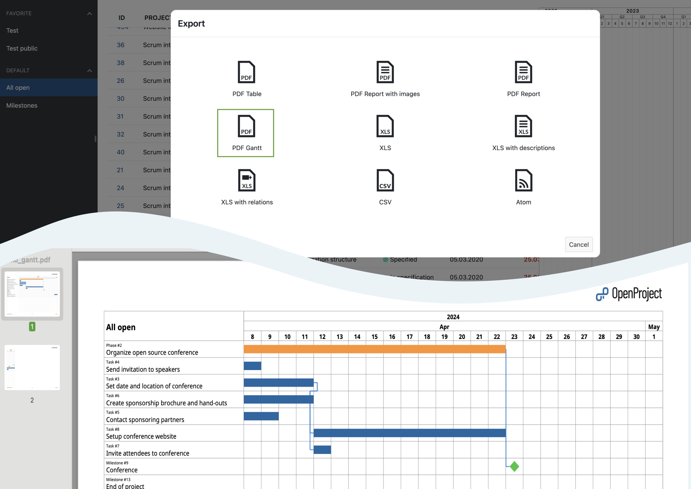
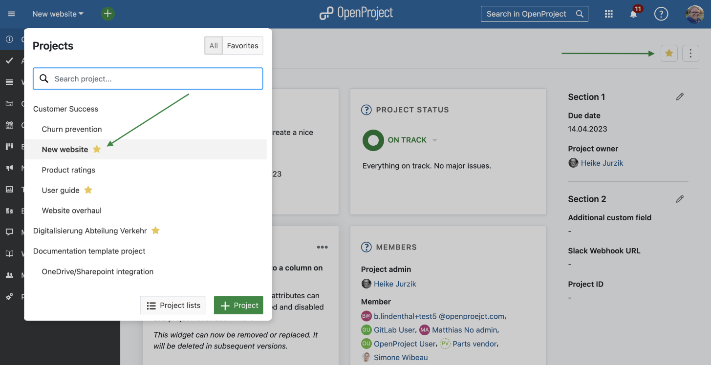
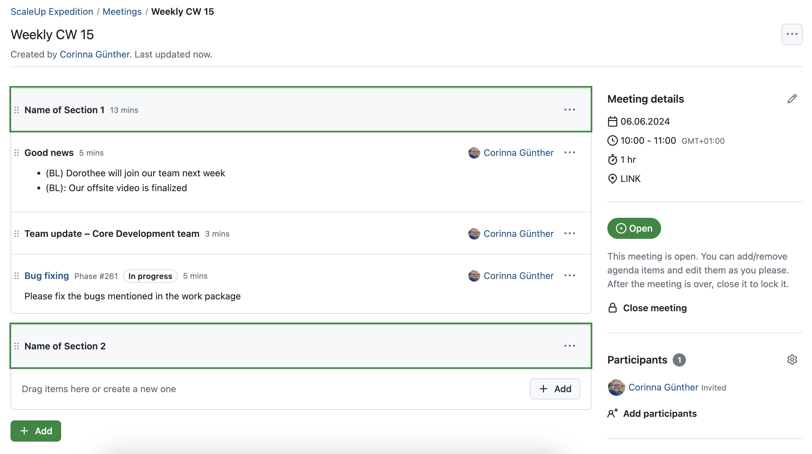
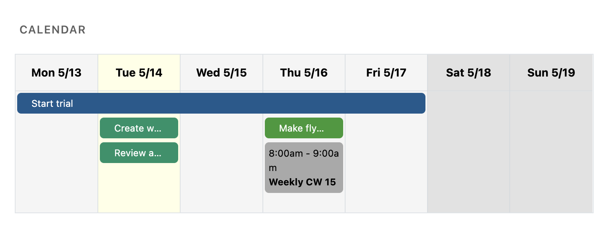
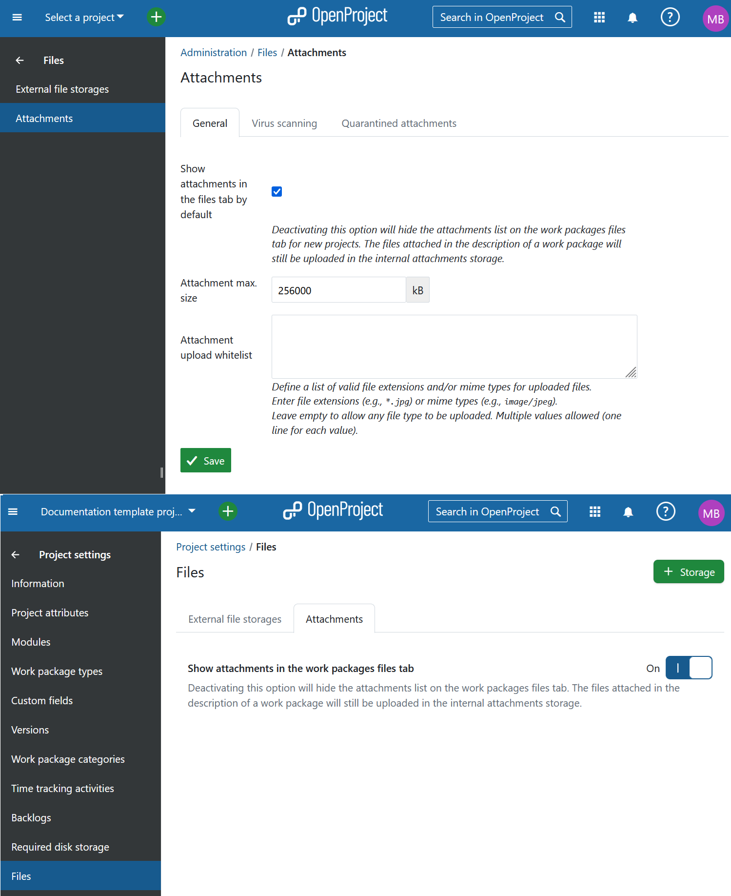
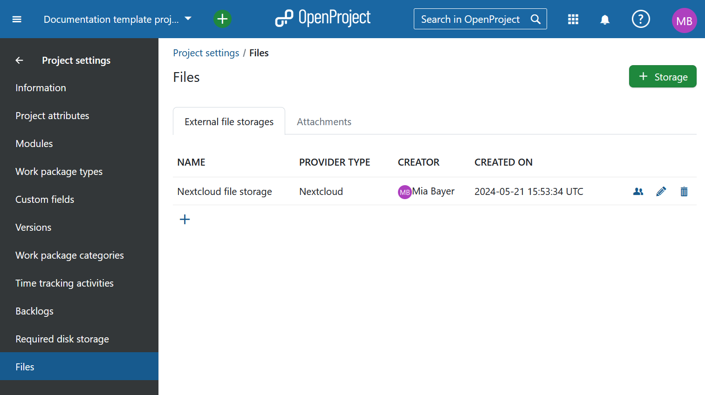
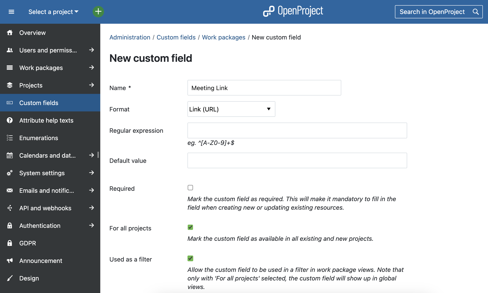

# OpenProject 14.1.0

Release date: 2024-05-22

We released [OpenProject 14.1.0](https://community.openproject.org/versions/2030). The release contains several bug fixes and we recommend updating to the newest version. In these Release Notes, we will give an overview of important feature changes. At the end, you will find a complete list of all changes and bug fixes.

## Important updates and breaking changes

### Fixes a stored XSS vulnerability in the cost report functionality (CVE-2024-135224)
OpenProject Cost Report functionality uses improper sanitization of user input. This can lead to Stored XSS via the header values of the report table. This attack requires the permissions "Edit work packages" as well as "Add attachments".

For more information, [please see our security advisory](https://github.com/opf/openproject/security/advisories/GHSA-h26c-j8wg-frjc).

### Deprecation of Univention app center packages

We unfortunately can no longer provide the OpenProject app for the Univention app center due to incompatibility of their PostgreSQL version in app center 5.0. They have announced that a newer PostgreSQL version will be available in a newer version of the app center.
This means that we are unable to provide new versions of OpenProject in the Univention app center. The last version available in the app center is OpenProject 13.4.1.

As OpenProject currently does not provide its own multi-container setup, the app is no longer upgradable. We recommend you switch to a docker- or packaged-based installation instead. Please use the [integrated backup functionality](../../system-admin-guide/backup/) to extract a backup from your installation. See the [restoration guide](../../installation-and-operations/operation/restoring/) on how to restore this backup to a new installation.

In the future, we are collaborating with Univention to provide a connector app for OpenProject, allowing you to integrate their IDM solution
into an existing deployed OpenProject application.

### Removal of all-in-one PostgreSQL exposed port

In the all-in-one Dockerfile, up until now, both port 80 and 5432 (PostgreSQL database) were exposed by default.
As we are also not exposing other services such as memcached, we removed the PostgreSQL port for consistency.

If you need to work on the database directly, you can still use the `docker exec -it <container id> pg_dump` command to e.g., access pg_dump.

## Important feature changes

### PDF export of Gantt view, e.g. for printing (Enterprise add-on)

It is now possible to export a Gantt view as PDF in the OpenProject Enterprise edition. This allows users to easily print Gantt charts in a nice design. Choose between different paper formats, set the column width, and specify whether the PDF file should display your work packages on a daily, monthly or quarterly basis.

Please note that we plan to further improve the [PDF export of Gantt view](../../user-guide/gantt-chart/#gantt-chart-pdf-export-enterprise-add-on) in future releases.

### Favorite projects

This feature was requested by many in the Community and will be a great benefit, especially for organizations with many projects: OpenProject 14.1 allows you to add projects to favorites so that they can be found more quickly. We [recently gave an overview in our blog](https://www.openproject.org/blog/favorite-projects/) of how exactly you can add projects to favorites or remove them from favorites – and where you can display them.

See our documentation to learn more about [how to mark a project as favorite](../../user-guide/project-overview/#mark-a-project-as-favorite).

### Advanced features for the Meetings module

The Meetings module is currently being continuously improved. With OpenProject 14.1.:

- you can group agenda items with sections,
- notes are open when creating new agenda items,
- and the status now changes to open when you copy a closed meeting.

Apart from these features that apply the Meetings module directly, the following changes concerning OpenProject meetings have been made:

- In work packages, the project name is now shown in the Meetings tab.
- Calendar widgets on the My Page and project overview pages can now show meetings.

**Please note**: On the project overview page and on the My page, the "+" button on the top right has been removed. However, new widgets can be added by project admins as usual if you hover at the border of an existing widget and click on the “+” there.

Read more about [dynamic meetings in OpenProject](../../user-guide/meetings/dynamic-meetings/).

### Possibility to hide attachments in the Files tab

Admins now are able to hide the attachment section in the Files tab. This setting can be changed both at an instance and project levels and is particularly useful for projects where users should only upload files via external storage, e.g. Nextcloud.

To make this possible Attachment and Files Storages settings were moved together under **Files** section, both in the [instance administration](../../system-admin-guide/files/attachments/) and under [project settings](../../user-guide/projects/project-settings/files/).

### File storages module activated by default

In connection with the feature above, activating file storages integrations was simplified. It is no longer required to active **Files storages** module under project settings. Instead, available file storages are visible under *Project settings > Files > External file storages*, as long as the user has *Manage file storages in project* permission.

### Custom fields of the type Link (URL)

Users can now create custom field of the type Link (URL). Remember to activate it for your project(s) and specific work package type for it to be displayed. The custom field type Link shows an error message if you type in an invalid URL.

Read more about [custom fields](../../system-admin-guide/custom-fields/).

### Save a changed sort order of custom project lists

Custom project lists can now not only be changed in order, but also saved as such. Additionally, you can change your own saved lists and save them again so that you do not have to start from scratch.

Read more on [project lists](../../user-guide/projects/project-lists/).

### A "Manage project attributes" button on the project overview page

With OpenProject 14.0, we released the feature to create a custom set of project attributes grouped in sections on the project overview page. With 14.1, you will additionally have a button to [Manage project attributes](../../user-guide/project-overview/#project-attributes) on the project overview page.

### OneDrive/SharePoint: A "no permission“ message to file links

If you use the OneDrive/SharePoint integration, you will now be shown a "no permission" message if you try to access a file for which you lack permission.

<!--more-->

## Bug fixes and changes

Apart from the features mentioned above, there have been a lot of other changes, smaller features and, of course, bug fixes for OpenProject 14.1:

<!-- Warning: Anything within the below lines will be automatically removed by the release script -->
<!-- BEGIN AUTOMATED SECTION -->

- Feature: Button to mark favorite projects in the project overview page \[[#24683](https://community.openproject.org/wp/24683)\]
- Feature: Custom fields of type "Link/URL" \[[#26923](https://community.openproject.org/wp/26923)\]
- Feature: Group agenda items with sections \[[#49060](https://community.openproject.org/wp/49060)\]
- Feature: Persist the sort order of project lists \[[#51671](https://community.openproject.org/wp/51671)\]
- Feature: Add "no permission" message to file links using OneDrive/SharePoint   \[[#51842](https://community.openproject.org/wp/51842)\]
- Feature: Show and filter favorite projects in the main project selector \[[#52079](https://community.openproject.org/wp/52079)\]
- Feature: Changing a persisted list (only own) \[[#52144](https://community.openproject.org/wp/52144)\]
- Feature: Filter favorite projects in the project list  \[[#52881](https://community.openproject.org/wp/52881)\]
- Feature: Widget for the homepage to show favorite projects \[[#52883](https://community.openproject.org/wp/52883)\]
- Feature: Add "Manage project attributes" button to project overview page \[[#53576](https://community.openproject.org/wp/53576)\]
- Feature: Hide attachments in Files tab \[[#53672](https://community.openproject.org/wp/53672)\]
- Feature: Dynamic Meetings: Change status to open when a closed meetings gets copied \[[#54007](https://community.openproject.org/wp/54007)\]
- Feature: Add support for Batches on the JobStatus API \[[#54034](https://community.openproject.org/wp/54034)\]
- Feature: Activate Storage module when a user has "Manage file storages in project" permission \[[#54178](https://community.openproject.org/wp/54178)\]
- Feature: Show project name in meetings tab \[[#54192](https://community.openproject.org/wp/54192)\]
- Feature: Show meetings in My Page / Project overview calendar widgets \[[#54286](https://community.openproject.org/wp/54286)\]
- Feature: PDF export gantt chart \[[#54296](https://community.openproject.org/wp/54296)\]
- Feature: PDF export gantt chart options \[[#54297](https://community.openproject.org/wp/54297)\]
- Feature: Open notes for new agenda items \[[#54347](https://community.openproject.org/wp/54347)\]
- Feature: Move permissions from FILE STORAGES to WORK PACKAGES section \[[#54356](https://community.openproject.org/wp/54356)\]
- Feature: Include new IFC toolbar Octicons \[[#54503](https://community.openproject.org/wp/54503)\]
- Feature: Favor and unfavor projects from the favorite column in the project lists \[[#54541](https://community.openproject.org/wp/54541)\]
- Feature: Show empty state for no favorite project in project selector \[[#54542](https://community.openproject.org/wp/54542)\]
- Feature: Make the Gantt PDF export an EE feature \[[#54965](https://community.openproject.org/wp/54965)\]
- Feature: PDF Gantt Export: work package values in first column \[[#55013](https://community.openproject.org/wp/55013)\]
- Feature: Remove Files module from project modules \[[#55035](https://community.openproject.org/wp/55035)\]
- Bugfix: Users who are not allowed to see hourly rates see planned and booked labor costs in budgets \[[#45834](https://community.openproject.org/wp/45834)\]
- Bugfix: Pages have unnecessary "..." collapsing between 1st and 2nd page \[[#46116](https://community.openproject.org/wp/46116)\]
- Bugfix: Creating new/Editing existing Custom action dialogue fails \[[#48964](https://community.openproject.org/wp/48964)\]
- Bugfix: Misleading error message: IFC upload (file size) \[[#52098](https://community.openproject.org/wp/52098)\]
- Bugfix: OpenProject behind prefix some assets still loaded from web root  \[[#52292](https://community.openproject.org/wp/52292)\]
- Bugfix: BIM-Model View - Context Menu/Pop Up in Viewer \[[#52600](https://community.openproject.org/wp/52600)\]
- Bugfix: Inconsistent interpolations in translation files \[[#53466](https://community.openproject.org/wp/53466)\]
- Bugfix: Removing a project custom field stored as a filter in a project list leads to wrong counter value \[[#53585](https://community.openproject.org/wp/53585)\]
- Bugfix: .ics calendar object does not account for daylight savings time. loads incorrectly in MS Outlook \[[#53788](https://community.openproject.org/wp/53788)\]
- Bugfix: Rails.application.routes don't respects  OPENPROJECT\_RAILS\_\_RELATIVE\_\_URL\_\_ROOT \[[#54061](https://community.openproject.org/wp/54061)\]
- Bugfix: Language in Email notifications subscribe section UI inconclusive \[[#54127](https://community.openproject.org/wp/54127)\]
- Bugfix: Spacing issues on Primer::PageHeader \[[#54357](https://community.openproject.org/wp/54357)\]
- Bugfix: Set presenter when adding to meeting from work package tab \[[#54380](https://community.openproject.org/wp/54380)\]
- Bugfix: Calendar widget on My page not displaying Meetings in full \[[#54509](https://community.openproject.org/wp/54509)\]
- Bugfix: Favorite star for projects has a yellow outline when in an empty state \[[#54510](https://community.openproject.org/wp/54510)\]
- Bugfix: Archived projects show up as favorite \[[#54513](https://community.openproject.org/wp/54513)\]
- Bugfix: Progress: Custom action to set progress to 100% broken with new progress calculation mode \[[#54727](https://community.openproject.org/wp/54727)\]
- Bugfix: Project favorite not showing in list if only one in subproject \[[#54729](https://community.openproject.org/wp/54729)\]
- Bugfix: Ldap group sync job running only once per day instead of every half hour \[[#54964](https://community.openproject.org/wp/54964)\]
- Bugfix: Migration from 11 to 14 fails due to obsolete migration step \[[#54968](https://community.openproject.org/wp/54968)\]
- Bugfix: PDF Export: change the default paper size to A4 \[[#55002](https://community.openproject.org/wp/55002)\]
- Bugfix: Project overview headers are showing on work package view \[[#55024](https://community.openproject.org/wp/55024)\]
- Bugfix: Large number of CreateDateAlertNotificationJobs delaying background job execution \[[#55101](https://community.openproject.org/wp/55101)\]
- Bugfix: Improper escaping of custom field values in cost report \[[#55199](https://community.openproject.org/wp/55199)\]
- Feature: Favorite projects \[[#52837](https://community.openproject.org/wp/52837)\]

<!-- END AUTOMATED SECTION -->
<!-- Warning: Anything above this line will be automatically removed by the release script -->

#### Contributions

A very special thank you goes to our sponsors for features and improvements of this release:

* City of Cologne for sponsoring features on project attributes
* Deutsche Bahn for sponsoring the OneDrive/SharePoint integration
* German Federal Ministry of the Interior and Home Affairs (BMI) for sponsoring the features on progress reporting

Also a big thanks to our Community members for reporting bugs and helping us identify and provide fixes. Special thanks for reporting and finding bugs go to Marc Burk, Silas Kropf, and Hanley Loller.

Also thanks for finding and responsibly disclosing the CVE-2024-135224 vulnerability go to [Sean Marpo](https://github.com/seanmarpo). Thank you for reaching out to us and helping in identifying this issue.

Last but not least, we are very grateful for our very engaged translation contributors on Crowdin, who translated quite a few OpenProject strings! This release we would like to highlight user [Syvert](https://crowdin.com/profile/syvert)
who has done an outstanding number of translations for the Norwegian language in recent weeks.

Would you like to help out with translations yourself? Then take a look at our [translation guide](../../development/translate-openproject/) and find out exactly how you can contribute. It is very much appreciated!
