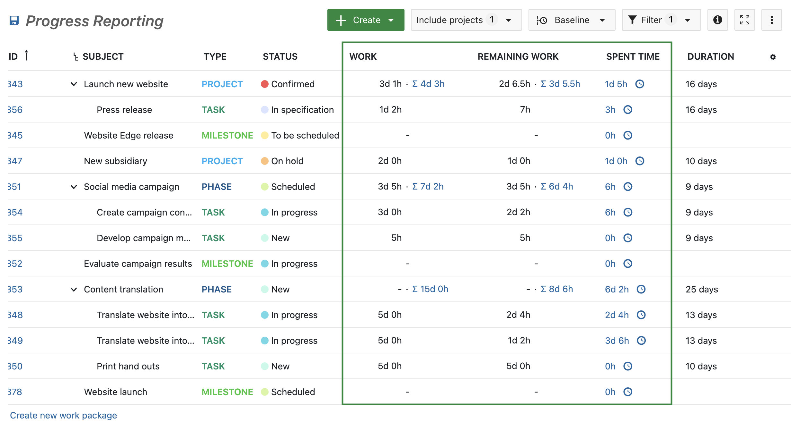
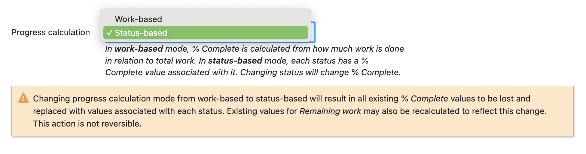
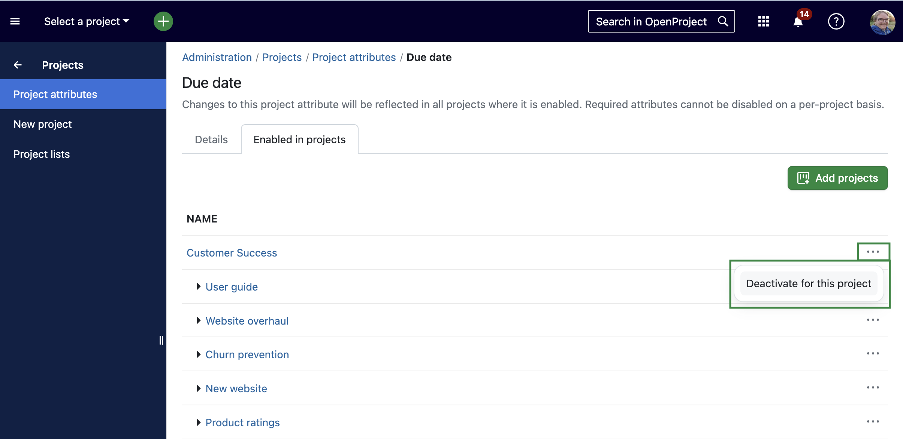
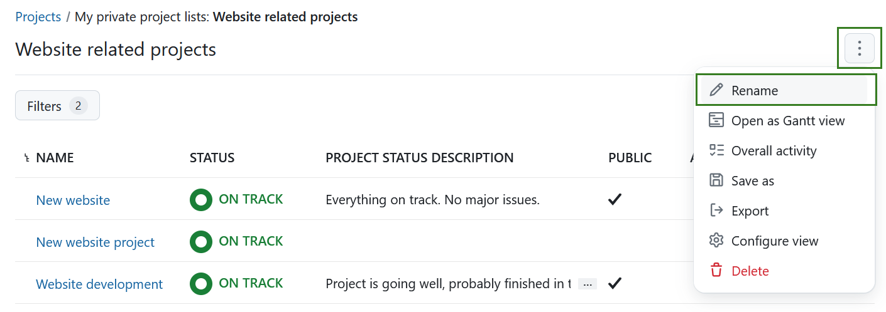
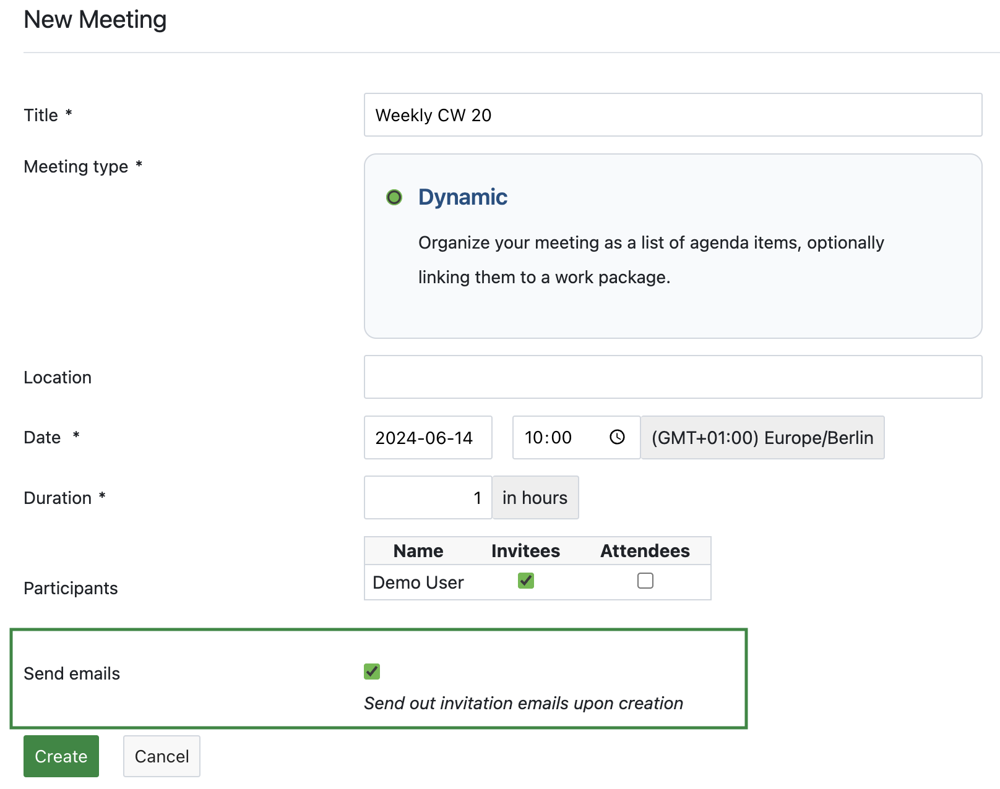
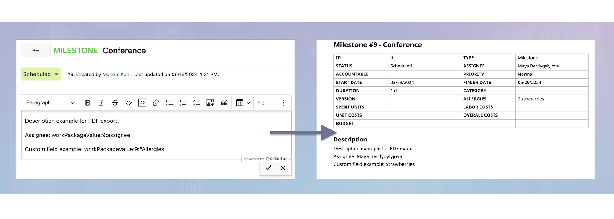

# OpenProject 14.2.0

Release date: 2024-06-19

We released [OpenProject 14.2.0](https://community.openproject.org/versions/2040). The release contains several bug fixes and we recommend updating to the newest version. In these Release Notes, we will give an overview of  important feature changes. At the end, you will find a complete list of  all changes and bug fixes.

## Important feature changes

### Display Work and Remaining work in days and hours

With OpenProject 14.2, we enhanced the accuracy of progress reporting. Previously, time for Work, Remaining work, and spent time could only be specified in hours. Now, it is also possible to specify these units in days. Administrators of the instance can set the number of hours that constitute a day under administration/calendars-and-dates.

A work package table displaying Work and Remaining work might now look like this:

For more information, see [#50954](https://community.openproject.org/wp/50954).

### Exclude by status some work packages from the calculation of totals for % Complete and work estimates 

Project managers can now exclude rejected or duplicate work packages from the calculation of total Work, total Remaining work and total % Complete for the parent / ancestors work packages. This allows them to clean up estimates and progress when rejecting child work packages or marking them as duplicates.

Learn more in our [documentation about work package settings](../../system-admin-guide/manage-work-packages/work-package-settings/).

### Warn admins about potential data loss when changing progress calculation modes

To avoid loosing data when switching from Work- to Status-based progress calculation, OpenProject will now show you a warning banner if you select a different mode than the current. If you switch from Work- to Status-based progress calculation, please note that:

* Existing % Complete values are overwritten by status (or set to 0 when a corresponding value does not exist).

* Remaining work is automatically updated.

### Configure which projects are activated for a project attribute

With OpenProject 14.2, administrators can now save time by enabling or disabling project attributes across multiple projects simultaneously. For instance, if you want to adjust the 'Due date' attribute for all projects, the setting looks like this: 

In the screenshot, the three-dot menu on the right is selected. With one click, you can deactivate the attribute for the entire project and its subprojects.

### Avoid redundant emails in case of @mentions and email reminder

With the release of OpenProject 14.2, we avoid sending redundant emails: Users who are @mentioned in a work package will still receive immediate emails based on their email reminder settings. But if an email has already been sent for an @mention (assuming the user has activated the option ‘Immediately when someone @mentions me’ in the email notifications), subsequent notifications with mentions as the primary reason will not be included in the email reminder.

### Allow renaming persisted project lists

Regarding project portfolio management, users can now not only create and save a private custom project list, but also rename it. This saves time since previously, you would have had to create a new project list to change the name.

### Allow meeting invite to be sent out when creating meetings

The Meeting module has been further improved with OpenProject 14.2: When users create a new meeting in OpenProject, they will now see a checkbox allowing them to choose whether to email the invited users. If checked, OpenProject will send invitation emails to all new participants.

In addition to this feature, the default view for meetings module was changed to display the upcoming invitations.

### Embedded work package attributes in PDF export

With OpenProject 14.2, [embedded attributes within a work package description](../../user-guide/wysiwyg/#embedding-of-work-package-attributes-and-project-attributes) (and long text custom fields) are displayed in the PDF export as on OpenProject. This means you can reference values from work packages with placeholders, and on export these are replaced by their actual value of a project or work package attributes.

## Bug fixes and changes

<!-- Warning: Anything within the below lines will be automatically removed by the release script -->
<!-- BEGIN AUTOMATED SECTION -->

- Bugfix: Misleading OpenProject Reconfigure wizard leading to undesired removal of Apache \[[#41293](https://community.openproject.org/wp/41293)\]
- Bugfix: Some buttons are missing on mobile screens on iOS Safari \[[#50724](https://community.openproject.org/wp/50724)\]
- Bugfix: Different headings in permission report and role form \[[#51447](https://community.openproject.org/wp/51447)\]
- Bugfix: Main menu resizer handle misplaced on hover \[[#52670](https://community.openproject.org/wp/52670)\]
- Bugfix: Query lost when sorting the project table quickly \[[#53329](https://community.openproject.org/wp/53329)\]
- Bugfix: Seeded demo project "Project plan" view should be in Gantt charts section \[[#53624](https://community.openproject.org/wp/53624)\]
- Bugfix: Text editor is partially out of view on mobile \[[#54128](https://community.openproject.org/wp/54128)\]
- Bugfix: Health e-mail showing storage host URL but unexpectedly linking OP \[[#55137](https://community.openproject.org/wp/55137)\]
- Bugfix: Meetings participants toggle has the wrong color \[[#55169](https://community.openproject.org/wp/55169)\]
- Bugfix: User icon appearing on the share work packages modal in the empty state \[[#55231](https://community.openproject.org/wp/55231)\]
- Bugfix: Favorite column margin is too big on project list \[[#55251](https://community.openproject.org/wp/55251)\]
- Bugfix: Notifications are sent to the author if the author is member of a @mentioned group \[[#55255](https://community.openproject.org/wp/55255)\]
- Bugfix: New section option not i18n-ed \[[#55275](https://community.openproject.org/wp/55275)\]
- Bugfix: Can't update from 13.1 - main language pt-BR \[[#55318](https://community.openproject.org/wp/55318)\]
- Bugfix: Progress units: Display Work and Remaining work in days and hours \[[#55466](https://community.openproject.org/wp/55466)\]
- Bugfix: Do not save access token in cookies \[[#55472](https://community.openproject.org/wp/55472)\]
- Bugfix: Project custom field of type link not listed in project settings \[[#55483](https://community.openproject.org/wp/55483)\]
- Bugfix: Vertical alignment fix was global and broke other pages \[[#55583](https://community.openproject.org/wp/55583)\]
- Bugfix: Password reset token not invalidated when user changes email \[[#55585](https://community.openproject.org/wp/55585)\]
- Bugfix: "Shared with me" notification setting not enabled by default \[[#55586](https://community.openproject.org/wp/55586)\]
- Bugfix: No longer able to see group memberships for user \[[#55602](https://community.openproject.org/wp/55602)\]
- Bugfix: Direct login provider setting accepting empty value \[[#55631](https://community.openproject.org/wp/55631)\]
- Bugfix: Missing custom action strategy for custom fields with field format link (URL) \[[#55651](https://community.openproject.org/wp/55651)\]
- Bugfix: Remove default archived projects view from project list for non-admins \[[#55661](https://community.openproject.org/wp/55661)\]
- Feature: Exclude by status some work packages from the calculation of totals for % Complete and work estimates \[[#49409](https://community.openproject.org/wp/49409)\]
- Feature: Avoid redundant emails in case of @mentions and email reminder \[[#50140](https://community.openproject.org/wp/50140)\]
- Feature: Record and display work and remaining work in hours and days \[[#50954](https://community.openproject.org/wp/50954)\]
- Feature: Allow renaming persisted project lists \[[#51673](https://community.openproject.org/wp/51673)\]
- Feature: Change default view for meetings module to upcoming invitations \[[#53669](https://community.openproject.org/wp/53669)\]
- Feature: Create a sub-header component in Primer \[[#54043](https://community.openproject.org/wp/54043)\]
- Feature: Embedded work package attributes in PDF export \[[#54377](https://community.openproject.org/wp/54377)\]
- Feature: Configure which projects are activated for a project attribute \[[#54455](https://community.openproject.org/wp/54455)\]
- Feature: Allow meeting invite to be sent out when creating meetings \[[#54469](https://community.openproject.org/wp/54469)\]
- Feature: Extend storage API to include boolean "configured" attribute \[[#55158](https://community.openproject.org/wp/55158)\]
- Feature: Extend primer component PageHeader to support Tabs \[[#55190](https://community.openproject.org/wp/55190)\]
- Feature: Transform remove action from share modals to an IconButton \[[#55230](https://community.openproject.org/wp/55230)\]
- Feature: Localize demo projects when user starts a trial \[[#55323](https://community.openproject.org/wp/55323)\]
- Feature: Track deployment status for OpenProject pull requests in github integration \[[#55425](https://community.openproject.org/wp/55425)\]
- Feature: Warn admins about potential data loss when changing progress calculation modes \[[#55467](https://community.openproject.org/wp/55467)\]

<!-- END AUTOMATED SECTION -->
<!-- Warning: Anything above this line will be automatically removed by the release script -->

## Contributions
A very special thank you goes to the City of Cologne for sponsoring features on project attributes. Also a big thanks to our Community members for reporting bugs and helping us identify and provide fixes. Special thanks for reporting and finding  bugs go to Ricardo Brenner and Sven Kunze.

Last but not least, we are very grateful for our very engaged translation contributors on Crowdin, who translated quite a few OpenProject strings! This release we would like to highlight user [aniessalam](https://crowdin.com/profile/aniessalam) who has done an outstanding number of translations for the Malay language in recent weeks.

Would you like to help out with translations yourself? Then take a look at our [translation guide](../../development/translate-openproject/) and find out exactly how you can contribute. It is very much appreciated!
