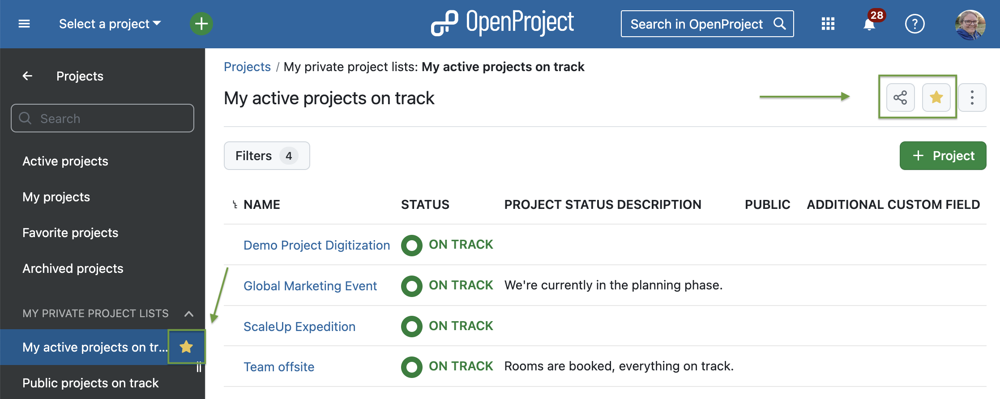
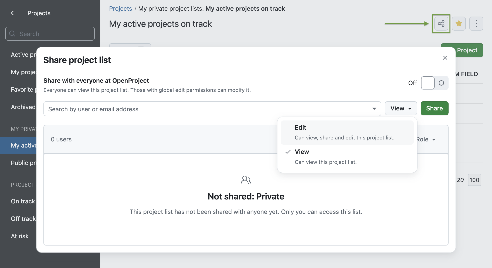
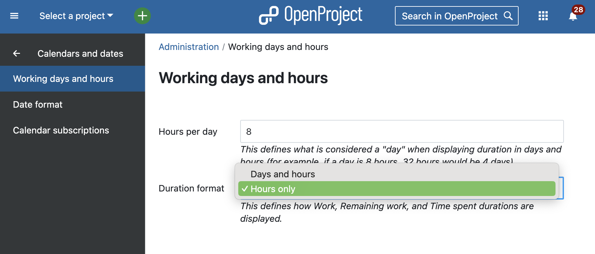
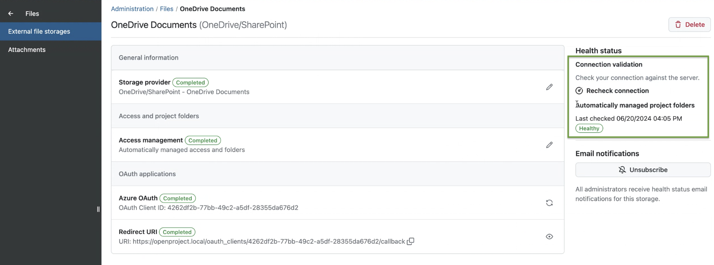
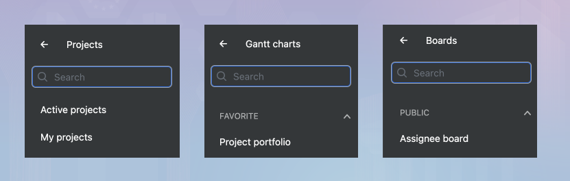
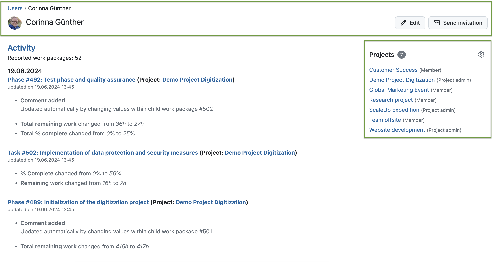
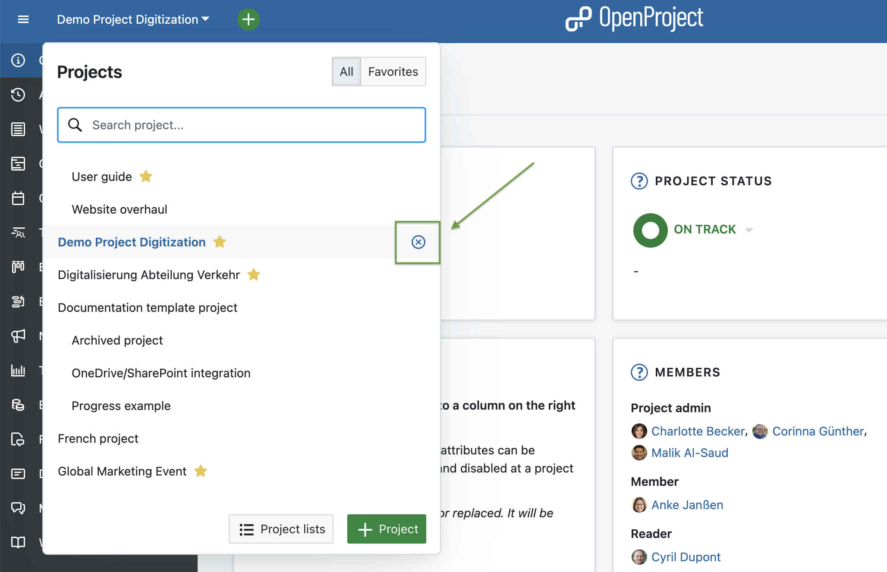
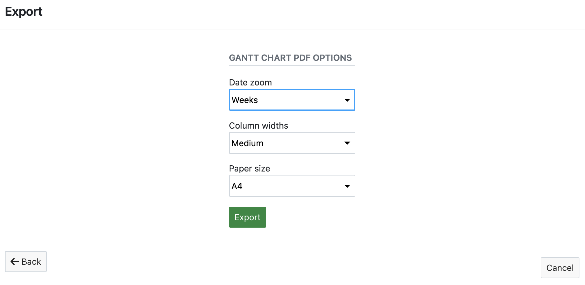

# OpenProject 14.3.0

Release date: 2024-07-17

We released OpenProject [OpenProject 14.3.0](https://community.openproject.org/versions/2053). The release contains several bug fixes and we recommend updating to the newest version. 

In these Release Notes, we will give an overview of important technical updates as well as important feature changes. At the end, you will find a complete list of all changes and bug fixes.

## Important technical updates

### Host header validation

Starting with this release, OpenProject will validate that the request HOST header to the application will match the `host_name` setting. In all installation methods, this should not require changes if you already proxy to the application with the Host header being forwarded to the application.

In some cases, you may need to set `ProxyPreserveHost On` (Apache2) or `proxy_set_header Host $host;` (nginx) to avoid receiving errors.

For more information on these changes, see the installation guides for your installation method of choice:
[Installation documentation](../../installation-and-operations/installation/)

This choice will reduce the chance of errors in configuration while preventing the possibility of a host header injection from within the application - a common security vulnerability if not prevented at the proxying server itself.

### Create multiple API access tokens

Users now have the ability to create and delete multiple API access keys. This enhancement allows you to distinguish between keys used in different places, providing better organization and security.

When navigating to the Access Tokens page in your account settings, you can add new API access keys to the list of existing keys. These keys become active immediately upon creation. Additionally, you can delete any API access key from the list, which deactivates the key. When adding a new API access key, you will be prompted to give it a name for easier identification.

For more information, see work package https://community.openproject.org/wp/48619.

### CRUD News API endpoints allow automatic creation of news

With OpenProject 14.3, we added CRUD News API endpoints. The Devkit is now able to automatically forward release messages to the OpenProject application.

For more information, see work package https://community.openproject.org/wp/55764.

### Configure SMTP timeout over ENV variable

As an admin, you now have the ability to configure the SMTP timeout, allowing you to use your mail server even if it responds slower than 5 seconds per request.

To configure the SMTP timeout, you need to add an environment variable. If this feature is missing or not documented, you can use the following workaround:

Add the following line to the /opt/openproject/config/application.rb file and restart OpenProject:

'# Set the timeout to 30 seconds (the default is 5 seconds)
config.action_mailer.smtp_timeout = 30'

This will extend the SMTP timeout to 30 seconds, accommodating slower mail server responses.

For more information, see work package https://community.openproject.org/wp/55879.

## Important feature changes

### Favorite project lists

In addition to marking individual projects as favorites, users can now mark project lists as favorites. A star icon appears next to saved private project lists, turning yellow when marked as a favorite. [Read more about favorite project lists in our user guide](../../user-guide/projects/project-lists/#favorite-project-lists).

### Share project lists with users and groups (Enterprise add-on) or instance-wide 

Continuing our focus on project portfolio management, OpenProject 14.3 introduces the ability to share project lists. Users can now:

- [Share project lists with everyone on your instance](../../user-guide/projects/project-lists/#share-with-everyone-at-openproject).
- [Share project lists with specific users or groups](../../user-guide/projects/project-lists/#share-project-lists-with-individual-users-and-groups-enterprise-add-on).

Please note that sharing project lists with individuals or groups is, just like sharing work packages with individuals or groups, an Enterprise add-on.

### Choose between progress reporting displayed in hours only or days and hours

In response to user feedback, OpenProject 14.3 now allows administrators to choose how to display duration formats for Work, Remaining work, and Spent time:

- Hours only
- Hours and days

This flexibility aims to accommodate different user preferences and improve the overall user experience. Read more about [units of measurement for progress reporting with OpenProject](../../user-guide/time-and-costs/progress-tracking/#units-of-measurement).

### Connection validation for OneDrive/SharePoint storages (Enterprise add-on)

With OpenProject 14.3, administrators can now manually trigger and test the connection for OneDrive/SharePoint storages. This feature helps ensure that storage settings are correctly configured and provides feedback if issues are detected. This validation is available once the file storage is fully configured and works for all OneDrive/SharePoint storages, supplementing the Health status check for automatically managed project folders.

Read more about [connection validation for external file storages](../../system-admin-guide/files/external-file-storages/health-status/#connection-validation).

> [!NOTE]
> We will start working on connection validation for Nextcloud storages soon. So if you're using Nextcloud as external file storage, stay tuned for our next releases!

### Search bar added to submenu component (project lists and Gantt and Boards modules)

The search functionality previously available for work packages has been extended to project lists, Gantt, and boards modules. This enhancement helps users quickly find specific elements within these modules, improving navigation and efficiency.

### New look with Primer for the user profile page

The user profile page in OpenProject 14.3 has been updated to GitHub's Primer design system, primarily affecting the header and right-hand column. This redesign offers a fresh and modern look.

### Unselect projects from the project selector

In OpenProject 14.3, users can now easily return to the global modules by unselecting the current project they are in, without needing to click on the grid icon. This improvement is particularly relevant for [openDesk](https://www.openproject.org/blog/sovereign-workplace/) users, where the grid icon is used to switch between apps.

### Gantt chart PDF export (Enterprise add-on): Date zoom based on calendar weeks

When exporting a Gantt chart to PDF, users will now be able to select calendar weeks as date zoom. This feature is particularly helpful for environments that communicate events based on calendar weeks. Read more about how to [export data from a Gantt diagram in OpenProject](../../user-guide/gantt-chart/#how-to-export-data-from-a-gantt-diagram).

<!--more-->

## Bug fixes and changes

<!-- Warning: Anything within the below lines will be automatically removed by the release script -->
<!-- BEGIN AUTOMATED SECTION -->

- Feature: Users are able to create multiple API access tokens \[[#48619](https://community.openproject.org/wp/48619)\]
- Feature: Starring favorite project lists \[[#51672](https://community.openproject.org/wp/51672)\]
- Feature: Shared project lists \[[#51779](https://community.openproject.org/wp/51779)\]
- Feature: Add searchbar to Submenu component \[[#52555](https://community.openproject.org/wp/52555)\]
- Feature: Unselect projects from the project selector \[[#53026](https://community.openproject.org/wp/53026)\]
- Feature: 14.3 Release teaser block updated \[[#55075](https://community.openproject.org/wp/55075)\]
- Feature: Add "Connection validation" functionality for OneDrive/SharePoint storages \[[#55443](https://community.openproject.org/wp/55443)\]
- Feature: Primerize the user profile page \[[#55605](https://community.openproject.org/wp/55605)\]
- Feature: Add CRUD News API endpoints to allow automatic creation of the release news \[[#55764](https://community.openproject.org/wp/55764)\]
- Feature: Configure SMTP timeout over ENV variable \[[#55879](https://community.openproject.org/wp/55879)\]
- Feature: Gantt chart PDF export: add date zoom based on calendar weeks \[[#55954](https://community.openproject.org/wp/55954)\]
- Feature: Allow admins to choose between display in hours-only or days and hours \[[#55997](https://community.openproject.org/wp/55997)\]
- Bugfix: Removing logged activity via spent time widget freezes the site and destroys spent time widget \[[#53200](https://community.openproject.org/wp/53200)\]
- Bugfix: The label for "Spent time" is still visible after deactivating the module "Time and costs" \[[#53772](https://community.openproject.org/wp/53772)\]
- Bugfix: Keyboard navigation for agenda item creation in meetings does not work as expected \[[#54376](https://community.openproject.org/wp/54376)\]
- Bugfix: Meeting Attachments not visible after changing from open to close - reload required \[[#55144](https://community.openproject.org/wp/55144)\]
- Bugfix: Set correct guards for action: deactivate\_work\_package\_attachments \[[#55194](https://community.openproject.org/wp/55194)\]
- Bugfix: Switch to show favorite projects is shown for anonymous user \[[#55254](https://community.openproject.org/wp/55254)\]
- Bugfix: PDF report: multi column table with pictures not included \[[#55268](https://community.openproject.org/wp/55268)\]
- Bugfix: Endless loop with work package attributes value macro for description \[[#55320](https://community.openproject.org/wp/55320)\]
- Bugfix: Shared work packages in template projects cause several flaws in new projects \[[#55362](https://community.openproject.org/wp/55362)\]
- Bugfix: Individual work packages in ID filter cannot be removed \[[#55447](https://community.openproject.org/wp/55447)\]
- Bugfix: Client Credential caching affecting debugging and Issue Resolution \[[#55620](https://community.openproject.org/wp/55620)\]
- Bugfix: Presenter field on agenda item becomes tiny if the current presenter is removed and a new one is searched for \[[#55621](https://community.openproject.org/wp/55621)\]
- Bugfix: Meeting Participants dialog is broken when the project has no members \[[#55624](https://community.openproject.org/wp/55624)\]
- Bugfix: Can't copy work package that has a child with set work field \[[#55656](https://community.openproject.org/wp/55656)\]
- Bugfix: Page title is wrong on project attributes settings page \[[#55657](https://community.openproject.org/wp/55657)\]
- Bugfix: Failing storage sync breaks integration job  \[[#55767](https://community.openproject.org/wp/55767)\]
- Bugfix: Type gets automatically changed on move to target project if type not activated in project (possible data loss) \[[#55771](https://community.openproject.org/wp/55771)\]
- Bugfix: Preselected colors for Status and Type are hard to see in dark mode \[[#55774](https://community.openproject.org/wp/55774)\]
- Bugfix: Follow-up issues for the Dark mode \[[#55775](https://community.openproject.org/wp/55775)\]
- Bugfix: Click the title of "LATEST ACTIVITY AT" column in project list will meet an error notification. \[[#55783](https://community.openproject.org/wp/55783)\]
- Bugfix: Main menu resizer handle icon change on hover not working for Safari \[[#55786](https://community.openproject.org/wp/55786)\]
- Bugfix: Deactivating work package attachment on project fails, if project has unset required project attribute \[[#55789](https://community.openproject.org/wp/55789)\]
- Bugfix: Form validation in add project dialog missing \[[#55801](https://community.openproject.org/wp/55801)\]
- Bugfix: Handle errors of misconfigured storages during project copy \[[#55805](https://community.openproject.org/wp/55805)\]
- Bugfix: Project list filter component extends to the width of project columns \[[#55812](https://community.openproject.org/wp/55812)\]
- Bugfix: Export XLS button is out of screen on Time & Cost page \[[#55874](https://community.openproject.org/wp/55874)\]
- Bugfix: Star for favorite projects is black \[[#55914](https://community.openproject.org/wp/55914)\]
- Bugfix: Projects list drop down cut off in memberships page \[[#55922](https://community.openproject.org/wp/55922)\]
- Bugfix: Boards icon in the waffle menu doesn't show all boards \[[#55924](https://community.openproject.org/wp/55924)\]
- Bugfix: Invalid refresh tokens of Nextcloud are not handled correctly  \[[#56011](https://community.openproject.org/wp/56011)\]
- Bugfix: BIM-Model - Viewpoint - all viewpoints are saved to the last BCF after the refresh of the Viewer \[[#56012](https://community.openproject.org/wp/56012)\]
- Bugfix: File Upload fails if exactly 4096 Byte \[[#56032](https://community.openproject.org/wp/56032)\]
- Bugfix: LDAP seeder: Password interpreted as YAML \[[#56039](https://community.openproject.org/wp/56039)\]
- Bugfix: hal+json requests treated as plain html requests \[[#56040](https://community.openproject.org/wp/56040)\]
- Bugfix: Filter autocompleter not loading results \[[#56188](https://community.openproject.org/wp/56188)\]
- Bugfix: Sharing ProjectLists (at least with individuals) should only be available for enterprise \[[#56249](https://community.openproject.org/wp/56249)\]
- Bugfix: Share modal subheader text is misplaced on mobile + user placeholder text overlaps \[[#56251](https://community.openproject.org/wp/56251)\]
- Bugfix: Direct-upload-token error on Nextcloud with prefix \[[#56276](https://community.openproject.org/wp/56276)\]
- Bugfix: Sidebar items for shared lists bellow 'Public project lists' should be part of 'Shared project lists' \[[#56444](https://community.openproject.org/wp/56444)\]

<!-- END AUTOMATED SECTION -->
<!-- Warning: Anything above this line will be automatically removed by the release script -->

## Contributions

A very special thank you goes to the City of Cologne for sponsoring features on project lists. Also a big thanks to our Community members for reporting bugs and helping us identify and provide fixes. Special thanks for reporting and finding bugs go to Bill Bai, Alexander Hosmann, Alexander Aleschenko, and Sven Kunze.

A thank you also goes to Eric Guo for contributing the Date zoom based on calendar weeks in the Gantt chart PDF export.

Last but not least, we are very grateful for our very engaged translation contributors on Crowdin, who translated quite a few OpenProject strings! This release we would like to highlight user [Todor Belov](https://crowdin.com/profile/todor.belov), who has done an outstanding number of translations for the Bulgarian language in recent weeks.

Would you like to help out with translations yourself? Then take a look at our [translation guide](../../development/translate-openproject/) and find out exactly how you can contribute. It is very much appreciated!
