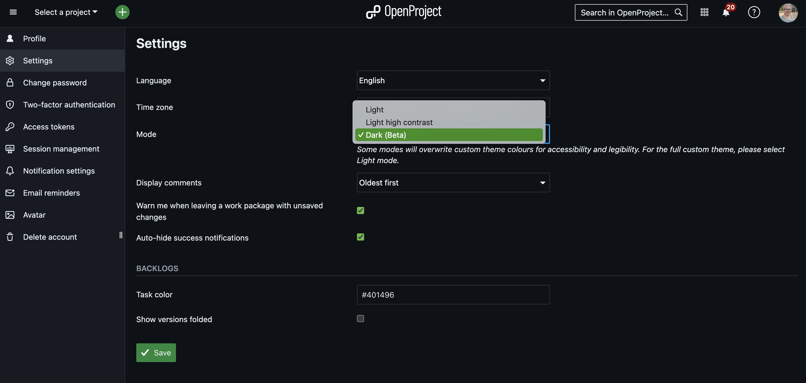
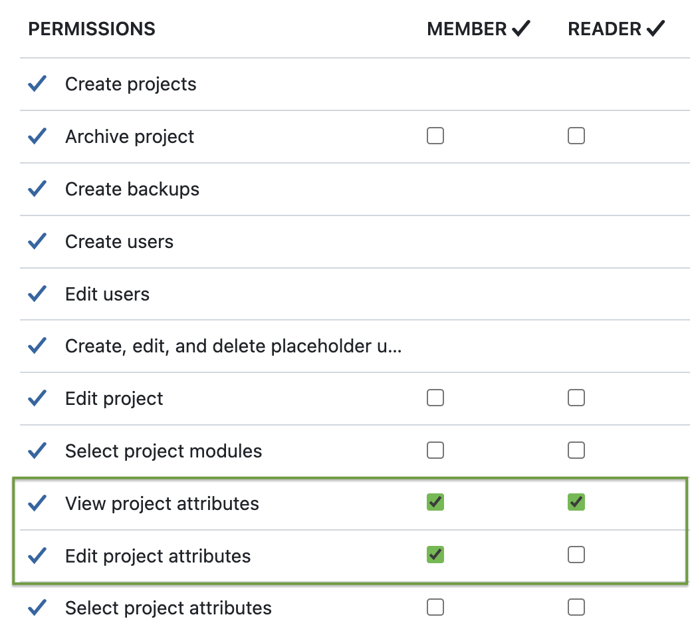
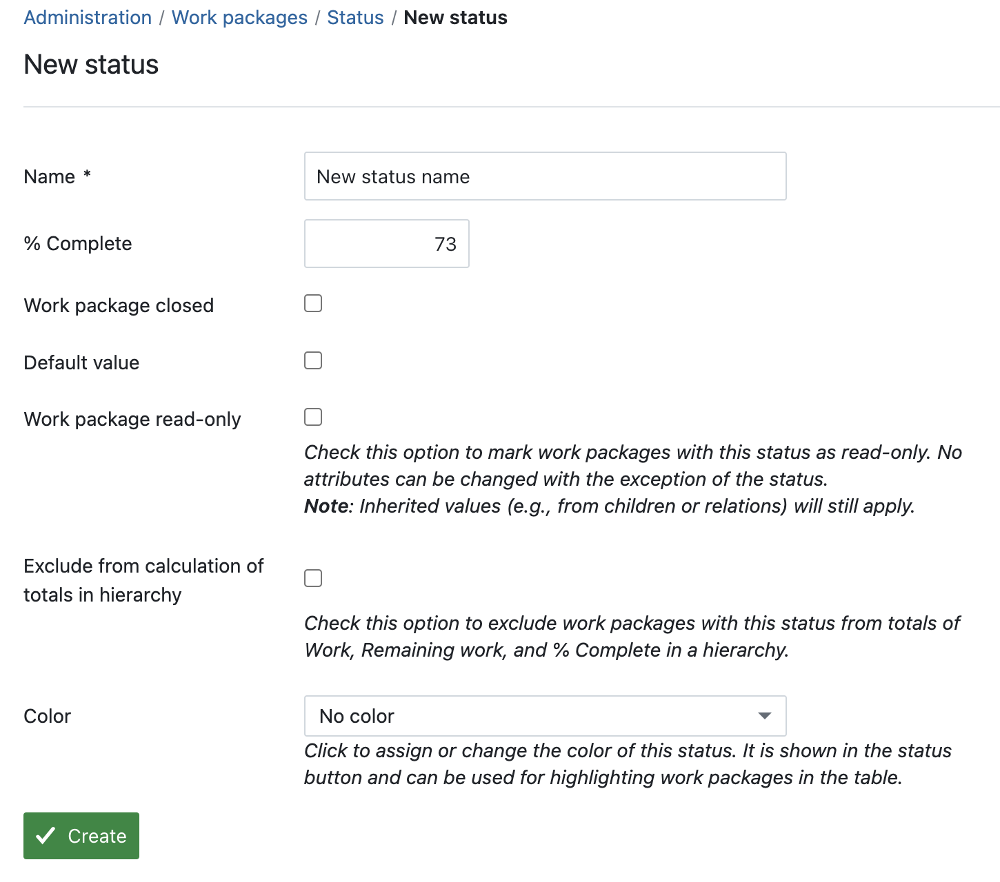
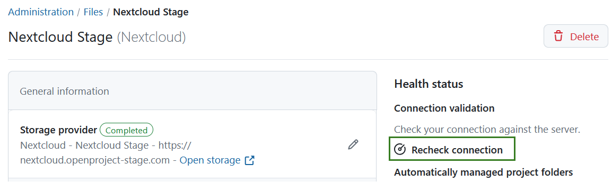
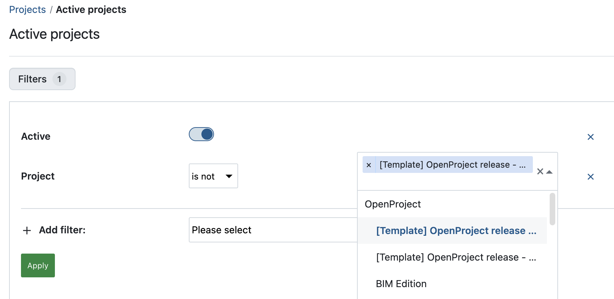
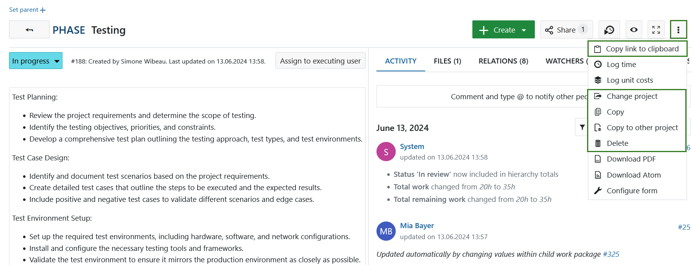
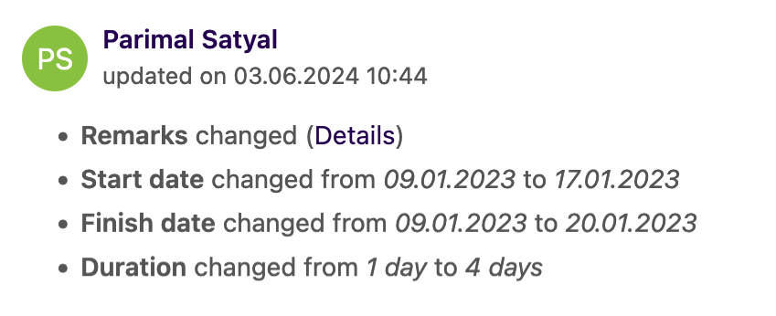

# OpenProject 14.4.0

Release date: 2024-08-14

We released [OpenProject 14.4.0](https://community.openproject.org/versions/2063). The release contains several bug fixes and we recommend updating to the newest version. 

In these Release Notes, we will give an overview of important technical updates as well as important feature changes. At the end, you will find a complete list of all changes and bug fixes.

## Important technical updates

### Extend API authentication to accept JWT issued by OpenID provider to other client

OpenProject 14.4 introduces a new feature that allows OpenID clients, such as Nextcloud servers, to use access tokens obtained from an OpenID provider, like Keycloak, as an authentication mechanism for the OpenProject API. This enhancement **enables users to skip the OAuth grant flow**, streamlining the authentication process.

With this feature, the OpenProject API will validate access tokens issued by the OpenID provider (Keycloak) by checking the token's signature and authenticating the user using the sub claim value. This integration ensures secure and efficient API authentication for OpenID clients.

For more details, take a look at our [API documentation](../../api/introduction/#oidc-provider-generated-jwt-as-a-bearer-token).

### Improve error messages and logs of automatically managed project folders synchronization services/jobs

OpenProject 14.4 introduces significant enhancements to logging, debugging, and error messages for automatically managed project folders synchronization services and jobs. These improvements aim to provide clearer messages and more detailed logs for both administrators and users.

Up to now, the system faced issues such as unclear error messages, insufficient log details, and a lack of localized error messages. To address these problems, **the system now provides context-specific error messages** instead of vague ones. For example, instead of "Outbound request destination not found," the system will now display messages like 'The file #{file_link.origin_name} was not found on #{storage_name}', which will also be localized to improve clarity.

Additionally, the logging structure has been enhanced to provide more detailed, tagged entries for better traceability.

For more details, see https://community.openproject.org/wp/56861.

## Important feature changes

### Personal settings: Dark mode

Dark mode for OpenProject is finally here! In the '[My account](../../user-guide/my-account/#profile-settings)' section under 'Settings', there is an **option labeled 'Mode' where users can now select 'Dark (Beta).'** – as an alternative to the light mode. When the dark mode is selected, the change applies only to that user, not to the entire instance. 

Please note that this feature has been tested extensively, and we believe it works well. However, users might encounter issues that we haven't seen. Therefore, it will remain in beta for now, until we resolve all potential errors and ensure there are no issues.

For more details, see https://community.openproject.org/wp/36233.

### Project attributes: Separate permissions for viewing and editing

In OpenProject 14.4, new permissions for managing [project attributes](../../user-guide/projects/project-settings/project-attributes/) provide project admins with more control over who can view and edit these attributes.

The update adds **two new permissions: 'View project attributes' and 'Edit project attributes'**. 'View project attributes' is added to all roles, while 'Edit project attributes' is added to roles with the 'Edit project' permission.

Permissions are now independent, so users with 'Edit project' can lack the new permissions. Users without 'View project attributes' cannot see or search project attributes in the overview, settings, list, exports, API, or Schema API. Users without 'Edit project attributes' cannot modify these attributes but can view them if they have view permission.

For more details, see https://community.openproject.org/wp/50844.

### Status-based progress reporting: Freely input % complete values for statuses

We have improved the status-based progress indicator in OpenProject. As requested by some users, you can now **enter any percentage value in the "% Complete" field**, e.g. 9% or 73%, instead of being limited to 10% increments. Please note that only integer values between 1 and 100 are allowed, so decimal values or non-numeric inputs will not be accepted.

Here is an example of a new status that triggers a % Complete of 73%:

For more details on status-based progress reporting, see our [system admin guide](../../system-admin-guide/manage-work-packages/work-package-status/).

### Nextcloud storages: Connection validation

Last month, we already released a connection validation feature for OneDrive/SharePoint storages. With OpenProject 14.4, we added a connection validation for Nextcloud storages. This feature allows administrators to **verify if the storage works as expected and provides helpful feedback if issues arise**. A new button enables the manual triggering of a connection test and validation of the Nextcloud storage settings. If an error occurs during the test, it will be displayed along with an explanation and helpful information.

The validations include checking if the external storage server is reachable, verifying for SSL errors, ensuring the server is accessible, confirming that necessary apps are activated on Nextcloud and that their versions are compatible, and validating the app password.

Read more about connection validation for Nextcloud in our [system admin guide](../../system-admin-guide/files/external-file-storages/health-status/#connection-validation-for-nextcloud).

### Project lists: Select/Exclude projects in project list explicitly via filter

In OpenProject 14.4, users can now **explicitly select or exclude individual projects in the project list, using a filter**. This feature allows users to limit and refine their project lists more precisely. Within the filter section of the project list, there is a new filter called "Project." This filter supports the "is (OR)" and "is not" operators and allows selecting projects via an autocompleter with multiselect capability.

For example, you can filter your active projects by excluding certain projects:

For more details, see https://community.openproject.org/wp/55233.

### Meetings: Saving a new agenda item does not automatically add another empty one

In the past, when working with the meeting module in OpenProject, a new agenda item was automatically created as soon as a previous one was saved. This was originally built so that new items could be added to a meeting in quick succession. However, working with it has shown that often no new agenda item was needed at all - but, for example, a work package should be added or another change made. For this reason, OpenProject 14.4 has virtually reversed this feature: **saving a new agenda item no longer creates a new empty one**.

### Meetings tab on work packages: Display related meetings chronologically

In OpenProject 14.4, the **meetings tab within work packages now displays related meetings in chronological order**. This feature is designed for users who organize meetings and connect work packages with dynamic meetings, making it easier to see when a work package has been discussed.

For upcoming meetings, the tab will display them in chronological order with the nearest occurrence first and the most distant last. For past meetings, the tab will display them in reverse chronological order, with the most recent occurrence first and the oldest last.

### Design: Improve avatar color generation so that users with same names are distinguishable

Some users share the same name or create several accounts with the same name. To be able to tell them apart, e.g. when looking through search results for that name, we improved the avatar color generation, so that **users with the same name are displayed with different colors**. We recommend uploading an avatar image so that the distinction is even more obvious.

### Dropdown menu on work packages: Move "Copy link to clipboard" up

To avoid confusion with the "copy" or "copy to another project" actions, we have moved the "copy link to clipboard" action upwards in the drop-down menu for work packages. This action is now in third place in the work package table view. In the work package detail view, the action is now in first position.

### Add link to storage provider in storage edit view

To improve efficiency and access to file storages, OpenProject 14.4 allows administrators to click on a **direct link to the storage provider in the edit view of the storage**.

In the "General information" section, there is now a link that opens in a new window and leads to the root folder of the storage. For Nextcloud, this link refers to the root folder of the Nextcloud instance. For OneDrive/SharePoint, the link refers to the root folder of the drive ID and also works with "OneDrive Business".

See https://community.openproject.org/wp/56045 for more information on this feature.

### Show changes of long text custom fields in the activity similar to changes in the description

To keep the activity view cleaner when multiple changes are made to long text custom fields, OpenProject 14.4 now **displays updates to long custom fields in a similar format to description updates**. As a user watching the activity, you will see an indication of changes to long text custom fields, making it easier to manage and review activities.

In the activity tab, updates to long text custom fields will be displayed as in the following example – 'Remarks' being a custom field:

Clicking on the "Details" link will take the user to the diff view, which is also used for work package descriptions and project status explanations. See our [user guide on custom fields](../../user-guide/projects/project-settings/custom-fields/) for more information.

<!--more-->

## Bug fixes and changes

<!-- Warning: Anything within the below lines will be automatically removed by the release script -->
<!-- BEGIN AUTOMATED SECTION -->

- Bugfix: Project custom field set to searchable is not searchable  \[[#34363](https://community.openproject.org/wp/34363)\]
- Bugfix: Unclear that status cannot be updated when required custom field is set \[[#35556](https://community.openproject.org/wp/35556)\]
- Bugfix: Missing property in the response of api/v3/work\_packages/{id} JSON (path: \_links/copy)  \[[#41053](https://community.openproject.org/wp/41053)\]
- Bugfix: 'undefined method path' for nil:NilClass when click attachment \[[#41852](https://community.openproject.org/wp/41852)\]
- Bugfix: Required user fields of type Boolean missing asterisk  \[[#42325](https://community.openproject.org/wp/42325)\]
- Bugfix: Breadcrumb and menu structure is inconsistent for user administration \[[#50109](https://community.openproject.org/wp/50109)\]
- Bugfix: "Time 1" label in Email reminders truncated when language=FR \[[#50607](https://community.openproject.org/wp/50607)\]
- Bugfix: Primer::OpenProject::InputGroup component text input breaks with captions \[[#51376](https://community.openproject.org/wp/51376)\]
- Bugfix: Cannot use placeholder user in filter "Assignee or belonging group" \[[#51399](https://community.openproject.org/wp/51399)\]
- Bugfix: Built-in API v3 DOC doesn't run REQUESTS (requested URL was not found on this server) \[[#51847](https://community.openproject.org/wp/51847)\]
- Bugfix: Can't escape from "Latest activity" query \[[#52759](https://community.openproject.org/wp/52759)\]
- Bugfix: Static queries are not highlighted in the side menu \[[#52954](https://community.openproject.org/wp/52954)\]
- Bugfix: Adding new task in a board shows unnecessary warning message when switching type \[[#53571](https://community.openproject.org/wp/53571)\]
- Bugfix: Default value is not saved on custom field creation, only on update \[[#53574](https://community.openproject.org/wp/53574)\]
- Bugfix: 'Mark all as read' clears already read notifications  \[[#53587](https://community.openproject.org/wp/53587)\]
- Bugfix: Status board: Column 'new' can be displayed twice \[[#53967](https://community.openproject.org/wp/53967)\]
- Bugfix: Project filters allow selection of archived projects: trigger an error \[[#54278](https://community.openproject.org/wp/54278)\]
- Bugfix: Milestones are showing the children ticket section \[[#54983](https://community.openproject.org/wp/54983)\]
- Bugfix: Can't install plugin on Docker image \[[#55266](https://community.openproject.org/wp/55266)\]
- Bugfix: Copying a meeting in a project with no members omits creator as attendee \[[#55623](https://community.openproject.org/wp/55623)\]
- Bugfix: Docker-Compose OpenProject assets can't be loaded after update \[[#55776](https://community.openproject.org/wp/55776)\]
- Bugfix: Wiki: history compares only with most recent version and ignores previous selection \[[#55932](https://community.openproject.org/wp/55932)\]
- Bugfix: OneDrive/SharePoint storage with AMPF can be added as manual folder \[[#55939](https://community.openproject.org/wp/55939)\]
- Bugfix: Date CF cannot be set for users \[[#56033](https://community.openproject.org/wp/56033)\]
- Bugfix: \[BUG\] Gantt Diagrams not sorted alphabetically in the left side menu \[[#56042](https://community.openproject.org/wp/56042)\]
- Bugfix: Can't change default work package lists columns \[[#56059](https://community.openproject.org/wp/56059)\]
- Bugfix: Spacing between title and tabs in page headers is too small \[[#56060](https://community.openproject.org/wp/56060)\]
- Bugfix: \[AppSignal\]  TypeError for Gitlab Merge Request without description \[[#56065](https://community.openproject.org/wp/56065)\]
- Bugfix: Automatically created private view should be localized \[[#56138](https://community.openproject.org/wp/56138)\]
- Bugfix: Not Display Attribute help texts for Date \[[#56189](https://community.openproject.org/wp/56189)\]
- Bugfix: Archived & Activated projects are not clearly distinguishable in project autocompleter. \[[#56247](https://community.openproject.org/wp/56247)\]
- Bugfix: Missing filter value in translation string \[[#56253](https://community.openproject.org/wp/56253)\]
- Bugfix: Share drop down cut of when only a single user is shared with \[[#56292](https://community.openproject.org/wp/56292)\]
- Bugfix: Small Octicon changes required \[[#56337](https://community.openproject.org/wp/56337)\]
- Bugfix: Searching for text in work packages is not intuitive \[[#56398](https://community.openproject.org/wp/56398)\]
- Bugfix: NoMethodError in SlackNotificationJob#perform \[[#56435](https://community.openproject.org/wp/56435)\]
- Bugfix: Static queries are not highlighted in side menu \[[#56436](https://community.openproject.org/wp/56436)\]
- Bugfix: New agenda item cut off if the page is already filled \[[#56437](https://community.openproject.org/wp/56437)\]
- Bugfix: URI::InvalidURIError in SlackNotificationJob#perform \[[#56439](https://community.openproject.org/wp/56439)\]
- Bugfix: Buttons in Attribute help text modal are too close \[[#56445](https://community.openproject.org/wp/56445)\]
- Bugfix: Info banner breaks autocompleter dropdown in status board \[[#56447](https://community.openproject.org/wp/56447)\]
- Bugfix: Meetings: Invitation e-mail sent out even though "send e-mails" is de-selected (re-invite) \[[#56493](https://community.openproject.org/wp/56493)\]
- Bugfix: Wiki: Only first site will be printed / content cut off \[[#56576](https://community.openproject.org/wp/56576)\]
- Bugfix: Breadcrumb and menu structure is inconsistent for work package administration \[[#56585](https://community.openproject.org/wp/56585)\]
- Bugfix: Some pages of Administration/Projects are missing a breadcrumb \[[#56586](https://community.openproject.org/wp/56586)\]
- Bugfix: Some administration pages are missing breadcrumbs and html titles \[[#56587](https://community.openproject.org/wp/56587)\]
- Bugfix: Community edition demo videos do not render \[[#56602](https://community.openproject.org/wp/56602)\]
- Bugfix: Background of login screen is inconsistent \[[#56608](https://community.openproject.org/wp/56608)\]
- Bugfix: \[AppSignal\] TypeError Further errors for other hooks with missing information \[[#56609](https://community.openproject.org/wp/56609)\]
- Bugfix: Breadcrumb and menu structure is inconsistent for Email administration \[[#56614](https://community.openproject.org/wp/56614)\]
- Bugfix: Breadcrumb and menu structure is inconsistent for Authentication administration \[[#56615](https://community.openproject.org/wp/56615)\]
- Bugfix: Slack Integration page in Admin doesn't have breadcrumbs \[[#56622](https://community.openproject.org/wp/56622)\]
- Bugfix: Search bar stays open when redirecting to search results page \[[#56704](https://community.openproject.org/wp/56704)\]
- Bugfix: Creating an API token crashes the page \[[#56780](https://community.openproject.org/wp/56780)\]
- Bugfix: No custom field section created for cloud trial installation \[[#56792](https://community.openproject.org/wp/56792)\]
- Bugfix: Switching public state should also change the empty state \[[#56795](https://community.openproject.org/wp/56795)\]
- Bugfix: Dark mode: Wrong text color in Member selection \[[#56805](https://community.openproject.org/wp/56805)\]
- Bugfix: Slack Integration page in Admin doesn't have Save button \[[#56813](https://community.openproject.org/wp/56813)\]
- Bugfix: Don't blink custom fields form when hiding parts depending on field format \[[#56842](https://community.openproject.org/wp/56842)\]
- Bugfix: Round corners on notification separator lines \[[#56913](https://community.openproject.org/wp/56913)\]
- Bugfix: WebAuthn fails on initial registration with activated 2FA security policy \[[#56988](https://community.openproject.org/wp/56988)\]
- Bugfix: File names with url-unsafe characters not working \[[#56997](https://community.openproject.org/wp/56997)\]
- Bugfix: OpenProject Dark Mode: selection color of table rows \[[#57003](https://community.openproject.org/wp/57003)\]
- Bugfix: Impossible to link/create a work package from Nextcloud  \[[#57210](https://community.openproject.org/wp/57210)\]
- Feature: Dark Mode for OpenProject \[[#36233](https://community.openproject.org/wp/36233)\]
- Feature: Theming plugin for Nextcloud Hub integration \[[#55841](https://community.openproject.org/wp/55841)\]
- Feature: New permissions for project attributes on project level \[[#50844](https://community.openproject.org/wp/50844)\]
- Feature: Create a "Sidepanel" component for the right side panel of a layout (e.g. on Meetings page) \[[#54033](https://community.openproject.org/wp/54033)\]
- Feature: Replace angular sub menu with rails component \[[#55182](https://community.openproject.org/wp/55182)\]
- Feature: Select/Exclude projects in project list explicitly via filter \[[#55233](https://community.openproject.org/wp/55233)\]
- Feature: Show changes of long text custom fields in the activity similar to changes in the description \[[#55280](https://community.openproject.org/wp/55280)\]
- Feature: Meetings: Saving a new agenda item does not automatically add another empty one \[[#55423](https://community.openproject.org/wp/55423)\]
- Feature: Extend API authentication to accept JWT issued by OpenID provider to other client.  \[[#55643](https://community.openproject.org/wp/55643)\]
- Feature: Status-based progress mode: Allow users to freely input % complete values for statuses \[[#55803](https://community.openproject.org/wp/55803)\]
- Feature: Add "Connection validation" functionality for Nextcloud storages \[[#55836](https://community.openproject.org/wp/55836)\]
- Feature: Add link to storage provider in storage edit view \[[#56045](https://community.openproject.org/wp/56045)\]
- Feature: Move "Copy link to clipboard" \[[#56058](https://community.openproject.org/wp/56058)\]
- Feature: Create release 14.4 teaser, incl. feature image \[[#56218](https://community.openproject.org/wp/56218)\]
- Feature: Improve avatar color generation so that users with same names are distinguishable \[[#56325](https://community.openproject.org/wp/56325)\]
- Feature: Require explicit type selection on project change \[[#56331](https://community.openproject.org/wp/56331)\]
- Feature: Color of text and icons of primary buttons shall adapt when color is light \[[#56463](https://community.openproject.org/wp/56463)\]
- Feature: Transform modules menu in top menu into a Primer menu \[[#56507](https://community.openproject.org/wp/56507)\]
- Feature: Meetings tab: Display related meetings chronologically \[[#56651](https://community.openproject.org/wp/56651)\]

<!-- END AUTOMATED SECTION -->
<!-- Warning: Anything above this line will be automatically removed by the release script -->

## Contributions
A very special thank you goes to the City of Cologne again for sponsoring features on project attributes and project lists. 

Also a big thanks to our Community members for reporting bugs and helping us identify and provide fixes.
Special thanks for reporting and finding bugs go to Johan Bouduin, Sven Kunze and Marcel Carvalho.

Last but not least, we are very grateful for our very engaged translation contributors on Crowdin, who translated quite a few OpenProject strings! This release we would like to highlight the three following users: 
- [Jeff Li](https://crowdin.com/profile/jeff_li) for translations to Chinese Simplified,
- [Adam Siemienski ](https://crowdin.com/profile/siemienas) for translations to Polish,
- [Yuliia Pavliuk](https://crowdin.com/profile/pav.yulia) for translations to Ukrainian.

Would you like to help out with translations yourself? Then take a look at our translation guide and find out exactly how you can contribute. It is very much appreciated!
