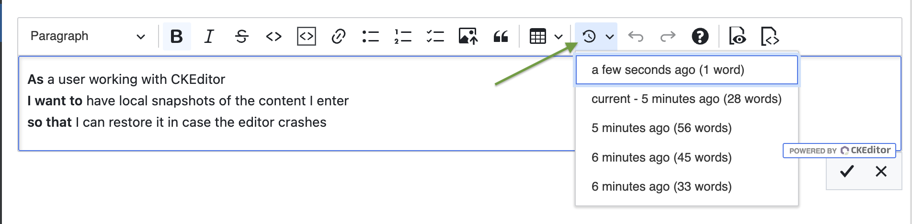
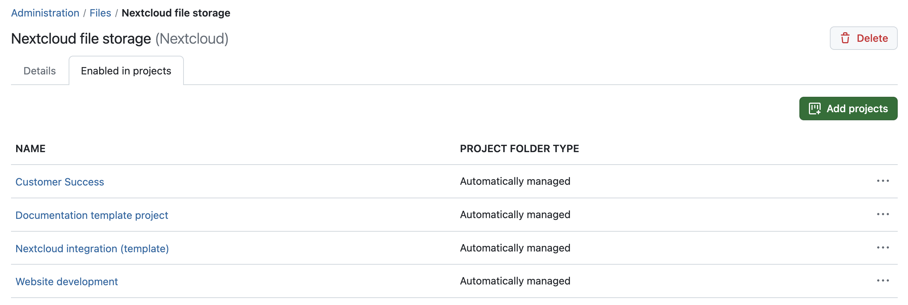
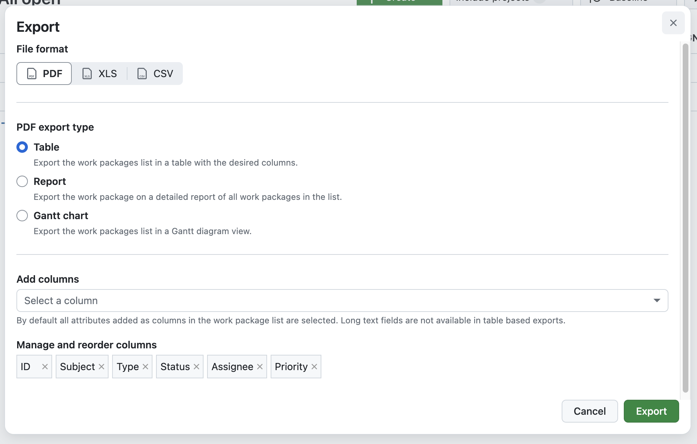
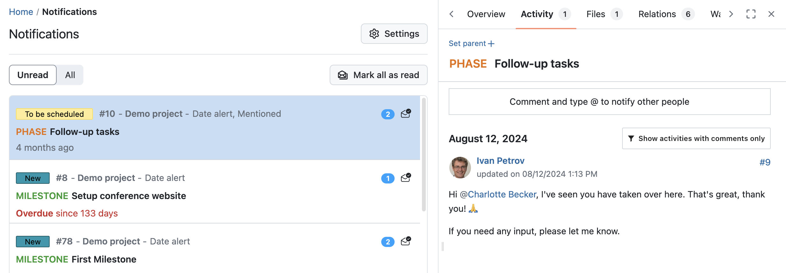
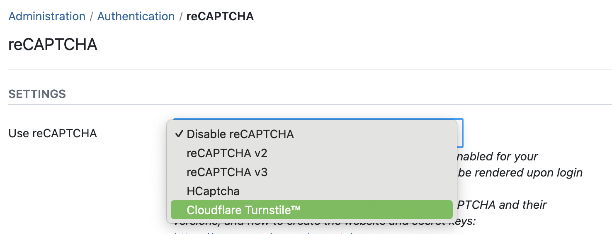

# OpenProject 14.5.0

Release date: 2024-09-11

We released OpenProject [OpenProject 14.5.0](https://community.openproject.org/versions/1411). The release contains several bug fixes and we recommend updating to the newest version. 

In these Release Notes, we will give an overview of important feature changes as well as breaking changes for developers. At the end, you will find a complete list of all changes and bug fixes.

## Important updates for Docker compose

The installation repository for Docker Compose has been moved to [https://github.com/opf/openproject-docker-compose](https://github.com/opf/openproject-docker-compose).

When updating, you will note that the repository now only contains the Docker compose setup, and the legacy Kubernetes deployment option has been removed. This means the folder structure has been changed slightly. No other changes are necessary. As we introduced a new local image starting in 14.4., the command to install and upgrade the Docker compose setup has been changed. Please double-check the [Docker compose installation guide](../../installation-and-operations/installation/docker/) on how to upgrade your installation.

If you are looking for an option to install OpenProject on Kubernetes, please use our [OpenProject Helm chart](../../installation-and-operations/installation/helm-chart/).

## Important feature changes

### Keep and restore local versions of WYSIWYG content changes

As of OpenProject 14.5, every WYSIWYG content change is saved locally so that you can restore it if the editor crashes (e.g. if you reload the page with unsaved changes). OpenProject uses WYSIWYG editors in work package descriptions, wikis and forums. To access the locally saved content of previous changes, click on the new icon we have added to the top of your editor. If there are unsaved changes to the content, you will see a drop-down list with the changes listed, each showing the time and word count of the respective content version.

Please note that locally stored means that only you can see and restore your unsaved changes.

### Enable a storage for multiple projects at once

Admins responsible for storages in OpenProject can now save time by enabling a storage for multiple projects at once. A new **Enabled in projects** tab is added to the edit storage view. Here, admins see a list of all the projects that the storage is activated in. They can now add projects to the storage by clicking the green button **Add projects**. Here is an example of how this looks like for a Nextcloud file storage:

This feature works for all [external file storages](../../system-admin-guide/files/external-file-storages/) that are currently possible with OpenProject.

### Export work package lists in an updated modal with additional settings

With OpenProject 14.5., we updated the modal for exporting work package lists. The new modal is more intuitive to use and has more options. It not only looks much better now, users can also export their work package list in form of a Gantt chart. Also, they can now select and reorder the columns to be displayed in the export directly in the modal.

### Release to Community: Display custom field columns/filters in project lists

From time to time an Enterprise add-on is released for the free community version. We are happy to announce that with OpenProject 14.5, custom field columns/filters can be displayed in project lists in all editions. This means that also Community users can now filter and sort their project lists using custom fields in order to create the best possible overview. 

### Updated user experience in the notification center

We did some design changes in the notification center, to improve your user experience. For example, the buttons **Unread**, **All** and **Mark all as read** are now placed on the left side, above your list of notifications.

### Use CloudFlare Turnstile as Captcha

In addition to reCAPTCHA, administrators can now use [CloudFlare Turnstile](https://developers.cloudflare.com/turnstile/) as Captcha. Cloudflare Turnstile is an alternative to Recaptcha that avoids user interaction. 

To use Cloudflare Turnstile with OpenProject, you need to configure the reCAPTCHA settings in the Cloudflare dashboard. Read more in our [system admin guide](../../system-admin-guide/authentication/recaptcha/).

> [!NOTE]
> A special Thanks goes to [Aaron Dewes](https://github.com/AaronDewes), the initiator and Community contributor for this feature. It is very much appreciated! 💙

### Improved filter search for custom project lists

Filtering and searching project lists has been improved with OpenProject 14.5: 

1. A fixed search field has been added so that you can quickly enter a project name and search for it.
2. When selecting a new filter, the project list below will immediately reload and display the selected filters.

See our user guide to learn more about [project lists and how to filter them](../../user-guide/projects/project-lists/#project-lists-filters).

### PDF export of meeting agenda and meeting

When pressing the key combination for printing – e.g. **cmd + P** for mac users or **STRG + P** for Windows users – you can create your meeting as PDF, download and print it. This has been improved with OpenProject 14.5, so that, for example, meeting buttons like **+ Add** are not displayed in the PDF.

### Meetings: Disable by default "Send out invitation emails upon creation"

When creating a new meeting in OpenProject, you can choose wheather you want to send out invitation emails or not. Up until now, this has been enabled by default. Due to user feedback, this option is now disabled per default.

### Rename actions in work package dropdown menu

We have renamed some of the actions in the work package dropdown menu. They should now be easier to understand and more intuitive to use for new users. Here is an overview of the renaming:

 Old name   | New name                                                     | 
 --------------------------- | ------------------------------------------------------------ | 
 Change project   | Move to another project | 
 Copy             | Duplicate        |
 Copy to other project | Duplicate in another project |

<!--more-->

## Breaking changes for developers

In this release, the dynamic bootstrapping of Angular components has been removed. Instead, use `Angular Elements` to define it as a custom element. See our [openproject-proto\_plugin prototypical plug-in](https://github.com/opf/openproject-proto_plugin) to see how to do that.

## Bug fixes and changes

<!-- Warning: Anything within the below lines will be automatically removed by the release script -->
<!-- BEGIN AUTOMATED SECTION -->

- Feature: PDF export of meeting agenda and meeting  \[[#22517](https://community.openproject.org/wp/22517)\]
- Feature: Work packages export modal with settings &amp; Job status modal \[[#48274](https://community.openproject.org/wp/48274)\]
- Feature: Enable a storage for multiple projects at once \[[#49212](https://community.openproject.org/wp/49212)\]
- Feature: Update PageHeaders &amp; SubHeaders in the My account pages \[[#53807](https://community.openproject.org/wp/53807)\]
- Feature: Update PageHeaders &amp; SubHeaders in the Admin pages \[[#53808](https://community.openproject.org/wp/53808)\]
- Feature: Always visible text filter in project list \[[#55234](https://community.openproject.org/wp/55234)\]
- Feature: Meetings: Disable by default &quot;Send out invitation emails upon creation&quot; \[[#56275](https://community.openproject.org/wp/56275)\]
- Feature: Create 14.5 release teaser \[[#56535](https://community.openproject.org/wp/56535)\]
- Feature: Make Project List and header view turbo aware \[[#56557](https://community.openproject.org/wp/56557)\]
- Feature: Release custom field columns/filters in project lists to Community Edition \[[#56573](https://community.openproject.org/wp/56573)\]
- Feature: Include multiple 24px icons to our library \[[#56647](https://community.openproject.org/wp/56647)\]
- Feature: Enlarge meeting history pop-up / reduce scrolling \[[#56814](https://community.openproject.org/wp/56814)\]
- Feature: Move some actions in the Notification center into the SubHeader \[[#56864](https://community.openproject.org/wp/56864)\]
- Feature: Change the styling of the split screen layout in the notification center \[[#56866](https://community.openproject.org/wp/56866)\]
- Feature: Rename actions in work package dropdown menu \[[#56900](https://community.openproject.org/wp/56900)\]
- Feature: Add numbers to tabs in new notification split screen \[[#56918](https://community.openproject.org/wp/56918)\]
- Feature: Clarify meaning of &quot;Send e-mails&quot; settings in meetings creation form \[[#57261](https://community.openproject.org/wp/57261)\]
- Feature: Captcha support for CloudFlare Turnstile \[[#57328](https://community.openproject.org/wp/57328)\]
- Feature: Full height split screen for notifications \[[#57341](https://community.openproject.org/wp/57341)\]
- Feature: Administration for workflows: Uncheck box by default to display all statuses \[[#57421](https://community.openproject.org/wp/57421)\]
- Feature: Store revisions of WYSIWYG content in local storage \[[#57490](https://community.openproject.org/wp/57490)\]
- Bugfix: \[API doc\] GET /projects missing params and incorrect response \[[#40642](https://community.openproject.org/wp/40642)\]
- Bugfix: OpenAPI Specs wrong for creating work package relations \[[#40942](https://community.openproject.org/wp/40942)\]
- Bugfix: API Description and OpenAPI Spec not consistent \[[#40945](https://community.openproject.org/wp/40945)\]
- Bugfix: Truncaded custom fields in work package table (Browser: Edge) \[[#52890](https://community.openproject.org/wp/52890)\]
- Bugfix: GitLab integration pipeline status not updated \[[#54122](https://community.openproject.org/wp/54122)\]
- Bugfix: Wrong date format in notification email \[[#54136](https://community.openproject.org/wp/54136)\]
- Bugfix: Sort order of wiki pages in side-menu wrong / inconsistent \[[#54450](https://community.openproject.org/wp/54450)\]
- Bugfix: Contents being lost and updated to &#39;undefined&#39; in wikis, documents and work packages \[[#54796](https://community.openproject.org/wp/54796)\]
- Bugfix: Gantt PDF export shows superfluous hyphen (-) when start or finish date is missing \[[#55088](https://community.openproject.org/wp/55088)\]
- Bugfix: Inbound Mail can&#39;t update accountable fields \[[#55206](https://community.openproject.org/wp/55206)\]
- Bugfix: Project attributes: Fix phrasing of &quot;required&quot; and &quot;visible&quot; options \[[#55299](https://community.openproject.org/wp/55299)\]
- Bugfix: Budget: Groups and placeholder users saved as &quot;deleted user&quot; \[[#55974](https://community.openproject.org/wp/55974)\]
- Bugfix: Direct upgrade from OpenProject 11 to  14 db migration RemoveDestroyedHelpTexts not working \[[#56043](https://community.openproject.org/wp/56043)\]
- Bugfix: Project selector loses current project switching to &quot;Favorites&quot; selection and then back to &quot;All&quot; \[[#56144](https://community.openproject.org/wp/56144)\]
- Bugfix: Send invitation button broken when user tries to reinvite themselves \[[#56235](https://community.openproject.org/wp/56235)\]
- Bugfix: Breadcrumb and menu structure is inconsistent for Billing administration \[[#56643](https://community.openproject.org/wp/56643)\]
- Bugfix: Internal error when trying to change 2FA settings that are enforced through ENV \[[#56821](https://community.openproject.org/wp/56821)\]
- Bugfix: FixDeletedDataJournals migration can fail sometimes \[[#56846](https://community.openproject.org/wp/56846)\]
- Bugfix: Backlogs and GitHub have unnecessarily nested menu nodes \[[#56920](https://community.openproject.org/wp/56920)\]
- Bugfix: Wording of error message for Nextcloud host in storage form is missleading \[[#56992](https://community.openproject.org/wp/56992)\]
- Bugfix: OpenProject Dark Mode: selection colour of table rows \[[#57003](https://community.openproject.org/wp/57003)\]
- Bugfix: Work package toolbar has double outline on left \[[#57004](https://community.openproject.org/wp/57004)\]
- Bugfix: Firefox cuts PDF export after the first page \[[#57027](https://community.openproject.org/wp/57027)\]
- Bugfix: Some status indicators are missing a border \[[#57031](https://community.openproject.org/wp/57031)\]
- Bugfix: New status field rendering not vertically aligned correctly in notification center \[[#57033](https://community.openproject.org/wp/57033)\]
- Bugfix: DB Migration 9.x to 14.3.0 Fails on Migrating to MyProjectPageToGrid \[[#57036](https://community.openproject.org/wp/57036)\]
- Bugfix: Switching tab in the notification center loses the current filters  \[[#57067](https://community.openproject.org/wp/57067)\]
- Bugfix: Nextcloud &quot;recheck connection&quot; checks for GroupFolderApp though AMPF is deactivated \[[#57068](https://community.openproject.org/wp/57068)\]
- Bugfix: In the calendar widget on the My Page page, meetings are displayed with the wrong time \[[#57078](https://community.openproject.org/wp/57078)\]
- Bugfix: Default user avatar is too big for work package table rendering (safari) \[[#57093](https://community.openproject.org/wp/57093)\]
- Bugfix: OpenProject Dark Mode: CKEditor using too light colours e.g. for pressed buttons \[[#57103](https://community.openproject.org/wp/57103)\]
- Bugfix: Cannot download 2FA backup codes \[[#57146](https://community.openproject.org/wp/57146)\]
- Bugfix: OpenProject Dark Mode: diff view for description (and large text fields) not matching \[[#57151](https://community.openproject.org/wp/57151)\]
- Bugfix: Project filter in notification center is not correctly highlighted \[[#57154](https://community.openproject.org/wp/57154)\]
- Bugfix: Time and cost report :  text of unit cost activity is displayed with html tag &#39;&lt;i&gt;&#39; \[[#57198](https://community.openproject.org/wp/57198)\]
- Bugfix: Meeting selection in work packages highly confusing \[[#57205](https://community.openproject.org/wp/57205)\]
- Bugfix: Attachment headlines are semi-transparent and overlapped by content \[[#57209](https://community.openproject.org/wp/57209)\]
- Bugfix: Webhook doesn&#39;t log all errors \[[#57277](https://community.openproject.org/wp/57277)\]
- Bugfix: Notifications for date alerts show name of a person \[[#57279](https://community.openproject.org/wp/57279)\]
- Bugfix: OpenProject Dark Mode: reiterate hover/active button colour \[[#57282](https://community.openproject.org/wp/57282)\]
- Bugfix: Robots follow action links unnecessarily \[[#57316](https://community.openproject.org/wp/57316)\]
- Bugfix: Some previews in the Lookbook do not work \[[#57322](https://community.openproject.org/wp/57322)\]
- Bugfix: Number of meeting participants does not add up \[[#57392](https://community.openproject.org/wp/57392)\]
- Bugfix: &#39;Buy now&#39; button is misplaced  \[[#57394](https://community.openproject.org/wp/57394)\]
- Bugfix: Color gradient gone in gantt charts for work packages with only start or due date \[[#57395](https://community.openproject.org/wp/57395)\]
- Bugfix: Sorting by link custom field causes exception \[[#57401](https://community.openproject.org/wp/57401)\]
- Bugfix: Non-working days are not correctly highlighted in the Gantt chart \[[#57414](https://community.openproject.org/wp/57414)\]
- Bugfix: If user has LDAP and identity provider connection, my account shows duplicate instructions \[[#57521](https://community.openproject.org/wp/57521)\]
- Bugfix: Code snippet WYSIWYG editor missing from meetings \[[#57525](https://community.openproject.org/wp/57525)\]
- Bugfix: Add to meeting button is chopped of in the work package meetings tab \[[#57545](https://community.openproject.org/wp/57545)\]
- Bugfix: User account without any projects receives a Error 403 not authorized error when accessing the Activities page \[[#57585](https://community.openproject.org/wp/57585)\]
- Bugfix: New mobile split screen scrolls horizontally  \[[#57620](https://community.openproject.org/wp/57620)\]
- Bugfix: Comment text editor does not take spacing in account \[[#57642](https://community.openproject.org/wp/57642)\]
- Bugfix: Column ordering broken on project list \[[#57644](https://community.openproject.org/wp/57644)\]
- Bugfix: Deploy status check runs into GitHub API rate limit \[[#57657](https://community.openproject.org/wp/57657)\]
- Bugfix: Error pages not styled correctly \[[#57658](https://community.openproject.org/wp/57658)\]
- Bugfix: Back navigation broken on notifications split view \[[#57682](https://community.openproject.org/wp/57682)\]
- Bugfix: Notification center split screen: tab nav is hidden behind the top banner \[[#57686](https://community.openproject.org/wp/57686)\]
- Bugfix: The wrong next notification is selected when marking one as read \[[#57713](https://community.openproject.org/wp/57713)\]
- Feature: Introduce a standardized component for PageHeaders &amp; SubHeaders  \[[#52399](https://community.openproject.org/wp/52399)\]

<!-- END AUTOMATED SECTION -->
<!-- Warning: Anything above this line will be automatically removed by the release script -->

## Acknowledging security research

We thank the following security researchers for approaching us with reports, warnings, and improvements to the OpenProject software and ecosystem: 

- Lukasz D. Tulikowski ([@tulik](https://github.com/tulik))
- Iqra Aslam

If you would like to report a vulnerability or help us make OpenProject more secure through other ways, please see our [Statement on Security](../../security-and-privacy/statement-on-security/) for more information.

## Contributions

A very special thank you goes to the City of Cologne again for sponsoring features on project lists. 

Also a big thanks to our Community members for reporting bugs and helping us identify and provide fixes.
Special thanks for reporting and finding bugs go to Frank Schmid, Michael Kluge, Mariusz Kamiński, Rince wind, Joris Ceelen, Michael Lathion, and Cornelius Heisse.

Last but not least, we are very grateful for our very engaged translation contributors on Crowdin, who translated quite a few OpenProject strings! This release we would like to highlight
- [Phi Công Nguyễn Vũ](https://crowdin.com/profile/nguyenvuphicong), for an outstanding number of translations into Vietnamese.
- [daniel chou](https://crowdin.com/profile/chou0214), for an outstanding number of translations into Chinese.
- [Sebvita_devinci](https://crowdin.com/profile/sebvita_devinci), for proof reading French translations.
- [Alin Marcu](https://crowdin.com/profile/deconfcom), for proof reading Romanian translations.

Would you like to help out with translations yourself? Then take a look at our [translation guide](../../development/translate-openproject/) and find out exactly how you can contribute. It is very much appreciated!
