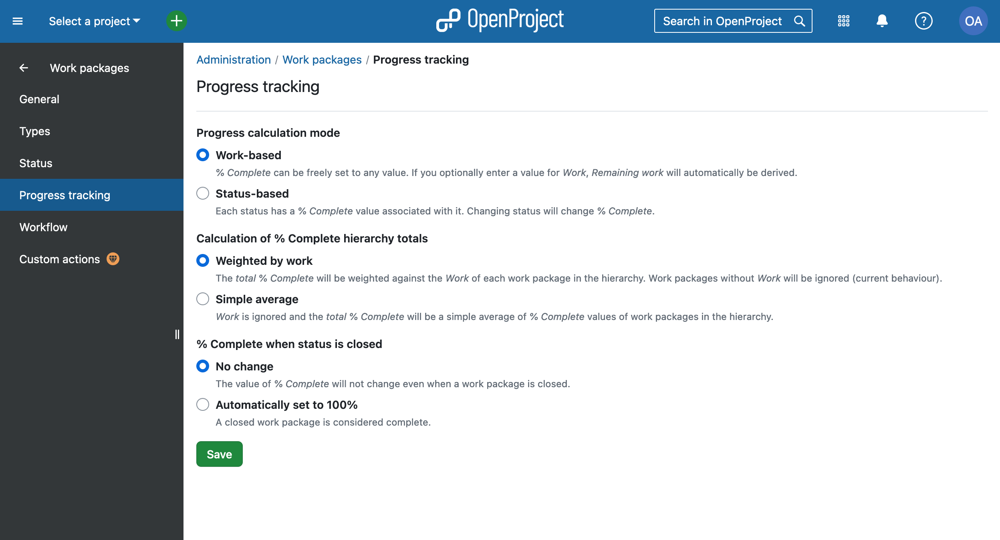
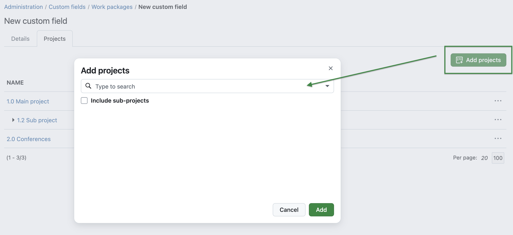
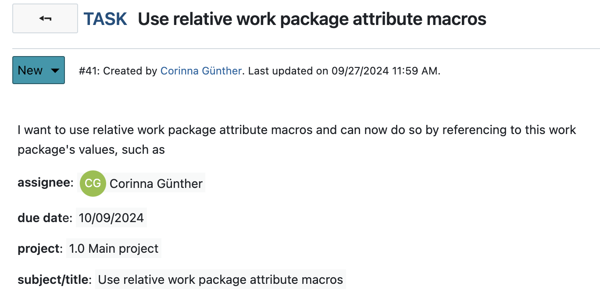

# OpenProject 14.6.0

Release date: 2024-10-09

We released OpenProject [OpenProject 14.6.0](https://community.openproject.org/versions/2111). The release contains several bug fixes and we recommend updating to the newest version. 

In these Release Notes, we will give an overview of important feature changes. At the end, you will find a complete list of all changes and bug fixes.

## Important feature changes

### Updated progress reporting with most flexible options

In response to valuable user feedback, OpenProject 14.6 brings important changes to progress reporting. We greatly appreciate the input from our Community, which helped shape these updates. Based on your feedback, the % Complete field is now manually editable again in work-based mode (like it has been in the versions before 14.0), removing the previous requirement to input Work or Remaining Work. This gives users more flexibility in tracking project progress.

But we did not only revise the changes we made with 14.0, we also added new options to enhance progress tracking and make it most flexible for our users. This is why, additionally, administrators now have new settings for progress calculation and % Complete hierarchy totals:

If you use our progress tracking, we advise reading [this detailed article about progress reporting with OpenProject 14.6](https://www.openproject.org/blog/updates-to-progress-tracking-in-14-6-based-on-user-feedback/) from our product team.

### Meetings: Receive an update notification with reload option

If you have not used our Meetings module, you should consider starting it now. We updated dynamic meetings so that you now receive a notification whenever someone else made changes to the meeting you're looking at. Click on the button included in the notification to reload the page. This is a particularly great improvement for teams who work simultaneously in meetings.

### Enable and disable a custom field for multiple projects at once

In OpenProject 14.6, administrators can now save time by enabling or disabling custom fields for multiple projects simultaneously. This feature streamlines the process of managing custom fields across projects, making it easier and more efficient for administrators.

A new tab navigation has been introduced under *Administration* > *Custom Fields*, similar to the project attributes interface. This section displays a list of all projects where a specific custom field is activated. Administrators can easily add or remove projects from the list using a menu within each row, without the need for confirmation. 

Additionally, users can include sub-projects when adding, which automatically selects all sub-projects within the hierarchy. Already added projects are visible but deactivated in the dropdown.

Learn more about [custom fields and how to create them](../../user-guide/projects/project-settings/custom-fields/) in our user guide.

### Use relative work package attribute macros

In OpenProject 14.6, users can now use descriptions with embedded macros. This feature ensures consistent descriptions across work packages and eliminates the need to manually replace placeholders for each work package attribute.

This is particularly helpful if you want to work with templates, as the copied work package automatically references its own attributes. Also, this feature will be very helpful for the [upcoming feature to generate PDFs from work package descriptions](https://community.openproject.org/wp/45896).

Macros such as *workPackageValue:assignee* have been implemented, allowing the dynamic display of work package specific values like the assignee directly in the template. These macros support both work package and project values and labels, making it easier to generate consistent and accurate documentation. Of course, you can still reference to a specific work package by including the ID (e.g. *workPackageValue:1234:assignee*).

See our [documentation for a list of available attributes for work packages](../../user-guide/wysiwyg/#available-attributes-for-work-packages).

### Show empty lines in saved rich text

Before 14.6, OpenProject's editors, such as in the work package description, did automatically delete empty lines when saved. Now, empty rows are shown in show mode, edit mode, and are not removed when saving text fields.

### See past meetings included in the number next to the Meetings tab

On the Meetings tab in the split screen view, the number next to the “Meetings (2)” tab should include both current and past meetings. Previously, only future meetings were counted. So if you use the Meetings module and reference work packages there, you may notice a higher number on the work package tab for meetings.

<!--more-->

## Bug fixes and changes

<!-- Warning: Anything within the below lines will be automatically removed by the release script -->
<!-- BEGIN AUTOMATED SECTION -->

- Bugfix: Umlaute not shown for CSV export \[[#25592](https://community.openproject.org/wp/25592)\]
- Bugfix: Order of work packages in XLS, PDF, CSV export differs from order in OpenProject \[[#34971](https://community.openproject.org/wp/34971)\]
- Bugfix: File links in work package journal assigned to wrong person \[[#53995](https://community.openproject.org/wp/53995)\]
- Bugfix: Wiki page diffing has layout issues when displaying bullet lists \[[#55263](https://community.openproject.org/wp/55263)\]
- Bugfix: Page number not reset when changing the sort order via the &quot;Configure view&quot; modal \[[#55392](https://community.openproject.org/wp/55392)\]
- Bugfix: Authorization::UnknownPermissionError happened in GET::API::V3::Root#/ \[[#56064](https://community.openproject.org/wp/56064)\]
- Bugfix: \[API doc\] color attribute of status missing \[[#57016](https://community.openproject.org/wp/57016)\]
- Bugfix: Menu Transparent for existings user afer db upgrade to 14.3.0 from 9.x \[[#57037](https://community.openproject.org/wp/57037)\]
- Bugfix: Comments not ordered according to setting \[[#57061](https://community.openproject.org/wp/57061)\]
- Bugfix: Right side of the instance upper banner looks misaligned \[[#57092](https://community.openproject.org/wp/57092)\]
- Bugfix: Mobile: tap twice on comment input to start typing \[[#57107](https://community.openproject.org/wp/57107)\]
- Bugfix: Sorting by custom field has strong impact on performance for the project list \[[#57305](https://community.openproject.org/wp/57305)\]
- Bugfix: Icons and spacing is off on Work package table configuration view \[[#57345](https://community.openproject.org/wp/57345)\]
- Bugfix: Insufficient spacing on User consent modal \[[#57366](https://community.openproject.org/wp/57366)\]
- Bugfix: Progress modal should always prevent save when there are invalid values \[[#57423](https://community.openproject.org/wp/57423)\]
- Bugfix: Custom fields with format string, text, bool, link and date don&#39;t forbid multi select internally and have handling in ordering \[[#57508](https://community.openproject.org/wp/57508)\]
- Bugfix: Form elements in Primer do not have sufficient vertical spacing \[[#57544](https://community.openproject.org/wp/57544)\]
- Bugfix: Broken ordering by multi value custom fields \[[#57577](https://community.openproject.org/wp/57577)\]
- Bugfix: Meetings: The add button should have a trailing icon to indicate that it&#39;s a drop-down \[[#57614](https://community.openproject.org/wp/57614)\]
- Bugfix: If user removes all columns for their PDF epxort, then default columns are used \[[#57618](https://community.openproject.org/wp/57618)\]
- Bugfix: Application error when viewing activity page of an inactive user \[[#57664](https://community.openproject.org/wp/57664)\]
- Bugfix: Formatting of text in meeting not applied \[[#57792](https://community.openproject.org/wp/57792)\]
- Bugfix: Export modal should not show a scrollbar for default settings \[[#57856](https://community.openproject.org/wp/57856)\]
- Bugfix: Meeting details concurrent error message is unclear and badly positioned \[[#57985](https://community.openproject.org/wp/57985)\]
- Bugfix: Removing a custom field from a project within nested pagination does not retain the current page \[[#57989](https://community.openproject.org/wp/57989)\]
- Bugfix: &#39;responsible&#39; notification reason not translated in notification center \[[#57997](https://community.openproject.org/wp/57997)\]
- Bugfix: www-authenticate header lacks comma \[[#58009](https://community.openproject.org/wp/58009)\]
- Bugfix: Notifications of type &#39;Accountable&#39; no longer get sent \[[#58015](https://community.openproject.org/wp/58015)\]
- Bugfix: Nextcloud connection validation fails on disabled AMPF configuration \[[#58018](https://community.openproject.org/wp/58018)\]
- Bugfix: White space wrong in text diff \[[#58092](https://community.openproject.org/wp/58092)\]
- Feature: Emoji reactions to work package comments \[[#40437](https://community.openproject.org/wp/40437)\]
- Feature: Allow % Complete edition in work-based progress calculation mode \[[#52233](https://community.openproject.org/wp/52233)\]
- Feature: Primerise the Activity panel \[[#54733](https://community.openproject.org/wp/54733)\]
- Feature: Meetings: Notify users that the page has been updated and incite a reload \[[#54744](https://community.openproject.org/wp/54744)\]
- Feature: Free choice of columns in exports \[[#55021](https://community.openproject.org/wp/55021)\]
- Feature: Split content of Admin/Design page into separate tabs \[[#56339](https://community.openproject.org/wp/56339)\]
- Feature: % Complete totals using simple averages (without Work) \[[#56363](https://community.openproject.org/wp/56363)\]
- Feature: Allow empty lines in rich text \[[#56779](https://community.openproject.org/wp/56779)\]
- Feature: Enable a custom field for multiple projects at once \[[#56909](https://community.openproject.org/wp/56909)\]
- Feature: Macros for work package descriptions which are relative to respective work packages \[[#57024](https://community.openproject.org/wp/57024)\]
- Feature: Create release teaser 14.6 \[[#57236](https://community.openproject.org/wp/57236)\]
- Feature: Indicate which fields are automatically derived and why in progress pop over \[[#57258](https://community.openproject.org/wp/57258)\]
- Feature: On &quot;Newest at the bottom&quot; have the line touch the input box \[[#57262](https://community.openproject.org/wp/57262)\]
- Feature: When &quot;empty state&quot; and new messages composed or arrives remove empty state \[[#57263](https://community.openproject.org/wp/57263)\]
- Feature: The number next to the Meetings tab (in split screen) should include past meetings \[[#57287](https://community.openproject.org/wp/57287)\]
- Feature: Add to connection validation that managed directory is empty for Nextcloud storages \[[#57347](https://community.openproject.org/wp/57347)\]
- Feature: Turn project list into favorite without reloading the page \[[#57505](https://community.openproject.org/wp/57505)\]
- Feature: Remove menu entry &quot;Projects&quot; from &quot;System settings&quot; submenu in the Administration \[[#57536](https://community.openproject.org/wp/57536)\]
- Feature: Split screen Underline Nav: Disable arrows when no scrolling possible \[[#57645](https://community.openproject.org/wp/57645)\]
- Feature: Replace &quot;Add assignee&quot; button in Team Pleanner with &quot;+ Assignee&quot; \[[#57648](https://community.openproject.org/wp/57648)\]
- Feature: Update all clickable elements inside the box elements with the link color \[[#57649](https://community.openproject.org/wp/57649)\]
- Feature: Meeting reload button doesn&#39;t take you to your previous spot on the page \[[#57904](https://community.openproject.org/wp/57904)\]
- Feature: Improvements to the Participants side panel (phrasing and spacing) \[[#57911](https://community.openproject.org/wp/57911)\]
- Feature: Primerise the Notification badges in the top header and notification row \[[#57927](https://community.openproject.org/wp/57927)\]
- Feature: Preserve % Complete over Remaining work when migrating \[[#57990](https://community.openproject.org/wp/57990)\]
- Feature: Work package Activity tab update: Timeline UI, instant updates, Emoji reactions \[[#56865](https://community.openproject.org/wp/56865)\]

<!-- END AUTOMATED SECTION -->
<!-- Warning: Anything above this line will be automatically removed by the release script -->

## Contributions
A very special thank you goes to City of Cologne again for sponsoring features in project lists. Also, a big thanks to our Community members for reporting bugs and helping us identify and provide fixes.
Special thanks for reporting and finding bugs go to Jan H, Joris Ceelen, André van Kaam, and Christian Jeschke.

Last but not least, we are very grateful for our very engaged translation contributors on Crowdin, who translated quite a few OpenProject strings! This release, we would like to highlight [DKrukoff](https://crowdin.com/profile/dkrukoff), for an outstanding number of translations into Russian.

Would you like to help out with translations yourself? Then take a look at our [translation guide](../../development/translate-openproject/) and find out exactly how you can contribute. It is very much appreciated!