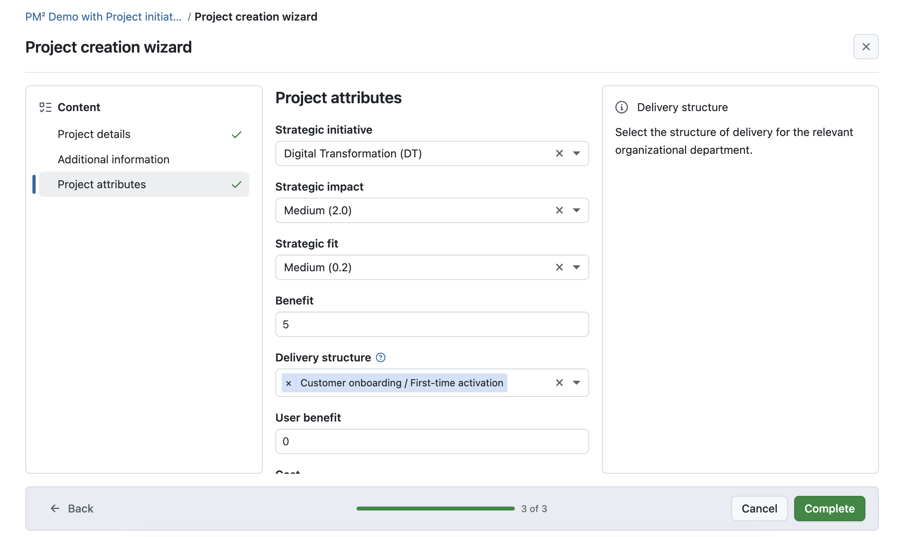
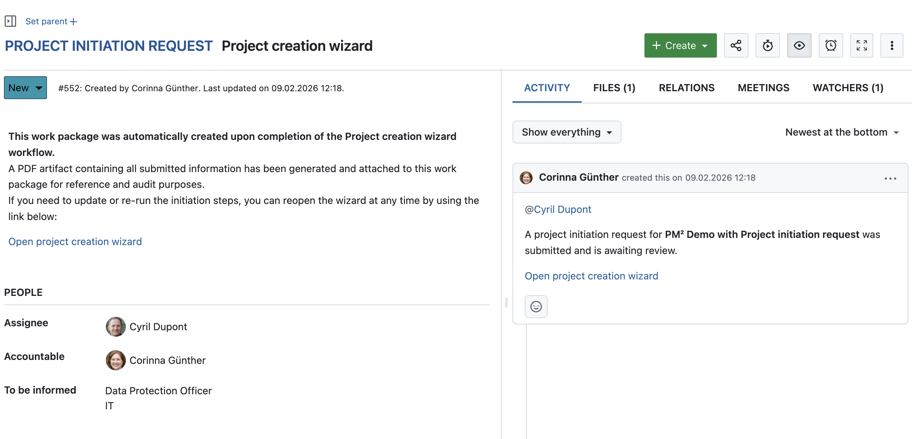
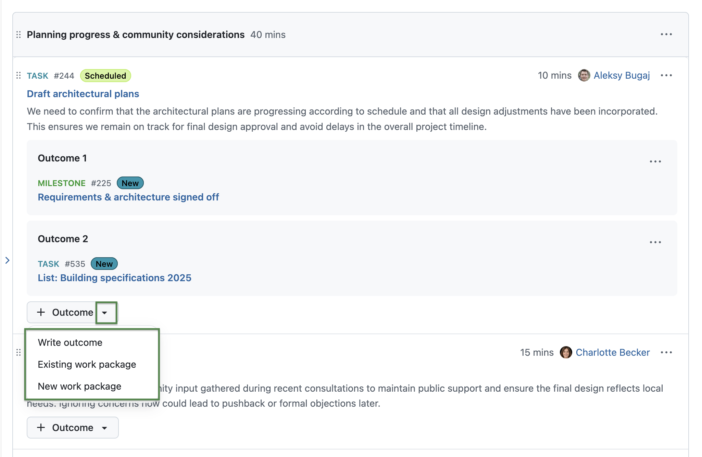
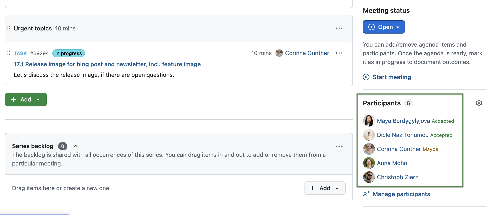
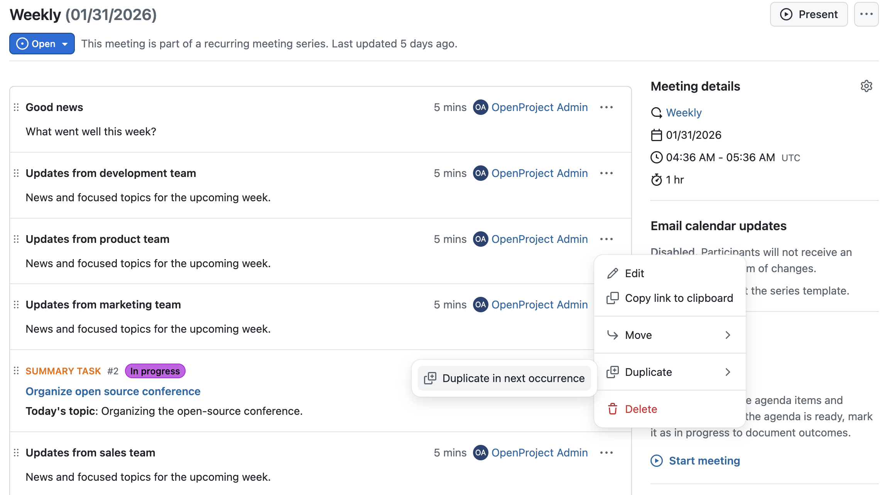
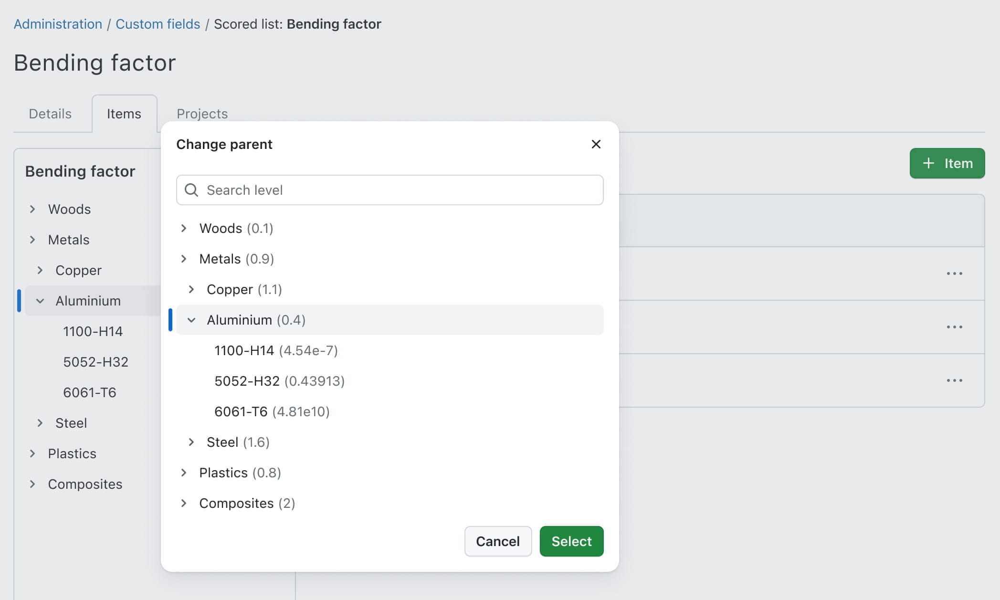

# OpenProject 17.1.0

Release date: 2026-02-11

We released [OpenProject 17.1.0](https://community.openproject.org/versions/2237). The release contains several bug fixes and we recommend updating to the newest version. In these Release Notes, we will give an overview of important feature changes. At the end, you will find a complete list of all changes and bug fixes.

<!-- BEGIN CVE SECTION -->

<!-- END CVE SECTION -->
## Important feature changes

Take a look at our release video showing the most important features introduced in OpenProject 17.1.0:

### Automated project initiation request with a guided wizard (Enterprise add-on)

[feature: project_creation_wizard ]

OpenProject introduces a configurable wizard for project initiation requests. The wizard can be enabled per template project.

[See our documentation to learn how to use the automated project initiation request with OpenProject](../../user-guide/projects/project-initiation-request/).

#### Configurable project initiation wizard

Administrators can configure a project initiation wizard to define how new project requests are submitted. This includes selecting which project attributes and sections are shown in the wizard, and which fields are required or optional.

The wizard guides users step by step through the initiation process using a fullscreen, three-column layout with section navigation, contextual help, and a progress indicator. Instead of completing required project attributes during project creation, users provide this information as part of the initiation request.

#### Work package created for a project initiation request

When a project initiation request is submitted for the first time, OpenProject automatically creates a work package that represents the request and serves as its central tracking artifact.

The work package is created once based on the wizard configuration at the time of the initial submission, including the work package type, status, and initial assignee. The assignee can be derived from a project attribute or a project role, such as a project owner.

>[!NOTE]
> If the project initiation request is submitted again later, the changes (like different assignee) might not be automatically displayed in the work package and need to be manually updated. However, each submission generates a new PDF artifact, which is uploaded and linked to the existing work package. This allows changes to be reviewed and documented over time, while keeping the work package as the central place for processing the request using existing workflows.

#### Automatically generated project initiation artifact (PDF)

Upon submission of the project initiation request, a PDF artifact is automatically generated. The artifact contains all information entered in the wizard and is attached to the corresponding work package for documentation and audit purposes.

The artifact is updated automatically whenever the status of the project initiation request work package changes, ensuring that the documentation always reflects the current state.

>[!NOTE]
> The project initiation request workflow is particularly well suited for structured frameworks such as PM² or PMflex, while remaining flexible enough to be used independently of any specific methodology. [Read this blog article for more information](https://www.openproject.org/blog/project-initiation-workflow-pm2/).

### Updates for the Meetings module

The Meetings module received several improvements that extend how meeting results are documented, reused, and shared.

#### Add new or existing work packages as meeting outcomes

Users can now add work packages as meeting outcomes, allowing teams to turn meeting results into actionable follow-up items without leaving the meeting context. They can either:

- link an existing work package, or
- create a new work package as an outcome.

Each linked work package automatically shows a reference to the meeting in its Meetings tab, making the connection between the agenda item and the follow-up item explicit.

Since we already introduced multiple outcomes per agenda item in OpenProject 17.0, it is now also possible to link multiple work packages to the same agenda item.

#### Show iCal responses in OpenProject

Meeting participant responses such as accepted, declined, or tentative are now visible directly in the meeting sidebar. These responses are collected from calendar invitations (for example when an ICS event is sent by email or downloaded and shared), making it easier to see the current participation status of all attendees in OpenProject.

#### Duplicate agenda items to the next recurring meeting occurrence

Users can now duplicate agenda items to the next occurrence of a recurring meeting. This makes it possible to carry over open topics or recurring discussion points without recreating them manually.

To duplicate an agenda item, users can select the corresponding option from the agenda item actions menu. The duplicated agenda item is added to the next meeting occurrence and can be edited independently.

### Release Attribute highlighting to Community

The Attribute highlighting feature, previously available only as an Enterprise add-on, is now included in the free Community plan.

Users can configure attribute highlighting in work package table views by opening the table configuration and selecting the **Highlighting** tab. Attributes such as Status, Priority, and Finish date can be highlighted inline or applied as full-row highlights based on attribute values. This makes key attributes visually distinguishable directly in the work package list without opening individual items.

[Read more about attribute highlighting in our documentation](../../user-guide/work-packages/work-package-table-configuration/#attribute-highlighting).

Here's an example of highlighting work packages by priority:

### Capture external links (Enterprise add-on)

[feature: capture_external_links ]

With 17.1 OpenProject introduces an option to add a warning when accessing external links from formatted text, such as project descriptions, comments or wiki pages. The warning adds an additional security layer by making users aware that they are about to leave OpenProject.

When users click on an external link, a confirmation dialog is displayed indicating that the link leads outside of OpenProject. This applies to links added by users, for example in descriptions, comments, or other text fields. In SaaS trial environments, external link handling is enforced to ensure that warnings for user-provided external links cannot be bypassed.

[Read more about this warning on external links in our documentation](../../system-admin-guide/system-settings/external-links/).

### Show short and weight values for Hierarchy and Weighted item list fields (Enterprise add-on)

Users now see an item’s short or weight wherever values from Hierarchy or Weighted item list custom fields (work packages) and project attributes are shown. This provides an extra hint to confirm that the right item was selected.

This information is displayed in:

- Work package details (for assigned values).
- Work package tables (for assigned values).
- Project attributes (for assigned values).
- The tree view selector while selecting a value (work packages and projects).
- The admin Items tab when editing the field, including the tree overview.

[Read more about custom fields in OpenProject](../../system-admin-guide/custom-fields/).

### UX/UI updates with the Primer design system

OpenProject 17.1 includes further UX/UI improvements. The following areas have been redesigned using the Primer design system:

- the Access tokens section in account settings,
- the Backlogs section in system administration,
- the password confirmation dialog.

## Important technical changes

### Improved performance in work package Activity tab

OpenProject improved the performance of the work package Activity tab when working with a large number of comments and activities. Previously, work packages with a very high number of comments could cause the browser to become slow or unresponsive when opening the Activity tab. With this release, activities are now loaded progressively instead of all at once. An initial subset of activities is loaded first, and additional entries are fetched as needed, with a loading indicator shown while more items are being loaded.

This change prevents browser freezes and significantly improves responsiveness when opening and navigating work packages with extensive activity histories.

<!--more-->

## Bug fixes and changes

<!-- Warning: Anything within the below lines will be automatically removed by the release script -->
<!-- BEGIN AUTOMATED SECTION -->

- Bugfix: Loading spinner is unreadable on Time&amp;Costs module when in dark mode \[[#58458](https://community.openproject.org/wp/58458)\]
- Bugfix: Inexplicable &quot;The changes were retracted&quot; journal entries \[[#59360](https://community.openproject.org/wp/59360)\]
- Bugfix: Date is not displayed according to chosen format in an auto-generated subject \[[#63481](https://community.openproject.org/wp/63481)\]
- Bugfix: Administration life cycle table header has a wrong height \[[#65634](https://community.openproject.org/wp/65634)\]
- Bugfix: Validation of essential OIDC claims causes server error when failing \[[#66289](https://community.openproject.org/wp/66289)\]
- Bugfix: Large amount of comments causes workpackage to freeze (missing lazy-loading and loading indicator for Activity tab) \[[#66552](https://community.openproject.org/wp/66552)\]
- Bugfix: Meeting email update is sent in sender&#39;s OP language \[[#67287](https://community.openproject.org/wp/67287)\]
- Bugfix: Fix accessibility issues in Angular templates detected by ESLint \[[#67399](https://community.openproject.org/wp/67399)\]
- Bugfix: BlockNote: searching for a non-existent work package results in placeholder string being saved in the editor \[[#67554](https://community.openproject.org/wp/67554)\]
- Bugfix: Checking off participants in a meeting does not keep scroll position \[[#67719](https://community.openproject.org/wp/67719)\]
- Bugfix: DangerDialog text is unnecessarily convoluted \[[#68377](https://community.openproject.org/wp/68377)\]
- Bugfix: Unable to save meeting agenda name after using browser autocomplete \[[#68478](https://community.openproject.org/wp/68478)\]
- Bugfix: Documents index page: loading indicator for search is old \[[#68625](https://community.openproject.org/wp/68625)\]
- Bugfix: Confirmation dialog is shown even when no changes are made to the text \[[#68654](https://community.openproject.org/wp/68654)\]
- Bugfix: Project CF of type user does not display groups or placeholder users \[[#68702](https://community.openproject.org/wp/68702)\]
- Bugfix: User List in cost report is generated unsorted \[[#68714](https://community.openproject.org/wp/68714)\]
- Bugfix: Error duplicating task with relation \[[#69309](https://community.openproject.org/wp/69309)\]
- Bugfix: Truncate the name in the project list \[[#69445](https://community.openproject.org/wp/69445)\]
- Bugfix: Timer cannot be started if log time modal has a mandatory field \[[#69483](https://community.openproject.org/wp/69483)\]
- Bugfix: Nextcloud returns 404 if OpenProject app is not installed  \[[#69492](https://community.openproject.org/wp/69492)\]
- Bugfix: Fine-tuning of margins in pdf exports \[[#69515](https://community.openproject.org/wp/69515)\]
- Bugfix: Error in PDF exports if font file storage is broken \[[#69625](https://community.openproject.org/wp/69625)\]
- Bugfix: Misleading text in Work Package meetings tab after mentioning WP in meeting outcome \[[#69646](https://community.openproject.org/wp/69646)\]
- Bugfix: Too many permissions required to fill out wizard \[[#69672](https://community.openproject.org/wp/69672)\]
- Bugfix: Button to open PIR should only be shown for users with Edit project attributes permission \[[#69723](https://community.openproject.org/wp/69723)\]
- Bugfix: &quot;Move to next meeting&quot; broken for past meetings \[[#69727](https://community.openproject.org/wp/69727)\]
- Bugfix: Can&#39;t move hierarchy element underneath an element with an &quot;&amp;&quot; symbol in its title \[[#69966](https://community.openproject.org/wp/69966)\]
- Bugfix: project attributes have a border on mobile fields  \[[#70100](https://community.openproject.org/wp/70100)\]
- Bugfix: Meeting series can&#39;t be deleted before opening the first occurrence \[[#70318](https://community.openproject.org/wp/70318)\]
- Bugfix: Project dropdown active project close button is misaligned. \[[#70334](https://community.openproject.org/wp/70334)\]
- Bugfix: Wrong helptext for &quot;Allow remapping of existing users&quot; \[[#70389](https://community.openproject.org/wp/70389)\]
- Bugfix: Project status button is missing colors in the dropdown \[[#70458](https://community.openproject.org/wp/70458)\]
- Bugfix: Fix flickering in the Handling of 404 errors in AvatarWithFallback \[[#70460](https://community.openproject.org/wp/70460)\]
- Bugfix: On mobile, global search result box shows a lot of white space \[[#70497](https://community.openproject.org/wp/70497)\]
- Bugfix: hocuspocus logs \[onAuthenticate\] fetch failed and connection to collaboration server not possible \[[#70542](https://community.openproject.org/wp/70542)\]
- Bugfix: Images are broken on moved/duplicated meeting agenda item \[[#70585](https://community.openproject.org/wp/70585)\]
- Bugfix: If user cancels a meeting that is currently happening, the meeting disappears from list \[[#70609](https://community.openproject.org/wp/70609)\]
- Bugfix: Email wording is ambiguous for users who are uninvited from a meeting \[[#70610](https://community.openproject.org/wp/70610)\]
- Bugfix: Work package meetings tab only shows the last outcome \[[#70779](https://community.openproject.org/wp/70779)\]
- Bugfix: Calendar widget not visible with Firefox \[[#70792](https://community.openproject.org/wp/70792)\]
- Bugfix: Cannot update email header/footer due to emission address being &#39;not a valid email address&#39; when mail\_from setting is pinned via env \[[#70906](https://community.openproject.org/wp/70906)\]
- Bugfix: API V3 allows reading/writing internal comments when the &quot;Enable internal comments&quot; project setting is disabled \[[#70979](https://community.openproject.org/wp/70979)\]
- Bugfix: &quot;Move to next meeting&quot; and &quot;Duplicate in next meeting&quot; select cancelled meeting \[[#71089](https://community.openproject.org/wp/71089)\]
- Bugfix: Every user can be set as a presenter for an agenda item \[[#71100](https://community.openproject.org/wp/71100)\]
- Bugfix: External link warning page cut off on mobile \[[#71103](https://community.openproject.org/wp/71103)\]
- Bugfix: Meeting invitation emails do not offer direct calendar integration \[[#71113](https://community.openproject.org/wp/71113)\]
- Bugfix: WP type drop-down is cut off on mobile \[[#71144](https://community.openproject.org/wp/71144)\]
- Bugfix: Hourly rates can be edited for non-members \[[#71226](https://community.openproject.org/wp/71226)\]
- Bugfix: Race Condition on OpenProject through /api/v3/work\_packages/{id}/watchers \[[#71234](https://community.openproject.org/wp/71234)\]
- Bugfix: PIR results in a 404 if a group of user is assigned to the submission \[[#71264](https://community.openproject.org/wp/71264)\]
- Bugfix: Change phrasing from &#39;Duplicate in next occurrence&#39; to &#39;Duplicate in next meeting&#39; \[[#71338](https://community.openproject.org/wp/71338)\]
- Bugfix: PIR with only a calculated value in one section breaks \[[#71384](https://community.openproject.org/wp/71384)\]
- Bugfix: PIR artifact is uploaded twice if attachments are selected as artifact storage method \[[#71403](https://community.openproject.org/wp/71403)\]
- Bugfix: Deleting a Time and Cost report results in an error \[[#71414](https://community.openproject.org/wp/71414)\]
- Bugfix: FrozenError in  POST::API::Mcp#/ \[[#71444](https://community.openproject.org/wp/71444)\]
- Bugfix: Error messages on meeting participants leaked user names to unauthorized users \[[#71621](https://community.openproject.org/wp/71621)\]
- Feature: Empty state for meeting index pages \[[#59158](https://community.openproject.org/wp/59158)\]
- Feature: Work package meeting outcomes \[[#62093](https://community.openproject.org/wp/62093)\]
- Feature: Redesign the &quot;My Account / Access token&quot; page using Primer \[[#65411](https://community.openproject.org/wp/65411)\]
- Feature: Rename Nextcloud GroupFolder references to TeamFolder \[[#66722](https://community.openproject.org/wp/66722)\]
- Feature: Show shorts and weights of custom fields with hierarchical structure \[[#67594](https://community.openproject.org/wp/67594)\]
- Feature: Handle participation responses in incoming emails \[[#68453](https://community.openproject.org/wp/68453)\]
- Feature: Show document as separate tab on mobile \[[#68833](https://community.openproject.org/wp/68833)\]
- Feature: Non configurable project creation wizard \[[#68855](https://community.openproject.org/wp/68855)\]
- Feature: Configuration of project attributes to appear in the create wizard \[[#68858](https://community.openproject.org/wp/68858)\]
- Feature: Create work package to submit project initiation request \[[#68862](https://community.openproject.org/wp/68862)\]
- Feature: Templates define their own settings for the project wizard \[[#68943](https://community.openproject.org/wp/68943)\]
- Feature: PDF export of PM²/PMflex project initiation requests \[[#69001](https://community.openproject.org/wp/69001)\]
- Feature: Change enforcement of project attributes on creation for templates \[[#69034](https://community.openproject.org/wp/69034)\]
- Feature: On status update of the PIR work package, recreate the PDF \[[#69303](https://community.openproject.org/wp/69303)\]
- Feature: Primerise the Password Confirmation Dialog \[[#69354](https://community.openproject.org/wp/69354)\]
- Feature: &quot;X-icon&quot; above the project create form \[[#69356](https://community.openproject.org/wp/69356)\]
- Feature: Add the project name as PageHeader breadcrumb on the project initiation request \[[#69401](https://community.openproject.org/wp/69401)\]
- Feature: Button to open project creation wizard from overview \[[#69402](https://community.openproject.org/wp/69402)\]
- Feature: Add relative link to project initiation request from work package comment \[[#69403](https://community.openproject.org/wp/69403)\]
- Feature: Send out email when work package is created \[[#69414](https://community.openproject.org/wp/69414)\]
- Feature: Show breadcrumb with full project hierarchy in Project Overview showing portfolios and programs \[[#69417](https://community.openproject.org/wp/69417)\]
- Feature: Allow duplicating/copy of agenda items to next meeting occurrence \[[#69464](https://community.openproject.org/wp/69464)\]
- Feature: Primerize API settings form \[[#69702](https://community.openproject.org/wp/69702)\]
- Feature: Show participant response in Meeting UI \[[#69733](https://community.openproject.org/wp/69733)\]
- Feature: Responses before meeting was created should show up in iCal Feed \[[#69734](https://community.openproject.org/wp/69734)\]
- Feature: Primerize Backlogs Admin \[[#70194](https://community.openproject.org/wp/70194)\]
- Feature: Capture external links in user-provided contents \[[#70234](https://community.openproject.org/wp/70234)\]
- Feature: Send email notifications to all participants when a participant is added or removed \[[#70607](https://community.openproject.org/wp/70607)\]

<!-- END AUTOMATED SECTION -->
<!-- Warning: Anything above this line will be automatically removed by the release script -->

## Contributions

A very special thank you goes to Helmholtz-Zentrum Berlin, City of Cologne, Deutsche Bahn and ZenDiS for sponsoring released or upcoming features. Your support, alongside the efforts of our amazing Community, helps drive these innovations. Also a big thanks to our Community members for reporting bugs and helping us identify and provide fixes. Special thanks for reporting and finding bugs go to Johannes Baumgarten, Lea Fuchs, Александр Татаринцев, Stefan Weiberg, and Natalie Stettner.

Last but not least, we are very grateful for our very engaged translation contributors on Crowdin, who translated quite a few OpenProject strings! This release we would like to particularly thank the following users:

- [Haura Nabila Rinaldi](https://crowdin.com/profile/hauranblr), for a great number of translations into Indonesian.
- [arnegronkjaer](https://crowdin.com/profile/arnegronkjaer), for a great number of translations into Danish.

Would you like to help out with translations yourself? Then take a look at our [translation guide](../../contributions-guide/translate-openproject/) and find out exactly how you can contribute. It is very much appreciated!
