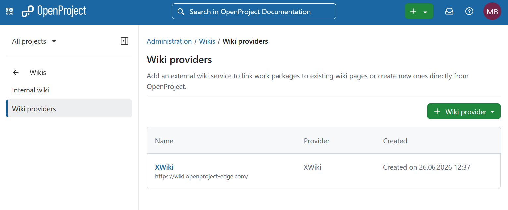
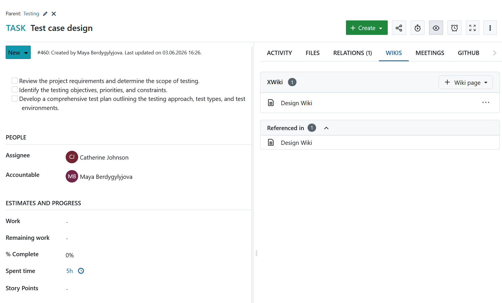
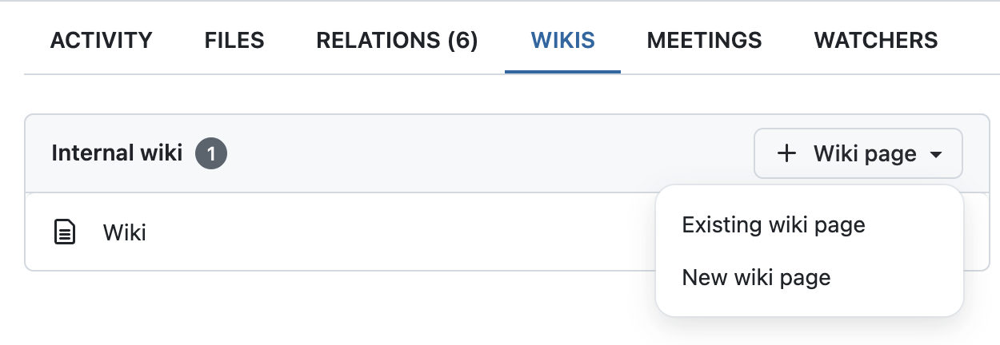
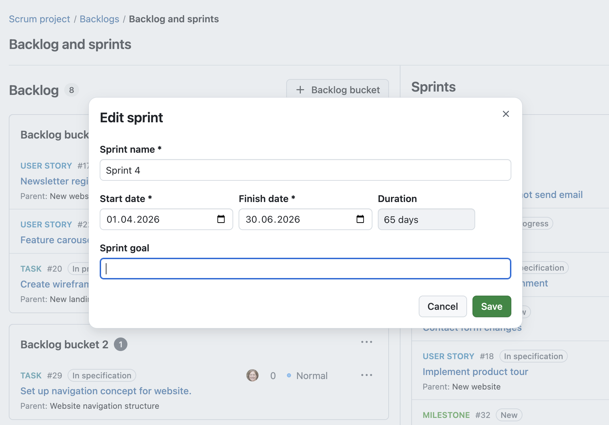
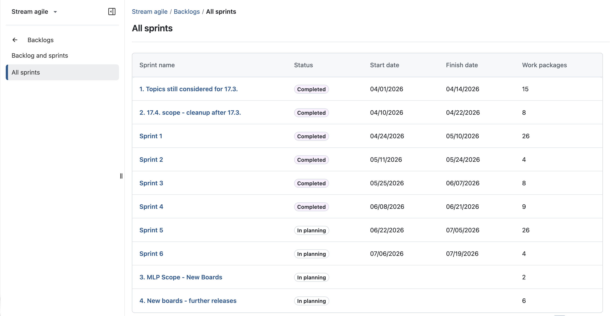
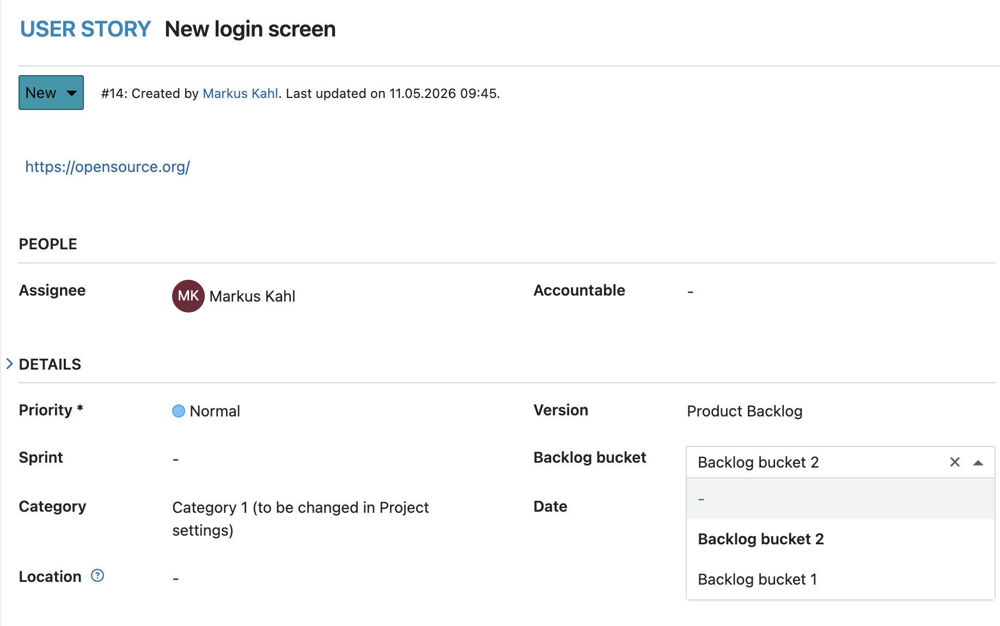
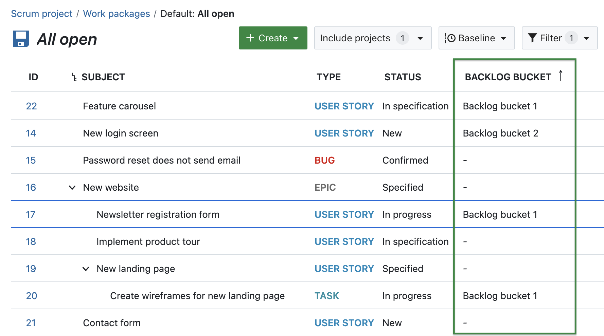
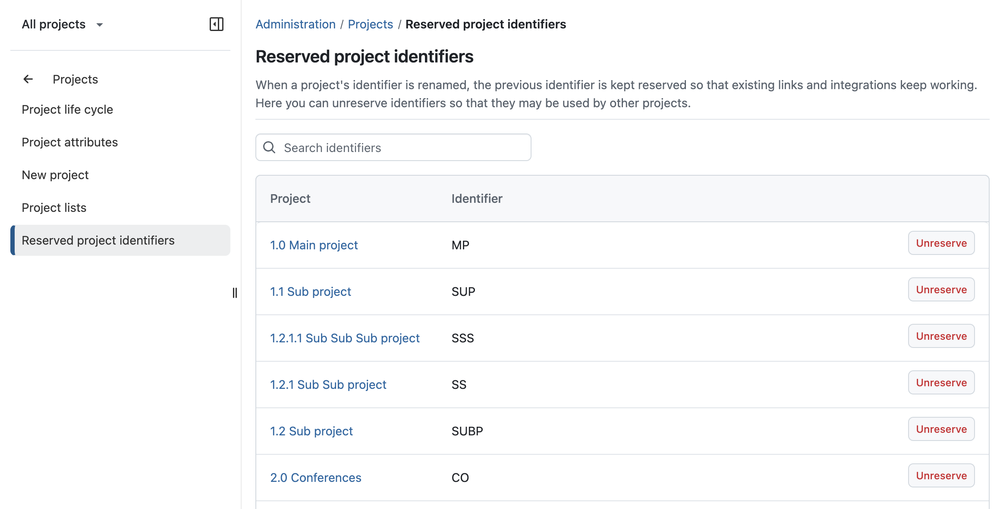
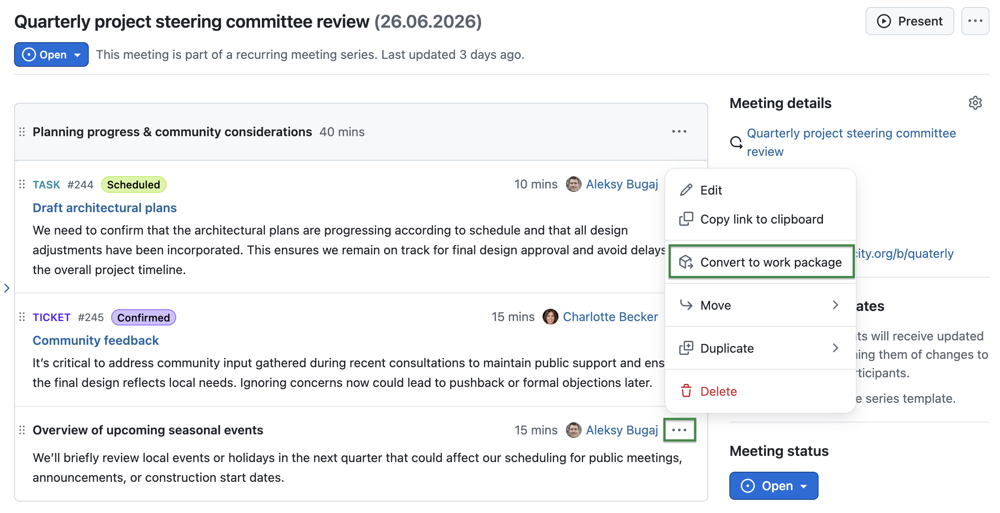
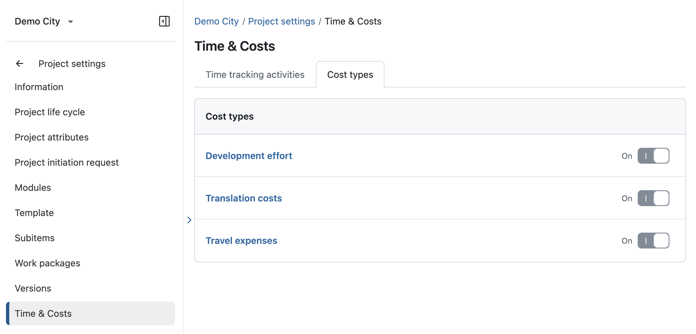

# OpenProject 17.6.0

Release date: 2026-07-08

We released [OpenProject 17.6.0](https://community.openproject.org/versions/2298).
The release contains several bug fixes and we recommend updating to the newest version.
In these Release Notes, we will give an overview of important feature changes. At the end, you will find a complete list of all changes and bug fixes.

## Important feature changes

OpenProject 17.6 continues our vision of providing a comprehensive open source platform for project management and collaboration. The new XWiki integration brings project management and enterprise knowledge management closer together, while further improvements for Backlogs, Meetings, and administration help teams plan, collaborate, and execute their work more efficiently.

Take a look at our release video showing the most important features introduced in OpenProject 17.6.0:


### XWiki integration (Enterprise add-on)

[feature: xwiki_integration ]

OpenProject 17.6 introduces a new integration with XWiki, enabling teams to connect project work and documentation more closely. Together, OpenProject and XWiki provide an **integrated open source solution** for organizations looking to manage both projects and documentation on their own infrastructure. This makes the integration a natural choice for existing XWiki users and for organizations looking to replace proprietary combinations such as Jira and Confluence with a sovereign open source solution. [Learn more about the motivation behind the integration and our collaboration with XWiki in our dedicated blog article](https://www.openproject.org/blog/x-wiki-integration).

To use the XWiki integration, system administrators first need to configure an external wiki as a **Wiki provider** in the OpenProject administration settings. [See our system admin guide for more information](../../system-admin-guide/wikis/wiki-providers).



Work packages now include a **dedicated Wiki tab** where users can view related wiki pages, create new pages, and link existing content from XWiki. This makes it easier to access relevant documentation directly from the work package where the work is planned and executed.

The integration also supports **references between OpenProject and XWiki**. Users can see which wiki pages reference a work package and insert links to wiki pages directly from descriptions, comments, and documents. This helps teams keep project work and documentation connected across both platforms.



> [!NOTE]
> The XWiki integration is designed for organizations that require advanced wiki and documentation capabilities. It is available as an Enterprise add-on in the Corporate plan.

### Internal wiki improvements

OpenProject's built-in Wiki module is also improved with OpenProject 17.6. It can be used through the new integration as internal provider. System administrators can [activate this](../../system-admin-guide/wikis/#project-wikis) under Administration → Wikis → Internal wiki.

Users can link to all activated wikis, including internal ones, from the new **Wikis** tab in work packages. If disabled, the internal wiki is still available as a project module.

In future releases, we plan to further improve the internal wiki.



### Sprint goals

OpenProject 17.6 introduces sprint goals for Backlogs. When creating or editing a sprint, you can now define a sprint goal directly within the sprint settings.

The sprint goal is then displayed on the sprint header, making it visible to everyone working on the sprint.



### All sprints overview

OpenProject 17.6 introduces a new [All sprints](../../user-guide/backlogs-scrum/#all-sprints) view in the Backlogs module. The new page provides an overview of all sprints in a project.

For each sprint, the overview displays key information such as its status, start and finish dates, and the number of assigned work packages.



### Display backlog buckets in work packages

OpenProject 17.6 introduces a new **Backlog bucket attribute for work packages**. If enabled for a work package type, users can view and manage backlog bucket assignments directly from the work package details.

Work packages can now be assigned to backlog buckets without navigating to the Backlogs module. Since a work package can only belong to either a sprint or a backlog bucket, selecting one will automatically remove the other assignment.



### Group, sort and filter work packages by backlog bucket

OpenProject 17.6 adds support for backlog buckets in work package tables. You can now add the Backlog bucket column to a work package table and use it to filter, sort, and group work packages.

This makes backlog bucket assignments visible in work package tables, allowing teams to organize, filter, and analyze backlog items more effectively.



### Sprint sharing now available in the Basic Enterprise plan

[feature: sprint_sharing ]

Based on customer feedback, sprint sharing is now included in the **Basic Enterprise plan** instead of the Corporate plan. This makes the feature available to many more Enterprise customers.

Thank you to everyone who shared constructive feedback and helped shape this decision.

### Support project-based (semantic) identifiers in exports

OpenProject 17.6 extends support for project-based (semantic) identifiers across exports. Semantic identifiers are now included consistently in:

- Excel and CSV exports
- Meeting PDF exports
- Timesheet PDF exports

This ensures that exported data uses the same identifiers that users see throughout OpenProject.

### Unreserve old project-based (semantic) identifiers

OpenProject 17.6 extends support for reserved project identifiers to project-based (semantic) identifiers. When a project identifier is renamed, previous identifiers remain reserved so that existing links and integrations continue to work.

Administrators can now unreserve old project-based (semantic) identifiers and make them available for reuse by other projects.



### Convert meeting agenda items into work packages

OpenProject 17.6 adds a new [Convert to work package](../../user-guide/meetings/one-time-meetings/#convert-agenda-items-to-work-packages) action for meeting agenda items. This allows users to turn agenda items directly into work packages without leaving the meeting.

The newly created work package remains linked to the agenda item, helping teams connect meeting discussions with follow-up work.



### Configure cost types per project

OpenProject 17.6 introduces project-specific cost type configuration. Project administrators can now control which cost types are available within each project.

To support this, project settings now include a new Time and costs section with a dedicated Cost types tab where available cost types can be configured.



## Important technical changes

### Escape control characters in CSV exports

OpenProject 17.6 improves [CSV export](../../system-admin-guide/system-settings/exports/ ) security by escaping control characters in exported data. This helps prevent spreadsheet applications from interpreting exported values in unintended ways.

If you need to escape unmodified machine-readable CSV exports, you can disable this flag on the new Exports page Administration → System settings → Exports.

This change was originally reported as [a security advisory on GitHub](https://github.com/opf/openproject/security/advisories/GHSA-fv8m-h8hc-57gq). We'd like to thank the contributors of this report, [@GEONWOOHAN](https://github.com/GEONWOOHAN), [@QwQP0](https://github.com/QwQP0), [@minnnjuuu](https://github.com/minnnjuuu), and [@dkstjwls06](https://github.com/dkstjwls06).

### Configure LDAP group synchronization using group member attributes (Enterprise add-on)

[feature: ldap_groups ]

OpenProject 17.6 extends LDAP group synchronization with support for group member attributes. Administrators can now configure synchronization based on attributes such as `member` or `uniqueMember` on LDAP groups, in addition to the existing `memberOf` lookup on user entries.

This improves compatibility with LDAP servers that do not maintain the `memberOf` attribute. Read more about [synchronizing LDAP and OpenProject groups (Enterprise add-on)](../../system-admin-guide/authentication/ldap-connections/ldap-group-synchronization)

### Integrations (e.g. Nextcloud and XWiki) respect global SSRF filters

To increase the security of OpenProject installations, we've added protections against server-side request forgery in previous releases
of OpenProject. These prevent OpenProject from making network requests into private IP address space.

Starting with OpenProject 17.6, these protections also apply to web requests made by storage and wiki integrations.
This means if you have a Nextcloud instance or an XWiki instance reachable via a private (i.e. not publicly routable) IP address, you need to
add it to the SSRF allowlist to be able to keep the integration working. This is usually achieved by defining the following environment variable:

```env
OPENPROJECT_SSRF_PROTECTION_IP_ALLOWLIST=2001:db8:100::/48
```

The list accepts one or multiple IP addresses or ranges (in CIDR notation) that shall be exempt from SSRF filtering.

### Meeting API structure changes

OpenProject 17.6 introduces new endpoints for meeting outcomes,
and changes the self link for all meeting related resources to be flat:

That means, some of the responses have changed:

POST/PATCH/DELETE `/api/v3/meetings/:id/agenda_items)` is no longer available,
they have been moved to the `/api/v3/meeting_agendas/` respectively. The same is true for outcomes and sections.

This follows the APIv3 standards, and also fixes a bug related to the self link.

<!-- BEGIN SECURITY FIXES AUTOMATED SECTION -->

## Security fixes

### CVE-2026-55095 - Inplace-edit dialog exposes comments from hidden admin-only project custom fields

An authenticated non-admin project member can request the inplace-edit dialog for a raw \`custom\_field\_&lt;id&gt;\` project attribute and retrieve the stored comment text for an \`admin\_only\` project custom field.

The normal project custom-field visibility and writable scopes exclude the field for the same user, but the dialog path resolves the custom field by raw id and renders the stored custom-field comment in read-only mode.

The claim is intentionally narrow: this discloses custom-field comment text only. This report does not claim hidden custom-field value disclosure, writes, or mutation.

This vulnerability was reported as part of the [YesWeHack.com OpenProject Bug Bounty program](https://yeswehack.com/programs/openproject), sponsored by the European Commission.

For more information, please see the [GitHub advisory #GHSA-63fg-pgqj-3qf8](https://github.com/opf/openproject/security/advisories/GHSA-63fg-pgqj-3qf8)

### GHSA-c6rc-4288-8p4f - Improper Access Control on openproject through /api/v3/work_packages/{X.id} via PATCH parameter "fileLinks"

`PATCH /api/v3/work_packages/{id}` accepts a writable `_links.fileLinks` payload property. The update path is missing the `user_allowed_to_manage_file_links` validation that exists on the create path, and the underlying setter resolves `Storages::FileLink` records by raw id with no scope. An authenticated user with only `edit_work_packages` (no `manage_file_links`, no membership in the victim project) can therefore:

- detach (and, via `dependent: :delete_all`, hard-delete) every FileLink currently attached to a work package they can edit, and

- re-parent any FileLink in the database, identified by its numeric id, onto an attacker-controlled work package, gaining read access to its metadata (origin filename, origin id, mime type) and removing it from the victim&#39;s work package.

This vulnerability was reported as part of the [YesWeHack.com OpenProject Bug Bounty program](https://yeswehack.com/programs/openproject), sponsored by the European Commission.

For more information, please see the [GitHub advisory #GHSA-c6rc-4288-8p4f](https://github.com/opf/openproject/security/advisories/GHSA-c6rc-4288-8p4f)

### GHSA-v3j7-vqwv-5w5q - Private work package subject/identity disclosure through the global Time Entries and Cost Entries APIs

`GET /api/v3/time_entries` and `GET /api/v3/cost_entries` are instance/workspace-scope collection endpoints. Each entry links a Work Package through the API representer's `associated_resource :work_package`, which renders `_links.workPackage.title` (the Work Package **subject**) and `_links.workPackage.href` (the sequential Work Package id) **without checking that the linked Work Package is visible to the requesting user**.

The collection is authorized only by the time-entry / cost-entry project permission (`view_time_entries` / `view_cost_entries`), which is an **independent project permission with no `view_work_packages` dependency**. A user holding `view_time_entries` (or `view_cost_entries`) in a project, but not `view_work_packages`, therefore reads the subjects and ids of Work Packages they cannot access through the direct Work Package API (which returns 404 for those WPs).

This is the same disclosure class already fixed in **GHSA-g387-6rm2-xw88** ("Private work package data disclosure through single meeting agenda item API", Medium, CWE-200/CWE-639), whose fix migrated the meeting-agenda-item representer's linked Work Package from the ungated `associated_resource` to the visibility-gated `associated_visible_resource`. The Time Entries and Cost Entries representers were not updated.

This vulnerability was reported by user [CyberKareem](https://github.com/CyberKareem).

For more information, please see the [GitHub advisory #GHSA-v3j7-vqwv-5w5q](https://github.com/opf/openproject/security/advisories/GHSA-v3j7-vqwv-5w5q)

### GHSA-wr3w-qchj-p4cm - Improper Access Control on openproject through /api/v3/custom_options/:id via Path "id" leads to Sensitive Data Exposure

OpenProject supports list-type custom fields whose allowed values are stored as `CustomOption` records. User and group custom fields can be marked `admin_only`, and the normal visibility scopes hide those fields from non-admin users.

However, `GET /api/v3/custom_options/:id` resolves a `CustomOption` by global numeric id and explicitly allows every option whose owning custom field is a `UserCustomField` or `GroupCustomField`. It does not check whether the owning custom field is visible to the requester.

An attacker only needs a normal authenticated account. Because custom option ids are sequential numeric ids, and normal API schemas/forms expose visible option links such as `/api/v3/custom_options/<id>`, the attacker can enumerate nearby ids and read the `value` returned by successful responses.

As a result, non-admin users can disclose option labels belonging to admin-only user or group custom fields. This leaks hidden internal taxonomies or classifications that administrators intentionally made admin-only.

This vulnerability was reported as part of the [YesWeHack.com OpenProject Bug Bounty program](https://yeswehack.com/programs/openproject), sponsored by the European Commission.

For more information, please see the [GitHub advisory #GHSA-wr3w-qchj-p4cm](https://github.com/opf/openproject/security/advisories/GHSA-wr3w-qchj-p4cm)

<!-- END SECURITY FIXES AUTOMATED SECTION -->
<!--more-->

### Brute-force protection for LDAP user binds

Resulting from a [security advisory report](https://github.com/opf/openproject/security/advisories/GHSA-vhfq-8mwf-g79w), we have improved how user binds are being protected against brute force inside OpenProject.
While we expect production AD systems to perform their own brute force protections, administrators of OpenProject might be confused as the login with an LDAP user bind is transparent, and they might expect our brute force protection settings to apply.

OpenProject 17.6 implements a Rack::Attack throttle rule for internal login mechanisms, also protecting LDAP binds specifically.
We'd like to thank the contributors of this report, [@GEONWOOHAN](https://github.com/GEONWOOHAN), [@QwQP0](https://github.com/QwQP0), [@minnnjuuu](https://github.com/minnnjuuu), and [@dkstjwls06](https://github.com/dkstjwls06).

## Bug fixes and changes

<!-- Warning: Anything within the below lines will be automatically removed by the release script -->
<!-- BEGIN AUTOMATED SECTION -->

- Feature: Sprint goals \[[#71059](https://community.openproject.org/wp/71059)\]
- Feature: Display backlog bucket in work package \[[#73887](https://community.openproject.org/wp/73887)\]
- Feature: &quot;Move to backlog bucket&quot; and &quot;move to backlog inbox&quot; menu option for work packages within the backlog module \[[#73925](https://community.openproject.org/wp/73925)\]
- Feature: &quot;All sprints&quot; view - simple list \[[#74594](https://community.openproject.org/wp/74594)\]
- Feature: Filtering by backlog bucket in work package list \[[#74652](https://community.openproject.org/wp/74652)\]
- Feature: Column, ordering and grouping by backlog bucket in work package list \[[#74653](https://community.openproject.org/wp/74653)\]
- Feature: Show message when work package with excluded type/status is moved to backlog and disappears \[[#74845](https://community.openproject.org/wp/74845)\]
- Feature: Fixed width of priority in work package card \[[#75750](https://community.openproject.org/wp/75750)\]
- Feature: Rearrange &quot;More&quot; menu options for backlog/sprint items for easier moving between sprints and backlogs \[[#75783](https://community.openproject.org/wp/75783)\]
- Feature: Sprint sharing in EE basic \[[#76741](https://community.openproject.org/wp/76741)\]
- Feature: Add canonical URL meta tags to Project and WP pages for crawler optimization \[[#73926](https://community.openproject.org/wp/73926)\]
- Feature: Adapt Excel and CSV exports for semantic identifiers \[[#74361](https://community.openproject.org/wp/74361)\]
- Feature: Adapt meeting PDF exports for semantic identifiers \[[#74755](https://community.openproject.org/wp/74755)\]
- Feature: Release old semantic identifiers \[[#74934](https://community.openproject.org/wp/74934)\]
- Feature: Adapt PDF Export of timesheets for semantic identifiers \[[#75015](https://community.openproject.org/wp/75015)\]
- Feature: /wp on an empty line should create a block work-package link, not an inline one \[[#75310](https://community.openproject.org/wp/75310)\]
- Feature: Add a work package menu link to copy numeric ID \[[#76104](https://community.openproject.org/wp/76104)\]
- Feature: Check the accessibility on Flash messages \[[#63276](https://community.openproject.org/wp/63276)\]
- Feature: Add a &#39;Security&#39; page in Account settings \[[#65405](https://community.openproject.org/wp/65405)\]
- Feature: Remove newest projects in project widget on homepage \[[#74198](https://community.openproject.org/wp/74198)\]
- Feature: Make project hierarchy collapsible in the global project selector \[[#74625](https://community.openproject.org/wp/74625)\]
- Feature: Create work package out of Meeting Agenda Item \[[#57053](https://community.openproject.org/wp/57053)\]
- Feature: API for Meeting outcomes \[[#75393](https://community.openproject.org/wp/75393)\]
- Feature: Group synchronization through attributes of the group, not member/memberOf \[[#32812](https://community.openproject.org/wp/32812)\]
- Feature: Allow cost types to be enabled/disabled per project \[[#42037](https://community.openproject.org/wp/42037)\]
- Feature: Primerize advanced filters component \[[#74380](https://community.openproject.org/wp/74380)\]
- Feature: Build select panel quickfilter for meeting index \[[#74725](https://community.openproject.org/wp/74725)\]
- Feature: Enforce order of subheader slots/quickfilters \[[#75013](https://community.openproject.org/wp/75013)\]
- Feature: Escape possible control characters in CSV export \[[#75486](https://community.openproject.org/wp/75486)\]
- Feature: Create, update and delete a wiki provider of type xwiki \[[#72921](https://community.openproject.org/wp/72921)\]
- Feature: Create wiki tab \[[#72969](https://community.openproject.org/wp/72969)\]
- Feature: Create and delete relation wiki page links \[[#72970](https://community.openproject.org/wp/72970)\]
- Feature: Show inline wiki page links \[[#72971](https://community.openproject.org/wp/72971)\]
- Feature: Show list of wiki pages that reference the work package \[[#72972](https://community.openproject.org/wp/72972)\]
- Feature: Add health checks for external wiki integrations \[[#72978](https://community.openproject.org/wp/72978)\]
- Feature: Create macro for creating inline wiki page links with existing pages \[[#72986](https://community.openproject.org/wp/72986)\]
- Feature: Add option to create new wiki pages while inlining it \[[#72987](https://community.openproject.org/wp/72987)\]
- Feature: Create API for wiki page links \[[#73293](https://community.openproject.org/wp/73293)\]
- Feature: Extend wiki permissions \[[#73440](https://community.openproject.org/wp/73440)\]
- Feature: XWiki enterprise banner in admin settings \[[#73842](https://community.openproject.org/wp/73842)\]
- Feature: Restructure wiki tab content for new designs \[[#73909](https://community.openproject.org/wp/73909)\]
- Feature: Render macro in CKEditor editing mode \[[#74710](https://community.openproject.org/wp/74710)\]
- Feature: Update Icon for wiki providers \[[#74833](https://community.openproject.org/wp/74833)\]
- Feature: Expose installation UUID via API \[[#75442](https://community.openproject.org/wp/75442)\]
- Feature: Configure internal wiki provider \[[#75594](https://community.openproject.org/wp/75594)\]
- Feature: Allow to paste wiki page url in  &quot;link existing&quot; dialog \[[#75732](https://community.openproject.org/wp/75732)\]
- Feature: Rename CKEditor Macro to &quot;+ Insert&quot; \[[#75749](https://community.openproject.org/wp/75749)\]
- Feature: Show XWiki&#39;s mentions in the &quot;Referenced in&quot; section of the tab \[[#75960](https://community.openproject.org/wp/75960)\]
- Feature: Rename inline page links to &quot;Mentioned in description&quot; \[[#75968](https://community.openproject.org/wp/75968)\]
- Bugfix: NoMethodError on GET::API::V3::WorkPackages::WorkPackagesAPI#/work\_packages/  \[[#75693](https://community.openproject.org/wp/75693)\]
- Bugfix: &quot;Move to inbox&quot; menu entry is missing the word &quot;backlog&quot; \[[#76014](https://community.openproject.org/wp/76014)\]
- Bugfix: Dragging the work package open in the side bar blocks further editing \[[#76405](https://community.openproject.org/wp/76405)\]
- Bugfix: &quot;All Sprints&quot; list is ordered incorrectly \[[#76564](https://community.openproject.org/wp/76564)\]
- Bugfix: Status labels are cut off on mobile \[[#76579](https://community.openproject.org/wp/76579)\]
- Bugfix: Copy/paste of a single work package link does not work \[[#74538](https://community.openproject.org/wp/74538)\]
- Bugfix: Dragging text selection containing a inline-link creates a copy instead of moving it \[[#74540](https://community.openproject.org/wp/74540)\]
- Bugfix: Inline-to-card resize should split the surrounding sentence \[[#74978](https://community.openproject.org/wp/74978)\]
- Bugfix: Work package links still use only the numeric ID for copy-paste and markdown generation \[[#75562](https://community.openproject.org/wp/75562)\]
- Bugfix: Blue border sometimes missing for Work Package Card in BlockNote \[[#75609](https://community.openproject.org/wp/75609)\]
- Bugfix: Dragging a work package link reloads the data via the network \[[#75910](https://community.openproject.org/wp/75910)\]
- Bugfix: Work package titles should not be cut off for inline work package links in documents \[[#75977](https://community.openproject.org/wp/75977)\]
- Bugfix: Attachment links from activity tab don&#39;t open in new tab as they do in files tab \[[#59942](https://community.openproject.org/wp/59942)\]
- Bugfix: Update text on Notification settings for clarity \[[#61128](https://community.openproject.org/wp/61128)\]
- Bugfix: Non helpful confirmation message after clicking &quot;Cancel&quot; of writing WP comment. Also &quot;Cancel&quot; --&gt; &quot;Dismiss&quot; \[[#62513](https://community.openproject.org/wp/62513)\]
- Bugfix: Comments show wrong date in their headline \[[#64251](https://community.openproject.org/wp/64251)\]
- Bugfix: PG::DatetimeFieldOverflow in Notifications::WorkflowJob#switch\_state \[[#65108](https://community.openproject.org/wp/65108)\]
- Bugfix: Label for the admin document types reflects &quot;priorities&quot; instead of &quot;types&quot; in it&#39;s messaging \[[#69304](https://community.openproject.org/wp/69304)\]
- Bugfix: Documents admin page: &quot;+Type&quot; button has a wrong label (&quot;+Add&quot;) \[[#69498](https://community.openproject.org/wp/69498)\]
- Bugfix: Real-time collaboration admin page: save button visible on read-only non-editable form \[[#69801](https://community.openproject.org/wp/69801)\]
- Bugfix: Connection error on successive navigation to and from a document \[[#71901](https://community.openproject.org/wp/71901)\]
- Bugfix: Chip/block blue border is clipped on the left side at the beginning of a line \[[#74979](https://community.openproject.org/wp/74979)\]
- Bugfix: Options popover is clipped when work package chip is in the first line of the editor \[[#75273](https://community.openproject.org/wp/75273)\]
- Bugfix: Work package card (block) loses border-radius  \[[#75307](https://community.openproject.org/wp/75307)\]
- Bugfix: Documents not working on exotic browsers \[[#75760](https://community.openproject.org/wp/75760)\]
- Bugfix: Letters after a space in the document type name are lowercase \[[#72838](https://community.openproject.org/wp/72838)\]
- Bugfix: Semantic identifier is missing in XLS timesheets \[[#76138](https://community.openproject.org/wp/76138)\]
- Bugfix: Uploading image to work package activity crashes CKEditor with “Maximum call stack size exceeded” \[[#75356](https://community.openproject.org/wp/75356)\]
- Bugfix: Safari: Incorrect selection UI when clicking on inline wp link \[[#76460](https://community.openproject.org/wp/76460)\]
- Bugfix: User without save\_cost\_reports can save public cost reports \[[#76398](https://community.openproject.org/wp/76398)\]
- Bugfix: Fix browser warnings \[[#68790](https://community.openproject.org/wp/68790)\]
- Bugfix: Impossible to open work packages list from the sidebar after visiting team planner \[[#74331](https://community.openproject.org/wp/74331)\]
- Bugfix: Input group with trailing action clipboard copy button + validation error = style broken \[[#75395](https://community.openproject.org/wp/75395)\]
- Bugfix: Status labels are cut off on desktop and mobile \[[#75611](https://community.openproject.org/wp/75611)\]
- Bugfix: FilterableTreeView does not keep default filter arguments  \[[#75617](https://community.openproject.org/wp/75617)\]
- Bugfix: Tree view selection based on path identity breaks use cases where similar paths are allowed \[[#75618](https://community.openproject.org/wp/75618)\]
- Bugfix: Fix tracking expression browser warnings \[[#75676](https://community.openproject.org/wp/75676)\]
- Bugfix: VoiceOver automatically reads through page controls after full page reload \[[#76040](https://community.openproject.org/wp/76040)\]
- Bugfix: Cannot open project selector on mobile \[[#76065](https://community.openproject.org/wp/76065)\]
- Bugfix: User administration quick filter search field is not collapsed by default \[[#76127](https://community.openproject.org/wp/76127)\]
- Bugfix: BorderBoxListComponent header has uneven vertical spacing without description \[[#76428](https://community.openproject.org/wp/76428)\]
- Bugfix: Migrator: Attachment import with exception \[[#76082](https://community.openproject.org/wp/76082)\]
- Bugfix: Disabled priority fields breaks jira import \[[#76139](https://community.openproject.org/wp/76139)\]
- Bugfix: Blank user email on Jira side breaks Jira Import \[[#76250](https://community.openproject.org/wp/76250)\]
- Bugfix: Jira Migration stops if multiple Jira accounts have the same email/login \[[#76567](https://community.openproject.org/wp/76567)\]
- Bugfix: GET /api/v3/meetings/{id}/agenda\_items returns incorrect section link format — unusable for PATCH and POST requests \[[#75615](https://community.openproject.org/wp/75615)\]
- Bugfix: GET /api/v3/meetings/{meeting\_id}/sections/{id} does not return the backlog section, but backlog items appear in GET /api/v3/meetings/{id}/agenda\_items \[[#75616](https://community.openproject.org/wp/75616)\]
- Bugfix: GET /api/v3/meetings/{id} — \_links.participants count does not match \_embedded.participants count \[[#75696](https://community.openproject.org/wp/75696)\]
- Bugfix: PATCH /api/v3/meetings/{id} — adding an already existing participant via \_links.participants creates a duplicate entry \[[#75697](https://community.openproject.org/wp/75697)\]
- Bugfix: PATCH /api/v3/meetings/{id} - participants cannot be removed via \_links.participants \[[#75701](https://community.openproject.org/wp/75701)\]
- Bugfix: Series template remains in draft even though first occurrence is open \[[#75729](https://community.openproject.org/wp/75729)\]
- Bugfix:  Data discrepancy between web and API for recurrent meetings \[[#75956](https://community.openproject.org/wp/75956)\]
- Bugfix: Not possible to switch meeting status to &#39;closed&#39; in API  \[[#76100](https://community.openproject.org/wp/76100)\]
- Bugfix: Backlog items are not shown in agenda\_items response \[[#76101](https://community.openproject.org/wp/76101)\]
- Bugfix: Adding a participant to a meeting leads to http 500 \[[#76136](https://community.openproject.org/wp/76136)\]
- Bugfix: Not possible to fetch past meetings via the API if meeting series is finished \[[#76201](https://community.openproject.org/wp/76201)\]
- Bugfix: &#39;Notify&#39; status for a meeting is incorrect in the API  \[[#76226](https://community.openproject.org/wp/76226)\]
- Bugfix: Handle sending multiple requests to open a series occurrence more gracefully \[[#76437](https://community.openproject.org/wp/76437)\]
- Bugfix: Meeting invite on series occurrence sends out single event, preventing imports \[[#76561](https://community.openproject.org/wp/76561)\]
- Bugfix: Series event with changed schedule fails to import due to past occurrences \[[#76569](https://community.openproject.org/wp/76569)\]
- Bugfix: Deleting a user results in duplicate meeting participants \[[#76736](https://community.openproject.org/wp/76736)\]
- Bugfix: Nextcloud: &quot;Could not find file in Cloud&quot; with two folder which have a plus character in it \[[#75937](https://community.openproject.org/wp/75937)\]
- Bugfix: Tooltip on Team planner not entirely visible  \[[#48223](https://community.openproject.org/wp/48223)\]
- Bugfix: Problems with GitLab and GitHub integration snippets \[[#56847](https://community.openproject.org/wp/56847)\]
- Bugfix: Login right side panel dark mode: login form has ugly/unnecessary gray background  \[[#69328](https://community.openproject.org/wp/69328)\]
- Bugfix: Closed, duplicated meeting disappears from synced calendar \[[#72219](https://community.openproject.org/wp/72219)\]
- Bugfix: Wrong icon used when changing non working days \[[#73372](https://community.openproject.org/wp/73372)\]
- Bugfix: User facing work package link from GitLab tab is not the shortened version \[[#73718](https://community.openproject.org/wp/73718)\]
- Bugfix: Impossible to go back with single click from the user profile to the users list when a filter is added \[[#75179](https://community.openproject.org/wp/75179)\]
- Bugfix: Inline text attachments lose UTF-8 charset \[[#75402](https://community.openproject.org/wp/75402)\]
- Bugfix: BCF import permission scope not clear \[[#75457](https://community.openproject.org/wp/75457)\]
- Bugfix: Reading large XML metadata files in SSO configuration freezes page, throws 504 \[[#75459](https://community.openproject.org/wp/75459)\]
- Bugfix: Hide &quot;my meetings&quot; and &quot;favorited projects&quot; widgets for anonymous users \[[#75477](https://community.openproject.org/wp/75477)\]
- Bugfix: Setting mail header via OPENPROJECT\_EMAILS\_\_HEADER\_EN interprets colon as hash \[[#75570](https://community.openproject.org/wp/75570)\]
- Bugfix: Notifications Center count badges clip large numbers \[[#75660](https://community.openproject.org/wp/75660)\]
- Bugfix: Assign random password e-mail not sent \[[#75688](https://community.openproject.org/wp/75688)\]
- Bugfix: Previous work package opens in detail view from the wp list \[[#75819](https://community.openproject.org/wp/75819)\]
- Bugfix: Users filter does not display accurate results when all filters are removed \[[#75916](https://community.openproject.org/wp/75916)\]
- Bugfix: Meeting not shown in &quot;All meetings&quot; in the meetings index page if there are no participants \[[#75957](https://community.openproject.org/wp/75957)\]
- Bugfix: Harmonize behaviour between quick filters and &quot;All filters&quot; \[[#76128](https://community.openproject.org/wp/76128)\]
- Bugfix: Project selector is in the wrong color on BIM instances \[[#76131](https://community.openproject.org/wp/76131)\]
- Bugfix: Wrong translation for Wiki Macro &quot;Links to child pages&quot; \[[#76231](https://community.openproject.org/wp/76231)\]
- Bugfix: Move work package form: Changing project, type wipes most form fields \[[#76432](https://community.openproject.org/wp/76432)\]
- Bugfix: Cost fields are still showing on WPs even if all cost types are disabled in the project \[[#76438](https://community.openproject.org/wp/76438)\]
- Bugfix: Deleting project specific notifications results in 404 \[[#76665](https://community.openproject.org/wp/76665)\]
- Bugfix: Assigning a new budget fails when moving a work package \[[#76684](https://community.openproject.org/wp/76684)\]
- Bugfix: New user admin page shows active only, should show all \[[#76756](https://community.openproject.org/wp/76756)\]
- Bugfix: Storage login button does not work \[[#75592](https://community.openproject.org/wp/75592)\]
- Bugfix: Feature flag for XWiki integration not force enabled \[[#76063](https://community.openproject.org/wp/76063)\]
- Bugfix: Spaces added around inline wiki page links \[[#76080](https://community.openproject.org/wp/76080)\]
- Bugfix: Creating a page with a final page as parent results in wrong parent \[[#76148](https://community.openproject.org/wp/76148)\]
- Bugfix: Add default wiki permission for seeders \[[#76455](https://community.openproject.org/wp/76455)\]
- Feature: XWiki integration \[[#53738](https://community.openproject.org/wp/53738)\]
- Feature: Extend CKEditor with Wiki interactions and macros \[[#70554](https://community.openproject.org/wp/70554)\]
- Feature: Wiki tab in work package detail view \[[#70555](https://community.openproject.org/wp/70555)\]
- Feature: Wiki integration setup on OpenProject \[[#70556](https://community.openproject.org/wp/70556)\]

<!-- END AUTOMATED SECTION -->
<!-- Warning: Anything above this line will be automatically removed by the release script -->

## Contributions

A very special thank you goes to Helmholtz-Zentrum Berlin, City of Cologne, Deutsche Bahn and ZenDiS for sponsoring released or upcoming features. Your support, alongside the efforts of our amazing Community, helps drive these innovations.

Also a big thanks to our Community members for reporting bugs and helping us identify and provide fixes. Special thanks for reporting and finding bugs go to Rince wind, Walid Ibrahim, Gábor Alexovics, Brandon Soonaye, and Mohammed Mohiuddin.

Last but not least, we are very grateful for our very engaged translation contributors on Crowdin, who translated quite a few OpenProject strings! This release we would like to particularly thank [Maximiliano Spaccesi](https://crowdin.com/profile/maximiliano.spaccesi) for translating our FAQ in the documentation into Spanish.

Would you like to help out with translations yourself? Then take a look at our [translation guide](../../contributions-guide/translate-openproject/) and find out exactly how you can contribute. It is very much appreciated!
