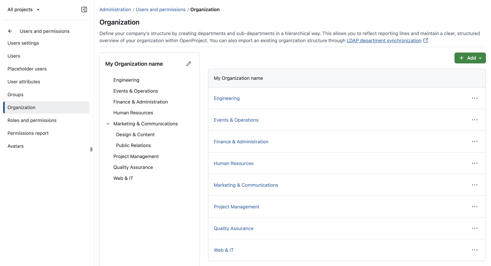
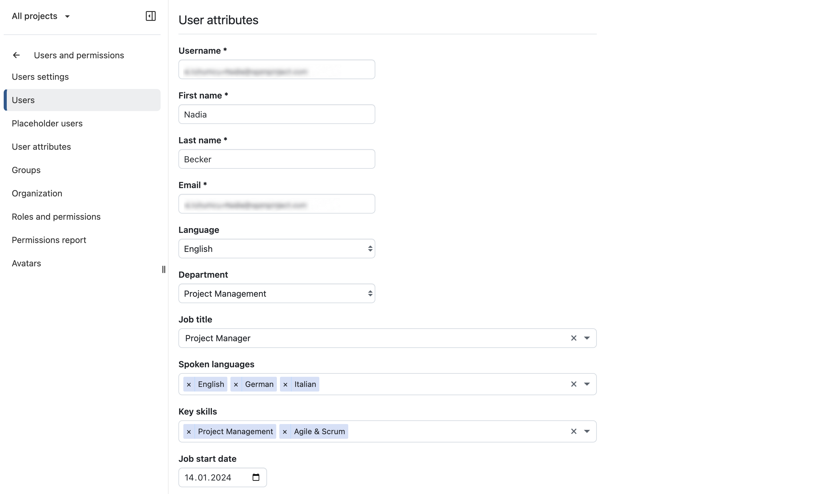
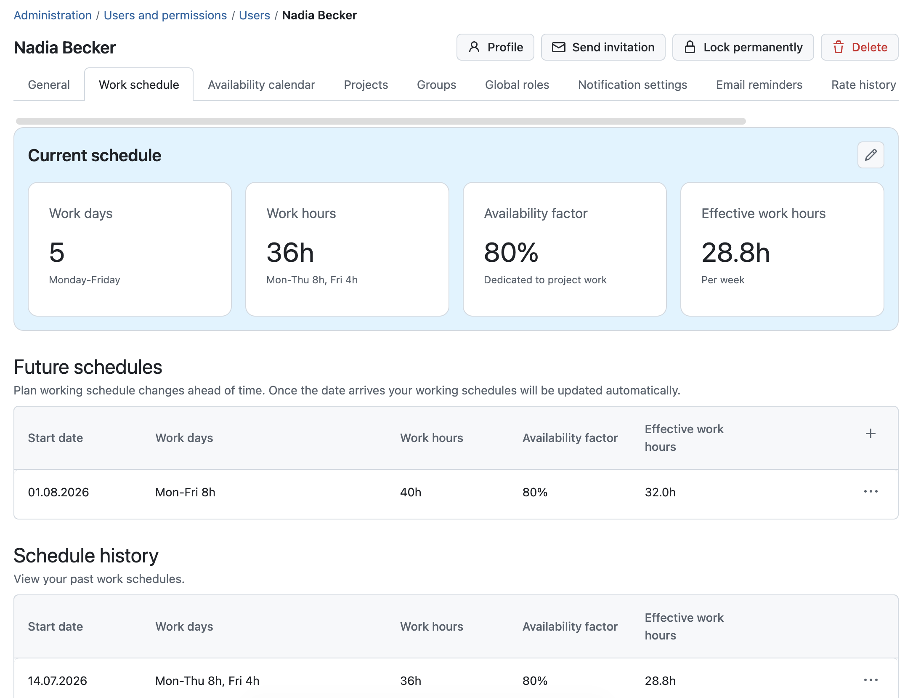
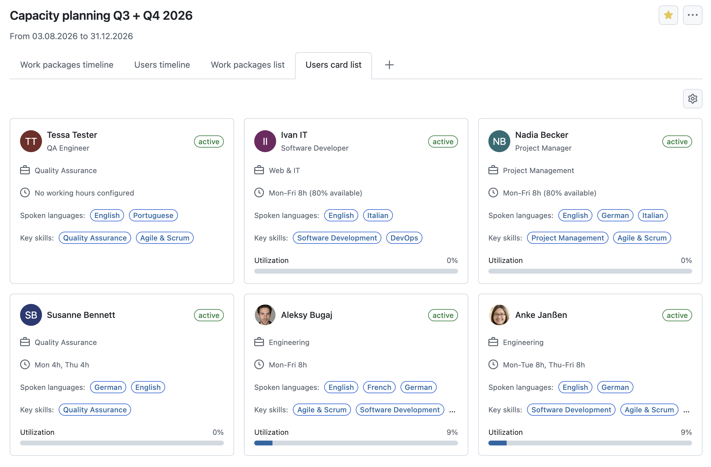
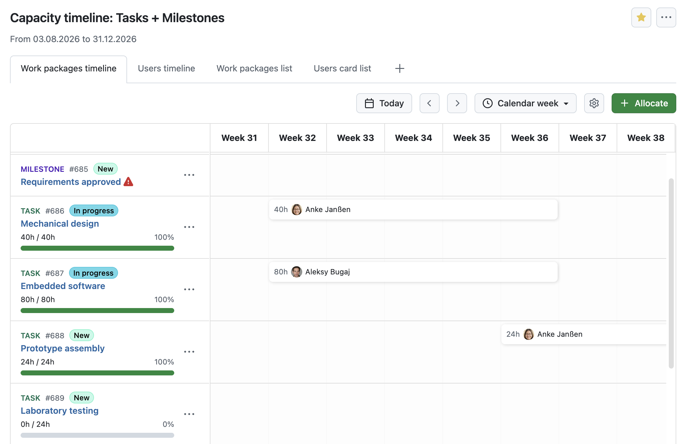
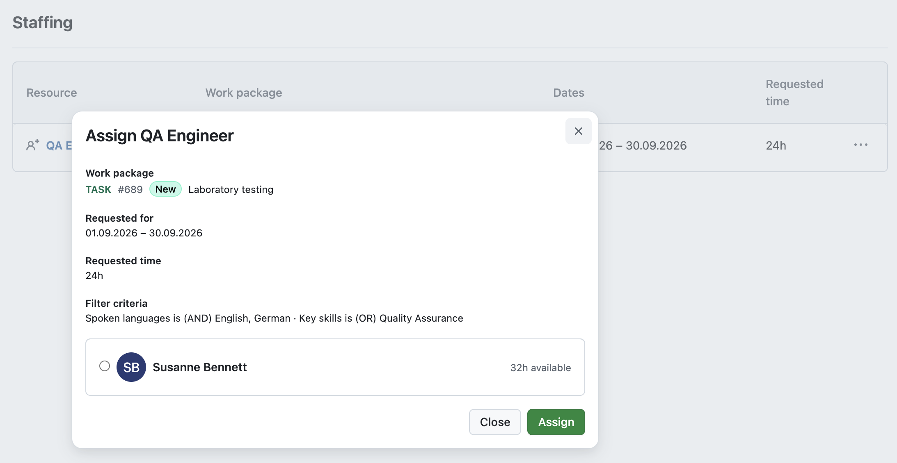
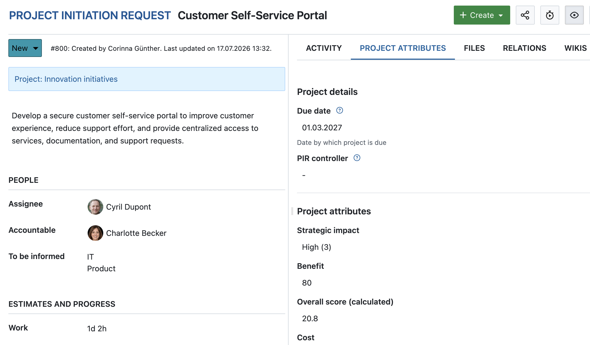
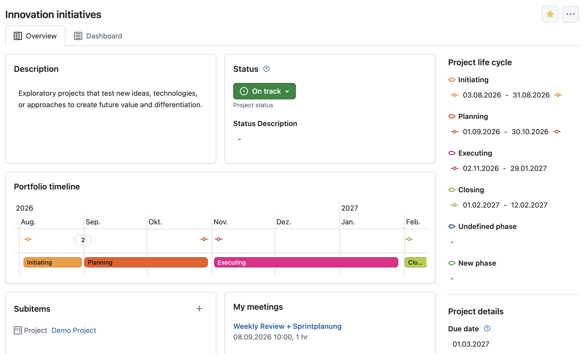

# OpenProject 17.7.0

Release date: 2026-08-05

We released [OpenProject 17.7.0](https://community.openproject.org/versions/2304).
The release contains several bug fixes and we recommend updating to the newest version.
In these Release Notes, we will give an overview of important feature changes. At the end, you will find a complete list of all changes and bug fixes.

## Important feature changes

OpenProject 17.7 introduces new resource management capabilities to help teams plan capacity and staffing more effectively. The release also brings major improvements to agile project management, wiki collaboration, and new features for project management with PM² or PMflex.

Take a look at our release video showing the most important features introduced in OpenProject 17.7:

### Organizational management

OpenProject 17.7 introduces new organizational management capabilities that provide the foundation for the new [Resource management module](#resource-management-module-enterprise-add-on). Departments, work-related user attributes, and individual working hours help organizations represent their workforce more accurately and enable realistic capacity planning and staffing.

These features are also available independently of the Resource management module, allowing organizations on other OpenProject plans to better structure user information and organizational data. [Learn more about the new capabilities and the Resource management module in our dedicated blog article](/blog/resource-management-capacity-planning).

**Departments**

OpenProject now introduces Departments as a new way to organize users. Under *Administration → Users and permissions → Organization*, administrators can create and manage a hierarchical organizational structure with departments and sub-departments. Departments are also available as a user attribute and help structure users consistently across OpenProject.

Organizations using LDAP (Enterprise add-on) can automatically synchronize departments with their directory service, reducing administrative effort.

**Work-related user attributes**

Under *Administration → Users and permissions → Users*, you can now set organization-specific user attributes such as job title, key skills, spoken languages, or employment information. Depending on their permissions, users can update these attributes for themselves or on behalf of others, making it easier to keep workforce information up to date.

**Working hours**

Under *Administration → Users and permissions → Users*, you can now configure individual work schedules for every user, including working days, working hours, availability factors, and future schedule changes. Users can also update their own work schedules or those of others, depending on their permissions.

### Resource management module (Enterprise add-on)

[feature: resource_management ]

The new Resource management module helps organizations plan capacity, allocate work, and balance workloads across teams. It provides dedicated tools for resource planning and staffing while giving project managers greater visibility into team availability and utilization.

**Resource planner**

The Resource planner provides a centralized overview of your workforce, allowing you to search, filter, and compare users based on departments, work-related attributes, availability, and current workload

The timeline view visualizes each user's workload over time, helping project managers understand resource utilization, identify conflicts early, and make informed planning decisions. Project managers can **allocate resources directly from the timeline**, streamlining resource planning and staffing.

**Staffing**

The Staffing view allows project managers to assign work while taking each team member's availability and existing workload into account. Resource requests can be matched with suitable team members, helping organizations distribute work more effectively and avoid overallocations.

### Multiple active sprints without sharing (Enterprise add-on)

[feature: multiple_active_sprints]

OpenProject 17.7 introduces support for multiple active sprints without requiring work packages to be shared between projects. Teams can now run multiple active sprints independently while keeping work packages within their respective projects. This provides greater flexibility for organizations managing multiple Scrum teams or parallel development efforts.

### Community improvements for Backlog and Sprints

OpenProject 17.7 also includes several community-contributed improvements for Backlog and Sprints that make sprint planning and backlog management more efficient.

**Add existing work packages to a sprint**

You can now add existing work packages to a sprint directly from the Backlog view. This makes it easier to move planned work into a sprint without changing the work package hierarchy or creating duplicate work packages.

**Multi-select filters**

Backlog and Sprint filters now support selecting multiple values for the same filter criterion. This makes it easier to filter work packages by multiple assignees, priorities, statuses, versions, or other attributes.

**Improved drag and drop**

Drag-and-drop interactions in the Backlog and Sprint views have been improved to provide a smoother planning experience. Moving work packages between the backlog and sprints, changing their order, or reorganizing the hierarchy is now more intuitive and reliable.

### Improvements for PM² and PMflex management

OpenProject 17.7 introduces several improvements for organizations using the PM² and PMflex project management methodologies, making it easier to manage project information and monitor project progress.

**Show project attributes as separate tab in a work package**

Project attributes can now be displayed in a dedicated **Project attributes** tab within work packages. This provides quicker access to project-specific information while keeping work package details and project metadata clearly separated.

**PMflex Artifact PDF export**

Work packages can now be exported using a dedicated **PMflex Artifact** PDF template. The export combines project attributes, work package attributes, custom fields, and related work packages into a structured document suitable for project documentation and governance.

Administrators can also configure PMflex artifacts to be generated automatically and uploaded to the project's connected Nextcloud folder whenever a work package reaches a defined status.

**Project phases and gates widget**

A new Project phases and gates widget is available for project overviews. It provides a visual representation of the project's current phase and gate status, helping project managers and stakeholders quickly understand project progress at a glance.

### Work package previews from URLs in Documents

When working with the BlockNote editor in Documents, links to work packages now display rich previews instead of plain URLs. This makes it easier to identify referenced work packages and understand their context without leaving the document.

### Semantic identifiers now support BCF import and export

Semantic identifiers are now considered production-ready and are no longer marked as Beta. OpenProject 17.7 also adds support for importing and exporting semantic identifiers in BCF files.

### Filter projects by portfolio and program (Enterprise add-on)

[feature: portfolio_management]

Project lists now support filtering by portfolio and program. This makes it easier to find projects within large project portfolios and provides greater flexibility when creating project overviews and reports.

### Additional calculation operators for calculated fields

Calculated custom fields now support additional calculation operators, allowing you to create more advanced formulas and model a wider range of business logic directly in OpenProject.

### Wiki improvements

OpenProject 17.7 further enhances the internal wiki and XWiki integration with several usability improvements.

**Global wiki page index**

Get a centralized overview of all wiki pages across your projects with filtering and search capabilities.

**Create an internal wiki directly from a project**

Project administrators can now create and configure an internal wiki directly from the project settings.

**Improved wiki navigation**

Wiki search results now display the page hierarchy, making it easier to understand the context of matching pages.

**Permanent links between work packages and wiki pages**

Promote referenced wiki pages to related pages to create permanent links between work packages and documentation.

### Administration improvements

**Disable users editing their own email address**

Administrators can now prevent users from changing their own email address. This gives organizations greater control over user account management and supports environments where email addresses are managed centrally.

**Improved status filtering for user administration**

The user administration page now provides improved status filters, making it easier to find active, locked, invited, or registered users.

**SCIM configuration via environment variables**

SCIM configuration options can now be provided through environment variables, making automated deployments and infrastructure management easier.

### Important technical changes

**Agenda API: Fetch agenda items by work package ID**

The Agenda API now supports retrieving agenda items by work package ID, making it easier to integrate meeting agendas with work package-based workflows.

<!-- BEGIN SECURITY FIXES AUTOMATED SECTION -->

<!-- END SECURITY FIXES AUTOMATED SECTION -->
<!--more-->

## Bug fixes and changes

<!-- Warning: Anything within the below lines will be automatically removed by the release script -->
<!-- BEGIN AUTOMATED SECTION -->

- Feature: Add multi-select drop-down for sprint and backlog buckets \[[#73611](https://community.openproject.org/wp/73611)\]
- Feature: Add existing work packages within sprint and backlog containers menu \[[#74386](https://community.openproject.org/wp/74386)\]
- Feature: Foundations for improved Drag and Drop, gesture support \[[#76076](https://community.openproject.org/wp/76076)\]
- Feature: &quot;Add new work package&quot; option within the context menu for backlog buckets and backlog inbox \[[#76097](https://community.openproject.org/wp/76097)\]
- Feature: Multiple active sprints without sharing \[[#77079](https://community.openproject.org/wp/77079)\]
- Feature: Create a work package link when pasting a work package URL into BlockNote editor (Paste from clipboard) \[[#68818](https://community.openproject.org/wp/68818)\]
- Feature: Adapt BCF Export and Import for semantic identifiers \[[#74362](https://community.openproject.org/wp/74362)\]
- Feature: Remove the Beta label from semantic identifier mode \[[#75975](https://community.openproject.org/wp/75975)\]
- Feature: Short WP link should open the canonical URL of a work package \[[#76098](https://community.openproject.org/wp/76098)\]
- Feature: Move Colours page into a tab of Admin/Design page \[[#56343](https://community.openproject.org/wp/56343)\]
- Feature: Move Avatars setting into Account setttings \[[#69308](https://community.openproject.org/wp/69308)\]
- Feature: User danger dialog when deleting placeholder users \[[#70726](https://community.openproject.org/wp/70726)\]
- Feature: Configurable loading indication for filterable tree views with async filter input \[[#75620](https://community.openproject.org/wp/75620)\]
- Feature: Show project attributes as separate tab in a WorkPackage \[[#75699](https://community.openproject.org/wp/75699)\]
- Feature: Extend WorkPackage export to include PMflex artefacts export \[[#75702](https://community.openproject.org/wp/75702)\]
- Feature: User danger dialog when deleting repositories \[[#76540](https://community.openproject.org/wp/76540)\]
- Feature: Replace outdated danger zone when creating a backup \[[#77184](https://community.openproject.org/wp/77184)\]
- Feature: Add caption to recurring meeting create/edit forms to show end date/no. of occurrences \[[#71922](https://community.openproject.org/wp/71922)\]
- Feature: Add ability to fetch agenda items by WorkPackage ID via the API \[[#76296](https://community.openproject.org/wp/76296)\]
- Feature: Track working hours and availabilities for each user in the system \[[#34911](https://community.openproject.org/wp/34911)\]
- Feature: New Administration for User Custom Fields and Custom Field Sections \[[#72005](https://community.openproject.org/wp/72005)\]
- Feature: Add Departments and Organizational Management to depict the Org Chart \[[#72224](https://community.openproject.org/wp/72224)\]
- Feature: Extend LDAP Sync to build org structure \[[#73883](https://community.openproject.org/wp/73883)\]
- Feature: Build User Card View for Resource Management \[[#74095](https://community.openproject.org/wp/74095)\]
- Feature: Build Primer quickfilter \[[#74577](https://community.openproject.org/wp/74577)\]
- Feature: Add a field to the user profile that can be used to set the department \[[#75959](https://community.openproject.org/wp/75959)\]
- Feature: Select entire semantic ID on click on the work package ID \[[#76268](https://community.openproject.org/wp/76268)\]
- Feature: Extend demo seeds with departments, more users, working schedule \[[#76434](https://community.openproject.org/wp/76434)\]
- Feature: Special roles for User Attributes \[[#76451](https://community.openproject.org/wp/76451)\]
- Feature: Additional calculation operators for calculated fields \[[#76642](https://community.openproject.org/wp/76642)\]
- Feature: Improve date picker of the resource management pages \[[#76557](https://community.openproject.org/wp/76557)\]
- Feature: Add a setting to disable users editing their own email address \[[#76754](https://community.openproject.org/wp/76754)\]
- Feature: Improve status filtering for user administration \[[#76862](https://community.openproject.org/wp/76862)\]
- Feature: Optimise ARIA labels for inline page links and macros \[[#73930](https://community.openproject.org/wp/73930)\]
- Feature: PDF template &quot;Contract&quot;: remove forced header background and bold font style \[[#77447](https://community.openproject.org/wp/77447)\]
- Feature: Allow to configure SCIM client via environment variables \[[#76550](https://community.openproject.org/wp/76550)\]
- Feature: Filter project by portfolio and programm \[[#74718](https://community.openproject.org/wp/74718)\]
- Feature: Overview widget for project phases and gates \[[#76748](https://community.openproject.org/wp/76748)\]
- Feature: Setup an internal wiki from a project \[[#73260](https://community.openproject.org/wp/73260)\]
- Feature: Allow setup of Wiki Integration via environment variables \[[#73292](https://community.openproject.org/wp/73292)\]
- Feature: Promote wiki page with work package reference from list to relation wiki page link \[[#73344](https://community.openproject.org/wp/73344)\]
- Feature: Show wiki page hierarchy in search dialog \[[#75532](https://community.openproject.org/wp/75532)\]
- Feature: Add &quot;as parent&quot; badge to referencing wiki pages \[[#76145](https://community.openproject.org/wp/76145)\]
- Feature: Global wiki page index \[[#76743](https://community.openproject.org/wp/76743)\]
- Bugfix: Backlogs on mobile: cards move on scroll \[[#75139](https://community.openproject.org/wp/75139)\]
- Bugfix: Starting a sprint fails with HTTP 422 and generic error banner \[[#75958](https://community.openproject.org/wp/75958)\]
- Bugfix: Sprint link opens Backlog and sprints page without scrolling to a selected sprint \[[#76559](https://community.openproject.org/wp/76559)\]
- Bugfix: Backlogs: long title isn&#39;t truncated on &quot;add existing work packages&quot; modal \[[#77334](https://community.openproject.org/wp/77334)\]
- Bugfix: Backlogs: work packages from subprojects show on &quot;add existing work packages&quot; modal of the parent project \[[#77338](https://community.openproject.org/wp/77338)\]
- Bugfix: Address remaining open points \[[#77451](https://community.openproject.org/wp/77451)\]
- Bugfix: Multiple active sprints coexist with sharing if there was one active sprint in the subproject before sharing was enabled \[[#77498](https://community.openproject.org/wp/77498)\]
- Bugfix: Inline work package links which the user can not access should have a speaking message \[[#76016](https://community.openproject.org/wp/76016)\]
- Bugfix: Documents: block from the pasted link is highlighted  \[[#77456](https://community.openproject.org/wp/77456)\]
- Bugfix: Documents: cursor misplaced after block is created on work package url copy-paste \[[#77458](https://community.openproject.org/wp/77458)\]
- Bugfix: Mobile web: When deep linking to a comment the comment is not fully scrolled into view \[[#68221](https://community.openproject.org/wp/68221)\]
- Bugfix: Updating the activity anchor URL without a page load does not highlight the relevant target element \[[#68262](https://community.openproject.org/wp/68262)\]
- Bugfix: Quickly clicking &quot;+ Document&quot; several times creates multiple documents \[[#69319](https://community.openproject.org/wp/69319)\]
- Bugfix: Community contribution: GitHub/GitLab - Fix incorrect linking of MR/PR to work packages \[[#72450](https://community.openproject.org/wp/72450)\]
- Bugfix: Documents: impossible to delete characters with backspace after adding a wp link \[[#75669](https://community.openproject.org/wp/75669)\]
- Bugfix: Documents: Drag and drop of blocks only works when dragging over editor content \[[#76200](https://community.openproject.org/wp/76200)\]
- Bugfix: Activity tab: a comment arriving via polling is not reliably scrolled into view \[[#76458](https://community.openproject.org/wp/76458)\]
- Bugfix: Numeric id shown instead of semantic one on the error message while moving work packages between projects \[[#76912](https://community.openproject.org/wp/76912)\]
- Bugfix: WorkPackage::SemanticIdentifier::UnsupportedLookup in BulkController \[[#77341](https://community.openproject.org/wp/77341)\]
- Bugfix: Activity tab floods page with &quot;not found&quot; banners after session expiry \[[#77493](https://community.openproject.org/wp/77493)\]
- Bugfix: Comment field content overflows tooltip in &#39;My Spent Time&#39; calendar \[[#64175](https://community.openproject.org/wp/64175)\]
- Bugfix: \[minor\] Clarification needed in GitLab integration documentation (user vs role confusion) \[[#71353](https://community.openproject.org/wp/71353)\]
- Bugfix: Low contrast in dark mode: markdown-text editor \[[#64462](https://community.openproject.org/wp/64462)\]
- Bugfix: &quot;Subproject of&quot; dropdown border missing at bottom / dropdown cut off \[[#64592](https://community.openproject.org/wp/64592)\]
- Bugfix: A missing full stop at the end of confirmation message of danger dialog  \[[#73899](https://community.openproject.org/wp/73899)\]
- Bugfix: Lazy loaded Action menu positioning is incorrect when opened at the bottom of the page. \[[#76023](https://community.openproject.org/wp/76023)\]
- Bugfix: Cancelling inplace edit fields results in an error \[[#77246](https://community.openproject.org/wp/77246)\]
- Bugfix: &quot;New work package&quot; outcome form does not update placeholder description on changing types \[[#76440](https://community.openproject.org/wp/76440)\]
- Bugfix: For some meetings, moving from Agenda to Backlog cause 422 error \[[#77215](https://community.openproject.org/wp/77215)\]
- Bugfix: Translation error in &quot;add work package&quot; macro in WYSWIG \[[#40221](https://community.openproject.org/wp/40221)\]
- Bugfix: Misalignment of radio buttons on WP deletion \[[#44467](https://community.openproject.org/wp/44467)\]
- Bugfix: Custom text widget pagination bug \[[#66419](https://community.openproject.org/wp/66419)\]
- Bugfix: Arrow for switching years barely visible in dark mode on the calendar \[[#68517](https://community.openproject.org/wp/68517)\]
- Bugfix: Sign up errors are showing behind new account creation modal \[[#69793](https://community.openproject.org/wp/69793)\]
- Bugfix: WP search dropdown: wp created by deleted user has a weird layout with missing avatar \[[#70580](https://community.openproject.org/wp/70580)\]
- Bugfix: Inaccurate/incomplete error messaging when removing a WP type from a project \[[#70921](https://community.openproject.org/wp/70921)\]
- Bugfix: User sees a success banner if they save a letter/word as integer \[[#71650](https://community.openproject.org/wp/71650)\]
- Bugfix: Meeting global search resolves links in wrong project context \[[#74626](https://community.openproject.org/wp/74626)\]
- Bugfix: Multi-select workflows cannot bulk select/unselect rows/columns \[[#76541](https://community.openproject.org/wp/76541)\]
- Bugfix: Impossible to create team planner as it redirects to work packages page \[[#76651](https://community.openproject.org/wp/76651)\]
- Bugfix: When user receives a new notification while having the top one open in split view, then both top notifications look active \[[#76693](https://community.openproject.org/wp/76693)\]
- Bugfix: Users can deleted descendent work packages in projects they are not authorized to \[[#76930](https://community.openproject.org/wp/76930)\]
- Bugfix: ActionView::MissingTemplate in Search controller on unsupported content type \[[#77081](https://community.openproject.org/wp/77081)\]
- Bugfix: Use Label component to indicate user status \[[#76263](https://community.openproject.org/wp/76263)\]
- Bugfix: Form errors not shown during trial activation \[[#77340](https://community.openproject.org/wp/77340)\]
- Bugfix: Impossible to search for archived projects, page reverts to active projects list on its own \[[#71971](https://community.openproject.org/wp/71971)\]
- Bugfix: Nextcloud Anbindung Fehler &quot;&lt;Nextcloud-Hostname&gt; has no public IP addresses&quot; \[[#77278](https://community.openproject.org/wp/77278)\]
- Feature: New frontend for &#39;My account&#39; based on design system \[[#56584](https://community.openproject.org/wp/56584)\]

<!-- END AUTOMATED SECTION -->
<!-- Warning: Anything above this line will be automatically removed by the release script -->

## Contributions

A very special thank you goes to Helmholtz-Zentrum Berlin, City of Cologne, Deutsche Bahn, ZenDiS, and STEF for sponsoring released or upcoming features. Your support, alongside the efforts of our amazing Community, helps drive these innovations.

Also a big thanks to our Community members for reporting bugs and helping us identify and provide fixes. Special thanks for reporting and finding bugs go to Rince wind, Walid Ibrahim, Gábor Alexovics, Brandon Soonaye, and Mohammed Mohiuddin.

Last but not least, we are very grateful for our very engaged translation contributors on Crowdin, who translated quite a few OpenProject strings! This release we would like to particularly thank [Maximiliano Spaccesi](https://crowdin.com/profile/maximiliano.spaccesi) for translating our FAQ in the documentation into Spanish.

Would you like to help out with translations yourself? Then take a look at our [translation guide](../../contributions-guide/translate-openproject/) and find out exactly how you can contribute. It is very much appreciated!