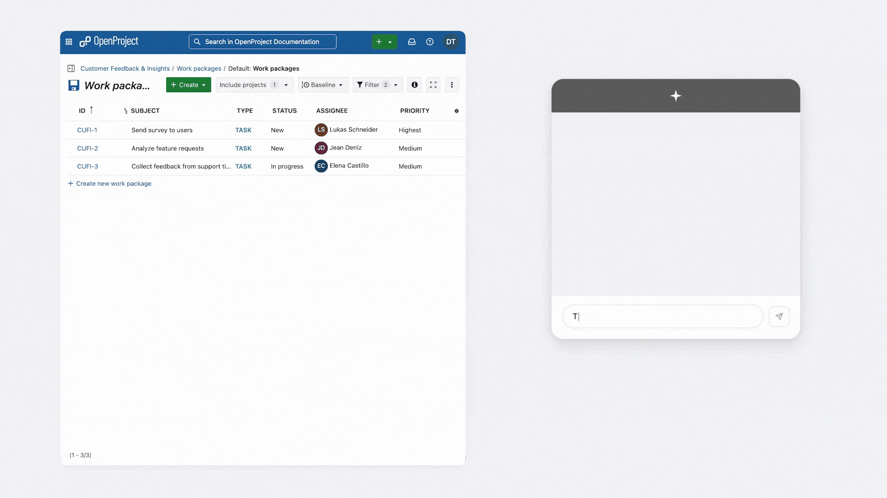
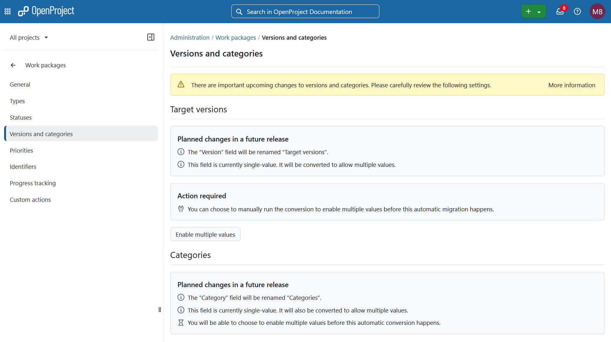
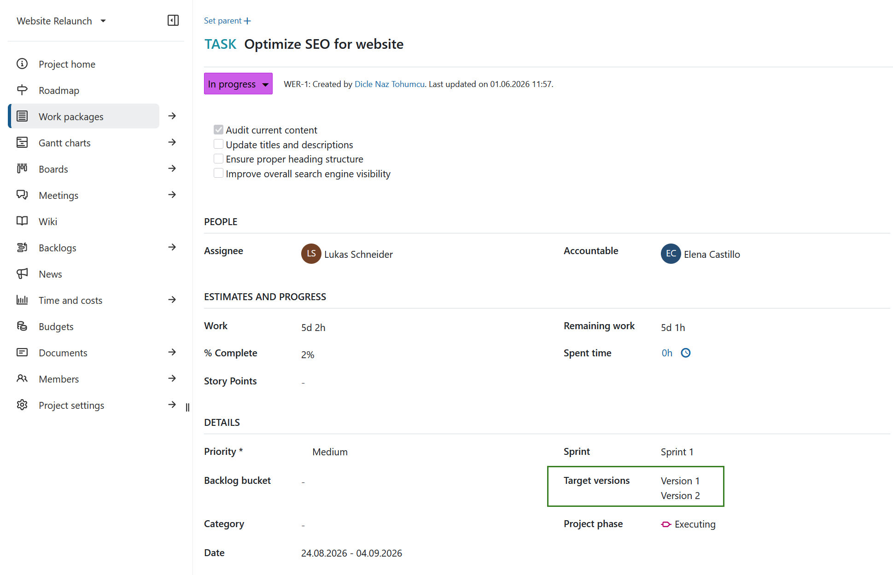
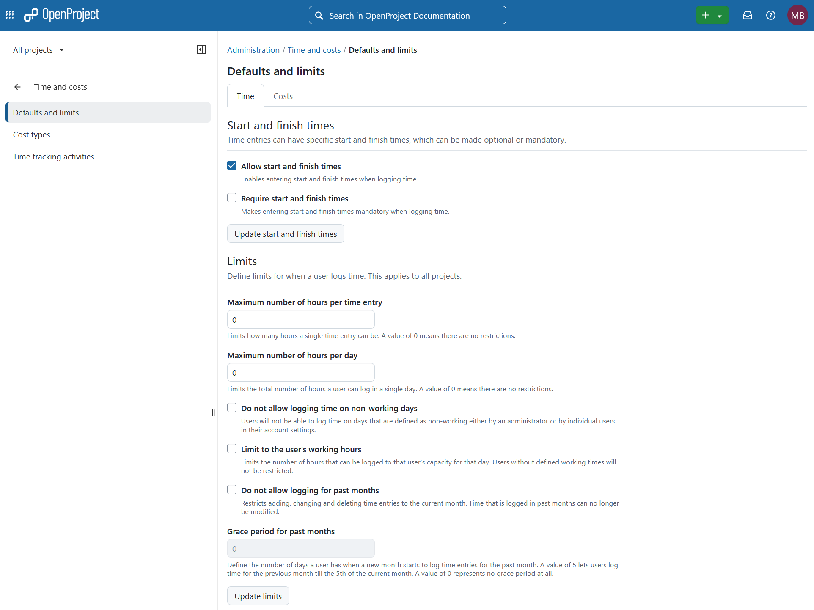
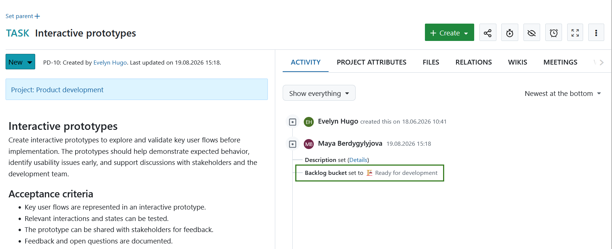
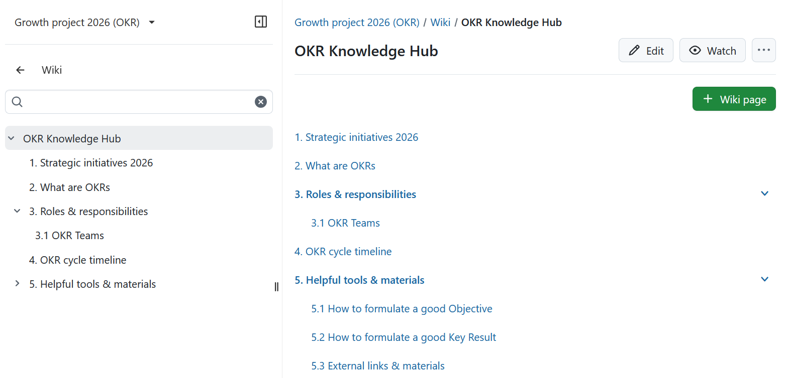
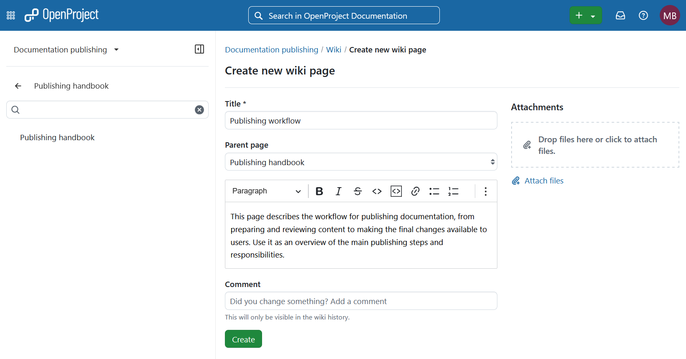
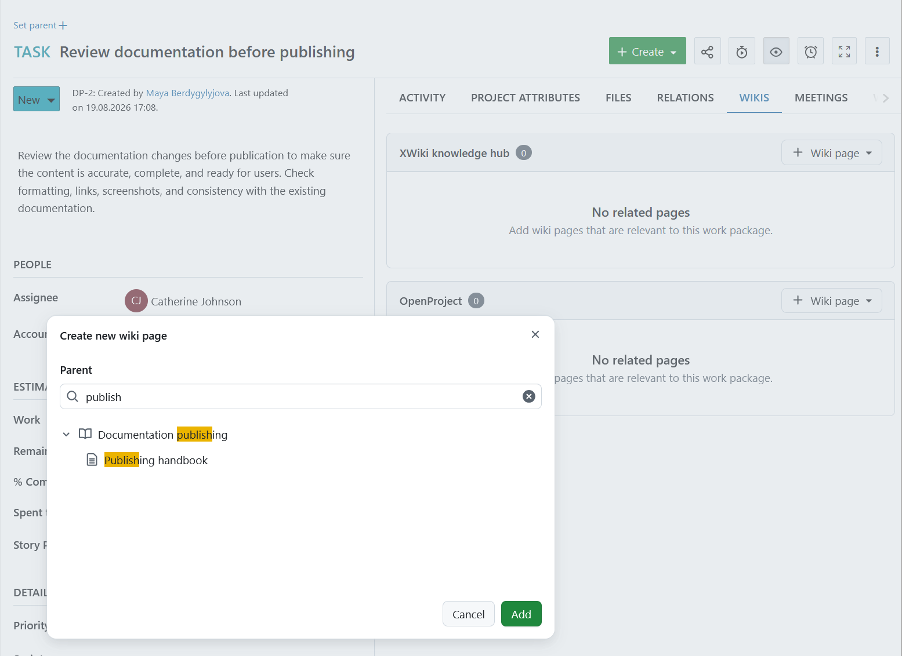
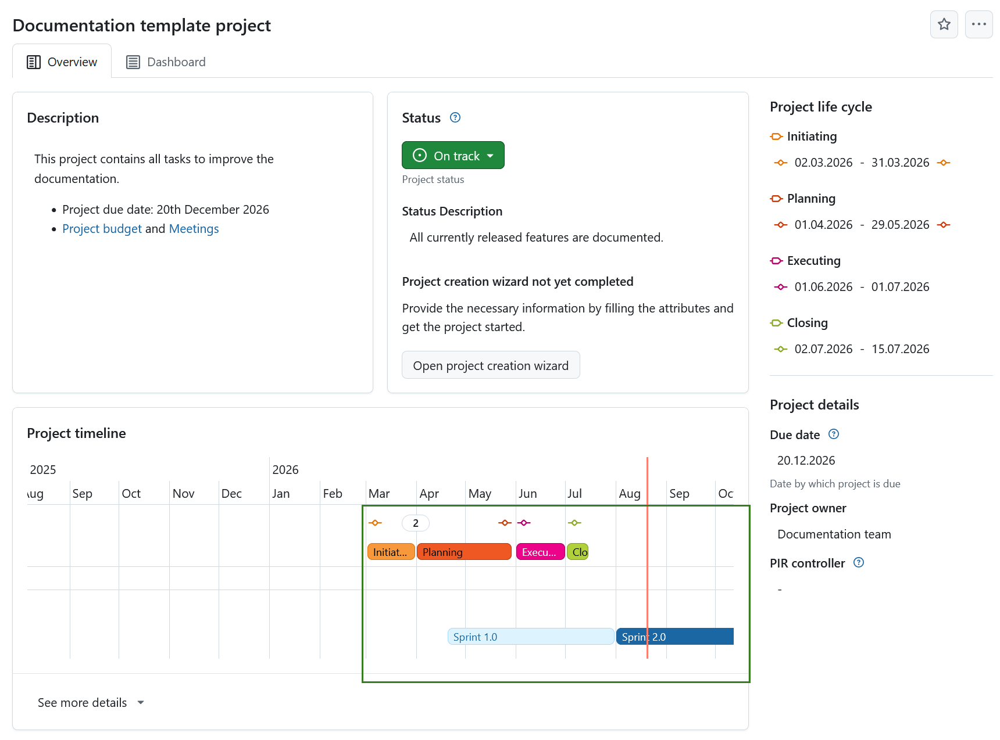
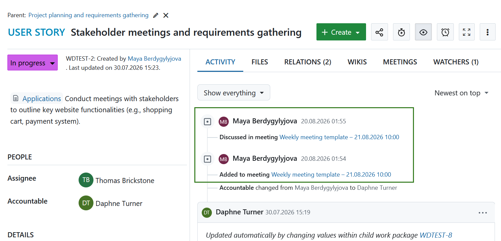

# OpenProject 17.8.0

Release date: 2026-09-02

We released [OpenProject 17.8.0](https://community.openproject.org/versions/2313). The release contains several bug fixes and we recommend updating to the newest version. In these Release Notes, we will give an overview of important feature changes. At the end, you will find a complete list of all changes and bug fixes.

## Important feature changes

OpenProject 17.8 brings powerful new possibilities for connecting AI assistants with your project work: the **MCP Server can now create and update work packages**, add comments, and manage work package relations. The release also introduces **multiple target versions per work package**, adds **sprints and milestones to the project timeline**, and brings further improvements to wikis, Backlogs, meetings, and administration.

And there is good news for Community users: **displaying relations in the work package table is now available in the free Community edition**. This makes it easier to see and work with relationships between work packages directly from the table.

Take a look at our release video showing the most important features introduced in OpenProject 17.8:

### AI: Create and update work packages with the MCP Server

[feature: mcp_server ]

OpenProject 17.8 significantly extends the capabilities of the [MCP Server](../../system-admin-guide/integrations/mcp-server/). AI assistants can now **create and update work packages directly in OpenProject**, instead of being limited to searching and reading project information.

The new `create_work_package` and `update_work_package` MCP tools follow the same permissions and business rules as the regular OpenProject UI and API. This includes required fields and `lock_version` checks for updates.

The MCP Server also gains several additional capabilities:

- **Work package comments:** AI assistants can list existing comments, including emoji reactions, and create new comments.
- **Work package relations:** Relations can now be created, modified, and deleted. Relations can also be retrieved, allowing assistants to understand dependencies between work packages.
- **Custom fields:** Custom fields can now be properly identified and set when creating or updating work packages. Possible values for hierarchy-type custom fields can also be retrieved.
- **Pagination metadata:** Collection responses now include information such as page size and total count, making questions such as "How many work packages exist?" easier to answer without additional requests.

Responses from the MCP Server have also been streamlined to reduce unnecessary information sent to AI assistants. Unnecessary action links and the HTML representation of formattable properties such as descriptions and comments are removed from responses. Output schemas have also been removed from MCP tool definitions.

Internally, MCP tools and resources are now registered through a registry pattern, making the server easier to extend in the future.

### Display relations in the work package table now available in the Community edition

**Displaying [work package relations](../../user-guide/work-packages/work-package-relations-hierarchies/) in the work package table is now available to all OpenProject users in the free Community edition**.

Displaying relations as columns in the work package table makes it easier to see how work packages are connected without having to open individual work packages.

### Assign multiple target versions to a work package

OpenProject 17.8 introduces **multiple target versions for work packages**. The existing **Version** field is renamed to **Target versions** and changes from a single-value field to a multi-value field. This allows a work package to be assigned to several versions at the same time, for example when a fix is included in several release lines or a feature spans multiple milestones.

For existing OpenProject installations, this conversion does not happen automatically with the 17.8 update. Administrators can enable it manually under *Administration → Work packages → Versions and categories*. New installations have multiple target versions enabled by default.

> [!IMPORTANT]
> Enabling multiple target versions is a one-way conversion and cannot be reverted.

Existing version assignments are preserved during the conversion so no data is lost. And once **multiple values** is enabled users can start assigning more than a single version to a work package.

Existing functionality such as roadmaps, version boards, bulk editing, project copying, queries, filters, exports, and notifications continues to work with target versions.

For API clients, a new `targetVersions` property replaces the single-value `version` field. Integrations that manage version assignments should migrate to `targetVersions` BEFORE enabling multiple versions on the OpenProject instance.

For more information about the change, migration options, and API compatibility, see the [multiple target versions documentation](../../system-admin-guide/manage-work-packages/versions-and-categories/#multiple-target-versions).

OpenProject 17.8 also extends CKEditor's attribute value macros with a `singleline` and `multiline` layout argument. This allows multi-value attributes to be displayed either as a comma-separated line within a sentence or as a list.

### Configurable global restrictions for time entries

[feature: time_entry_time_restrictions ]

Administrators can now configure **global restrictions for time entries** under *Administration → Time & Costs → Time*.

For example, administrators can:

- limit the number of hours allowed in an individual time entry,
- limit the number of hours a user can log per day,
- restrict time entries to a user's defined working hours,
- prevent time from being logged on non-working days,
- prevent entries from being added to months that have already ended.

All validations are disabled by default, so existing OpenProject behavior remains unchanged after updating. These settings are instance-wide. 

Project-specific overrides are not yet included and are planned as a future enhancement.

For more information about recording time in OpenProject, see the [time tracking documentation](../../user-guide/time-and-costs/time-tracking/).

### Backlogs and agile improvements

OpenProject 17.8 brings several improvements to [Backlogs and sprints](../../user-guide/backlogs-scrum/).

Users can now change **sprints and backlog buckets using bulk edit**, making it easier to reorganize multiple work packages at once.

Changes to a work package's **backlog bucket** are now recorded in the Activity tab, just like changes to sprint assignments.

Sprint and backlog bucket cards can now be **dragged into external applications**. Depending on the target application, dropping a card into a chat, text editor, another browser window, or rich-text editor provides a usable link to the OpenProject work package.

When creating a new Scrum demo project, the default **Epic** and **User story** work package types now include an embedded related work package table showing their children. This makes it easier to see related work directly on the work package page and demonstrates how embedded related work package tables can be used.

### Wiki improvements

OpenProject 17.8 brings further improvements to [project wikis](../../user-guide/wiki/).

The term **internal wiki** has been replaced with **project wiki** throughout the interface, making the distinction from external wiki integrations such as XWiki clearer. The project wiki provider is called OpenProject.

The project wiki settings remain accessible even when project wikis have been disabled instance-wide, with an explanation of why the feature is unavailable.

The **project wiki sidebar now makes it easier to navigate the wiki hierarchy**. Pages are collapsed by default and can be expanded to show their sub-pages. When opening a page, its parent pages are automatically expanded, and a search field lets users filter the hierarchy while showing where matching pages are located.

The [create and edit page](../../user-guide/wiki/create-edit-wiki/) has been updated with a modernized user interface.

The **Create page** dialog improves a parent page selection, making it possible to create root pages directly. The parent selection step is now labeled **Parent**.

Finally, wiki link and creation macros, such as **Existing wiki page** and **New wiki page**, are available in more rich text editors, including meeting descriptions, outcomes, comments, wiki page content, and text custom fields.

### Milestones and sprints are displayed in the project timeline widget

The **[Project timeline](../../user-guide/projects/project-home/)** widget on the project overview now provides a more complete picture of important project dates by displaying **milestones and sprints alongside project phases**.

Milestones are displayed below the project phases and link directly to their work package full view. A footer link also lets users open all milestones in the Gantt chart.

Sprints are displayed below milestones. They are shown as read-only items and cannot be moved using drag and drop. A footer link leads to the sprints overview.

If the Backlogs module is disabled for a project, sprints are automatically hidden from the timeline. If a user lacks necessary permissions, the widget remains empty.  

### Improved work package identifiers and search

Search results and autocompleters now **prioritize exact identifier matches over fuzzy matches**. OpenProject also distinguishes correctly between project-based identifiers such as `ACSMT-5` and numerical work package IDs, including when identifiers are entered with a `#` prefix.

If a work package URL does not contain the canonical identifier of the work package, OpenProject now automatically corrects the URL in the browser without redirecting or reloading the page.

Searching for work packages from the BlockNote editor has also been improved. Searches triggered using shortcuts such as `#` or `/` now display a loading indicator as well as clear **No results** and **Error** states.

The BlockNote editor extensions additionally support a separate `proxyUrl` alongside `baseUrl`. This ensures that links generated for pasted or typed work package references point directly to OpenProject instead of through an integration proxy.

> [!NOTE]
> Project identifiers should not be treated as confidential information, even for private projects when project-based work package identifiers are enabled. Identifiers can become visible through public documents, anonymous access, or cross-project references.

### Meeting activity visible directly in work packages

The connection between [meetings](../../user-guide/meetings/) and work packages is more visible.

The **Activity** tab of a work package now shows when the work package was **added to a meeting, removed from a meeting, moved between meetings, or discussed in a meeting**. This also applies to meeting templates and meeting series.

This gives users important meeting context directly in the work package without requiring them to open the separate Meetings tab.

For users who prefer a less detailed activity stream, a new **Hide meeting updates** filter can be used to collapse these entries.

### Administration and account page improvements

OpenProject 17.8 continues the modernization of administration and account pages with Primer UI components.

The **Create new account** page, project Overview actions, and additional legacy pages have received updated interfaces and improved inline validation.

The **More actions** menus on the project Overview and under *Project settings → Information* have also been reorganized and standardized. Archiving a project now uses a consistent danger-styled confirmation.

The authentication setting controlling who can create projects now includes a note explaining that users may be able to see project identifiers.

The page for creating a new two-factor authentication device during an enforced 2FA login has also been updated to the modern Primer-based interface. For more information, see the [two-factor authentication (2FA) documentation](../../system-admin-guide/authentication/two-factor-authentication/).

## Important updates and breaking changes

The Activity tab polling interval can now be configured using the `WORK_PACKAGES_ACTIVITIES_TAB_POLLING_INTERVAL_IN_MS` setting. Previously, this interval was hardcoded or configurable only through an environment variable.

Users can also reduce the minimum width of split-screen views to **430 px**, providing more room for the main content area. This applies to all split-screen views except the Gantt chart.

## Bug fixes and changes

<!-- Warning: Anything within the below lines will be automatically removed by the release script -->
<!-- BEGIN AUTOMATED SECTION -->

- Feature: Sprints and backlog buckets can be updated on bulk updating work packages \[[#73103](https://community.openproject.org/wp/73103)\]
- Feature: Show children as related wp table for Epic and User story (default seeding) \[[#75940](https://community.openproject.org/wp/75940)\]
- Feature: Journalized backlog bucket \[[#76020](https://community.openproject.org/wp/76020)\]
- Feature: Support drag and drop to external applications \[[#77347](https://community.openproject.org/wp/77347)\]
- Feature: Check the presence of the Enterprise plan custom field \[[#77997](https://community.openproject.org/wp/77997)\]
- Feature: Remove html from formattable properties \[[#72514](https://community.openproject.org/wp/72514)\]
- Feature: Prune links in MCP responses \[[#72515](https://community.openproject.org/wp/72515)\]
- Feature: Remove structured output schema functionality \[[#75403](https://community.openproject.org/wp/75403)\]
- Feature: Add pagination meta data to responses \[[#75404](https://community.openproject.org/wp/75404)\]
- Feature: Add create\_work\_package MCP tool \[[#75408](https://community.openproject.org/wp/75408)\]
- Feature: Add update\_work\_package MCP tool \[[#75409](https://community.openproject.org/wp/75409)\]
- Feature: Add human readable names to custom fields \[[#75410](https://community.openproject.org/wp/75410)\]
- Feature: Expose work package relations via MCP \[[#77506](https://community.openproject.org/wp/77506)\]
- Feature: Expose custom hierarchy items via MCP \[[#77646](https://community.openproject.org/wp/77646)\]
- Feature: Allow to interact with work package comments via MCP \[[#77887](https://community.openproject.org/wp/77887)\]
- Feature: Allow to modify work package relations \[[#78052](https://community.openproject.org/wp/78052)\]
- Feature: Adapt to new default tool description in a migration \[[#78065](https://community.openproject.org/wp/78065)\]
- Feature: Give feedback when waiting for work package search \[[#78263](https://community.openproject.org/wp/78263)\]
- Feature: Rank exact identifier matches above fuzzy ones in work package searching and autocompleters \[[#74302](https://community.openproject.org/wp/74302)\]
- Feature: Introduce target versions replacing version \[[#76181](https://community.openproject.org/wp/76181)\]
- Feature: Make target\_versions the canonical data source for all subsystems in OpenProject \[[#76166](https://community.openproject.org/wp/76166)\]
- Feature: Adjust CKEditor version macros: single-line/multi-line layout argument for attribute value macros \[[#76876](https://community.openproject.org/wp/76876)\]
- Feature: Add proxy URL for work package links in op-blocknote-extensions \[[#77115](https://community.openproject.org/wp/77115)\]
- Feature: Fix the work package URL if it does not use the canoncial identifier of a work package \[[#77262](https://community.openproject.org/wp/77262)\]
- Feature: Clarify that project identifiers are non-confidential when project-based semantic work package identifiers are used \[[#78128](https://community.openproject.org/wp/78128)\]
- Feature: Global restrictions/limits for time entries \[[#78132](https://community.openproject.org/wp/78132)\]
- Feature: Implement a primerized page for creating a new 2FA device  \[[#56848](https://community.openproject.org/wp/56848)\]
- Feature: Easier navigation in project wiki sidemenu  \[[#77507](https://community.openproject.org/wp/77507)\]
- Feature: Allow changing reuse mode through a dialog \[[#77331](https://community.openproject.org/wp/77331)\]
- Feature: Activity tab: Journalise and add information about when a work package is added or discussed in a meeting \[[#61057](https://community.openproject.org/wp/61057)\]
- Feature: Make it possible to make the split screen narrower  \[[#58783](https://community.openproject.org/wp/58783)\]
- Feature: Standardise the actions available in the Overview more action  \[[#69398](https://community.openproject.org/wp/69398)\]
- Feature: Primerize the create new account page \[[#69793](https://community.openproject.org/wp/69793)\]
- Feature: Annotate auth setting UI with security comment on project creation \[[#76856](https://community.openproject.org/wp/76856)\]
- Feature: Display relations in the work package table to the community edition \[[#78598](https://community.openproject.org/wp/78598)\]
- Feature: Add milestones to the project lifecycle widget \[[#76749](https://community.openproject.org/wp/76749)\]
- Feature: Add sprints to the project lifecycle widget \[[#76750](https://community.openproject.org/wp/76750)\]
- Feature: Select wiki to create main pages when creating new pages \[[#76146](https://community.openproject.org/wp/76146)\]
- Feature: Enable wiki macros in more editors \[[#76758](https://community.openproject.org/wp/76758)\]
- Feature: Update internal wiki create/edit page with modern UI \[[#77225](https://community.openproject.org/wp/77225)\]
- Feature: Always show &quot;project wiki&quot; settings menu \[[#78266](https://community.openproject.org/wp/78266)\]
- Bugfix: Multiple active sprints coexist with sharing if there was one active sprint in the subproject before sharing was enabled \[[#77498](https://community.openproject.org/wp/77498)\]
- Bugfix: Variants are indistinguishable from their parent type when choosing a configuration source \[[#78002](https://community.openproject.org/wp/78002)\]
- Bugfix: Admin user cannot update their own profile from My Account page on BIM instance \[[#78487](https://community.openproject.org/wp/78487)\]
- Bugfix: Documents: highlighting missing on selected wp block on mobile \[[#75804](https://community.openproject.org/wp/75804)\]
- Bugfix: Slash-command for linking work package should highlight first search result \[[#76209](https://community.openproject.org/wp/76209)\]
- Bugfix: Low contrast text in documents inline work package links that makes it hard to read \[[#75432](https://community.openproject.org/wp/75432)\]
- Bugfix: Wrong placement of context menu if inline work package link spans multiple lines \[[#76583](https://community.openproject.org/wp/76583)\]
- Bugfix: Documents: cursor misplaced after block is created on work package url copy-paste \[[#77458](https://community.openproject.org/wp/77458)\]
- Bugfix: Clickling / selecting a work package link block sometimes looks weird on Safari \[[#77691](https://community.openproject.org/wp/77691)\]
- Bugfix: Copy &amp; Paste Loses Formatting in Documents \[[#73669](https://community.openproject.org/wp/73669)\]
- Bugfix: Documents: Drag and drop of blocks only works when dragging over editor content \[[#76200](https://community.openproject.org/wp/76200)\]
- Bugfix: Switch from Markdown source back to WSIWYG editor results in an error \[[#76260](https://community.openproject.org/wp/76260)\]
- Bugfix: SMTP configuration fields never appear on Email notifications settings page \[[#76898](https://community.openproject.org/wp/76898)\]
- Bugfix: Allow copying the link to an unavailable (unauthorized) work package for all inline/block sizes \[[#77454](https://community.openproject.org/wp/77454)\]
- Bugfix: &quot;Autocompleter&quot; should not be an option for sorting work package tables \[[#77862](https://community.openproject.org/wp/77862)\]
- Bugfix: &quot;No results&quot; feedback in the hash menu is unreachable for longer queries \[[#78346](https://community.openproject.org/wp/78346)\]
- Bugfix: Both &quot;Target version&quot; and &quot;Version&quot; filters are present when target versions is enabled \[[#78408](https://community.openproject.org/wp/78408)\]
- Bugfix: Fix typo on Administration -&gt; work packages -&gt; Versions and categories \[[#78438](https://community.openproject.org/wp/78438)\]
- Bugfix: CKEditor error on switching to markdown source \[[#78821](https://community.openproject.org/wp/78821)\]
- Bugfix: Global search should continue to work after a failed request \[[#79047](https://community.openproject.org/wp/79047)\]
- Bugfix: Custom fields of type Select List (single choice) are not migrated correctly \[[#78043](https://community.openproject.org/wp/78043)\]
- Bugfix: Error during import „undefined method ‚strip&#39; for nil&quot; \[[#78259](https://community.openproject.org/wp/78259)\]
- Bugfix: Custom fields of type list and hierarchy are duplicated by Jira Migrator \[[#78429](https://community.openproject.org/wp/78429)\]
- Bugfix: Imprecise error for invalid address of Jira Server/Data Center URL when testing Jira connection \[[#78488](https://community.openproject.org/wp/78488)\]
- Bugfix: uLimit open files may limit migration process \[[#78819](https://community.openproject.org/wp/78819)\]
- Bugfix: Wrong values for Time Tracking (Estimated, Remaining) \[[#78972](https://community.openproject.org/wp/78972)\]
- Bugfix: Meeting email update is sent in sender&#39;s OP language \[[#67287](https://community.openproject.org/wp/67287)\]
- Bugfix: Double clicking remove button in meeting participants result in 404 \[[#74955](https://community.openproject.org/wp/74955)\]
- Bugfix: No way to send meeting notification mails via the API \[[#77650](https://community.openproject.org/wp/77650)\]
- Bugfix: Translation error in &quot;add work package&quot; macro in WYSWIG \[[#40221](https://community.openproject.org/wp/40221)\]
- Bugfix: In Time and costs (administration), Costs tab always opens first despite being second \[[#67668](https://community.openproject.org/wp/67668)\]
- Bugfix: WP search dropdown: wp created by deleted user has a weird layout with missing avatar \[[#70580](https://community.openproject.org/wp/70580)\]
- Bugfix: Export: Queries accessed within another project cannot be exported \[[#75759](https://community.openproject.org/wp/75759)\]
- Bugfix: NoMethodError in HandleICalResponseService \[[#76771](https://community.openproject.org/wp/76771)\]
- Bugfix: Meeting of a meeting series cannot be duplicated as a one-time meeting \[[#77095](https://community.openproject.org/wp/77095)\]
- Bugfix: Meeting invitation email shows event shifted by +1 hour for dates between 2026-09-29 and 2026-10-24 \[[#77624](https://community.openproject.org/wp/77624)\]
- Bugfix: Project list CSV/XLS export does not include project phases \[[#77674](https://community.openproject.org/wp/77674)\]
- Bugfix: PDF exports: borderless tables still have left and right border paddings \[[#77741](https://community.openproject.org/wp/77741)\]
- Bugfix: PDF table export grouped by a hierarchy custom field stops the full export \[[#78036](https://community.openproject.org/wp/78036)\]
- Bugfix: Deleting a parent leaves a journal entry with empty parentheses \[[#78038](https://community.openproject.org/wp/78038)\]
- Bugfix: Users with leading emojis in names have broken avatars \[[#78109](https://community.openproject.org/wp/78109)\]
- Bugfix: Long WP name or timespan doesn&#39;t wrap in planner cell \[[#78323](https://community.openproject.org/wp/78323)\]
- Bugfix: User cannot update own profile because password confirmation autosaves \[[#78327](https://community.openproject.org/wp/78327)\]
- Bugfix: Ckeditor toolbar is partially offscreen on work package description \[[#78401](https://community.openproject.org/wp/78401)\]
- Bugfix: Community version: Project list inconsistencies \[[#78430](https://community.openproject.org/wp/78430)\]
- Bugfix: Sprint names and assignments leaking through activity without view\_sprints permission \[[#78436](https://community.openproject.org/wp/78436)\]
- Bugfix: When creating a Resource Planner with a WorkPackage filter, the Assignee field does not show user names \[[#78848](https://community.openproject.org/wp/78848)\]
- Bugfix: List of filters for creating a work package resource planner have a lot of irrelevant filters \[[#78849](https://community.openproject.org/wp/78849)\]
- Bugfix: Required user custom field breaks OIDC user registration \[[#78203](https://community.openproject.org/wp/78203)\]
- Bugfix: SharePoint and OneDrive files query fetch only 200 items \[[#78395](https://community.openproject.org/wp/78395)\]
- Bugfix: Clearer error handling for Nextcloud storage synchronization: TypeError in Storages::AutomaticallyManagedStorageSyncJob#perform \[[#71862](https://community.openproject.org/wp/71862)\]
- Bugfix: Pagination does not work for the &quot;All wiki pages&quot; page \[[#78070](https://community.openproject.org/wp/78070)\]
- Bugfix: Rename internal wiki to project wikis \[[#78195](https://community.openproject.org/wp/78195)\]
- Bugfix: Project wiki is not enabled in seeded demo projects \[[#78351](https://community.openproject.org/wp/78351)\]
- Bugfix: Project wiki enabled cannot be set as default for new projects \[[#78352](https://community.openproject.org/wp/78352)\]
- Bugfix: Internal wiki provider is named Project wiki in inappropriate locations \[[#78518](https://community.openproject.org/wp/78518)\]
- Bugfix: Select wiki to create main pages when creating new pages \[[#78576](https://community.openproject.org/wp/78576)\]
- Bugfix: Links to XWiki integration docs are all wrong \[[#78960](https://community.openproject.org/wp/78960)\]
- Feature: Extend MCP Server with write capabilities and improved response quality \[[#73261](https://community.openproject.org/wp/73261)\]

<!-- END AUTOMATED SECTION -->
<!-- Warning: Anything above this line will be automatically removed by the release script -->

## Contributions

A very special thank you goes to Helmholtz-Zentrum Berlin, City of Cologne, Deutsche Bahn and ZenDiS for sponsoring released or upcoming features. Your support, alongside the efforts of our amazing Community, helps drive these innovations.

Special thanks for reporting and finding bugs go to Christoph Jansen, Chris Kerrison, Laurent Redor, Gernot Hollinger, Thomas Knäuper, Gábor Alexovics, Rince wind.

Last but not least, we are very grateful for our very engaged translation contributors on Crowdin, who translated quite a few OpenProject strings. This release we would like to particularly thank the following users:

- [Narek Selvinazyan](https://crowdin.com/profile/narek.selvinazyan), for translations into Armenian,
- [Amir Zalaghi](https://crowdin.com/profile/zalaghi) for translations to Persian.

Would you like to help out with translations yourself? Then take a look at our [translation guide](../../contributions-guide/translate-openproject/) and find out exactly how you can contribute. It is very much appreciated!
