# OpenProject 17.9.0

Release date: 2026-09-30

We released [OpenProject 17.9.0](https://community.openproject.org/versions/2322).
The release contains several bug fixes and we recommend updating to the newest version.
In these Release Notes, we will give an overview of important feature changes. At the end, you will find a complete list of all changes and bug fixes.

## Important feature changes

OpenProject 17.9 makes it easier to turn ideas and planning documents into actionable work: **work packages can now be created directly from the Documents module**, either with a slash command or from selected text.

With this release, **we are adding the [date alerts](../../user-guide/notifications/notification-settings/#date-alerts) to the Community edition**. All users can receive notifications about approaching start and finish dates and overdue work packages, making it easier for teams to keep track of important deadlines and act before work falls behind.

The release also introduces **filters for Backlogs**, extends the **MCP Server with time tracking and improved work package search**, adds the new **Observed in versions** field, and provides more control when deleting work packages with descendants. Administrators benefit from more flexible PDF export defaults and SSO settings, while the Jira Migrator now provides faster imports with real-time progress.

Take a look at our release video showing the most important features introduced in OpenProject 17.9:

### Create work packages directly from documents

OpenProject 17.9 makes it easier to turn planning content into actionable work without interrupting the flow of writing and collaboration.

Work packages can now be created **directly from the [Documents module](../../user-guide/documents/)**, either using a slash command or from selected text. When creating a work package from selected text, the selection is automatically used as its subject.

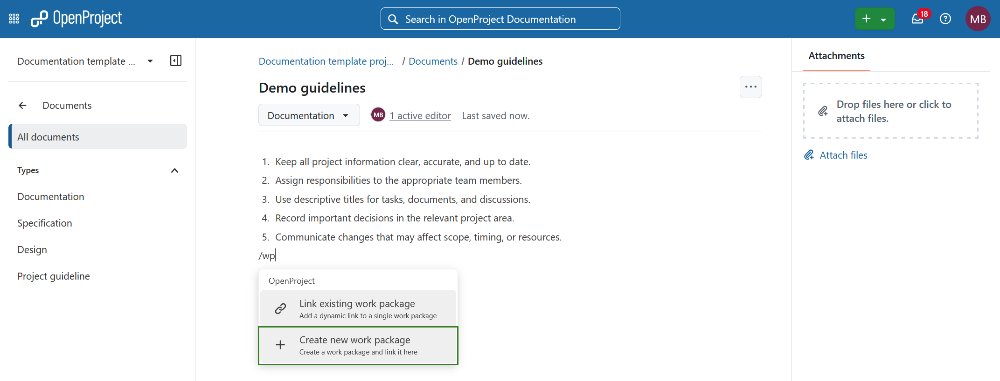

The newly created work package is linked directly in the document, keeping requirements, ideas, and planning notes connected to the work that follows from them.

### Filter work packages in Backlogs

OpenProject 17.9 introduces the first iteration of **filters in the [Backlogs view](../../user-guide/backlogs-scrum/)**, making it easier to focus on the work packages that matter.

The filters familiar from pages like the work package table or boards can be used by the team to reduce a larger set of work packages in the backlog and sprints. Users can simply search for work packages by subject or construct a complex filter set. Filters apply across sprints, backlog buckets, and the backlog inbox, with counters and story points reflecting the currently visible work packages.

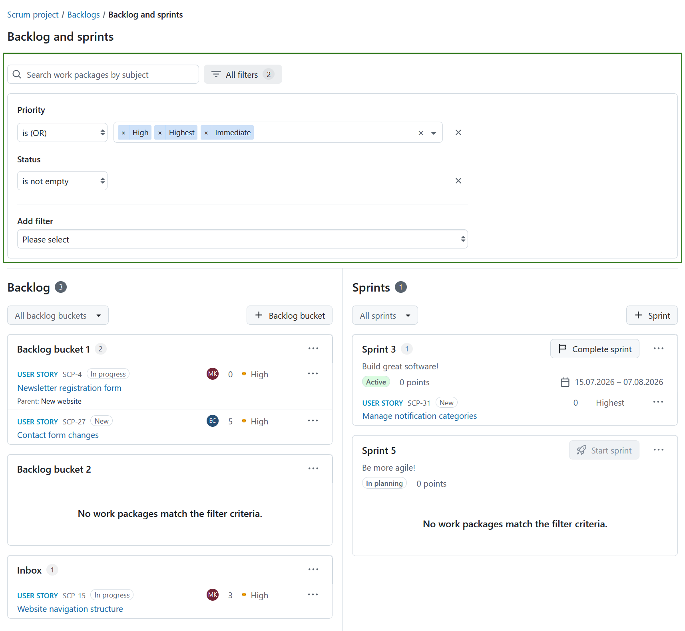

Work packages can still be moved and reordered while filters are active, making it possible to work with a focused subset without losing changes when returning to the full backlog.

> [!NOTE]
> **Saving a filtered Backlogs view is not yet available** in this first iteration.

### More control when deleting work packages with descendants

OpenProject 17.9 gives users more control when deleting work packages with descendants. Users can now choose to **delete only the selected work package** or **delete it together with all its descendants**.

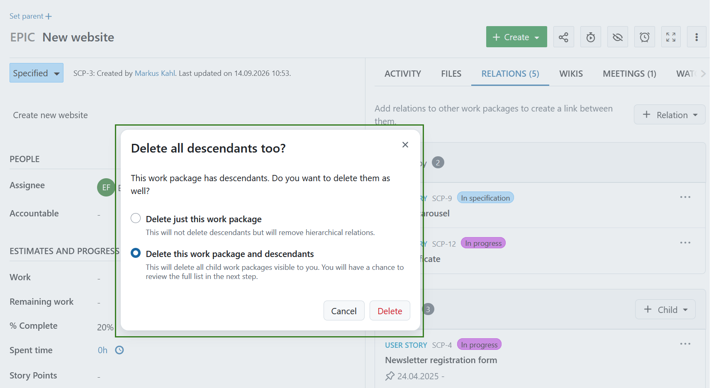

This helps prevent unintended deletion of entire work package hierarchies while preserving the option to remove them together when needed.

### Observed in versions

OpenProject 17.9 introduces a new **Observed in versions** field for work packages.

While **Target versions** describe the versions a work package is assigned to, **Observed in versions** can be used to record versions in which an issue has been observed. This is particularly useful for bugs that affect multiple product versions.

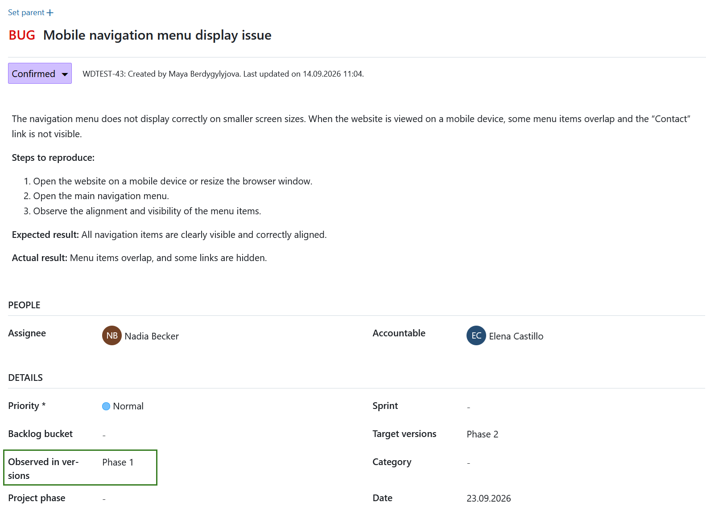

The field supports multiple versions, including closed versions, and is enabled by default for work packages of type **Bug**. It can also be enabled for other work package types.

### More MCP capabilities for AI assistants

OpenProject 17.9 further extends the capabilities of the [MCP Server](../../system-admin-guide/integrations/mcp-server/), making it easier and more efficient for AI assistants to work with OpenProject:

- **Track time through MCP:** AI assistants can now find, create, and update time entries.
- **Use work package display IDs:** AI assistants can work with the familiar work package IDs shown in OpenProject.
- **Get more compact search results:** Work package searches now return more compact responses by default, reducing unnecessary data and making more efficient use of the AI assistant's context. Full information can still be requested when needed.

### Improved PDF exports

OpenProject 17.9 brings several improvements to PDF exports, providing more complete project information and making it easier to create consistent exports.

- **More comprehensive [PMflex artefact exports](../../user-guide/work-packages/exporting/work-package-pdf/):** Project lifecycle information and **project budgets** can now optionally be included in the PDF. Budgets are presented as a cost breakdown, including unit and labor costs and their subtotals. This provides a more complete view of project planning, progress, and costs in a single artefact.

  Placeholder for the image once the feature is done 

  ! [ Project lifecycle and budget information in a PMflex artefact PDF export] (openproject_release_notes_17.9_pmflex_pdf_export.png)

- **[Default PDF export settings per work package type](../../system-admin-guide/manage-work-packages/work-package-types/pdf-export/):** Administrators can now define default settings for **Attributes, Contract, and PMflex artefact exports** for each work package type. Depending on the template, defaults can include options such as footer text, page orientation, table of contents, and hyphenation. These defaults are automatically applied when starting an export, reducing repetitive configuration and helping teams create more consistent PDFs.

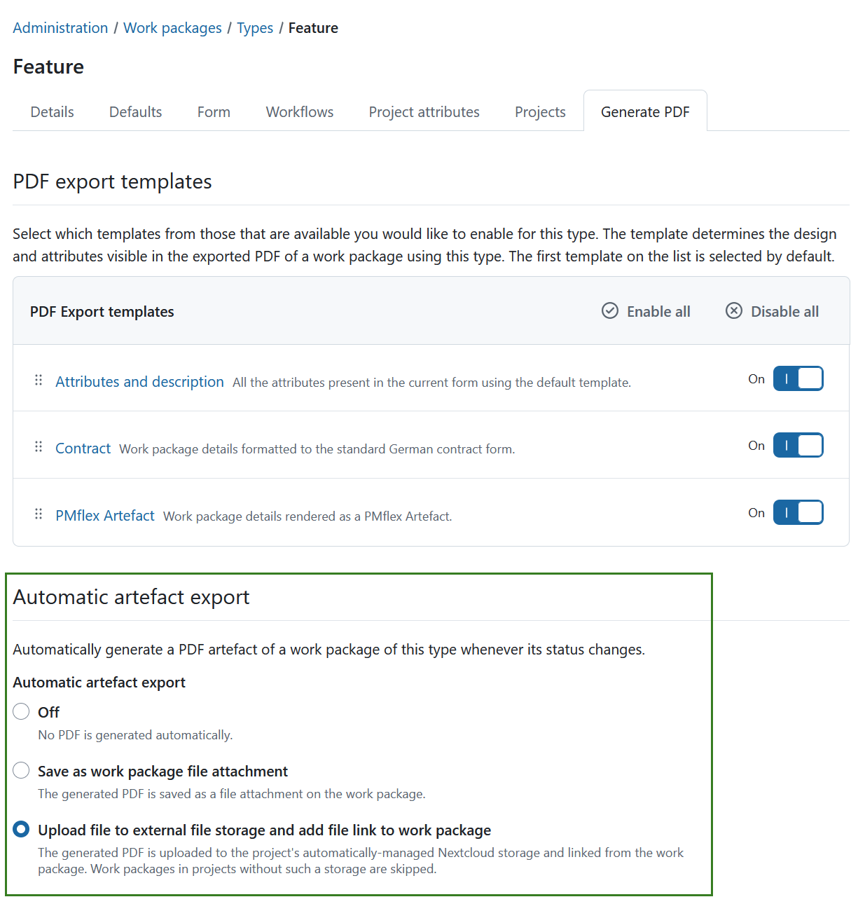

### Faster Jira migrations with real-time progress

OpenProject 17.9 improves the performance and transparency of **[migrations from Jira to OpenProject](../../installation-and-operations/jira-migration/)**.

Project data can now be imported using **concurrent jobs**, allowing the Jira Migrator to process work in parallel. The migration interface displays progress in real time, including concurrent jobs, so administrators can see that a longer-running migration is actively progressing.

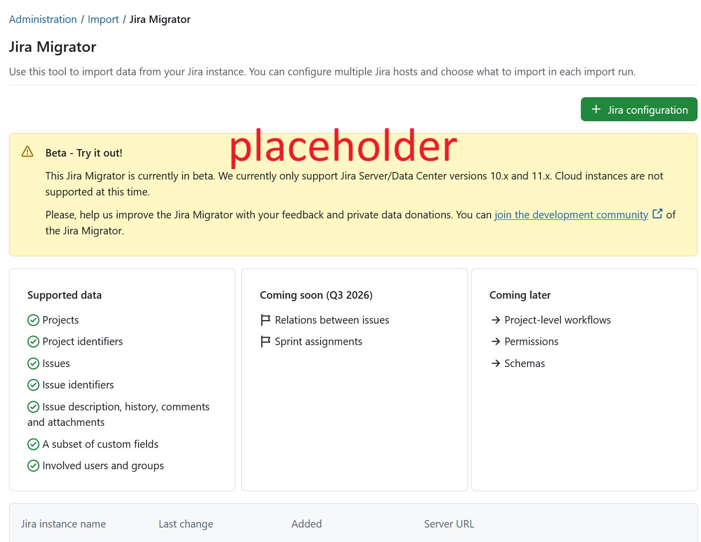

During the **Import data** stage, administrators can also abort a running migration. An aborted migration can later be **resumed** or **reverted**, providing more control over longer migration processes.

The final approval and revert stage cannot be aborted. At this stage, administrators instead choose whether to approve or revert the imported data.

### Meetings improvements

OpenProject 17.9 brings several improvements to [meetings](../../user-guide/meetings/), making it quicker to create meetings and easier to find them through the API.

New meetings and recurring meetings now default to **today**, with the start time set to the current time rounded up to the next half hour. This better supports creating an agenda for an ad-hoc meeting that is about to start or is already in progress.

The `GET /api/v3/meetings` endpoint now also supports **filtering meetings by title**. Searches use case-insensitive partial matching and also match the series title for occurrences of recurring meetings.

Existing meeting visibility and permission rules continue to apply.

### Cleaner project overview

The **[Subitems](../../user-guide/projects/project-home/project-widgets/)** widget on project overview pages is now shown only where it adds value. For projects, the widget is hidden when there are no subprojects. Users who have permission to create subitems can still do so through a new action in the page header.

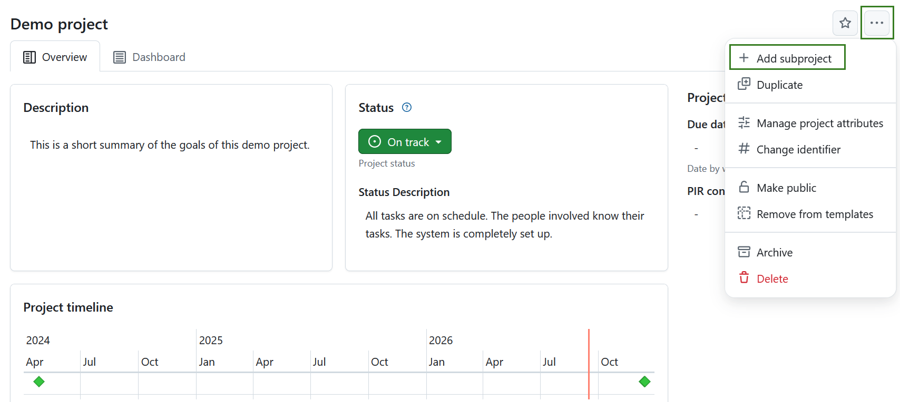

For programs and portfolios, the Subitems widget remains visible even when it is empty because subitems are an integral part of their structure.

### Allow planned labor to be entered in hours, days, weeks, or months

When adding **planned labor costs to a [budget](../../user-guide/budgets/)**, planned labor can now be entered in **hours, days, weeks, or months**. This makes it easier to estimate planned labor using the unit that best fits the work.

The user selector for planned labor costs has also been improved with an autocompleter, making it easier to find and select project members.

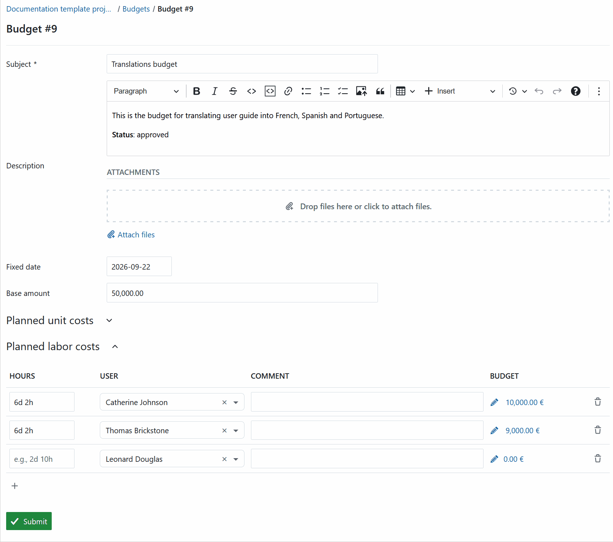

### Improved wiki page selection for wikis

XWiki users can now **[browse the wiki hierarchy directly](../../user-guide/work-packages/edit-work-package/#link-wiki-pages)** when selecting a page, making it easier to find content without knowing the page title in advance.

The hierarchy can be expanded to browse nested pages, while search remains available for quickly finding a specific page.

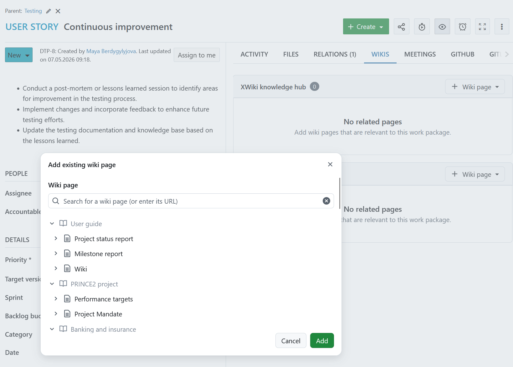

### Administration interface improvements

OpenProject 17.9 continues the modernization of administration pages with Primer UI components.

The **[Roles and permissions](../../system-admin-guide/users-permissions/roles-permissions/)** table has been updated and now includes quick filters. Administrators can search for roles and switch between **Global roles**, **Project roles**, and **All roles**.

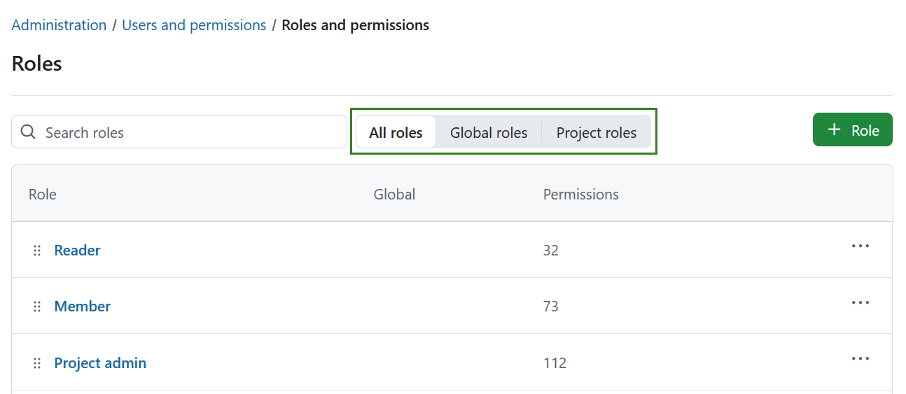

The **[Administration → Design → Interface](../../system-admin-guide/design/)** page has also been rebuilt using Primer components for a more consistent administration experience.

### Number custom fields now use minimum and maximum values

Configuration for [integer and floating-point custom fields](../../system-admin-guide/custom-fields/) has been updated to reflect the actual meaning of their validation settings.

Instead of **Min length** and **Max length**, administrators now configure:

- **Minimum value**
- **Maximum value**

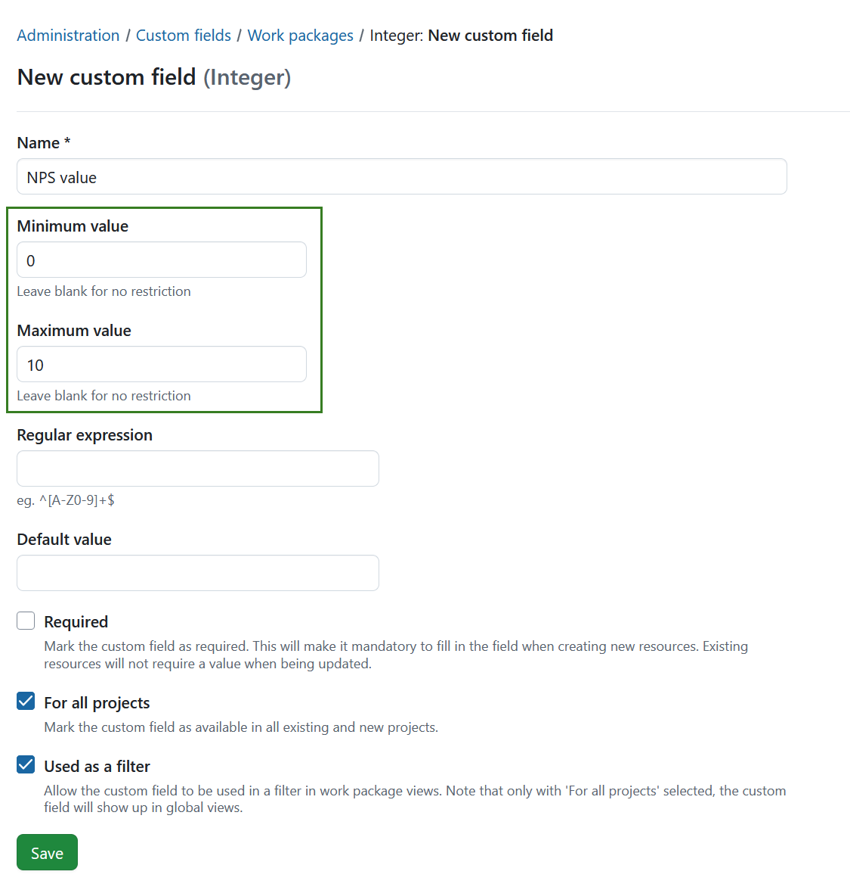

Integer fields accept integer limits, while floating-point fields support decimal values.
A migration has been added to try and convert the previous length values to their respective minimum and maximum values. In some cases, this migration may not be accurate. 
If you have used this feature in the past, please double-check your configuration.

### Configurable SAML clock drift

[SAML](../../system-admin-guide/authentication/saml/) administrators can now configure an **allowed clock drift** between the SAML Identity Provider and OpenProject.

This can help authentication continue to work in environments where the timestamps of the identity provider and OpenProject cannot be synchronized perfectly.

The `allowed_clock_drift` value can be configured as part of the SAML configuration and can also be supplied through an environment setting.

## Important updates and breaking changes

### Restrict password login for SSO users

OpenProject 17.9 gives administrators using [Single Sign-On](../../system-admin-guide/authentication/) more control over **password-based authentication**.

A new password login policy allows administrators to:

- **Allow password login for everyone** (default).
- **Disallow password login for SSO users**.
- **Disallow password login for everyone**.

For restricted configurations, selected users or groups can be added to a **break-glass allowlist**, ensuring that password-based administrative access remains possible when needed.

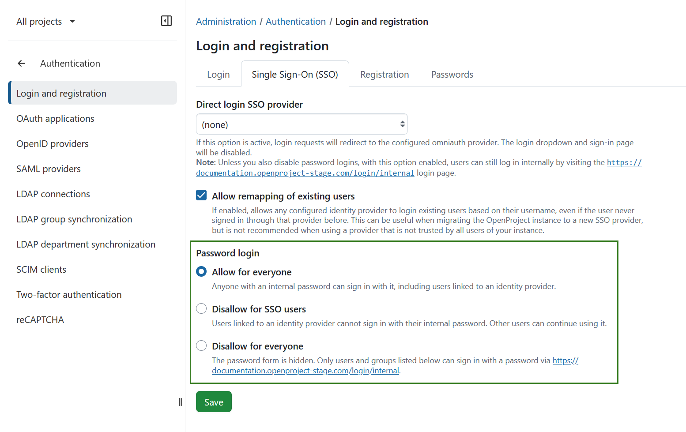

Existing environment-based configuration continues to be supported and takes precedence over configuration through the administration interface.

## Bug fixes and changes

<!-- Warning: Anything within the below lines will be automatically removed by the release script -->
<!-- BEGIN AUTOMATED SECTION -->

- Feature: 1st iteration of filters within the backlog \[[#74387](https://community.openproject.org/wp/74387)\]
- Feature: Allow to track time through MCP \[[#78402](https://community.openproject.org/wp/78402)\]
- Feature: Limit work package search results responses by default when using MCP \[[#78602](https://community.openproject.org/wp/78602)\]
- Feature: MCP: Allow searching work packages by their display id \[[#79255](https://community.openproject.org/wp/79255)\]
- Feature: Add the date alert feature to the community edition \[#[78407](https://community.openproject.org/wp/78407)\]
- Feature: Primerize role administration table \[[#79489](https://community.openproject.org/wp/79489)\]
- Feature: Create work package via slash command in a document \[[#67552](https://community.openproject.org/wp/67552)\]
- Feature: Create work package via text selection in a document \[[#78337](https://community.openproject.org/wp/78337)\]
- Feature: Introduce observed in versions \[[#76236](https://community.openproject.org/wp/76236)\]
- Feature: Primerise Interface tab of Admin/Design page \[[#56341](https://community.openproject.org/wp/56341)\]
- Feature: Show subitem widget only when subitems exist \[[#78005](https://community.openproject.org/wp/78005)\]
- Feature: Jira Migrator shows progress during import of projects, leveraging concurrency \[[#73094](https://community.openproject.org/wp/73094)\]
- Feature: Make meeting default date today. Time now (rounded) \[[#69574](https://community.openproject.org/wp/69574)\]
- Feature: Add search/filter support for meetings in the GET /api/v3/meetings endpoint \[[#79862](https://community.openproject.org/wp/79862)\]
- Feature: Give users the choice to not include descendants when deleting work packages \[[#77999](https://community.openproject.org/wp/77999)\]
- Feature: Global default settings for PDF exports by type \[[#78333](https://community.openproject.org/wp/78333)\]
- Feature: Allow planned labor to be entered in hours, days, weeks, or months \[[#78544](https://community.openproject.org/wp/78544)\]
- Feature: PMflex Artefact PDF: Include project phases and budgets \[[#78561](https://community.openproject.org/wp/78561)\]
- Feature: Allow differing time stamps between SAML IdP and SP (OpenProject) within margin (allowed\_clock\_drift) \[[#79019](https://community.openproject.org/wp/79019)\]
- Feature: Allow restricting password login for SSO authenticated users \[[#79300](https://community.openproject.org/wp/79300)\]
- Feature: For number custom fields, replace min and max length with minimum and maximum values \[[#79759](https://community.openproject.org/wp/79759)\]
- Feature: Add browsing in the tree view when no search is conducted \[[#75610](https://community.openproject.org/wp/75610)\]
- Bugfix: Starting a sprint fails with HTTP 422 and generic error banner \[[#75958](https://community.openproject.org/wp/75958)\]
- Bugfix: &quot;Search&quot; placeholder is missing on the dropdown on sprints and backlog buckets \[[#76641](https://community.openproject.org/wp/76641)\]
- Bugfix: Backlogs: autoscroll doesn&#39;t work on DnD on Chrome/Android \[[#77991](https://community.openproject.org/wp/77991)\]
- Bugfix: Display deleted custom field journals in the Project activities \[[#78432](https://community.openproject.org/wp/78432)\]
- Bugfix: Display the correct activity message when the user doesn&#39;t have the permission to see admin only custom field journals. \[[#78439](https://community.openproject.org/wp/78439)\]
- Bugfix: Spacing disappeared between the \[Start sprint\] button and the sprint date in the backlog \[[#78595](https://community.openproject.org/wp/78595)\]
- Bugfix: Sprint report: breadcrumb and title overlap with long titles \[[#78958](https://community.openproject.org/wp/78958)\]
- Bugfix: Sprint report: long titles take too much space on mobile as they are not truncated \[[#78963](https://community.openproject.org/wp/78963)\]
- Bugfix: Fix description of tools so that LLM understand that filters can be an array of IDs \[[#75407](https://community.openproject.org/wp/75407)\]
- Bugfix: Documents: two wps highlighted at once in wp dropdown on ios safari \[[#75812](https://community.openproject.org/wp/75812)\]
- Bugfix: Documents: size menu on wp link closes automatically when tapped on ios safari \[[#75815](https://community.openproject.org/wp/75815)\]
- Bugfix: Documents: overflow in the work package preview when the wp type is long \[[#77690](https://community.openproject.org/wp/77690)\]
- Bugfix: Context menu scrolls over header on mobile \[[#77693](https://community.openproject.org/wp/77693)\]
- Bugfix: Documents: issues with tiny work package link preview on mobile iOS \[[#77720](https://community.openproject.org/wp/77720)\]
- Bugfix: Creating a work package via slash command in a list should render an inline, &quot;regular&quot; sized work package link \[[#78973](https://community.openproject.org/wp/78973)\]
- Bugfix: Linking a work package inside a headline via slash command looks broken \[[#78974](https://community.openproject.org/wp/78974)\]
- Bugfix: Resizing menu of work package links cut off at the bottom of the document \[[#79353](https://community.openproject.org/wp/79353)\]
- Bugfix: Values in dropdown not shown for required field \[[#79747](https://community.openproject.org/wp/79747)\]
- Bugfix: Paragraph in Firefox document is infinite in width \[[#76694](https://community.openproject.org/wp/76694)\]
- Bugfix: Cleanup job can delete Attachments uploaded to a new work package when attachments drag and drop field is missing during the upload  \[[#76870](https://community.openproject.org/wp/76870)\]
- Bugfix: Updating a document title does not update the browser page title \[[#77618](https://community.openproject.org/wp/77618)\]
- Bugfix: First headline not rendered correctly when opening a document \[[#77648](https://community.openproject.org/wp/77648)\]
- Bugfix: When work packages are grouped by X, it&#39;s not possible to drag and drop an item to the last line inside the same group \[[#79220](https://community.openproject.org/wp/79220)\]
- Bugfix: Search is missing an index for work\_package\_semantic\_aliases which makes it slow \[[#79497](https://community.openproject.org/wp/79497)\]
- Bugfix: &quot;Only changes&quot; work packages activity filter hides target and observed-in version changes \[[#79498](https://community.openproject.org/wp/79498)\]
- Bugfix: When work packages are grouped by X, drag and drop of items on the last position between the groups works only downwards, not upwards \[[#79741](https://community.openproject.org/wp/79741)\]
- Bugfix: When entering days it defaults to 24h instead of workdays \[[#78588](https://community.openproject.org/wp/78588)\]
- Bugfix: Children ticket time entries are not reassigned when parent ticket is deleted \[[#79479](https://community.openproject.org/wp/79479)\]
- Bugfix: \[Accessibility\] Colour blind users cannot distinguis the overview graph bars \[[#64237](https://community.openproject.org/wp/64237)\]
- Bugfix: Unnecessary loading indicator and success message on going from team planner to work packages list \[[#76534](https://community.openproject.org/wp/76534)\]
- Bugfix: Milestones in the project timeline widget cannot be opened with a keyboard or screen reader \[[#79044](https://community.openproject.org/wp/79044)\]
- Bugfix: Inconsistent usage for &quot;built-in&quot; labels \[[#79059](https://community.openproject.org/wp/79059)\]
- Bugfix: Sprints are not clickable in timeline widget \[[#79411](https://community.openproject.org/wp/79411)\]
- Bugfix: &#39;No items&#39; shown on wiki tree view is not translated  \[[#79389](https://community.openproject.org/wp/79389)\]
- Bugfix: Updating the &#39;Custom touch icon&#39; actually update the &#39;Custom favicon&#39; \[[#79757](https://community.openproject.org/wp/79757)\]
- Bugfix: Jira import errors are not legible in dark mode \[[#79584](https://community.openproject.org/wp/79584)\]
- Bugfix: Flicker on page when switching between upcoming and past tabs \[[#60296](https://community.openproject.org/wp/60296)\]
- Bugfix: Using the past filter on Meeting index always shows results for &#39;My meetings&#39; \[[#78865](https://community.openproject.org/wp/78865)\]
- Bugfix: Changed schedule does not import/update in OX/Mailbox.org \[[#79337](https://community.openproject.org/wp/79337)\]
- Bugfix: Round corner on the not header box in File Storages \[[#52792](https://community.openproject.org/wp/52792)\]
- Bugfix: Accessibility: Primer Text Field clear button does not show tooltip \[[#69916](https://community.openproject.org/wp/69916)\]
- Bugfix: Popup for copying Calendar url disappears after 5 secs (too short) \[[#73512](https://community.openproject.org/wp/73512)\]
- Bugfix: Assignee filter does not recognize assignees of shared work packages \[[#73908](https://community.openproject.org/wp/73908)\]
- Bugfix: Seeded meeting agenda items description is not translated \[[#74752](https://community.openproject.org/wp/74752)\]
- Bugfix: HTML numeric entities shown instead of Cyrillic characters in &quot;My spent time&quot; tooltip \[[#75277](https://community.openproject.org/wp/75277)\]
- Bugfix: Sibling morph breaks after OPCE-\* replaceWith in dialog preview \[[#76653](https://community.openproject.org/wp/76653)\]
- Bugfix: Page takes a long time to load and does not sort correctly when removing &#39;Start time&#39; from &#39;All filters&#39; \[[#76655](https://community.openproject.org/wp/76655)\]
- Bugfix: Related work package table configuration shows two non-clickable tabs \[[#77073](https://community.openproject.org/wp/77073)\]
- Bugfix: Required user custom fields interfere with LDAP group and department synchronisation \[[#77192](https://community.openproject.org/wp/77192)\]
- Bugfix: Project selector cuts off all subsequent projects \[[#77481](https://community.openproject.org/wp/77481)\]
- Bugfix: Can&#39;t upload IFC file when S3 storage is configured \[[#78085](https://community.openproject.org/wp/78085)\]
- Bugfix: Description field of (new) forum is too small. \[[#78503](https://community.openproject.org/wp/78503)\]
- Bugfix: MeetingOutcome invalid kind value crashes with 500 instead of 422 \[[#78526](https://community.openproject.org/wp/78526)\]
- Bugfix: RecurringMeeting occurrence init crashes with 500 on a draft template \[[#78527](https://community.openproject.org/wp/78527)\]
- Bugfix: UserWorkingHours create crashes with 500 when a weekday is nil \[[#78528](https://community.openproject.org/wp/78528)\]
- Bugfix: wiki\_page\_links pagination silently ignores offset \[[#78529](https://community.openproject.org/wp/78529)\]
- Bugfix: Writing end\_time on a time entry crashes with NoMethodError (500) \[[#78530](https://community.openproject.org/wp/78530)\]
- Bugfix: time\_entries hours-to-duration serialization truncates instead of rounds \[[#78531](https://community.openproject.org/wp/78531)\]
- Bugfix: Backup via web ui is missing the option to include attachments \[[#78559](https://community.openproject.org/wp/78559)\]
- Bugfix: User Filter cannot show Departments, Groups, Projects and Status \[[#78800](https://community.openproject.org/wp/78800)\]
- Bugfix: Groups: Subgroup does not inherit parent group&#39;s project role assignments despite correctly set Parent group \[[#79043](https://community.openproject.org/wp/79043)\]
- Bugfix: Migration from 17.3.1 to 17.8 fails \[[#79482](https://community.openproject.org/wp/79482)\]
- Bugfix: Tooltip for &quot;My spent time&quot; entries that are only partially visible is shown in wrong place \[[#79486](https://community.openproject.org/wp/79486)\]
- Bugfix: Project attribute removed from projects after update of attribute section in administration \[[#79591](https://community.openproject.org/wp/79591)\]
- Bugfix: When trying to login with password, and password login being disabled for SSO users, the error message does not say about this \[[#79693](https://community.openproject.org/wp/79693)\]
- Bugfix: When a wiki page is added to the WP description on the WP page, the page is not shown on the mentioned description box \[[#78133](https://community.openproject.org/wp/78133)\]
- Bugfix: Persist collaped state for the wiki blocks when wiki tab is updated \[[#78978](https://community.openproject.org/wp/78978)\]
- Bugfix: Return URL is not visible if a user enters their own client ID for wiki integration \[[#79508](https://community.openproject.org/wp/79508)\]

<!-- END AUTOMATED SECTION -->
<!-- Warning: Anything above this line will be automatically removed by the release script -->

## Contributions
A very special thank you goes to our sponsors for this release.
Also a big thanks to our Community members for reporting bugs and helping us identify and provide fixes.
Special thanks for reporting and finding bugs go to Sonita Soth, Hagen Mahnke, Daniel Paulo Dos Santos, Max Tachkov, Tobias Nowakow, Michael Gillen, Jürgen Tauschl, Raphael Zoppoth, Paul Grimes.

Last but not least, we are very grateful for our very engaged translation contributors on Crowdin, who translated quite a few OpenProject strings!
Would you like to help out with translations yourself?
Then take a look at our translation guide and find out exactly how you can contribute.
It is very much appreciated!

