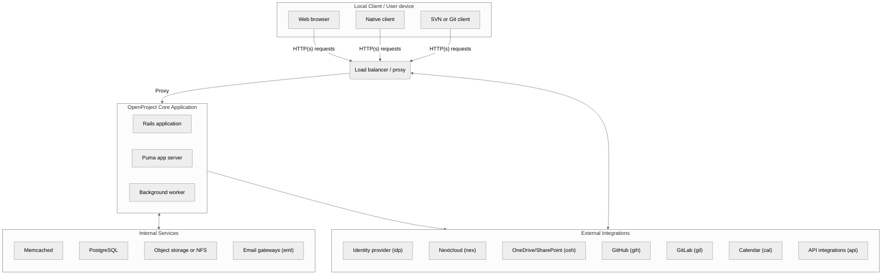
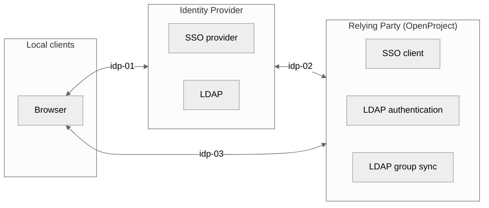
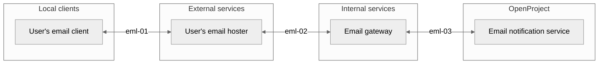
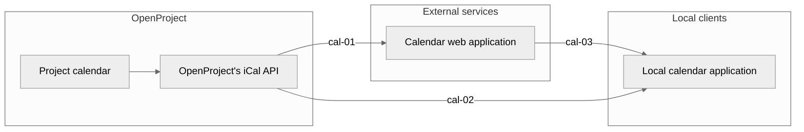
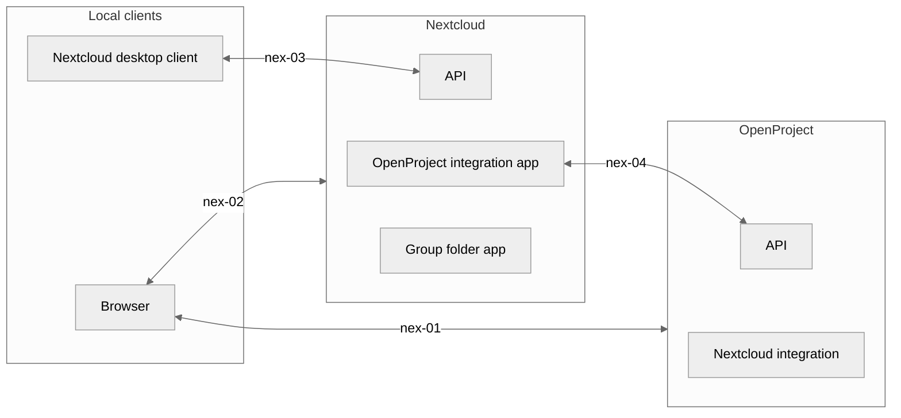
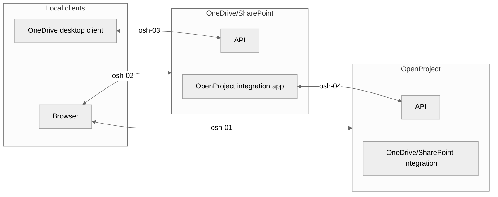
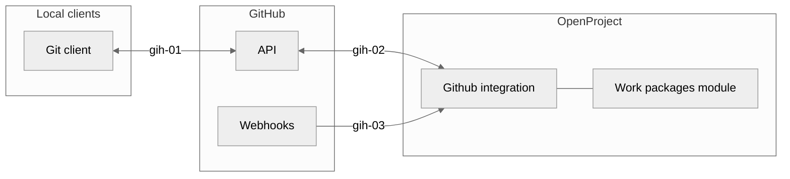
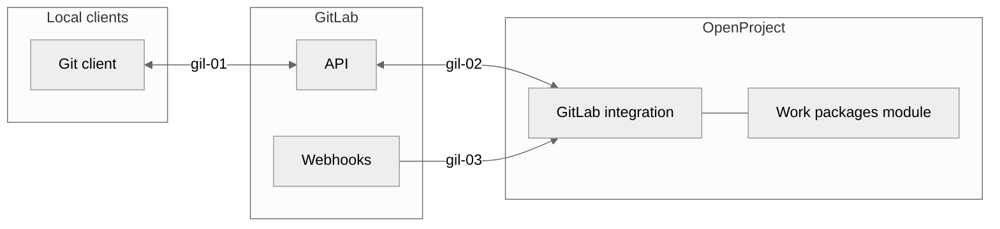
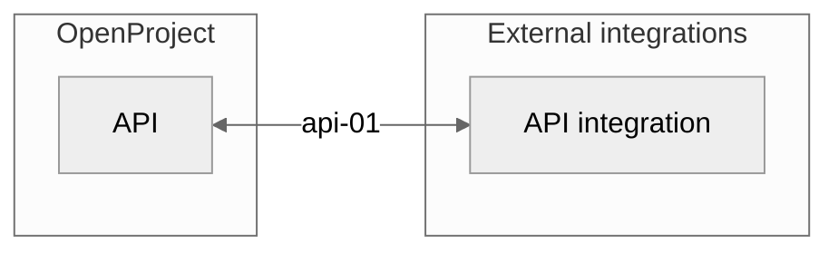

---
sidebar_navigation:
  title: Processing of personal data
  priority: 500
description: Documentation of the data flows of personal data in OpenProject
keywords: GDPR, data flow, processing personal data, data privacy information
---
# Processing of personal data

Status of this document: 2024-01-10

## Purpose of this document

This document outlines how personal data flows through the OpenProject software and aims to assist data controllers in organizations using OpenProject on their own infrastructure in creating GDPR-compliant data protection documentation.

> **Note:** Customers of the [OpenProject GmbH](https://www.openproject.org/legal/imprint/) that subscribed to the [OpenProject Enterprise Edition Cloud](https://www.openproject.org/enterprise-edition/) (a software-as-a-service) please check the following legal documents:
>
> * [Privacy Policy](https://www.openproject.org/legal/privacy/)
> * [Data Processing Agreement](https://www.openproject.org/legal/data-processing-agreement/)
> * [Sub-Processors](https://www.openproject.org/legal/data-processing-agreement/sub-processors/)
> * [Technical and Organizational Data Security Measures](https://www.openproject.org/legal/data-processing-agreement/technical-and-organizational-data-security-measures/)

## Groups of personal data

OpenProject is a project management and team collaboration software. The personal data processed by the software can be categorized into four different groups:

- **User master data:** essential for administering user accounts.
- **Functional assignments:** connects users to various entities such as work packages, projects, teams, budgets, time logs, etc.
- **Logfiles:** automatically generated records of user activity.
- **Content data:** Person mentioned in text or shown in pictures. Those persons do not necessarily need to be a user.

### A: Usage without user account

Depending on the individual [permission](../../system-admin-guide/users-permissions/) and [authentication](../../system-admin-guide/authentication/) settings an OpenProject project can be accessed for read-only [anonymously](../../system-admin-guide/users-permissions/roles-permissions/#anonymous) without a user account. The [OpenProject community platform](https://community.openproject.org) is an example of an OpenProject installation where individual projects where set to public.

Anonymity is not complete because the underlying webserver might still generate its common logfile (weblog).

### B: User master data

To sign-in to the OpenProject platform, the [registration of a user account](../../system-admin-guide/users-permissions/users/#create-users) is required. For registered user's the following personal data are processed:

#### User profile (bu-01)

- Name
- Username
- Avatar

#### User settings (bu-02)

- Email address
- Notification settings
- Email reminder settings
- Language settings
- Time zone settings
- Display settings (contrast modes, custom themes)

#### User authentication (bu-03)

* Access tokens
* User sessions
* Password (encrypted)
* Phone number for sending one-time passwords via SMS
* OATH secret codes

#### User notification settings (bu-04)

- Default notification settings
- Project-specific notification settings
- Default email reminder settings
- Project-specific email reminder settings

#### User roles and permissions (bu-05)

- Group memberships
- Project roles
- Global roles

#### User rates (bu-06)

* Default hourly rate
* Hourly rate per project

**Note:** Administrators can add so-called [custom fields](../../system-admin-guide/custom-fields/) to their OpenProject installation which extend the data fields of a user.

### C: Using OpenProject

Depending on the individual use and permissions of the user the following personal data is processed:

#### Boards (cb-01)

- Assignment of a person to a work package (author, assignee, responsible, user custom fields)
- Change history
- Person mentioned in a board

#### Budgets (cb-02)

- Assignments of a person to a budget
- Change history
- Person mentioned in a budget description

#### Comments (cc-01)

- Author of a comment
- Change history
- Reactions of a user to a comment
- Person mentioned in a comment

#### Email notifications (ce-01)

- Email header including sender and recipients
- Person mentioned in an email

#### Files (cf-01)

- Assignment of a files to an uploader or creator
- Change history
- Person mentioned in a file (incl. file attributes)

#### Meetings (cm-01)

- Assignment of a person (author, invitee, participant) to a meeting
- Change history
- Person mentioned in an agenda item

#### Projects (cp-01)

- Assignment of a person to a project (author, project member)

- Change history

- Person mentioned in a project overview

- Person mentioned in a project attribute

- Persons mentioned in a project status information

#### Project calendars (cp-02)

- Assignment of objects shown in the calendar (meetings, work packages, versions, milestones) to a person
- Change history
- Person mentioned in a calendar item

#### Project news (cp-03)

- Author of a project news
- Change history
- Person mentioned in a project news

#### Team planner (ct-01)

- Assignment of a work package to a person
- Change history
- Persons mentioned in team planners

#### Time tracking (ct-02)

- Assignments of a time entry to a person
- Change history
- Person mentioned in a time entry

#### Wiki pages (cw-01)

- Assignment of an wiki page edit to a person (author, contributor)
- Change history
- Person mentioned in a wiki page

#### Work packages (cw-02)

- Assignment of a work package to a person
- Change history
- Person mentioned in a list or project schedule
- Person mentioned in an attribute or text field
- Person mentioned in a linked file
- Person mentioned in a linked pull request (i.e. GitHub or GitLab)

### D: Logging

#### Logged information

Activities in OpenProject are automatically journalized. It allows users to understand the change history of those objects (e.g. the [baseline comparison](../../user-guide/work-packages/baseline-comparison/)).

Independently of the change history every interaction (i.e. web request) of a browser or other client results in an entry written to the server logfiles. These files support the operation of the application as they provide information on faulty behavior of the system (i.e. bugs and lack of performance).

Those log files contain the following person related data:

* id of the user performing the request
* time of the request
* url called
* parameters sent to the server as part of the request which comprises the user's input in the form of e.g. work package title and description, wiki page content, comment text, SAML user information etc.

**Note:** Passwords are not logged in plain text.

The data listed above is generated upon entering the application. When actually processing the request within the application, events deemed noteworthy by the developers might be logged additionally. An example of this are failed login attempts.

#### Retention period

Logfiles are automatically removed based on a first-in-first-out mechanism. This is done to limit the disk space which ensures the server's operation and at the same time serves as a means to erase the log entries once they have served their purpose of supporting operations. By default the retention period is determined by the size of the logfile. Once the logfile reaches its storage limit, the oldest entries are removed.

As such, the log entries are not kept for a fixed period of time. If there are a lot of requests, old entries are removed faster then if there are less requests. Administrators of an OpenProject installation might decide to configure a different behavior that factors in the age of the log entries.

#### Technical documentation

Detailed technical information about the logging mechanism can be found in the operations documentation:

* [Monitoring your OpenProject installation](../../installation-and-operations/operation/monitoring/)

> **Note:** Additional logfiles might be generated by systems that are part of the used network infrastructure (e.g., load balancers, proxying servers, or other network components). These are out of scope for this documentation but they often contain additional information such as the IP address. On the other hand, since TLS is employed for all connections by default, those intermediary systems do not have access to the full request body so they are not able to see for example the request parameters.

## Flows of personal data

### A: System overview

The following diagram provides an overview of the flows of personal data in OpenProject. This applies to the different installation methods.

As a web application, the primary data flow is between the user's web browser (or attached API clients) through an external proxying web server (this might be a load balancer or proxying server). Depending on the individual setup the proxying server is responsible for terminating TLS connections for the course of this document - although encrypted connections between Load balancer and Puma server are possible. In case of packaged or Kubernetes installations, this proxying server might be part of the OpenProject stack (e.g., an Apache2 packaged installation server or nginx ingress).

The external web server acts as a proxy/reverse-proxy for the OpenProject Puma app server, relaying requests for it to handle and respond. In the course of the request, access to external services such as the PostgreSQL database, a caching server, or attached storages might be performed. In case of S3-compatible object storage set ups, OpenProject performs calls to the object storage to put or request files from it. Likewise, for network-attached storages linked into the application, underlying network requests are performed. These are out of scope for this evaluation, as they are provided and maintained by the operator of the system.

In the course of using the application, background tasks are enqueued in the database such as outgoing emails, cleanup tasks, or notification processing. These tasks are performed in a separate process, the background worker queue. This process accesses the same services as the application server process to access or modify data. It might connect to external integrations such as a [Nextcloud](../../user-guide/file-management/nextcloud-integration/) or [OneDrive/SharePoint](../../user-guide/file-management/one-drive-integration/) instance to set up file sharings depending on actions performed by the users.

**Exemplary request flow**

- **User request**: An end-user sends an HTTPS request to the load balancer or proxying server.
- **Load balancer**: The external load balancer or proxying server receives the request, terminates TLS, and forwards the HTTP request to the Puma application server.
- **Puma app server**: Processes the request and invokes the appropriate Rails middlewares and controller.
- **Rails application**:
  - Authenticates the user according to the mechanisms outlined in the [secure coding guidelines](../../development/concepts/secure-coding)
    - Validates session and input data
    - Responsible for error handling, logging, and auditing aggregation

  - Retrieves or updates resources to the PostgreSQL database via models
    - Calls or interacts with external services for requests, such as retrieving files or attachments from object storage

  - Renders the appropriate views
  - **Response**: Sends the HTTP response back through the Puma server and load balancer to the end-user.

- **Background worker:** Operates on periodical background data, or performs actions requested by the web request of user (sending emails, exporting data, communicating with external services)

### B: Identity provider (idp)

#### Overview

#### Purpose

* Centralized identity and access management
* Single sign on and single sign out ([OIDC](../../system-admin-guide/authentication/openid-providers/), [SAML](../../system-admin-guide/authentication/saml/))
* [Syncing LDAP groups with OpenProject groups](../../system-admin-guide/authentication/ldap-connections/ldap-group-synchronization/)  

#### Processed data

* `bu-01`
* `bu-02`
* `bu-03`
* `bu-05` (group memberships trough LDAP groups)

#### Security measures

* `idp-01` TLS
* `idp-02` TLS
* `idp-03` TLS

### C: Email (eml)

#### Overview

#### Purpose

* Create a new work package by sending an email to a configured email address.
* Adding a comment to an existing work package by answering to an email notification.
* Sending email notifications about updates in OpenProject (e.g [email reminder](../../system-admin-guide/emails-and-notifications/), meeting updates, project invitation, wiki notifications)

#### Processed data

* `bu-01`
* `bu-04`
* `bu-05`
* `cc-01`
* `cm-01`
* `cp-01`
* `cw-02`

#### Security measures

* `eml-01` TLS (not controlled by the OpenProject system)

* `eml-02` TLS (not controlled by the OpenProject system)

* `eml-03` TLS (encryption can be activated in the email settings in the OpenProject Administration)

  **Note**: OpenProject does not support end-to-end encryption using GPG or S/MIME.

### D: Calendar (cal)

#### Overview

#### Purpose

* Users can import project calendars into their calendar application using the iCal format.

#### Processed data

* `bu-01`
* `bu-03 (iCalendar access tokens)`
* `cm-01`
* `cp-02`
* `ct-01`

#### Security measures

* `cal-01` TLS
* `cal-02` TLS (not controlled by the OpenProject system)
* `cal-03` TLS (not controlled by the OpenProject system)

### E: Nextcloud (nex)

#### Overview

#### Purpose

* Users can link files stored in Nextcloud with work packages in OpenProject.
* Project folders in Nextcloud can be managed in OpenProject (create, delete, update, user permissions).

#### Processed data

* `bu-01`
* `bu-03`
* `cf-01`

#### Security measures

* `nex-01` TLS
* `nex-02` TLS
* `nex-03` TLS
* `nex-04` TLS

### F: OneDrive/SharePoint (osh)

#### Overview

#### Purpose

* Users can link files stored in OneDrive/SharePoint with work packages in OpenProject.

#### Processed data

* `bu-01`
* `bu-03`
* `cf-01`

#### Security measures

* `osh-01` TLS
* `osh-02` TLS
* `osh-03` TLS
* `osh-04` TLS

### G: GitHub (gih)

#### Overview

#### Purpose

- Connect pull requests in GitHub with work packages in OpenProject.
- Show the status of pull requests in related work packages.

#### Processed data

* cw-02

#### Security measure

* `gih-01` TLS
* `gih-02` TLS
* `gih-03` TLS

### H: GitLab (gil)

#### Overview

#### Purpose

- Connect merge requests in GitLab with work packages in OpenProject.
- Connect issues in GitLab with work packages in OpenProject.
- Show the status of merge requests in related work packages.

#### Processed data

* cw-02

#### Security measure

* `gil-01` TLS
* `gil-02` TLS
* `gil-03` TLS

### I: API integrations (api)

#### Overview

#### Purpose

- Create, read, update and delete data from OpenProject.

#### Processed data

* All data the user has permissions to.

> **Note**: Please see the [API documentation](../../api/) for further information about all API endpoints.

#### Security measure

* `api-01` TLS

## Use of technical cookies

OpenProject makes use of technical cookies to identity the browser client and/or remember information such as 2FA login state. The core application makes use of these cookies:

| **Cookie name**                                | **Description**                                              | **Expiry**                                                   | **Security flags**                                    | **Implementation**                                           |
| ---------------------------------------------- | ------------------------------------------------------------ | ------------------------------------------------------------ | ----------------------------------------------------- | ------------------------------------------------------------ |
| `_open_project_session` (name is configurable) | contains the information about the logged in user as well as information stored between requests on the user's choices (e.g. the filters for costs are in part stored there) | Session  + configurable server-sideTTL                  | secure httponly Samesite=Lax encrypted | [Code ref](https://github.com/opf/openproject/blob/release/13.0/config/initializers/session_store.rb#L34-L39) |
| `autologin` (name is configurable)             | (Optional feature, requires opt-in under Administration > Authentication settings)  enables the user to automatically log in again after the session expired (e.g. because the browser was closed). It is set when the user checks the '*Stay logged in*' box in the login form.  | Cookie 1 year + server-side token N days (configurable) | secure httponly Samesite=Lax encrypted | [Code ref](https://github.com/opf/openproject/blob/release/13.0/app/controllers/concerns/accounts/user_login.rb#L19C1-L29) |
| `op2fa_remember_token`                         | the presence of that cookie suppresses the need for the user to provide a second factor upon login for N days (configurable by administration) if the user selects to do so when entering the 2fa information. | N days (configurable)                                        | secure httponly Samesite=Lax encrypted | [Code ref](https://github.com/opf/openproject/blob/release/13.0/modules/two_factor_authentication/app/controllers/concerns/two_factor_authentication/remember_token.rb#L28-L34) |

## Deletion of personal data

Whenever a user in OpenProject is fully deleted, the system scrubs and removes all user master data, all functional assignments, and all references to a user in the change histories. All actions performed in the name of the user are being replaced with a singular "**Deleted user**" reference in order to maintain integrity of database references, such as being an author of a work package that remains. Finally, the user data itself will be deleted, removing all structural traces of PII in the system.

**Note:** Due to the user references changing, respective cache keys for information such as work packages or projects are invalidated automatically.

**Note:** Deleting a user account is a permanent action and cannot be reversed.

For more information on user account deletion, please see [the user administration guide](../../system-admin-guide/users-permissions/users/#delete-users).

**Note:** Input created by a user such as text or comments cannot be deleted or scrubbed in an automated fashion. The content stays but will be referenced to the non-personal "Deleted User".

**Note:** Persons mentioned in text or shown in uploaded pictures cannot be deleted or scrubbed in an automated fashion. All references to persons in text or pictures need to be deleted either one by one or by deleting the project in total. Memory references in memcached might still refer to (invalidated) user data until it is being reassigned.

**Note:** Logfiles might retain personal data for the configured retention period of the logfile. See "D: Logging" above.
